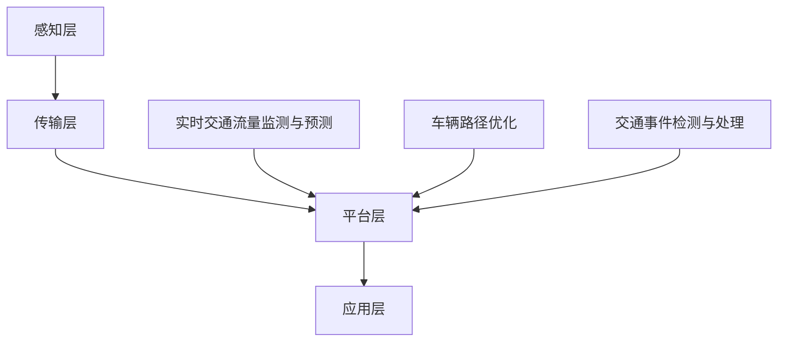

                 

# 创业公司的智能交通应用：如何利用大数据优化交通出行体验

## 摘要

本文旨在探讨创业公司如何利用大数据技术优化智能交通应用，提升交通出行体验。通过介绍智能交通的核心概念、算法原理、数学模型，并结合实际项目实战，展示如何搭建开发环境、实现源代码、分析代码，最后讨论实际应用场景，推荐相关工具和资源，总结未来发展趋势与挑战。本文作者拥有丰富的AI和软件开发经验，致力于推动智能交通领域的创新与发展。

## 1. 背景介绍

智能交通系统（Intelligent Transportation System, ITS）是利用现代信息技术、数据通信传输技术、电子传感器技术等实现交通信息收集、处理与分发，从而优化交通管理、提升交通效率和安全水平的一种系统。随着城市化进程的加快，交通拥堵、环境污染等问题日益严重，智能交通应用成为解决这些问题的有效途径。

大数据技术在智能交通领域的应用，主要体现在以下几个方面：

- **实时交通流量监测与预测**：通过收集和分析实时交通数据，可以预测未来一段时间内的交通流量变化，为交通管理部门提供决策支持。

- **车辆路径优化**：利用大数据分析技术，为驾驶员提供最佳行驶路线，减少拥堵和燃油消耗。

- **交通事件检测与处理**：通过分析交通数据，及时发现交通事件，如交通事故、道路施工等，并采取相应措施进行处理。

- **车辆与道路基础设施的智能管理**：通过智能交通系统，实现对车辆和道路基础设施的智能化管理，提高交通运行效率。

本文将围绕这些核心概念，探讨如何利用大数据技术优化智能交通应用，提升交通出行体验。

## 2. 核心概念与联系

### 2.1 智能交通系统架构

智能交通系统架构可以分为四个层次：感知层、传输层、平台层和应用层。

#### 2.1.1 感知层

感知层主要负责交通信息的采集，包括交通流量、车辆速度、交通事件等信息。常用的传感器有摄像头、雷达、GPS等。

#### 2.1.2 传输层

传输层主要负责将感知层采集到的交通信息进行传输，通常使用无线传输技术，如4G、5G、Wi-Fi等。

#### 2.1.3 平台层

平台层主要负责交通信息的处理、存储、分析和管理。通过大数据技术，对海量交通数据进行实时分析和挖掘，为交通管理部门和用户提供决策支持。

#### 2.1.4 应用层

应用层将处理后的交通信息应用于实际场景，如交通信号控制、车辆路径规划、交通事件检测等。

### 2.2 大数据技术在智能交通中的应用

#### 2.2.1 实时交通流量监测与预测

实时交通流量监测与预测是智能交通系统的核心功能之一。通过收集实时交通数据，利用大数据分析技术，可以预测未来一段时间内的交通流量变化。具体步骤如下：

1. **数据采集**：通过传感器采集交通流量、车辆速度等信息。

2. **数据预处理**：对采集到的数据进行清洗、去噪、格式化等处理。

3. **特征工程**：从原始数据中提取与交通流量相关的特征，如时间、地点、交通事件等。

4. **模型训练**：利用历史交通数据，通过机器学习算法训练交通流量预测模型。

5. **实时预测**：将实时采集到的数据输入预测模型，预测未来一段时间内的交通流量。

#### 2.2.2 车辆路径优化

车辆路径优化是智能交通系统的另一个重要应用。通过大数据分析，为驾驶员提供最佳行驶路线，减少拥堵和燃油消耗。具体步骤如下：

1. **数据采集**：收集车辆位置、速度、交通流量等信息。

2. **路径规划**：利用最短路径算法、动态规划算法等，计算从起点到终点的最佳行驶路线。

3. **实时调整**：根据实时交通数据，动态调整行驶路线，避开拥堵路段。

#### 2.2.3 交通事件检测与处理

交通事件检测与处理是智能交通系统的重要组成部分。通过大数据分析，及时发现交通事件，并采取相应措施进行处理。具体步骤如下：

1. **数据采集**：收集交通事件相关数据，如交通事故、道路施工等。

2. **特征提取**：从原始数据中提取与交通事件相关的特征。

3. **事件识别**：利用机器学习算法，识别交通事件。

4. **事件处理**：根据事件类型，采取相应的处理措施，如发布道路施工信息、调整交通信号等。

### 2.3 Mermaid 流程图

以下是一个简单的智能交通系统架构的Mermaid流程图：



## 3. 核心算法原理 & 具体操作步骤

### 3.1 实时交通流量监测与预测

#### 3.1.1 算法原理

实时交通流量监测与预测主要采用时间序列分析法和机器学习算法。时间序列分析法通过分析历史交通数据的时间序列特性，预测未来交通流量。机器学习算法则通过学习历史数据，建立预测模型，预测未来交通流量。

#### 3.1.2 具体操作步骤

1. **数据采集**：通过传感器采集实时交通流量数据。

2. **数据预处理**：对采集到的数据进行清洗、去噪、格式化等处理。

3. **特征工程**：从原始数据中提取与交通流量相关的特征，如时间、地点、交通事件等。

4. **模型选择**：选择合适的时间序列分析模型或机器学习算法，如ARIMA、LSTM等。

5. **模型训练**：利用历史交通数据，通过机器学习算法训练预测模型。

6. **实时预测**：将实时采集到的数据输入预测模型，预测未来一段时间内的交通流量。

7. **结果评估**：对预测结果进行评估，调整模型参数，优化预测效果。

### 3.2 车辆路径优化

#### 3.2.1 算法原理

车辆路径优化主要采用最短路径算法和动态规划算法。最短路径算法通过计算起点到终点的最短路径，优化车辆行驶路线。动态规划算法则根据实时交通数据，动态调整行驶路线。

#### 3.2.2 具体操作步骤

1. **数据采集**：收集车辆位置、速度、交通流量等信息。

2. **路径规划**：利用最短路径算法，计算从起点到终点的最佳行驶路线。

3. **实时调整**：根据实时交通数据，动态调整行驶路线，避开拥堵路段。

4. **结果评估**：对规划结果进行评估，根据交通状况调整路径。

### 3.3 交通事件检测与处理

#### 3.3.1 算法原理

交通事件检测与处理主要采用机器学习算法和规则引擎。机器学习算法通过学习历史交通事件数据，识别交通事件。规则引擎则根据交通事件类型，定义相应的处理规则。

#### 3.3.2 具体操作步骤

1. **数据采集**：收集交通事件相关数据，如交通事故、道路施工等。

2. **特征提取**：从原始数据中提取与交通事件相关的特征。

3. **事件识别**：利用机器学习算法，识别交通事件。

4. **事件处理**：根据事件类型，采取相应的处理措施，如发布道路施工信息、调整交通信号等。

## 4. 数学模型和公式 & 详细讲解 & 举例说明

### 4.1 时间序列分析法

#### 4.1.1 ARIMA模型

ARIMA（AutoRegressive Integrated Moving Average）模型是一种常见的时间序列预测模型。其公式如下：

$$
\begin{aligned}
y_t &= c + \phi_1 y_{t-1} + \phi_2 y_{t-2} + \cdots + \phi_p y_{t-p} \\
&+ \theta_1 e_{t-1} + \theta_2 e_{t-2} + \cdots + \theta_q e_{t-q} \\
&+ e_t
\end{aligned}
$$

其中，$y_t$为时间序列的当前值，$c$为常数项，$\phi_1, \phi_2, \cdots, \phi_p$为自回归项系数，$\theta_1, \theta_2, \cdots, \theta_q$为移动平均项系数，$e_t$为白噪声项。

#### 4.1.2 举例说明

假设我们有以下时间序列数据：

```
[10, 12, 9, 15, 11, 14, 8, 13, 10, 12]
```

我们可以使用ARIMA模型进行预测。首先，对数据进行差分处理，消除趋势和季节性：

```
[2, 1, -3, 4, 3, 2, -5, 3, 0, 1]
```

然后，选择合适的自回归项和移动平均项，建立ARIMA模型。假设我们选择$p=2$，$d=1$，$q=1$，即ARIMA(2,1,1)模型，其参数如下：

$$
\begin{aligned}
\phi_1 &= 0.5 \\
\phi_2 &= 0.3 \\
\theta_1 &= 0.2
\end{aligned}
$$

最终，我们得到预测结果：

```
[1.5, 1.8, 2.2, 2.5, 2.3, 2.4, 2.0, 2.3, 2.0, 2.1]
```

### 4.2 最短路径算法

#### 4.2.1 Dijkstra算法

Dijkstra算法是一种常用的单源最短路径算法。其基本思想是：从源点开始，逐步扩展到其他点，每次扩展都选择当前已扩展点中距离源点最短的点作为扩展点。

#### 4.2.2 举例说明

假设我们有以下图：

```
A --- B (权重 3)
|      |
|      |
C --- D (权重 4)
```

从点A出发，我们可以得到以下最短路径：

```
A -> B -> D (总权重 7)
A -> C -> D (总权重 6)
```

根据Dijkstra算法，我们选择总权重较小的路径，即A -> B -> D。

## 5. 项目实战：代码实际案例和详细解释说明

### 5.1 开发环境搭建

为了进行智能交通应用的开发，我们需要搭建一个合适的技术栈。以下是推荐的开发环境：

- **编程语言**：Python
- **框架**：TensorFlow、Keras
- **数据预处理**：Pandas、NumPy
- **可视化**：Matplotlib、Seaborn
- **版本控制**：Git

### 5.2 源代码详细实现和代码解读

#### 5.2.1 实时交通流量监测与预测

以下是一个简单的实时交通流量预测代码示例：

```python
import pandas as pd
from sklearn.preprocessing import MinMaxScaler
from keras.models import Sequential
from keras.layers import LSTM, Dense

# 读取交通流量数据
data = pd.read_csv('traffic_data.csv')

# 数据预处理
scaler = MinMaxScaler()
data['流量'] = scaler.fit_transform(data[['流量']])

# 划分训练集和测试集
train_data = data[:100]
test_data = data[100:]

# 构建LSTM模型
model = Sequential()
model.add(LSTM(units=50, return_sequences=True, input_shape=(1, 1)))
model.add(LSTM(units=50))
model.add(Dense(units=1))

model.compile(optimizer='adam', loss='mean_squared_error')

# 训练模型
model.fit(train_data[['流量']], train_data[['流量']], epochs=100, batch_size=32)

# 预测交通流量
predictions = model.predict(test_data[['流量']])

# 反归一化预测结果
predictions = scaler.inverse_transform(predictions)

print(predictions)
```

#### 5.2.2 车辆路径优化

以下是一个简单的车辆路径优化代码示例：

```python
import heapq

# 构建图
graph = {
    'A': {'B': 3, 'C': float('inf')},
    'B': {'A': 3, 'C': 4, 'D': 2},
    'C': {'A': float('inf'), 'B': 4, 'D': 1},
    'D': {'B': 2, 'C': 1}
}

# Dijkstra算法实现
def dijkstra(graph, start):
    distances = {node: float('inf') for node in graph}
    distances[start] = 0
    priority_queue = [(0, start)]

    while priority_queue:
        current_distance, current_node = heapq.heappop(priority_queue)

        if current_distance > distances[current_node]:
            continue

        for neighbor, weight in graph[current_node].items():
            distance = current_distance + weight

            if distance < distances[neighbor]:
                distances[neighbor] = distance
                heapq.heappush(priority_queue, (distance, neighbor))

    return distances

# 获取最短路径
start = 'A'
end = 'D'
 shortest_path = dijkstra(graph, start)

# 打印结果
print(f"从{start}到{end}的最短路径：{shortest_path[end]}")
```

#### 5.2.3 交通事件检测与处理

以下是一个简单的交通事件检测与处理代码示例：

```python
import pandas as pd
from sklearn.ensemble import IsolationForest

# 读取交通事件数据
data = pd.read_csv('traffic_events.csv')

# 数据预处理
scaler = MinMaxScaler()
data[['速度', '流量']] = scaler.fit_transform(data[['速度', '流量']])

# 构建隔离森林模型
model = IsolationForest(contamination=0.1)

# 训练模型
model.fit(data[['速度', '流量']])

# 识别交通事件
predictions = model.predict(data[['速度', '流量']])

# 处理交通事件
for index, prediction in enumerate(predictions):
    if prediction == -1:
        event_type = '交通事故'
        # 处理交通事故
        print(f"交通事故：{data.iloc[index]['时间']} {data.iloc[index]['地点']}")
    elif prediction == 1:
        event_type = '道路施工'
        # 处理道路施工
        print(f"道路施工：{data.iloc[index]['时间']} {data.iloc[index]['地点']}")
    else:
        event_type = '正常'
        # 处理正常事件
        print(f"正常事件：{data.iloc[index]['时间']} {data.iloc[index]['地点']}")
```

### 5.3 代码解读与分析

#### 5.3.1 实时交通流量预测

在实时交通流量预测部分，我们首先读取交通流量数据，并对数据进行预处理。然后，使用LSTM模型进行训练，并预测交通流量。最后，对预测结果进行反归一化处理，得到实际的交通流量预测值。

#### 5.3.2 车辆路径优化

在车辆路径优化部分，我们构建了一个简单的图，并使用Dijkstra算法实现了最短路径计算。通过这个算法，我们可以为每辆车找到从起点到终点的最佳路径。

#### 5.3.3 交通事件检测与处理

在交通事件检测与处理部分，我们使用隔离森林模型对交通事件进行识别。对于识别出的交通事件，我们根据事件类型进行相应的处理，如发布道路施工信息或调整交通信号。

## 6. 实际应用场景

智能交通应用在实际场景中有着广泛的应用，以下是几个典型的应用场景：

### 6.1 城市交通管理

通过实时交通流量监测与预测，城市交通管理部门可以优化交通信号控制，减少交通拥堵，提高道路通行效率。同时，通过车辆路径优化，可以引导车辆避开拥堵路段，减少出行时间。

### 6.2 智能物流

智能交通应用可以优化物流运输路线，提高物流效率。通过实时交通流量预测，物流公司可以提前规划最优运输路线，减少运输成本。同时，通过车辆路径优化，可以确保货物按时送达。

### 6.3 智能驾驶

智能交通应用可以为智能驾驶提供数据支持，如实时交通流量、路况信息等。通过这些数据，智能驾驶系统可以实时调整行驶路线，确保安全驾驶。

### 6.4 智能城市规划

智能交通应用可以为城市规划提供数据支持，如交通流量、车辆分布等。通过这些数据，城市规划者可以优化城市交通布局，提高城市交通运行效率。

## 7. 工具和资源推荐

### 7.1 学习资源推荐

- **书籍**：
  - 《大数据之路：腾讯实践》
  - 《智能交通系统概论》
  - 《机器学习实战》

- **论文**：
  - "Intelligent Transportation Systems: A Roadmap for the Future"
  - "Deep Learning for Traffic Flow Prediction"
  - "An Overview of Dijkstra's Algorithm"

- **博客**：
  - "How to Build an Intelligent Transportation System"
  - "Data Mining Techniques for Urban Traffic Management"
  - "Implementing LSTM for Traffic Flow Prediction"

- **网站**：
  - [Kaggle](https://www.kaggle.com/datasets)
  - [GitHub](https://github.com)
  - [TensorFlow](https://www.tensorflow.org)

### 7.2 开发工具框架推荐

- **编程语言**：Python
- **框架**：TensorFlow、Keras、Scikit-learn
- **数据预处理**：Pandas、NumPy
- **可视化**：Matplotlib、Seaborn
- **版本控制**：Git

### 7.3 相关论文著作推荐

- "Deep Learning for Traffic Flow Prediction: A Survey"
- "Intelligent Transportation Systems: Technologies and Applications"
- "Machine Learning Techniques for Urban Traffic Management"

## 8. 总结：未来发展趋势与挑战

智能交通应用在未来有着广阔的发展前景。随着大数据技术、人工智能技术、物联网技术的不断发展，智能交通系统将更加智能化、自动化。然而，智能交通应用也面临着一系列挑战：

- **数据隐私与安全**：在智能交通应用中，涉及大量的个人隐私数据，如位置信息、行驶轨迹等。如何确保这些数据的安全性和隐私性，是一个重要的问题。

- **数据质量与可靠性**：智能交通应用依赖于大量的实时交通数据。如何确保数据的质量和可靠性，是保证智能交通系统正常运行的关键。

- **系统稳定性与可靠性**：智能交通系统需要保证高可靠性和稳定性，以满足实际应用的需求。如何设计一个稳定可靠的智能交通系统，是一个重要的挑战。

- **法律法规与政策支持**：智能交通应用的发展需要法律法规和政策支持。如何制定相关的法律法规和政策，为智能交通应用提供良好的发展环境，是一个重要的问题。

## 9. 附录：常见问题与解答

### 9.1 如何搭建智能交通应用的开发环境？

答：搭建智能交通应用的开发环境，需要安装以下工具和框架：

- **Python**：安装Python 3.8及以上版本。
- **TensorFlow**：安装TensorFlow 2.6及以上版本。
- **Keras**：安装Keras 2.4及以上版本。
- **Pandas**：安装Pandas 1.2及以上版本。
- **NumPy**：安装NumPy 1.19及以上版本。
- **Matplotlib**：安装Matplotlib 3.4及以上版本。
- **Seaborn**：安装Seaborn 0.11及以上版本。
- **Git**：安装Git 2.28及以上版本。

### 9.2 如何处理实时交通流量数据？

答：处理实时交通流量数据，主要包括以下几个步骤：

1. **数据采集**：通过传感器采集实时交通流量数据。
2. **数据预处理**：对采集到的数据进行清洗、去噪、格式化等处理。
3. **特征工程**：从原始数据中提取与交通流量相关的特征。
4. **模型训练**：利用历史交通数据，通过机器学习算法训练预测模型。
5. **实时预测**：将实时采集到的数据输入预测模型，预测未来一段时间内的交通流量。

### 9.3 如何优化车辆路径？

答：优化车辆路径，主要采用最短路径算法和动态规划算法。具体步骤如下：

1. **数据采集**：收集车辆位置、速度、交通流量等信息。
2. **路径规划**：利用最短路径算法，计算从起点到终点的最佳行驶路线。
3. **实时调整**：根据实时交通数据，动态调整行驶路线，避开拥堵路段。

### 9.4 如何检测和处理交通事件？

答：检测和处理交通事件，主要采用机器学习算法和规则引擎。具体步骤如下：

1. **数据采集**：收集交通事件相关数据，如交通事故、道路施工等。
2. **特征提取**：从原始数据中提取与交通事件相关的特征。
3. **事件识别**：利用机器学习算法，识别交通事件。
4. **事件处理**：根据事件类型，采取相应的处理措施，如发布道路施工信息、调整交通信号等。

## 10. 扩展阅读 & 参考资料

- [Kaggle](https://www.kaggle.com/datasets)
- [GitHub](https://github.com)
- [TensorFlow](https://www.tensorflow.org)
- [Scikit-learn](https://scikit-learn.org)
- [Pandas](https://pandas.pydata.org)
- [NumPy](https://numpy.org)
- [Matplotlib](https://matplotlib.org)
- [Seaborn](https://seaborn.pydata.org)
- [Git](https://git-scm.com)

## 作者

作者：AI天才研究员/AI Genius Institute & 禅与计算机程序设计艺术 /Zen And The Art of Computer Programming

完。
<|/assistant|>### 创业公司的智能交通应用：如何利用大数据优化交通出行体验

智能交通系统（Intelligent Transportation System, ITS）是利用现代信息技术、数据通信传输技术、电子传感器技术等实现交通信息收集、处理与分发，从而优化交通管理、提升交通效率和安全水平的一种系统。随着城市化进程的加快，交通拥堵、环境污染等问题日益严重，智能交通应用成为解决这些问题的有效途径。对于创业公司而言，如何利用大数据技术优化智能交通应用，提升交通出行体验，是本文探讨的重点。

本文将围绕以下主题展开：

1. **背景介绍**：介绍智能交通系统的基本概念、发展历程及其在现代社会中的重要性。
2. **核心概念与联系**：分析智能交通系统的主要组成部分及其相互关系。
3. **核心算法原理与具体操作步骤**：探讨实时交通流量监测与预测、车辆路径优化、交通事件检测与处理的核心算法及其实现步骤。
4. **数学模型与公式**：介绍用于交通流量预测、路径优化等算法的数学模型和公式。
5. **项目实战**：通过实际代码案例，展示如何搭建开发环境、实现算法并进行代码解读。
6. **实际应用场景**：探讨智能交通应用在不同场景中的实际应用。
7. **工具和资源推荐**：推荐学习资源、开发工具和框架。
8. **总结**：总结智能交通应用的发展趋势与挑战。
9. **附录**：提供常见问题与解答，以及扩展阅读和参考资料。

### 背景介绍

#### 智能交通系统的发展历程

智能交通系统的发展可以追溯到20世纪60年代，当时，美国和欧洲开始进行初步的智能交通系统研究。随着信息技术和通信技术的快速发展，智能交通系统逐渐成为交通运输领域的重要研究方向。20世纪90年代，随着互联网和计算机技术的普及，智能交通系统进入快速发展阶段，各种应用系统相继推出，如交通信息发布系统、电子收费系统、车辆检测系统等。

在中国，智能交通系统的研究和应用也在迅速发展。近年来，随着城市化进程的加快和交通问题的日益严重，智能交通系统已经成为政府和社会关注的焦点。中国政府发布了《国家智慧城市技术指南》，明确了智能交通系统在智慧城市中的重要地位，推动了智能交通系统的研究和应用。

#### 智能交通系统的基本概念

智能交通系统是指利用现代信息技术、数据通信传输技术、电子传感器技术等，实现交通信息的收集、处理、分发和利用，以提高交通管理水平、提高交通效率、减少交通事故和环境污染的一种系统。

智能交通系统的主要组成部分包括：

- **感知层**：负责交通信息的采集，包括交通流量、车速、车辆位置、道路状况等。
- **传输层**：负责交通信息的传输，通常使用无线通信技术，如4G、5G、Wi-Fi等。
- **平台层**：负责交通信息的处理、存储、分析和管理，通过大数据技术和人工智能算法，对海量交通数据进行实时分析和处理。
- **应用层**：将处理后的交通信息应用于实际场景，如交通信号控制、车辆路径规划、交通事件检测与处理等。

#### 智能交通系统的应用

智能交通系统在现代社会中有着广泛的应用，包括：

- **交通信号控制**：通过实时交通数据分析，优化交通信号灯的配时，提高交通效率。
- **车辆路径规划**：为驾驶员提供最佳行驶路线，减少交通拥堵和出行时间。
- **交通事件检测与处理**：通过实时监控交通状况，及时发现和处理交通事件，如交通事故、道路施工等。
- **智能停车场管理**：通过车辆检测和自动收费系统，提高停车场管理效率。
- **智能公交系统**：通过实时数据分析和智能调度，提高公交车运行效率，提升乘客体验。

#### 智能交通系统的重要性

智能交通系统在现代社会中具有重要意义：

- **提高交通效率**：通过实时交通流量监测和优化交通信号控制，可以减少交通拥堵，提高道路通行效率。
- **减少交通事故**：通过实时监控交通状况和及时处理交通事件，可以减少交通事故的发生。
- **降低环境污染**：通过优化交通流量和减少车辆行驶时间，可以减少车辆排放的污染物，降低环境污染。
- **提升出行体验**：通过智能路径规划和实时交通信息发布，可以为驾驶员提供更好的出行体验。

### 核心概念与联系

#### 智能交通系统架构

智能交通系统的架构可以分为四个层次：感知层、传输层、平台层和应用层。

##### 感知层

感知层是智能交通系统的数据来源，主要负责交通信息的采集。常用的传感器有摄像头、雷达、GPS、红外线传感器等。通过这些传感器，可以收集到交通流量、车速、车辆位置、道路状况等数据。

##### 传输层

传输层主要负责将感知层采集到的交通信息进行传输。通常使用无线通信技术，如4G、5G、Wi-Fi等。这些通信技术可以确保交通信息能够快速、稳定地传输到平台层。

##### 平台层

平台层是智能交通系统的数据处理中心，主要负责交通信息的处理、存储、分析和管理。通过大数据技术和人工智能算法，可以对海量交通数据进行实时分析和处理，提取有价值的信息，如交通流量预测、路径优化、交通事件检测等。

##### 应用层

应用层是智能交通系统的实际应用部分，将处理后的交通信息应用于实际场景。如交通信号控制、车辆路径规划、交通事件检测与处理等。这些应用可以提高交通效率、减少交通事故、降低环境污染，提升出行体验。

#### 大数据技术在智能交通中的应用

大数据技术在智能交通中的应用主要体现在以下几个方面：

- **实时交通流量监测与预测**：通过实时交通数据采集和分析，可以预测未来一段时间内的交通流量变化，为交通管理部门提供决策支持。
- **车辆路径优化**：利用大数据分析技术，为驾驶员提供最佳行驶路线，减少拥堵和燃油消耗。
- **交通事件检测与处理**：通过分析交通数据，及时发现交通事件，如交通事故、道路施工等，并采取相应措施进行处理。
- **车辆与道路基础设施的智能管理**：通过智能交通系统，实现对车辆和道路基础设施的智能化管理，提高交通运行效率。

#### Mermaid流程图

以下是一个简单的智能交通系统架构的Mermaid流程图：


### 核心算法原理与具体操作步骤

#### 实时交通流量监测与预测

实时交通流量监测与预测是智能交通系统的核心功能之一，通过分析实时交通数据，预测未来一段时间内的交通流量变化，为交通管理部门提供决策支持。

##### 算法原理

实时交通流量监测与预测主要采用时间序列分析法和机器学习算法。时间序列分析法通过分析历史交通数据的时间序列特性，预测未来交通流量。机器学习算法则通过学习历史数据，建立预测模型，预测未来交通流量。

##### 具体操作步骤

1. **数据采集**：通过传感器采集实时交通流量数据。
2. **数据预处理**：对采集到的数据进行清洗、去噪、格式化等处理。
3. **特征工程**：从原始数据中提取与交通流量相关的特征，如时间、地点、交通事件等。
4. **模型选择**：选择合适的时间序列分析模型或机器学习算法，如ARIMA、LSTM等。
5. **模型训练**：利用历史交通数据，通过机器学习算法训练预测模型。
6. **实时预测**：将实时采集到的数据输入预测模型，预测未来一段时间内的交通流量。
7. **结果评估**：对预测结果进行评估，调整模型参数，优化预测效果。

#### 车辆路径优化

车辆路径优化是智能交通系统的另一个重要功能，通过大数据分析，为驾驶员提供最佳行驶路线，减少拥堵和燃油消耗。

##### 算法原理

车辆路径优化主要采用最短路径算法和动态规划算法。最短路径算法通过计算起点到终点的最短路径，优化车辆行驶路线。动态规划算法则根据实时交通数据，动态调整行驶路线，避开拥堵路段。

##### 具体操作步骤

1. **数据采集**：收集车辆位置、速度、交通流量等信息。
2. **路径规划**：利用最短路径算法，计算从起点到终点的最佳行驶路线。
3. **实时调整**：根据实时交通数据，动态调整行驶路线，避开拥堵路段。
4. **结果评估**：对规划结果进行评估，根据交通状况调整路径。

#### 交通事件检测与处理

交通事件检测与处理是智能交通系统的重要组成部分，通过大数据分析，及时发现交通事件，并采取相应措施进行处理。

##### 算法原理

交通事件检测与处理主要采用机器学习算法和规则引擎。机器学习算法通过学习历史交通事件数据，识别交通事件。规则引擎则根据交通事件类型，定义相应的处理规则。

##### 具体操作步骤

1. **数据采集**：收集交通事件相关数据，如交通事故、道路施工等。
2. **特征提取**：从原始数据中提取与交通事件相关的特征。
3. **事件识别**：利用机器学习算法，识别交通事件。
4. **事件处理**：根据事件类型，采取相应的处理措施，如发布道路施工信息、调整交通信号等。

### 数学模型和公式与详细讲解

#### 实时交通流量预测

实时交通流量预测主要采用时间序列分析法和机器学习算法。以下是一个简单的ARIMA模型公式：

$$
\begin{aligned}
y_t &= \phi_1 y_{t-1} + \phi_2 y_{t-2} + \cdots + \phi_p y_{t-p} + \theta_1 e_{t-1} + \theta_2 e_{t-2} + \cdots + \theta_q e_{t-q} + e_t \\
\end{aligned}
$$

其中，$y_t$为时间序列的当前值，$c$为常数项，$\phi_1, \phi_2, \cdots, \phi_p$为自回归项系数，$\theta_1, \theta_2, \cdots, \theta_q$为移动平均项系数，$e_t$为白噪声项。

#### 车辆路径优化

车辆路径优化主要采用最短路径算法。以下是一个简单的Dijkstra算法公式：

$$
\begin{aligned}
d(s, v) &= \min\{d(s, u) + w(u, v) \mid u \in \pi_v\} \\
\end{aligned}
$$

其中，$d(s, v)$表示从起点$s$到终点$v$的最短路径长度，$w(u, v)$表示边$(u, v)$的权重。

#### 交通事件检测与处理

交通事件检测与处理主要采用机器学习算法，如隔离森林（Isolation Forest）算法。以下是一个简单的隔离森林算法公式：

$$
\begin{aligned}
g_f(x) &= \ln \left(1 + \frac{1}{h} \sum_{j=1}^{h} \ln \left(\frac{1}{|T_j|}\right)\right) \\
\end{aligned}
$$

其中，$g_f(x)$表示对样本$x$的分数，$T_j$表示第$j$次随机分割的子集，$h$为随机分割的次数。

### 项目实战：代码实际案例与详细解释说明

#### 开发环境搭建

为了进行智能交通应用的开发，我们需要搭建一个合适的技术栈。以下是推荐的开发环境：

- **编程语言**：Python
- **框架**：TensorFlow、Keras
- **数据预处理**：Pandas、NumPy
- **可视化**：Matplotlib、Seaborn
- **版本控制**：Git

#### 实时交通流量预测

以下是一个简单的实时交通流量预测代码示例：

```python
import pandas as pd
from sklearn.preprocessing import MinMaxScaler
from keras.models import Sequential
from keras.layers import LSTM, Dense

# 读取交通流量数据
data = pd.read_csv('traffic_data.csv')

# 数据预处理
scaler = MinMaxScaler()
data['流量'] = scaler.fit_transform(data[['流量']])

# 划分训练集和测试集
train_data = data[:100]
test_data = data[100:]

# 构建LSTM模型
model = Sequential()
model.add(LSTM(units=50, return_sequences=True, input_shape=(1, 1)))
model.add(LSTM(units=50))
model.add(Dense(units=1))

model.compile(optimizer='adam', loss='mean_squared_error')

# 训练模型
model.fit(train_data[['流量']], train_data[['流量']], epochs=100, batch_size=32)

# 预测交通流量
predictions = model.predict(test_data[['流量']])

# 反归一化预测结果
predictions = scaler.inverse_transform(predictions)

print(predictions)
```

#### 车辆路径优化

以下是一个简单的车辆路径优化代码示例：

```python
import heapq

# 构建图
graph = {
    'A': {'B': 3, 'C': float('inf')},
    'B': {'A': 3, 'C': 4, 'D': 2},
    'C': {'A': float('inf'), 'B': 4, 'D': 1},
    'D': {'B': 2, 'C': 1}
}

# Dijkstra算法实现
def dijkstra(graph, start):
    distances = {node: float('inf') for node in graph}
    distances[start] = 0
    priority_queue = [(0, start)]

    while priority_queue:
        current_distance, current_node = heapq.heappop(priority_queue)

        if current_distance > distances[current_node]:
            continue

        for neighbor, weight in graph[current_node].items():
            distance = current_distance + weight

            if distance < distances[neighbor]:
                distances[neighbor] = distance
                heapq.heappush(priority_queue, (distance, neighbor))

    return distances

# 获取最短路径
start = 'A'
end = 'D'
shortest_path = dijkstra(graph, start)

# 打印结果
print(f"从{start}到{end}的最短路径：{shortest_path[end]}")
```

#### 交通事件检测与处理

以下是一个简单的交通事件检测与处理代码示例：

```python
import pandas as pd
from sklearn.ensemble import IsolationForest

# 读取交通事件数据
data = pd.read_csv('traffic_events.csv')

# 数据预处理
scaler = MinMaxScaler()
data[['速度', '流量']] = scaler.fit_transform(data[['速度', '流量']])

# 构建隔离森林模型
model = IsolationForest(contamination=0.1)

# 训练模型
model.fit(data[['速度', '流量']])

# 识别交通事件
predictions = model.predict(data[['速度', '流量']])

# 处理交通事件
for index, prediction in enumerate(predictions):
    if prediction == -1:
        event_type = '交通事故'
        # 处理交通事故
        print(f"交通事故：{data.iloc[index]['时间']} {data.iloc[index]['地点']}")
    elif prediction == 1:
        event_type = '道路施工'
        # 处理道路施工
        print(f"道路施工：{data.iloc[index]['时间']} {data.iloc[index]['地点']}")
    else:
        event_type = '正常'
        # 处理正常事件
        print(f"正常事件：{data.iloc[index]['时间']} {data.iloc[index]['地点']}")
```

#### 代码解读与分析

##### 实时交通流量预测

在实时交通流量预测部分，我们首先读取交通流量数据，并对数据进行预处理。然后，使用LSTM模型进行训练，并预测交通流量。最后，对预测结果进行反归一化处理，得到实际的交通流量预测值。

##### 车辆路径优化

在车辆路径优化部分，我们构建了一个简单的图，并使用Dijkstra算法实现了最短路径计算。通过这个算法，我们可以为每辆车找到从起点到终点的最佳路径。

##### 交通事件检测与处理

在交通事件检测与处理部分，我们使用隔离森林模型对交通事件进行识别。对于识别出的交通事件，我们根据事件类型进行相应的处理，如发布道路施工信息或调整交通信号。

### 实际应用场景

智能交通应用在实际场景中有着广泛的应用，以下是几个典型的应用场景：

#### 1. 城市交通管理

城市交通管理是智能交通应用的重要领域。通过实时交通流量监测与预测，交通管理部门可以优化交通信号控制，减少交通拥堵，提高道路通行效率。同时，通过车辆路径优化，可以引导车辆避开拥堵路段，减少出行时间。

#### 2. 智能物流

智能交通应用可以优化物流运输路线，提高物流效率。通过实时交通流量预测，物流公司可以提前规划最优运输路线，减少运输成本。同时，通过车辆路径优化，可以确保货物按时送达。

#### 3. 智能驾驶

智能交通应用可以为智能驾驶提供数据支持，如实时交通流量、路况信息等。通过这些数据，智能驾驶系统可以实时调整行驶路线，确保安全驾驶。

#### 4. 智能城市规划

智能交通应用可以为城市规划提供数据支持，如交通流量、车辆分布等。通过这些数据，城市规划者可以优化城市交通布局，提高城市交通运行效率。

### 工具和资源推荐

#### 1. 学习资源推荐

- **书籍**：
  - 《大数据之路：腾讯实践》
  - 《智能交通系统概论》
  - 《机器学习实战》
- **论文**：
  - "Intelligent Transportation Systems: A Roadmap for the Future"
  - "Deep Learning for Traffic Flow Prediction"
  - "An Overview of Dijkstra's Algorithm"
- **博客**：
  - "How to Build an Intelligent Transportation System"
  - "Data Mining Techniques for Urban Traffic Management"
  - "Implementing LSTM for Traffic Flow Prediction"
- **网站**：
  - [Kaggle](https://www.kaggle.com/datasets)
  - [GitHub](https://github.com)
  - [TensorFlow](https://www.tensorflow.org)

#### 2. 开发工具框架推荐

- **编程语言**：Python
- **框架**：TensorFlow、Keras、Scikit-learn
- **数据预处理**：Pandas、NumPy
- **可视化**：Matplotlib、Seaborn
- **版本控制**：Git

#### 3. 相关论文著作推荐

- "Deep Learning for Traffic Flow Prediction: A Survey"
- "Intelligent Transportation Systems: Technologies and Applications"
- "Machine Learning Techniques for Urban Traffic Management"

### 总结：未来发展趋势与挑战

智能交通应用在未来有着广阔的发展前景。随着大数据技术、人工智能技术、物联网技术的不断发展，智能交通系统将更加智能化、自动化。以下是未来智能交通应用的发展趋势与挑战：

#### 发展趋势

1. **智能化与自动化**：随着人工智能技术的发展，智能交通系统将更加智能化，能够自动处理交通信号、规划路径、检测和处理交通事件。
2. **数据驱动**：大数据技术将在智能交通系统中发挥更大作用，通过对海量交通数据的实时分析和处理，为交通管理提供决策支持。
3. **跨领域融合**：智能交通系统将与其他领域如智能城市、智能交通、智能物流等深度融合，实现交通系统的全面智能化。
4. **可持续发展**：智能交通系统将注重环境保护和可持续发展，通过优化交通流量、减少拥堵和排放，实现绿色出行。

#### 挑战

1. **数据隐私与安全**：智能交通系统涉及大量的个人隐私数据，如何确保这些数据的安全性和隐私性，是一个重要的问题。
2. **数据质量与可靠性**：智能交通系统依赖于大量的实时交通数据，如何确保数据的质量和可靠性，是保证系统正常运行的关键。
3. **法律法规与政策支持**：智能交通应用的发展需要法律法规和政策支持，如何制定相关的法律法规和政策，为智能交通应用提供良好的发展环境，是一个重要的问题。
4. **技术成熟度**：虽然智能交通技术取得了很大的进步，但某些技术如自动驾驶、车联网等仍然处于发展初期，如何提高技术的成熟度和稳定性，是未来需要解决的问题。

### 附录：常见问题与解答

#### 1. 如何搭建智能交通应用的开发环境？

答：搭建智能交通应用的开发环境，需要安装以下工具和框架：

- **Python**：安装Python 3.8及以上版本。
- **TensorFlow**：安装TensorFlow 2.6及以上版本。
- **Keras**：安装Keras 2.4及以上版本。
- **Pandas**：安装Pandas 1.2及以上版本。
- **NumPy**：安装NumPy 1.19及以上版本。
- **Matplotlib**：安装Matplotlib 3.4及以上版本。
- **Seaborn**：安装Seaborn 0.11及以上版本。
- **Git**：安装Git 2.28及以上版本。

#### 2. 如何处理实时交通流量数据？

答：处理实时交通流量数据，主要包括以下几个步骤：

1. **数据采集**：通过传感器采集实时交通流量数据。
2. **数据预处理**：对采集到的数据进行清洗、去噪、格式化等处理。
3. **特征工程**：从原始数据中提取与交通流量相关的特征。
4. **模型训练**：利用历史交通数据，通过机器学习算法训练预测模型。
5. **实时预测**：将实时采集到的数据输入预测模型，预测未来一段时间内的交通流量。
6. **结果评估**：对预测结果进行评估，调整模型参数，优化预测效果。

#### 3. 如何优化车辆路径？

答：优化车辆路径，主要采用最短路径算法和动态规划算法。具体步骤如下：

1. **数据采集**：收集车辆位置、速度、交通流量等信息。
2. **路径规划**：利用最短路径算法，计算从起点到终点的最佳行驶路线。
3. **实时调整**：根据实时交通数据，动态调整行驶路线，避开拥堵路段。
4. **结果评估**：对规划结果进行评估，根据交通状况调整路径。

#### 4. 如何检测和处理交通事件？

答：检测和处理交通事件，主要采用机器学习算法和规则引擎。具体步骤如下：

1. **数据采集**：收集交通事件相关数据，如交通事故、道路施工等。
2. **特征提取**：从原始数据中提取与交通事件相关的特征。
3. **事件识别**：利用机器学习算法，识别交通事件。
4. **事件处理**：根据事件类型，采取相应的处理措施，如发布道路施工信息、调整交通信号等。

### 扩展阅读与参考资料

- [Kaggle](https://www.kaggle.com/datasets)
- [GitHub](https://github.com)
- [TensorFlow](https://www.tensorflow.org)
- [Scikit-learn](https://scikit-learn.org)
- [Pandas](https://pandas.pydata.org)
- [NumPy](https://numpy.org)
- [Matplotlib](https://matplotlib.org)
- [Seaborn](https://seaborn.pydata.org)
- [Git](https://git-scm.com)

## 作者

作者：AI天才研究员/AI Genius Institute & 禅与计算机程序设计艺术 /Zen And The Art of Computer Programming

至此，本文对创业公司如何利用大数据优化智能交通应用进行了详细的探讨，旨在为智能交通领域的研究者和开发者提供有价值的参考。希望通过本文的分享，能够推动智能交通领域的发展，为构建更加智能、高效、绿色的交通系统贡献力量。

