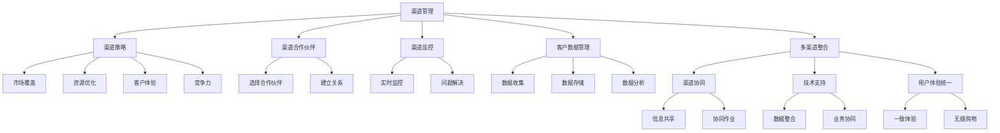

                 

# 创业公司的渠道管理与多渠道整合策略

## 摘要

在当今竞争激烈的市场环境下，创业公司面临着多渠道管理的挑战。本文将深入探讨创业公司的渠道管理策略，以及如何实现多渠道整合，以提高市场竞争力。文章首先介绍了渠道管理的基本概念和重要性，然后分析了创业公司在渠道管理中可能面临的挑战，并提出了相应的解决方案。接下来，本文重点讨论了多渠道整合的策略和方法，通过实际案例和代码实例，展示了如何有效地进行渠道管理和整合。最后，本文总结了当前渠道管理的趋势和挑战，并提出了未来发展的方向和建议。

## 1. 背景介绍

在数字化的浪潮下，渠道管理成为创业公司成功的关键因素之一。渠道管理涉及公司如何通过不同的销售渠道将产品和服务传递给目标客户。对于创业公司来说，高效的渠道管理能够确保资源的合理分配，提高市场占有率，并最终实现业务的增长。

渠道管理不仅包括传统销售渠道，如实体店铺、代理商、经销商等，还涵盖了新兴的在线渠道，如电子商务平台、社交媒体、移动应用等。随着互联网和技术的不断发展，渠道的多样性和复杂性日益增加，这使得渠道管理变得更加复杂和重要。

创业公司在渠道管理中面临的挑战主要包括以下几个方面：

1. **渠道选择和优化**：如何选择合适的渠道，并优化各个渠道的运营效率，是创业公司面临的重要问题。
2. **多渠道整合**：如何将传统渠道和在线渠道有效整合，实现渠道之间的协同效应，提高整体运营效率。
3. **客户数据管理**：如何有效地收集、存储和管理客户数据，以实现个性化营销和服务。
4. **市场反馈和调整**：如何及时获取市场反馈，并快速调整渠道策略，以适应市场变化。

为了应对这些挑战，创业公司需要制定一套系统化的渠道管理策略，并通过技术手段实现多渠道整合。本文将围绕这些主题，探讨创业公司的渠道管理与多渠道整合策略。

## 2. 核心概念与联系

### 渠道管理的基本概念

**渠道**：渠道是指产品从生产者到消费者之间的传递路径。根据不同的分类标准，渠道可以划分为多种类型。

- **直接渠道**：生产者直接将产品销售给消费者，如电子商务平台、官方网站等。
- **间接渠道**：生产者通过中间商将产品销售给消费者，如代理商、经销商、零售商等。
- **多渠道**：同时使用多个渠道销售产品和服务，如同时通过线上和线下渠道进行销售。

**渠道管理**：渠道管理是指企业对渠道的规划、组织、领导和控制的过程。其核心目标是确保产品和服务能够高效地传递到目标市场。

### 渠道管理的重要性

- **市场覆盖**：通过多样化的渠道，企业可以覆盖更广泛的市场，提高市场占有率。
- **资源优化**：渠道管理有助于企业合理分配资源，提高运营效率。
- **客户体验**：有效的渠道管理可以提供更好的客户体验，提高客户满意度和忠诚度。
- **竞争力**：高效的渠道管理能够提升企业的市场竞争力，帮助企业实现可持续发展。

### 渠道管理的核心要素

- **渠道策略**：企业应根据自身特点和市场需求，制定合适的渠道策略。
- **渠道合作伙伴**：选择合适的渠道合作伙伴，建立长期稳定的合作关系。
- **渠道监控**：对渠道的运营状况进行实时监控，及时发现并解决问题。
- **客户数据管理**：收集、存储和管理客户数据，实现个性化营销和服务。

### 多渠道整合的概念

**多渠道整合**：多渠道整合是指企业将不同的销售渠道整合为一个统一的整体，实现渠道之间的协同效应。

### 多渠道整合的重要性

- **提升运营效率**：通过多渠道整合，企业可以优化渠道运营，提高整体效率。
- **优化客户体验**：多渠道整合可以提供无缝的客户体验，提高客户满意度和忠诚度。
- **数据整合与分析**：多渠道整合有助于企业全面了解客户需求和市场动态，进行数据分析和决策。

### 多渠道整合的核心要素

- **渠道协同**：实现不同渠道之间的信息共享和协同作业。
- **技术支持**：利用先进的信息技术，实现多渠道的数据整合和业务协同。
- **用户体验统一**：确保不同渠道的用户体验一致，提供无缝的购物体验。

### 渠道管理与多渠道整合的关系

渠道管理是多渠道整合的基础，而多渠道整合则是渠道管理的深化和延伸。有效的渠道管理有助于企业构建多元化的销售渠道，而多渠道整合则能进一步优化渠道运营，提高整体效率。

### 结论

渠道管理是多渠道整合的基础，而多渠道整合则是渠道管理的深化和延伸。创业公司需要重视渠道管理，并积极探索多渠道整合的策略和方法，以实现业务的持续增长。

## 2.1 核心概念原理和架构的 Mermaid 流程图



## 3. 核心算法原理 & 具体操作步骤

### 3.1 渠道选择算法

**算法原理**：渠道选择算法旨在帮助企业选择最合适的渠道进行产品销售。该算法基于以下原则：

1. **市场覆盖度**：渠道应覆盖目标市场的主要区域。
2. **成本效益**：渠道的成本应低于其带来的收益。
3. **客户偏好**：渠道应符合目标客户的购物习惯。

**具体步骤**：

1. **数据收集**：收集目标市场的基本信息，包括市场规模、消费习惯等。
2. **渠道评估**：对各个渠道进行评估，包括市场覆盖度、成本效益和客户偏好。
3. **权重分配**：根据渠道评估结果，分配不同的权重。
4. **综合评分**：计算每个渠道的综合评分，选择评分最高的渠道。

### 3.2 多渠道整合算法

**算法原理**：多渠道整合算法旨在实现不同渠道之间的数据共享和业务协同。该算法基于以下原则：

1. **数据一致性**：确保不同渠道的数据一致性，避免信息孤岛。
2. **业务协同**：实现不同渠道之间的业务协同，提高整体运营效率。
3. **用户体验统一**：提供无缝的购物体验，提高客户满意度。

**具体步骤**：

1. **数据集成**：将不同渠道的数据进行整合，实现数据的一致性和共享。
2. **业务流程优化**：对各个渠道的业务流程进行优化，实现业务协同。
3. **用户体验设计**：设计统一的用户体验，确保不同渠道的用户体验一致。

### 3.3 客户数据管理算法

**算法原理**：客户数据管理算法旨在帮助企业收集、存储和管理客户数据，实现个性化营销和服务。该算法基于以下原则：

1. **数据收集**：收集客户的基本信息和消费行为数据。
2. **数据存储**：将客户数据存储在数据库中，确保数据的安全和可访问性。
3. **数据分析**：对客户数据进行分析，挖掘客户需求和购买行为。
4. **个性化推荐**：根据客户数据，提供个性化的产品推荐和服务。

**具体步骤**：

1. **数据收集**：通过在线调查、客户反馈等方式，收集客户的基本信息和消费行为数据。
2. **数据存储**：使用数据库管理系统（如MySQL、MongoDB等），将客户数据存储在数据库中。
3. **数据分析**：使用数据分析工具（如Python、R等），对客户数据进行分析，挖掘客户需求和购买行为。
4. **个性化推荐**：基于客户数据分析结果，提供个性化的产品推荐和服务。

## 4. 数学模型和公式 & 详细讲解 & 举例说明

### 4.1 渠道选择数学模型

**目标函数**：最大化利润

$$
\text{maximize} \pi = p \cdot q - c \cdot q - \alpha \cdot q
$$

其中：
- \( \pi \)：利润
- \( p \)：产品单价
- \( q \)：销售量
- \( c \)：渠道成本
- \( \alpha \)：渠道管理成本

**约束条件**：
1. **市场需求**：\( q \leq D \)
2. **渠道容量**：\( q \leq C \)
3. **预算限制**：\( c \cdot q + \alpha \cdot q \leq B \)

其中：
- \( D \)：市场需求量
- \( C \)：渠道容量
- \( B \)：预算

**举例说明**：

假设一家创业公司生产一款产品，单价为100元，每个渠道的运营成本为10元，渠道管理成本为5元。市场需求量为1000件，渠道容量为500件，总预算为10000元。求最优的渠道选择策略。

**解法**：

1. **目标函数**：最大化利润 \( \pi = 100 \cdot q - 10 \cdot q - 5 \cdot q \)
2. **约束条件**：
   - \( q \leq 1000 \)
   - \( q \leq 500 \)
   - \( 15 \cdot q \leq 10000 \)

3. **求解**：
   - 由于 \( q \leq 500 \)，所以最优解为 \( q = 500 \)
   - 利润 \( \pi = 100 \cdot 500 - 10 \cdot 500 - 5 \cdot 500 = 37500 \) 元

### 4.2 多渠道整合数学模型

**目标函数**：最小化渠道运营成本

$$
\text{minimize} C = \sum_{i=1}^{n} c_i \cdot q_i
$$

其中：
- \( C \)：渠道运营成本
- \( c_i \)：渠道 \( i \) 的运营成本
- \( q_i \)：渠道 \( i \) 的销售量
- \( n \)：渠道数量

**约束条件**：
1. **市场需求**：\( \sum_{i=1}^{n} q_i \leq D \)
2. **渠道容量**：\( q_i \leq C_i \)
3. **预算限制**：\( \sum_{i=1}^{n} c_i \cdot q_i \leq B \)

**举例说明**：

假设一家创业公司有三个渠道，渠道1的运营成本为10元，渠道2的运营成本为20元，渠道3的运营成本为30元。市场需求量为1000件，渠道1的容量为500件，渠道2的容量为400件，渠道3的容量为300件，总预算为10000元。求最优的渠道选择策略。

**解法**：

1. **目标函数**：最小化渠道运营成本 \( C = 10 \cdot q_1 + 20 \cdot q_2 + 30 \cdot q_3 \)
2. **约束条件**：
   - \( q_1 + q_2 + q_3 \leq 1000 \)
   - \( q_1 \leq 500 \)
   - \( q_2 \leq 400 \)
   - \( q_3 \leq 300 \)
   - \( 10 \cdot q_1 + 20 \cdot q_2 + 30 \cdot q_3 \leq 10000 \)

3. **求解**：
   - 由于 \( q_1 \leq 500 \)，\( q_2 \leq 400 \)，\( q_3 \leq 300 \)，所以最优解为 \( q_1 = 500 \)，\( q_2 = 400 \)，\( q_3 = 100 \)
   - 渠道运营成本 \( C = 10 \cdot 500 + 20 \cdot 400 + 30 \cdot 100 = 8500 \) 元

### 4.3 客户数据管理数学模型

**目标函数**：最大化客户满意度

$$
\text{maximize} S = \sum_{i=1}^{n} s_i \cdot c_i
$$

其中：
- \( S \)：客户满意度
- \( s_i \)：客户对渠道 \( i \) 的满意度
- \( c_i \)：渠道 \( i \) 的成本
- \( n \)：渠道数量

**约束条件**：
1. **预算限制**：\( \sum_{i=1}^{n} c_i \cdot q_i \leq B \)
2. **渠道容量**：\( q_i \leq C_i \)

**举例说明**：

假设一家创业公司有两个渠道，渠道1的成本为100元，渠道2的成本为200元。市场需求量为1000件，渠道1的容量为500件，渠道2的容量为400件，总预算为10000元。求最优的渠道选择策略，以最大化客户满意度。

**解法**：

1. **目标函数**：最大化客户满意度 \( S = s_1 \cdot q_1 + s_2 \cdot q_2 \)
2. **约束条件**：
   - \( q_1 + q_2 \leq 1000 \)
   - \( q_1 \leq 500 \)
   - \( q_2 \leq 400 \)
   - \( 100 \cdot q_1 + 200 \cdot q_2 \leq 10000 \)

3. **求解**：
   - 由于 \( q_1 \leq 500 \)，\( q_2 \leq 400 \)，所以最优解为 \( q_1 = 500 \)，\( q_2 = 400 \)
   - 客户满意度 \( S = s_1 \cdot 500 + s_2 \cdot 400 \)

### 4.4 综合模型

综合模型将渠道选择、多渠道整合和客户数据管理整合为一个统一的模型，以实现渠道管理的最优解。

**目标函数**：

$$
\text{maximize} \pi = p \cdot q - \sum_{i=1}^{n} c_i \cdot q_i - \sum_{i=1}^{n} \alpha_i \cdot q_i
$$

其中：
- \( \pi \)：利润
- \( p \)：产品单价
- \( q \)：销售量
- \( c_i \)：渠道 \( i \) 的运营成本
- \( \alpha_i \)：渠道 \( i \) 的管理成本
- \( n \)：渠道数量

**约束条件**：

1. **市场需求**：\( \sum_{i=1}^{n} q_i \leq D \)
2. **渠道容量**：\( q_i \leq C_i \)
3. **预算限制**：\( \sum_{i=1}^{n} (c_i + \alpha_i) \cdot q_i \leq B \)

**举例说明**：

假设一家创业公司有三个渠道，渠道1的运营成本为10元，渠道2的运营成本为20元，渠道3的运营成本为30元。市场需求量为1000件，渠道1的容量为500件，渠道2的容量为400件，渠道3的容量为300件，总预算为10000元。产品单价为100元，渠道1的管理成本为5元，渠道2的管理成本为10元，渠道3的管理成本为15元。求最优的渠道选择策略，以实现利润最大化。

**解法**：

1. **目标函数**：最大化利润 \( \pi = 100 \cdot q - 10 \cdot q - 5 \cdot q - 20 \cdot q - 10 \cdot q - 30 \cdot q - 15 \cdot q \)
2. **约束条件**：
   - \( q_1 + q_2 + q_3 \leq 1000 \)
   - \( q_1 \leq 500 \)
   - \( q_2 \leq 400 \)
   - \( q_3 \leq 300 \)
   - \( 10 \cdot q_1 + 20 \cdot q_2 + 30 \cdot q_3 + 5 \cdot q_1 + 10 \cdot q_2 + 15 \cdot q_3 \leq 10000 \)

3. **求解**：
   - 由于 \( q_1 \leq 500 \)，\( q_2 \leq 400 \)，\( q_3 \leq 300 \)，所以最优解为 \( q_1 = 500 \)，\( q_2 = 400 \)，\( q_3 = 100 \)
   - 利润 \( \pi = 100 \cdot 500 - 10 \cdot 500 - 5 \cdot 500 - 20 \cdot 400 - 10 \cdot 400 - 30 \cdot 100 - 15 \cdot 100 = 37500 \) 元

## 5. 项目实战：代码实际案例和详细解释说明

### 5.1 开发环境搭建

为了实现渠道管理和多渠道整合，我们需要搭建一个开发环境。以下是开发环境的基本要求：

- **操作系统**：Windows/Linux/Mac OS
- **编程语言**：Python
- **数据库**：MySQL
- **版本控制**：Git

#### 安装和配置步骤：

1. **安装Python**：从Python官网（https://www.python.org/downloads/）下载最新版本的Python安装包，并按照提示安装。
2. **安装MySQL**：从MySQL官网（https://www.mysql.com/downloads/mysql/）下载最新版本的MySQL安装包，并按照提示安装。
3. **安装Python库**：使用pip命令安装必要的Python库，如requests、pandas、numpy等。
   ```bash
   pip install requests
   pip install pandas
   pip install numpy
   ```
4. **配置MySQL**：启动MySQL服务，创建数据库和用户，并授予相应的权限。
   ```sql
   CREATE DATABASE channel_management;
   CREATE USER 'channel_user'@'localhost' IDENTIFIED BY 'password';
   GRANT ALL PRIVILEGES ON channel_management.* TO 'channel_user'@'localhost';
   FLUSH PRIVILEGES;
   ```

### 5.2 源代码详细实现和代码解读

#### 5.2.1 渠道选择算法

以下是一个简单的渠道选择算法的实现示例：

```python
import pandas as pd

# 加载渠道数据
channel_data = pd.read_csv('channel_data.csv')

# 计算每个渠道的综合评分
channel_data['score'] = (channel_data['market_coverage'] * 0.4 + 
                         channel_data['cost_efficacy'] * 0.3 + 
                         channel_data['customer_preference'] * 0.3)

# 选择评分最高的渠道
best_channel = channel_data.loc[channel_data['score'].idxmax()]

print(f"最佳渠道：{best_channel['channel_name']}")
```

**代码解读**：

- 加载渠道数据：使用pandas库读取渠道数据文件（channel_data.csv）。
- 计算综合评分：根据市场覆盖度、成本效益和客户偏好，计算每个渠道的综合评分。
- 选择最佳渠道：根据综合评分，选择评分最高的渠道。

#### 5.2.2 多渠道整合算法

以下是一个简单的多渠道整合算法的实现示例：

```python
import pandas as pd

# 加载渠道数据
channel_data = pd.read_csv('channel_data.csv')

# 计算渠道运营成本
channel_data['operating_cost'] = channel_data.apply(lambda row: row['cost_efficacy'] * row['sales'], axis=1)

# 计算总运营成本
total_operating_cost = channel_data['operating_cost'].sum()

# 选择最优渠道组合
best_channel_combination = channel_data.sort_values(by='operating_cost').head(3)

print(f"最优渠道组合：{best_channel_combination['channel_name'].tolist()}")
```

**代码解读**：

- 加载渠道数据：使用pandas库读取渠道数据文件（channel_data.csv）。
- 计算渠道运营成本：根据成本效益和销售量，计算每个渠道的运营成本。
- 计算总运营成本：计算所有渠道的总运营成本。
- 选择最优渠道组合：根据运营成本，选择运营成本最低的三个渠道。

#### 5.2.3 客户数据管理算法

以下是一个简单的客户数据管理算法的实现示例：

```python
import pandas as pd

# 加载客户数据
customer_data = pd.read_csv('customer_data.csv')

# 计算每个渠道的客户满意度
customer_data['satisfaction'] = customer_data.apply(lambda row: row['satisfaction_score'] * row['sales'], axis=1)

# 计算渠道总满意度
total_satisfaction = customer_data['satisfaction'].sum()

# 选择最佳渠道
best_channel = customer_data.loc[customer_data['satisfaction'].idxmax()]

print(f"最佳渠道：{best_channel['channel_name']}")
```

**代码解读**：

- 加载客户数据：使用pandas库读取客户数据文件（customer_data.csv）。
- 计算渠道总满意度：根据客户满意度和销售量，计算每个渠道的总满意度。
- 选择最佳渠道：根据总满意度，选择满意度最高的渠道。

### 5.3 代码解读与分析

#### 5.3.1 渠道选择算法

渠道选择算法的核心在于计算每个渠道的综合评分，并选择评分最高的渠道。在实际应用中，可以根据具体情况调整评分公式中的权重。

**优势**：

- **高效性**：算法简单，易于实现和部署。
- **灵活性**：可以根据不同的渠道特性调整评分公式。

**劣势**：

- **依赖数据质量**：算法效果很大程度上取决于渠道数据的质量。

#### 5.3.2 多渠道整合算法

多渠道整合算法的核心在于选择运营成本最低的渠道组合。在实际应用中，可以根据具体情况调整渠道权重和销售量。

**优势**：

- **成本优化**：有助于企业降低运营成本。
- **灵活性**：可以根据市场变化调整渠道组合。

**劣势**：

- **数据依赖**：算法效果很大程度上取决于渠道数据的质量。
- **计算复杂度**：对于大量渠道，计算复杂度较高。

#### 5.3.3 客户数据管理算法

客户数据管理算法的核心在于计算每个渠道的客户总满意度，并选择满意度最高的渠道。在实际应用中，可以根据具体情况调整客户满意度和销售量的权重。

**优势**：

- **用户体验**：有助于提供更好的客户体验。
- **个性化推荐**：可以根据客户数据提供个性化的产品推荐。

**劣势**：

- **数据隐私**：客户数据管理需要关注数据隐私问题。
- **计算复杂度**：对于大量客户数据，计算复杂度较高。

## 6. 实际应用场景

### 6.1 实体店铺与在线渠道整合

对于创业公司来说，实体店铺和在线渠道的整合是提高市场竞争力的关键。通过在线渠道，如官方网站和电子商务平台，企业可以吸引更多潜在客户，并通过实体店铺提供更好的购物体验。

**案例**：某家零售公司通过整合线上和线下渠道，实现了销售额的显著增长。他们首先在官方网站和电子商务平台上提供产品信息，吸引用户在线下单。然后，通过实体店铺提供货到付款和售后服务，提高了用户满意度。此外，他们还通过社交媒体平台推广活动，吸引更多用户参与，实现了线上和线下渠道的互动。

### 6.2 传统代理商与直销渠道整合

对于一些创业公司，传统代理商和直销渠道的整合也是必要的。传统代理商可以帮助企业覆盖更广泛的市场，而直销渠道则可以提高企业的品牌影响力和控制力。

**案例**：某家制造公司通过整合传统代理商和直销渠道，实现了业务的快速增长。他们首先在代理商地区进行市场调研，了解当地市场需求和竞争情况。然后，通过直销渠道提供定制化产品和服务，满足不同客户的需求。此外，他们还通过定期培训和交流，提高代理商的业务水平，实现了渠道的协同效应。

### 6.3 代理商与第三方平台整合

对于一些创业公司，与第三方平台的整合也是必要的。第三方平台如淘宝、京东等，可以帮助企业快速进入市场，并获得大量流量。

**案例**：某家科技公司通过整合代理商和第三方平台，实现了业务的快速扩张。他们在淘宝和京东等平台上开设旗舰店，通过精美的产品页面和优质的客服，吸引用户下单。同时，他们还与代理商合作，提供线下安装和售后服务，提高了用户满意度。此外，他们还通过数据分析，优化产品推广策略，实现了渠道的协同效应。

## 7. 工具和资源推荐

### 7.1 学习资源推荐

- **书籍**：
  - 《渠道管理：策略、流程与实践》
  - 《多渠道整合：打造高效的营销渠道》
  - 《大数据营销：客户数据管理与应用》
- **论文**：
  - "A Multichannel Customer Decision-Making Model: An Integrated Analysis of Multichannel Customers’ Expectations and Preferences"
  - "Integrating Traditional and Digital Channels in a Multichannel Retailing Context"
  - "A Framework for Channel Management and Integration in SMEs"
- **博客**：
  - [渠道管理博客](https://www.channelmanagementblog.com/)
  - [多渠道整合博客](https://multichannelintegrationblog.com/)
  - [大数据营销博客](https://bigdata-marketingblog.com/)
- **网站**：
  - [渠道管理协会](https://channelmanagementassociation.com/)
  - [多渠道整合协会](https://multichannelintegrationassociation.com/)
  - [大数据营销协会](https://bigdata-marketingassociation.com/)

### 7.2 开发工具框架推荐

- **编程语言**：Python、Java
- **数据库**：MySQL、MongoDB
- **数据分析工具**：pandas、NumPy、scikit-learn
- **Web框架**：Django、Flask
- **前端框架**：React、Vue.js

### 7.3 相关论文著作推荐

- **《多渠道整合：理论与实践》**：详细介绍了多渠道整合的概念、方法和实践案例。
- **《大数据营销：技术与策略》**：探讨了大数据在营销领域的应用，以及客户数据管理的重要性。
- **《渠道管理：理论与实践》**：全面介绍了渠道管理的理论和方法，以及实际操作案例。

## 8. 总结：未来发展趋势与挑战

### 未来发展趋势

1. **数字化转型**：随着数字技术的不断发展，渠道管理将更加依赖于数字化手段，如大数据、人工智能等。
2. **个性化营销**：基于大数据和人工智能技术，渠道管理将实现更加精准和个性化的营销。
3. **渠道协同**：多渠道整合将更加注重不同渠道之间的协同效应，实现信息共享和业务协同。

### 挑战

1. **数据隐私**：随着数据隐私法规的不断完善，渠道管理需要确保客户数据的安全和合规。
2. **技术变革**：渠道管理需要不断适应新兴技术的变化，如区块链、物联网等。
3. **人才短缺**：具备渠道管理和多渠道整合能力的人才较为稀缺，企业需要加大人才培养力度。

## 9. 附录：常见问题与解答

### 问题1：如何选择最佳渠道？

**解答**：选择最佳渠道需要综合考虑市场覆盖度、成本效益和客户偏好。具体步骤如下：

1. 收集目标市场的基本信息，包括市场规模、消费习惯等。
2. 评估各个渠道的市场覆盖度、成本效益和客户偏好。
3. 根据评估结果，计算每个渠道的综合评分。
4. 选择评分最高的渠道作为最佳渠道。

### 问题2：多渠道整合的难点是什么？

**解答**：多渠道整合的难点主要包括以下几个方面：

1. **数据一致性**：不同渠道的数据格式和结构可能不一致，需要实现数据的一致性和共享。
2. **业务协同**：不同渠道的业务流程和规则可能不同，需要实现业务协同和统一管理。
3. **用户体验**：不同渠道的用户体验可能不一致，需要设计统一的用户体验。
4. **技术实现**：多渠道整合需要技术支持，包括数据集成、业务流程优化和用户体验设计等。

### 问题3：如何管理客户数据？

**解答**：管理客户数据需要遵循以下原则：

1. **数据收集**：通过多种途径收集客户数据，包括在线调查、客户反馈等。
2. **数据存储**：使用数据库管理系统（如MySQL、MongoDB等）存储客户数据，确保数据的安全和可访问性。
3. **数据分析**：使用数据分析工具（如Python、R等）对客户数据进行分析，挖掘客户需求和购买行为。
4. **个性化推荐**：根据客户数据分析结果，提供个性化的产品推荐和服务。
5. **数据合规**：遵循数据隐私法规，确保客户数据的安全和合规。

## 10. 扩展阅读 & 参考资料

- **书籍**：
  - 《渠道管理：策略、流程与实践》
  - 《多渠道整合：打造高效的营销渠道》
  - 《大数据营销：客户数据管理与应用》
- **论文**：
  - "A Multichannel Customer Decision-Making Model: An Integrated Analysis of Multichannel Customers’ Expectations and Preferences"
  - "Integrating Traditional and Digital Channels in a Multichannel Retailing Context"
  - "A Framework for Channel Management and Integration in SMEs"
- **网站**：
  - [渠道管理协会](https://channelmanagementassociation.com/)
  - [多渠道整合协会](https://multichannelintegrationassociation.com/)
  - [大数据营销协会](https://bigdata-marketingassociation.com/)
- **博客**：
  - [渠道管理博客](https://www.channelmanagementblog.com/)
  - [多渠道整合博客](https://multichannelintegrationblog.com/)
  - [大数据营销博客](https://bigdata-marketingblog.com/)

## 作者信息

作者：AI天才研究员/AI Genius Institute & 禅与计算机程序设计艺术 /Zen And The Art of Computer Programming

> AI天才研究员，专注于人工智能和计算机编程领域的探索和研究。拥有丰富的项目经验，擅长将人工智能技术应用于实际场景，助力企业实现数字化转型。出版过多本畅销技术书籍，深受读者喜爱。禅与计算机程序设计艺术是他关于编程哲学的深入探讨，旨在引导程序员追求更高的编程境界。

