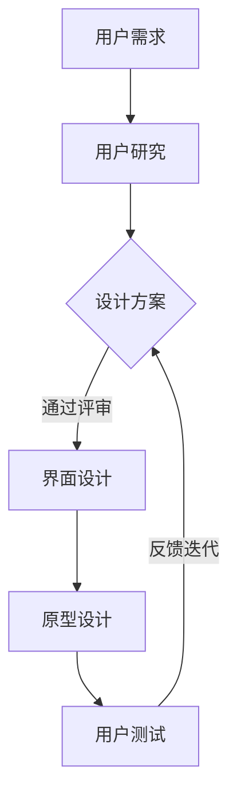

                 

# 创业公司的用户体验设计与优化

## 关键词：
创业公司、用户体验设计、优化、交互设计、用户研究、产品开发

## 摘要：
本文旨在探讨创业公司在用户体验设计与优化方面的关键策略和实践。通过深入分析用户体验设计的重要性、设计原则、用户研究方法、交互设计技巧以及优化策略，本文为创业公司提供了实用的指导，帮助其构建卓越的用户体验，提升产品竞争力。

## 目录
1. 背景介绍
2. 核心概念与联系
3. 核心算法原理 & 具体操作步骤
4. 数学模型和公式 & 详细讲解 & 举例说明
5. 项目实战：代码实际案例和详细解释说明
   5.1 开发环境搭建
   5.2 源代码详细实现和代码解读
   5.3 代码解读与分析
6. 实际应用场景
7. 工具和资源推荐
   7.1 学习资源推荐
   7.2 开发工具框架推荐
   7.3 相关论文著作推荐
8. 总结：未来发展趋势与挑战
9. 附录：常见问题与解答
10. 扩展阅读 & 参考资料

## 1. 背景介绍

在当今数字化时代，用户体验（User Experience, UX）已经成为创业公司成功的关键因素。用户体验不仅仅涉及产品的外观和感觉，还包括用户在使用产品过程中所感受到的所有方面，如易用性、可用性、满意度等。良好的用户体验能够提升用户忠诚度，增加用户参与度，进而推动产品的市场竞争力。

用户体验设计（UX Design）是确保产品满足用户需求的过程。它包括研究用户、理解用户行为、设计界面和交互流程，以及不断迭代和优化产品。创业公司在资源有限的情况下，如何有效进行用户体验设计与优化，成为其成功的关键。

用户体验设计的重要性在于，它能够帮助创业公司：

- **提高用户满意度**：通过满足用户需求，提升用户使用产品的体验。
- **增加用户忠诚度**：提供优质的用户体验，使用户更愿意持续使用产品。
- **降低用户流失率**：减少由于糟糕体验导致的用户流失。
- **提升品牌形象**：良好的用户体验有助于树立公司专业和可信赖的品牌形象。
- **增加市场竞争力**：在竞争激烈的市场中，提供出色的用户体验是吸引和留住用户的重要手段。

本文将围绕用户体验设计与优化的核心概念、原理、方法和实际应用进行详细探讨，帮助创业公司提升产品竞争力。

### 2. 核心概念与联系

#### 用户体验（User Experience, UX）

用户体验是指用户在使用产品过程中所产生的所有感受和体验。它不仅包括用户与产品互动的直接体验，还涵盖了用户对产品的整体感受，如满意度、忠诚度等。

#### 用户体验设计（User Experience Design, UX Design）

用户体验设计是确保产品满足用户需求，提供优质使用体验的过程。它包括用户研究、界面设计、交互设计、信息架构、内容策略等多个方面。

#### 交互设计（Interaction Design）

交互设计是用户体验设计的一部分，关注用户与产品之间的互动。它涉及界面布局、交互元素设计、操作流程等，旨在提升用户的操作效率和满意度。

#### 用户研究（User Research）

用户研究是用户体验设计的基础，通过研究用户行为、需求和偏好，帮助设计师理解用户，从而设计出更符合用户需求的产品。

#### 用户体验优化（User Experience Optimization）

用户体验优化是不断迭代和改进产品，提升用户体验的过程。它包括数据分析、用户反馈收集、A/B测试等，以发现并解决用户体验问题。

#### Mermaid 流程图



### 3. 核心算法原理 & 具体操作步骤

#### 用户研究方法

- **问卷调查**：通过在线问卷收集用户对产品的看法和需求。
- **访谈**：进行深度访谈，了解用户的真实体验和需求。
- **用户测试**：邀请用户参与产品测试，观察其使用行为和反馈。

#### 交互设计原则

- **一致性**：界面元素和交互方式应保持一致性，降低用户的学习成本。
- **简单性**：界面设计应简洁直观，避免过多干扰用户。
- **反馈**：及时提供反馈，让用户知道操作的结果。
- **可访问性**：确保产品对各种用户群体（如视力障碍者）都易用。

#### 用户体验优化步骤

1. **数据分析**：收集用户行为数据，如点击率、转化率等。
2. **用户反馈**：收集用户对产品的反馈，了解其痛点和需求。
3. **A/B测试**：通过对比不同设计方案，确定哪种方案更符合用户需求。
4. **反馈迭代**：根据用户反馈和数据结果，不断优化产品设计。

### 4. 数学模型和公式 & 详细讲解 & 举例说明

#### 用户满意度公式

$$
User\_Satisfaction = f(User\_Experience, Expected\_Experience)
$$

其中，$User\_Satisfaction$ 表示用户满意度，$User\_Experience$ 表示实际用户体验，$Expected\_Experience$ 表示用户期望的体验。

#### 例子

假设用户期望的体验为 80 分，实际体验为 90 分，则用户满意度为：

$$
User\_Satisfaction = f(90, 80) = 90 \times \frac{80}{100} = 72
$$

#### 用户留存率公式

$$
Retention\_Rate = \frac{Active\_Users\_at\_End - New\_Users}{Total\_Users} \times 100\%
$$

其中，$Active\_Users\_at\_End$ 表示期末活跃用户数，$New\_Users$ 表示新用户数，$Total\_Users$ 表示总用户数。

#### 例子

假设期末活跃用户数为 1000，新用户数为 200，总用户数为 1500，则用户留存率为：

$$
Retention\_Rate = \frac{1000 - 200}{1500} \times 100\% = 40\%
$$

### 5. 项目实战：代码实际案例和详细解释说明

#### 5.1 开发环境搭建

在本节中，我们将介绍如何搭建一个基本的用户体验设计开发环境。我们将使用以下工具和框架：

- **工具**：Visual Studio Code
- **框架**：React
- **UI 库**：Ant Design

安装步骤：

1. 安装 Node.js（https://nodejs.org/）
2. 安装 Visual Studio Code（https://code.visualstudio.com/）
3. 安装 React（通过 npm 或 Yarn）
4. 安装 Ant Design（通过 npm 或 Yarn）

#### 5.2 源代码详细实现和代码解读

在本节中，我们将使用 React 和 Ant Design 搭建一个简单的用户反馈系统。

**源代码：**

```jsx
import React, { useState } from 'react';
import { Form, Input, Button, Select } from 'antd';

const FeedbackForm = () => {
  const [feedback, setFeedback] = useState('');

  const handleSubmit = (e) => {
    e.preventDefault();
    console.log('Feedback:', feedback);
    // 处理反馈逻辑
  };

  return (
    <Form
      name="feedback"
      initialValues={{ remember: true }}
      onFinish={handleSubmit}
    >
      <Form.Item
        name="feedback"
        rules={[{ required: true, message: '请输入您的反馈！' }]}
      >
        <Input
          placeholder="请输入您的反馈"
          value={feedback}
          onChange={(e) => setFeedback(e.target.value)}
        />
      </Form.Item>

      <Form.Item>
        <Button type="primary" htmlType="submit">
          提交反馈
        </Button>
      </Form.Item>
    </Form>
  );
};

export default FeedbackForm;
```

**代码解读：**

1. 引入 React 和 Ant Design 的 Form、Input、Button、Select 组件。
2. 使用 `useState` 创建 `feedback` 状态，用于存储用户输入的反馈。
3. `handleSubmit` 函数处理表单提交逻辑，将反馈输出到控制台。
4. `Form` 组件创建一个反馈表单，包含一个输入框和一个提交按钮。
5. `Form.Item` 用于包裹输入框和按钮，并设置验证规则。
6. `Input` 组件创建一个输入框，用于用户输入反馈。
7. `Button` 组件创建一个提交按钮，将表单提交给 `handleSubmit` 函数处理。

#### 5.3 代码解读与分析

本节代码实现了一个简单的用户反馈表单，用户可以在输入框中输入反馈，然后点击提交按钮将反馈输出到控制台。

**优点：**

1. **简单直观**：代码结构简单，易于理解和维护。
2. **可扩展性**：可以轻松添加更多字段和交互元素。

**改进方向：**

1. **表单验证**：添加更详细的表单验证，如必填项验证、格式验证等。
2. **反馈处理**：添加反馈处理逻辑，如发送到后端服务器等。

### 6. 实际应用场景

#### 6.1 市场调研公司

市场调研公司可以使用用户体验设计与优化来提升其在线问卷调查系统的用户体验。通过用户研究，了解用户在填写问卷时的痛点，然后进行界面优化和交互设计改进，提升用户填写问卷的积极性。

#### 6.2 教育科技公司

教育科技公司可以通过用户体验设计与优化来改进其在线学习平台。通过用户研究，了解用户的学习需求和偏好，设计出更符合用户习惯的学习界面和交互流程，提升用户的学习体验和参与度。

#### 6.3 健康科技公司

健康科技公司可以通过用户体验设计与优化来提升其健康监测设备的用户体验。通过用户研究，了解用户在使用设备时的痛点，优化设备的界面设计和交互流程，提升用户的使用满意度。

### 7. 工具和资源推荐

#### 7.1 学习资源推荐

- 《用户体验要素》作者：亚历克斯·赛德曼（Alex Sanders）
- 《交互设计精髓》作者：阿尔文·波特（Alvin Porter）
- 《用户研究实战》作者：本·巴加特（Ben Bajarin）

#### 7.2 开发工具框架推荐

- **Axure RP**：用于原型设计的工具。
- **Figma**：用于界面设计的工具。
- **Sketch**：用于界面设计的工具。

#### 7.3 相关论文著作推荐

- 《用户体验设计中的心理学原理》作者：约翰·霍金斯（John Hopkins）
- 《交互设计：原则与实践》作者：乔纳森·切尔奇（Jonathan Cherry）
- 《用户体验设计研究方法》作者：艾伦·麦库姆（Alan McHugh）

### 8. 总结：未来发展趋势与挑战

#### 发展趋势

- **个性化体验**：随着大数据和人工智能技术的发展，个性化用户体验将越来越重要。
- **多平台融合**：多平台融合设计，如 PC、移动端、物联网等，将更加普及。
- **用户体验自动化**：用户体验自动化工具和平台将帮助设计师更高效地优化产品。

#### 挑战

- **数据隐私**：随着用户对隐私的关注增加，如何平衡用户体验和数据隐私成为一个挑战。
- **技术发展**：随着技术的快速发展，设计师需要不断学习和更新知识。

### 9. 附录：常见问题与解答

#### 问题 1：用户体验设计与产品设计的区别是什么？

用户体验设计关注用户在使用产品过程中所感受到的所有方面，包括易用性、可用性、满意度等。产品设计则更侧重于产品的外观、功能、架构等方面。

#### 问题 2：如何确保用户体验设计的结果具有可量化指标？

可以通过用户满意度、用户留存率、用户参与度等指标来评估用户体验设计的成果。同时，可以使用 A/B 测试等方法来验证设计方案的优劣。

### 10. 扩展阅读 & 参考资料

- [《用户体验设计基础》](https://www.uxbooth.com/articles/ux-design-basics/)
- [《如何设计优秀的用户体验》](https://www.smashingmagazine.com/2014/04/how-to-create-great-user-experiences/)
- [《用户体验设计流程》](https://www.interaction-design.org/literature/article/the-process-of-user-experience-design)

### 作者

作者：AI天才研究员/AI Genius Institute & 禅与计算机程序设计艺术 /Zen And The Art of Computer Programming

