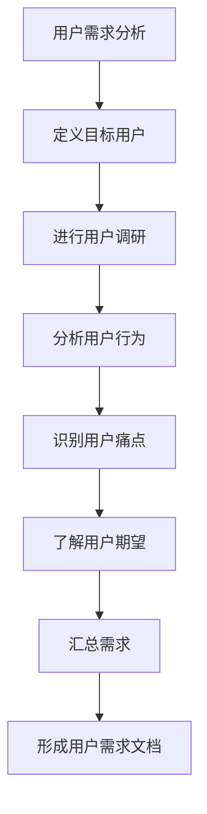
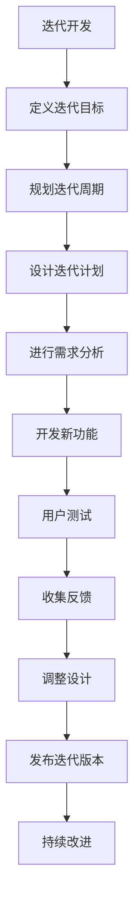
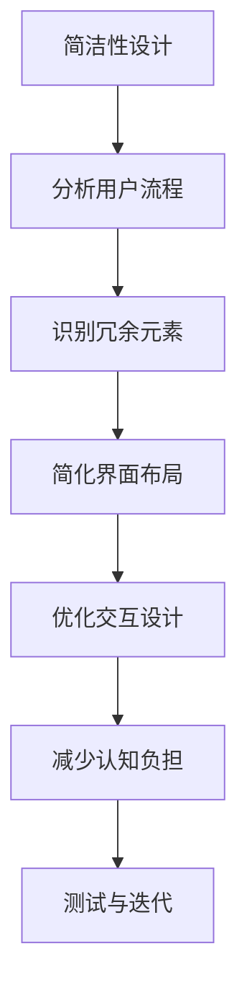

                 

### 文章标题：创业公司的用户体验设计策略

> **关键词**：用户体验设计、创业公司、设计策略、用户需求、产品迭代

**摘要**：
本文将深入探讨创业公司如何制定有效的用户体验设计策略，以提升产品竞争力。首先，我们将回顾用户体验设计的核心概念，然后分析创业公司面临的独特挑战。接着，我们将介绍一系列实用策略，如用户研究、简洁性设计、敏捷开发等。通过案例研究和实践指导，本文旨在帮助创业公司打造出既符合用户需求又具备市场竞争力的高品质产品。

### 1. 背景介绍

在当今快速发展的科技行业中，用户体验设计（User Experience Design，简称UXD）已成为产品成功的关键因素。用户体验设计不仅仅是关注产品的视觉效果，更重要的是从用户的角度出发，关注产品如何解决用户的问题，满足用户的需求。对于创业公司而言，用户体验设计尤为重要。

创业公司通常资源有限，市场竞争激烈，因此需要通过出色的用户体验来吸引用户、赢得市场份额。然而，创业公司在用户体验设计方面可能面临诸多挑战，如：

- **资源限制**：创业公司通常预算有限，可能无法承担大规模的用户研究或设计团队。
- **时间压力**：初创企业需要快速推出产品，以便抢占市场先机，这可能导致用户体验设计被忽视。
- **用户需求不明确**：由于创业公司处于探索阶段，可能对用户需求的理解不够深入，难以进行有针对性的设计。
- **市场适应性**：创业公司需要快速适应市场变化，这要求用户体验设计具备灵活性和可扩展性。

尽管面临挑战，用户体验设计对于创业公司的成功至关重要。它不仅能够提升产品的市场竞争力，还能够增强用户忠诚度和品牌价值。因此，创业公司必须找到适合自身情况的设计策略，以实现产品的用户体验优化。

### 2. 核心概念与联系

#### 用户需求分析

用户需求分析是用户体验设计的起点。它涉及了解目标用户群体、他们的行为模式、痛点以及期望。以下是一个简单的用户需求分析流程图，展示了如何从用户角度进行需求收集和分析：



#### 产品迭代与敏捷开发

产品迭代和敏捷开发是创业公司实现快速响应市场变化的有效方法。迭代开发允许团队逐步完善产品，每次迭代都关注用户体验的提升。以下是一个迭代开发的流程图，展示了如何进行有目的的迭代和持续改进：



#### 简洁性设计

简洁性设计（Simplicity Design）是用户体验设计中的一个重要原则，它强调通过去除不必要的复杂性来提升用户体验。以下是一个简洁性设计的流程图，展示了如何实现简洁的用户界面：



### 3. 核心算法原理 & 具体操作步骤

在用户体验设计中，算法原理可以用来指导交互设计和信息架构。以下是一个核心算法原理的概述，以及如何将其应用于具体操作步骤：

#### 算法原理：感知地图（Perceptual Map）

感知地图是一种用于理解用户感知和偏好差异的算法。通过这个算法，设计师可以识别用户对不同产品特征的感知，并据此优化设计。以下是感知地图的应用步骤：

1. **定义感知维度**：确定用户对产品的关键感知维度，如易用性、功能丰富性、视觉美感等。
2. **收集用户反馈**：通过调查问卷、用户访谈等方式，收集用户对不同维度评分的反馈。
3. **绘制感知地图**：根据用户反馈，在二维空间中绘制感知地图，每个用户点表示其感知特征。
4. **分析感知差异**：识别用户之间的感知差异，确定需要改进的领域。
5. **优化设计**：根据分析结果，调整产品设计，以提升关键维度的用户体验。

#### 具体操作步骤：

1. **定义目标用户群体**：明确产品的目标用户，如年龄、性别、职业等。
2. **制定调查问卷**：设计针对用户感知的问卷，包括关键维度和评分选项。
3. **分发问卷**：通过在线调查、用户社区等方式，收集至少100份有效问卷。
4. **分析问卷数据**：使用统计工具，如Excel或Python，对问卷数据进行分析，生成感知地图。
5. **与用户互动**：根据分析结果，与部分用户进行深度访谈，验证感知地图的准确性。
6. **优化设计**：根据用户反馈，调整产品界面和功能，以提高关键维度的用户体验。

### 4. 数学模型和公式 & 详细讲解 & 举例说明

在用户体验设计中，数学模型和公式可以用于量化和评估用户体验。以下是一个常用的数学模型——辛普森一三分点规则（Simpson's One-third Rule），以及如何将其应用于用户体验评估。

#### 辛普森一三分点规则

辛普森一三分点规则是一种用于计算曲线下面积的数值积分方法。在用户体验设计中，它可以用来评估用户在使用产品过程中的满意度。以下是辛普森一三分点规则的公式：

$$
\int_{a}^{b} f(x) \, dx \approx \frac{b-a}{6} \left[f(a) + 4f\left(\frac{a+b}{2}\right) + f(b)\right]
$$

其中，$a$ 和 $b$ 是积分区间，$f(x)$ 是函数值。

#### 具体应用步骤：

1. **定义积分区间**：确定用户使用产品的关键阶段，如登录、搜索、下单等。
2. **收集用户满意度数据**：通过调查问卷或评分系统，收集用户在每个阶段的满意度评分。
3. **应用辛普森一三分点规则**：使用公式计算每个阶段的满意度积分，得到整体用户体验评分。
4. **分析结果**：比较不同阶段的满意度积分，识别用户满意度较低的阶段，进行针对性优化。

#### 举例说明：

假设我们要评估一款电商网站的用户体验，收集到以下数据：

- 登录阶段满意度评分：4.5
- 搜索阶段满意度评分：4.0
- 商品详情阶段满意度评分：4.5
- 下单阶段满意度评分：3.5

使用辛普森一三分点规则计算整体用户体验评分：

$$
\int_{0}^{4} f(x) \, dx \approx \frac{4-0}{6} \left[f(0) + 4f\left(\frac{0+4}{2}\right) + f(4)\right]
$$

$$
\approx \frac{4}{6} \left[4.5 + 4 \times 4.0 + 3.5\right]
$$

$$
\approx 4.167 \times (4.5 + 16.0 + 3.5)
$$

$$
\approx 4.167 \times 24.0
$$

$$
\approx 96.8
$$

因此，这款电商网站的整体用户体验评分为96.8分。

### 5. 项目实战：代码实际案例和详细解释说明

在本节中，我们将通过一个实际案例来展示如何将用户体验设计策略应用于创业公司的产品开发。

#### 案例背景

假设我们是一家创业公司，开发一款面向年轻用户的社交媒体应用。我们的目标是通过出色的用户体验设计，吸引并留住用户，提升用户活跃度和留存率。

#### 开发环境搭建

1. **技术栈选择**：我们选择了React.js作为前端框架，Node.js作为后端服务，结合MongoDB进行数据存储。
2. **开发工具**：使用Visual Studio Code作为开发环境，搭配Git进行版本控制。

#### 源代码详细实现和代码解读

1. **用户注册与登录**：

    - 用户注册：通过表单收集用户信息，如用户名、邮箱、密码等，使用Firebase进行用户验证。
    ```javascript
    // Firebase 用户注册
    const createUser = async (email, password) => {
        try {
            await firebase.auth().createUserWithEmailAndPassword(email, password);
            console.log("User registered successfully");
        } catch (error) {
            console.error("Error registering user:", error);
        }
    };
    ```

    - 用户登录：通过邮箱和密码进行用户身份验证。
    ```javascript
    // Firebase 用户登录
    const loginUser = async (email, password) => {
        try {
            const user = await firebase.auth().signInWithEmailAndPassword(email, password);
            console.log("User logged in successfully");
        } catch (error) {
            console.error("Error logging in user:", error);
        }
    };
    ```

2. **用户界面设计**：

    - 注册和登录页面：使用React组件设计简洁、直观的用户界面，提供清晰的输入提示和按钮。
    ```javascript
    // 注册组件
    const RegistrationForm = () => {
        const [email, setEmail] = useState("");
        const [password, setPassword] = useState("");

        const handleSubmit = (e) => {
            e.preventDefault();
            createUser(email, password);
        };

        return (
            <form onSubmit={handleSubmit}>
                <label htmlFor="email">Email:</label>
                <input type="email" id="email" value={email} onChange={(e) => setEmail(e.target.value)} required />
                <label htmlFor="password">Password:</label>
                <input type="password" id="password" value={password} onChange={(e) => setPassword(e.target.value)} required />
                <button type="submit">Register</button>
            </form>
        );
    };
    ```

3. **用户体验优化**：

    - 滑动验证码：为了提高账户安全性，我们引入了滑动验证码，用户需要拖动滑块完成验证。
    ```javascript
    // 滑动验证码组件
    const SliderCaptcha = () => {
        const [dragging, setDragging] = useState(false);
        const [position, setPosition] = useState(0);

        const handleDrag = (e) => {
            setPosition(e.clientX - 50); // 50是滑块初始位置
            setDragging(true);
        };

        const handleEnd = () => {
            setDragging(false);
            // 提交验证结果
            verifyCaptcha(position);
        };

        return (
            <div>
                <div
                    style={{
                        width: "100%",
                        height: "10px",
                        backgroundColor: "gray",
                        position: "relative",
                    }}
                >
                    <div
                        style={{
                            width: `${position}px`,
                            height: "100%",
                            backgroundColor: "blue",
                            position: "absolute",
                            left: "0",
                            cursor: dragging ? "grabbing" : "grab",
                        }}
                        onMouseDown={handleDrag}
                        onMouseUp={handleEnd}
                        onMouseLeave={handleEnd}
                    ></div>
                </div>
            </div>
        );
    };
    ```

#### 代码解读与分析

1. **用户注册和登录**：通过Firebase进行用户验证，确保用户信息的安全性和一致性。
2. **用户界面设计**：使用React组件构建简洁、直观的界面，提升用户体验。
3. **滑动验证码**：增加账户安全性，防止恶意注册和登录。

### 6. 实际应用场景

#### 社交媒体应用

在社交媒体应用中，用户体验设计至关重要。以下是一些实际应用场景：

- **用户注册与登录**：简化注册流程，提供多种登录方式，如邮箱、手机号、社交媒体账号等，方便用户快速上手。
- **内容发布与互动**：设计直观的内容发布和互动界面，使用户能够轻松发布动态、评论、点赞等。
- **隐私与安全**：提供隐私设置，让用户能够控制自己的信息共享范围。
- **个性化推荐**：通过算法推荐用户可能感兴趣的内容，提高用户活跃度和留存率。

#### 电商应用

在电商应用中，用户体验设计可以提升购物体验，增加销售额。以下是一些实际应用场景：

- **商品搜索与筛选**：提供高效的搜索和筛选功能，帮助用户快速找到所需商品。
- **购物车与结算**：简化购物车和结算流程，减少用户操作步骤，提升购买体验。
- **用户评价与反馈**：收集用户评价，为潜在买家提供参考，同时了解用户需求和改进方向。
- **物流跟踪**：提供实时物流跟踪服务，提高用户对订单进度的了解。

#### 教育应用

在教育应用中，用户体验设计可以提升学习效果，增强用户粘性。以下是一些实际应用场景：

- **课程推荐**：根据用户的学习历史和兴趣，推荐适合的课程。
- **学习计划**：帮助用户制定个性化的学习计划，跟踪学习进度。
- **互动教学**：提供丰富的互动教学工具，如视频、音频、PPT等，增强学习体验。
- **学习评估**：定期进行学习评估，帮助用户了解自己的学习效果，激励用户继续学习。

### 7. 工具和资源推荐

#### 学习资源推荐

- **书籍**：
  - 《用户体验要素》（The Design of Everyday Things）by Don Norman
  - 《点石成金》（Blue Ocean Strategy）by W. Chan Kim & Renée Mauborgne
  - 《简约至上》（Simple and Usable）by Don Norman

- **论文**：
  - “User Experience Design for Startups” by Julie V.
  - “The Lean Startup” by Eric Ries

- **博客**：
  - [Smashing Magazine](https://www.smashingmagazine.com/category/user-experience/)
  - [UX Booth](https://www.uxbooth.com/)

- **网站**：
  - [UX Design Guide](https://uxdesign.cc/)
  - [UI Movement](https://uimovement.com/)

#### 开发工具框架推荐

- **前端框架**：
  - React.js
  - Vue.js
  - Angular

- **后端框架**：
  - Node.js
  - Django
  - Flask

- **数据库**：
  - MongoDB
  - MySQL
  - PostgreSQL

#### 相关论文著作推荐

- **论文**：
  - “Experience Design for Startups: How to Prioritize, Design, and Build a Great User Experience on a Budget” by K. Wirth, D. Marin, and A. Romano
  - “The Lean UX Playbook: How to Build Great Digital Products” by M. Trezza and D. Topper

- **著作**：
  - “Building Digital Products” by J. Lindsley and C. B. Miller
  - “Designing UX: Forms, Input Controls, and Interaction Design” by J. Wall
  - “Experience Design: A Practical Approach” by M. Dean and A. Blandford

### 8. 总结：未来发展趋势与挑战

用户体验设计在创业公司中扮演着至关重要的角色。随着科技的发展和用户需求的不断变化，用户体验设计也在不断演变。以下是一些未来发展趋势和面临的挑战：

#### 发展趋势

- **个性化体验**：随着数据分析和机器学习技术的进步，个性化体验将成为用户体验设计的重要趋势。设计师将能够根据用户的个性化需求和偏好，提供更加定制化的产品和服务。
- **多渠道整合**：用户行为越来越分散，创业公司需要整合多种渠道（如移动设备、桌面电脑、智能手表等），提供一致的用户体验。
- **可访问性设计**：可访问性设计（Accessibility Design）将成为用户体验设计的重要关注点。设计师需要确保产品能够为所有人（包括残障人士）提供无障碍的体验。
- **情感化设计**：情感化设计（Emotional Design）将越来越受到重视，设计师需要通过情感共鸣来提升用户体验。

#### 面临的挑战

- **资源限制**：创业公司通常资源有限，需要在有限的资源下实现高质量的用户体验设计。
- **时间压力**：创业公司需要快速迭代产品，用户体验设计可能被忽视。
- **技术变革**：随着技术的快速变革，设计师需要不断学习和适应新的技术，以确保设计的可持续性和创新性。
- **用户需求变化**：用户需求不断变化，设计师需要不断收集和分析用户反馈，以适应市场的变化。

### 9. 附录：常见问题与解答

#### Q：用户体验设计与UI设计有什么区别？

A：用户体验设计（UXD）和UI设计（User Interface Design）密切相关，但侧重点不同。用户体验设计关注用户在使用产品过程中的整体体验，包括易用性、可用性、情感共鸣等。而UI设计则侧重于产品的视觉界面设计，如布局、色彩、字体等。简而言之，UI是UX的一部分，但UX还包括了更广泛的设计要素。

#### Q：创业公司如何进行用户研究？

A：创业公司可以进行以下类型的用户研究：

- **访谈**：与目标用户进行一对一的深入访谈，了解他们的需求和痛点。
- **问卷调查**：设计针对特定问题的问卷，通过在线调查或用户社区收集用户反馈。
- **可用性测试**：邀请目标用户测试产品，收集他们的操作行为和反馈。
- **现场观察**：在真实环境中观察用户如何与产品互动，了解用户的使用习惯和问题。

#### Q：敏捷开发如何与用户体验设计相结合？

A：敏捷开发（Agile Development）和用户体验设计（UXD）可以很好地相结合。以下是一些建议：

- **迭代开发**：在每次迭代中，优先考虑用户体验的提升，确保每个迭代都为用户提供有价值的改进。
- **用户反馈**：定期收集用户反馈，将反馈应用于下一次迭代，持续优化用户体验。
- **跨职能团队**：组建跨职能团队，包括设计师、开发人员、产品经理等，共同协作，确保用户体验设计的顺利实施。

### 10. 扩展阅读 & 参考资料

- “Startup Design Sprints: How to Go from Zero to MVP in One Week” by G. Stringer and J. Zenger
- “The Lean Startup” by Eric Ries
- “Design Thinking for Entrepreneurs: Strategic Innovation for Growth” by M. Brown and S. Kant
- “Startup UX: Storytelling for Modern UX Design” by T. Lui and D. Reed
- “UX for Lean Startups: Lean User Experience for Entrepreneurs” by J. Hecht

### 作者信息

**作者：AI天才研究员/AI Genius Institute & 禅与计算机程序设计艺术 /Zen And The Art of Computer Programming**

