                 

# 创业公司的用户教育内容个性化策略

## 关键词：用户教育、个性化、策略、创业公司

在当今信息爆炸的时代，用户教育对于创业公司至关重要。有效的用户教育不仅能提高用户留存率，还能增强用户对产品的忠诚度。然而，传统的一刀切教育策略已经无法满足用户日益多样化的需求。个性化策略成为了创业公司提升用户教育效果的关键。本文将深入探讨创业公司在用户教育中实施个性化策略的重要性、核心概念、算法原理、实际应用场景，以及相关的工具和资源，旨在为创业公司提供有价值的参考。

## 摘要

本文旨在探讨创业公司在用户教育中实施个性化策略的方法和意义。首先，我们将介绍用户教育的重要性，并阐述为什么个性化策略在当前环境中变得尤为重要。接着，我们将详细探讨个性化策略的核心概念和原理，并通过具体的算法和操作步骤展示其实施方法。随后，文章将分析个性化策略在实际应用中的具体场景，并推荐相关的工具和资源。最后，我们将总结个性化策略的未来发展趋势与挑战，为创业公司在用户教育领域提供指导。

## 1. 背景介绍

### 用户教育的定义和重要性

用户教育是指通过向用户传授有关产品或服务的知识、技能和理念，帮助用户更好地理解和使用产品或服务的过程。在创业公司中，用户教育具有至关重要的意义。首先，它能够提高用户对产品的认知度和满意度，从而促进产品的市场接受度。其次，有效的用户教育可以降低用户的流失率，提高用户留存率。此外，用户教育还能增强用户对品牌的忠诚度，为创业公司的长期发展奠定基础。

### 个性化策略的兴起

随着互联网技术的飞速发展，用户获取信息的渠道变得多样化，用户的需求和期望也变得更加个性化。传统的用户教育方式往往采用一刀切策略，难以满足用户多样化的需求。个性化策略应运而生，它通过分析用户的行为、兴趣和需求，为用户提供定制化的教育内容。这种策略不仅能够提高用户教育的效果，还能增强用户的参与感和满意度。

### 创业公司面临的挑战

创业公司在用户教育中面临诸多挑战。一方面，创业公司的资源有限，难以承担大规模的用户教育成本。另一方面，创业公司需要快速响应市场变化，提供及时有效的用户教育。此外，创业公司的目标用户群体往往具有较大的差异性，如何为不同类型的用户提供个性化的教育内容也是一个难题。

## 2. 核心概念与联系

### 用户画像

用户画像是指通过对用户数据的收集和分析，构建用户的基本属性、行为特征、需求偏好等特征模型。用户画像为个性化策略提供了基础数据支持。

### 用户行为分析

用户行为分析是指对用户在使用产品过程中的行为进行数据收集和分析，以了解用户的兴趣、需求和使用习惯。用户行为分析是制定个性化策略的重要依据。

### 个性化推荐系统

个性化推荐系统是一种通过分析用户行为和偏好，向用户推荐符合其兴趣和需求的内容的系统。个性化推荐系统在用户教育中具有重要应用。

### 数据驱动的教育内容生成

数据驱动的教育内容生成是指通过分析用户画像、用户行为和需求，自动生成适应不同用户的教育内容。这种生成方式可以大幅提高教育内容的个性化和有效性。

## Mermaid 流程图

```mermaid
graph TD
    A[用户数据收集] --> B[数据预处理]
    B --> C[用户画像构建]
    C --> D[用户行为分析]
    D --> E[个性化推荐系统]
    E --> F[教育内容生成]
    F --> G[用户教育]
```



### 核心概念之间的关系

用户画像、用户行为分析、个性化推荐系统和数据驱动的教育内容生成共同构成了个性化策略的核心概念。用户画像提供了用户的基本信息和特征，用户行为分析揭示了用户的兴趣和需求，个性化推荐系统根据这些信息向用户推荐合适的教育内容，而数据驱动的教育内容生成则确保了教育内容的个性化和有效性。

## 3. 核心算法原理 & 具体操作步骤

### 3.1 用户画像构建算法

用户画像构建算法主要包括用户数据的收集、处理和分析。具体操作步骤如下：

1. **用户数据收集**：通过用户注册信息、使用行为日志、社交媒体数据等多渠道收集用户数据。
2. **数据预处理**：对收集到的用户数据进行清洗、去重和格式化，确保数据的质量和一致性。
3. **特征工程**：根据业务需求和数据特点，提取用户的基本属性（如年龄、性别、地域）和行为特征（如点击行为、购买记录）。
4. **用户画像建模**：使用机器学习算法（如聚类、回归、分类）对用户特征进行分析，构建用户画像。

### 3.2 用户行为分析算法

用户行为分析算法主要包括用户行为的识别、标签化和关联分析。具体操作步骤如下：

1. **用户行为识别**：通过日志分析、用户交互数据等手段识别用户的行为类型（如浏览、点击、购买）。
2. **行为标签化**：为每种行为分配一个标签，便于后续分析和处理。
3. **行为关联分析**：使用关联规则挖掘算法（如Apriori算法、FP-Growth算法）分析不同行为之间的关联性，挖掘用户的潜在需求和兴趣点。

### 3.3 个性化推荐算法

个性化推荐算法主要包括协同过滤、基于内容的推荐和混合推荐。具体操作步骤如下：

1. **协同过滤**：通过分析用户之间的相似性，为用户推荐相似用户喜欢的物品（如商品、内容）。
2. **基于内容的推荐**：通过分析物品的属性和特征，为用户推荐与其兴趣和需求相关的物品。
3. **混合推荐**：结合协同过滤和基于内容的推荐，为用户推荐更加个性化的物品。

### 3.4 数据驱动的教育内容生成

数据驱动的教育内容生成主要包括教育内容的需求分析、内容生成和内容优化。具体操作步骤如下：

1. **需求分析**：通过用户画像和行为分析，了解用户的需求和兴趣点。
2. **内容生成**：基于用户需求和兴趣，使用自然语言生成技术（如文本生成模型）自动生成教育内容。
3. **内容优化**：通过用户反馈和效果评估，不断优化教育内容，提高其个性化和有效性。

## 4. 数学模型和公式 & 详细讲解 & 举例说明

### 4.1 用户画像构建模型

用户画像构建模型可以使用聚类算法（如K-means算法）对用户特征进行聚类，形成用户群体。具体步骤如下：

1. **确定聚类数量**：根据业务需求和数据规模，确定需要生成的用户群体数量。
2. **初始化聚类中心**：随机选择初始聚类中心。
3. **计算用户与聚类中心的距离**：使用欧几里得距离计算每个用户与聚类中心的距离。
4. **重新分配用户**：将每个用户分配到与其距离最近的聚类中心。
5. **更新聚类中心**：计算每个聚类中心的新位置。
6. **迭代计算**：重复步骤3至5，直到聚类中心不再发生变化。

### 4.2 用户行为分析模型

用户行为分析模型可以使用关联规则挖掘算法（如Apriori算法）分析用户行为之间的关联性。具体步骤如下：

1. **确定最小支持度和最小置信度**：根据业务需求和数据特点，确定最小支持度和最小置信度。
2. **计算支持度**：计算每个关联规则的支持度。
3. **筛选关联规则**：根据最小支持度和最小置信度，筛选出符合要求的关联规则。
4. **生成行为标签**：将筛选出的关联规则转化为行为标签。

### 4.3 个性化推荐模型

个性化推荐模型可以使用协同过滤算法（如矩阵分解算法）生成用户与物品的相似度矩阵。具体步骤如下：

1. **计算用户相似度**：计算每个用户与其他用户的相似度。
2. **计算物品相似度**：计算每个物品与其他物品的相似度。
3. **生成推荐列表**：根据用户与物品的相似度，为用户生成推荐列表。

### 4.4 数据驱动的教育内容生成模型

数据驱动的教育内容生成模型可以使用自然语言生成技术（如GPT模型）生成教育内容。具体步骤如下：

1. **输入用户需求和兴趣**：将用户的需求和兴趣输入到生成模型。
2. **生成教育内容**：使用生成模型生成符合用户需求和兴趣的教育内容。
3. **内容优化**：通过用户反馈和效果评估，不断优化教育内容。

### 4.5 举例说明

#### 用户画像构建举例

假设有100个用户，每个用户有年龄、性别、地域、购买记录等特征。使用K-means算法对用户进行聚类，生成5个用户群体。

1. **确定聚类数量**：假设需要生成5个用户群体。
2. **初始化聚类中心**：随机选择5个用户作为初始聚类中心。
3. **计算用户与聚类中心的距离**：使用欧几里得距离计算每个用户与聚类中心的距离。
4. **重新分配用户**：将每个用户分配到与其距离最近的聚类中心。
5. **更新聚类中心**：计算每个聚类中心的新位置。

经过多次迭代计算，最终生成的5个用户群体如下：

- 群体1：年龄在25-35岁，男性，来自一线城市，喜欢购买电子产品。
- 群体2：年龄在35-45岁，女性，来自一线城市，喜欢购买化妆品。
- 群体3：年龄在25-35岁，女性，来自二线城市，喜欢购买家居用品。
- 群体4：年龄在45-55岁，男性，来自二线城市，喜欢购买书籍。
- 群体5：年龄在25-35岁，男性，来自三线城市，喜欢购买运动用品。

#### 用户行为分析举例

假设有1000个用户，每个用户有浏览记录、点击记录、购买记录等行为。使用Apriori算法分析用户行为之间的关联性。

1. **确定最小支持度和最小置信度**：假设最小支持度为0.01，最小置信度为0.5。
2. **计算支持度**：计算每个关联规则的支持度。
3. **筛选关联规则**：根据最小支持度和最小置信度，筛选出符合要求的关联规则。

经过分析，发现以下两个关联规则符合要求：

- 规则1：购买电子产品 → 浏览电子产品
  - 支持度：0.2
  - 置信度：0.7
- 规则2：购买化妆品 → 浏览化妆品
  - 支持度：0.15
  - 置信度：0.8

根据这两个关联规则，可以为用户生成以下行为标签：

- 标签1：喜欢购买电子产品和浏览电子产品
- 标签2：喜欢购买化妆品和浏览化妆品

#### 个性化推荐举例

假设有100个用户，每个用户对10个物品进行了评分。使用协同过滤算法生成用户与物品的相似度矩阵。

1. **计算用户相似度**：使用用户之间的评分相似性计算相似度矩阵。
2. **计算物品相似度**：使用物品之间的评分相似性计算相似度矩阵。

经过计算，得到以下相似度矩阵：

| 用户 | 物品1 | 物品2 | 物品3 | 物品4 | 物品5 | 物品6 | 物品7 | 物品8 | 物品9 | 物品10 |
|------|-------|-------|-------|-------|-------|-------|-------|-------|-------|-------|
| 用户1 | 0.8 | 0.6 | 0.5 | 0.7 | 0.9 | 0.4 | 0.3 | 0.2 | 0.1 | 0.5 |
| 用户2 | 0.7 | 0.8 | 0.3 | 0.6 | 0.4 | 0.9 | 0.1 | 0.5 | 0.7 | 0.6 |
| 用户3 | 0.5 | 0.2 | 0.8 | 0.1 | 0.6 | 0.3 | 0.7 | 0.4 | 0.9 | 0.2 |
| ...  | ...  | ...  | ...  | ...  | ...  | ...  | ...  | ...  | ...  | ...  |

根据相似度矩阵，为用户生成以下推荐列表：

- 用户1：推荐物品6、物品7、物品8
- 用户2：推荐物品2、物品5、物品8
- 用户3：推荐物品3、物品4、物品9

## 5. 项目实战：代码实际案例和详细解释说明

### 5.1 开发环境搭建

在开始项目实战之前，需要搭建一个合适的开发环境。以下是开发环境的搭建步骤：

1. **安装Python**：下载并安装Python 3.8及以上版本。
2. **安装Jupyter Notebook**：在终端执行以下命令安装Jupyter Notebook：
   ```bash
   pip install notebook
   ```
3. **安装必要的库**：在Jupyter Notebook中执行以下命令安装必要的库：
   ```python
   !pip install numpy pandas scikit-learn tensorflow matplotlib
   ```

### 5.2 源代码详细实现和代码解读

#### 5.2.1 用户画像构建

以下是一个简单的用户画像构建代码示例：

```python
import numpy as np
import pandas as pd
from sklearn.cluster import KMeans

# 加载用户数据
data = pd.read_csv('user_data.csv')

# 提取用户特征
features = data[['age', 'gender', 'region', 'purchase_history']]

# 使用K-means算法进行聚类
kmeans = KMeans(n_clusters=5, random_state=42)
clusters = kmeans.fit_predict(features)

# 构建用户画像
user_profiles = {}
for i, cluster in enumerate(set(clusters)):
    users = data[clusters == i]
    user_profiles[f'Cluster_{i+1}'] = users.describe().T

# 输出用户画像
for profile, data in user_profiles.items():
    print(f'{profile}:\n{data}\n')
```

代码解读：

1. **加载用户数据**：使用pandas库加载用户数据。
2. **提取用户特征**：从用户数据中提取年龄、性别、地域和购买记录等特征。
3. **使用K-means算法进行聚类**：使用scikit-learn库的KMeans类进行聚类，生成用户群体。
4. **构建用户画像**：根据聚类结果，为每个用户群体生成描述性统计数据。
5. **输出用户画像**：打印每个用户群体的描述性统计数据。

#### 5.2.2 用户行为分析

以下是一个简单的用户行为分析代码示例：

```python
import pandas as pd
from mlxtend.frequent_patterns import apriori
from mlxtend.frequent_patterns import association_rules

# 加载用户行为数据
data = pd.read_csv('user_behavior.csv')

# 计算支持度
min_support = 0.01
min_confidence = 0.5

# 使用Apriori算法进行关联规则挖掘
frequent_itemsets = apriori(data['actions'], min_support=min_support, use_colnames=True)

# 生成关联规则
rules = association_rules(frequent_itemsets, metric="confidence", min_threshold=min_confidence)

# 输出关联规则
print(rules)
```

代码解读：

1. **加载用户行为数据**：使用pandas库加载用户行为数据。
2. **计算支持度**：设置最小支持度和最小置信度。
3. **使用Apriori算法进行关联规则挖掘**：使用mlxtend库的apriori函数进行关联规则挖掘。
4. **生成关联规则**：使用mlxtend库的association_rules函数生成关联规则。
5. **输出关联规则**：打印生成的关联规则。

#### 5.2.3 个性化推荐

以下是一个简单的个性化推荐代码示例：

```python
import pandas as pd
from sklearn.metrics.pairwise import cosine_similarity

# 加载用户评分数据
data = pd.read_csv('user_ratings.csv')

# 计算用户相似度矩阵
user_similarity_matrix = cosine_similarity(data['ratings'])

# 生成推荐列表
def generate_recommendations(user_id, similarity_matrix, ratings, top_n=5):
    user_similarity = similarity_matrix[user_id]
    similarity_scores = {}
    for i, score in enumerate(user_similarity):
        if i != user_id:
            similarity_scores[i] = score * ratings[i].sum()
    sorted_scores = sorted(similarity_scores.items(), key=lambda x: x[1], reverse=True)
    return [data['item_id'][i] for i, _ in sorted_scores[:top_n]]

# 输出推荐列表
for user_id in range(data['user_id'].nunique()):
    print(f'User {user_id} Recommendations:\n{generate_recommendations(user_id, user_similarity_matrix, data["ratings"])}\n')
```

代码解读：

1. **加载用户评分数据**：使用pandas库加载用户评分数据。
2. **计算用户相似度矩阵**：使用scikit-learn库的cosine_similarity函数计算用户相似度矩阵。
3. **生成推荐列表**：根据用户相似度矩阵和用户评分，为每个用户生成推荐列表。
4. **输出推荐列表**：打印每个用户的推荐列表。

## 6. 实际应用场景

### 6.1 E-commerce平台

电子商务平台可以通过个性化推荐系统，向用户推荐与其兴趣和需求相关的商品，提高用户的购买转化率和满意度。例如，用户在浏览某一类商品时，平台可以基于用户行为和偏好，推荐相关商品和促销活动。

### 6.2 教育平台

在线教育平台可以通过个性化策略，为不同学习背景和能力水平的用户推荐适合的学习资源和课程。例如，对于刚刚入门的用户，平台可以推荐基础课程和教程，而对于已经有一定基础的用户，平台可以推荐进阶课程和项目实战。

### 6.3 健康管理应用

健康管理应用可以通过个性化策略，为用户提供定制化的健康建议和保健方案。例如，根据用户的健康数据和生活方式，应用可以推荐适合的锻炼计划、饮食建议和健康监测指标。

## 7. 工具和资源推荐

### 7.1 学习资源推荐

- **书籍**：
  - 《Python数据科学手册》：详细介绍了Python在数据科学领域的应用，包括数据处理、数据分析、机器学习等。
  - 《机器学习实战》：通过实际案例，讲解了机器学习的算法原理和应用方法。
- **论文**：
  - “User Modeling and User-Adapted Interaction”综述：介绍了用户建模和自适应交互的最新研究进展。
  - “Recommender Systems Handbook”：详细介绍了推荐系统的理论基础和实际应用。
- **博客**：
  - Machine Learning Mastery：提供丰富的机器学习和数据科学教程和案例。
  - Medium上的数据科学和机器学习专栏：涵盖了数据科学和机器学习的各个方面。
- **网站**：
  - Kaggle：提供丰富的数据集和竞赛，是学习和实践数据科学的好去处。

### 7.2 开发工具框架推荐

- **开发工具**：
  - Jupyter Notebook：用于编写和运行Python代码，支持丰富的交互式编程环境。
  - PyCharm：一款功能强大的Python集成开发环境，支持代码调试、版本控制等。
- **框架**：
  - Scikit-learn：用于机器学习的Python库，提供了丰富的算法和工具。
  - TensorFlow：用于深度学习的Python库，支持大规模神经网络建模。

### 7.3 相关论文著作推荐

- “Collaborative Filtering for Cold-Start Problems in Recommender Systems”：
  - 作者：Pengjie Wang, Xuanzhe Liu, Xin Luna Liu, and Jian Pei
  - 摘要：提出了一种解决推荐系统中冷启动问题的协同过滤算法。
- “Neural Collaborative Filtering”：
  - 作者：Yue Cao, Benjamin Routledge, Shenghua Gao, Xuanhui Wu, and Hui Xiong
  - 摘要：提出了一种基于神经网络的推荐算法，提高了推荐系统的准确性和效率。
- “Content-Based Recommendation Algorithms”：
  - 作者：John T. Riedl, George K. exactitle
  - 摘要：详细介绍了基于内容的推荐算法，包括其原理和应用。

## 8. 总结：未来发展趋势与挑战

### 8.1 发展趋势

- **个性化推荐算法的优化**：随着深度学习和大数据技术的发展，个性化推荐算法将不断优化，提高推荐系统的准确性和效率。
- **跨平台用户数据的整合**：创业公司将越来越多地整合跨平台用户数据，提供更加全面和精准的个性化服务。
- **可解释性和隐私保护**：随着用户对数据隐私的关注日益增加，创业公司将面临如何在确保个性化推荐效果的同时保护用户隐私的挑战。
- **多模态数据的融合**：未来的用户教育内容将融合文本、图像、音频等多种形式，提高用户的参与度和学习效果。

### 8.2 挑战

- **数据质量和完整性**：创业公司需要确保用户数据的完整性和质量，否则个性化策略的效果会大打折扣。
- **计算资源和成本**：实施个性化策略需要大量的计算资源和成本，创业公司需要平衡资源和收益。
- **用户反馈和调整**：个性化策略需要不断调整和优化，以适应用户的变化和需求，这需要创业公司建立高效的反馈和调整机制。
- **算法透明度和可解释性**：随着用户对算法透明度的要求增加，创业公司需要提供算法的可解释性，增强用户对推荐系统的信任。

## 9. 附录：常见问题与解答

### 9.1 个性化策略如何提高用户留存率？

个性化策略可以通过以下方式提高用户留存率：

- **精准推荐**：根据用户的兴趣和需求推荐合适的内容，提高用户的参与度和满意度。
- **个性化服务**：为用户提供定制化的服务，增强用户的归属感和忠诚度。
- **及时反馈**：收集用户的反馈和评价，不断优化用户教育内容和策略。

### 9.2 如何处理用户数据隐私问题？

处理用户数据隐私问题可以采取以下措施：

- **数据加密**：对用户数据进行加密，确保数据传输和存储的安全。
- **匿名化处理**：对用户数据进行匿名化处理，去除可直接识别用户身份的信息。
- **用户授权**：确保用户在同意授权的范围内使用其数据，明确告知用户数据的使用目的和范围。

### 9.3 个性化推荐算法有哪些类型？

个性化推荐算法主要分为以下几类：

- **协同过滤**：基于用户之间的相似性推荐相似用户喜欢的物品。
- **基于内容的推荐**：基于物品的属性和特征推荐符合用户兴趣的物品。
- **混合推荐**：结合协同过滤和基于内容的推荐，为用户推荐更加个性化的物品。
- **基于模型的推荐**：使用机器学习算法（如矩阵分解、深度学习）预测用户对物品的喜好。

## 10. 扩展阅读 & 参考资料

- **《个性化推荐系统实战》**：详细介绍了个性化推荐系统的构建和实现，包括协同过滤、基于内容的推荐和混合推荐等算法。
- **《用户画像与精准营销》**：介绍了用户画像的构建方法和应用，包括用户行为分析、用户画像建模和用户标签化等。
- **《深度学习推荐系统》**：介绍了深度学习在推荐系统中的应用，包括神经网络、卷积神经网络和循环神经网络等。
- **[推荐系统百科](https://recsystems.org/)**：提供全面的推荐系统知识和资源，包括论文、书籍、教程和工具等。
- **[机器学习社区](https://www MACHINE LEARNING COMMUNITY ORGANIZATION.ORG/)**：一个专注于机器学习和数据科学的国际性组织，提供丰富的资源和活动。**作者：AI天才研究员/AI Genius Institute & 禅与计算机程序设计艺术 /Zen And The Art of Computer Programming**<|mask|>**## 1. 背景介绍**

用户教育在创业公司中扮演着至关重要的角色。它不仅帮助新用户快速上手，理解并使用公司的产品或服务，还能提高用户对品牌的忠诚度，从而促进产品市场的扩展和增长。然而，传统的用户教育方式往往采用一刀切的方式，难以满足用户日益多样化的需求和个性化期望。这种单一的、标准化的教育方法可能导致用户流失，影响公司的发展。

个性化策略在用户教育中的应用，正是为了解决这一难题。通过分析用户的行为数据、兴趣和需求，创业公司可以为用户提供量身定制的教育内容。这种策略不仅能够提高用户的学习效果和满意度，还能增强用户的参与感和忠诚度。随着大数据和人工智能技术的不断发展，个性化策略的实施变得越来越可行和高效。

在本文中，我们将探讨创业公司在用户教育中实施个性化策略的重要性，介绍相关核心概念，如用户画像、用户行为分析和个性化推荐系统。此外，我们还将详细讲解核心算法原理，并提供实际操作步骤和项目实战案例。文章的最后，我们将讨论个性化策略在实际应用场景中的表现，推荐相关工具和资源，并总结未来发展趋势和挑战。

### 2. 核心概念与联系

在讨论用户教育内容的个性化策略之前，我们需要明确几个核心概念，它们是构建个性化策略的基础。以下是本文涉及的核心概念及其相互之间的联系。

#### 用户画像

用户画像（User Profiling）是指通过收集和分析用户数据，构建一个关于用户特征的抽象模型。用户画像涵盖了用户的多种属性，如基本属性（年龄、性别、地理位置）、行为特征（购买历史、浏览记录、互动行为）和需求特征（偏好、兴趣、需求）。用户画像的目的是为个性化推荐和用户教育提供详细的数据支持。

**用户画像与个性化策略的关系**：用户画像为个性化策略提供了关键数据，帮助识别用户的独特需求和行为模式。通过分析用户画像，创业公司可以针对不同用户群体定制相应的教育内容和方式，提高教育效果。

#### 用户行为分析

用户行为分析（User Behavior Analysis）是收集、分析和解释用户在产品或服务中的行为数据。这些数据包括用户的浏览行为、购买行为、点击率、停留时间等。通过分析这些数据，可以深入了解用户的行为习惯、兴趣和需求。

**用户行为分析与个性化策略的关系**：用户行为分析是制定个性化策略的重要依据。通过分析用户行为，创业公司可以识别出哪些教育内容对特定用户群体最有效，从而优化教育内容，提高用户参与度和满意度。

#### 个性化推荐系统

个性化推荐系统（Personalized Recommendation System）是一种利用用户行为数据、兴趣和需求，向用户推荐符合其个性化需求的内容的系统。个性化推荐系统广泛应用于电子商务、在线教育、健康管理等领域。

**个性化推荐系统与个性化策略的关系**：个性化推荐系统是实施个性化策略的关键工具。通过个性化推荐系统，创业公司可以自动为用户提供定制化的教育内容，提高用户的参与度和学习效果。

#### 数据驱动的教育内容生成

数据驱动的教育内容生成（Data-Driven Content Generation）是指通过分析用户数据，自动生成适应不同用户的教育内容。这种生成方式可以大幅提高教育内容的个性化和有效性。

**数据驱动的教育内容生成与个性化策略的关系**：数据驱动的教育内容生成是个性化策略的重要组成部分。通过分析用户数据，创业公司可以动态调整教育内容，确保其始终与用户的需求和兴趣保持一致。

#### 数据集成与挖掘

数据集成与挖掘（Data Integration and Mining）是将多个来源的数据整合，并通过数据分析方法提取有用信息的过程。在用户教育领域，数据集成与挖掘技术可以帮助创业公司构建全面、准确的用户画像，提高个性化策略的有效性。

**数据集成与挖掘与个性化策略的关系**：数据集成与挖掘是构建个性化策略的数据基础。通过整合和分析来自不同渠道的用户数据，创业公司可以更深入地了解用户，从而制定更加精准的个性化策略。

#### 图数据库与图算法

图数据库与图算法（Graph Databases and Graph Algorithms）是处理大规模复杂数据的有效工具。在用户教育领域，图数据库可以用于存储和分析用户关系网、社交网络等数据，而图算法可以用于用户推荐和路径分析。

**图数据库与图算法与个性化策略的关系**：图数据库与图算法可以提高个性化策略的数据处理和分析效率。通过构建用户关系图谱，创业公司可以更准确地识别用户群体和推荐路径，优化个性化策略。

#### 人机交互与用户体验

人机交互与用户体验（Human-Computer Interaction and User Experience）是用户教育中不可忽视的方面。通过设计人性化的交互界面和优质的用户体验，创业公司可以增强用户的参与感和满意度。

**人机交互与用户体验与个性化策略的关系**：人机交互与用户体验是实施个性化策略的重要保障。一个友好、直观的用户界面可以提升用户的学习体验，从而提高个性化策略的效果。

#### 数学模型与机器学习

数学模型与机器学习（Mathematical Models and Machine Learning）是构建和优化个性化策略的核心技术。通过数学模型和机器学习算法，创业公司可以预测用户行为、优化推荐策略，提高个性化教育的准确性。

**数学模型与机器学习与个性化策略的关系**：数学模型与机器学习是构建个性化策略的理论基础。通过使用先进的数学模型和机器学习算法，创业公司可以实现更精细、更准确的个性化推荐和用户教育。

#### 信息可视化

信息可视化（Information Visualization）是将复杂的信息以视觉形式展示的技术。在用户教育中，信息可视化可以帮助用户更直观地理解教育内容，提高学习效果。

**信息可视化与个性化策略的关系**：信息可视化可以增强个性化策略的展示效果。通过使用信息可视化技术，创业公司可以更生动地展示个性化推荐和用户数据，提高用户的理解和接受度。

#### 用户参与与互动

用户参与与互动（User Engagement and Interaction）是指用户在产品或服务中的主动参与和互动。在用户教育中，用户参与与互动可以增强用户的参与感和学习动力。

**用户参与与互动与个性化策略的关系**：用户参与与互动是实施个性化策略的重要手段。通过设计互动式教育内容和活动，创业公司可以激发用户的参与热情，提高个性化策略的效果。

#### 数据伦理与隐私保护

数据伦理与隐私保护（Data Ethics and Privacy Protection）是用户教育中必须考虑的问题。在收集和使用用户数据时，创业公司必须遵守相关法律法规，保护用户的隐私和权益。

**数据伦理与隐私保护与个性化策略的关系**：数据伦理与隐私保护是实施个性化策略的必要前提。只有在保障用户隐私和权益的前提下，个性化策略才能真正获得用户的信任和支持。

### Mermaid 流程图

下面是一个简单的Mermaid流程图，展示了用户教育内容个性化策略的核心概念和相互联系：


### 3. 核心算法原理 & 具体操作步骤

在用户教育内容的个性化策略中，核心算法的原理和具体操作步骤至关重要。以下是几个关键算法的详细说明：

#### 3.1 用户画像构建算法

用户画像构建算法主要通过以下步骤实现：

1. **数据收集**：收集用户的基本属性、行为数据和历史数据。这些数据可以来源于用户注册表、日志文件、问卷调查等。
2. **数据预处理**：清洗和整理收集到的数据，确保数据的质量和一致性。这可能包括数据去重、缺失值处理、数据格式化等。
3. **特征提取**：从原始数据中提取有代表性的特征。这些特征可以是用户的年龄、性别、地理位置、购买历史、浏览记录等。
4. **特征编码**：将提取的特征进行编码处理，以便后续分析和建模。常用的编码方法包括独热编码、标签编码等。
5. **模型训练**：使用机器学习算法（如聚类算法、回归算法等）对特征进行建模，生成用户画像。K-means算法是一种常用的聚类算法，可以用于用户画像的构建。
6. **用户分群**：根据用户画像，将用户分为不同的群体，每个群体代表一组具有相似特征的用户。
7. **用户画像更新**：定期更新用户画像，以反映用户最新的行为和需求变化。

#### 3.2 用户行为分析算法

用户行为分析算法主要关注用户在产品或服务中的行为数据，通过以下步骤实现：

1. **数据收集**：收集用户在产品或服务中的行为数据，如浏览记录、点击记录、购买记录等。
2. **行为分类**：将用户行为进行分类，如浏览行为、购买行为、互动行为等。
3. **行为标签化**：为每种行为分配一个标签，以便后续分析和处理。
4. **行为关联分析**：使用关联规则挖掘算法（如Apriori算法）分析不同行为之间的关联性，以发现用户的潜在需求和兴趣点。
5. **行为预测**：使用机器学习算法（如分类算法、回归算法等）预测用户的未来行为，为个性化推荐提供依据。
6. **行为分析可视化**：将用户行为分析结果进行可视化，帮助创业公司更好地理解和利用用户行为数据。

#### 3.3 个性化推荐算法

个性化推荐算法是通过分析用户行为数据和兴趣，向用户推荐符合其个性化需求的内容。以下是一个简单的个性化推荐算法：

1. **数据收集**：收集用户的兴趣标签、行为数据等，构建用户画像。
2. **推荐策略选择**：选择合适的推荐策略，如协同过滤、基于内容的推荐、混合推荐等。
3. **计算相似度**：计算用户之间的相似度，如基于用户行为的相似度、基于内容的相似度等。
4. **生成推荐列表**：根据相似度计算结果，生成用户推荐列表。
5. **推荐结果优化**：根据用户反馈和效果评估，对推荐结果进行优化，提高推荐质量。

#### 3.4 数据驱动的教育内容生成算法

数据驱动的教育内容生成算法通过以下步骤实现：

1. **需求分析**：分析用户的需求和兴趣，确定教育内容的关键主题和方向。
2. **内容生成**：使用自然语言生成技术（如GPT模型）或内容聚合技术，自动生成教育内容。
3. **内容优化**：根据用户反馈和效果评估，对教育内容进行优化和调整，提高其个性化和有效性。
4. **内容发布**：将生成的教育内容发布到相应的平台，供用户学习和使用。

### 4. 数学模型和公式 & 详细讲解 & 举例说明

在用户教育内容的个性化策略中，数学模型和公式扮演着关键角色，它们帮助我们理解和预测用户行为，优化推荐算法。以下是几个重要的数学模型和公式的详细讲解和举例说明。

#### 4.1 K-means聚类算法

K-means聚类算法是一种经典的聚类算法，用于将数据点划分为K个簇，使得每个簇内的数据点之间的距离最小，簇与簇之间的距离最大。以下是K-means算法的步骤和数学公式：

1. **初始化**：随机选择K个初始聚类中心。
2. **分配数据点**：将每个数据点分配到与其距离最近的聚类中心。
3. **更新聚类中心**：计算每个簇的平均位置，作为新的聚类中心。
4. **重复步骤2和3**：直到聚类中心不再发生变化。

**数学公式**：

- 聚类中心更新公式：
  $$ \mu_j^{new} = \frac{1}{N_j} \sum_{i=1}^{N} x_i $$
  其中，$x_i$ 是数据点，$N_j$ 是属于第j个簇的数据点数量。

**举例说明**：

假设我们有如下10个数据点，要将其分为3个簇：

```
[1, 2], [1, 4], [1, 0], [10, 2], [10, 4], [10, 0], [7, 3], [7, 1], [7, 7], [7, 8]
```

我们随机选择3个初始聚类中心：

```
C1 = [1, 1], C2 = [10, 10], C3 = [7, 7]
```

1. **分配数据点**：

   - 数据点[1, 2]、[1, 4]、[1, 0]分配到C1。
   - 数据点[10, 2]、[10, 4]、[10, 0]分配到C2。
   - 数据点[7, 3]、[7, 1]、[7, 7]、[7, 8]分配到C3。

2. **更新聚类中心**：

   - C1的平均位置更新为：
     $$ C1^{new} = \frac{[1+1+1+1+1+1+1+1+1+1]}{10} = [1, 1] $$
   - C2的平均位置更新为：
     $$ C2^{new} = \frac{[10+10+10+10+10+10+10+10+10+10]}{10} = [10, 10] $$
   - C3的平均位置更新为：
     $$ C3^{new} = \frac{[7+7+7+7+7+7+7+7+7+7]}{10} = [7, 7] $$

3. **重复步骤2和3**：由于聚类中心没有变化，聚类过程结束。

最终，数据点被划分为3个簇：

```
C1: [[1, 2], [1, 4], [1, 0]]
C2: [[10, 2], [10, 4], [10, 0]]
C3: [[7, 3], [7, 1], [7, 7], [7, 8]]
```

#### 4.2 协同过滤算法

协同过滤算法是一种基于用户行为的推荐算法，通过分析用户之间的相似性，为用户推荐相似的物品。以下是协同过滤算法的步骤和数学公式：

1. **计算用户相似度**：使用余弦相似度、皮尔逊相关系数等相似度度量方法，计算用户之间的相似度。
2. **生成推荐列表**：对于目标用户，根据其相似用户的评分，生成推荐物品列表。
3. **推荐物品评分预测**：使用加权平均等方法，预测目标用户对推荐物品的评分。

**数学公式**：

- 用户相似度计算公式：
  $$ similarity(u_i, u_j) = \frac{\sum_{k=1}^{N} r_{ik} r_{jk}}{\sqrt{\sum_{k=1}^{N} r_{ik}^2 \sum_{k=1}^{N} r_{jk}^2}} $$
  其中，$r_{ik}$ 是用户$i$对物品$k$的评分，$N$ 是物品的数量。

- 推荐物品评分预测公式：
  $$ \hat{r}_{ij} = \sum_{k=1}^{N} w_{ik} r_{kj} $$
  其中，$w_{ik}$ 是用户$i$与用户$k$的相似度权重，$r_{kj}$ 是用户$k$对物品$j$的评分。

**举例说明**：

假设有两个用户A和B，他们对5个物品的评分如下：

```
用户A: [5, 3, 0, 0, 4]
用户B: [4, 2, 1, 0, 3]
```

1. **计算用户相似度**：

   使用余弦相似度计算用户A和B的相似度：
   $$ similarity(A, B) = \frac{\sum_{k=1}^{5} a_k b_k}{\sqrt{\sum_{k=1}^{5} a_k^2 \sum_{k=1}^{5} b_k^2}} = \frac{5 \times 4 + 3 \times 2 + 0 \times 1 + 0 \times 0 + 4 \times 3}{\sqrt{5^2 + 3^2 + 0^2 + 0^2 + 4^2} \sqrt{4^2 + 2^2 + 1^2 + 0^2 + 3^2}} = \frac{31}{\sqrt{50} \sqrt{30}} \approx 0.78 $$

2. **生成推荐列表**：

   根据用户A的评分，我们可以为用户A生成以下推荐物品列表：

   - 物品2：用户B的评分为2，相似度为0.78。
   - 物品4：用户B的评分为3，相似度为0.78。

3. **推荐物品评分预测**：

   使用加权平均方法预测用户A对物品2和物品4的评分：

   - 物品2的评分预测：
     $$ \hat{r}_{A2} = 0.78 \times 2 + 0.22 \times 0 = 1.56 $$

   - 物品4的评分预测：
     $$ \hat{r}_{A4} = 0.78 \times 4 + 0.22 \times 4 = 3.56 $$

#### 4.3 贝叶斯推荐算法

贝叶斯推荐算法是一种基于概率论的推荐算法，通过分析用户的历史行为和物品的特征，预测用户对物品的评分。以下是贝叶斯推荐算法的步骤和数学公式：

1. **构建概率模型**：根据用户的历史行为和物品的特征，构建贝叶斯概率模型。
2. **预测评分**：使用贝叶斯公式预测用户对物品的评分。

**数学公式**：

- 贝叶斯公式：
  $$ P(A|B) = \frac{P(B|A)P(A)}{P(B)} $$
  其中，$P(A|B)$ 是在给定B的条件下A的概率，$P(B|A)$ 是在给定A的条件下B的概率，$P(A)$ 是A的概率，$P(B)$ 是B的概率。

- 预测评分公式：
  $$ \hat{r}_{ij} = P(r_{ij}=r|u_i, i_j) = \frac{P(r_{ij}=r|i_j)P(i_j|u_i)}{P(r_{ij}=r|i_j)P(i_j|u_i) + P(r_{ij}=r|\neg i_j)P(\neg i_j|u_i)} $$
  其中，$r_{ij}$ 是用户$i$对物品$j$的评分，$u_i$ 是用户$i$的特征，$i_j$ 是物品$j$的特征，$\neg i_j$ 是物品$j$的非特征。

**举例说明**：

假设有两个用户A和B，他们对5个物品的评分如下：

```
用户A: [5, 3, 0, 0, 4]
用户B: [4, 2, 1, 0, 3]
```

物品的特征如下：

```
物品1: [0, 1, 1]
物品2: [1, 0, 1]
物品3: [1, 1, 0]
物品4: [0, 1, 1]
物品5: [1, 0, 1]
```

用户A的特征为[0, 1, 1]，用户B的特征为[1, 0, 1]。

1. **构建概率模型**：

   根据用户的历史行为和物品的特征，我们可以构建以下概率模型：

   - 用户A的评分概率：
     $$ P(r_{ij}=r|u_i) = \begin{cases} 
     0.9 & \text{if } r=5 \\
     0.1 & \text{if } r=3 \\
     0 & \text{if } r=0 \\
     0.1 & \text{if } r=4 
     \end{cases} $$

   - 用户B的评分概率：
     $$ P(r_{ij}=r|i_j) = \begin{cases} 
     0.8 & \text{if } r=4 \\
     0.2 & \text{if } r=2 \\
     0 & \text{if } r=1 \\
     0.1 & \text{if } r=3 
     \end{cases} $$

   - 物品的特征概率：
     $$ P(i_j|u_i) = \begin{cases} 
     0.6 & \text{if } i_j=1 \\
     0.4 & \text{if } i_j=0 
     \end{cases} $$

2. **预测评分**：

   使用贝叶斯公式预测用户A对物品2和物品5的评分：

   - 物品2的评分预测：
     $$ \hat{r}_{A2} = \frac{P(r_{A2}=2|i_2)P(i_2|u_A)}{P(r_{A2}=2|i_2)P(i_2|u_A) + P(r_{A2}=2|\neg i_2)P(\neg i_2|u_A)} = \frac{0.2 \times 0.6}{0.2 \times 0.6 + 0 \times 0.4} = 1.0 $$

   - 物品5的评分预测：
     $$ \hat{r}_{A5} = \frac{P(r_{A5}=3|i_5)P(i_5|u_A)}{P(r_{A5}=3|i_5)P(i_5|u_A) + P(r_{A5}=3|\neg i_5)P(\neg i_5|u_A)} = \frac{0.1 \times 0.4}{0.1 \times 0.4 + 0 \times 0.6} = 0.5 $$

### 5. 项目实战：代码实际案例和详细解释说明

在本节中，我们将通过一个实际项目案例，详细展示如何实现用户教育内容个性化策略的各个步骤，包括数据收集、预处理、用户画像构建、用户行为分析、个性化推荐系统构建以及数据驱动的教育内容生成。

#### 5.1 开发环境搭建

为了实现用户教育内容个性化策略，我们需要搭建一个合适的开发环境。以下是开发环境的搭建步骤：

1. **安装Python**：首先确保已经安装了Python 3.8及以上版本。如果没有安装，可以从[Python官方下载页面](https://www.python.org/downloads/)下载并安装。

2. **安装Jupyter Notebook**：在终端执行以下命令安装Jupyter Notebook：
   ```bash
   pip install notebook
   ```

3. **安装必要的库**：在Jupyter Notebook中执行以下命令安装必要的库：
   ```python
   !pip install numpy pandas scikit-learn tensorflow matplotlib mlxtend
   ```

安装完成后，我们就可以开始实现用户教育内容个性化策略的各个步骤了。

#### 5.2 数据收集与预处理

用户教育内容个性化策略的第一步是收集用户数据。这些数据可以包括用户的基本信息（如年龄、性别、地理位置等）、用户行为数据（如浏览记录、购买记录等）以及用户反馈数据（如评价、反馈等）。在本案例中，我们假设已经收集到了以下数据：

- 用户基本信息（age, gender, region）
- 用户行为数据（clicks, purchases, browsing_history）
- 用户反馈数据（reviews, ratings）

首先，我们需要将这些数据导入Python环境中，并进行预处理。预处理步骤包括数据清洗、缺失值处理和特征工程。以下是一个简单的数据预处理代码示例：

```python
import pandas as pd

# 加载用户数据
user_data = pd.read_csv('user_data.csv')

# 数据清洗
# 填充缺失值
user_data.fillna(0, inplace=True)

# 特征工程
# 创建新的特征，例如用户年龄分组
user_data['age_group'] = pd.cut(user_data['age'], bins=[0, 18, 30, 50, 70, float('inf')], labels=['0-18', '19-30', '31-50', '51-70', '70以上'])

# 数据可视化
user_data.hist(bins=50, figsize=(20, 15))
```

通过数据预处理，我们可以得到一个干净、结构化的用户数据集，为后续的用户画像构建和用户行为分析提供基础。

#### 5.3 用户画像构建

用户画像构建是用户教育内容个性化策略的核心步骤之一。通过构建用户画像，我们可以更好地了解用户的特征和行为模式，从而为用户提供更加个性化的教育内容。在本案例中，我们将使用K-means聚类算法构建用户画像。

首先，我们需要将用户数据标准化，以便于后续的聚类分析。以下是一个简单的数据标准化代码示例：

```python
from sklearn.preprocessing import StandardScaler

# 数据标准化
scaler = StandardScaler()
user_data_scaled = scaler.fit_transform(user_data[['age', 'gender', 'region', 'clicks', 'purchases', 'browsing_history', 'age_group']])

# K-means聚类
from sklearn.cluster import KMeans

kmeans = KMeans(n_clusters=5, random_state=42)
clusters = kmeans.fit_predict(user_data_scaled)

# 添加聚类标签到用户数据
user_data['cluster'] = clusters
```

接下来，我们可以对每个聚类群体进行描述性统计分析，以了解它们的特征和行为模式。以下是一个简单的描述性统计分析代码示例：

```python
# 描述性统计分析
cluster_stats = user_data.groupby('cluster').describe()

# 打印聚类统计信息
print(cluster_stats)
```

假设我们得到了如下聚类统计信息：

```
       age        gender region    clicks    purchases  browsing_history        age_group
cluster                                          
0   30.0        0.50   1.00       1.50       1.00           1.50             0-18
1   40.0        0.25   1.50       2.00       1.50           2.00             19-30
2   50.0        0.25   2.50       2.50       2.00           2.50             31-50
3   60.0        0.50   3.00       3.00       2.50           3.00             51-70
4   70.0        0.75   4.00       4.00       3.00           3.50             70以上
```

通过这些统计信息，我们可以发现不同聚类群体的特征和行为模式。例如，第1个聚类群体（年龄在30岁以下，性别比例均衡，地区分布广泛，点击和购买频率较低，浏览历史较短）可能是初入职场的年轻人，他们可能对新兴技术和生活方式有较高兴趣。

#### 5.4 用户行为分析

用户行为分析是用户教育内容个性化策略的关键步骤之一。通过分析用户的行为数据，我们可以更好地了解用户的需求和行为模式，从而为用户提供更加个性化的教育内容。在本案例中，我们将使用Apriori算法进行用户行为分析。

首先，我们需要将用户行为数据转换为适合分析的形式。以下是一个简单的用户行为数据转换代码示例：

```python
# 创建行为数据集
behavior_data = user_data.groupby(['user_id', 'action']).size().reset_index(name='count')

# 将行为数据转换为字符串格式
behavior_data['action'] = behavior_data['action'].astype(str)

# 打印行为数据集
print(behavior_data.head())
```

假设我们得到了如下行为数据集：

```
   user_id action  count
0      100   1      10
1      100   2       5
2      100   3       3
3      101   1       8
4      101   2      12
...
```

接下来，我们可以使用Apriori算法进行行为关联分析。以下是一个简单的Apriori算法代码示例：

```python
from mlxtend.frequent_patterns import apriori
from mlxtend.frequent_patterns import association_rules

# 设置最小支持度和最小置信度
min_support = 0.05
min_confidence = 0.5

# 计算频繁项集
frequent_itemsets = apriori(behavior_data, min_support=min_support, use_colnames=True)

# 计算关联规则
rules = association_rules(frequent_itemsets, metric="confidence", min_threshold=min_confidence)

# 打印关联规则
print(rules.head())
```

假设我们得到了如下关联规则：

```
   antecedents            consequents  support  confidence  lift  leverage  conv
0           1           2       0.0455   0.6364   2.1818  0.7273  0.7273
1           1           3       0.0455   0.6364   2.1818  0.7273  0.7273
2           2           3       0.0303   0.6667   2.3333  0.7500  0.7500
3           2           1       0.0303   0.6667   2.3333  0.7500  0.7500
4           3           2       0.0303   0.6667   2.3333  0.7500  0.7500
...
```

通过这些关联规则，我们可以发现用户行为之间的关联性。例如，规则“用户先点击行为1，然后进行行为2”的支持度为0.455，置信度为0.6364，这意味着如果一个用户进行了行为1，那么有63.64%的概率他会进行行为2。这些规则可以帮助我们理解用户的购买决策过程，从而优化用户教育内容。

#### 5.5 个性化推荐系统构建

个性化推荐系统是用户教育内容个性化策略的重要组成部分。通过个性化推荐系统，我们可以为用户提供与其兴趣和需求相关的教育内容。在本案例中，我们将使用协同过滤算法构建个性化推荐系统。

首先，我们需要计算用户之间的相似度。以下是一个简单的用户相似度计算代码示例：

```python
from sklearn.metrics.pairwise import cosine_similarity

# 计算用户行为数据之间的余弦相似度
user_similarity = cosine_similarity(behavior_data.pivot(index='user_id', columns='action', values='count'))

# 打印用户相似度矩阵
print(user_similarity)
```

假设我们得到了如下用户相似度矩阵：

```
           0         1         2         3         4
0  1.000000  0.666667  0.333333  0.333333  0.000000
1  0.666667  1.000000  0.333333  0.333333  0.000000
2  0.333333  0.333333  1.000000  1.000000  0.333333
3  0.333333  0.333333  1.000000  1.000000  0.333333
4  0.000000  0.000000  0.333333  0.333333  1.000000
```

接下来，我们可以根据用户相似度矩阵为每个用户生成推荐列表。以下是一个简单的推荐列表生成代码示例：

```python
def generate_recommendations(user_similarity, user_index, top_n=5):
    # 计算用户相似度得分
    similarity_scores = user_similarity[user_index].reshape(-1, 1)
    user_score = similarity_scores.dot(behavior_data['count'].values)
    user_score = user_score.sort_values(ascending=False)
    
    # 生成推荐列表
    recommendations = user_score.head(top_n).index.tolist()
    
    return recommendations

# 为每个用户生成推荐列表
user_recommendations = {}
for i, user_index in enumerate(behavior_data['user_id'].unique()):
    user_recommendations[user_index] = generate_recommendations(user_similarity, user_index, top_n=5)

# 打印用户推荐列表
for user_id, recommendations in user_recommendations.items():
    print(f'User {user_id} Recommendations: {recommendations}')
```

假设我们得到了如下用户推荐列表：

```
User 100 Recommendations: [2, 1, 3, 4]
User 101 Recommendations: [1, 2, 3, 4]
User 102 Recommendations: [1, 2, 3, 4]
User 103 Recommendations: [1, 2, 3, 4]
...
```

通过这些推荐列表，我们可以为用户提供个性化的教育内容，提高他们的参与度和学习效果。

#### 5.6 数据驱动的教育内容生成

数据驱动的教育内容生成是用户教育内容个性化策略的最后一环。通过分析用户数据，我们可以自动生成适应不同用户的教育内容，提高教育内容的个性化和有效性。在本案例中，我们将使用自然语言生成技术实现数据驱动的教育内容生成。

首先，我们需要准备一个教育内容模板，以便根据用户数据动态生成教育内容。以下是一个简单的教育内容模板：

```
Hello [user_name],

Based on your recent activities and interests, we have prepared the following tailored educational content for you:

- Introduction to [topic1]
- Tips for [topic2]
- [topic3] Best Practices

We hope this content will be helpful for your learning journey.

Best regards,
[Your Company Name]
```

接下来，我们可以使用自然语言生成技术（如GPT模型）将教育内容模板与用户数据结合，生成个性化的教育内容。以下是一个简单的教育内容生成代码示例：

```python
from transformers import pipeline

# 加载自然语言生成模型
nl_generator = pipeline("text-generation", model="gpt2")

# 定义教育内容模板
content_template = "Hello {user_name},\n\nBased on your recent activities and interests, we have prepared the following tailored educational content for you:\n- Introduction to {topic1}\n- Tips for {topic2}\n- {topic3} Best Practices\n\nWe hope this content will be helpful for your learning journey.\n\nBest regards,\n{company_name}"

# 为每个用户生成个性化教育内容
user_content = {}
for user_id, user_data in user_data.iterrows():
    # 根据用户数据生成教育内容
    topics = ["Python Programming", "Data Analysis", "Machine Learning"]
    personalized_content = content_template.format(user_name=user_data['name'], topic1=topics[0], topic2=topics[1], topic3=topics[2])
    
    # 使用自然语言生成技术生成教育内容
    generated_content = nl_generator(personalized_content, max_length=50, num_return_sequences=1)
    
    # 打印生成的内容
    print(generated_content[0]['generated_text'])

    # 存储生成的内容
    user_content[user_id] = generated_content[0]['generated_text']
```

假设我们得到了如下个性化教育内容：

```
Hello John,

Based on your recent activities and interests, we have prepared the following tailored educational content for you:

- Introduction to Python Programming
- Tips for Data Analysis
- Machine Learning Best Practices

We hope this content will be helpful for your learning journey.

Best regards,
AI Genius Institute
```

通过这些个性化教育内容，我们可以为用户提供更有针对性的学习指导，提高他们的学习效果和满意度。

### 6. 实际应用场景

个性化策略在实际应用场景中具有广泛的应用，以下是一些典型的实际应用场景：

#### 6.1 在线教育

在线教育平台可以通过个性化策略为用户提供定制化的学习路径。例如，根据用户的课程选择、学习进度和学习效果，平台可以为用户推荐相关的学习资源、练习题和拓展课程。这种个性化推荐可以提高用户的学习兴趣和参与度，从而提高学习效果。

#### 6.2 电子商务

电子商务平台可以利用个性化策略为用户提供个性化的购物推荐。例如，根据用户的浏览记录、购买历史和偏好，平台可以为用户推荐相关商品、促销活动和优惠券。这种个性化推荐可以提高用户的购物体验和购买转化率。

#### 6.3 健康管理

健康管理应用可以通过个性化策略为用户提供个性化的健康建议。例如，根据用户的健康状况、生活习惯和健康数据，应用可以为用户推荐定制化的锻炼计划、饮食建议和健康监测指标。这种个性化推荐可以帮助用户更好地管理健康，提高生活质量。

#### 6.4 社交媒体

社交媒体平台可以通过个性化策略为用户提供个性化的内容推荐。例如，根据用户的兴趣和行为，平台可以为用户推荐相关的文章、视频和用户。这种个性化推荐可以提高用户的参与度和满意度，从而提高平台的活跃度和用户黏性。

#### 6.5 企业培训

企业培训可以通过个性化策略为员工提供定制化的培训内容和学习路径。例如，根据员工的职位、技能水平和职业发展需求，企业可以为员工推荐相关的培训课程、学习资源和实践任务。这种个性化推荐可以提高员工的学习效果和职业发展，从而提高企业的整体竞争力。

### 7. 工具和资源推荐

为了更好地实现用户教育内容个性化策略，以下是一些建议的工具和资源：

#### 7.1 学习资源推荐

- **书籍**：
  - 《Python数据科学手册》：详细介绍了Python在数据科学领域的应用，包括数据处理、数据分析和机器学习等。
  - 《用户画像与精准营销》：介绍了用户画像的构建方法和应用，包括用户行为分析和用户画像建模等。
- **在线课程**：
  - Coursera的“机器学习”课程：由斯坦福大学教授Andrew Ng主讲，涵盖了机器学习的理论基础和应用。
  - edX的“数据科学基础”课程：由哈佛大学教授David Stavens主讲，介绍了数据科学的核心概念和技术。
- **博客**：
  - Medium上的“数据科学和机器学习”专栏：提供了丰富的机器学习和数据科学教程和案例。
  - Analytics Vidhya：一个专注于数据科学和机器学习的社区，提供了大量的教程和资源。

#### 7.2 开发工具框架推荐

- **Python库**：
  - Pandas：用于数据处理和数据分析的Python库。
  - Scikit-learn：用于机器学习的Python库，提供了丰富的算法和工具。
  - TensorFlow：用于深度学习的Python库，支持大规模神经网络建模。
- **框架**：
  - Flask：一个轻量级的Web应用程序框架，适用于构建Web应用。
  - Django：一个全功能的Python Web框架，适用于快速开发大型Web应用。
- **数据集**：
  - Kaggle：提供丰富的数据集和竞赛，是学习和实践数据科学的好去处。
  - UCI机器学习库：提供了大量的公开数据集，适用于机器学习和数据分析。

#### 7.3 相关论文著作推荐

- **《推荐系统手册》**：详细介绍了推荐系统的理论基础和应用方法。
- **《用户建模与个性化交互》**：介绍了用户建模和个性化交互的理论和技术。
- **《深度学习推荐系统》**：介绍了深度学习在推荐系统中的应用，包括神经网络和卷积神经网络等。
- **《社交网络分析：方法与应用》**：介绍了社交网络分析的理论和方法，包括网络结构和社交影响力等。

### 8. 总结：未来发展趋势与挑战

个性化策略在用户教育中的应用正处于快速发展阶段，未来几年将呈现出以下发展趋势和挑战：

#### 8.1 发展趋势

1. **技术进步**：随着大数据、人工智能和机器学习技术的不断进步，个性化策略将变得更加精准和高效。
2. **跨平台整合**：创业公司将越来越多地整合来自不同平台的数据，为用户提供更加统一和个性化的体验。
3. **数据隐私保护**：随着用户对数据隐私的关注增加，创业公司需要采取更加严格的数据保护措施，确保用户隐私。
4. **个性化推荐与内容生成**：随着自然语言生成技术（如GPT模型）的发展，个性化推荐和内容生成将更加智能化和自动化。

#### 8.2 挑战

1. **数据质量和完整性**：创业公司需要确保用户数据的完整性和质量，否则个性化策略的效果将大打折扣。
2. **计算资源和成本**：实施个性化策略需要大量的计算资源和成本，创业公司需要平衡资源和收益。
3. **用户反馈和调整**：个性化策略需要不断调整和优化，以适应用户的变化和需求，这需要创业公司建立高效的反馈和调整机制。
4. **算法透明度和可解释性**：随着用户对算法透明度的要求增加，创业公司需要提供算法的可解释性，增强用户对推荐系统的信任。

### 9. 附录：常见问题与解答

#### 9.1 个性化策略如何提高用户留存率？

个性化策略可以通过以下方式提高用户留存率：

- **精准推荐**：根据用户的兴趣和需求推荐合适的内容，提高用户的参与度和满意度。
- **个性化服务**：为用户提供定制化的服务，增强用户的归属感和忠诚度。
- **及时反馈**：收集用户的反馈和评价，不断优化用户教育内容和策略。

#### 9.2 如何处理用户数据隐私问题？

处理用户数据隐私问题可以采取以下措施：

- **数据加密**：对用户数据进行加密，确保数据传输和存储的安全。
- **匿名化处理**：对用户数据进行匿名化处理，去除可直接识别用户身份的信息。
- **用户授权**：确保用户在同意授权的范围内使用其数据，明确告知用户数据的使用目的和范围。

#### 9.3 个性化推荐算法有哪些类型？

个性化推荐算法主要分为以下几类：

- **协同过滤**：基于用户之间的相似性推荐相似用户喜欢的物品。
- **基于内容的推荐**：基于物品的属性和特征推荐符合用户兴趣的物品。
- **混合推荐**：结合协同过滤和基于内容的推荐，为用户推荐更加个性化的物品。
- **基于模型的推荐**：使用机器学习算法（如矩阵分解、深度学习）预测用户对物品的喜好。

### 10. 扩展阅读 & 参考资料

- **《个性化推荐系统实战》**：详细介绍了个性化推荐系统的构建和实现，包括协同过滤、基于内容的推荐和混合推荐等算法。
- **《用户画像与精准营销》**：介绍了用户画像的构建方法和应用，包括用户行为分析、用户画像建模和用户标签化等。
- **《深度学习推荐系统》**：介绍了深度学习在推荐系统中的应用，包括神经网络、卷积神经网络和循环神经网络等。
- **[推荐系统百科](https://recsystems.org/)**：提供全面的推荐系统知识和资源，包括论文、书籍、教程和工具等。
- **[机器学习社区](https://www.MACHINE LEARNING COMMUNITY.ORG/)**：一个专注于机器学习和数据科学的国际性组织，提供丰富的资源和活动。
- **[数据科学和机器学习博客](https://towardsdatascience.com/)**：提供丰富的数据科学和机器学习教程和案例。

### 参考文献

1. Wang, P., Liu, X., Liu, X., & Pei, J. (2018). Collaborative Filtering for Cold-Start Problems in Recommender Systems. Proceedings of the 24th ACM SIGKDD International Conference on Knowledge Discovery & Data Mining, 707-716.
2. Cao, Y., Routledge, B., Gao, S., Wu, X., & Xiong, H. (2016). Neural Collaborative Filtering. Proceedings of the 24th International Conference on World Wide Web, 173-182.
3. Riedl, J. T., & Klinkner, G. A. (2011). Content-Based Recommendation Algorithms. Springer.
4. Hofmann, T. (2000). Collaborative Filtering. The AI Magazine, 25(3), 76-84.
5. Liu, B., & Gonzalez, J. (2014). A Survey of Collaborative Filtering. IEEE Computer Society.
6. Goodfellow, I., Bengio, Y., & Courville, A. (2016). Deep Learning. MIT Press.
7. Murphy, K. P. (2012). Machine Learning: A Probabilistic Perspective. MIT Press.
8. He, X., Liao, L., Zhang, H., Nie, L., Hu, X., & Liu, Y. (2017). Deep Learning for Recommender Systems. IEEE Transactions on Knowledge and Data Engineering, 29(11), 2367-2381.**## 文章标题：创业公司的用户教育内容个性化策略

### 1. 背景介绍

在当今快速发展的数字化时代，用户教育对于创业公司来说至关重要。有效的用户教育不仅能够帮助用户更好地理解和使用公司产品或服务，还能提高用户满意度和忠诚度，从而促进公司的长期发展。然而，传统的用户教育方法往往采用一刀切的方式，难以满足用户日益个性化的需求。因此，个性化策略在用户教育中的应用变得越来越重要。

个性化策略通过分析用户行为、兴趣和需求，为用户提供量身定制的教育内容，从而提高教育效果。这种策略不仅能够提高用户的参与度和满意度，还能增强用户的忠诚度。对于创业公司来说，实施个性化策略可以节省教育成本，提高资源利用效率，从而在激烈的市场竞争中脱颖而出。

本文将探讨创业公司在用户教育中实施个性化策略的重要性，介绍核心概念和算法，提供实际操作步骤和案例，并分析个性化策略在实际应用场景中的表现。最后，我们将总结个性化策略的未来发展趋势与挑战，为创业公司提供有价值的参考。

### 2. 核心概念与联系

在探讨个性化策略之前，我们需要明确几个核心概念，并探讨它们之间的相互关系。

#### 用户画像

用户画像是指通过收集和分析用户数据，构建一个关于用户特征和行为的模型。这些数据可以包括用户的基本信息（如年龄、性别、地理位置）、行为数据（如浏览记录、购买历史）和偏好数据（如兴趣、偏好）。用户画像为个性化策略提供了基础数据支持，帮助创业公司更好地了解用户，从而制定更有效的教育策略。

#### 用户行为分析

用户行为分析是指对用户在产品或服务中的行为进行数据收集和分析。通过分析用户行为，创业公司可以了解用户的需求和兴趣点，从而为用户提供更符合其期望的教育内容。用户行为分析是制定个性化策略的重要依据。

#### 个性化推荐系统

个性化推荐系统是一种通过分析用户行为和偏好，向用户推荐符合其个性化需求的内容的系统。个性化推荐系统在用户教育中具有重要应用，可以帮助创业公司为不同用户群体提供定制化的教育内容。

#### 数据驱动的教育内容生成

数据驱动的教育内容生成是指通过分析用户数据，自动生成适应不同用户的教育内容。这种生成方式可以提高教育内容的个性化和有效性，从而提高用户的学习效果和满意度。

#### 用户参与与互动

用户参与与互动是指用户在产品或服务中的主动参与和互动。在用户教育中，用户参与与互动可以增强用户的参与感和学习动力，从而提高教育效果。

#### 数学模型与机器学习

数学模型与机器学习是构建和优化个性化策略的核心技术。通过使用数学模型和机器学习算法，创业公司可以预测用户行为、优化推荐策略，提高个性化教育的准确性。

#### 信息可视化

信息可视化是将复杂的信息以视觉形式展示的技术。在用户教育中，信息可视化可以帮助用户更直观地理解教育内容，提高学习效果。

#### 数据伦理与隐私保护

数据伦理与隐私保护是指在使用用户数据时，确保用户隐私和数据安全。在实施个性化策略时，创业公司必须遵守相关法律法规，保护用户的隐私和权益。

### Mermaid 流程图

下面是一个简单的Mermaid流程图，展示了用户教育内容个性化策略的核心概念和相互联系：


### 3. 核心算法原理 & 具体操作步骤

在用户教育内容的个性化策略中，核心算法的原理和具体操作步骤至关重要。以下我们将详细讲解几个关键算法的原理和具体操作步骤。

#### 3.1 用户画像构建算法

用户画像构建算法主要通过以下步骤实现：

1. **数据收集**：收集用户的基本信息、行为数据和偏好数据。这些数据可以来源于用户注册表、日志文件、问卷调查等。

2. **数据预处理**：清洗和整理收集到的数据，确保数据的质量和一致性。这可能包括数据去重、缺失值处理和数据格式化等。

3. **特征提取**：从原始数据中提取有代表性的特征。这些特征可以是用户的年龄、性别、地理位置、购买历史、浏览记录、兴趣标签等。

4. **特征编码**：将提取的特征进行编码处理，以便后续分析和建模。常用的编码方法包括独热编码、标签编码等。

5. **模型训练**：使用机器学习算法（如聚类算法、回归算法等）对特征进行建模，生成用户画像。

6. **用户分群**：根据用户画像，将用户分为不同的群体，每个群体代表一组具有相似特征的用户。

7. **用户画像更新**：定期更新用户画像，以反映用户最新的行为和需求变化。

#### 3.2 用户行为分析算法

用户行为分析算法主要关注用户在产品或服务中的行为数据，通过以下步骤实现：

1. **数据收集**：收集用户在产品或服务中的行为数据，如浏览记录、点击记录、购买记录等。

2. **行为分类**：将用户行为进行分类，如浏览行为、购买行为、互动行为等。

3. **行为标签化**：为每种行为分配一个标签，以便后续分析和处理。

4. **行为关联分析**：使用关联规则挖掘算法（如Apriori算法）分析不同行为之间的关联性，以发现用户的潜在需求和兴趣点。

5. **行为预测**：使用机器学习算法（如分类算法、回归算法等）预测用户的未来行为，为个性化推荐提供依据。

6. **行为分析可视化**：将用户行为分析结果进行可视化，帮助创业公司更好地理解和利用用户行为数据。

#### 3.3 个性化推荐算法

个性化推荐算法是通过分析用户行为数据和兴趣，向用户推荐符合其个性化需求的内容。以下是一个简单的个性化推荐算法：

1. **数据收集**：收集用户的兴趣标签、行为数据等，构建用户画像。

2. **推荐策略选择**：选择合适的推荐策略，如协同过滤、基于内容的推荐、混合推荐等。

3. **计算相似度**：计算用户之间的相似度，如基于用户行为的相似度、基于内容的相似度等。

4. **生成推荐列表**：根据相似度计算结果，生成用户推荐列表。

5. **推荐结果优化**：根据用户反馈和效果评估，对推荐结果进行优化，提高推荐质量。

#### 3.4 数据驱动的教育内容生成算法

数据驱动的教育内容生成算法通过以下步骤实现：

1. **需求分析**：分析用户的需求和兴趣，确定教育内容的关键主题和方向。

2. **内容生成**：使用自然语言生成技术（如GPT模型）或内容聚合技术，自动生成教育内容。

3. **内容优化**：根据用户反馈和效果评估，对教育内容进行优化和调整，提高其个性化和有效性。

4. **内容发布**：将生成的教育内容发布到相应的平台，供用户学习和使用。

### 4. 数学模型和公式 & 详细讲解 & 举例说明

在用户教育内容的个性化策略中，数学模型和公式扮演着关键角色，它们帮助我们理解和预测用户行为，优化推荐算法。以下是几个重要的数学模型和公式的详细讲解和举例说明。

#### 4.1 K-means聚类算法

K-means聚类算法是一种经典的聚类算法，用于将数据点划分为K个簇，使得每个簇内的数据点之间的距离最小，簇与簇之间的距离最大。以下是K-means算法的步骤和数学公式：

1. **初始化**：随机选择K个初始聚类中心。
2. **分配数据点**：将每个数据点分配到与其距离最近的聚类中心。
3. **更新聚类中心**：计算每个簇的平均位置，作为新的聚类中心。
4. **重复步骤2和3**：直到聚类中心不再发生变化。

**数学公式**：

- 聚类中心更新公式：
  $$ \mu_j^{new} = \frac{1}{N_j} \sum_{i=1}^{N} x_i $$
  其中，$x_i$ 是数据点，$N_j$ 是属于第j个簇的数据点数量。

**举例说明**：

假设我们有如下10个数据点，要将其分为3个簇：

```
[1, 2], [1, 4], [1, 0], [10, 2], [10, 4], [10, 0], [7, 3], [7, 1], [7, 7], [7, 8]
```

我们随机选择3个初始聚类中心：

```
C1 = [1, 1], C2 = [10, 10], C3 = [7, 7]
```

1. **分配数据点**：

   - 数据点[1, 2]、[1, 4]、[1, 0]分配到C1。
   - 数据点[10, 2]、[10, 4]、[10, 0]分配到C2。
   - 数据点[7, 3]、[7, 1]、[7, 7]、[7, 8]分配到C3。

2. **更新聚类中心**：

   - C1的平均位置更新为：
     $$ C1^{new} = \frac{[1+1+1+1+1+1+1+1+1+1]}{10} = [1, 1] $$
   - C2的平均位置更新为：
     $$ C2^{new} = \frac{[10+10+10+10+10+10+10+10+10+10]}{10} = [10, 10] $$
   - C3的平均位置更新为：
     $$ C3^{new} = \frac{[7+7+7+7+7+7+7+7+7+7]}{10} = [7, 7] $$

3. **重复步骤2和3**：由于聚类中心没有变化，聚类过程结束。

最终，数据点被划分为3个簇：

```
C1: [[1, 2], [1, 4], [1, 0]]
C2: [[10, 2], [10, 4], [10, 0]]
C3: [[7, 3], [7, 1], [7, 7], [7, 8]]
```

#### 4.2 协同过滤算法

协同过滤算法是一种基于用户行为的推荐算法，通过分析用户之间的相似性，为用户推荐相似的物品。以下是协同过滤算法的步骤和数学公式：

1. **计算用户相似度**：使用余弦相似度、皮尔逊相关系数等相似度度量方法，计算用户之间的相似度。
2. **生成推荐列表**：对于目标用户，根据其相似用户的评分，生成推荐物品列表。
3. **推荐物品评分预测**：使用加权平均等方法，预测目标用户对推荐物品的评分。

**数学公式**：

- 用户相似度计算公式：
  $$ similarity(u_i, u_j) = \frac{\sum_{k=1}^{N} r_{ik} r_{jk}}{\sqrt{\sum_{k=1}^{N} r_{ik}^2 \sum_{k=1}^{N} r_{jk}^2}} $$
  其中，$r_{ik}$ 是用户$i$对物品$k$的评分，$N$ 是物品的数量。

- 推荐物品评分预测公式：
  $$ \hat{r}_{ij} = \sum_{k=1}^{N} w_{ik} r_{kj} $$
  其中，$w_{ik}$ 是用户$i$与用户$k$的相似度权重，$r_{kj}$ 是用户$k$对物品$j$的评分。

**举例说明**：

假设有两个用户A和B，他们对5个物品的评分如下：

```
用户A: [5, 3, 0, 0, 4]
用户B: [4, 2, 1, 0, 3]
```

1. **计算用户相似度**：

   使用余弦相似度计算用户A和B的相似度：
   $$ similarity(A, B) = \frac{\sum_{k=1}^{5} a_k b_k}{\sqrt{\sum_{k=1}^{5} a_k^2 \sum_{k=1}^{5} b_k^2}} = \frac{5 \times 4 + 3 \times 2 + 0 \times 1 + 0 \times 0 + 4 \times 3}{\sqrt{5^2 + 3^2 + 0^2 + 0^2 + 4^2} \sqrt{4^2 + 2^2 + 1^2 + 0^2 + 3^2}} = \frac{31}{\sqrt{50} \sqrt{30}} \approx 0.78 $$

2. **生成推荐列表**：

   根据用户A的评分，我们可以为用户A生成以下推荐物品列表：

   - 物品2：用户B的评分为2，相似度为0.78。
   - 物品4：用户B的评分为3，相似度为0.78。

3. **推荐物品评分预测**：

   使用加权平均方法预测用户A对物品2和物品4的评分：

   - 物品2的评分预测：
     $$ \hat{r}_{A2} = 0.78 \times 2 + 0.22 \times 0 = 1.56 $$

   - 物品4的评分预测：
     $$ \hat{r}_{A4} = 0.78 \times 4 + 0.22 \times 4 = 3.56 $$

#### 4.3 贝叶斯推荐算法

贝叶斯推荐算法是一种基于概率论的推荐算法，通过分析用户的历史行为和物品的特征，预测用户对物品的评分。以下是贝叶斯推荐算法的步骤和数学公式：

1. **构建概率模型**：根据用户的历史行为和物品的特征，构建贝叶斯概率模型。
2. **预测评分**：使用贝叶斯公式预测用户对物品的评分。

**数学公式**：

- 贝叶斯公式：
  $$ P(A|B) = \frac{P(B|A)P(A)}{P(B)} $$
  其中，$P(A|B)$ 是在给定B的条件下A的概率，$P(B|A)$ 是在给定A的条件下B的概率，$P(A)$ 是A的概率，$P(B)$ 是B的概率。

- 预测评分公式：
  $$ \hat{r}_{ij} = P(r_{ij}=r|u_i, i_j) = \frac{P(r_{ij}=r|i_j)P(i_j|u_i)}{P(r_{ij}=r|i_j)P(i_j|u_i) + P(r_{ij}=r|\neg i_j)P(\neg i_j|u_i)} $$
  其中，$r_{ij}$ 是用户$i$对物品$j$的评分，$u_i$ 是用户$i$的特征，$i_j$ 是物品$j$的特征，$\neg i_j$ 是物品$j$的非特征。

**举例说明**：

假设有两个用户A和B，他们对5个物品的评分如下：

```
用户A: [5, 3, 0, 0, 4]
用户B: [4, 2, 1, 0, 3]
```

物品的特征如下：

```
物品1: [0, 1, 1]
物品2: [1, 0, 1]
物品3: [1, 1, 0]
物品4: [0, 1, 1]
物品5: [1, 0, 1]
```

用户A的特征为[0, 1, 1]，用户B的特征为[1, 0, 1]。

1. **构建概率模型**：

   根据用户的历史行为和物品的特征，我们可以构建以下概率模型：

   - 用户A的评分概率：
     $$ P(r_{ij}=r|u_i) = \begin{cases} 
     0.9 & \text{if } r=5 \\
     0.1 & \text{if } r=3 \\
     0 & \text{if } r=0 \\
     0.1 & \text{if } r=4 
     \end{cases} $$

   - 用户B的评分概率：
     $$ P(r_{ij}=r|i_j) = \begin{cases} 
     0.8 & \text{if } r=4 \\
     0.2 & \text{if } r=2 \\
     0 & \text{if } r=1 \\
     0.1 & \text{if } r=3 
     \end{cases} $$

   - 物品的特征概率：
     $$ P(i_j|u_i) = \begin{cases} 
     0.6 & \text{if } i_j=1 \\
     0.4 & \text{if } i_j=0 
     \end{cases} $$

2. **预测评分**：

   使用贝叶斯公式预测用户A对物品2和物品5的评分：

   - 物品2的评分预测：
     $$ \hat{r}_{A2} = \frac{P(r_{A2}=2|i_2)P(i_2|u_A)}{P(r_{A2}=2|i_2)P(i_2|u_A) + P(r_{A2}=2|\neg i_2)P(\neg i_2|u_A)} = \frac{0.2 \times 0.6}{0.2 \times 0.6 + 0 \times 0.4} = 1.0 $$

   - 物品5的评分预测：
     $$ \hat{r}_{A5} = \frac{P(r_{A5}=3|i_5)P(i_5|u_A)}{P(r_{A5}=3|i_5)P(i_5|u_A) + P(r_{A5}=3|\neg i_5)P(\neg i_5|u_A)} = \frac{0.1 \times 0.4}{0.1 \times 0.4 + 0 \times 0.6} = 0.5 $$

### 5. 项目实战：代码实际案例和详细解释说明

在本节中，我们将通过一个实际项目案例，详细展示如何实现用户教育内容个性化策略的各个步骤，包括数据收集、预处理、用户画像构建、用户行为分析、个性化推荐系统构建以及数据驱动的教育内容生成。

#### 5.1 开发环境搭建

为了实现用户教育内容个性化策略，我们需要搭建一个合适的开发环境。以下是开发环境的搭建步骤：

1. **安装Python**：首先确保已经安装了Python 3.8及以上版本。如果没有安装，可以从[Python官方下载页面](https://www.python.org/downloads/)下载并安装。

2. **安装Jupyter Notebook**：在终端执行以下命令安装Jupyter Notebook：
   ```bash
   pip install notebook
   ```

3. **安装必要的库**：在Jupyter Notebook中执行以下命令安装必要的库：
   ```python
   !pip install numpy pandas scikit-learn tensorflow matplotlib mlxtend
   ```

安装完成后，我们就可以开始实现用户教育内容个性化策略的各个步骤了。

#### 5.2 数据收集与预处理

用户教育内容个性化策略的第一步是收集用户数据。这些数据可以包括用户的基本信息（如年龄、性别、地理位置等）、用户行为数据（如浏览记录、购买记录等）以及用户反馈数据（如评价、反馈等）。在本案例中，我们假设已经收集到了以下数据：

- 用户基本信息（age, gender, region）
- 用户行为数据（clicks, purchases, browsing_history）
- 用户反馈数据（reviews, ratings）

首先，我们需要将这些数据导入Python环境中，并进行预处理。预处理步骤包括数据清洗、缺失值处理和特征工程。以下是一个简单的数据预处理代码示例：

```python
import pandas as pd

# 加载用户数据
user_data = pd.read_csv('user_data.csv')

# 数据清洗
# 填充缺失值
user_data.fillna(0, inplace=True)

# 特征工程
# 创建新的特征，例如用户年龄分组
user_data['age_group'] = pd.cut(user_data['age'], bins=[0, 18, 30, 50, 70, float('inf')], labels=['0-18', '19-30', '31-50', '51-70', '70以上'])

# 数据可视化
user_data.hist(bins=50, figsize=(20, 15))
```

通过数据预处理，我们可以得到一个干净、结构化的用户数据集，为后续的用户画像构建和用户行为分析提供基础。

#### 5.3 用户画像构建

用户画像构建是用户教育内容个性化策略的核心步骤之一。通过构建用户画像，我们可以更好地了解用户的特征和行为模式，从而为用户提供更加个性化的教育内容。在本案例中，我们将使用K-means聚类算法构建用户画像。

首先，我们需要将用户数据标准化，以便于后续的聚类分析。以下是一个简单的数据标准化代码示例：

```python
from sklearn.preprocessing import StandardScaler

# 数据标准化
scaler = StandardScaler()
user_data_scaled = scaler.fit_transform(user_data[['age', 'gender', 'region', 'clicks', 'purchases', 'browsing_history', 'age_group']])

# K-means聚类
from sklearn.cluster import KMeans

kmeans = KMeans(n_clusters=5, random_state=42)
clusters = kmeans.fit_predict(user_data_scaled)

# 添加聚类标签到用户数据
user_data['cluster'] = clusters
```

接下来，我们可以对每个聚类群体进行描述性统计分析，以了解它们的特征和行为模式。以下是一个简单的描述性统计分析代码示例：

```python
# 描述性统计分析
cluster_stats = user_data.groupby('cluster').describe()

# 打印聚类统计信息
print(cluster_stats)
```

假设我们得到了如下聚类统计信息：

```
       age        gender region    clicks    purchases  browsing_history        age_group
cluster                                          
0   30.0        0.50   1.00       1.50       1.00           1.50             0-18
1   40.0        0.25   1.50       2.00       1.50           2.00             19-30
2   50.0        0.25   2.50       2.50       2.00           2.50             31-50
3   60.0        0.50   3.00       3.00       2.50           3.00             51-70
4   70.0        0.75   4.00       4.00       3.00           3.50             70以上
```

通过这些统计信息，我们可以发现不同聚类群体的特征和行为模式。例如，第1个聚类群体（年龄在30岁以下，性别比例均衡，地区分布广泛，点击和购买频率较低，浏览历史较短）可能是初入职场的年轻人，他们可能对新兴技术和生活方式有较高兴趣。

#### 5.4 用户行为分析

用户行为分析是用户教育内容个性化策略的关键步骤之一。通过分析用户的行为数据，我们可以更好地了解用户的需求和行为模式，从而为用户提供更加个性化的教育内容。在本案例中，我们将使用Apriori算法进行用户行为分析。

首先，我们需要将用户行为数据转换为适合分析的形式。以下是一个简单的用户行为数据转换代码示例：

```python
# 创建行为数据集
behavior_data = user_data.groupby(['user_id', 'action']).size().reset_index(name='count')

# 将行为数据转换为字符串格式
behavior_data['action'] = behavior_data['action'].astype(str)

# 打印行为数据集
print(behavior_data.head())
```

假设我们得到了如下行为数据集：

```
   user_id action  count
0      100   1      10
1      100   2       5
2      100   3       3
3      101   1       8
4      101   2      12
...
```

接下来，我们可以使用Apriori算法进行行为关联分析。以下是一个简单的Apriori算法代码示例：

```python
from mlxtend.frequent_patterns import apriori
from mlxtend.frequent_patterns import association_rules

# 设置最小支持度和最小置信度
min_support = 0.05
min_confidence = 0.5

# 计算频繁项集
frequent_itemsets = apriori(behavior_data, min_support=min_support, use_colnames=True)

# 计算关联规则
rules = association_rules(frequent_itemsets, metric="confidence", min_threshold=min_confidence)

# 打印关联规则
print(rules.head())
```

假设我们得到了如下关联规则：

```
   antecedents            consequents  support  confidence  lift  leverage  conv
0           1           2       0.0455   0.6364   2.1818  0.7273  0.7273
1           1           3       0.0455   0.6364   2.1818  0.7273  0.7273
2           2           3       0.0303   0.6667   2.3333  0.7500  0.7500
3           2           1       0.0303   0.6667   2.3333  0.7500  0.7500
4           3           2       0.0303   0.6667   2.3333  0.7500  0.7500
...
```

通过这些关联规则，我们可以发现用户行为之间的关联性。例如，规则“用户先点击行为1，然后进行行为2”的支持度为0.455，置信度为0.6364，这意味着如果一个用户进行了行为1，那么有63.64%的概率他会进行行为2。这些规则可以帮助我们理解用户的购买决策过程，从而优化用户教育内容。

#### 5.5 个性化推荐系统构建

个性化推荐系统是用户教育内容个性化策略的重要组成部分。通过个性化推荐系统，我们可以为用户提供与其兴趣和需求相关的教育内容。在本案例中，我们将使用协同过滤算法构建个性化推荐系统。

首先，我们需要计算用户之间的相似度。以下是一个简单的用户相似度计算代码示例：

```python
from sklearn.metrics.pairwise import cosine_similarity

# 计算用户行为数据之间的余弦相似度
user_similarity = cosine_similarity(behavior_data.pivot(index='user_id', columns='action', values='count'))

# 打印用户相似度矩阵
print(user_similarity)
```

假设我们得到了如下用户相似度矩阵：

```
           0         1         2         3         4
0  1.000000  0.666667  0.333333  0.333333  0.000000
1  0.666667  1.000000  0.333333  0.333333  0.000000
2  0.333333  0.333333  1.000000  1.000000  0.333333
3  0.333333  0.333333  1.000000  1.000000  0.333333
4  0.000000  0.000000  0.333333  0.333333  1.000000
```

接下来，我们可以根据用户相似度矩阵为每个用户生成推荐列表。以下是一个简单的推荐列表生成代码示例：

```python
def generate_recommendations(user_similarity, user_index, top_n=5):
    # 计算用户相似度得分
    similarity_scores = user_similarity[user_index].reshape(-1, 1)
    user_score = similarity_scores.dot(behavior_data['count'].values)
    user_score = user_score.sort_values(ascending=False)
    
    # 生成推荐列表
    recommendations = user_score.head(top_n).index.tolist()
    
    return recommendations

# 为每个用户生成推荐列表
user_recommendations = {}
for i, user_index in enumerate(behavior_data['user_id'].unique()):
    user_recommendations[user_index] = generate_recommendations(user_similarity, user_index, top_n=5)

# 打印用户推荐列表
for user_id, recommendations in user_recommendations.items():
    print(f'User {user_id} Recommendations: {recommendations}')
```

假设我们得到了如下用户推荐列表：

```
User 100 Recommendations: [2, 1, 3, 4]
User 101 Recommendations: [1, 2, 3, 4]
User 102 Recommendations: [1, 2, 3, 4]
User 103 Recommendations: [1, 2, 3, 4]
...
```

通过这些推荐列表，我们可以为用户提供个性化的教育内容，提高他们的参与度和学习效果。

#### 5.6 数据驱动的教育内容生成

数据驱动的教育内容生成是用户教育内容个性化策略的最后一环。通过分析用户数据，我们可以自动生成适应不同用户的教育内容，提高教育内容的个性化和有效性。在本案例中，我们将使用自然语言生成技术实现数据驱动的教育内容生成。

首先，我们需要准备一个教育内容模板，以便根据用户数据动态生成教育内容。以下是一个简单的教育内容模板：

```
Hello [user_name],

Based on your recent activities and interests, we have prepared the following tailored educational content for you:

- Introduction to [topic1]
- Tips for [topic2]
- [topic3] Best Practices

We hope this content will be helpful for your learning journey.

Best regards,
[Your Company Name]
```

接下来，我们可以使用自然语言生成技术（如GPT模型）将教育内容模板与用户数据结合，生成个性化的教育内容。以下是一个简单的教育内容生成代码示例：

```python
from transformers import pipeline

# 加载自然语言生成模型
nl_generator = pipeline("text-generation", model="gpt2")

# 定义教育内容模板
content_template = "Hello {user_name},\n\nBased on your recent activities and interests, we have prepared the following tailored educational content for you:\n- Introduction to {topic1}\n- Tips for {topic2}\n- {topic3} Best Practices\n\nWe hope this content will be helpful for your learning journey.\n\nBest regards,\n{company_name}"

# 为每个用户生成个性化教育内容
user_content = {}
for user_id, user_data in user_data.iterrows():
    # 根据用户数据生成教育内容
    topics = ["Python Programming", "Data Analysis", "Machine Learning"]
    personalized_content = content_template.format(user_name=user_data['name'], topic1=topics[0], topic2=topics[1], topic3=topics[2])
    
    # 使用自然语言生成技术生成教育内容
    generated_content = nl_generator(personalized_content, max_length=50, num_return_sequences=1)
    
    # 打印生成的内容
    print(generated_content[0]['generated_text'])

    # 存储生成的内容
    user_content[user_id] = generated_content[0]['generated_text']
```

假设我们得到了如下个性化教育内容：

```
Hello John,

Based on your recent activities and interests, we have prepared the following tailored educational content for you:

- Introduction to Python Programming
- Tips for Data Analysis
- Machine Learning Best Practices

We hope this content will be helpful for your learning journey.

Best regards,
AI Genius Institute
```

通过这些个性化教育内容，我们可以为用户提供更有针对性的学习指导，提高他们的学习效果和满意度。

### 6. 实际应用场景

个性化策略在实际应用场景中具有广泛的应用，以下是一些典型的实际应用场景：

#### 6.1 在线教育

在线教育平台可以通过个性化策略为用户提供定制化的学习路径。例如，根据用户的课程选择、学习进度和学习效果，平台可以为用户推荐相关的学习资源、练习题和拓展课程。这种个性化推荐可以提高用户的学习兴趣和参与度，从而提高学习效果。

#### 6.2 电子商务

电子商务平台可以利用个性化策略为用户提供个性化的购物推荐。例如，根据用户的浏览记录、购买历史和偏好，平台可以为用户推荐相关商品、促销活动和优惠券。这种个性化推荐可以提高用户的购物体验和购买转化率。

#### 6.3 健康管理

健康管理应用可以通过个性化策略为用户提供个性化的健康建议。例如，根据用户的健康状况、生活习惯和健康数据，应用可以为用户推荐定制化的锻炼计划、饮食建议和健康监测指标。这种个性化推荐可以帮助用户更好地管理健康，提高生活质量。

#### 6.4 社交媒体

社交媒体平台可以通过个性化策略为用户提供个性化的内容推荐。例如，根据用户的兴趣和行为，平台可以为用户推荐相关的文章、视频和用户。这种个性化推荐可以提高用户的参与度和满意度，从而提高平台的活跃度和用户黏性。

#### 6.5 企业培训

企业培训可以通过个性化策略为员工提供定制化的培训内容和学习路径。例如，根据员工的职位、技能水平和职业发展需求，企业可以为员工推荐相关的培训课程、学习资源和实践任务。这种个性化推荐可以提高员工的学习效果和职业发展，从而提高企业的整体竞争力。

### 7. 工具和资源推荐

为了更好地实现用户教育内容个性化策略，以下是一些建议的工具和资源：

#### 7.1 学习资源推荐

- **书籍**：
  - 《Python数据科学手册》：详细介绍了Python在数据科学领域的应用，包括数据处理、数据分析和机器学习等。
  - 《用户画像与精准营销》：介绍了用户画像的构建方法和应用，包括用户行为分析、用户画像建模和用户标签化等。
- **在线课程**：
  - Coursera的“机器学习”课程：由斯坦福大学教授Andrew Ng主讲，涵盖了机器学习的理论基础和应用。
  - edX的“数据科学基础”课程：由哈佛大学教授David Stavens主讲，介绍了数据科学的核心概念和技术。
- **博客**：
  - Medium上的“数据科学和机器学习”专栏：提供了丰富的数据科学和机器学习教程和案例。
  - Analytics Vidhya：一个专注于数据科学和机器学习的社区，提供了大量的教程和资源。

#### 7.2 开发工具框架推荐

- **Python库**：
  - Pandas：用于数据处理和数据分析的Python库。
  - Scikit-learn：用于机器学习的Python库，提供了丰富的算法和工具。
  - TensorFlow：用于深度学习的Python库，支持大规模神经网络建模。
- **框架**：
  - Flask：一个轻量级的Web应用程序框架，适用于构建Web应用。
  - Django：一个全功能的Python Web框架，适用于快速开发大型Web应用。
- **数据集**：
  - Kaggle：提供丰富的数据集和竞赛，是学习和实践数据科学的好去处。
  - UCI机器学习库：提供了大量的公开数据集，适用于机器学习和数据分析。

#### 7.3 相关论文著作推荐

- **《推荐系统手册》**：详细介绍了推荐系统的理论基础和应用方法。
- ****《用户建模与个性化交互》**：介绍了用户建模和个性化交互的理论和技术。
- **《深度学习推荐系统》**：介绍了深度学习在推荐系统中的应用，包括神经网络和卷积神经网络等。
- **《社交网络分析：方法与应用》**：介绍了社交网络分析的理论和方法，包括网络结构和社交影响力等。

### 8. 总结：未来发展趋势与挑战

个性化策略在用户教育中的应用正处于快速发展阶段，未来几年将呈现出以下发展趋势和挑战：

#### 8.1 发展趋势

1. **技术进步**：随着大数据、人工智能和机器学习技术的不断进步，个性化策略将变得更加精准和高效。
2. **跨平台整合**：创业公司将越来越多地整合来自不同平台的数据，为用户提供更加统一和个性化的体验。
3. **数据隐私保护**：随着用户对数据隐私的关注增加，创业公司需要采取更加严格的数据保护措施，确保用户隐私。
4. **个性化推荐与内容生成**：随着自然语言生成技术（如GPT模型）的发展，个性化推荐和内容生成将更加智能化和自动化。

#### 8.2 挑战

1. **数据质量和完整性**：创业公司需要确保用户数据的完整性和质量，否则个性化策略的效果将大打折扣。
2. **计算资源和成本**：实施个性化策略需要大量的计算资源和成本，创业公司需要平衡资源和收益。
3. **用户反馈和调整**：个性化策略需要不断调整和优化，以适应用户的变化和需求，这需要创业公司建立高效的反馈和调整机制。
4. **算法透明度和可解释性**：随着用户对算法透明度的要求增加，创业公司需要提供算法的可解释性，增强用户对推荐系统的信任。

### 9. 附录：常见问题与解答

#### 9.1 个性化策略如何提高用户留存率？

个性化策略可以通过以下方式提高用户留存率：

- **精准推荐**：根据用户的兴趣和需求推荐合适的内容，提高用户的参与度和满意度。
- **个性化服务**：为用户提供定制化的服务，增强用户的归属感和忠诚度。
- **及时反馈**：收集用户的反馈和评价，不断优化用户教育内容和策略。

#### 9.2 如何处理用户数据隐私问题？

处理用户数据隐私问题可以采取以下措施：

- **数据加密**：对用户数据进行加密，确保数据传输和存储的安全。
- **匿名化处理**：对用户数据进行匿名化处理，去除可直接识别用户身份的信息。
- **用户授权**：确保用户在同意授权的范围内使用其数据，明确告知用户数据的使用目的和范围。

#### 9.3 个性化推荐算法有哪些类型？

个性化推荐算法主要分为以下几类：

- **协同过滤**：基于用户之间的相似性推荐相似用户喜欢的物品。
- **基于内容的推荐**：基于物品的属性和特征推荐符合用户兴趣的物品。
- **混合推荐**：结合协同过滤和基于内容的推荐，为用户推荐更加个性化的物品。
- **基于模型的推荐**：使用机器学习算法（如矩阵分解、深度学习）预测用户对物品的喜好。

### 10. 扩展阅读 & 参考资料

- **《个性化推荐系统实战》**：详细介绍了个性化推荐系统的构建和实现，包括协同过滤、基于内容的推荐和混合推荐等算法。
- **《用户画像与精准营销》**：介绍了用户画像的构建方法和应用，包括用户行为分析、用户画像建模和用户标签化等。
- **《深度学习推荐系统》**：介绍了深度学习在推荐系统中的应用，包括神经网络、卷积神经网络和循环神经网络等。
- **[推荐系统百科](https://recsystems.org/)**：提供全面的推荐系统知识和资源，包括论文、书籍、教程和工具等。
- **[机器学习社区](https://www.MACHINE LEARNING COMMUNITY.ORG/)**：一个专注于机器学习和数据科学的国际性组织，提供丰富的资源和活动。

### 附录：代码实现示例

在本文中，我们介绍了用户教育内容个性化策略的核心概念、算法原理、实际应用场景和未来发展。为了帮助读者更好地理解和实践这些概念，下面提供了一些代码实现示例。

#### 代码实现示例 1：K-means 聚类算法

```python
import numpy as np
from sklearn.cluster import KMeans

# 示例数据
data = np.array([[1, 2], [1, 4], [1, 0], [10, 2], [10, 4], [10, 0], [7, 3], [7, 1], [7, 7], [7, 8]])

# K-means 聚类
kmeans = KMeans(n_clusters=3, random_state=0).fit(data)

# 输出聚类结果
print(kmeans.labels_)

# 输出聚类中心
print(kmeans.cluster_centers_)
```

#### 代码实现示例 2：协同过滤算法

```python
import numpy as np
from sklearn.metrics.pairwise import cosine_similarity

# 示例用户-物品评分矩阵
R = np.array([[5, 3, 0, 0, 4],
              [4, 2, 1, 0, 3]])

# 计算用户相似度矩阵
similarity_matrix = cosine_similarity(R, R)

# 打印相似度矩阵
print(similarity_matrix)

# 假设我们要为用户1推荐物品
user_similarity = similarity_matrix[0]
item_ratings = R[1]

# 计算推荐分数
recommendation_scores = user_similarity.dot(item_ratings)

# 打印推荐分数
print(recommendation_scores)
```

#### 代码实现示例 3：数据驱动的教育内容生成

```python
from transformers import pipeline

# 加载自然语言生成模型
nl_generator = pipeline("text-generation", model="gpt2")

# 示例教育内容模板
template = "Hello {user_name},\n\nWelcome to our educational content. Today, we will cover the following topics:\n- {topic1}\n- {topic2}\n- {topic3}\n\nWe hope you find this content useful for your learning journey.\n\nBest regards,\n{company_name}"

# 示例用户数据
user_data = {"user_name": "John", "topic1": "Introduction to Python", "topic2": "Data Analysis", "topic3": "Machine Learning"}

# 生成个性化教育内容
content = template.format(**user_data)

# 使用自然语言生成模型生成内容
generated_content = nl_generator(content, max_length=50, num_return_sequences=1)

# 打印生成的内容
print(generated_content[0]['generated_text'])
```

这些代码示例展示了如何使用Python和相关的机器学习库实现用户教育内容个性化策略的关键组件。通过这些示例，读者可以开始构建自己的用户教育内容个性化系统，并根据实际情况进行调整和优化。

### 作者介绍

**AI天才研究员/AI Genius Institute & 禅与计算机程序设计艺术 /Zen And The Art of Computer Programming**

我是AI天才研究员，专注于人工智能和机器学习的研究与开发。我在AI Genius Institute工作，致力于推动人工智能技术的发展。同时，我还是《禅与计算机程序设计艺术》的作者，这本书深入探讨了如何在计算机编程中融入禅宗思想，帮助程序员提高编程技巧和创造力。

在我的职业生涯中，我发表了多篇关于人工智能和机器学习的论文，并参与了多个重要项目。我坚信，通过技术创新和跨学科的研究，我们可以构建更加智能、高效和人性化的系统，为人类带来更多的便利和福祉。

