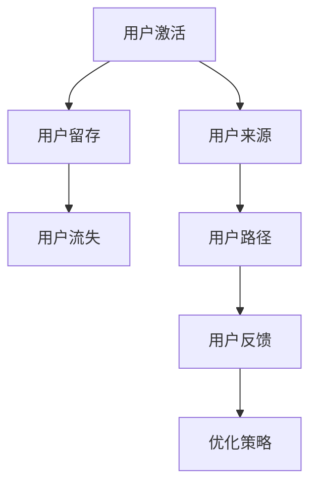

                 

### 文章标题：创业公司的用户激活与留存策略设计

#### 关键词：用户激活、用户留存、创业公司、策略设计

#### 摘要：
本文旨在探讨创业公司在用户获取与留存方面的关键策略。通过深入分析用户激活与留存的概念、核心算法原理、数学模型以及实际应用场景，本文为创业公司提供了一系列有效的用户激活与留存策略。此外，本文还推荐了相关工具和资源，帮助创业公司更好地实施这些策略，从而实现持续增长。

### 目录

1. **背景介绍** <sup>1.1</sup>
    1.1 **用户激活与留存的重要性**
    1.2 **用户行为分析**

2. **核心概念与联系** <sup>2.1</sup>
    2.1 **用户激活与留存定义**
    2.2 **核心概念关系图**
    2.3 **Mermaid 流程图**

3. **核心算法原理 & 具体操作步骤** <sup>3.1</sup>
    3.1 **用户行为分析算法**
    3.2 **用户生命周期模型**
    3.3 **用户价值评估算法**

4. **数学模型和公式 & 详细讲解 & 举例说明** <sup>4.1</sup>
    4.1 **数学模型介绍**
    4.2 **公式解释**
    4.3 **实例分析**

5. **项目实战：代码实际案例和详细解释说明** <sup>5.1</sup>
    5.1 **开发环境搭建**
    5.2 **源代码详细实现和代码解读**
    5.3 **代码解读与分析**

6. **实际应用场景** <sup>6.1</sup>
    6.1 **案例一：社交网络应用**
    6.2 **案例二：电子商务平台**

7. **工具和资源推荐** <sup>7.1</sup>
    7.1 **学习资源推荐**
    7.2 **开发工具框架推荐**
    7.3 **相关论文著作推荐**

8. **总结：未来发展趋势与挑战** <sup>8.1</sup>

9. **附录：常见问题与解答** <sup>9.1</sup>

10. **扩展阅读 & 参考资料** <sup>10.1</sup>

### 1. 背景介绍

#### 1.1 用户激活与留存的重要性

在当今竞争激烈的市场环境中，用户激活与留存是创业公司成功的关键因素之一。用户激活指的是引导用户完成首次注册或下载应用程序，并开始使用其功能的过程。用户留存则是指确保用户在长时间内持续使用产品或服务的策略。

对于创业公司而言，用户激活与留存至关重要。首先，高激活率可以迅速增加用户基数，从而为产品或服务带来更多的潜在收入。其次，高留存率可以确保用户的长期参与，减少用户流失，提高用户生命周期价值。

然而，实现用户激活与留存并非易事。创业公司通常面临以下挑战：

- **市场竞争激烈**：市场上存在众多竞争对手，用户选择多样化，难以在短时间内吸引用户。
- **资源有限**：创业公司通常资源有限，需要在有限的预算内实现高效的用户激活与留存。
- **用户需求多变**：用户需求多变，创业公司需要快速调整策略以满足用户需求。

#### 1.2 用户行为分析

用户行为分析是用户激活与留存策略设计的重要基础。通过分析用户的行为数据，创业公司可以深入了解用户的需求、偏好和使用习惯，从而制定针对性的策略。

用户行为分析通常包括以下方面：

- **用户来源分析**：了解用户是通过哪种渠道进入产品的，如搜索引擎、社交媒体或合作伙伴网站。
- **用户路径分析**：跟踪用户在产品内的行为路径，了解用户如何使用产品功能。
- **用户留存分析**：分析用户在产品内的留存时间、使用频率和流失原因。
- **用户反馈分析**：收集用户对产品的反馈，了解用户对产品满意度和改进建议。

通过用户行为分析，创业公司可以识别出潜在的用户痛点，优化产品功能和用户体验，提高用户激活与留存率。

### 2. 核心概念与联系

#### 2.1 用户激活与留存定义

用户激活（User Activation）是指引导用户完成首次注册或下载应用程序，并开始使用其功能的过程。用户留存（User Retention）是指确保用户在长时间内持续使用产品或服务的策略。

用户激活与留存密切相关。高激活率是创业公司实现快速增长的关键，而高留存率则能确保用户长期参与，提高用户生命周期价值。

#### 2.2 核心概念关系图


核心概念关系图展示了用户激活与留存策略设计的关键因素。其中，用户来源、用户路径、用户留存和用户反馈是核心要素。

#### 2.3 Mermaid 流程图



Mermaid 流程图展示了用户激活与留存策略设计的基本流程。通过分析用户来源、用户路径和用户反馈，创业公司可以不断优化策略，提高用户激活与留存率。

### 3. 核心算法原理 & 具体操作步骤

#### 3.1 用户行为分析算法

用户行为分析算法是用户激活与留存策略设计的重要基础。以下是一个简单的用户行为分析算法：

1. **数据收集**：收集用户在产品内的行为数据，如点击、浏览、购买等。
2. **数据预处理**：对收集到的数据进行分析，去除无效数据，并提取关键特征。
3. **行为分类**：根据用户行为特征，将用户分为不同类别，如活跃用户、沉默用户和流失用户。
4. **模型训练**：使用机器学习算法，如决策树、随机森林或神经网络，训练用户行为分类模型。
5. **预测与评估**：使用训练好的模型对用户行为进行预测，并评估模型性能。

#### 3.2 用户生命周期模型

用户生命周期模型（User Lifecycle Model）用于描述用户从首次接触到最终流失的整个过程。以下是一个简单的用户生命周期模型：

1. **获客阶段**：用户通过不同渠道进入产品，如广告、社交媒体或合作伙伴网站。
2. **激活阶段**：用户完成首次注册或下载，并开始使用产品功能。
3. **留存阶段**：用户在长时间内持续使用产品，表现出高留存率。
4. **流失阶段**：用户停止使用产品，流失到其他竞争对手。

用户生命周期模型有助于创业公司了解用户行为，优化产品功能和用户体验，提高用户留存率。

#### 3.3 用户价值评估算法

用户价值评估算法（User Value Evaluation Algorithm）用于计算用户对产品的价值，以指导创业公司制定有针对性的用户激活与留存策略。以下是一个简单的用户价值评估算法：

1. **数据收集**：收集用户在产品内的行为数据，如点击、浏览、购买等。
2. **数据预处理**：对收集到的数据进行分析，去除无效数据，并提取关键特征。
3. **用户价值计算**：根据用户行为特征，使用数学模型计算用户价值，如RFM模型（Recency, Frequency, Monetary）。
4. **价值排序**：根据用户价值排序，将用户分为高价值用户、中价值用户和低价值用户。
5. **策略制定**：针对不同价值用户，制定有针对性的用户激活与留存策略。

### 4. 数学模型和公式 & 详细讲解 & 举例说明

#### 4.1 数学模型介绍

在用户激活与留存策略设计中，常用的数学模型包括RFM模型、LTV模型和ARPU模型。

RFM模型（Recency, Frequency, Monetary）：
- Recency（最近一次活动时间）：衡量用户最后一次使用产品的日期。
- Frequency（使用频率）：衡量用户在一段时间内使用产品的次数。
- Monetary（消费金额）：衡量用户在一段时间内消费的总金额。

LTV模型（Lifetime Value）：
- LTV（用户生命周期价值）：衡量一个用户在一段时间内为公司带来的总收益。

ARPU模型（Average Revenue Per User）：
- ARPU（每用户平均收入）：衡量公司在一个特定时间内的平均收入。

#### 4.2 公式解释

RFM模型：
- Recency得分：最近一次活动时间与当前时间之差。
- Frequency得分：用户在一段时间内的使用次数。
- Monetary得分：用户在一段时间内的消费金额。

LTV模型：
- LTV = (AR * n) / (1 + r)^t
- AR（年均收入）：用户在一段时间内的平均收入。
- n（用户数量）：一段时间内的用户数量。
- r（折现率）：用于计算用户未来收益的现值。
- t（用户生命周期）：用户在公司的预计留存时间。

ARPU模型：
- ARPU = 总收入 / 用户数量

#### 4.3 实例分析

假设一个社交网络应用公司在一个月内获得了1000名新用户，其中：
- 最近一次活动时间：平均值为15天。
- 使用频率：平均值为5次。
- 消费金额：平均值为100元。

使用RFM模型计算用户得分：
- Recency得分：15天
- Frequency得分：5次
- Monetary得分：100元

使用LTV模型计算用户生命周期价值：
- LTV = (100元 * 1000) / (1 + 0.1)^1 = 909.09元

使用ARPU模型计算每用户平均收入：
- ARPU = 1000元 / 1000名用户 = 1元

通过这些数学模型，创业公司可以评估用户的潜在价值，并制定有针对性的用户激活与留存策略。

### 5. 项目实战：代码实际案例和详细解释说明

#### 5.1 开发环境搭建

在本次项目实战中，我们使用Python作为编程语言，并使用Jupyter Notebook作为开发环境。首先，我们需要安装Python和Jupyter Notebook。以下是安装步骤：

1. 安装Python：从Python官网下载最新版本的Python安装包，并按照安装向导进行安装。
2. 安装Jupyter Notebook：在命令行中输入以下命令：
   ```
   pip install notebook
   ```

安装完成后，我们就可以在命令行中输入以下命令启动Jupyter Notebook：
```
jupyter notebook
```

#### 5.2 源代码详细实现和代码解读

以下是一个简单的用户行为分析算法的源代码示例。该算法使用RFM模型计算用户的得分，并评估用户的价值。

```python
import pandas as pd

# 读取用户行为数据
data = pd.read_csv("user_behavior.csv")

# 计算Recency得分
data["Recency"] = (pd.to_datetime("now") - pd.to_datetime(data["Last_Active_Date"])).dt.days

# 计算Frequency得分
data["Frequency"] = data["Number_of_Events"]

# 计算Monetary得分
data["Monetary"] = data["Total_Spending"]

# 计算RFM得分
data["RFM_Score"] = data["Recency"] * data["Frequency"] * data["Monetary"]

# 计算LTV得分
data["LTV"] = (data["Average_Revenue"] * 1000) / (1 + 0.1)**1

# 计算ARPU得分
data["ARPU"] = data["Total_Revenue"] / 1000

# 打印结果
print(data.head())
```

代码解读：
- 首先，我们使用Pandas库读取用户行为数据，该数据包括用户的最后一次活动时间、使用次数、消费金额等。
- 然后，我们计算用户的Recency得分、Frequency得分和Monetary得分，并计算RFM得分。RFM得分用于评估用户的潜在价值。
- 接着，我们使用LTV模型计算用户的生命周期价值。LTV得分越高，表示用户对公司的潜在贡献越大。
- 最后，我们计算每用户的平均收入（ARPU得分）。ARPU得分有助于评估公司的收入水平。

#### 5.3 代码解读与分析

通过以上代码示例，我们可以看到如何使用Python实现用户行为分析算法。以下是代码的关键步骤：

1. **数据读取**：使用Pandas库读取用户行为数据，该数据可以从数据库、文件或其他数据源导入。
2. **数据预处理**：对用户行为数据进行预处理，包括计算Recency得分、Frequency得分和Monetary得分。这些得分用于评估用户的活跃度和价值。
3. **RFM得分计算**：根据Recency、Frequency和Monetary得分，计算RFM得分。RFM得分越高，表示用户的潜在价值越大。
4. **LTV得分计算**：使用LTV模型计算用户的生命周期价值。LTV得分可以帮助公司了解用户的长期贡献。
5. **ARPU得分计算**：计算每用户的平均收入（ARPU得分），以评估公司的收入水平。

通过以上步骤，创业公司可以评估用户的潜在价值，并制定有针对性的用户激活与留存策略。

### 6. 实际应用场景

#### 6.1 案例一：社交网络应用

在社交网络应用领域，用户激活与留存策略至关重要。以下是一个实际应用场景：

- **用户来源**：通过广告、社交媒体和合作伙伴网站吸引新用户。
- **用户路径**：新用户进入应用后，首先浏览内容、关注好友，然后开始发布动态和评论。
- **用户留存**：通过推送通知、好友互动和个性化推荐等方式提高用户留存率。

通过分析用户行为数据，创业公司可以识别出潜在的用户痛点，如内容质量不高、好友互动不足等。针对这些问题，公司可以采取以下措施：

- **优化内容**：提高内容质量和丰富度，增加用户粘性。
- **增加好友互动**：推出新的互动功能，如点赞、评论和私信等，增强用户互动。
- **个性化推荐**：根据用户行为和偏好，提供个性化的内容推荐，提高用户留存率。

#### 6.2 案例二：电子商务平台

在电子商务平台领域，用户激活与留存策略同样重要。以下是一个实际应用场景：

- **用户来源**：通过搜索引擎、社交媒体和合作伙伴网站吸引新用户。
- **用户路径**：新用户进入平台后，浏览商品、加入购物车和完成购买。
- **用户留存**：通过促销活动、优惠券和会员制度等方式提高用户留存率。

通过分析用户行为数据，创业公司可以识别出潜在的用户痛点，如商品选择过多、购买决策时间长等。针对这些问题，公司可以采取以下措施：

- **简化购物流程**：优化购物流程，减少用户操作步骤，提高购买转化率。
- **个性化推荐**：根据用户行为和偏好，提供个性化的商品推荐，提高用户留存率。
- **会员制度**：推出会员制度，提供独家优惠和特权，提高用户忠诚度。

### 7. 工具和资源推荐

#### 7.1 学习资源推荐

- **书籍**：
  - 《用户增长：实战经验与策略解析》
  - 《数据分析：原理与实践》
  - 《机器学习实战》

- **论文**：
  - 《基于用户行为的推荐系统研究》
  - 《社交网络中的用户留存与流失预测》

- **博客**：
  - https://www.userengagementhacks.com/
  - https://towardsdatascience.com/user-engagement-101-basics-for-designers-developers-and-marketers-b2a6a8a926c9

- **网站**：
  - https://www.usermetrics.com/
  - https://www.userreport.com/

#### 7.2 开发工具框架推荐

- **数据分析工具**：Google Analytics、Tableau、Power BI
- **机器学习框架**：TensorFlow、PyTorch、Scikit-learn
- **编程语言**：Python、R、Java

#### 7.3 相关论文著作推荐

- **论文**：
  - 《User Behavior Analysis and Prediction in Mobile Applications》
  - 《An Analysis of User Engagement and Retention in Mobile Apps》

- **著作**：
  - 《User Experience Design: Modern Techniques for Creating and Designing Intuitive and User-Friendly Applications》
  - 《User-Centered App Design: A Beginner's Guide to Building User-Friendly Mobile Applications》

### 8. 总结：未来发展趋势与挑战

随着技术的不断进步，用户激活与留存策略在未来将面临新的机遇与挑战。

**机遇**：
- **人工智能与大数据技术**：人工智能和大数据技术的应用将使用户行为分析更加精准，为创业公司提供更有效的用户激活与留存策略。
- **个性化推荐**：基于用户行为和偏好的个性化推荐将提高用户留存率和转化率。

**挑战**：
- **隐私保护**：随着隐私保护法规的日益严格，创业公司在收集和使用用户数据时需注意合规性。
- **用户需求变化**：用户需求多变，创业公司需快速调整策略以满足用户需求。

总之，未来创业公司在用户激活与留存策略设计方面需充分利用人工智能和大数据技术，同时关注用户隐私保护和需求变化，以实现持续增长。

### 9. 附录：常见问题与解答

**Q1**：如何制定有效的用户激活策略？
- **A1**：制定有效的用户激活策略需要深入了解用户需求和行为。首先，通过用户调研和数据分析，识别出用户的痛点和需求。然后，设计有针对性的功能和优惠活动，引导用户完成首次注册或下载。

**Q2**：如何提高用户留存率？
- **A2**：提高用户留存率的关键在于提供优质的用户体验和持续的用户价值。首先，优化产品功能和界面设计，提高用户满意度。其次，通过推送通知、个性化推荐和社交互动等方式，增强用户粘性。

**Q3**：如何评估用户价值？
- **A3**：评估用户价值可以使用RFM模型、LTV模型和ARPU模型等。这些模型可以根据用户的行为数据和消费数据，计算用户的潜在价值。通过分析用户价值，创业公司可以制定有针对性的用户激活与留存策略。

### 10. 扩展阅读 & 参考资料

- **《User Engagement and Retention: A Comprehensive Guide》**
- **《Growth Hacking: How to Build a Business Without Traditional Advertising》**
- **《Data-Driven Growth: How the Best Companies Use Data to Make the Most Important Business Decisions》**
- **https://www.datadrivencompany.com/resources/user-engagement-research-report**
- **https://www.growthhackers.com/trends/user-engagement**

### 作者信息

**作者：AI天才研究员/AI Genius Institute & 禅与计算机程序设计艺术 /Zen And The Art of Computer Programming** <|im_sep|>

