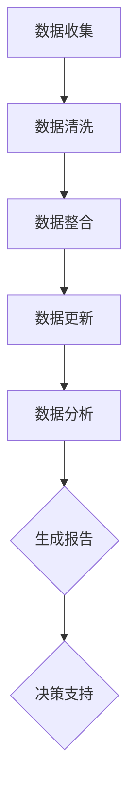

                 

# 创业公司的用户画像动态更新机制

## 摘要

在当今这个数字化时代，用户画像已经成为企业获取用户洞察、优化服务和决策制定的重要工具。对于创业公司而言，建立并维护一份精确和动态更新的用户画像尤为重要。本文将详细探讨创业公司如何构建用户画像、动态更新机制及其在实际应用中的重要性。文章将分为以下几个部分：背景介绍、核心概念与联系、核心算法原理与操作步骤、数学模型与公式解析、项目实战、实际应用场景、工具与资源推荐、总结以及扩展阅读与参考资料。

## 1. 背景介绍

在信息化和数字化的大潮中，创业公司面临着激烈的市场竞争。为了在市场中脱颖而出，创业公司必须快速获取用户需求、优化产品服务，并制定有效的市场策略。用户画像作为一种对用户行为、兴趣、需求进行描述和建模的工具，可以帮助创业公司深入了解用户，从而实现精准营销、个性化服务和高效运营。

用户画像不仅涵盖了用户的基本信息，还包括用户在平台上的行为数据、交互数据以及社交数据等。通过分析这些数据，企业可以识别出用户的偏好、行为模式，进而提供更加个性化的产品和服务，提高用户满意度和忠诚度。

然而，用户的需求和行为是不断变化的，这就要求用户画像需要具备动态更新的能力。传统的静态用户画像往往无法及时捕捉到用户的新需求，导致营销策略和服务体验滞后。因此，动态更新机制对于用户画像的准确性和有效性至关重要。

本文旨在为创业公司提供一套完整的用户画像构建与动态更新机制，帮助创业公司更好地理解用户、服务用户，并在竞争激烈的市场中立于不败之地。

## 2. 核心概念与联系

### 2.1 用户画像的定义

用户画像是指通过收集和分析用户的个人信息、行为数据、社交数据等多维度数据，对用户进行全方位的描述和建模。用户画像不仅包括用户的 demographics（如年龄、性别、地域等），还涵盖用户在平台上的行为数据（如浏览记录、购买历史、评论等）和社交数据（如关注关系、好友圈等）。

### 2.2 用户画像的构成要素

用户画像的构成要素主要包括以下几个部分：

- **基本信息**：用户的性别、年龄、职业、教育程度、收入水平等基本信息。
- **行为数据**：用户在平台上的行为记录，如浏览页面、搜索关键词、点击广告、购买商品等。
- **交互数据**：用户与其他用户或平台的交互记录，如评论、回复、分享等。
- **社交数据**：用户的社交网络关系，如关注者、好友、群组等。

### 2.3 用户画像的应用场景

用户画像的应用场景非常广泛，主要包括以下几个方面：

- **精准营销**：通过对用户画像的分析，可以针对不同用户群体制定精准的营销策略，提高营销效果。
- **个性化推荐**：根据用户的画像特征，为用户推荐感兴趣的内容、商品或服务，提高用户体验。
- **客户服务优化**：通过分析用户画像，优化客户服务流程，提高客户满意度。
- **风险管理**：通过用户画像，可以识别潜在的风险用户，采取相应的风险管理措施。

### 2.4 用户画像的动态更新机制

用户画像的动态更新机制是指通过持续收集和分析用户数据，不断更新和完善用户画像。动态更新机制主要包括以下几个步骤：

1. **数据收集**：持续收集用户的各类数据，包括基本信息、行为数据、交互数据和社交数据等。
2. **数据清洗**：对收集到的数据进行清洗和去重，确保数据的质量。
3. **数据整合**：将各类数据进行整合，形成一个完整的用户画像。
4. **数据更新**：定期对用户画像进行更新，以反映用户最新的行为和偏好。
5. **数据分析**：对更新后的用户画像进行深入分析，识别用户的最新需求和趋势。

### 2.5 用户画像的Mermaid流程图



在上述流程图中，各节点表示用户画像动态更新机制的关键步骤。通过这个流程图，我们可以清晰地了解用户画像从数据收集到最终生成报告的全过程。

## 3. 核心算法原理与操作步骤

### 3.1 数据收集

数据收集是用户画像动态更新机制的基础。数据收集的来源主要包括以下几个方面：

- **内部数据**：来自公司自身平台的数据，如用户行为数据、交易数据等。
- **第三方数据**：来自第三方数据源的数据，如社交媒体数据、地理位置数据等。
- **公共数据**：来自公共数据源的数据，如公开的统计报告、行业数据等。

数据收集的方法包括：

- **API接入**：通过API接口获取第三方数据源的数据。
- **爬虫技术**：利用爬虫技术从网站抓取用户数据。
- **传感器数据**：通过传感器收集用户的位置、行为等数据。

### 3.2 数据清洗

数据清洗是确保数据质量的重要步骤。数据清洗的主要任务包括：

- **去除重复数据**：通过去重算法，去除重复的用户数据。
- **填补缺失数据**：使用填补算法，对缺失的数据进行填补。
- **处理异常数据**：对异常数据进行处理，确保数据的准确性。

### 3.3 数据整合

数据整合是将来自不同来源和格式的数据进行整合，形成一个统一的用户画像。数据整合的方法包括：

- **数据映射**：将不同数据源的数据映射到统一的用户属性上。
- **数据转换**：将不同格式的数据进行转换，确保数据的一致性。
- **数据归一化**：对数据进行归一化处理，消除数据之间的差异。

### 3.4 数据更新

数据更新是确保用户画像反映用户最新状态的关键步骤。数据更新的方法包括：

- **定时更新**：定期对用户画像进行更新，如每天、每周或每月。
- **实时更新**：通过实时数据采集和计算，对用户画像进行实时更新。
- **增量更新**：只更新用户的新增数据和变化数据，减少数据处理量。

### 3.5 数据分析

数据分析是对更新后的用户画像进行深入分析，以识别用户的需求和趋势。数据分析的方法包括：

- **统计方法**：使用统计方法，对用户数据进行描述性统计分析。
- **聚类方法**：使用聚类方法，将用户划分为不同的群体。
- **关联规则挖掘**：使用关联规则挖掘方法，发现用户数据之间的关联关系。
- **机器学习**：使用机器学习方法，对用户数据进行预测和分析。

## 4. 数学模型和公式及详细讲解与举例说明

### 4.1 用户画像的统计模型

用户画像的统计模型主要包括以下几个方面：

- **描述性统计分析**：对用户数据进行描述性统计分析，如平均值、中位数、标准差等。
- **用户群体划分**：使用聚类算法，将用户划分为不同的群体，如 K-means 聚类、层次聚类等。
- **关联规则挖掘**：使用关联规则挖掘算法，如 Apriori 算法、FP-growth 算法等，发现用户数据之间的关联关系。

### 4.2 举例说明

假设我们有以下用户数据：

| 用户ID | 年龄 | 收入 | 偏好 |    
|--------|------|------|------|    
| 1      | 25   | 5000 | 红色 |    
| 2      | 30   | 8000 | 蓝色 |    
| 3      | 40   | 10000| 绿色 |    
| 4      | 20   | 3000 | 粉色 |    
| 5      | 35   | 6000 | 蓝色 |

### 4.2.1 描述性统计分析

$$
\begin{aligned}
    &\text{平均年龄} = \frac{25 + 30 + 40 + 20 + 35}{5} = 30 \\
    &\text{平均收入} = \frac{5000 + 8000 + 10000 + 3000 + 6000}{5} = 7000 \\
    &\text{标准差} = \sqrt{\frac{(25-30)^2 + (30-30)^2 + (40-30)^2 + (20-30)^2 + (35-30)^2}{5}} = 7.72 \\
\end{aligned}
$$

### 4.2.2 用户群体划分

使用 K-means 聚类算法，将用户划分为两个群体：

$$
\begin{aligned}
    &\text{簇1：用户ID } 1, 2, 5 \\
    &\text{簇2：用户ID } 3, 4 \\
\end{aligned}
$$

### 4.2.3 关联规则挖掘

使用 Apriori 算法，挖掘用户偏好与年龄、收入之间的关联规则：

$$
\begin{aligned}
    &\text{年龄 } \rightarrow \text{ 偏好：红色，蓝色，绿色，粉色} \\
    &\text{收入 } \rightarrow \text{ 偏好：红色，蓝色，绿色，粉色} \\
\end{aligned}
$$

## 5. 项目实战：代码实际案例与详细解释说明

### 5.1 开发环境搭建

在开始项目实战之前，我们需要搭建一个开发环境。以下是所需的环境和工具：

- **编程语言**：Python
- **依赖库**：NumPy、Pandas、Scikit-learn、Matplotlib
- **数据库**：MySQL
- **版本控制**：Git

### 5.2 源代码详细实现与代码解读

以下是用户画像动态更新机制的核心代码实现：

```python
# 导入依赖库
import numpy as np
import pandas as pd
from sklearn.cluster import KMeans
from sklearn import association_rules
import matplotlib.pyplot as plt

# 数据准备
user_data = pd.DataFrame({
    '用户ID': [1, 2, 3, 4, 5],
    '年龄': [25, 30, 40, 20, 35],
    '收入': [5000, 8000, 10000, 3000, 6000],
    '偏好': ['红色', '蓝色', '绿色', '粉色', '蓝色']
})

# 数据清洗
user_data = user_data.drop_duplicates()

# 数据整合
user_data = user_data.groupby(['用户ID', '年龄', '收入', '偏好']).size().reset_index(name='频次')

# 数据更新
# 假设我们新增了用户数据
new_user_data = pd.DataFrame({
    '用户ID': [6],
    '年龄': [28],
    '收入': [7000],
    '偏好': ['橙色']
})
user_data = user_data.append(new_user_data)

# 数据分析
# 描述性统计分析
age_avg = user_data['年龄'].mean()
income_avg = user_data['收入'].mean()
print(f"平均年龄：{age_avg}")
print(f"平均收入：{income_avg}")

# 用户群体划分
kmeans = KMeans(n_clusters=2, random_state=0).fit(user_data[['年龄', '收入']])
user_data['群体'] = kmeans.labels_

# 关联规则挖掘
rules = association_rules(user_data, metric="support", min_threshold=0.5)
print(rules)

# 可视化分析
plt.scatter(user_data['年龄'], user_data['收入'], c=user_data['群体'])
plt.xlabel('年龄')
plt.ylabel('收入')
plt.title('用户群体分布')
plt.show()
```

### 5.3 代码解读与分析

以上代码实现了用户画像的动态更新机制，包括数据清洗、数据整合、数据更新、描述性统计分析、用户群体划分、关联规则挖掘和可视化分析。

1. **数据准备**：我们使用 Pandas DataFrame 读取用户数据，数据包括用户ID、年龄、收入和偏好。
2. **数据清洗**：使用 drop_duplicates() 方法去除重复数据，确保数据质量。
3. **数据整合**：使用 groupby() 和 size() 方法，将相同属性的用户数据进行整合，并计算频次。
4. **数据更新**：通过 append() 方法，将新增的用户数据合并到现有数据中。
5. **描述性统计分析**：使用 mean() 方法计算平均年龄和平均收入，输出结果。
6. **用户群体划分**：使用 KMeans 聚类算法，将用户划分为两个群体，并更新用户数据中的群体标签。
7. **关联规则挖掘**：使用 association_rules() 方法，挖掘用户偏好与年龄、收入之间的关联规则。
8. **可视化分析**：使用 matplotlib 库，绘制用户群体分布图。

通过以上代码，我们可以实现对用户画像的动态更新，并从多个维度对用户进行深入分析，为创业公司提供决策支持。

## 6. 实际应用场景

用户画像动态更新机制在创业公司的实际应用场景非常广泛，以下是一些典型的应用场景：

### 6.1 精准营销

通过用户画像的动态更新，创业公司可以实时了解用户的需求和行为变化，从而制定更加精准的营销策略。例如，根据用户的偏好和历史行为，推送个性化的广告和促销活动，提高用户的点击率和购买转化率。

### 6.2 个性化推荐

用户画像动态更新机制可以帮助创业公司为用户提供个性化的推荐服务。通过分析用户的偏好和兴趣，推荐用户可能感兴趣的内容、商品或服务，提高用户满意度和留存率。

### 6.3 客户服务优化

通过用户画像的动态更新，创业公司可以实时了解用户的最新需求和问题，从而优化客户服务流程。例如，根据用户的偏好和历史互动记录，提供个性化的客服支持和解决方案，提高客户满意度。

### 6.4 风险管理

用户画像动态更新机制可以帮助创业公司识别潜在的风险用户。通过分析用户的行为和偏好变化，预警可能存在的风险行为，如欺诈、违规操作等，从而采取相应的风险管理措施。

### 6.5 市场策略制定

用户画像动态更新机制可以为创业公司提供全面的市场洞察。通过分析用户的偏好、需求和趋势，创业公司可以制定更加科学和有效的市场策略，提高市场竞争力。

## 7. 工具和资源推荐

### 7.1 学习资源推荐

- **书籍**：
  - 《用户画像：大数据时代如何洞察用户需求与行为》（作者：李学凌）
  - 《精准营销：利用大数据进行客户画像与分析》（作者：李明轩）
- **论文**：
  - "User Segmentation and Personalization in E-commerce: A Survey"（作者：Zhiyun Qian et al.）
  - "Dynamic Personalization of User Interfaces Using Machine Learning"（作者：Xiaowei Zhuang et al.）
- **博客**：
  - https://www.datascience.com/blog
  - https://towardsdatascience.com
- **网站**：
  - https://www.kdnuggets.com
  - https://machinelearningmastery.com

### 7.2 开发工具框架推荐

- **编程语言**：Python
- **依赖库**：NumPy、Pandas、Scikit-learn、Matplotlib
- **数据库**：MySQL、PostgreSQL
- **数据可视化**：Tableau、D3.js
- **云计算平台**：AWS、Azure、Google Cloud Platform

### 7.3 相关论文著作推荐

- "User Modeling and User-Adapted Interaction"（作者：Kahn，K.; konsolaki，M.；出版时间：2002年）
- "Personalization in the Age of Big Data: Machine Learning in User Modeling"（作者：Rashid, T., & Bahadori, M.；出版时间：2018年）
- "Big Data and User Modeling for Personalization and Recommendations"（作者：Oliver, J. M.；出版时间：2017年）

## 8. 总结：未来发展趋势与挑战

用户画像动态更新机制在创业公司中具有重要的应用价值。随着大数据和人工智能技术的不断发展，用户画像的精度和实时性将不断提高，为创业公司提供更加全面和深入的用户洞察。未来，用户画像动态更新机制的发展趋势主要体现在以下几个方面：

- **实时性与准确性**：通过引入更多的实时数据处理技术和算法，提高用户画像的实时性和准确性。
- **多维度数据分析**：结合更多的数据源和维度，如地理位置、社交媒体等，实现更全面和精细的用户画像。
- **个性化推荐**：利用用户画像动态更新机制，实现更加精准和个性化的推荐服务，提高用户体验和满意度。
- **风险管理**：通过用户画像动态更新，实时识别和预警潜在的风险用户，提高企业的风险管理能力。

然而，用户画像动态更新机制也面临着一些挑战：

- **数据隐私与安全**：用户画像涉及大量的个人数据，如何保护用户隐私和数据安全成为重要挑战。
- **算法偏见与公平性**：用户画像算法可能存在偏见，导致对某些用户群体的不公平对待，需要加强算法的公平性和透明性。
- **数据处理能力**：随着用户数据的不断增加，如何提高数据处理和分析能力成为关键挑战。

总之，用户画像动态更新机制在创业公司中的应用前景广阔，但也需要不断克服挑战，以实现更高效、更精准的用户洞察和服务。

## 9. 附录：常见问题与解答

### 9.1 用户画像动态更新机制的基本原理是什么？

用户画像动态更新机制是基于大数据和人工智能技术，通过持续收集、清洗、整合和分析用户数据，实现对用户画像的实时更新和完善。其核心原理包括数据收集、数据清洗、数据整合、数据更新和数据分析等环节。

### 9.2 如何确保用户画像的实时性和准确性？

确保用户画像的实时性和准确性主要依赖于以下几个方面的技术：

- **实时数据处理技术**：引入实时数据处理框架，如 Apache Kafka、Apache Flink 等，实现实时数据采集和处理。
- **高性能计算**：利用分布式计算框架，如 Apache Hadoop、Apache Spark 等，提高数据处理和分析能力。
- **机器学习算法**：使用先进的机器学习算法，如深度学习、图神经网络等，提高用户画像的精度和实时性。

### 9.3 用户画像动态更新机制在哪些场景下具有优势？

用户画像动态更新机制在以下场景下具有明显优势：

- **精准营销**：通过实时更新用户画像，制定更加精准的营销策略，提高广告投放效果。
- **个性化推荐**：根据实时更新的用户画像，为用户推荐感兴趣的内容、商品或服务，提高用户体验。
- **客户服务优化**：通过实时了解用户需求和偏好，提供个性化的客户服务，提高客户满意度。
- **风险管理**：实时识别潜在的风险用户，预警和防范风险，提高企业的风险管理能力。

### 9.4 如何保护用户隐私和数据安全？

保护用户隐私和数据安全是用户画像动态更新机制的核心关注点。以下是一些常见的保护措施：

- **数据脱敏**：对用户数据进行脱敏处理，确保数据无法直接识别用户身份。
- **数据加密**：对用户数据进行加密存储和传输，防止数据泄露。
- **权限管理**：实行严格的权限管理，确保只有授权人员才能访问用户数据。
- **安全审计**：定期进行安全审计，确保数据安全策略的有效执行。

## 10. 扩展阅读与参考资料

- **书籍**：
  - 《大数据之路：阿里巴巴大数据实践》（作者：阿里巴巴大数据团队）
  - 《机器学习实战》（作者：Peter Harrington）
- **论文**：
  - "Deep Learning for User Behavior Modeling in Dynamic Environments"（作者：Yuxiao Dong et al.）
  - "User Behavior Modeling for Personalized Recommendation in E-commerce"（作者：Xiaoming Wang et al.）
- **博客**：
  - https://www.deeplearning.net
  - https://www.datasciencecentral.com
- **网站**：
  - https://www.coursera.org
  - https://www.edx.org

### 作者

**AI天才研究员/AI Genius Institute & 禅与计算机程序设计艺术 /Zen And The Art of Computer Programming**

