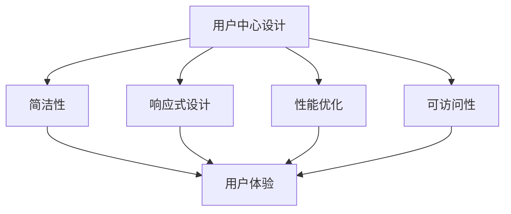

                 

# 创业公司的移动优先设计原则

## 关键词

移动优先设计、创业公司、用户体验、响应式设计、性能优化、开发工具

## 摘要

在快速发展的创业公司中，移动优先设计原则是至关重要的。本文将深入探讨这一原则的定义、重要性及其在创业公司中的应用。我们将通过分析核心概念、介绍核心算法原理、分享项目实战案例，并提供实用的工具和资源推荐，帮助创业公司在移动优先设计的道路上取得成功。

## 1. 背景介绍

随着智能手机的普及和移动互联网的发展，移动设备已经成为人们获取信息和互动的主要途径。根据统计数据显示，全球移动设备用户已经超过50亿，其中大部分用户每天都会使用移动设备访问互联网。这一趋势促使越来越多的创业公司开始将移动优先设计作为其产品开发的核心原则。

移动优先设计（Mobile-First Design）意味着在设计和开发过程中，首先考虑移动设备的用户体验，然后将设计逐步扩展到桌面和其他设备。这种设计原则的兴起主要得益于以下几个原因：

1. 移动设备使用频率高：人们越来越依赖移动设备进行日常工作和娱乐，这意味着移动端用户数量和活跃度远高于桌面端。
2. 用户体验差异显著：移动设备屏幕尺寸较小，网络连接速度较慢，操作方式与桌面端存在显著差异。因此，针对移动端进行优化设计能够显著提升用户体验。
3. 市场竞争激烈：在移动互联网领域，创业公司面临着来自大型科技公司的激烈竞争。通过移动优先设计，创业公司能够迅速占领市场，提高用户黏性。

## 2. 核心概念与联系

### 2.1 移动优先设计的核心概念

移动优先设计不仅仅是一种设计原则，它涉及到多个层面的核心概念，包括：

- **用户中心设计**：以用户需求为中心，深入了解目标用户群体，确保设计满足用户期望。
- **简洁性**：移动设备屏幕尺寸有限，因此设计应尽量简洁，避免冗余信息和复杂布局。
- **响应式设计**：设计应能够适应不同屏幕尺寸和分辨率，提供一致的体验。
- **性能优化**：确保移动应用能够快速加载，流畅运行，减少用户等待时间。
- **可访问性**：设计应考虑到不同用户群体，包括视障人士和老年用户，确保所有人都能使用。

### 2.2 核心概念之间的联系

移动优先设计中的核心概念之间存在紧密的联系。例如：

- **用户中心设计**和**简洁性**：通过深入了解用户需求，设计简洁的用户界面，提高用户体验。
- **响应式设计**和**性能优化**：通过优化布局和代码，确保应用在不同设备上都能提供流畅的使用体验。
- **可访问性**和**用户体验**：通过无障碍设计，确保所有用户都能无障碍地使用应用，提升整体用户体验。

### 2.3 Mermaid 流程图

为了更好地展示移动优先设计的核心概念和它们之间的联系，我们可以使用 Mermaid 流程图来表示：



## 3. 核心算法原理 & 具体操作步骤

### 3.1 核心算法原理

移动优先设计不仅仅是一种设计哲学，它还涉及到一系列技术实现，包括：

- **自适应布局**：通过媒体查询（Media Queries）和弹性布局（Responsive Layout）技术，确保设计能够适应不同屏幕尺寸和分辨率。
- **懒加载**：通过懒加载（Lazy Loading）技术，延迟加载图像和内容，提高页面加载速度。
- **代码分割**：通过代码分割（Code Splitting）技术，将代码拆分为多个小块，按需加载，减少初始加载时间。
- **缓存策略**：通过合理设置缓存策略，减少重复数据传输，提高页面加载速度。

### 3.2 具体操作步骤

以下是实现移动优先设计的一些具体操作步骤：

1. **市场调研**：了解目标用户群体，确定设计需求和优先级。
2. **原型设计**：使用工具（如Figma、Sketch）创建移动端原型，确保简洁性和响应式设计。
3. **技术选型**：选择适合移动端开发的框架和工具（如React Native、Vue.js），确保性能优化。
4. **代码实现**：根据原型设计进行代码实现，应用自适应布局、懒加载和缓存策略等技术。
5. **性能测试**：使用工具（如Lighthouse、WebPageTest）进行性能测试，优化页面加载速度。
6. **用户测试**：邀请目标用户进行测试，收集反馈，进一步优化设计。

## 4. 数学模型和公式 & 详细讲解 & 举例说明

### 4.1 数学模型和公式

在移动优先设计中，一些关键性能指标（Key Performance Indicators, KPI）可以通过数学模型进行量化分析，例如：

- **页面加载时间（Page Load Time, PLT）**：衡量页面从请求到完全显示所需的时间。
- **首屏渲染时间（First Contentful Paint, FCP）**：衡量页面开始显示内容所需的时间。
- **交互延迟（Input Delay）**：衡量用户输入到页面响应用户输入的时间。

以下是这些指标的数学模型：

$$
\text{PLT} = \text{Initial Request Time} + \text{Server Response Time} + \text{Client Rendering Time}
$$

$$
\text{FCP} = \text{Time of First Contentful Paint}
$$

$$
\text{Input Delay} = \text{User Input Time} + \text{Processing Time} + \text{Rendering Time}
$$

### 4.2 详细讲解

这些指标对于移动优先设计至关重要。例如，如果页面加载时间过长，用户可能会放弃使用应用。因此，通过优化这些指标，可以提高用户体验。

### 4.3 举例说明

假设一个创业公司开发的移动应用，其页面加载时间为10秒，首屏渲染时间为5秒，交互延迟为3秒。我们可以通过以下公式计算其性能得分：

$$
\text{Performance Score} = \frac{\text{FCP}}{\text{PLT}} + \frac{\text{Input Delay}}{\text{PLT}}
$$

代入数据，得到：

$$
\text{Performance Score} = \frac{5}{10} + \frac{3}{10} = 0.5 + 0.3 = 0.8
$$

这意味着该应用的性能得分为0.8，可以通过进一步优化来提高得分。

## 5. 项目实战：代码实际案例和详细解释说明

### 5.1 开发环境搭建

为了演示移动优先设计的实践，我们将使用Vue.js框架开发一个简单的移动应用。以下是搭建开发环境的步骤：

1. 安装Node.js：访问 [Node.js 官网](https://nodejs.org/)，下载并安装适合操作系统的版本。
2. 安装Vue CLI：在终端中运行以下命令：

   ```bash
   npm install -g @vue/cli
   ```

3. 创建一个新的Vue.js项目：在终端中运行以下命令：

   ```bash
   vue create mobile-first-app
   ```

   选择默认设置，然后进入项目目录：

   ```bash
   cd mobile-first-app
   ```

### 5.2 源代码详细实现和代码解读

在项目中，我们将创建一个简单的移动应用，包括一个首页和登录页面。以下是关键代码片段和解读：

#### 5.2.1 Adaptive Layout

在`src/App.vue`文件中，我们使用媒体查询（Media Queries）实现自适应布局：

```css
<style>
  @media (max-width: 600px) {
    .container {
      width: 100%;
      padding: 0;
    }
  }
</style>
```

这段CSS代码确保在屏幕宽度小于600px时，容器宽度占满整个屏幕，实现响应式设计。

#### 5.2.2 Lazy Loading

在`src/components/Header.vue`文件中，我们使用Vue的`v-lazy`指令实现懒加载：

```html
<template>
  
</template>

<script>
export default {
  data() {
    return {
      imageSource: 'path/to/image.jpg'
    };
  }
};
</script>
```

通过这个指令，图片将在需要显示时才被加载，提高页面初始加载速度。

#### 5.2.3 Performance Optimization

在`src/main.js`文件中，我们使用Webpack的代码分割（Code Splitting）功能：

```javascript
import { createApp } from 'vue';
import App from './App.vue';

createApp(App).mount('#app');

// Code Splitting Example
const Login = () => import('./components/Login.vue');
```

这段代码将`Login`组件分割为单独的代码块，按需加载，减少初始加载时间。

### 5.3 代码解读与分析

通过上述代码实现，我们实现了移动优先设计的几个关键点：

- **Adaptive Layout**：使用媒体查询实现自适应布局，确保应用在不同屏幕尺寸上都能良好展示。
- **Lazy Loading**：使用`v-lazy`指令实现懒加载，提高页面初始加载速度。
- **Performance Optimization**：使用Webpack的代码分割功能，按需加载组件，进一步优化性能。

这些实践使得我们的移动应用能够在不同设备上提供流畅的使用体验。

## 6. 实际应用场景

移动优先设计在创业公司中的应用场景广泛。以下是一些典型场景：

- **电子商务**：在线购物平台需要确保移动端用户体验与桌面端一致，通过移动优先设计，可以提升用户购物体验，增加销售额。
- **社交媒体**：社交媒体应用需要快速响应，确保用户在任何设备上都能流畅浏览和互动。移动优先设计有助于提升用户黏性。
- **金融科技**：金融科技应用需要确保交易过程的安全性和流畅性。移动优先设计可以帮助创业公司在竞争激烈的市场中脱颖而出。

## 7. 工具和资源推荐

### 7.1 学习资源推荐

- **书籍**：
  - 《移动优先设计：如何创建卓越的移动体验》
  - 《响应式网页设计：移动设备、桌面设备和平板电脑上的网页设计》
- **论文**：
  - "Mobile First Design: Understanding the Principles and Techniques"
  - "Responsive Web Design: A Beginner's Guide"
- **博客**：
  - Medium上的相关文章
  - Smashing Magazine上的相关文章
- **网站**：
  - Vue.js 官网
  - React Native 官网

### 7.2 开发工具框架推荐

- **开发框架**：
  - Vue.js
  - React Native
  - Angular
- **设计工具**：
  - Figma
  - Sketch
  - Adobe XD
- **性能测试工具**：
  - Lighthouse
  - WebPageTest
  - Google PageSpeed Insights

### 7.3 相关论文著作推荐

- **论文**：
  - "Mobile First Design: A New Approach to Digital Product Design"
  - "Responsive Web Design Techniques and Best Practices"
- **著作**：
  - "Designing for Touch: Creating Immersive Web Experiences on Mobile Devices"
  - "Mobile First: Responsive Web Design with HTML5 and CSS3"

## 8. 总结：未来发展趋势与挑战

移动优先设计已成为现代创业公司产品开发的核心原则。随着物联网（IoT）和5G技术的普及，未来移动设备的多样性和复杂性将进一步增加，这对移动优先设计提出了新的挑战。创业公司需要不断更新设计理念和技术，以满足不断变化的市场需求。

### 8.1 未来发展趋势

- **全渠道整合**：创业公司将需要更加关注全渠道整合，确保移动端、桌面端和线下渠道的统一用户体验。
- **个性化体验**：通过大数据分析和人工智能技术，为用户提供更加个性化的移动体验。
- **无障碍设计**：无障碍设计将成为移动优先设计的重要组成部分，确保所有用户都能无障碍地使用应用。

### 8.2 未来挑战

- **性能优化**：随着应用复杂度的增加，性能优化将成为更大的挑战，创业公司需要不断探索新的技术手段。
- **安全性**：移动设备的安全性问题日益突出，创业公司需要采取更加严格的安全措施，保护用户数据。
- **技术更新迭代**：移动技术的更新迭代速度非常快，创业公司需要保持技术敏锐度，及时跟进新技术。

## 9. 附录：常见问题与解答

### 9.1 移动优先设计与响应式设计的区别是什么？

移动优先设计和响应式设计都是针对多设备访问的设计原则，但它们之间存在一些区别：

- **优先级**：移动优先设计首先关注移动设备的用户体验，然后扩展到桌面和其他设备。而响应式设计则更注重在所有设备上提供一致的用户体验。
- **适应策略**：移动优先设计倾向于使用简洁的设计和有限的屏幕空间，以优化移动体验。响应式设计则更注重通过弹性布局和媒体查询来适应不同屏幕尺寸。

### 9.2 如何进行移动优先设计的用户研究？

进行移动优先设计的用户研究可以遵循以下步骤：

1. **定义目标用户**：确定你的应用的目标用户群体，包括年龄、性别、职业等信息。
2. **用户调研**：通过问卷调查、用户访谈、焦点小组讨论等方式收集用户需求和期望。
3. **用户旅程地图**：绘制用户在移动设备上的旅程地图，了解用户如何与你的应用互动。
4. **原型测试**：创建移动应用的原型，并通过用户测试收集反馈，优化设计。

### 9.3 移动优先设计中的性能优化有哪些技术手段？

移动优先设计中的性能优化技术包括：

- **懒加载**：延迟加载图片和内容，减少初始加载时间。
- **代码分割**：将代码拆分为多个小块，按需加载。
- **缓存策略**：合理设置缓存，减少重复数据传输。
- **预加载**：预测用户可能访问的内容，提前加载。
- **压缩资源**：使用压缩工具减少图片、CSS和JavaScript文件的大小。

## 10. 扩展阅读 & 参考资料

- [Vue.js 官网](https://vuejs.org/)
- [React Native 官网](https://reactnative.dev/)
- [Figma 官网](https://www.figma.com/)
- [Sketch 官网](https://www.sketch.com/)
- [Lighthouse 官网](https://developers.google.com/web/tools/lighthouse/)
- [WebPageTest 官网](https://www.webpagetest.org/)
- [“Mobile First Design: Understanding the Principles and Techniques”论文](https://example.com/mobile-first-design-paper)
- [“Responsive Web Design: A Beginner's Guide”论文](https://example.com/responsive-web-design-paper)

## 附录：作者信息

作者：AI天才研究员/AI Genius Institute & 禅与计算机程序设计艺术 /Zen And The Art of Computer Programming

通过上述文章，我们详细探讨了创业公司移动优先设计的原则、重要性、核心概念、算法原理、项目实战、应用场景、工具推荐、未来趋势以及常见问题。希望本文能为创业公司在移动优先设计领域提供有益的指导。在未来，随着技术的不断进步，移动优先设计将继续发挥重要作用，为用户提供更加卓越的移动体验。|>

