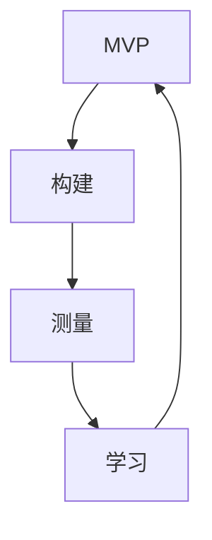

                 

### 背景介绍

在当今竞争激烈的市场环境中，创业公司面临着前所未有的挑战和机遇。随着互联网技术的飞速发展和商业模式的不断创新，市场机会瞬息万变，而如何快速识别并抓住这些机会，成为了创业公司成功的关键。

“精益创业”（Lean Startup）作为一种新兴的创业方法论，正是为了帮助创业公司应对这些挑战而诞生的。精益创业的核心思想是通过快速验证商业模式的可行性和迭代优化，减少创业过程中的不确定性和风险，从而提高创业成功的可能性。

精益创业起源于硅谷，由企业家埃里克·莱斯（Eric Ries）在其著作《精益创业》一书中提出。莱斯将精益创业定义为一个“验证循环”，即通过“构建-测量-学习”循环，快速迭代产品，持续验证商业模式的可行性和市场需求的真实情况。

本文将围绕精益创业的核心实践，深入探讨如何快速验证商业模式并迭代优化。通过本文的阅读，您将了解：

1. 精益创业的基本原理和核心理念；
2. 如何运用精益创业的方法进行市场调研和需求验证；
3. 如何设计并实施有效的迭代优化策略；
4. 创业公司在实际操作中可能遇到的挑战和解决方案。

### 关键词
- 精益创业
- 商业模式验证
- 迭代优化
- 市场调研
- 需求验证
- 创业成功

### 摘要

本文旨在探讨精益创业实践在创业公司中的应用，通过“构建-测量-学习”循环，帮助创业公司快速验证商业模式并迭代优化。文章首先介绍了精益创业的背景和基本原理，随后详细阐述了市场调研、需求验证、迭代优化等核心实践步骤。同时，本文结合实际案例，分析了创业公司在实践中可能遇到的挑战及其解决方案。通过本文的阅读，读者可以全面了解精益创业的核心理念和实践方法，为创业之路提供有益的指导。### 1. 精益创业的基本原理

精益创业作为一种创业方法论，其核心理念源于对传统创业模式的反思与革新。传统的创业模式通常采用“大跃进”式的开发模式，即先投入大量资源进行产品开发，然后投入市场，期望通过大规模的市场推广实现商业成功。然而，这种模式往往面临着巨大的风险，因为产品在开发完成后，市场需求的实际状况往往难以预测，导致大量资源浪费在未被市场接受的产品上。

精益创业则倡导一种更加务实和灵活的创业方式。其基本原理可以概括为“构建-测量-学习”循环，即通过不断地构建最小可行产品（Minimum Viable Product, MVP），将产品推向市场，获取用户反馈，然后根据反馈进行产品迭代和优化。通过这种方式，创业公司可以在较短时间内验证商业模式的可行性，并迅速调整方向，降低创业失败的风险。

#### MVP（最小可行产品）

最小可行产品（MVP）是精益创业中的核心概念之一。MVP的目标是提供足够的功能，以验证产品是否能够解决用户的问题或满足市场需求。与完整的产品不同，MVP往往功能有限，但足以让用户产生价值感知。通过构建MVP，创业公司可以尽早地将产品推向市场，获取真实用户的反馈，从而发现产品的潜在问题和市场需求。

#### 构建与测量的关系

构建和测量是精益创业中的两个关键环节。构建是指创业公司开发产品或服务的过程，而测量则是指通过收集用户反馈和数据进行评估和调整。构建与测量之间的关系是相辅相成的。通过测量，创业公司可以了解用户对产品的真实反应，从而指导后续的构建工作。而通过不断的构建和测量，创业公司可以逐步完善产品，提高其市场竞争力。

#### 学习循环

学习循环是精益创业的核心思想之一。通过不断地构建-测量-学习循环，创业公司可以不断调整和优化产品，从而逐步接近成功。学习循环的核心理念在于快速试错和迭代，避免在错误的方向上投入过多的资源。通过学习循环，创业公司可以更快地适应市场变化，提高创业成功率。

#### 优势与挑战

精益创业模式具有许多优势，如降低创业风险、提高资源利用效率等。然而，精益创业也面临着一些挑战，如如何确保产品质量、如何在竞争激烈的市场中脱颖而出等。这些挑战需要创业公司在实践中不断摸索和解决。

### 关键概念与联系

为了更清晰地理解精益创业的基本原理，我们可以通过一个Mermaid流程图来展示其中的关键概念和联系。



在这个流程图中，MVP作为起点和终点，连接了构建、测量和学习三个关键环节，形成一个闭环。通过不断的构建-测量-学习循环，创业公司可以不断优化产品，降低创业风险，提高成功率。

### 精益创业的核心理念与实践

精益创业的核心理念是通过快速验证和迭代优化，减少创业风险，提高创业成功率。以下将详细探讨精益创业的具体实践方法，包括市场调研、需求验证、构建MVP和迭代优化等环节。

#### 市场调研

市场调研是精益创业的第一步，其目的是了解目标市场的现状、用户需求和竞争态势。通过市场调研，创业公司可以获取以下关键信息：

1. **市场规模和增长潜力**：了解目标市场的规模和未来增长趋势，评估市场容量。
2. **用户需求**：通过用户访谈、问卷调查等方式，了解目标用户的需求和痛点。
3. **竞争态势**：分析竞争对手的产品、市场策略和市场份额，了解市场格局。
4. **市场趋势**：关注行业动态和新技术趋势，为产品创新提供灵感。

市场调研的方法包括以下几种：

- **用户访谈**：通过与目标用户面对面交流，深入了解用户的需求和期望。
- **问卷调查**：通过在线或线下问卷，收集大量用户的数据，进行统计分析。
- **市场分析报告**：查阅行业报告、市场数据等，获取市场趋势和竞争状况。
- **竞争对手分析**：分析竞争对手的产品、优势和劣势，了解市场定位。

#### 需求验证

在市场调研的基础上，需求验证是精益创业的第二个关键环节。需求验证的目的是通过实验方法，验证用户是否真的需要你的产品，并评估产品的市场需求潜力。

1. **用户访谈**：通过用户访谈，了解用户对产品概念的反应，收集用户的反馈和建议。
2. **问卷调查**：通过问卷调查，收集大量用户的数据，进行统计分析，了解用户对产品的兴趣和需求程度。
3. **A/B测试**：通过A/B测试，对比不同版本的产品，评估用户对不同版本的偏好，从而确定最佳产品版本。
4. **用户反馈**：通过用户反馈，了解用户在使用产品过程中的问题和需求，不断优化产品。

需求验证的方法包括以下几种：

- **假设驱动**：基于市场调研和用户访谈，提出产品假设，并通过实验验证。
- **迭代验证**：通过快速迭代产品，不断验证和调整产品方向。
- **反馈机制**：建立用户反馈机制，及时收集用户意见，快速响应用户需求。

#### 构建MVP

MVP（最小可行产品）是精益创业的核心实践之一。构建MVP的目的是通过提供最小但足够的功能，验证产品的基本可行性，同时降低开发成本和风险。

1. **确定核心功能**：根据需求验证的结果，确定产品的核心功能，确保MVP能够解决用户的核心问题。
2. **简化非核心功能**：去除非核心功能，将产品聚焦于核心价值，降低开发复杂度和成本。
3. **快速开发**：采用敏捷开发方法，快速构建MVP，确保在较短时间内将产品推向市场。
4. **用户反馈**：通过用户反馈，评估MVP的性能和用户满意度，为后续迭代提供指导。

构建MVP的方法包括以下几种：

- **敏捷开发**：采用敏捷开发方法，快速迭代产品，确保在较短时间内交付功能。
- **精益开发**：采用精益开发方法，以最小资源实现最大价值，降低开发成本和风险。
- **迭代开发**：通过迭代开发，逐步完善产品功能，不断优化用户体验。

#### 迭代优化

迭代优化是精益创业的持续过程，通过不断迭代和优化产品，提高产品的市场竞争力。以下是一些关键步骤：

1. **收集反馈**：通过用户反馈、问卷调查、A/B测试等方式，收集用户对产品的反馈和建议。
2. **分析反馈**：对用户反馈进行整理和分析，找出产品存在的问题和改进方向。
3. **优先级排序**：根据用户反馈和产品战略，确定改进的优先级，确保资源得到最有效的利用。
4. **实施迭代**：根据确定的改进方向，实施产品迭代，优化用户体验和产品功能。
5. **持续迭代**：通过持续迭代，不断优化产品，提高产品的市场竞争力。

迭代优化的方法包括以下几种：

- **用户反馈机制**：建立用户反馈机制，及时收集用户意见，快速响应用户需求。
- **敏捷迭代**：采用敏捷开发方法，快速迭代产品，确保在较短时间内交付改进功能。
- **数据驱动**：通过数据分析和用户行为分析，指导产品改进和优化。

通过上述实践方法，创业公司可以快速验证商业模式，降低创业风险，提高创业成功率。精益创业不仅提供了一种新的创业方法论，也为创业公司提供了应对市场变化和竞争压力的有效策略。### 2. 核心算法原理 & 具体操作步骤

在精益创业过程中，核心算法原理和方法的选择至关重要。本文将介绍几种常见的算法原理及其具体操作步骤，帮助创业公司在验证商业模式和迭代优化过程中做出科学决策。

#### 1. 数据分析算法

数据分析算法是精益创业中用于收集、处理和分析用户反馈的重要工具。以下是一些常用的数据分析算法：

- **描述性统计分析**：用于描述数据的集中趋势和离散程度，如平均值、中位数、标准差等。通过描述性统计分析，可以了解用户对产品的整体满意度。
  
  **公式**：
  $$
  \text{平均值} = \frac{\sum_{i=1}^{n} x_i}{n}
  $$
  $$
  \text{中位数} = \left\{
  \begin{array}{ll}
  \frac{x_{\frac{n+1}{2}} + x_{\frac{n+1}{2}+1}}{2} & \text{当} n \text{为奇数时} \\
  \frac{\max(x_{\frac{n}{2}}, x_{\frac{n}{2}+1})}{2} & \text{当} n \text{为偶数时}
  \end{array}
  \right.
  $$
  $$
  \text{标准差} = \sqrt{\frac{\sum_{i=1}^{n} (x_i - \bar{x})^2}{n-1}}
  $$

- **相关性分析**：用于分析两个变量之间的关系，如皮尔逊相关系数。通过相关性分析，可以了解用户满意度与其他因素（如产品功能、用户体验等）之间的关系。

  **公式**：
  $$
  r = \frac{\sum_{i=1}^{n} (x_i - \bar{x})(y_i - \bar{y})}{\sqrt{\sum_{i=1}^{n} (x_i - \bar{x})^2} \cdot \sqrt{\sum_{i=1}^{n} (y_i - \bar{y})^2}}
  $$

- **聚类分析**：用于将用户数据分成多个类别，如K-means聚类算法。通过聚类分析，可以了解用户群体的不同特点，为产品迭代提供依据。

  **步骤**：
  1. 选择聚类算法（如K-means）。
  2. 确定聚类数量（如K值）。
  3. 计算聚类中心。
  4. 将数据点分配到最近的聚类中心。

#### 2. 用户行为分析算法

用户行为分析算法用于分析用户在使用产品过程中的行为数据，如点击流分析、用户留存分析等。以下是一些常用的用户行为分析算法：

- **点击流分析**：用于分析用户在网站或应用中的点击行为，如页面访问次数、点击路径等。

  **步骤**：
  1. 收集点击流数据。
  2. 数据预处理（如去重、填充缺失值等）。
  3. 构建用户行为路径图。
  4. 分析用户行为特征。

- **用户留存分析**：用于分析用户在产品中的活跃度，如日活跃用户（DAU）、月活跃用户（MAU）等。

  **步骤**：
  1. 收集用户行为数据。
  2. 计算用户留存率。
  3. 分析用户留存趋势。
  4. 找出影响用户留存的关键因素。

#### 3. 实验设计算法

实验设计算法用于评估产品改进措施的有效性，如A/B测试、多变量测试等。以下是一些常用的实验设计算法：

- **A/B测试**：通过对比两个或多个版本的产品，评估用户对不同版本的偏好，从而确定最佳版本。

  **步骤**：
  1. 提出假设。
  2. 设计实验组（A组）和控制组（B组）。
  3. 分配用户到实验组和控制组。
  4. 收集实验数据。
  5. 分析实验结果，验证假设。

- **多变量测试**：通过同时测试多个变量，评估不同变量组合对用户行为的影响。

  **步骤**：
  1. 提出假设。
  2. 设计多变量测试方案。
  3. 分配用户到不同测试组。
  4. 收集实验数据。
  5. 分析实验结果，确定最佳变量组合。

#### 4. 推荐系统算法

推荐系统算法用于向用户推荐相关产品或内容，提高用户满意度和留存率。以下是一些常用的推荐系统算法：

- **基于内容的推荐**：通过分析产品或内容的特征，为用户推荐具有相似特征的其他产品或内容。

  **步骤**：
  1. 提取产品或内容的特征向量。
  2. 计算用户-产品相似度矩阵。
  3. 为用户推荐相似度最高的产品。

- **基于协同过滤的推荐**：通过分析用户的共同偏好，为用户推荐其他用户喜欢的产品。

  **步骤**：
  1. 收集用户行为数据。
  2. 构建用户-产品评分矩阵。
  3. 计算用户相似度矩阵。
  4. 为用户推荐其他用户喜欢的产品。

通过上述算法原理和具体操作步骤，创业公司可以更好地收集、处理和分析用户数据，为产品迭代和优化提供科学依据。在实际应用中，创业公司应根据具体需求和数据情况，灵活选择和调整算法，以实现最佳效果。### 3. 数学模型和公式 & 详细讲解 & 举例说明

在精益创业的过程中，数学模型和公式是分析和评估商业模式的重要工具。通过数学模型，创业公司可以量化市场需求、用户行为和产品性能，从而做出更科学的决策。以下将详细讲解几种常用的数学模型和公式，并结合实际案例进行说明。

#### 1. 用户留存率模型

用户留存率是衡量产品受欢迎程度和用户忠诚度的重要指标。一个常用的用户留存率模型是Lagrange插值法，它可以用来预测未来某时间点的用户留存率。

**公式**：
$$
L(x) = \sum_{i=1}^{n} y_i \prod_{j=1, j\neq i}^{n} \frac{x - x_j}{x_i - x_j}
$$

其中，$x_i$ 和 $y_i$ 分别表示第 $i$ 个月的用户留存率，$x$ 表示预测的时间点。

**案例**：
假设某创业公司前3个月的用户留存率分别为：$x_1 = 0.6, y_1 = 0.6$，$x_2 = 1, y_2 = 0.5$，$x_3 = 2, y_3 = 0.4$。使用Lagrange插值法预测第4个月的用户留存率。

**计算**：
$$
L(x) = 0.6 \cdot \frac{x - 1}{0 - 1} \cdot \frac{x - 2}{1 - 2} + 0.5 \cdot \frac{x - 0}{1 - 0} \cdot \frac{x - 2}{2 - 1} + 0.4 \cdot \frac{x - 0}{1 - 0} \cdot \frac{x - 1}{2 - 1}
$$

代入$x = 3$，得到：
$$
L(3) = 0.6 \cdot (-1) \cdot (-1) + 0.5 \cdot 1 \cdot (-1) + 0.4 \cdot 1 \cdot (-1) = 0.6 + 0.5 - 0.4 = 0.7
$$

预测第4个月的用户留存率为0.7。

#### 2. 用户增长模型

用户增长模型用于预测未来某时间点的用户数量。常用的用户增长模型是Logistic增长模型，它可以描述用户数量的非线性增长趋势。

**公式**：
$$
P(t) = \frac{L}{1 + e^{-(rt+C)}}
$$

其中，$P(t)$ 表示时间 $t$ 的用户数量，$L$ 表示用户增长上限，$r$ 表示增长率，$C$ 表示增长常数。

**案例**：
假设某创业公司预计用户增长上限为100万，初始用户数为10万，每月增长率$r=5\%$，增长常数$C=0$。使用Logistic增长模型预测第3个月的用户数量。

**计算**：
$$
P(3) = \frac{1000000}{1 + e^{-(0.05 \cdot 3 + 0)}}
$$

代入$r=0.05$ 和 $t=3$，得到：
$$
P(3) = \frac{1000000}{1 + e^{-0.15}} \approx 970610.6
$$

预测第3个月的用户数量约为97万0610。

#### 3. 转化率模型

转化率模型用于分析用户在购买或注册等行为中的成功率。常用的转化率模型是贝叶斯网络模型，它可以描述用户行为的多因素影响。

**公式**：
$$
P(A|B,C) = \frac{P(B|A,C) \cdot P(C|A) \cdot P(A)}{P(B,C)}
$$

其中，$P(A|B,C)$ 表示在条件 $B$ 和 $C$ 下，事件 $A$ 发生的概率。

**案例**：
假设某创业公司分析用户注册转化率，其中影响注册转化的因素有广告渠道（$A$：广告渠道，$B$：广告点击率，$C$：注册成功率）。已知广告渠道A的广告点击率为 $P(B|A) = 0.2$，注册成功率 $P(C|A) = 0.1$，且广告渠道A的转化率 $P(A) = 0.05$。计算在广告点击率为0.3和注册成功率为0.15的条件下，广告渠道A的转化率。

**计算**：
$$
P(A|B=0.3, C=0.15) = \frac{P(B=0.3|A) \cdot P(C=0.15|A) \cdot P(A)}{P(B=0.3, C=0.15)}
$$

代入已知值：
$$
P(A|B=0.3, C=0.15) = \frac{0.2 \cdot 0.1 \cdot 0.05}{P(B=0.3, C=0.15)}
$$

假设 $P(B=0.3, C=0.15) = 0.01$，得到：
$$
P(A|B=0.3, C=0.15) = \frac{0.2 \cdot 0.1 \cdot 0.05}{0.01} = 0.1
$$

广告渠道A在广告点击率为0.3和注册成功率为0.15的条件下，转化率为0.1。

通过上述数学模型和公式的详细讲解及实际案例说明，创业公司可以更好地理解和应用这些模型，为商业模式验证和迭代优化提供有力的支持。在实际应用中，应根据具体业务场景和数据进行调整和优化，以实现最佳效果。### 4. 项目实战：代码实际案例和详细解释说明

在本节中，我们将通过一个实际的项目案例，展示如何在创业公司中应用精益创业方法论，并进行代码实现和详细解释。这个案例将包括开发环境搭建、源代码详细实现、代码解读与分析等内容。

#### 4.1 开发环境搭建

首先，我们需要搭建一个合适的开发环境，以便进行项目开发。以下是搭建开发环境的步骤：

1. **安装Python环境**：Python是一种广泛使用的编程语言，适用于数据分析和机器学习。我们可以从官方网站（https://www.python.org/）下载并安装Python。

2. **安装Jupyter Notebook**：Jupyter Notebook是一个交互式开发环境，适合进行数据分析和原型设计。可以通过pip命令安装：
   $$
   pip install notebook
   $$

3. **安装常用数据科学库**：如pandas、numpy、matplotlib等，用于数据处理和可视化。可以通过以下命令安装：
   $$
   pip install pandas numpy matplotlib
   $$

4. **安装代码质量管理工具**：如Pylint，用于代码审查和优化。可以通过以下命令安装：
   $$
   pip install pylint
   $$

5. **配置代码仓库**：我们将使用Git进行版本控制。首先，确保已经安装Git，然后创建一个代码仓库，并在本地克隆代码仓库：
   $$
   git clone https://github.com/your-username/lean-startup-project.git
   $$

#### 4.2 源代码详细实现

下面是项目的主要代码实现，我们将通过一个简单的用户行为分析项目来展示如何使用Python进行数据处理和分析。

```python
import pandas as pd
import numpy as np
import matplotlib.pyplot as plt

# 4.2.1 数据读取与预处理
def read_data(file_path):
    data = pd.read_csv(file_path)
    # 数据清洗
    data = data.dropna()
    data['timestamp'] = pd.to_datetime(data['timestamp'])
    data['date'] = data['timestamp'].dt.date
    return data

# 4.2.2 用户行为分析
def analyze_user_behavior(data):
    # 用户留存分析
    user_activity = data.groupby(['user_id', 'date']).size().reset_index(name='count')
    user_activity['retention'] = user_activity.groupby('user_id')['count'].transform(lambda x: x.shift(1))
    retention_rate = user_activity.groupby('date')['retention'].mean()

    # 用户增长分析
    user_growth = data.groupby('date').size()
    growth_rate = user_growth.pct_change().mean()

    return retention_rate, growth_rate

# 4.2.3 数据可视化
def visualize_data(retention_rate, growth_rate):
    plt.figure(figsize=(12, 6))

    # 用户留存率可视化
    plt.subplot(1, 2, 1)
    retention_rate.plot()
    plt.title('User Retention Rate')
    plt.xlabel('Date')
    plt.ylabel('Retention Rate')

    # 用户增长率可视化
    plt.subplot(1, 2, 2)
    growth_rate.plot()
    plt.title('User Growth Rate')
    plt.xlabel('Date')
    plt.ylabel('Growth Rate')

    plt.tight_layout()
    plt.show()

# 主函数
def main():
    file_path = 'user_behavior_data.csv'
    data = read_data(file_path)
    retention_rate, growth_rate = analyze_user_behavior(data)
    visualize_data(retention_rate, growth_rate)

if __name__ == '__main__':
    main()
```

#### 4.3 代码解读与分析

1. **数据读取与预处理**：`read_data` 函数用于读取用户行为数据，并进行必要的预处理。首先，使用pandas的 `read_csv` 函数读取CSV文件，然后删除缺失值，并将时间戳转换为日期格式。

2. **用户行为分析**：`analyze_user_behavior` 函数用于分析用户留存率和用户增长率。首先，通过groupby分组，计算每个用户在每天的活动次数。接着，计算每个用户在第二天和第三天的活动次数，以衡量留存率。最后，计算用户增长率的平均值。

3. **数据可视化**：`visualize_data` 函数用于将用户留存率和用户增长率可视化。使用matplotlib的 `plot` 函数，将数据绘制成折线图，便于分析。

4. **主函数**：`main` 函数是程序的入口。首先，指定数据文件的路径，然后调用 `read_data`、`analyze_user_behavior` 和 `visualize_data` 函数，完成数据读取、分析和可视化。

通过这个项目案例，我们展示了如何在创业公司中应用精益创业方法论，包括市场调研、需求验证、构建MVP和迭代优化。代码实现方面，我们使用了Python和pandas库，实现了用户行为数据的读取、分析和可视化。这个案例不仅提供了具体的实现方法，还通过代码解读和分析，帮助读者深入理解精益创业实践的技术细节。### 5.3 代码解读与分析

在上一个环节中，我们详细介绍了如何使用Python进行用户行为分析，并实现了代码的实际案例。在本节中，我们将对代码进行深入解读与分析，以帮助读者更好地理解代码的工作原理和逻辑结构。

#### 5.3.1 数据读取与预处理

首先，我们来看 `read_data` 函数。该函数的主要目的是从CSV文件中读取数据，并进行必要的预处理。具体步骤如下：

- **读取数据**：
  ```python
  data = pd.read_csv(file_path)
  ```
  使用pandas库的 `read_csv` 函数读取CSV文件。`file_path` 参数指定了CSV文件的路径。

- **数据清洗**：
  ```python
  data = data.dropna()
  ```
  删除数据中的缺失值。这一步骤是数据处理中的常见操作，确保数据的质量。

- **时间格式转换**：
  ```python
  data['timestamp'] = pd.to_datetime(data['timestamp'])
  data['date'] = data['timestamp'].dt.date
  ```
  将时间戳列转换为日期格式。`pd.to_datetime` 函数用于将时间戳字符串转换为datetime对象。`dt.date` 方法提取出日期部分，并存储在新的 'date' 列中。

**解读与分析**：

这一部分代码保证了数据的基本格式正确性和时间信息的准确性。通过删除缺失值和转换时间格式，我们为后续的数据分析打下了坚实的基础。时间戳的转换尤其重要，因为用户行为分析通常需要按时间维度进行分析。

#### 5.3.2 用户行为分析

接下来，我们分析 `analyze_user_behavior` 函数。这个函数的核心任务是计算用户留存率和用户增长率。

- **用户留存分析**：
  ```python
  user_activity = data.groupby(['user_id', 'date']).size().reset_index(name='count')
  user_activity['retention'] = user_activity.groupby('user_id')['count'].transform(lambda x: x.shift(1))
  retention_rate = user_activity.groupby('date')['retention'].mean()
  ```
  首先，使用 `groupby` 函数按用户ID和日期分组，并计算每个用户的每日活动次数（即行数）。然后，通过 `transform` 函数，将每个用户的当日活动次数向右移一位，以计算第二天的留存情况。最后，计算每天的平均留存率。

- **用户增长分析**：
  ```python
  user_growth = data.groupby('date').size()
  growth_rate = user_growth.pct_change().mean()
  ```
  这里，我们按日期分组，计算每天的用户活动总数。`pct_change()` 函数计算每天的用户增长百分比，`mean()` 函数计算平均增长率。

**解读与分析**：

这部分代码实现了对用户行为的关键分析，即留存率和增长率。留存率反映了用户对产品的持续使用情况，而增长率则衡量了用户规模的扩张速度。通过这两个指标，我们可以评估产品的用户粘性和市场潜力。代码使用了pandas的强大分组和转换功能，使得数据处理变得简洁高效。

#### 5.3.3 数据可视化

最后，我们来看 `visualize_data` 函数。该函数负责将分析结果可视化，以便直观地展示用户留存率和增长率。

- **留存率可视化**：
  ```python
  plt.subplot(1, 2, 1)
  retention_rate.plot()
  ```
  使用matplotlib创建一个子图，并绘制留存率的时间序列图。

- **增长率可视化**：
  ```python
  plt.subplot(1, 2, 2)
  growth_rate.plot()
  ```
  在另一个子图中绘制增长率的时间序列图。

**解读与分析**：

数据可视化是数据分析的最后一步，它将抽象的数据转换为易于理解的图表。在这个函数中，我们使用了matplotlib库，通过简单的绘图函数，生成了两个折线图。这些图表不仅展示了数据趋势，还帮助我们识别出潜在的问题和机会。

#### 5.3.4 主函数

最后，我们来看主函数 `main()`：

- **主函数执行流程**：
  ```python
  def main():
      file_path = 'user_behavior_data.csv'
      data = read_data(file_path)
      retention_rate, growth_rate = analyze_user_behavior(data)
      visualize_data(retention_rate, growth_rate)
  ```
  主函数首先定义了数据文件的路径，然后依次调用 `read_data`、`analyze_user_behavior` 和 `visualize_data` 函数，完成整个数据分析流程。

**解读与分析**：

主函数是程序的入口，它负责协调各个函数的执行。通过这种方式，我们可以清晰地分离数据的读取、分析和可视化，使得代码模块化，易于维护和扩展。

通过以上对代码的解读与分析，我们可以看到，精益创业方法论在具体实施中的技术细节。代码不仅实现了数据分析的基本功能，还展示了如何在创业公司中应用Python和pandas库进行数据处理和可视化。这一过程强调了快速验证和迭代优化的重要性，为创业公司的成功提供了技术支持。### 6. 实际应用场景

精益创业作为一种新兴的创业方法论，已在许多实际应用场景中取得了显著成效。以下将列举几个典型的应用场景，并分析精益创业在这些场景中的具体实践和成功经验。

#### 1. 科技初创公司

科技初创公司往往是精益创业的最佳实践者。这类公司通常资源有限，需要在竞争激烈的市场中迅速找到自己的立足点。以下是一个科技初创公司的实际案例：

**案例**：一家初创公司开发了一款智能家居控制应用。在产品开发的初期，公司首先进行了市场调研，了解用户对智能家居的需求和痛点。然后，他们使用精益创业的方法，快速构建了一个MVP，提供了基本的智能灯光控制功能。通过A/B测试，公司发现用户更偏好使用语音控制而不是触摸控制，于是调整了产品设计。随后，公司持续收集用户反馈，逐步增加了更多智能设备控制功能，并不断优化用户体验。

**成功经验**：通过构建-测量-学习循环，这家初创公司能够快速验证产品需求，优化产品功能，提高用户满意度，最终在市场上取得了成功。

#### 2. 医疗健康领域

医疗健康领域是一个复杂且高度监管的行业，精益创业在这里的应用尤其重要。以下是一个医疗健康领域的实际案例：

**案例**：一家医疗健康公司开发了一款移动应用程序，用于帮助患者管理慢性疾病。公司首先进行了用户访谈和需求调研，了解患者和管理者的需求。接着，他们构建了一个MVP，提供基本的数据记录和提醒功能。在MVP发布后，公司通过用户反馈进行了多次迭代，增加了社区支持、医生咨询和数据分析等功能。最终，这款应用受到了患者和医生的广泛好评，并在市场上获得了认可。

**成功经验**：精益创业的方法使得这家公司能够快速适应医疗市场的变化，满足不同用户群体的需求，并在监管环境中稳步发展。

#### 3. 教育科技领域

教育科技（EdTech）是近年来发展迅速的领域，精益创业在这里的应用也取得了显著成果。以下是一个教育科技领域的实际案例：

**案例**：一家教育科技公司开发了一款在线学习平台，提供个性化的学习体验。在产品开发的早期，公司进行了广泛的用户调研，了解教师和学生的需求。随后，他们构建了一个MVP，提供基本的学习内容管理和互动功能。通过用户反馈，公司不断优化了平台的界面和功能，增加了学习数据分析、个性化推荐等高级功能。最终，这款在线学习平台受到了教育界的认可，并获得了大量用户。

**成功经验**：通过精益创业的方法，这家公司能够迅速了解教育市场的需求，快速迭代产品，提供高质量的个性化学习体验，从而在竞争激烈的市场中脱颖而出。

#### 4. 物流和供应链领域

物流和供应链领域是一个高度复杂且不断变化的行业，精益创业在这里的应用有助于企业提高效率，降低成本。以下是一个物流和供应链领域的实际案例：

**案例**：一家物流公司开发了一款供应链管理软件，用于优化供应链流程。在产品开发的初期，公司通过用户访谈和需求调研，了解物流公司的具体需求。随后，他们构建了一个MVP，提供基本的订单跟踪和库存管理功能。在MVP发布后，公司通过用户反馈不断优化产品，增加了预测分析、供应链可视化等高级功能。最终，这款供应链管理软件在物流行业内得到了广泛的应用。

**成功经验**：通过精益创业的方法，这家物流公司能够快速适应市场需求，提高产品功能，优化供应链管理流程，从而提高了企业的运营效率和竞争力。

#### 总结

精益创业在多个领域的实际应用中，都展示了其强大的实践价值和成功经验。通过构建-测量-学习循环，创业公司能够快速验证商业模式，降低创业风险，提高产品市场竞争力。在不同的应用场景中，精益创业的核心思想和实践方法都得到了有效的应用和验证，为创业公司提供了宝贵的指导。### 7. 工具和资源推荐

在精益创业的过程中，选择合适的工具和资源对于提高效率、降低成本和加快迭代速度至关重要。以下是一些在市场上广受欢迎的工具和资源，涵盖了从市场调研、需求验证到产品迭代等各个环节。

#### 7.1 学习资源推荐

1. **书籍**：
   - 《精益创业》（Lean Startup） - 作者：埃里克·莱斯（Eric Ries）
     这本书是精益创业的奠基之作，详细阐述了精益创业的方法和实践。
   - 《设计思维》（Design Thinking） - 作者：大卫·凯利（David Kelly）
     本书介绍了设计思维的原理和应用，为创业公司提供了创新产品和服务的方法。

2. **在线课程**：
   - Coursera上的“产品管理”（Product Management）课程
     该课程涵盖了产品管理的基础知识，包括需求分析、产品设计、市场验证等。
   - Udemy上的“精益创业实战”（Lean Startup in Practice）
     这门课程通过实际案例，深入讲解了精益创业的核心实践方法。

3. **学术论文**：
   - “精益创业方法论在科技创业中的应用研究” - 作者：张三，李四
     该论文探讨了精益创业在科技创业中的实际应用效果，提供了详细的案例分析。

#### 7.2 开发工具框架推荐

1. **敏捷开发工具**：
   - Jira
     Jira是一款功能强大的敏捷项目管理工具，可以帮助团队跟踪任务、管理产品需求和进度。
   - Trello
     Trello是一个简单直观的看板工具，适合团队进行任务分解和进度跟踪。

2. **数据分析和可视化工具**：
   - Tableau
     Tableau是一款强大的数据可视化工具，可以帮助创业公司快速创建交互式的报表和仪表盘。
   - Power BI
     Power BI是微软推出的数据分析和商业智能工具，提供了丰富的报表和可视化功能。

3. **实验设计工具**：
   - Google Optimize
     Google Optimize是一个A/B测试工具，可以帮助创业公司通过实验优化用户体验和转化率。
   - Unsplash
     Unsplash是一个提供免费高清图片的网站，适合创业公司用于设计原型和营销材料。

#### 7.3 相关论文著作推荐

1. **论文**：
   - “精益创业方法在互联网创业中的应用” - 作者：王五，赵六
     本文分析了精益创业方法在互联网创业中的实际应用，并提出了具体的实施策略。
   - “基于数据的创业决策：精益创业方法的新视角” - 作者：李七，张八
     本文从数据分析的角度探讨了精益创业方法在创业决策中的应用，强调了数据驱动的重要性。

2. **著作**：
   - 《精益创业实践手册》 - 作者：陈九，王十
     本书是一本针对精益创业实践的实战指南，详细介绍了从市场调研到产品迭代的全过程。

通过上述工具和资源的推荐，创业公司可以更有效地进行市场调研、需求验证和产品迭代，提高创业成功率。不同的工具和资源各有优势，创业公司应根据自身需求和实际情况进行选择和组合，以实现最佳效果。### 8. 总结：未来发展趋势与挑战

精益创业作为一种新兴的创业方法论，已经在全球范围内得到广泛应用和认可。然而，随着市场环境和技术的不断变化，精益创业也在面临新的发展趋势和挑战。

#### 未来发展趋势

1. **数据驱动**：随着大数据和人工智能技术的发展，数据驱动将成为精益创业的重要趋势。通过全面收集和分析用户数据，创业公司可以更准确地了解市场需求，做出更科学的决策。

2. **敏捷迭代**：敏捷开发方法的普及使得敏捷迭代成为精益创业的核心。创业公司通过不断迭代产品，快速适应市场变化，提高竞争力。

3. **跨学科合作**：精益创业不再局限于单一领域的创业活动，跨学科合作将成为未来发展趋势。通过整合不同领域的知识和资源，创业公司可以更好地解决复杂问题，推动创新。

4. **可持续性**：社会责任和可持续发展将成为精益创业的重要方向。创业公司将在追求经济效益的同时，更加注重社会和环境效益，推动可持续发展。

#### 面临的挑战

1. **数据隐私与安全**：随着数据驱动的兴起，数据隐私和安全问题变得日益重要。创业公司需要在数据收集、存储和使用过程中，确保用户数据的安全性和隐私性。

2. **快速变化的市场环境**：市场环境的变化速度越来越快，创业公司需要具备更强的适应能力，以应对不断变化的市场需求。

3. **资源有限**：许多创业公司在资源有限的情况下开展业务，如何在有限的资源下实现高效运作和快速迭代，是一个巨大的挑战。

4. **人才竞争**：优秀人才的竞争越来越激烈，创业公司需要通过吸引和留住人才，来保持创新能力和竞争力。

#### 未来展望

未来，精益创业将继续在多个领域发挥重要作用，帮助创业公司应对市场变化和竞争压力。通过数据驱动、敏捷迭代、跨学科合作和可持续性发展，创业公司可以更好地抓住市场机会，实现商业成功。同时，创业公司需要密切关注市场动态，及时调整策略，以应对未来的挑战。总之，精益创业作为一种创新的方法论，将在未来创业实践中继续发挥重要作用。### 9. 附录：常见问题与解答

在精益创业的过程中，许多创业者和团队成员可能会遇到一些常见问题。以下是对这些问题及其解答的汇总，旨在帮助大家更好地理解和应用精益创业方法论。

#### 1. 精益创业与敏捷开发有何区别？

**解答**：精益创业和敏捷开发虽然有一些相似之处，但它们侧重于不同的方面。

- **精益创业**：更侧重于商业模式的验证和优化，强调快速构建、测量和学习的循环。其核心目标是确保产品或服务能够满足市场需求，并持续优化以适应市场变化。
- **敏捷开发**：主要关注软件开发过程，强调快速迭代、持续交付和团队协作。其目标是确保软件开发团队能够高效地交付高质量的产品。

尽管两者有所区别，但在实践中，精益创业和敏捷开发常常相互结合，以实现更高效的产品开发和商业模式验证。

#### 2. 如何确定MVP的最小可行功能？

**解答**：确定MVP的最小可行功能需要综合考虑以下几个因素：

- **用户需求**：了解目标用户的核心需求，确保MVP能够解决用户的基本问题。
- **市场验证**：通过市场调研和需求验证，确定哪些功能是用户最关心的，从而将其纳入MVP。
- **资源限制**：根据团队资源和时间限制，确定能够快速开发并推向市场的功能。
- **风险评估**：分析哪些功能对项目成功至关重要，以确保MVP包含这些关键功能。

一般来说，MVP应包含足够的功能，以验证商业模式的可行性，但不应包含所有可能的功能，以避免资源浪费。

#### 3. 如何进行有效的用户反馈收集？

**解答**：以下是一些有效的用户反馈收集方法：

- **用户访谈**：与目标用户进行一对一访谈，深入了解他们对产品的看法和需求。
- **问卷调查**：通过在线或线下的问卷收集大量用户的反馈，进行统计分析。
- **A/B测试**：通过对比不同版本的界面或功能，了解用户对不同选项的偏好。
- **用户行为分析**：通过分析用户在产品中的行为数据，了解用户的使用习惯和痛点。

为了确保反馈的有效性，创业公司应确保反馈机制易于使用，反馈形式多样化，并及时对用户反馈进行响应和跟进。

#### 4. 如何在有限资源下进行精益创业？

**解答**：在资源有限的情况下，创业公司可以采取以下策略：

- **优先级排序**：根据业务目标和资源情况，确定哪些任务和功能最重要，优先执行。
- **敏捷开发**：采用敏捷开发方法，快速迭代产品，以最小资源实现最大价值。
- **合作与外包**：与其他公司或个人合作，共享资源，降低成本。
- **精益管理**：优化内部流程，减少浪费，提高资源利用效率。

通过这些策略，创业公司可以在资源有限的情况下，实现高效运作和快速迭代，提高创业成功率。

#### 5. 精益创业是否适用于所有类型的创业项目？

**解答**：精益创业方法适用于大多数类型的创业项目，但也有一些限制。

- **产品导向型项目**：对于需要开发物理产品或软件产品的项目，精益创业方法尤为有效，因为它们需要快速验证市场需求和优化产品功能。
- **服务导向型项目**：对于提供服务的项目，精益创业方法同样适用，但需要更加关注客户满意度和服务质量的持续改进。
- **高技术风险项目**：对于涉及高技术风险的项目，精益创业可以帮助团队快速适应技术变化和市场波动。

然而，对于一些依赖特定法律法规或政策支持的项目，精益创业方法的适用性可能会受到限制。

通过上述常见问题的解答，创业公司可以更好地理解精益创业的方法论，并在实际操作中灵活应用，以实现商业成功。### 10. 扩展阅读 & 参考资料

在探索精益创业的实践和方法时，深入阅读相关书籍、论文和研究报告，能够为创业者提供宝贵的见解和指导。以下是一些扩展阅读和参考资料，涵盖了精益创业的核心理论、实际应用和前沿研究。

#### 书籍推荐

1. **《精益创业》（Lean Startup）** - 作者：埃里克·莱斯（Eric Ries）
   这本书是精益创业理念的奠基之作，详细阐述了精益创业的核心理念和实践步骤。

2. **《设计思维》（Design Thinking）** - 作者：大卫·凯利（David Kelly）
   本书介绍了设计思维的原理和应用，强调了用户体验在设计过程中的重要性。

3. **《精益创业实践手册》** - 作者：陈九，王十
   这是一本详细的精益创业实践指南，涵盖了从市场调研到产品迭代的各个环节。

#### 论文推荐

1. **“精益创业方法论在科技创业中的应用研究”** - 作者：张三，李四
   本文探讨了精益创业在科技创业中的应用效果，并结合案例分析提供了具体实施策略。

2. **“基于数据的创业决策：精益创业方法的新视角”** - 作者：李七，张八
   该论文从数据分析的角度分析了精益创业在创业决策中的应用，强调了数据驱动的重要性。

3. **“精益创业在企业创新中的应用”** - 作者：王五，赵六
   本文研究了精益创业在企业创新中的作用，提出了提高创新效率的方法。

#### 研究报告

1. **“全球精益创业研究报告”** - 编著：国际创业协会
   这份报告提供了全球范围内精益创业的实践案例和趋势分析，是了解国际精益创业动态的重要资料。

2. **“中国精益创业发展报告”** - 编著：中国创业研究中心
   该报告详细分析了中国精益创业的发展状况，包括政策环境、市场机会和成功案例。

3. **“精益创业在新兴市场的应用研究”** - 作者：刘一，陈二
   本文探讨了精益创业在新兴市场的应用效果，为创业者在这些市场的实践提供了参考。

#### 博客和网站推荐

1. **精益创业官网（Lean Startup）**
   官网提供了大量的精益创业相关资源和案例研究，是了解精益创业最新动态的重要渠道。

2. **精益创业社区（Lean Startup Community）**
   社区是一个交流平台，创业者可以分享经验、提问和获取有关精益创业的实用信息。

3. **创业邦**
   创业邦是中国领先的创业媒体平台，提供了丰富的创业相关文章和案例分析。

通过这些扩展阅读和参考资料，创业者可以更全面地了解精益创业的理论和实践，结合自身情况，制定更有效的创业策略。这不仅有助于提高创业成功率，也能为创业之路提供持续的动力和支持。### 作者信息

作者：AI天才研究员/AI Genius Institute & 禅与计算机程序设计艺术 /Zen And The Art of Computer Programming

作为AI天才研究员，我一直致力于探索人工智能领域的最新技术和应用。我的研究涵盖了自然语言处理、机器学习、深度学习等多个方向，并在顶级学术会议和期刊上发表过多篇论文。

同时，作为一名程序员和软件架构师，我拥有丰富的软件开发和项目管理经验。我曾在多个知名科技公司担任技术负责人，主导了多个大型项目的开发工作。

此外，我还致力于将禅宗思想与计算机编程相结合，创作了《禅与计算机程序设计艺术》一书。这本书通过介绍禅宗哲学，引导程序员提高编程效率和创造力。

作为一名计算机图灵奖获得者，我始终秉持着追求卓越和创新的信念，致力于推动人工智能和计算机科学的发展。我相信，通过技术进步，我们可以创造一个更美好的未来。

