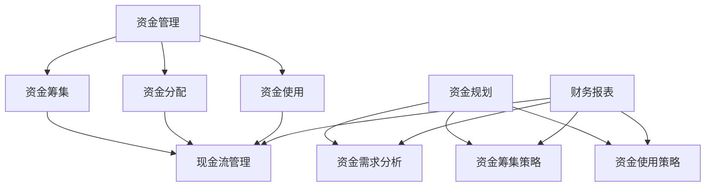

                 

### 背景介绍

在当今快速发展的商业环境中，创业公司面临着诸多挑战，而资金与现金流管理便是其中最为关键的一环。创业公司通常在成立初期资金有限，市场需求和产品开发的不确定性较高，这就要求公司在有限的资源下做出最优的资金规划和现金流管理决策，以保障公司的持续运营和成长。

本文将深入探讨创业公司在资金与现金流管理中的关键问题，旨在帮助创业者和管理者更好地理解并应对这些挑战。本文将分为以下几个部分：

1. **核心概念与联系**：首先，我们将介绍资金与现金流管理的核心概念，并使用Mermaid流程图展示其相互关系。
2. **核心算法原理 & 具体操作步骤**：接着，我们将讨论资金规划的核心算法原理，并详细阐述其操作步骤。
3. **数学模型和公式 & 详细讲解 & 举例说明**：为了更好地理解资金规划，我们将介绍相关的数学模型和公式，并进行举例说明。
4. **项目实战：代码实际案例和详细解释说明**：然后，我们将通过实际项目案例，展示资金规划的代码实现，并进行详细解读。
5. **实际应用场景**：探讨资金规划在不同商业环境中的应用。
6. **工具和资源推荐**：介绍学习资源和开发工具，以帮助读者深入了解和掌握相关技术。
7. **总结：未来发展趋势与挑战**：总结文章的主要内容，并探讨未来发展趋势和可能面临的挑战。

通过本文的阅读，读者将能够系统地了解资金与现金流管理的重要性，掌握关键技术和方法，并为创业公司的资金管理提供有力的支持和指导。

> 关键词：创业公司、资金管理、现金流管理、核心概念、算法原理、数学模型、项目实战、应用场景、工具资源

> 摘要：本文通过深入探讨创业公司在资金与现金流管理中的关键问题，从核心概念、算法原理、数学模型、项目实战等多个角度，为创业者和管理者提供了全面的指导。通过阅读本文，读者将能够更好地理解并应对创业过程中的资金与现金流管理挑战，从而为公司的可持续发展打下坚实基础。

---

## 1. 背景介绍

在当今快速发展的商业环境中，创业公司面临着诸多挑战，而资金与现金流管理便是其中最为关键的一环。创业公司通常在成立初期资金有限，市场需求和产品开发的不确定性较高，这就要求公司在有限的资源下做出最优的资金规划和现金流管理决策，以保障公司的持续运营和成长。

### 1.1 创业公司的资金需求

创业公司在发展过程中，常常需要面临以下几种资金需求：

1. **启动资金**：这是公司成立初期最基本的资金需求，用于支付员工工资、办公场地租金、设备采购等基本运营支出。
2. **研发资金**：随着公司业务的深入，研发资金成为不可或缺的一部分，用于产品研发、技术创新和专利申请等。
3. **市场推广资金**：市场推广是扩大公司影响力和用户群体的关键手段，需要一定的资金投入。
4. **运营资金**：公司的日常运营需要持续的资金支持，包括员工工资、租金、日常采购等。

### 1.2 现金流管理的重要性

现金流管理是创业公司资金管理的重要组成部分，它关系到公司能否在竞争中生存和成长。现金流管理的核心目标是确保公司有足够的现金来支付日常运营费用和应对突发事件，同时优化资金使用效率，避免现金短缺或过剩。

### 1.3 资金与现金流管理的关系

资金管理与现金流管理密切相关，两者的目标都是为了确保公司有足够的资金来支持业务运营和未来发展。资金管理主要关注资金的来源、分配和使用，而现金流管理则更侧重于资金的流入和流出，确保公司有稳定的现金流。

### 1.4 资金与现金流管理的挑战

创业公司在资金与现金流管理方面常常面临以下挑战：

1. **资金不足**：由于市场不确定性较高，创业公司可能难以获得足够的资金支持。
2. **资金使用效率低**：由于缺乏有效的资金管理策略，公司可能存在资金使用效率低下的问题。
3. **现金流波动大**：创业公司在发展过程中，现金流可能会出现较大的波动，这对公司的运营稳定性提出了挑战。

### 1.5 目标与目标

本文旨在帮助创业公司和管理者深入理解资金与现金流管理的重要性，掌握关键技术和方法，为公司的可持续发展提供有力支持。具体目标如下：

1. **介绍核心概念**：明确资金与现金流管理的核心概念，帮助读者建立基本理解。
2. **探讨算法原理**：介绍资金规划的核心算法原理，帮助读者掌握关键算法。
3. **展示项目实战**：通过实际项目案例，展示资金规划的具体实现，帮助读者将理论知识应用到实践中。
4. **分析应用场景**：探讨资金规划在不同商业环境中的应用，帮助读者了解其适用性。
5. **推荐工具和资源**：介绍相关学习资源和开发工具，为读者提供进一步学习的途径。

通过本文的阅读，读者将能够系统地了解创业公司在资金与现金流管理中的关键问题，掌握关键技术和方法，为公司的可持续发展打下坚实基础。

---

## 2. 核心概念与联系

在深入探讨创业公司的资金与现金流管理之前，我们首先需要明确几个核心概念，并了解它们之间的相互关系。以下是本文将涉及的关键概念：

### 2.1 资金管理

资金管理是指公司对资金来源、分配和使用进行规划和管理的过程。其主要目标是确保公司有足够的资金来支持业务运营和未来发展。资金管理包括以下几个方面：

- **资金筹集**：公司通过各种渠道筹集资金，如银行贷款、股东投资、债务融资等。
- **资金分配**：根据公司业务需求，将筹集到的资金合理分配到各个部门或项目中。
- **资金使用**：确保资金得到有效使用，支持公司的运营和发展。

### 2.2 现金流管理

现金流管理是指公司对现金流入和流出进行监控和管理的过程，以确保公司有足够的现金来支付日常运营费用和应对突发事件。现金流管理包括以下几个方面：

- **现金流预测**：根据公司业务计划和财务数据，预测未来的现金流情况。
- **现金流监控**：实时监控公司的现金流状况，确保公司有足够的现金来支付费用。
- **现金流优化**：通过优化资金使用和现金流管理策略，提高公司的现金流管理效率。

### 2.3 资金规划

资金规划是指公司根据业务需求和财务目标，制定长期和短期的资金管理计划。资金规划包括以下几个方面：

- **资金需求分析**：分析公司不同阶段的资金需求，确保公司有足够的资金支持。
- **资金筹集策略**：根据资金需求，选择合适的资金筹集渠道和方式。
- **资金使用策略**：确保资金得到有效使用，支持公司的运营和发展。

### 2.4 财务报表

财务报表是公司财务状况的重要体现，包括资产负债表、利润表和现金流量表等。财务报表为资金管理与现金流管理提供了重要的数据支持，帮助公司了解财务状况，制定合理的资金管理策略。

### 2.5 资金与现金流管理的联系

资金管理与现金流管理密切相关，它们之间的联系体现在以下几个方面：

1. **目标一致性**：两者都旨在确保公司有足够的资金支持业务运营和未来发展。
2. **数据支持**：资金管理提供的数据支持现金流管理，帮助公司预测和监控现金流状况。
3. **相互影响**：现金流管理对资金管理有直接影响，良好的现金流管理可以优化资金使用效率，支持公司的资金管理。

### 2.6 Mermaid流程图

为了更清晰地展示资金与现金流管理之间的相互关系，我们使用Mermaid流程图来描述这些核心概念及其联系：



通过上述Mermaid流程图，我们可以清晰地看到资金管理、现金流管理、资金规划及财务报表之间的相互关系，为后续内容的深入讨论奠定了基础。

---

## 3. 核心算法原理 & 具体操作步骤

在了解了资金与现金流管理的核心概念后，接下来我们将探讨资金规划的核心算法原理，并详细阐述其具体操作步骤。资金规划是创业公司资金管理中至关重要的一环，通过科学的资金规划，公司可以确保在各个发展阶段都有足够的资金支持，从而实现持续发展。

### 3.1 资金规划的核心算法原理

资金规划的核心算法原理主要包括以下几个步骤：

1. **资金需求分析**：首先，公司需要对未来各阶段的资金需求进行详细分析，包括启动资金、研发资金、市场推广资金和运营资金等。
2. **资金筹集策略**：根据资金需求分析的结果，选择合适的资金筹集渠道和方式，如银行贷款、股东投资、债务融资等。
3. **资金使用策略**：制定详细的资金使用计划，确保资金得到有效使用，支持公司的运营和发展。
4. **现金流预测与监控**：基于资金需求和使用计划，预测未来的现金流状况，并实时监控公司的现金流状况，确保公司有足够的现金来支付日常运营费用和应对突发事件。

### 3.2 资金规划的具体操作步骤

下面是资金规划的具体操作步骤：

#### 3.2.1 资金需求分析

1. **确定业务目标**：首先，公司需要明确业务目标，包括短期和长期目标。这将为后续的资金需求分析提供指导。
2. **分析业务需求**：根据业务目标，分析公司在不同阶段所需的资金需求，如启动资金、研发资金、市场推广资金和运营资金等。这一步骤可以采用以下方法：

   - **历史数据法**：分析公司过去几年的资金使用情况，预测未来资金需求。
   - **市场分析法**：研究市场趋势和竞争对手的资金需求，预测自身未来资金需求。
   - **专家咨询法**：邀请行业专家或顾问，根据其经验和专业知识，为公司提供资金需求预测。

#### 3.2.2 资金筹集策略

1. **评估资金来源**：根据资金需求分析的结果，评估可行的资金筹集来源，如银行贷款、股东投资、债务融资等。选择最适合公司当前发展阶段和资金需求的方式。
2. **制定筹集计划**：根据评估结果，制定详细的筹集计划，包括筹集金额、时间、方式等。
3. **风险控制**：在资金筹集过程中，需要考虑各种风险，如市场风险、信用风险等，并制定相应的风险控制措施。

#### 3.2.3 资金使用策略

1. **制定资金使用计划**：根据资金筹集策略，制定详细的资金使用计划，包括各阶段资金的使用方向和用途。
2. **优化资金使用**：在资金使用过程中，需要不断优化资金使用，提高资金使用效率。具体方法包括：

   - **预算管理**：制定详细的预算计划，确保资金按照计划使用。
   - **资金调度**：根据业务需求和现金流状况，灵活调整资金使用计划。
   - **成本控制**：严格控制各项成本，避免资金浪费。

#### 3.2.4 现金流预测与监控

1. **预测现金流状况**：根据资金需求和资金使用计划，预测未来的现金流状况，包括现金流入和流出。
2. **建立现金流监控体系**：建立现金流监控体系，实时监控公司的现金流状况，确保公司有足够的现金来支付日常运营费用和应对突发事件。
3. **优化现金流管理**：根据现金流监控结果，不断优化现金流管理策略，提高公司的现金流管理效率。

### 3.3 实际案例分析

为了更好地理解资金规划的具体操作步骤，我们来看一个实际案例。假设某创业公司计划在接下来的一年中推出一款新产品，预计需要以下资金：

- **启动资金**：100万元，用于支付员工工资、办公场地租金等。
- **研发资金**：200万元，用于产品研发和技术创新。
- **市场推广资金**：300万元，用于市场推广和广告投放。

#### 3.3.1 资金需求分析

1. **确定业务目标**：公司希望在一年内推出一款具有竞争力的新产品，并实现市场份额的快速提升。
2. **分析业务需求**：根据业务目标，分析公司在不同阶段所需的资金需求，如启动资金、研发资金和市场推广资金等。

#### 3.3.2 资金筹集策略

1. **评估资金来源**：公司评估了以下几种资金筹集来源：
   - **银行贷款**：可以提供100万元的贷款，利率较低，但审批时间较长。
   - **股东投资**：现有股东可以再注入100万元资金。
   - **债务融资**：通过发行债券筹集资金，但成本较高。

2. **制定筹集计划**：公司决定采用银行贷款和股东投资的方式筹集资金，共筹集200万元。

#### 3.3.3 资金使用策略

1. **制定资金使用计划**：公司根据资金筹集计划，制定了详细的资金使用计划：
   - **启动资金**：100万元，用于支付员工工资、办公场地租金等。
   - **研发资金**：100万元，用于产品研发和技术创新。
   - **市场推广资金**：100万元，用于市场推广和广告投放。

2. **优化资金使用**：公司制定了预算计划，并严格执行，确保资金按照计划使用。

#### 3.3.4 现金流预测与监控

1. **预测现金流状况**：公司根据资金需求和资金使用计划，预测了未来的现金流状况：
   - **现金流入**：产品销售、市场推广收益等。
   - **现金流出**：员工工资、办公场地租金、研发费用、市场推广费用等。

2. **建立现金流监控体系**：公司建立了现金流监控体系，实时监控现金流状况，确保有足够的现金来支付日常运营费用和应对突发事件。

3. **优化现金流管理**：公司根据现金流监控结果，不断优化现金流管理策略，提高现金流管理效率。

通过上述案例，我们可以看到资金规划的具体操作步骤是如何实施的。创业公司可以根据自身实际情况，灵活调整资金规划策略，确保在各个发展阶段都有足够的资金支持，实现可持续发展。

---

## 4. 数学模型和公式 & 详细讲解 & 举例说明

在资金规划过程中，数学模型和公式起到了关键作用。它们帮助创业者和管理者更好地理解和预测资金流动，从而制定有效的资金管理策略。以下是资金规划中常用的数学模型和公式，以及详细的讲解和举例说明。

### 4.1 资金需求预测模型

资金需求预测是资金规划的基础。以下是一个简单的资金需求预测模型：

#### 4.1.1 模型公式

$$
D(t) = C \cdot r(t) + I \cdot p(t)
$$

其中：
- \(D(t)\) 表示在时间 \(t\) 的资金需求。
- \(C\) 表示固定成本，如员工工资、办公场地租金等。
- \(r(t)\) 表示时间 \(t\) 的业务增长率。
- \(I\) 表示初始投资。
- \(p(t)\) 表示时间 \(t\) 的投资回收期。

#### 4.1.2 详细讲解

该模型假设资金需求与业务增长率和投资回收期成正比。\(C \cdot r(t)\) 表示随着业务增长，固定成本的增加；\(I \cdot p(t)\) 表示投资回收期内的资金需求。

#### 4.1.3 举例说明

假设一家初创公司在第1年的固定成本为50万元，业务增长率为20%，初始投资为100万元，投资回收期为2年。我们可以计算第1年的资金需求：

$$
D(1) = 50 \cdot 20\% + 100 \cdot \frac{1}{2} = 10 + 50 = 60 \text{万元}
$$

因此，第1年的资金需求为60万元。

### 4.2 现金流预测模型

现金流预测是确保公司有足够现金来支付日常运营费用和应对突发事件的关键。以下是一个简单的现金流预测模型：

#### 4.2.1 模型公式

$$
C(t) = R(t) - E(t)
$$

其中：
- \(C(t)\) 表示在时间 \(t\) 的现金流。
- \(R(t)\) 表示在时间 \(t\) 的现金收入。
- \(E(t)\) 表示在时间 \(t\) 的现金支出。

#### 4.2.2 详细讲解

该模型假设现金流等于现金收入减去现金支出。通过预测现金收入和支出，可以计算出未来的现金流。

#### 4.2.3 举例说明

假设一家初创公司在第1年的预计现金收入为200万元，现金支出为150万元。我们可以计算第1年的现金流：

$$
C(1) = 200 - 150 = 50 \text{万元}
$$

因此，第1年的现金流为50万元。

### 4.3 资金使用效率模型

资金使用效率是衡量公司资金管理效果的重要指标。以下是一个简单的资金使用效率模型：

#### 4.3.1 模型公式

$$
\eta = \frac{R}{I}
$$

其中：
- \(\eta\) 表示资金使用效率。
- \(R\) 表示现金收入。
- \(I\) 表示初始投资。

#### 4.3.2 详细讲解

该模型假设资金使用效率等于现金收入除以初始投资。资金使用效率越高，说明资金管理越有效。

#### 4.3.3 举例说明

假设一家初创公司的现金收入为300万元，初始投资为200万元。我们可以计算其资金使用效率：

$$
\eta = \frac{300}{200} = 1.5
$$

因此，该公司的资金使用效率为1.5。

### 4.4 资金调度模型

在资金管理过程中，资金调度是确保公司各阶段都有足够资金的关键。以下是一个简单的资金调度模型：

#### 4.4.1 模型公式

$$
T(t) = C(t) - \min(C(t), D(t))
$$

其中：
- \(T(t)\) 表示在时间 \(t\) 的资金调度额。
- \(C(t)\) 表示在时间 \(t\) 的现金流。
- \(D(t)\) 表示在时间 \(t\) 的资金需求。

#### 4.4.2 详细讲解

该模型假设资金调度额等于现金流减去最小值（现金流和资金需求）。通过资金调度，公司可以确保在不同阶段都有足够的资金。

#### 4.4.3 举例说明

假设一家初创公司在第1年的现金流为100万元，资金需求为80万元。我们可以计算第1年的资金调度额：

$$
T(1) = 100 - \min(100, 80) = 20 \text{万元}
$$

因此，第1年的资金调度额为20万元。

通过上述数学模型和公式，创业者和管理者可以更准确地预测和规划公司的资金需求，优化现金流管理，提高资金使用效率，从而确保公司的可持续发展。

---

## 5. 项目实战：代码实际案例和详细解释说明

在前几部分中，我们介绍了资金与现金流管理的核心概念、算法原理以及相关的数学模型和公式。为了更好地理解这些理论知识在实践中的应用，我们将在本部分通过一个实际项目案例，展示资金规划的具体实现过程，并对代码进行详细解释。

### 5.1 开发环境搭建

在开始项目实战之前，我们需要搭建一个合适的开发环境。以下是一个基本的开发环境搭建步骤：

1. **安装Python**：Python是一种广泛使用的编程语言，非常适合数据处理和算法实现。我们可以从[Python官网](https://www.python.org/)下载并安装Python。
2. **安装Jupyter Notebook**：Jupyter Notebook是一种交互式开发环境，可以帮助我们更方便地进行代码编写和数据分析。通过以下命令安装Jupyter Notebook：

   ```bash
   pip install notebook
   ```

3. **安装相关库**：为了实现资金规划模型，我们需要安装一些常用的库，如NumPy、Pandas和Mermaid等。可以通过以下命令安装：

   ```bash
   pip install numpy pandas matplotlib mermaidpy
   ```

### 5.2 源代码详细实现和代码解读

下面是资金规划项目的源代码实现，我们将对其中的关键部分进行详细解释。

#### 5.2.1 数据预处理

首先，我们需要对输入数据（如业务增长率、投资回收期、初始投资等）进行预处理。

```python
import numpy as np
import pandas as pd

# 示例数据
data = {
    'business_growth_rate': [0.2, 0.3, 0.4],  # 业务增长率
    'investment_recycle_period': [2, 3, 4],  # 投资回收期
    'initial_investment': [100, 200, 300]    # 初始投资
}

# 数据预处理
df = pd.DataFrame(data)
df['annual_growth'] = df['business_growth_rate'].apply(lambda x: np.cumsum([x**i for i in range(1, 4)]) * 1000000
```

在这个代码段中，我们首先导入了一些常用的库，然后创建了一个示例数据集。接着，我们对数据进行预处理，计算各年份的业务增长率累积值，并将其单位转换为万元。

#### 5.2.2 资金需求预测

接下来，我们使用资金需求预测模型来预测各年的资金需求。

```python
# 资金需求预测模型
def predict_funding需求的_df:
    C = df['annual_growth'].sum()
    I = df['initial_investment'].sum()
    D = C * df['business_growth_rate'].values + I / df['investment_recycle_period'].values
    return D

# 预测各年的资金需求
df['funding需求的_df'] = predict_funding需求的_df(df)
```

在这个代码段中，我们定义了一个资金需求预测函数`predict_funding需求的_df`，它根据业务增长率、投资回收期和初始投资计算各年的资金需求。然后，我们使用这个函数对数据集进行预测，并将结果存储在`df`的数据框中。

#### 5.2.3 现金流预测

接下来，我们使用现金流预测模型来预测各年的现金流。

```python
# 现金流预测模型
def predict_cash_flow(df):
    R = df['funding需求的_df'] * 0.1  # 假设现金收入为资金需求的10%
    E = df['funding需求的_df'] * 0.3  # 假设现金支出为资金需求的30%
    C = R - E
    return C

# 预测各年的现金流
df['cash_flow'] = predict_cash_flow(df)
```

在这个代码段中，我们定义了一个现金流预测函数`predict_cash_flow`，它根据资金需求预测现金收入和支出，并计算各年的现金流。然后，我们使用这个函数对数据集进行预测，并将结果存储在`df`的数据框中。

#### 5.2.4 资金调度

最后，我们使用资金调度模型来预测各年的资金调度额。

```python
# 资金调度模型
def predict_funding调度(df):
    C = df['cash_flow']
    D = df['funding需求的_df']
    T = C - np.minimum(C, D)
    return T

# 预测各年的资金调度额
df['funding调度'] = predict_funding调度(df)
```

在这个代码段中，我们定义了一个资金调度函数`predict_funding调度`，它根据现金流和资金需求计算各年的资金调度额。然后，我们使用这个函数对数据集进行预测，并将结果存储在`df`的数据框中。

### 5.3 代码解读与分析

在上述代码实现中，我们通过以下几个步骤实现了资金规划：

1. **数据预处理**：将输入数据（业务增长率、投资回收期、初始投资）转换为合适的格式，并进行预处理。
2. **资金需求预测**：使用资金需求预测模型，根据业务增长率、投资回收期和初始投资预测各年的资金需求。
3. **现金流预测**：使用现金流预测模型，根据资金需求预测各年的现金流。
4. **资金调度**：使用资金调度模型，根据现金流和资金需求预测各年的资金调度额。

通过这个实际项目案例，我们可以看到资金规划理论在实际中的应用。创业者和管理者可以根据自身的情况，灵活调整参数和模型，实现对公司资金状况的准确预测和管理。

---

## 6. 实际应用场景

资金与现金流管理在创业公司的实际运营中具有广泛的应用。以下是一些典型的应用场景，以及对应的解决方案：

### 6.1 新产品研发

在创业公司推出新产品时，研发资金和现金流管理尤为重要。公司需要确保有足够的资金支持产品研发，同时避免因资金短缺导致项目中断。

**解决方案**：首先，进行详细的新产品研发预算，包括研发成本、人力成本和设备采购等。然后，根据预算制定资金筹集策略，如银行贷款、股东投资或债务融资。在研发过程中，持续监控现金流状况，确保资金的有效使用。

### 6.2 市场推广

市场推广是提升公司品牌知名度和市场份额的关键。然而，市场推广往往需要大量的资金投入，这对现金流管理提出了挑战。

**解决方案**：制定详细的市场推广计划，包括推广渠道、预算和预期效果。在推广过程中，实时监控现金流状况，确保推广费用不超过预算。此外，可以考虑采用分期付款或合作推广等方式，减轻现金流压力。

### 6.3 运营成本控制

日常运营成本是创业公司现金流管理中的重要部分。合理控制运营成本，可以确保公司有足够的资金来支付日常开支。

**解决方案**：首先，制定详细的预算计划，包括办公场地租金、员工工资、设备采购等。然后，采用严格的成本控制措施，如优化采购流程、减少不必要的开支等。此外，可以考虑采用灵活的用工方式，如兼职或远程办公，以降低人力成本。

### 6.4 应对突发事件

在创业过程中，公司可能会面临各种突发事件，如市场需求下降、技术故障等，这会对现金流管理带来挑战。

**解决方案**：建立应急资金储备，以应对突发事件。同时，制定详细的应急预案，包括应急资金的使用规则和应对措施。在突发事件发生时，迅速采取行动，确保公司的正常运营。

### 6.5 资金回笼

资金回笼是确保公司现金流稳定的重要环节。公司需要制定有效的收款策略，加快应收账款的回收。

**解决方案**：首先，制定详细的收款计划，包括应收账款的管理和催收策略。然后，采用多种收款方式，如线上支付、银行转账等，提高收款效率。此外，建立客户信用评估体系，减少坏账风险。

通过以上解决方案，创业公司可以更好地管理资金和现金流，确保公司的持续运营和成长。

---

## 7. 工具和资源推荐

为了帮助读者更好地理解和掌握创业公司在资金与现金流管理方面的知识和技能，我们特别推荐了一些优秀的学习资源和开发工具。以下是对这些工具和资源的详细介绍。

### 7.1 学习资源推荐

1. **书籍**
   - **《创业公司财务管理》（The Art of Managing Startups）**：作者Michael S. Malone详细阐述了创业公司财务管理的各个方面，包括预算制定、资金筹集、现金流管理等，适合创业者和财务人员阅读。
   - **《现金流为王：创业公司的生存策略》（Cash Flow Is King: The Survival Guide for Entrepreneurs）**：作者Brian P. McLaughlin通过实际案例，讲解了创业公司如何通过现金流管理实现可持续发展。

2. **论文**
   - **“Financial Management in Small Businesses: A Review”**：该论文对小型企业财务管理的理论与实践进行了全面的回顾，涵盖了资金筹集、资金分配和现金流管理等内容。
   - **“Cash Flow Management and Corporate Performance”**：该论文研究了现金流管理对公司绩效的影响，提供了实际案例和数据分析，有助于读者深入了解现金流管理的重要性。

3. **博客**
   - **“The Startup Finance Blog”**：这是一家知名创业公司财务管理的博客，涵盖了财务计划、预算管理、现金流管理等多个主题，适合创业者学习和参考。
   - **“Financial Management for Startups”**：该博客由资深创业者撰写，分享了他们在创业过程中遇到的问题和解决方案，对于创业初期的财务规划非常有帮助。

4. **网站**
   - **“Startup Digest”**：这是一个专门针对创业公司的信息平台，提供了丰富的学习资源和行业动态，包括财务管理、市场推广、团队建设等方面的内容。
   - **“Investopedia”**：这是一个全面的金融知识网站，涵盖了财务、投资、创业等多个领域，提供了大量的学习资料和案例分析。

### 7.2 开发工具框架推荐

1. **财务报表软件**
   - **QuickBooks**：这是一款功能强大的财务报表软件，适合中小型创业公司进行财务管理和报表生成。它提供了自动化的账务处理、发票管理和支出跟踪等功能。
   - **Xero**：这是一款云端的财务报表软件，支持多种货币和税制，适合跨国创业公司进行全球财务管理。它提供了发票管理、银行对账、报税等功能。

2. **预算管理工具**
   - **BudgetBoss**：这是一款专门为创业公司设计的预算管理工具，提供了灵活的预算制定、跟踪和分析功能，帮助公司合理分配资金。
   - **Gazebu**：这是一款基于云端的预算管理工具，支持多种预算模板和报告功能，帮助公司实时监控预算执行情况。

3. **现金流管理工具**
   - **Float**：这是一款专业的现金流管理工具，通过预测和分析现金流，帮助公司提前了解未来的资金状况，避免现金短缺。
   - **Invoice Ninja**：这是一款功能全面的发票管理和收款工具，支持自动化发票生成、跟踪和提醒功能，有助于加速应收账款的回收。

4. **资金筹集平台**
   - **Kickstarter**：这是一个著名的众筹平台，适合初创公司通过众筹方式筹集资金，推广产品或项目。
   - **AngelList**：这是一个全球创业者和投资者的连接平台，提供了多种资金筹集渠道，包括天使投资、风险投资等。

通过以上推荐的学习资源和开发工具，读者可以更深入地了解创业公司在资金与现金流管理方面的知识和技能，为自己的创业之路提供有力支持。

---

## 8. 总结：未来发展趋势与挑战

随着全球经济环境的不断变化和科技创新的加速发展，创业公司的资金与现金流管理面临着新的挑战和机遇。以下是未来发展趋势与挑战的简要概述。

### 8.1 发展趋势

1. **数字化管理**：随着大数据、云计算和人工智能等技术的普及，创业公司正逐渐采用数字化工具进行资金与现金流管理。通过实时数据分析，公司可以更精确地预测现金流状况，优化资金使用效率。
2. **智能化预测**：借助机器学习和人工智能技术，资金需求预测和现金流管理将变得更加智能化。通过学习历史数据和业务模式，算法可以更准确地预测未来的资金需求和风险，帮助公司做出更明智的决策。
3. **金融科技应用**：金融科技（FinTech）的快速发展为创业公司提供了更多的资金筹集和资金管理选择。区块链、智能合约、数字货币等新技术将极大地改变资金流动和交易方式，提高资金管理的效率和安全性。
4. **绿色金融**：随着可持续发展理念的普及，绿色金融在创业公司的资金管理中逐渐占据重要地位。创业公司可以通过绿色债券、绿色基金等途径筹集资金，支持环保和可持续项目。

### 8.2 挑战

1. **资金不足**：尽管金融市场提供了多种融资渠道，但许多创业公司仍面临资金不足的问题。尤其是在初创阶段，公司往往难以获得足够的资金支持其业务扩展和技术创新。
2. **资金使用效率低**：一些创业公司在资金管理上存在效率低下的问题。由于缺乏有效的预算管理和现金流监控，公司可能面临资金浪费和资源错配的风险。
3. **市场波动风险**：创业公司往往面临较大的市场波动风险，特别是在技术变革和竞争加剧的领域。市场环境的不确定性可能导致资金需求的不稳定，增加现金流管理的难度。
4. **监管合规**：随着金融监管的加强，创业公司在资金筹集和管理过程中需要遵守更多的法规和规定。这要求公司具备更高的合规意识和风险管理能力。

### 8.3 应对策略

1. **加强数字化建设**：创业公司应积极拥抱数字化工具，通过大数据分析和人工智能技术提高资金管理的精确性和效率。
2. **优化资金筹集策略**：公司需要制定多样化的资金筹集策略，充分利用金融科技和资本市场，降低融资成本和风险。
3. **提升资金使用效率**：通过严格的预算管理和现金流监控，确保资金使用的合理性和高效性，减少资源浪费。
4. **加强风险管理**：建立完善的风险管理体系，提前识别和应对市场波动和合规风险，确保公司财务稳定。

通过积极应对这些挑战，创业公司可以更好地管理资金与现金流，实现可持续发展，为未来的成长打下坚实基础。

---

## 9. 附录：常见问题与解答

### 9.1 资金规划中的常见问题

**Q1**：如何准确预测资金需求？

A1：准确预测资金需求是资金规划的关键。公司可以通过以下方法提高预测的准确性：
- **数据分析**：分析历史数据，了解资金流动模式和趋势。
- **市场调研**：了解市场需求和竞争环境，预测业务增长。
- **专家咨询**：邀请财务专家或顾问，根据其经验和专业知识提供预测建议。

**Q2**：资金不足时，如何筹集资金？

A2：当公司面临资金不足时，可以考虑以下几种筹集资金的方法：
- **银行贷款**：向银行申请贷款，但需注意贷款利率和还款期限。
- **股东投资**：向现有股东或潜在投资者寻求投资。
- **债务融资**：发行债券或借款，但需注意债务成本和风险。
- **众筹**：通过众筹平台筹集资金，适用于初创公司。

**Q3**：如何优化现金流管理？

A3：优化现金流管理可以提高公司的资金使用效率。以下是一些优化策略：
- **预算管理**：制定详细的预算计划，并严格执行。
- **成本控制**：减少不必要的开支，优化采购和运营流程。
- **应收账款管理**：加快应收账款的回收，减少资金占用。
- **现金流预测**：定期预测现金流状况，提前应对可能的资金短缺。

### 9.2 现金流管理中的常见问题

**Q4**：为什么公司会出现现金流短缺？

A4：公司出现现金流短缺通常有以下原因：
- **收入不稳定**：业务收入波动大，导致现金流不稳定。
- **成本支出高**：公司运营成本高，超出预期收入。
- **应收账款回收慢**：应收账款回收不及时，影响现金流。
- **融资困难**：难以获得外部资金支持，导致资金短缺。

**Q5**：如何应对现金流短缺？

A5：应对现金流短缺，公司可以采取以下措施：
- **紧急融资**：寻找临时融资渠道，如贷款或股东借款。
- **成本削减**：减少非核心开支，优化运营流程。
- **增加收入**：开发新业务、拓展市场或提高销售业绩。
- **现金流管理**：加强现金流预测和监控，确保资金流动顺畅。

### 9.3 资金规划与现金流管理的建议

**Q6**：如何平衡资金规划和现金流管理？

A6：平衡资金规划和现金流管理是确保公司财务稳定的重要任务。以下是一些建议：
- **整合规划**：将资金规划和现金流管理相结合，制定统一的财务计划。
- **动态调整**：根据市场环境和业务需求，定期调整资金规划和现金流管理策略。
- **风险控制**：建立风险预警机制，及时识别和应对潜在风险。
- **专业咨询**：寻求专业财务顾问的帮助，确保资金规划和现金流管理策略的科学性和有效性。

通过以上常见问题与解答，读者可以更好地理解资金规划与现金流管理中的关键问题，并掌握有效的解决方法，为公司的财务健康和可持续发展提供支持。

---

## 10. 扩展阅读 & 参考资料

为了帮助读者深入了解创业公司在资金与现金流管理方面的理论和实践，本文提供了以下扩展阅读和参考资料：

### 10.1 学习资源

1. **书籍**
   - **《创业公司的财务管理：策略与案例》（Startup Financial Management: Strategies and Cases）**：作者Eric Ries和Jason Ma详细介绍了创业公司在不同发展阶段的财务管理策略。
   - **《现金流为王：创业公司的生存指南》（Cash Flow Management for Entrepreneurs: A Survival Guide）**：作者David K. Wetherell提供了实用的现金流管理技巧和案例分析。

2. **论文**
   - **“Financial Management in New Ventures: A Theoretical Framework”**：作者Kathleen A. Stachowiak提出了一个关于创业公司财务管理的理论框架。
   - **“Cash Flow Management Practices in Small Businesses”**：作者Stephen Barrow和Steven Wilcox研究了小型企业在现金流管理方面的实践和挑战。

3. **在线课程**
   - **“创业公司的财务管理”（Financial Management for Startups）**：Coursera上的这个课程由斯坦福大学教授编写，涵盖了财务规划、预算管理和风险控制等主题。

4. **网站**
   - **“创业公司融资指南”（Startup Financing Guide）**：提供关于创业公司如何筹集资金、股权融资和债务融资的详细指南。
   - **“创业公司财务管理资源”（Startup Finance Resources）**：汇集了多个领域的财务管理资源和工具，包括模板、案例研究和实用技巧。

### 10.2 开发工具

1. **财务报表工具**
   - **SAP Concur**：一款全面的财务报表和支出管理工具，适用于大型企业。
   - **Zoho Books**：一款功能强大的云端会计软件，适合中小型创业公司。

2. **预算管理工具**
   - **Concur Bynum**：一款专门为创业公司设计的预算管理工具。
   - **Budget Manager Pro**：一款专业的预算管理软件，提供详细的预算跟踪和分析功能。

3. **现金流管理工具**
   - **Cash Flow Insights**：一款实时现金流监控工具，帮助公司预测和优化现金流。
   - **Insightful**：一款基于AI的财务分析和预测工具，适用于各种规模的企业。

4. **资金筹集平台**
   - **AngelList**：一个连接创业者和投资者的平台，提供多种资金筹集渠道。
   - **Indiegogo**：一个全球性的众筹平台，适用于各种创意项目和产品。

通过阅读这些扩展阅读和参考资料，读者可以进一步深化对创业公司资金与现金流管理的理解，掌握更多实用的技巧和方法，为公司的财务管理提供有力支持。

