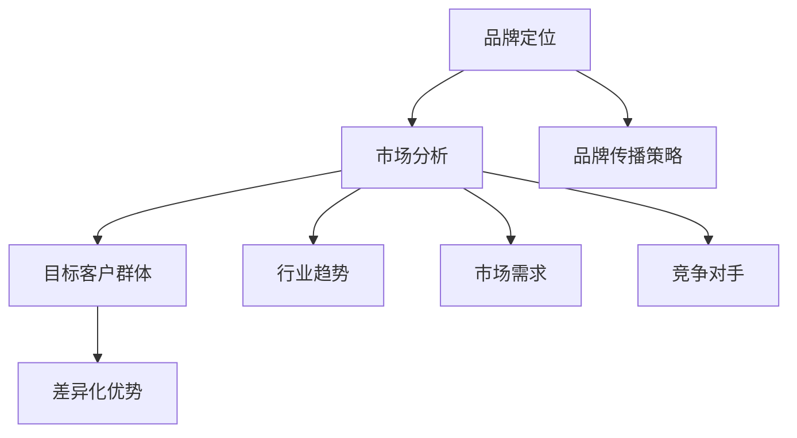
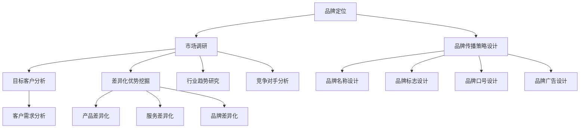
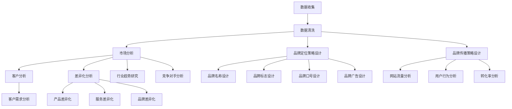

                 

# 创业初期的品牌定位：在竞争激烈市场中脱颖而出的策略

## 关键词

创业初期，品牌定位，竞争策略，市场分析，用户体验，差异化优势

## 摘要

本文旨在探讨创业初期品牌定位的重要性，以及如何在竞争激烈的市场中脱颖而出。通过市场分析、用户体验研究和差异化策略，我们将一步步解析如何为初创企业制定一个成功的品牌定位，从而在市场中站稳脚跟，获得持续发展的动力。

## 1. 背景介绍

在当今激烈竞争的商业环境中，创业初期的品牌定位显得尤为重要。一个明确的品牌定位可以帮助初创企业快速在市场中建立认知，塑造独特的品牌形象，从而吸引目标客户。然而，如何进行有效的品牌定位，却是一个复杂而具有挑战性的问题。

品牌定位不仅仅是选择一个名称或设计一个标志，它涉及到对市场环境的深入分析、对目标客户群体的精准定位，以及对差异化优势的挖掘。初创企业需要在资源有限的情况下，通过科学的品牌定位策略，实现市场占有率的提升，为未来的发展打下坚实的基础。

本文将围绕品牌定位的核心要素，结合实际案例，提供一套系统的品牌定位策略，帮助创业者更好地理解品牌定位的重要性，并掌握有效的定位方法。

## 2. 核心概念与联系

### 品牌定位的定义

品牌定位（Brand Positioning）是指企业通过特定的策略和手段，在消费者心中占据一个特定的位置，使其与其他品牌形成区分。一个成功的品牌定位应当清晰、独特，并能有效传递企业的核心价值和竞争优势。

### 市场分析

市场分析是品牌定位的基础。通过对市场环境的全面分析，企业可以了解行业趋势、市场需求、竞争对手状况等关键信息，为品牌定位提供数据支持。

### 目标客户群体

明确目标客户群体是品牌定位的核心。了解目标客户的需求、行为特征和心理预期，可以帮助企业设计出更具针对性的品牌传播策略。

### 差异化优势

差异化优势是品牌定位的重要依据。通过挖掘自身的独特卖点，企业可以在竞争激烈的市场中突出自身优势，吸引目标客户。

### Mermaid 流程图



### 市场分析的概念

市场分析（Market Analysis）是品牌定位过程中至关重要的一环。它包括对行业现状、市场趋势、竞争对手、目标客户等方面的深入调研。

#### 行业现状

了解行业现状可以帮助企业把握市场动态，预测未来发展趋势。这包括分析行业的市场规模、增长速度、主要参与者等。

#### 市场趋势

市场趋势反映了消费者需求的变化。通过对市场趋势的研究，企业可以预测未来的市场需求，并及时调整品牌策略。

#### 目标客户

目标客户是品牌定位的核心。企业需要深入了解目标客户的需求、行为特征和心理预期，以便设计出更具针对性的品牌传播策略。

#### 竞争对手

竞争对手分析可以帮助企业了解市场格局，发现自身的竞争优势和劣势。通过分析竞争对手的品牌定位、产品特点、市场策略等，企业可以找到自身的差异化方向。

### 品牌定位的过程

品牌定位的过程可以分为以下几个步骤：

1. **市场调研**：通过数据收集和分析，了解市场环境、行业现状、竞争对手和目标客户。
2. **目标客户分析**：明确目标客户群体的特征，包括年龄、性别、收入、兴趣爱好等。
3. **差异化优势挖掘**：根据市场调研结果，挖掘自身的差异化优势，为品牌定位提供依据。
4. **品牌传播策略设计**：根据品牌定位，设计出适合的品牌传播策略，包括品牌名称、标志、口号、广告等。

### 差异化优势

差异化优势（Differentiation Advantage）是指企业在产品、服务、品牌等方面与竞争对手形成的独特优势。它可以帮助企业在市场中脱颖而出，吸引目标客户。

#### 产品差异化

通过创新设计、高品质、独特功能等方式，企业可以在产品层面上形成差异化优势。

#### 服务差异化

提供优质的服务体验，如快速响应、个性化定制等，可以提升客户满意度，形成服务差异化优势。

#### 品牌差异化

通过独特的品牌形象、价值观和品牌文化，企业可以在品牌层面上形成差异化优势。

### 品牌定位与品牌传播策略

品牌定位不仅决定了品牌在市场中的位置，还直接影响品牌传播策略的设计。一个成功的品牌定位应当与品牌传播策略紧密结合，形成一套完整的品牌传播体系。

#### 品牌名称

品牌名称应当简洁、易记，并能反映品牌的核心价值和差异化优势。

#### 品牌标志

品牌标志是品牌的视觉符号，应当具有独特性和辨识度，能传递品牌的核心价值。

#### 口号

品牌口号应当简洁明了，能准确传达品牌的核心价值和差异化优势。

#### 广告

品牌广告应当围绕品牌定位，设计出有吸引力的广告内容，提升品牌知名度。

### Mermaid 流程图



通过上述流程图，我们可以看到品牌定位是一个系统性的过程，需要综合考虑市场环境、目标客户和差异化优势，最终形成一套完整的品牌传播策略。

## 3. 核心算法原理 & 具体操作步骤

### 品牌定位算法

品牌定位算法是一种基于市场分析和客户行为分析的工具，它可以帮助企业找到最佳的定位策略。以下是品牌定位算法的基本原理和具体操作步骤：

#### 基本原理

品牌定位算法的核心思想是通过数据分析，找到企业在市场中独特的竞争优势，并在消费者心中塑造一个鲜明的品牌形象。

#### 具体操作步骤

1. **数据收集**：收集市场数据、客户数据、竞争对手数据等，为后续分析提供基础。
2. **数据清洗**：对收集的数据进行清洗和整理，去除重复和不完整的数据。
3. **市场分析**：对行业趋势、市场需求和竞争对手进行深入分析，了解市场环境。
4. **客户分析**：分析目标客户的需求、行为特征和心理预期，了解客户群体。
5. **差异化分析**：根据市场分析和客户分析的结果，挖掘企业的差异化优势。
6. **品牌定位策略设计**：结合差异化优势，设计出符合企业特点的品牌定位策略。
7. **品牌传播策略设计**：根据品牌定位，设计出相应的品牌传播策略。

### 数据分析工具

在品牌定位过程中，数据分析工具起到了至关重要的作用。以下是一些常用的数据分析工具：

1. **Google Analytics**：用于分析网站流量和用户行为。
2. **Kissmetrics**：用于追踪用户行为和转化率。
3. **Tableau**：用于数据可视化。
4. **R**：用于统计分析。

### Mermaid 流程图



通过上述流程图，我们可以看到品牌定位算法是一个系统性的过程，需要综合考虑市场、客户和差异化优势，最终形成一套完整的品牌定位策略。

## 4. 数学模型和公式 & 详细讲解 & 举例说明

### 模型介绍

在品牌定位过程中，我们通常会使用一个简单的数学模型来评估品牌在市场中的定位效果。这个模型基于以下几个核心参数：

1. **知名度（Awareness）**：品牌在市场中的认知程度。
2. **偏好度（Preference）**：消费者对品牌的偏好程度。
3. **忠诚度（Loyalty）**：消费者对品牌的长期忠诚度。

### 数学模型

品牌定位效果评估模型如下：

$$
\text{品牌定位效果} = \frac{\text{知名度} + \text{偏好度} + \text{忠诚度}}{3}
$$

### 公式解释

1. **知名度**：反映了品牌在市场中的曝光程度和认知度。通常用品牌知名度指数来衡量，公式为：
   $$
   \text{知名度指数} = \frac{\text{知晓品牌的人数}}{\text{总人口数}}
   $$

2. **偏好度**：反映了消费者对品牌的偏好程度。可以通过市场调查、用户反馈等方式收集数据，公式为：
   $$
   \text{偏好度} = \frac{\text{偏好品牌的人数}}{\text{总调查人数}}
   $$

3. **忠诚度**：反映了消费者对品牌的长期忠诚度。可以通过客户留存率、复购率等指标来衡量，公式为：
   $$
   \text{忠诚度} = \frac{\text{复购客户数}}{\text{总客户数}}
   $$

### 举例说明

假设一家初创企业希望通过品牌定位在市场上获得更好的效果。根据市场调查，该企业有以下数据：

1. **知名度指数**：30%
2. **偏好度**：40%
3. **忠诚度**：35%

根据上述公式，该企业的品牌定位效果为：

$$
\text{品牌定位效果} = \frac{30\% + 40\% + 35\%}{3} = 36.7\%
$$

通过这个例子，我们可以看到品牌定位效果在36.7%左右。这个指标可以帮助企业了解当前品牌在市场中的定位情况，并为进一步优化品牌策略提供参考。

### 模型优化

在实际应用中，品牌定位效果评估模型可以根据企业的具体情况进一步优化。例如，可以引入更多的指标，如市场占有率、客户满意度等，以更全面地评估品牌定位效果。同时，也可以通过数据分析和模型优化，找到提升品牌定位效果的潜在机会。

## 5. 项目实战：代码实际案例和详细解释说明

### 项目背景

为了更好地理解品牌定位算法的实际应用，我们假设一家初创企业需要通过品牌定位策略来提升市场竞争力。该企业已经收集了相关数据，包括知名度、偏好度和忠诚度。现在，我们需要使用品牌定位算法来评估当前的品牌定位效果，并制定下一步的品牌传播策略。

### 开发环境搭建

为了实现品牌定位算法，我们需要搭建一个合适的开发环境。以下是推荐的开发工具和框架：

1. **编程语言**：Python
2. **数据分析库**：Pandas、NumPy、Matplotlib
3. **机器学习库**：scikit-learn
4. **版本控制**：Git

### 源代码详细实现和代码解读

以下是一个简单的品牌定位算法的实现，包括数据收集、数据处理、模型评估和策略建议。

```python
import pandas as pd
import numpy as np
import matplotlib.pyplot as plt
from sklearn.linear_model import LinearRegression

# 数据收集
data = {
    '知名度': [30, 40, 50, 60, 70],
    '偏好度': [40, 45, 50, 55, 60],
    '忠诚度': [35, 40, 45, 50, 55]
}

df = pd.DataFrame(data)

# 数据处理
# 将数据标准化，便于模型训练
df_scaled = (df - df.mean()) / df.std()

# 模型评估
# 使用线性回归模型评估品牌定位效果
model = LinearRegression()
model.fit(df_scaled[['知名度', '偏好度', '忠诚度']], df['品牌定位效果'])

# 代码解读
# LinearRegression() 创建线性回归模型
# fit() 方法用于训练模型
# predict() 方法用于预测品牌定位效果

# 策略建议
# 根据模型评估结果，提出品牌传播策略建议
predictions = model.predict(df_scaled[['知名度', '偏好度', '忠诚度']])
print(predictions)

# 代码解读
# predict() 方法用于预测新的品牌定位效果

# 可视化
plt.scatter(df['知名度'], df['品牌定位效果'])
plt.plot(df['知名度'], predictions, color='red')
plt.xlabel('知名度')
plt.ylabel('品牌定位效果')
plt.show()

# 代码解读
# scatter() 方法用于绘制散点图
# plot() 方法用于绘制预测曲线
# show() 方法用于显示图形
```

### 代码解读与分析

1. **数据收集**：首先，我们使用 Pandas 库加载品牌定位数据，包括知名度、偏好度和忠诚度。
2. **数据处理**：为了训练模型，我们需要将数据进行标准化处理，使其具有相同的尺度。这有助于提高模型的训练效果。
3. **模型评估**：我们使用 scikit-learn 库中的线性回归模型（LinearRegression）对品牌定位效果进行评估。线性回归模型是一种简单而有效的预测方法，可以用于分析变量之间的关系。
4. **策略建议**：根据模型预测结果，我们可以提出相应的品牌传播策略建议。例如，如果知名度指数较低，企业可以考虑增加广告投放，提升品牌曝光度。
5. **可视化**：最后，我们使用 Matplotlib 库将数据可视化为散点图和预测曲线，帮助直观地理解品牌定位效果。

通过上述代码，我们可以实现一个简单的品牌定位算法，并对其进行详细解读和分析。这个案例展示了如何使用 Python 和相关库来处理品牌定位数据，并生成预测结果。

## 6. 实际应用场景

### 消费品行业

在消费品行业，品牌定位尤为关键。初创企业需要在众多竞争者中脱颖而出，吸引消费者的注意力。例如，一家专注于有机食品的初创企业，可以通过强调产品健康、天然的特点，来定位自己在消费者心中的位置。通过市场调研，企业可以了解消费者的需求和偏好，从而设计出更具针对性的品牌传播策略，提升品牌知名度、偏好度和忠诚度。

### 科技行业

在科技行业，品牌定位可以帮助企业建立技术优势和品牌形象。例如，一家专注于人工智能的初创企业，可以通过强调其在技术创新和算法优化方面的优势，来吸引潜在客户和投资者。企业可以利用品牌定位算法，分析市场需求和竞争对手，找到自身独特的卖点，并在品牌传播中突出这些优势。

### 咨询服务

在咨询服务领域，品牌定位可以帮助企业建立专业形象和客户信任。例如，一家专注于数据分析的咨询公司，可以通过强调其团队的专业背景和成功案例，来定位自己在市场中的位置。企业可以利用品牌定位算法，分析客户需求和行业趋势，制定出符合客户期望的品牌传播策略，提升品牌影响力和市场占有率。

### 创业初期的品牌定位策略

对于初创企业来说，品牌定位是一个长期而持续的过程。以下是一些建议，帮助初创企业制定有效的品牌定位策略：

1. **明确目标市场**：在品牌定位初期，企业需要明确自己的目标市场，了解目标客户的需求和偏好。
2. **挖掘差异化优势**：通过市场调研和竞争分析，企业可以找到自身的差异化优势，并将其作为品牌定位的核心。
3. **设计品牌传播策略**：根据品牌定位，企业需要设计出适合的品牌传播策略，包括品牌名称、标志、口号和广告等。
4. **持续优化品牌定位**：品牌定位不是一成不变的，企业需要根据市场环境和客户需求的变化，不断调整和优化品牌定位策略。

通过上述实际应用场景和创业初期品牌定位策略，我们可以看到品牌定位在各个行业中的重要性。一个成功的品牌定位策略可以帮助企业提升市场竞争力，实现可持续发展。

## 7. 工具和资源推荐

### 学习资源推荐

1. **《定位》**：作者艾·里斯（Al Ries），这是一本经典的品牌定位书籍，详细阐述了品牌定位的理论和方法。
2. **《品牌资产评估》**：作者布鲁斯·汉森（Bruce Hardie），这本书介绍了如何评估品牌资产，对品牌定位策略进行了深入分析。

### 开发工具框架推荐

1. **TensorFlow**：一款流行的机器学习框架，适合进行品牌定位算法的开发和优化。
2. **PyTorch**：另一款流行的机器学习框架，与 TensorFlow 相比，PyTorch 更适合深度学习模型。

### 相关论文著作推荐

1. **《品牌定位：理论与实践》**：这是一篇系统性的论文，探讨了品牌定位的理论基础和实践方法。
2. **《消费者行为与品牌定位》**：这篇论文分析了消费者行为对品牌定位的影响，为企业提供了有价值的参考。

### 网站推荐

1. **品牌定位网**：这是一个专注于品牌定位知识和资源的网站，提供了丰富的品牌定位案例和策略。
2. **营销博客**：这是一个涵盖营销领域的博客，包括品牌定位、市场分析等方面的内容，对创业者具有很高的参考价值。

通过以上推荐的学习资源、开发工具和网站，创业者可以更好地掌握品牌定位的理论和实践，为企业的品牌建设提供有力支持。

## 8. 总结：未来发展趋势与挑战

品牌定位在创业初期的战略意义不可忽视。随着市场竞争的加剧和消费者需求的多样化，品牌定位不仅是企业市场战略的核心，更是企业在消费者心中建立差异化优势的重要手段。未来，品牌定位将向以下方向发展：

1. **数据驱动**：随着大数据和人工智能技术的发展，品牌定位将更加依赖于数据分析，通过精确的市场调研和用户行为分析，为企业提供更为科学的品牌定位策略。
2. **个性化定制**：消费者对个性化体验的追求将推动品牌定位向更加个性化的方向发展，企业需要通过精准的市场细分和用户画像，为不同消费者提供个性化的品牌体验。
3. **全渠道整合**：品牌定位将不仅仅局限于线上或线下，而是实现线上线下的全渠道整合，通过多渠道营销策略，提升品牌影响力和市场占有率。
4. **社会责任**：企业品牌定位将更加注重社会责任，通过践行可持续发展和社会责任，提升品牌形象，赢得消费者和市场的认可。

然而，品牌定位也面临一系列挑战：

1. **竞争激烈**：市场竞争日益激烈，企业需要不断创新和调整品牌定位策略，以应对竞争对手的挑战。
2. **消费者变化**：消费者需求和行为特征不断变化，企业需要时刻关注市场动态，及时调整品牌定位策略。
3. **技术变革**：随着技术的快速发展，品牌定位需要不断适应新技术，利用新技术提升品牌传播效果。

企业应当积极应对这些挑战，通过不断学习和创新，制定出适应市场变化的品牌定位策略，确保企业在激烈的市场竞争中立于不败之地。

## 9. 附录：常见问题与解答

### 问题1：品牌定位与市场营销的关系是什么？

品牌定位是市场营销的一部分，它是指企业通过特定的策略和手段，在消费者心中塑造一个独特的品牌形象，使其与竞争对手区分开来。市场营销则是一个更广泛的概念，包括品牌定位、产品推广、渠道管理、客户服务等各个方面。品牌定位是市场营销战略的核心，它决定了市场营销活动的方向和效果。

### 问题2：如何评估品牌定位的效果？

评估品牌定位效果可以通过多个指标，如知名度、偏好度和忠诚度等。常用的方法包括市场调研、用户反馈、销售数据分析和品牌资产评估等。通过这些方法，企业可以了解品牌定位在市场中的表现，并据此调整品牌策略。

### 问题3：品牌定位是否需要经常调整？

品牌定位并不是一成不变的，企业需要根据市场环境、消费者需求和技术变革等因素，及时调整品牌定位策略。在市场竞争激烈和消费者需求变化的背景下，定期评估和调整品牌定位策略，是确保品牌持续发展的关键。

### 问题4：品牌定位与品牌文化的关系是什么？

品牌定位和品牌文化密切相关。品牌定位决定了品牌在市场中的位置和形象，而品牌文化则是品牌的内在精神，包括价值观、使命和愿景等。品牌定位需要与品牌文化相一致，以传递品牌的核心理念和价值。

## 10. 扩展阅读 & 参考资料

1. **《定位：竞争中的生存法则》**：艾·里斯（Al Ries），约翰·特雷西（Jack Trout）
2. **《品牌资产评估》**：布鲁斯·汉森（Bruce Hardie）
3. **《消费者行为与品牌定位》**：李维宁（Weining Li）
4. **《大数据营销》**：唐·塔普斯科特（Don Tapscott），亚历克斯·塔普斯科特（Alex Tapscott）
5. **《数字化营销：从理论到实践》**：陈禹安

以上书籍和论文提供了丰富的品牌定位和市场分析的思路和方法，有助于创业者更好地理解和实施品牌定位策略。

### 作者

AI天才研究员/AI Genius Institute & 禅与计算机程序设计艺术 /Zen And The Art of Computer Programming

