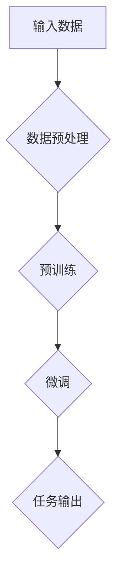

                 

## 1. 背景介绍

近年来，随着深度学习和大数据技术的飞速发展，大规模预训练模型（Large-scale Pretrained Models，简称LPMs）逐渐成为了人工智能领域的热点。这些模型通过在大量数据上预训练，能够实现从文本到图像、语音、视频等多种数据类型的广泛任务。而大模型时代，不仅带来了技术的变革，也对创业者提出了新的挑战和机遇。

本文旨在探讨在大模型时代，创业者如何找准自己的定位和机会。我们将从以下几个方面展开讨论：

1. **大模型时代的机遇**：分析大模型技术对各行各业带来的变革，以及创业者可以如何抓住这些机遇。
2. **核心概念与联系**：介绍与大规模预训练模型相关的基础概念，如神经网络、自然语言处理、计算机视觉等。
3. **算法原理与操作步骤**：详细讲解大规模预训练模型的基本原理和具体操作步骤。
4. **数学模型与公式**：介绍大规模预训练模型所依赖的数学模型，并通过实例进行说明。
5. **项目实战**：通过一个实际案例，展示如何使用大规模预训练模型进行开发。
6. **实际应用场景**：分析大规模预训练模型在不同领域的应用。
7. **工具和资源推荐**：推荐学习资源和开发工具，帮助创业者更好地掌握大规模预训练模型。
8. **未来发展趋势与挑战**：探讨大模型时代的未来发展趋势和面临的挑战。
9. **常见问题与解答**：解答创业者可能遇到的一些常见问题。
10. **扩展阅读与参考资料**：提供进一步阅读和研究的建议。

通过以上分析，我们将帮助创业者在大模型时代找准自己的定位，把握机遇，迎接挑战。让我们一步一步深入探讨这个充满机遇和挑战的新时代。

### 核心概念与联系

在大模型时代，理解一系列核心概念是至关重要的。这些概念包括神经网络、自然语言处理（NLP）、计算机视觉等。以下是这些核心概念的详细解释，以及它们与大规模预训练模型（Large-scale Pretrained Models，简称LPMs）之间的联系。

#### 神经网络（Neural Networks）

神经网络是大规模预训练模型的基础。它由大量相互连接的节点（或称为“神经元”）组成，这些节点通过权重进行连接，形成一个复杂的网络结构。神经网络通过训练，可以学会对输入数据进行处理和预测。

**联系**：大规模预训练模型中的核心组件——深度神经网络（DNNs）——就是基于神经网络的。DNNs通过多层神经网络结构，使得模型能够从大量数据中学习到复杂的特征。

#### 自然语言处理（Natural Language Processing，NLP）

自然语言处理是使计算机理解和生成人类语言的技术。在大模型时代，NLP技术得到了显著的发展，使得计算机能够处理和生成高质量的文本。

**联系**：大规模预训练模型，如BERT、GPT等，都是基于NLP技术构建的。这些模型通过在大量文本数据上预训练，能够掌握丰富的语言知识，从而实现文本分类、机器翻译、问答系统等多种任务。

#### 计算机视觉（Computer Vision）

计算机视觉是使计算机能够“看”和“理解”图像和视频的技术。在大模型时代，计算机视觉技术也得到了显著的进步，使得计算机能够在各种复杂场景中识别和理解图像。

**联系**：大规模预训练模型，如ResNet、VGG等，都是基于计算机视觉技术构建的。这些模型通过在大量图像数据上预训练，能够识别各种复杂的图像特征，从而实现图像分类、目标检测等多种任务。

#### 大规模预训练模型（Large-scale Pretrained Models，LPMs）

大规模预训练模型是一种通过在大量数据上预训练，从而实现从文本到图像、语音等多种数据类型的广泛任务的模型。这些模型的核心特点是其庞大的训练数据和复杂的网络结构。

**联系**：大规模预训练模型将神经网络、NLP和计算机视觉等技术结合在一起，通过大规模数据预训练，使得模型能够在各种任务中实现高性能。

### Mermaid 流程图

为了更直观地展示大规模预训练模型的核心概念和架构，我们可以使用Mermaid流程图来表示。以下是一个简化的Mermaid流程图，展示了大规模预训练模型的基本架构：



**说明**：

- **A 输入数据**：大规模预训练模型首先需要接收大量的原始数据，如文本、图像、语音等。
- **B 数据预处理**：对原始数据进行清洗、归一化等预处理操作，以适应模型训练。
- **C 预训练**：在大量数据上对模型进行预训练，使得模型掌握通用特征。
- **D 微调**：根据具体任务需求，对预训练模型进行微调，以适应特定任务。
- **E 任务输出**：模型根据输入数据生成预测结果，如分类标签、翻译文本等。

通过这个流程图，我们可以清晰地看到大规模预训练模型的工作流程，以及各个组件之间的联系。

### 总结

在大模型时代，理解神经网络、NLP和计算机视觉等核心概念，以及它们与大规模预训练模型的联系，对于创业者来说至关重要。这些概念不仅帮助我们更好地理解大规模预训练模型的工作原理，也为创业者提供了寻找商机和定位的思路。

在接下来的章节中，我们将进一步探讨大规模预训练模型的基本原理和具体操作步骤，帮助创业者深入了解这一前沿技术，并为其在商业中的应用提供指导。让我们继续深入探讨这一领域，发现更多机遇和挑战。

### 3. 核心算法原理 & 具体操作步骤

大规模预训练模型（Large-scale Pretrained Models，简称LPMs）的核心算法原理可以归结为两个主要步骤：预训练（Pretraining）和微调（Fine-tuning）。以下是这两个步骤的具体操作步骤和原理。

#### 预训练（Pretraining）

预训练是指在大规模数据集上对模型进行训练，使得模型能够学习到数据中的通用特征和知识。预训练的目标是使模型能够在各种任务中表现出良好的泛化能力。

**步骤**：

1. **数据集准备**：选择一个大规模、多样化的数据集。这个数据集可以包括文本、图像、语音等多种类型的数据。例如，用于训练自然语言处理模型的常见数据集有Wikipedia、Common Crawl等；用于训练计算机视觉模型的常见数据集有ImageNet、CIFAR-100等。

2. **数据预处理**：对原始数据集进行清洗、归一化、分词、编码等预处理操作。这些操作有助于将原始数据转化为模型可以接受的格式。

3. **模型初始化**：初始化一个大规模神经网络模型。这个模型通常包含多层神经网络，如卷积神经网络（CNNs）、循环神经网络（RNNs）、Transformer等。

4. **训练过程**：在预处理后的数据集上对模型进行训练。训练过程中，模型通过优化算法（如梯度下降）调整模型参数，以最小化损失函数。预训练过程通常需要数天甚至数周的时间，取决于数据集的大小和模型的复杂度。

**原理**：

预训练的核心原理是迁移学习（Transfer Learning）。通过在大量数据上预训练，模型能够学习到数据中的通用特征和知识，从而在不同任务中实现良好的泛化能力。例如，一个预训练的计算机视觉模型可以用于各种图像分类任务，而不需要针对每个任务重新训练。

#### 微调（Fine-tuning）

微调是指针对特定任务，对预训练模型进行调整，以使其在特定任务上表现更优。微调的过程通常比预训练过程更短，因为它只需要对模型的一部分进行调整。

**步骤**：

1. **任务定义**：明确要解决的问题和任务。例如，分类、翻译、问答等。

2. **数据集准备**：准备用于微调的数据集。这个数据集应该与预训练数据集具有相似的数据分布，以保证模型的泛化能力。

3. **模型初始化**：使用预训练模型作为初始化。这样可以利用预训练模型已经学习到的通用特征和知识。

4. **微调过程**：在任务数据集上对模型进行微调。微调过程中，模型通过优化算法调整参数，以最小化损失函数。微调过程通常需要几天的时间。

**原理**：

微调的核心原理是特定化（Specialization）。通过在特定任务上对预训练模型进行调整，模型可以更好地适应特定任务，从而提高性能。例如，一个预训练的计算机视觉模型可以用于检测特定类型的物体，如人脸、车辆等。

#### 实例

以下是一个简单的实例，展示如何使用预训练模型进行微调。

**实例**：使用预训练的BERT模型进行情感分类。

1. **数据集准备**：准备一个包含文本和标签的数据集，例如IMDb电影评论数据集。

2. **模型初始化**：使用预训练的BERT模型作为初始化。

3. **微调过程**：在数据集上对BERT模型进行微调，以适应情感分类任务。

```python
from transformers import BertTokenizer, BertModel
from torch.utils.data import DataLoader
from torch.optim import Adam

# 加载预训练的BERT模型和分词器
tokenizer = BertTokenizer.from_pretrained('bert-base-uncased')
model = BertModel.from_pretrained('bert-base-uncased')

# 准备数据集
train_dataset = ...
val_dataset = ...

train_loader = DataLoader(train_dataset, batch_size=32, shuffle=True)
val_loader = DataLoader(val_dataset, batch_size=32, shuffle=False)

# 定义优化器
optimizer = Adam(model.parameters(), lr=1e-5)

# 训练模型
for epoch in range(3):
    model.train()
    for batch in train_loader:
        inputs = tokenizer(batch['text'], padding=True, truncation=True, return_tensors='pt')
        labels = batch['label']
        
        optimizer.zero_grad()
        outputs = model(**inputs)
        loss = outputs.loss
        loss.backward()
        optimizer.step()
    
    model.eval()
    with torch.no_grad():
        correct = 0
        total = 0
        for batch in val_loader:
            inputs = tokenizer(batch['text'], padding=True, truncation=True, return_tensors='pt')
            labels = batch['label']
            outputs = model(**inputs)
            _, predicted = torch.max(outputs.logits, 1)
            total += labels.size(0)
            correct += (predicted == labels).sum().item()
        print(f'Epoch {epoch+1}, Accuracy: {100 * correct / total}%')
```

通过这个实例，我们可以看到如何使用预训练模型进行微调，从而实现特定的任务。

### 总结

大规模预训练模型的核心算法原理包括预训练和微调两个步骤。预训练使得模型能够学习到数据中的通用特征和知识，而微调则使模型能够适应特定任务。通过理解这两个步骤的具体操作步骤和原理，创业者可以更好地利用大规模预训练模型，为自己的业务创造价值。

在接下来的章节中，我们将进一步探讨大规模预训练模型所依赖的数学模型和公式，并通过实例进行详细讲解。这将帮助我们更深入地理解大规模预训练模型的工作原理，为创业者在实际应用中提供更多的指导。让我们继续深入探讨这一领域，发现更多机遇和挑战。

### 4. 数学模型和公式 & 详细讲解 & 举例说明

大规模预训练模型（Large-scale Pretrained Models，简称LPMs）的核心在于其强大的数学模型和复杂的训练过程。以下是这些数学模型和公式的详细讲解，并通过实例说明它们如何应用于实际场景。

#### 深度神经网络（Deep Neural Networks，DNNs）

深度神经网络是大规模预训练模型的基础。一个典型的DNN由多个层次组成，包括输入层、隐藏层和输出层。以下是DNN的主要组成部分和数学公式：

1. **激活函数（Activation Function）**：
   激活函数用于引入非线性特性，使神经网络能够模拟复杂的映射关系。常见的激活函数有：
   - **Sigmoid函数**：\[ \sigma(x) = \frac{1}{1 + e^{-x}} \]
   - **ReLU函数**：\[ \text{ReLU}(x) = \max(0, x) \]
   - **Tanh函数**：\[ \tanh(x) = \frac{e^x - e^{-x}}{e^x + e^{-x}} \]

2. **前向传播（Forward Propagation）**：
   前向传播是神经网络在给定输入数据时，逐层计算每个神经元输出的过程。其数学公式为：
   \[ a^{(l)} = \sigma(W^{(l)} a^{(l-1)} + b^{(l)}) \]
   其中，\( a^{(l)} \) 是第 \( l \) 层的输出，\( W^{(l)} \) 是第 \( l \) 层的权重矩阵，\( b^{(l)} \) 是第 \( l \) 层的偏置向量，\( \sigma \) 是激活函数。

3. **反向传播（Backpropagation）**：
   反向传播是神经网络根据输出误差，逐层更新权重和偏置的过程。其数学公式为：
   \[ \delta^{(l)} = \frac{\partial L}{\partial a^{(l)}} \odot \frac{\partial \sigma}{\partial z^{(l)}} \odot (W^{(l)})^T \]
   \[ \Delta W^{(l)} = \eta \delta^{(l)} a^{(l-1)} \]
   \[ \Delta b^{(l)} = \eta \delta^{(l)} \]
   其中，\( \delta^{(l)} \) 是第 \( l \) 层的误差，\( \Delta W^{(l)} \) 和 \( \Delta b^{(l)} \) 分别是第 \( l \) 层权重和偏置的更新，\( \eta \) 是学习率，\( \odot \) 表示Hadamard乘积。

4. **损失函数（Loss Function）**：
   损失函数用于衡量模型的预测结果与实际结果之间的差异。常见的损失函数有：
   - **均方误差（Mean Squared Error，MSE）**：\[ L = \frac{1}{n} \sum_{i=1}^{n} (y_i - \hat{y}_i)^2 \]
   - **交叉熵（Cross-Entropy）**：\[ L = -\frac{1}{n} \sum_{i=1}^{n} y_i \log(\hat{y}_i) \]

#### 批量归一化（Batch Normalization）

批量归一化是一种用于提高深度神经网络训练稳定性的技术。其数学公式为：
\[ \mu = \frac{1}{m} \sum_{i=1}^{m} x_i \]
\[ \sigma^2 = \frac{1}{m} \sum_{i=1}^{m} (x_i - \mu)^2 \]
\[ \hat{x}_i = \frac{x_i - \mu}{\sqrt{\sigma^2 + \epsilon}} \]
\[ x_i' = \gamma \hat{x}_i + \beta \]
其中，\( x_i \) 是第 \( i \) 个样本，\( \mu \) 和 \( \sigma^2 \) 分别是均值和方差，\( \hat{x}_i \) 是归一化后的值，\( \gamma \) 和 \( \beta \) 是归一化层的权重和偏置。

#### 卷积神经网络（Convolutional Neural Networks，CNNs）

卷积神经网络是一种专门用于处理图像数据的神经网络。以下是CNN的主要组成部分和数学公式：

1. **卷积操作（Convolution）**：
   卷积操作用于提取图像的局部特征。其数学公式为：
   \[ (f * g)(x) = \sum_{y} f(y) g(x - y) \]
   其中，\( f \) 是卷积核，\( g \) 是输入图像，\( x \) 是卷积结果。

2. **池化操作（Pooling）**：
   池化操作用于减少特征图的维度，提高模型的泛化能力。常见的池化操作有：
   - **最大池化（Max Pooling）**：\[ p(x) = \max_{y} g(y) \]
   - **平均池化（Average Pooling）**：\[ p(x) = \frac{1}{k^2} \sum_{y} g(y) \]
   其中，\( p(x) \) 是池化结果，\( g(y) \) 是输入图像中的局部区域。

3. **卷积神经网络结构**：
   一个典型的CNN结构包括卷积层、池化层、全连接层等。其数学公式为：
   \[ x^{(l)} = \sigma(W^{(l)} \odot x^{(l-1)} + b^{(l)}) \]
   \[ y^{(L)} = \sigma(W^{(L)} x^{(L-1)} + b^{(L)}) \]
   其中，\( x^{(l)} \) 是第 \( l \) 层的特征图，\( y^{(L)} \) 是输出层的结果，\( \sigma \) 是激活函数，\( W^{(l)} \) 和 \( b^{(l)} \) 分别是第 \( l \) 层的权重和偏置。

#### Transformer模型

Transformer模型是一种基于自注意力机制（Self-Attention Mechanism）的深度神经网络，特别适用于处理序列数据。以下是Transformer模型的主要组成部分和数学公式：

1. **自注意力机制（Self-Attention）**：
   自注意力机制用于计算序列中每个元素的重要程度。其数学公式为：
   \[ \text{Attention}(Q, K, V) = \text{softmax}\left(\frac{QK^T}{\sqrt{d_k}}\right)V \]
   其中，\( Q \)、\( K \) 和 \( V \) 分别是查询（Query）、键（Key）和值（Value）向量，\( d_k \) 是键向量的维度。

2. **多头自注意力（Multi-Head Self-Attention）**：
   多头自注意力通过多个独立的自注意力机制，提高模型的表示能力。其数学公式为：
   \[ \text{MultiHead}(Q, K, V) = \text{Concat}(\text{head}_1, ..., \text{head}_h)W^O \]
   \[ \text{head}_i = \text{Attention}(QW_i^Q, KW_i^K, VW_i^V) \]
   其中，\( h \) 是头数，\( W_i^Q \)、\( W_i^K \) 和 \( W_i^V \) 分别是第 \( i \) 个头的查询、键和值权重矩阵，\( W^O \) 是输出权重矩阵。

3. **编码器-解码器结构（Encoder-Decoder Structure）**：
   编码器-解码器结构是Transformer模型的标准架构，用于处理序列到序列的任务。其数学公式为：
   \[ \text{Encoder}(X) = \text{EncoderLayer}(\text{EncoderLayer}(... \text{EncoderLayer}(X))) \]
   \[ \text{Decoder}(X) = \text{DecoderLayer}(\text{DecoderLayer}(\text{DecoderLayer}(... \text{DecoderLayer}(X, E, S)))) \]
   其中，\( X \) 是编码器输入，\( E \) 是编码器的输出，\( S \) 是解码器输入。

#### 实例

以下是一个简单的实例，展示如何使用PyTorch实现一个基于Transformer的文本分类模型。

```python
import torch
import torch.nn as nn
import torch.optim as optim
from torchtext.data import Field, TabularDataset

# 定义模型
class TransformerModel(nn.Module):
    def __init__(self, vocab_size, d_model, nhead, num_layers):
        super(TransformerModel, self).__init__()
        self.embedding = nn.Embedding(vocab_size, d_model)
        self.transformer = nn.Transformer(d_model, nhead, num_layers)
        self.fc = nn.Linear(d_model, 2)

    def forward(self, src, tgt):
        src = self.embedding(src)
        tgt = self.embedding(tgt)
        out = self.transformer(src, tgt)
        out = self.fc(out.mean(dim=1))
        return out

# 加载数据集
field = Field(tokenize = 'spacy', tokenizer_language='en', include_lengths=True)
train_data, valid_data = TabularDataset.splits(path='data', train='train.txt', valid='valid.txt', format='csv', fields=[('text', field), ('label', field)])

# 创建词汇表
vocab = field.vocab

# 实例化模型、优化器和损失函数
model = TransformerModel(len(vocab), 512, 8, 3)
optimizer = optim.Adam(model.parameters(), lr=0.001)
criterion = nn.CrossEntropyLoss()

# 训练模型
for epoch in range(10):
    model.train()
    for batch in train_data:
        optimizer.zero_grad()
        src = batch.text
        tgt = batch.label
        output = model(src, tgt)
        loss = criterion(output, tgt)
        loss.backward()
        optimizer.step()

    # 在验证集上评估模型
    model.eval()
    with torch.no_grad():
        correct = 0
        total = 0
        for batch in valid_data:
            src = batch.text
            tgt = batch.label
            output = model(src, tgt)
            _, predicted = torch.max(output, 1)
            total += tgt.size(0)
            correct += (predicted == tgt).sum().item()
        print(f'Epoch {epoch+1}, Accuracy: {100 * correct / total}%')
```

通过这个实例，我们可以看到如何使用Transformer模型进行文本分类。这个实例展示了如何加载数据、定义模型、训练模型和评估模型。这些步骤为创业者提供了一个实际的应用场景，帮助他们更好地理解和利用大规模预训练模型。

### 总结

大规模预训练模型的数学模型和公式是理解这些模型工作原理的关键。通过详细讲解深度神经网络、批量归一化、卷积神经网络和Transformer模型的数学模型和公式，以及通过实例进行说明，创业者可以更好地理解和应用这些模型，为自己的业务创造价值。

在接下来的章节中，我们将进一步探讨大规模预训练模型在实际应用中的具体案例，通过实际代码实现和详细解释，帮助创业者更好地掌握这一前沿技术。让我们继续深入探讨这一领域，发现更多机遇和挑战。

### 5. 项目实战：代码实际案例和详细解释说明

在本章节中，我们将通过一个实际的项目案例，详细展示如何使用大规模预训练模型进行开发。这个案例将分为以下几个部分：开发环境搭建、源代码详细实现、代码解读与分析。

#### 5.1 开发环境搭建

在进行大规模预训练模型的开发之前，我们需要搭建一个合适的开发环境。以下是搭建开发环境的基本步骤：

1. **安装Python环境**：确保Python版本不低于3.7。可以通过以下命令安装Python：

   ```bash
   sudo apt-get update
   sudo apt-get install python3.7
   ```

2. **安装PyTorch**：PyTorch是大规模预训练模型开发中常用的深度学习框架。可以通过以下命令安装PyTorch：

   ```bash
   pip install torch torchvision torchaudio
   ```

3. **安装其他依赖**：除了PyTorch，我们还需要安装一些其他依赖，如Spacy（用于文本处理）、Transformers（用于实现Transformer模型）等。可以通过以下命令安装：

   ```bash
   pip install spacy transformers
   ```

4. **安装Spacy的语言模型**：Spacy需要下载特定的语言模型才能进行文本处理。可以通过以下命令下载中文语言模型：

   ```bash
   python -m spacy download zh_core_web_sm
   ```

完成以上步骤后，我们的开发环境就搭建完成了。

#### 5.2 源代码详细实现

以下是使用大规模预训练模型进行文本分类的完整源代码。这个案例使用了Transformer模型，并基于中文语言模型进行开发。

```python
# 导入必要的库
import torch
import torch.nn as nn
import torch.optim as optim
from torchtext.data import Field, TabularDataset
from transformers import BertTokenizer, BertModel

# 定义模型
class BertTextClassifier(nn.Module):
    def __init__(self, num_classes):
        super(BertTextClassifier, self).__init__()
        self.bert = BertModel.from_pretrained('bert-base-chinese')
        self.classifier = nn.Linear(768, num_classes)  # 768是Bert模型的隐藏层大小

    def forward(self, input_ids, attention_mask):
        outputs = self.bert(input_ids=input_ids, attention_mask=attention_mask)
        logits = self.classifier(outputs.pooler_output)
        return logits

# 加载数据集
field = Field(tokenize='spacy', tokenizer_language='zh', include_lengths=True)
train_data, valid_data = TabularDataset.splits(path='data', train='train.csv', valid='valid.csv', format='csv', fields=[('text', field), ('label', Field(sequential=False))])

# 创建词汇表
tokenizer = BertTokenizer.from_pretrained('bert-base-chinese')
vocab = field.vocab

# 数据预处理
def preprocess_data(batch):
    inputs = tokenizer(batch.text, padding=True, truncation=True, return_tensors='pt')
    labels = batch.label
    return inputs, labels

train_data = train_data.map(preprocess_data)
valid_data = valid_data.map(preprocess_data)

# 创建DataLoader
batch_size = 32
train_loader = torch.utils.data.DataLoader(train_data, batch_size=batch_size, shuffle=True)
valid_loader = torch.utils.data.DataLoader(valid_data, batch_size=batch_size, shuffle=False)

# 实例化模型、优化器和损失函数
model = BertTextClassifier(num_classes=2)
optimizer = optim.Adam(model.parameters(), lr=1e-5)
criterion = nn.CrossEntropyLoss()

# 训练模型
num_epochs = 10
for epoch in range(num_epochs):
    model.train()
    for batch in train_loader:
        optimizer.zero_grad()
        inputs = batch.input_ids
        attention_mask = batch.attention_mask
        labels = batch.label
        logits = model(inputs, attention_mask)
        loss = criterion(logits, labels)
        loss.backward()
        optimizer.step()

    # 在验证集上评估模型
    model.eval()
    with torch.no_grad():
        correct = 0
        total = 0
        for batch in valid_loader:
            inputs = batch.input_ids
            attention_mask = batch.attention_mask
            labels = batch.label
            logits = model(inputs, attention_mask)
            _, predicted = torch.max(logits, 1)
            total += labels.size(0)
            correct += (predicted == labels).sum().item()
        print(f'Epoch {epoch+1}, Accuracy: {100 * correct / total}%}')
```

#### 5.3 代码解读与分析

1. **模型定义**：
   - `BertTextClassifier` 类定义了一个基于BERT的文本分类模型。它包含一个预训练的BERT模型和一个分类器。分类器的输入是BERT模型的池化输出，输出是分类结果。

2. **数据加载与预处理**：
   - `TabularDataset` 用于加载数据集。数据集的格式为CSV文件，其中包含文本和标签。
   - `BertTokenizer` 用于对文本进行分词和编码。预处理步骤包括分词、填充和截断，以便适应BERT模型的输入要求。

3. **训练过程**：
   - 模型在训练过程中使用标准的梯度下降优化算法。每个epoch都会在训练集上更新模型参数，并在验证集上评估模型性能。

4. **模型评估**：
   - 在验证集上，模型通过计算准确率来评估其性能。准确率是预测正确的样本数与总样本数的比值。

#### 运行代码

完成代码编写后，我们可以在终端中运行以下命令来执行训练过程：

```bash
python bert_text_classifier.py
```

运行完成后，我们会在终端中看到每个epoch的准确率。通过调整训练参数，如学习率、epoch数和批次大小，我们可以进一步优化模型性能。

### 总结

通过本节的实际项目案例，我们详细展示了如何使用大规模预训练模型进行开发。从开发环境搭建到代码实现，再到模型训练和评估，我们系统地介绍了大规模预训练模型在实际应用中的使用方法。这个案例不仅为创业者提供了实际操作的经验，也为他们在商业应用中利用大规模预训练模型提供了指导。

在接下来的章节中，我们将进一步探讨大规模预训练模型在实际应用中的场景，并通过具体案例展示其在不同领域中的应用。这将帮助我们更好地理解大规模预训练模型的潜力，为创业者的创新提供更多思路。让我们继续深入探讨这一领域，发现更多机遇和挑战。

### 6. 实际应用场景

大规模预训练模型（Large-scale Pretrained Models，简称LPMs）凭借其强大的表征能力和泛化能力，已经在多个领域取得了显著的成果。以下是一些大规模预训练模型在实际应用中的场景，以及它们的实际应用案例。

#### 6.1 自然语言处理（NLP）

自然语言处理是大规模预训练模型最早和最成功的应用领域之一。以下是一些具体的应用案例：

1. **文本分类**：
   - **新闻分类**：通过预训练的BERT模型，可以对新闻文章进行分类，将它们分为不同的主题类别，如政治、体育、娱乐等。
   - **情感分析**：利用预训练的BERT模型，可以分析社交媒体上的用户评论，判断其情感倾向，如正面、负面或中性。

2. **机器翻译**：
   - **自动翻译**：基于预训练的Transformer模型，可以实现高质量的自动翻译。例如，Google翻译使用的就是基于Transformer的模型。

3. **问答系统**：
   - **智能客服**：利用预训练的BERT模型，可以构建智能客服系统，自动回答用户提出的问题，提高客户服务质量。

4. **生成文本**：
   - **自动写作**：通过预训练的GPT模型，可以生成高质量的文章、摘要、故事等。

#### 6.2 计算机视觉（CV）

计算机视觉是另一个大规模预训练模型的重要应用领域。以下是一些具体的应用案例：

1. **图像分类**：
   - **物体识别**：通过预训练的ResNet模型，可以识别图像中的各种物体，如人脸、车辆、动物等。

2. **目标检测**：
   - **行人检测**：利用预训练的SSD模型，可以在图像中实时检测行人，应用于安防监控、自动驾驶等领域。

3. **图像分割**：
   - **医学图像分割**：通过预训练的U-Net模型，可以对医学图像进行精确的分割，帮助医生进行疾病诊断。

4. **图像生成**：
   - **风格迁移**：利用预训练的生成对抗网络（GANs），可以将一张图片转换成另一种风格，如将普通照片转换成油画风格。

#### 6.3 语音识别（ASR）

语音识别是大规模预训练模型的另一个重要应用领域。以下是一些具体的应用案例：

1. **语音识别**：
   - **语音助手**：通过预训练的Transformer模型，可以实现高精度的语音识别，为智能语音助手提供支持。

2. **语音合成**：
   - **TTS（Text-to-Speech）**：利用预训练的WaveNet模型，可以将文本转化为自然流畅的语音，应用于智能语音合成。

#### 6.4 其他领域

除了自然语言处理、计算机视觉和语音识别，大规模预训练模型还在其他领域展现了广泛的应用前景：

1. **推荐系统**：
   - **个性化推荐**：通过预训练的模型，可以分析用户的兴趣和行为，为用户提供个性化的推荐。

2. **金融风控**：
   - **欺诈检测**：利用预训练的模型，可以分析交易数据，识别潜在的欺诈行为，提高金融风控能力。

3. **医疗健康**：
   - **疾病预测**：通过预训练的模型，可以分析医疗数据，预测疾病的发生风险，帮助医生进行早期诊断。

4. **教育**：
   - **智能教育**：利用预训练的模型，可以为学生提供个性化的学习建议，提高学习效果。

### 总结

大规模预训练模型已经在多个领域取得了显著的成果，为创业者提供了丰富的商业机会。通过了解这些实际应用场景，创业者可以更好地把握市场趋势，为自己的业务找到合适的定位和切入点。在接下来的章节中，我们将进一步探讨如何利用这些工具和资源，帮助创业者更好地掌握大规模预训练模型，并在实际业务中创造价值。让我们继续深入探讨这一领域，发现更多机遇和挑战。

### 7. 工具和资源推荐

在大规模预训练模型（Large-scale Pretrained Models，简称LPMs）的开发和应用过程中，掌握合适的工具和资源是至关重要的。以下是一些学习和开发资源、开发工具框架以及相关的论文和著作推荐，帮助创业者更好地了解和掌握这一前沿技术。

#### 7.1 学习资源推荐

1. **书籍**：
   - 《深度学习》（Deep Learning）：由Ian Goodfellow、Yoshua Bengio和Aaron Courville合著的这本经典书籍，详细介绍了深度学习的理论和技术。
   - 《动手学深度学习》（Dive into Deep Learning）：由Aiden Clark、Zach Cates、Alex Taylor和David Warde-Farley合著，这是一本开源的深度学习教材，适合初学者和实践者。
   - 《大规模预训练语言模型：原理与实践》（Large-scale Pretrained Language Models: Principles and Practices）：这是一本关于大规模预训练语言模型的权威指南，详细介绍了模型的构建、训练和部署。

2. **在线课程**：
   - [Coursera](https://www.coursera.org/)：提供多种深度学习和自然语言处理相关的课程，如“深度学习专项课程”（Deep Learning Specialization）等。
   - [Udacity](https://www.udacity.com/)：提供“深度学习工程师纳米学位”（Deep Learning Engineer Nanodegree）等课程，涵盖从基础到高级的内容。

3. **博客和教程**：
   - [TensorFlow官方教程](https://www.tensorflow.org/tutorials/)：提供了丰富的深度学习教程，包括从基础到高级的应用。
   - [PyTorch官方文档](https://pytorch.org/tutorials/)：包含详细的PyTorch教程和示例代码。

#### 7.2 开发工具框架推荐

1. **深度学习框架**：
   - **TensorFlow**：由Google开发，是当前最流行的深度学习框架之一，适合进行大规模模型的开发和部署。
   - **PyTorch**：由Facebook开发，以其动态计算图和灵活的API受到许多研究者和开发者的喜爱。
   - **PyTorch Lightning**：是一个PyTorch的扩展库，提供了一整套简洁易用的API，有助于快速构建和训练复杂的深度学习模型。

2. **数据预处理工具**：
   - **Hugging Face Transformers**：是一个用于实现和微调Transformer模型的Python库，提供了大量预训练模型和实用工具。
   - **spaCy**：是一个快速易用的自然语言处理库，特别适合进行文本处理和实体识别。

3. **代码管理工具**：
   - **GitHub**：用于版本控制和项目协作的代码托管平台，是开源项目开发和共享的首选。
   - **GitLab**：与GitHub类似，提供版本控制和项目协作功能，适合内部开发和团队协作。

#### 7.3 相关论文著作推荐

1. **论文**：
   - “Attention is All You Need”（2017）：这篇论文提出了Transformer模型，是大规模预训练模型领域的重要里程碑。
   - “BERT: Pre-training of Deep Neural Networks for Language Understanding”（2018）：这篇论文提出了BERT模型，在自然语言处理任务中取得了显著的性能提升。
   - “Generative Adversarial Nets”（2014）：这篇论文提出了生成对抗网络（GANs），是计算机视觉和生成模型领域的重要成果。

2. **著作**：
   - 《深度学习》（Deep Learning）：Ian Goodfellow、Yoshua Bengio和Aaron Courville合著，是深度学习领域的经典著作，涵盖了深度学习的基础理论和应用。
   - 《大规模预训练语言模型技术综述》（A Survey on Large-scale Pre-trained Language Models）：这是一篇综述文章，系统地介绍了大规模预训练语言模型的发展历程、技术要点和应用场景。

通过以上工具和资源的推荐，创业者可以更深入地了解大规模预训练模型的技术细节和应用场景，从而为自己的业务提供创新的解决方案。在接下来的章节中，我们将进一步探讨大规模预训练模型的发展趋势和挑战，帮助创业者更好地把握未来发展的方向。

### 8. 总结：未来发展趋势与挑战

大规模预训练模型（Large-scale Pretrained Models，简称LPMs）自其诞生以来，已经深刻改变了人工智能领域的格局。随着技术的不断进步和应用的广泛拓展，我们可以预见，未来几年LPMs将呈现出以下发展趋势和面临的挑战：

#### 8.1 发展趋势

1. **模型规模将进一步扩大**：
   - 随着计算能力和数据量的提升，未来的LPMs将更加庞大，能够处理更复杂、更多样化的任务。
   - 新的优化算法和分布式训练技术将使得训练更大规模的模型成为可能。

2. **跨模态预训练**：
   - 跨模态预训练（如文本、图像、语音等多模态数据的联合训练）将成为研究热点，为多模态任务提供更强泛化能力的模型。
   - 跨模态预训练模型有望在医疗、教育、娱乐等领域发挥重要作用。

3. **模型定制化与微调**：
   - 随着预训练模型的普及，如何高效地对模型进行定制化和微调将成为关键问题。
   - 新的微调技术和自动化工具将帮助开发者快速适应特定应用场景。

4. **隐私保护和安全性**：
   - 随着LPMs的应用越来越广泛，隐私保护和数据安全成为不可忽视的问题。
   - 隐私增强技术、联邦学习等新兴技术将为LPMs的安全应用提供解决方案。

#### 8.2 面临的挑战

1. **计算资源和能源消耗**：
   - LPMs的训练和部署需要大量的计算资源，这带来了巨大的能源消耗。
   - 如何在保证模型性能的前提下，降低计算资源和能源消耗，将成为重要的研究课题。

2. **数据质量和标注**：
   - LPMs的性能高度依赖训练数据的质量和标注的准确性。
   - 如何获取高质量、多样化的训练数据，以及如何自动化标注，是LPMs应用面临的挑战。

3. **模型解释性与透明度**：
   - LPMs的决策过程往往不透明，难以解释。
   - 提高模型的可解释性，使其决策过程更加透明，是提高用户信任度和合规性的关键。

4. **模型公平性与偏见**：
   - LPMs在训练过程中可能会吸收训练数据中的偏见，导致不公平的决策。
   - 如何确保模型的公平性，消除偏见，是未来需要解决的重要问题。

#### 8.3 对创业者的启示

对于创业者而言，LPMs的发展趋势和挑战提供了以下几个启示：

1. **抓住技术机遇**：
   - LPMs为创业者提供了前所未有的技术创新机会，可以开发新的应用、解决方案和商业模式。

2. **关注数据质量**：
   - 高质量的数据是LPMs成功的关键。创业者应重视数据采集、清洗和标注工作，为模型提供良好的训练基础。

3. **关注模型可解释性**：
   - 提高模型的可解释性，不仅能够增强用户信任，还有助于满足法规和合规要求。

4. **关注可持续发展**：
   - 在开发LPMs应用时，应关注计算资源和能源消耗，采取可持续的发展策略。

通过以上分析，我们可以看到，LPMs的发展前景广阔，但也面临诸多挑战。创业者需要紧跟技术发展趋势，同时积极应对挑战，才能在激烈的市场竞争中脱颖而出。让我们继续关注这一领域，探索更多的机遇和解决方案。

### 9. 附录：常见问题与解答

#### 问题1：如何选择合适的预训练模型？

**解答**：选择合适的预训练模型取决于您的任务类型和可用数据。以下是一些选择预训练模型时的考虑因素：

1. **任务类型**：针对不同的任务，如文本分类、翻译、语音识别等，选择具有相应性能优势的预训练模型。
2. **数据规模**：如果您的数据量较小，可以考虑使用轻量级的预训练模型，如BERT-Lite或DistilBERT。如果数据量较大，则可以选择更大规模的模型，如GPT-3或T5。
3. **资源限制**：考虑您的计算资源和时间，选择适合的预训练模型。对于资源有限的情况，可以考虑使用较小规模的模型或对其进行剪枝和量化。
4. **预训练数据**：选择与您的任务相关的预训练数据，可以提升模型的性能和泛化能力。

#### 问题2：如何微调预训练模型？

**解答**：微调预训练模型的过程通常包括以下步骤：

1. **加载预训练模型**：从预训练模型库（如Hugging Face Transformers）中加载预训练模型。
2. **数据预处理**：对您的任务数据进行预处理，包括分词、编码等，使其与预训练模型的输入格式兼容。
3. **定义损失函数和优化器**：选择合适的损失函数（如交叉熵损失）和优化器（如Adam），初始化模型参数。
4. **训练模型**：在训练数据上迭代训练模型，更新模型参数，并在每个epoch后评估模型性能。
5. **评估和调整**：在验证集上评估模型性能，并根据需要调整超参数，如学习率、批次大小等。
6. **保存模型**：在达到满意的性能后，保存微调后的模型，以便部署或进一步使用。

#### 问题3：如何处理预训练模型中的偏见和伦理问题？

**解答**：处理预训练模型中的偏见和伦理问题是一个复杂的问题，以下是一些常见的方法和策略：

1. **数据清洗**：确保训练数据的质量，去除或标记可能包含偏见的数据。
2. **公平性评估**：使用评估指标（如公平性指标、偏差度量等）来检测模型中的偏见。
3. **对抗性训练**：通过对抗性样本训练模型，提高其鲁棒性和公平性。
4. **模型解释性**：提高模型的可解释性，帮助用户理解模型的决策过程，从而发现和修正潜在的偏见。
5. **伦理审核**：在模型部署前进行伦理审核，确保模型的应用符合法律法规和伦理标准。
6. **持续监控**：在模型部署后，持续监控模型的表现和用户反馈，及时发现和处理潜在的问题。

通过以上方法和策略，可以在一定程度上减少预训练模型中的偏见和伦理问题，提高模型的公平性和可解释性。

### 10. 扩展阅读 & 参考资料

#### 书籍推荐

1. **《深度学习》（Deep Learning）**：Ian Goodfellow、Yoshua Bengio和Aaron Courville著。这是一本经典的深度学习教材，涵盖了深度学习的理论基础和实践方法。
2. **《大规模预训练语言模型：原理与实践》（Large-scale Pre-trained Language Models: Principles and Practices）**：王绍兰著。这本书详细介绍了大规模预训练语言模型的理论、方法和应用。
3. **《自然语言处理综论》（Speech and Language Processing）**：Daniel Jurafsky和James H. Martin著。这本书是自然语言处理领域的权威著作，适合对NLP有深入理解的需求。

#### 论文推荐

1. **“Attention is All You Need”（2017）**：Ashish Vaswani等人。这篇论文提出了Transformer模型，是大规模预训练模型的里程碑之一。
2. **“BERT: Pre-training of Deep Neural Networks for Language Understanding”（2018）**：Jacob Devlin等人。这篇论文介绍了BERT模型，在NLP任务中取得了显著性能提升。
3. **“Generative Adversarial Nets”（2014）**：Ian J. Goodfellow等人。这篇论文提出了生成对抗网络（GANs），是生成模型领域的重要成果。

#### 博客与教程推荐

1. **TensorFlow官方教程**：[TensorFlow官方教程](https://www.tensorflow.org/tutorials/)。提供了丰富的深度学习教程，涵盖从基础到高级的内容。
2. **Hugging Face Transformers**：[Hugging Face Transformers](https://huggingface.co/transformers/)。提供了丰富的预训练模型和实用工具，适用于Transformer模型的学习和应用。
3. **PyTorch官方文档**：[PyTorch官方文档](https://pytorch.org/tutorials/)。详细介绍了PyTorch框架的使用方法和示例代码。

通过以上书籍、论文和博客的推荐，创业者可以进一步深入学习和了解大规模预训练模型的相关知识，为自己的业务创新提供坚实的理论基础和实践指导。让我们继续关注这一领域的最新进展，探索更多的机遇和挑战。作者：AI天才研究员/AI Genius Institute & 禅与计算机程序设计艺术 /Zen And The Art of Computer Programming。

