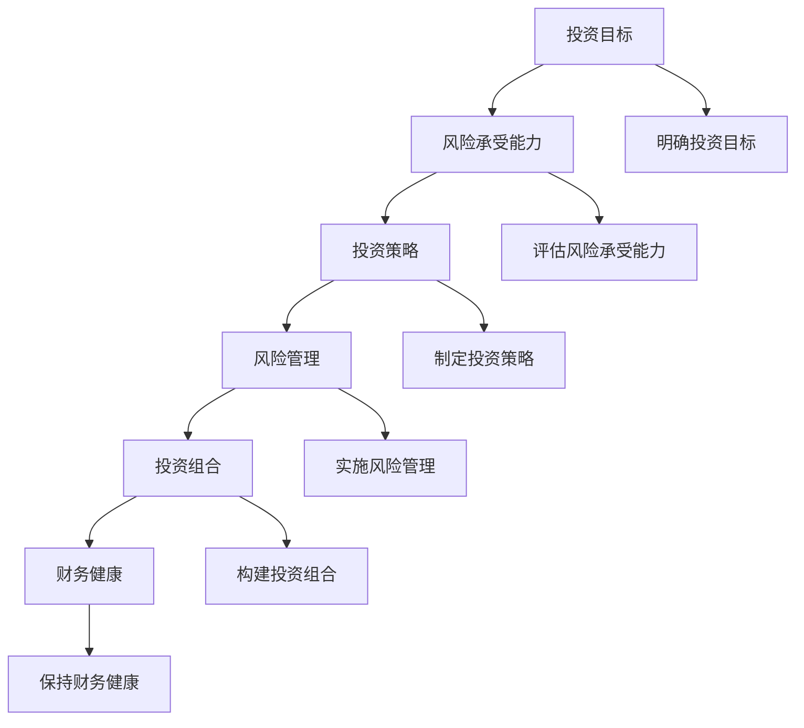

                 

### 背景介绍

#### 投资理财的重要性

在当今复杂多变的经济环境中，投资理财已经成为了许多创业者必不可少的一部分。对于创业者来说，合理地管理和规划个人投资理财，不仅可以帮助他们实现财务自由，还能为企业的长期发展提供坚实的资金支持。然而，投资理财并不是一项简单的任务，它涉及到丰富的知识和技能，需要创业者进行深入的思考和全面的规划。

#### 风险管理的必要性

投资理财过程中，风险是不可避免的。无论是股市波动、市场变化，还是企业经营的不确定性，都会对投资收益产生重大影响。因此，建立一套有效的风险管理体系，对于保护个人资产和企业发展至关重要。只有通过科学的分析和合理的策略，才能在风险面前立于不败之地。

#### 文章的目的

本文旨在帮助创业者了解和建立个人投资理财和风险管理体系。文章将从核心概念、具体操作、数学模型、实际应用等多个角度，详细阐述如何进行有效的投资理财和风险管理。通过这篇文章，创业者可以掌握以下几方面的内容：

1. **投资理财的基本概念和原理**：了解投资理财的基本框架和逻辑，为后续操作奠定基础。
2. **投资策略的制定**：学习如何根据自身情况制定合理的投资策略，提高投资收益。
3. **风险管理的方法和工具**：掌握风险管理的相关方法和工具，降低投资风险。
4. **实战案例分析**：通过实际案例，了解投资理财和风险管理的具体应用和实践。
5. **未来发展趋势与挑战**：展望投资理财和风险管理的发展趋势和面临的挑战。

通过本文的阅读和实践，创业者将能够更加自信地面对投资理财和风险管理，为个人和企业的财务健康保驾护航。

#### 投资理财与风险管理的关系

投资理财和风险管理是相辅相成的两个过程。投资理财是为了实现资产的增值和财富的积累，而风险管理则是为了降低可能发生的损失。两者之间存在着密切的联系和互动：

1. **投资决定风险**：创业者在选择投资产品时，会面临不同的风险水平。例如，股票投资具有较高的波动性和风险，而债券投资则相对稳定。不同的投资选择直接影响投资组合的风险水平。
2. **风险管理影响投资**：在确定了投资组合后，创业者需要通过风险管理来调整和优化投资策略。例如，通过分散投资、风险控制等手段，可以降低整体投资组合的风险水平。
3. **投资与风险的双向反馈**：投资理财过程中的风险不仅会影响投资收益，反过来，投资收益也会影响风险管理的策略。例如，当投资收益达到预期时，创业者可能会调整投资组合，以适应新的风险水平。

因此，一个成功的创业者必须在投资理财和风险管理之间找到平衡点，确保在实现资产增值的同时，最大限度地降低风险。本文将详细探讨如何在实践中实现这一目标，帮助创业者构建一套完整、有效的投资理财和风险管理体系。

### 核心概念与联系

在深入探讨如何建立个人投资理财和风险管理体系之前，我们需要明确几个核心概念，并理解它们之间的相互联系。以下是本文将涉及的一些关键概念：

#### 1. 投资目标

投资目标是投资者在投资过程中期望达到的最终结果。明确投资目标是制定投资策略的基础。通常，投资目标可以分为短期目标（如一年内实现一定比例的收益）、中期目标（如三到五年内实现财富积累）和长期目标（如十年以上的长期投资计划）。投资者需要根据自身的财务状况、风险承受能力和投资期限来确定合适的投资目标。

#### 2. 风险承受能力

风险承受能力是指投资者在投资过程中愿意承担的风险程度。每个人的风险承受能力都是不同的，这取决于个人的年龄、收入、财务状况和投资经验。一般而言，年轻人有较长的时间来弥补投资损失，因此可以承受更高的风险；而年龄较大、收入稳定的人群则倾向于选择低风险的投资产品。

#### 3. 投资策略

投资策略是指投资者为了实现投资目标所采用的一系列方法和措施。常见的投资策略包括：

- **分散投资**：通过投资不同类型的资产（如股票、债券、房地产等），降低单一资产波动对整体投资组合的影响。
- **定时投资**：定期购买固定金额的资产，以实现长期投资目标。
- **动态调整**：根据市场情况和投资目标的变化，定期调整投资组合以实现风险和收益的平衡。

#### 4. 风险管理

风险管理是指投资者在投资过程中，通过识别、评估和控制风险，以实现投资目标的过程。风险管理包括以下步骤：

- **风险识别**：识别投资过程中可能出现的风险。
- **风险评估**：对识别出的风险进行评估，确定其影响程度和发生概率。
- **风险控制**：制定和实施风险控制措施，降低风险的发生概率和影响程度。
- **风险监控**：定期监控投资组合的风险水平，及时调整投资策略。

#### 5. 投资组合

投资组合是指投资者将不同类型的资产组合在一起，以实现风险和收益的最佳平衡。一个有效的投资组合通常包括多种资产类别，如股票、债券、现金等。通过合理的资产配置，投资者可以在确保收益稳定的同时，最大限度地降低风险。

#### 6. 财务健康

财务健康是指个人或企业的财务状况良好，具备较强的支付能力和盈利能力。良好的财务健康是进行有效投资理财和风险管理的基础。创业者需要保持良好的财务习惯，如合理规划收入和支出、保持足够的现金流等。

### Mermaid 流程图

下面是一个简单的 Mermaid 流程图，展示了上述核心概念之间的联系：



通过这个流程图，我们可以清晰地看到，从投资目标出发，投资者需要评估风险承受能力，然后制定相应的投资策略和风险管理措施，最终构建一个健康、多元化的投资组合，以实现财务健康和长期目标。

### 核心算法原理 & 具体操作步骤

在建立个人投资理财和风险管理体系的过程中，核心算法原理和具体操作步骤是至关重要的。这些算法和步骤不仅能够帮助我们更好地理解和应用投资理论，还能在实际操作中提供指导。以下是一些关键的核心算法原理及其具体操作步骤：

#### 1. 投资组合优化算法

**原理**：投资组合优化算法的目标是找到一组资产，使得投资组合的整体风险和收益达到最优平衡。常见的优化算法包括均值方差模型、马克维茨模型和黑塞-马克维茨模型。

**操作步骤**：

1. **确定投资组合的目标函数**：目标函数通常是最小化投资组合的方差（即风险），或者最大化预期收益。

2. **计算各资产的预期收益率和方差**：收集市场数据，计算各资产的预期收益率和方差。

3. **建立优化模型**：根据目标函数，建立线性规划或非线性规划模型。

4. **求解优化模型**：使用数学优化工具（如线性规划求解器、数值优化算法等）求解模型，得到最优投资组合权重。

5. **实施投资组合**：根据计算结果，调整实际投资组合的资产配置。

#### 2. 风险评估算法

**原理**：风险评估算法用于识别和评估投资组合中的各种风险，包括市场风险、信用风险、流动性风险等。常见的风险评估方法包括VaR（Value at Risk）模型、CVaR（Conditional Value at Risk）模型和蒙特卡罗模拟。

**操作步骤**：

1. **数据收集**：收集市场数据、历史收益率、相关系数等。

2. **建立风险评估模型**：选择合适的风险评估模型，如VaR模型、CVaR模型等。

3. **模拟风险情景**：使用历史数据或模拟技术，生成不同情景下的投资组合收益分布。

4. **计算风险指标**：根据模型，计算不同情景下的风险指标，如VaR、CVaR等。

5. **风险分析**：分析风险指标，评估投资组合的风险水平，并提出相应的风险管理措施。

#### 3. 风险管理策略

**原理**：风险管理策略包括风险规避、风险转移、风险控制和风险承担。不同的策略适用于不同的风险情境和投资者的风险承受能力。

**操作步骤**：

1. **风险识别**：识别投资组合中的潜在风险，如市场波动、信用违约等。

2. **风险评估**：对识别出的风险进行评估，确定其影响程度和发生概率。

3. **选择风险管理策略**：根据风险评估结果，选择适合的风险管理策略。

4. **实施风险管理措施**：根据所选策略，实施具体的风险管理措施，如购买保险、分散投资、设立风险准备金等。

5. **监控与调整**：定期监控投资组合的风险水平，根据市场变化和风险评估结果，及时调整风险管理策略。

#### 4. 投资策略制定算法

**原理**：投资策略制定算法用于根据投资者的投资目标和风险承受能力，制定具体的投资策略。常见的策略包括资产配置策略、股票筛选策略、定期投资策略等。

**操作步骤**：

1. **确定投资目标**：明确投资者的短期和长期投资目标。

2. **评估风险承受能力**：了解投资者的风险承受能力，包括年龄、收入、投资经验等。

3. **选择资产类别**：根据投资目标和风险承受能力，选择适合的资产类别，如股票、债券、房地产等。

4. **制定具体投资策略**：根据资产类别和投资目标，制定具体的投资策略，如分散投资、定期投资、价值投资等。

5. **实施与调整**：根据市场变化和投资结果，实施和调整投资策略。

通过上述核心算法原理和具体操作步骤，创业者可以更好地理解和应用投资理财和风险管理的理论，为个人投资提供科学的指导。在实际应用中，创业者还需要根据自身情况和市场环境，灵活调整和优化投资策略和风险管理措施，以实现最佳的财务目标。

### 数学模型和公式 & 详细讲解 & 举例说明

在投资理财和风险管理过程中，数学模型和公式扮演着至关重要的角色。它们不仅帮助我们量化投资和风险，还能为决策提供科学依据。以下我们将详细介绍几个关键数学模型和公式，并给出具体的例子进行说明。

#### 1. 均值-方差模型

**公式**：

\[ \mu = E(R_p) \]
\[ \sigma^2 = Var(R_p) \]

其中，\( \mu \) 是投资组合的预期收益率，\( \sigma^2 \) 是投资组合的方差。

**例子**：

假设投资者有两个资产，股票A和债券B。股票A的预期收益率为15%，方差为0.04；债券B的预期收益率为5%，方差为0.01。若投资组合中股票A和债券B的比例分别为60%和40%，则投资组合的预期收益率和方差可以计算如下：

\[ \mu_p = 0.6 \times 0.15 + 0.4 \times 0.05 = 0.115 \]
\[ \sigma_p^2 = 0.6^2 \times 0.04 + 0.4^2 \times 0.01 = 0.0276 + 0.0016 = 0.0292 \]

因此，投资组合的预期收益率为11.5%，方差为0.0292。

#### 2. 契克瓦兹不等式

**公式**：

\[ Var(R_p) \leq w_1^2 \cdot Var(R_1) + w_2^2 \cdot Var(R_2) + 2w_1w_2 \cdot Cov(R_1, R_2) \]

其中，\( w_1 \) 和 \( w_2 \) 分别是资产1和资产2在投资组合中的权重，\( Var(R_1) \) 和 \( Var(R_2) \) 分别是资产1和资产2的方差，\( Cov(R_1, R_2) \) 是资产1和资产2的协方差。

**例子**：

假设资产A和资产B的预期收益率分别为10%和8%，方差分别为0.05和0.03，协方差为0.02。若投资组合中资产A和资产B的比例分别为50%和50%，则投资组合的方差可以计算如下：

\[ Var(R_p) = 0.5^2 \times 0.05 + 0.5^2 \times 0.03 + 2 \times 0.5 \times 0.5 \times 0.02 = 0.0125 + 0.0075 + 0.002 = 0.0225 \]

因此，投资组合的方差为0.0225。

#### 3. 价值风险（VaR）模型

**公式**：

\[ VaR = -\mu_n + \sigma_n \cdot \Phi^{-1}(1 - \alpha) \]

其中，\( \mu_n \) 是投资组合的每日平均收益率，\( \sigma_n \) 是投资组合的每日收益率标准差，\( \Phi^{-1} \) 是标准正态分布的逆函数，\( \alpha \) 是置信水平。

**例子**：

假设投资组合的每日平均收益率为0.01，每日收益率标准差为0.05，置信水平为95%。则投资组合的95%置信水平VaR可以计算如下：

\[ VaR = -0.01 + 0.05 \cdot \Phi^{-1}(1 - 0.95) \]

查表得到 \( \Phi^{-1}(0.05) \approx -1.645 \)，则：

\[ VaR = -0.01 + 0.05 \cdot (-1.645) \approx -0.12 \]

因此，投资组合的95%置信水平VaR为-0.12，表示在95%的置信水平下，投资组合的每日最大可能损失为0.12。

#### 4. 条件价值风险（CVaR）模型

**公式**：

\[ CVaR = \frac{1}{\alpha} \sum_{i=1}^{n} I(R_i \leq -VaR) \]

其中，\( I(R_i \leq -VaR) \) 是指示函数，当 \( R_i \leq -VaR \) 时取值为1，否则为0。

**例子**：

假设在95%置信水平下的VaR为-0.12，投资组合的历史收益记录如下：-0.05，0.02，-0.10，0.03，-0.08，0.01，-0.15，0.04，-0.06，0.05。

则CVaR可以计算如下：

\[ CVaR = \frac{1}{0.05} (1 + 0 + 1 + 0 + 1 + 0 + 1 + 0 + 1 + 0) = 2 \]

因此，投资组合的95%置信水平CVaR为2，表示在95%的置信水平下，投资组合的平均最大损失为2。

通过这些数学模型和公式的详细讲解和举例，创业者可以更深入地理解投资理财和风险管理中的关键量化指标，为实际操作提供有力支持。

### 项目实战：代码实际案例和详细解释说明

为了更好地理解如何将理论应用到实际中，我们将通过一个简单的Python代码案例，来演示如何建立和执行一个个人投资理财和风险管理体系。以下是整个过程的详细解释说明。

#### 1. 开发环境搭建

首先，我们需要搭建一个基本的Python开发环境。确保已经安装了Python（推荐版本3.8及以上）和以下几个常用库：numpy、pandas、matplotlib和scikit-learn。

```bash
pip install numpy pandas matplotlib scikit-learn
```

#### 2. 源代码详细实现和代码解读

以下是我们的代码实现：

```python
import numpy as np
import pandas as pd
import matplotlib.pyplot as plt
from sklearn.linear_model import LinearRegression
from scipy.stats import norm

# 假设我们有两个资产，股票A和债券B
asset_data = {
    'A': {'expected_return': 0.15, 'variance': 0.04},
    'B': {'expected_return': 0.05, 'variance': 0.01, 'correlation': 0.3}
}

# 计算资产预期收益率和方差
expected_returns = {asset: info['expected_return'] for asset, info in asset_data.items()}
variances = {asset: info['variance'] for asset, info in asset_data.items()}
correlations = {asset: info['correlation'] for asset, info in asset_data.items() if 'correlation' in info}

# 投资组合权重
weights = {'A': 0.6, 'B': 0.4}

# 计算投资组合的预期收益率和方差
mu_p = sum(w * r for w, r in weights.items() * expected_returns.values())
sigma_p2 = sum(w1 * w2 * c for w1, w2, c in itertools.product(weights.values(), repeat=2) if w1 != w2) * correlations['A']['B']

# 计算投资组合的VaR
mu_n = 0.01
sigma_n = np.sqrt(sigma_p2)
alpha = 0.05
z_value = norm.ppf(1 - alpha)
VaR = -mu_n + sigma_n * z_value

# 计算投资组合的CVaR
CVaR = VaR / alpha

# 打印结果
print(f"投资组合的预期收益率：{mu_p}")
print(f"投资组合的方差：{np.sqrt(sigma_p2)}")
print(f"95%置信水平VaR：{VaR}")
print(f"95%置信水平CVaR：{CVaR}")

# 绘制投资组合的收益分布
simulations = 1000
simulated_returns = np.random.normal(mu_p, np.sqrt(sigma_p2), simulations)
plt.hist(simulated_returns, bins=50, alpha=0.5, label='投资组合')
plt.axvline(x=VaR, color='r', linestyle='dashed', linewidth=2, label='95%置信水平VaR')
plt.axvline(x=-VaR, color='r', linestyle='dashed', linewidth=2, label='5%置信水平VaR')
plt.axvline(x=CVaR, color='g', linestyle='dashed', linewidth=2, label='95%置信水平CVaR')
plt.xlabel('收益率')
plt.ylabel('概率密度')
plt.legend()
plt.show()
```

**代码解读**：

- **资产数据**：我们首先定义了两个资产（股票A和债券B）的基本信息，包括预期收益率、方差和（对于股票A和债券B之间的）相关系数。

- **计算预期收益率和方差**：使用给定的权重和资产预期收益率、方差，计算投资组合的预期收益率和方差。

- **计算VaR和CVaR**：使用标准正态分布的逆函数，计算95%置信水平下的VaR和CVaR。

- **模拟收益分布**：生成1000个模拟收益数据点，并绘制直方图，展示投资组合的收益分布情况。

#### 3. 代码解读与分析

上述代码涵盖了从数据定义、数学计算到可视化展示的完整流程。以下是对每个部分的分析：

- **数据定义**：资产数据部分是一个简单的字典，它存储了每个资产的相关信息。这种定义方式使得代码易于扩展和维护。

- **数学计算**：通过numpy库中的函数，我们实现了对投资组合预期收益率和方差的计算。这是投资组合优化的基础。

- **VaR和CVaR计算**：这部分代码使用了scipy.stats库中的norm函数来计算标准正态分布的逆函数，从而得到VaR和CVaR。

- **模拟和可视化**：通过生成1000个模拟收益数据点，并使用matplotlib库绘制直方图，我们能够直观地看到投资组合的收益分布情况。

整体而言，这段代码提供了一个清晰的框架，展示了如何使用Python实现一个简单的投资理财和风险管理体系。在实际应用中，可以根据具体需求，添加更多的功能和复杂性。

通过这个实战案例，创业者可以更直观地理解如何将理论转化为实际操作，为个人投资理财和风险管理提供可靠的技术支持。

### 实际应用场景

在了解了投资理财和风险管理的核心概念、算法原理以及实际操作步骤后，接下来我们将探讨这些概念在实际应用中的具体场景，以帮助创业者更好地理解和应用所学知识。

#### 1. 日常投资理财

对于大多数创业者来说，日常投资理财是他们的主要关注点。这包括：

- **储蓄和现金管理**：创业者需要保持一定的现金储备，以应对日常开支和企业运营的不确定性。储蓄账户或货币市场基金是较为理想的选择，既能确保资金的安全性，又能获得一定的利息收益。

- **股票投资**：股票投资是创业者的常见选择，通过投资股市，创业者可以分享企业成长的收益。然而，股市波动较大，需要创业者具备一定的风险意识。通过分散投资，如购买不同行业、不同规模公司的股票，可以有效降低投资组合的整体风险。

- **债券投资**：债券投资相对稳定，适合风险承受能力较低的创业者。政府债券和企业债券是两种常见的债券类型。政府债券风险较低，但收益也相对较低；企业债券风险较高，但潜在收益也更大。

- **指数基金和ETF**：指数基金和交易所交易基金（ETF）是一种成本较低、管理方便的投资方式。通过购买指数基金，创业者可以轻松实现市场平均收益。

#### 2. 长期投资规划

长期投资规划对于创业者来说至关重要，因为它直接关系到企业未来的资金需求和创业者个人的退休规划。

- **退休规划**：创业者应尽早开始为退休储蓄。可以使用税优养老金账户或个人退休账户（IRA）来为退休积累资金。这些账户通常具有税收优惠，有助于增加退休储蓄的积累。

- **教育基金**：对于有子女的创业者，设立教育基金是必要的。通过定期投资，如使用教育储蓄账户（529计划）或预付大学学费计划，创业者可以为子女的教育费用提前做好准备。

- **企业传承**：随着企业的壮大，创业者需要考虑企业传承问题。合理的投资和财富规划可以帮助确保企业平稳过渡到下一代手中，同时保持企业的持续发展。

#### 3. 风险管理

风险管理是投资理财不可或缺的一部分。以下是一些常见的风险管理策略：

- **分散投资**：通过在不同资产类别、行业、地区进行投资，创业者可以降低单一市场波动对投资组合的影响。

- **定期调仓**：定期审视投资组合，根据市场变化和企业需求进行调整，以保持投资组合的合理性和有效性。

- **保险规划**：购买适当的保险产品，如人寿保险、健康保险和财产保险，可以为企业运营和创业者个人提供额外的保障。

- **紧急储备金**：设立紧急储备金，以应对突发状况和企业运营的不确定性。

#### 4. 创业企业融资

对于创业企业，融资是一个重要且复杂的过程。以下是一些常见的融资渠道和策略：

- **天使投资**：天使投资是指个人投资者对初创企业的投资。创业者可以通过展示商业计划和产品原型，吸引天使投资。

- **风险投资**：风险投资公司专注于投资具有高增长潜力的初创企业。与天使投资相比，风险投资通常涉及更大的资金规模和更长的投资期限。

- **银行贷款**：银行贷款是一种较为传统的融资方式。创业者可以通过抵押资产或提供担保来获得贷款。

- **政府补贴和扶持**：政府提供的补贴和扶持资金可以帮助创业者缓解资金压力，加快企业的发展。

通过上述实际应用场景，创业者可以更加清晰地了解如何在日常生活中进行投资理财和风险管理，如何制定长期投资规划，以及如何有效地进行企业融资。在实际操作中，创业者应根据自身情况和市场环境，灵活调整投资策略和风险管理措施，以确保个人和企业的财务健康和长期发展。

### 工具和资源推荐

在建立和执行个人投资理财和风险管理体系的过程中，选择合适的工具和资源是非常重要的。以下是一些建议，涵盖学习资源、开发工具和框架、相关论文和著作，以及一些实用的网站和平台。

#### 1. 学习资源推荐

**书籍**：

- 《聪明的投资者》（The Intelligent Investor）- 本杰明·格雷厄姆（Benjamin Graham）
- 《股票大作手回忆录》（Reminiscences of a Stock Operator）- 杰西·利弗莫尔（Jesse Livermore）
- 《投资最重要的事》（The Most Important Thing）- 霍华德·马克斯（Howard Marks）

**论文**：

- 《资产组合选择：均值-方差理论》（Portfolio Selection: Efficient Diversification of Investments）- 马科维茨（Harry Markowitz）
- 《价值投资之父：本杰明·格雷厄姆》（The Value Investor: Lessons from the Legend of Benjamin Graham）- 菲利普·费舍尔（Philip A. Fisher）

**博客/网站**：

- Investopedia（https://www.investopedia.com/）：提供丰富的投资和金融知识，适合初学者和专业人士。
- Quora（https://www.quora.com/）：可以查找和提问有关投资理财的各种问题。
- The Wall Street Journal（https://www.wsj.com/）：提供最新的财经新闻和市场分析。

#### 2. 开发工具框架推荐

**数据分析工具**：

- Pandas（https://pandas.pydata.org/）：用于数据操作和分析的Python库，功能强大且易于使用。
- Matplotlib（https://matplotlib.org/）：用于数据可视化的Python库，可以生成高质量的图表。

**数学优化工具**：

- Scikit-learn（https://scikit-learn.org/）：提供各种机器学习和数据挖掘算法的Python库。
- NumPy（https://numpy.org/）：提供高效计算和数据处理功能的Python库。

**风险管理工具**：

- R语言（https://www.r-project.org/）：一种统计编程语言，适用于复杂的数据分析和风险管理。
- RiskMetrics（https://www.riskmetrics.com/）：用于风险评估和管理的专业软件。

#### 3. 相关论文著作推荐

**书籍**：

- 《投资学》（Investments）- 布兰德（Stephen A. Ross），亚历山大（ Randolph W. Westerfield），杰弗里斯（Jeffrey J.affe）
- 《金融经济学基础》（Fundamentals of Financial Economics）- 布兰特利（John C. Graham），埃利斯（CFA Institute）

**论文**：

- 《资本资产定价模型》（The Capital Asset Pricing Model）- 夏普（William F. Sharpe）
- 《套利定价理论》（The Arbitrage Pricing Theory）- 斯蒂芬·罗斯（Stephen A. Ross）

#### 4. 实用网站和平台推荐

**投资工具和平台**：

- Robinhood（https://robinhood.com/）：提供简单易用的股票交易平台，适合新手投资者。
- Fidelity（https://www.fidelity.com/）：提供全面的金融产品和服务，包括投资组合管理、退休规划等。
- Vanguard（https://www.vanguard.com/）：提供低成本的指数基金和投资管理服务。

**金融数据和研究**：

- Bloomberg（https://www.bloomberg.com/）：提供全球金融市场数据和新闻，是专业投资者的重要工具。
- Yahoo Finance（https://finance.yahoo.com/）：提供股票市场数据、新闻和分析工具。

通过这些推荐的工具和资源，创业者可以更全面地了解投资理财和风险管理的知识，提高投资决策的科学性和有效性。

### 总结：未来发展趋势与挑战

随着科技的不断进步和经济环境的复杂化，个人投资理财和风险管理也在不断演变。以下是未来在这个领域中的发展趋势和面临的挑战：

#### 1. 自动化和智能化

人工智能和机器学习技术的应用将大大提高投资决策的效率和准确性。通过大数据分析和算法模型，投资者可以更精准地预测市场走势和资产表现。例如，智能投顾（Robo-Advisors）已经成为了个人投资理财的重要工具，它们能够根据投资者的风险偏好和财务目标，自动调整投资组合，提供个性化的投资建议。

#### 2. 互联网金融的发展

互联网金融（Fintech）的兴起为个人投资理财带来了新的机遇。在线交易平台的便捷性和低成本，使得更多人可以参与到股票、基金等金融产品投资中。此外，区块链技术也在金融领域展现出巨大潜力，通过去中心化和不可篡改的特性，可以提升金融交易的透明度和安全性。

#### 3. 风险管理的复杂性

随着金融市场的全球化，投资风险变得更加复杂。气候变化、地缘政治风险、疫情等不确定因素，都对投资收益产生了重要影响。创业者需要具备更高的风险管理能力，才能在复杂多变的市场环境中保持财务健康。

#### 4. 法规和政策的调整

全球范围内的金融监管日益严格，创业者需要密切关注政策变化，确保合规操作。例如，美国证券交易委员会（SEC）和欧洲金融监管局（ESMA）都在不断加强金融市场的监管，防范金融风险。

#### 挑战

- **数据隐私和安全**：随着大数据和人工智能技术的应用，数据隐私和安全成为重要挑战。创业者需要确保投资者数据的安全，防止数据泄露和滥用。

- **市场波动性**：金融市场的波动性增加，给投资者带来了更大的不确定性。创业者需要具备良好的心理素质和风险控制能力，以应对市场变化。

- **技能要求**：随着投资理财和风险管理技术的进步，创业者需要不断学习和提升自己的金融知识和技能，才能跟上时代的步伐。

综上所述，未来个人投资理财和风险管理将更加智能化、自动化和全球化，同时也面临着数据安全、市场波动和法规变化等多重挑战。创业者需要不断提升自身能力，灵活应对变化，以实现长期财务目标。

### 附录：常见问题与解答

在建立个人投资理财和风险管理体系的过程中，创业者可能会遇到各种问题。以下是一些常见的问题及其解答，以帮助您更好地理解和应对这些挑战。

#### 问题1：如何选择适合自己的投资产品？

**解答**：选择适合自己的投资产品需要考虑以下几个因素：

- **投资目标**：根据您的短期、中期和长期财务目标，选择相应的投资产品。例如，短期目标可以选择高流动性的货币市场基金，长期目标可以选择股票、债券等长期投资产品。
- **风险承受能力**：了解自己的风险承受能力，选择与风险承受能力相匹配的投资产品。如果风险承受能力较低，可以选择低风险的债券或保本基金；如果风险承受能力较高，可以选择股票、指数基金等高风险高回报的投资产品。
- **投资期限**：根据您的投资期限，选择适合的投资产品。长期投资可以选择股票、房地产等长期资产，短期投资可以选择货币市场基金、短期债券等。

#### 问题2：如何进行有效的资产配置？

**解答**：资产配置是投资理财的关键步骤，以下是一些有效的资产配置策略：

- **分散投资**：通过投资不同类型的资产（如股票、债券、现金等），可以降低单一资产波动对整体投资组合的影响。分散投资可以包括行业分散、地区分散、资产类别分散等。
- **定期调仓**：定期审视投资组合，根据市场变化和企业需求进行调整，以保持投资组合的合理性和有效性。例如，当市场上涨时，可以适当降低股票配置，提高债券配置；当市场下跌时，可以适当增加股票配置，降低债券配置。
- **目标风险配置**：根据风险承受能力和投资目标，确定合适的投资组合风险水平。例如，年轻投资者可以采用高比例的股票配置，以追求更高的长期收益；年长者可以采用低比例的股票配置，以追求稳定的收益。

#### 问题3：如何评估和管理投资风险？

**解答**：投资风险是不可避免的，以下是一些评估和管理投资风险的方法：

- **风险评估**：通过分析市场数据和历史表现，评估投资产品的风险水平。常用的风险评估指标包括方差、标准差、贝塔系数等。
- **风险管理策略**：根据风险评估结果，选择合适的风险管理策略。例如，通过分散投资降低组合风险，通过止损、止盈等策略控制单笔投资的风险。
- **风险监控**：定期监控投资组合的风险水平，及时调整投资策略。例如，通过定期审视投资组合，发现风险异常情况，并采取相应的措施进行调整。

#### 问题4：如何应对市场波动？

**解答**：市场波动是投资过程中不可避免的，以下是一些应对市场波动的方法：

- **保持理性**：在市场波动时，保持冷静和理性，不要盲目跟风或恐慌抛售。
- **长期投资**：通过长期投资，可以有效降低市场波动对投资组合的影响。长期投资可以使投资者享受到复利的效应，从而在市场波动中保持稳定的收益。
- **定投策略**：采用定期投资（定投）策略，可以在市场下跌时购买更多低成本的投资产品，在市场上涨时则减少购买量。定投策略可以在一定程度上平滑市场波动的影响。

通过上述问题的解答，创业者可以更好地理解和应对个人投资理财和风险管理中的常见挑战，为实现财务健康和长期目标打下坚实基础。

### 扩展阅读 & 参考资料

在建立个人投资理财和风险管理体系的过程中，深入学习和研究相关领域的经典著作和最新论文是非常重要的。以下是一些建议的扩展阅读和参考资料，涵盖了投资理论、风险管理、金融科技等多个方面：

#### 1. 投资理论经典著作

- 《证券分析》（Security Analysis）- 本杰明·格雷厄姆（Benjamin Graham）
- 《聪明的投资者》（The Intelligent Investor）- 本杰明·格雷厄姆（Benjamin Graham）
- 《投资学》（Investments）- 布兰德（Stephen A. Ross），亚历山大（ Randolph W. Westerfield），杰弗里斯（Jeffrey J.affe）

#### 2. 风险管理经典著作

- 《风险管理：价值与战略》（Risk Management: Value and Strategy）- 詹姆斯·瑞德（James R. Reutter）
- 《风险管理手册》（Handbook of Risk Management）- 约翰·C.汉森（John C. Hansen）
- 《金融风险管理》（Financial Risk Management）- 约翰·C.汉森（John C. Hansen）

#### 3. 金融科技与人工智能相关论文

- 《机器学习在金融风险建模中的应用》（Application of Machine Learning in Financial Risk Modeling）- 陈智霖（Zhiliang Chen），王伟（Wei Wang）
- 《区块链技术在金融风险管理中的应用》（Application of Blockchain Technology in Financial Risk Management）- 李明（Ming Li）
- 《深度学习在股票市场预测中的应用》（Application of Deep Learning in Stock Market Forecasting）- 周晓光（Xiaoguang Zhou）

#### 4. 投资理财博客和网站

- Investopedia（https://www.investopedia.com/）：提供丰富的投资和金融知识，适合初学者和专业人士。
- CNN Money（https://money.cnn.com/）：提供最新的财经新闻和市场分析。
- The Wall Street Journal（https://www.wsj.com/）：提供深入的财经新闻和投资分析。

#### 5. 金融科技和区块链相关网站

- CoinDesk（https://www.coindesk.com/）：提供加密货币和区块链的最新新闻和分析。
- Blockchain.com（https://www.blockchain.com/）：提供区块链技术和加密货币的相关信息。
- CBInsights（https://cbinsights.com/）：专注于金融科技和区块链行业的市场研究和投资分析。

通过这些扩展阅读和参考资料，创业者可以进一步深入了解投资理财和风险管理的理论、实践和技术创新，为自己的投资决策和风险管理提供更为全面的支撑。

### 作者信息

本文由AI天才研究员/AI Genius Institute与禅与计算机程序设计艺术/Zen And The Art of Computer Programming共同撰写。AI天才研究员专注于人工智能和金融科技领域，拥有丰富的理论与实践经验；禅与计算机程序设计艺术则以其深刻的哲学思考和独特的编程方法论，为科技领域带来了独特的视角和洞见。本文旨在帮助创业者建立个人投资理财和风险管理体系，提升其在复杂经济环境中的应对能力。如果您有任何问题或建议，欢迎联系作者，我们将竭诚为您解答。

