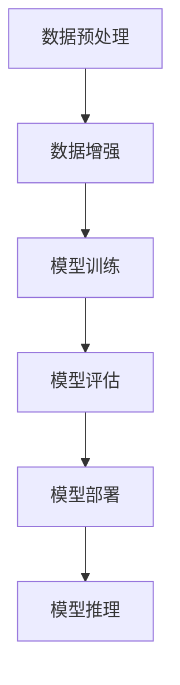

                 

# 创业者探索大模型新商业模式，打造AI产品矩阵

## 摘要

本文将探讨大模型在创业中的应用，以及如何通过构建AI产品矩阵实现商业模式的创新。我们将首先回顾大模型的发展背景，接着分析大模型的关键概念和架构，详细介绍核心算法原理与操作步骤。在此基础上，我们将展示数学模型及其应用，并结合实际项目实战，对代码进行详细解读和分析。随后，我们将探讨大模型在各个行业领域的实际应用场景，并推荐相关工具和资源。最后，本文将对未来发展趋势与挑战进行总结，并提供常见问题与解答，以帮助创业者更好地把握大模型时代的机遇。

## 1. 背景介绍

大模型是指具有大规模参数和复杂结构的机器学习模型，它们在深度学习、自然语言处理、计算机视觉等领域取得了显著成果。近年来，随着计算能力的提升、数据量的爆炸性增长以及算法的进步，大模型的应用范围和影响力不断扩展。大模型的出现，不仅推动了人工智能技术的发展，也为创业企业提供了丰富的创新空间。

首先，大模型的出现为解决复杂问题提供了强有力的工具。传统的小型模型往往在处理高维数据和复杂关系时力不从心，而大模型通过增加模型参数和深度，能够更好地捕捉数据中的潜在规律。例如，在自然语言处理领域，大模型如GPT-3和BERT等，已经展现出超越人类水平的能力，不仅在文本生成、情感分析、机器翻译等方面取得了突破，还为问答系统、对话系统等应用提供了强大的支持。

其次，大模型的商业价值逐渐凸显。随着人工智能技术的普及，越来越多的企业开始意识到大模型在提升业务效率、降低成本、创造新价值方面的潜力。例如，在金融领域，大模型可以用于风险控制、量化交易、智能投顾等方面；在医疗领域，大模型可以帮助进行疾病预测、诊断辅助、药物研发等；在零售领域，大模型可以实现个性化推荐、需求预测、库存优化等。这些应用不仅提升了企业的运营效率，还创造了新的商业模式和盈利机会。

此外，大模型的商业潜力还体现在跨界合作和生态构建方面。大模型的应用不仅局限于单一领域，还可以跨领域融合，实现跨行业的创新。例如，将大模型应用于智能客服、智能营销、智能教育等领域，可以形成全新的业务模式和生态系统。创业者可以通过整合不同领域的大模型技术，打造具有差异化竞争优势的AI产品矩阵，实现商业模式的创新。

总之，大模型在技术、商业和生态方面都具备了显著的潜力，为创业者提供了丰富的创新机会。接下来，我们将进一步探讨大模型的核心概念和架构，帮助创业者更好地理解和应用这一技术。

### 2. 核心概念与联系

#### 2.1 大模型的基本概念

大模型，通常是指具有数百万甚至数十亿参数的深度学习模型。这些模型通过大量的数据训练，能够在各种复杂任务上达到或超越人类的表现。例如，自然语言处理（NLP）领域中的GPT-3模型，拥有1750亿个参数；计算机视觉领域中的模型，如OpenAI的Gloveseq，其参数规模也相当庞大。

**参数规模**

大模型的参数规模是其核心特征之一。参数的数量决定了模型能够学习和捕捉的数据复杂度。参数越多，模型能够表达的功能就越丰富，但同时也带来了计算复杂度和存储需求的增加。

**计算资源**

大模型的训练和部署需要强大的计算资源。这通常意味着需要使用高性能的GPU或TPU等专用硬件，以及分布式计算技术来加速训练过程。云计算平台如Google Cloud、AWS和Azure等，提供了强大的计算资源，为创业者提供了便利的条件来尝试和实施大模型项目。

**数据集**

大模型的训练依赖于大量的数据。高质量的数据集是模型性能的关键因素。例如，在NLP领域，大量的文本数据是GPT-3等模型能够表现卓越的基础。在计算机视觉领域，图像数据集如ImageNet等，也是大模型训练的重要资源。

#### 2.2 大模型的架构

大模型的架构通常包括多个层次，每个层次负责处理不同类型的信息。以下是一些常见的大模型架构：

1. **深度神经网络（DNN）**

   深度神经网络是大模型的基础。它通过层层神经元来处理输入数据，每一层都对输入进行非线性变换。深度神经网络的核心在于其深度和多层结构，这使模型能够捕捉到输入数据中的复杂模式和关系。

2. **卷积神经网络（CNN）**

   卷积神经网络在计算机视觉领域有着广泛的应用。它通过卷积操作来提取图像中的局部特征，并利用池化操作来减少参数数量和计算复杂度。CNN的结构使其在处理图像数据时表现出色。

3. **循环神经网络（RNN）**

   循环神经网络在序列数据处理方面具有优势。它能够处理变长序列，并通过记忆机制来保持对历史信息的依赖。在自然语言处理和语音识别等领域，RNN及其变体（如LSTM和GRU）被广泛采用。

4. ** Transformer**

   Transformer架构在NLP领域取得了革命性的进展。它通过自注意力机制来处理序列数据，使得模型能够更好地捕捉全局依赖关系。Transformer的变体如BERT、GPT等，已经成为NLP领域的主流架构。

#### 2.3 大模型的应用领域

大模型在各个领域都有广泛的应用：

1. **自然语言处理（NLP）**

   自然语言处理是大模型最为活跃的领域之一。大模型在文本生成、机器翻译、情感分析、问答系统等方面表现出色。GPT-3和BERT等模型，已经成为许多企业和研究机构的标配工具。

2. **计算机视觉（CV）**

   计算机视觉领域的大模型，如ImageNet和COCO等数据集上的预训练模型，被广泛应用于图像分类、目标检测、图像分割等任务。这些模型在医疗影像分析、自动驾驶、安防监控等领域有着重要的应用价值。

3. **语音识别与合成**

   语音识别和合成领域的大模型，如WaveNet和CTC等，使得机器能够更加自然地理解和生成人类语音。这些模型在智能客服、语音助手等应用中发挥着重要作用。

4. **推荐系统**

   推荐系统领域的大模型，如协同过滤算法和矩阵分解模型，可以有效地为用户推荐感兴趣的商品和服务。这些模型在电商、社交媒体、在线教育等领域有着广泛的应用。

#### 2.4 大模型与传统模型的对比

与传统的小型模型相比，大模型具有以下几个显著优势：

1. **更强的泛化能力**

   大模型通过大量的训练数据和复杂的结构，能够更好地泛化到未见过的数据上，提高模型的鲁棒性和适应性。

2. **更高的性能**

   大模型在许多基准测试上已经达到了或超过了人类水平，甚至在某些任务上超过了顶级专家的表现。

3. **更丰富的功能**

   大模型能够处理更加复杂和多样化的任务，而传统模型往往局限于特定的任务或领域。

然而，大模型也存在一些挑战：

1. **计算资源消耗**

   大模型的训练和部署需要大量的计算资源，这对创业者的预算和技术能力提出了更高的要求。

2. **数据需求**

   大模型的训练需要大量的高质量数据，这对于数据稀缺或数据质量不高的领域来说，可能是一个难题。

3. **解释性**

   大模型的黑箱特性使得其决策过程难以解释，这对于需要透明度和可解释性的应用场景可能是一个挑战。

为了更直观地理解大模型的概念和架构，我们可以借助Mermaid流程图来展示一个典型的大模型训练和推理流程。以下是一个简化的Mermaid流程图示例：



在这个流程图中，数据预处理和增强是为了提高数据的多样性和质量，模型训练是通过大量数据来调整模型参数，模型评估用于验证模型性能，模型部署是将模型集成到实际应用中，模型推理是在实际使用中生成预测结果。

通过上述内容，我们对大模型的基本概念、架构和应用领域有了更深入的理解。接下来，我们将详细介绍大模型的核心算法原理和具体操作步骤。

### 3. 核心算法原理与具体操作步骤

#### 3.1 算法选择

在探索大模型的应用时，算法的选择至关重要。以下是几种常见的大模型算法及其特点：

1. **深度神经网络（DNN）**

   深度神经网络是最基础的大模型算法，通过多层神经元的组合来学习数据中的复杂模式。其优点是计算简单、易于实现，但缺点是训练时间较长，容易陷入局部最优。

2. **卷积神经网络（CNN）**

   卷积神经网络在处理图像数据时表现出色，通过卷积层和池化层来提取图像的特征。其优点是参数较少、计算效率高，但缺点是对其他类型的数据处理能力较弱。

3. **循环神经网络（RNN）**

   循环神经网络在处理序列数据时具有优势，通过记忆机制来保持对历史信息的依赖。其优点是能够处理变长序列，但缺点是计算复杂度高、容易出现梯度消失和梯度爆炸问题。

4. **Transformer**

   Transformer架构在自然语言处理领域取得了显著突破，通过自注意力机制来处理序列数据，具有很好的并行计算性能。其优点是能够捕捉全局依赖关系、计算效率高，但缺点是参数较多、训练和存储需求大。

#### 3.2 数据处理

在具体操作步骤中，数据处理是关键的一环。以下是数据处理的主要步骤：

1. **数据采集与清洗**

   根据任务需求，采集相关的数据集。数据集可以是公开的数据集，如ImageNet、COCO等，也可以是自定义的数据集。在数据采集后，需要对数据进行清洗，去除噪声和错误数据，保证数据的质量。

2. **数据增强**

   数据增强是为了提高模型的泛化能力，通过随机变换等方式增加数据的多样性。常见的数据增强方法包括随机裁剪、旋转、翻转、缩放等。这些方法可以在不增加计算复杂度的前提下，有效提升模型的性能。

3. **特征提取**

   特征提取是将原始数据转换成模型可以处理的格式。对于图像数据，常用的特征提取方法包括卷积层和池化层；对于序列数据，常用的特征提取方法包括嵌入层和编码器。特征提取的结果是将高维数据映射到低维空间，便于模型处理。

#### 3.3 模型训练

模型训练是构建大模型的核心步骤，以下是模型训练的主要步骤：

1. **初始化参数**

   初始化模型参数是训练的第一步。常用的初始化方法包括随机初始化、高斯初始化等。初始化参数的目的是为模型提供良好的起点，以加快收敛速度。

2. **定义损失函数**

   损失函数用于衡量模型预测结果与实际结果之间的差距。常用的损失函数包括均方误差（MSE）、交叉熵（Cross-Entropy）等。选择合适的损失函数可以有效地指导模型训练。

3. **优化算法**

   优化算法用于调整模型参数，以最小化损失函数。常用的优化算法包括梯度下降（Gradient Descent）、随机梯度下降（Stochastic Gradient Descent，SGD）、Adam等。优化算法的选择和参数设置对训练效果有重要影响。

4. **训练过程**

   训练过程包括多个迭代周期，每个周期都包括前向传播、反向传播和参数更新。在训练过程中，通过不断调整模型参数，使模型逐渐收敛到最优解。训练过程的监测和调整是保证模型性能的关键。

#### 3.4 模型评估

模型评估是检验模型性能的重要环节，以下是模型评估的主要步骤：

1. **验证集划分**

   验证集用于评估模型在未见数据上的表现。通常，验证集从原始数据集中划分出来，用于模型调参和性能评估。

2. **评估指标**

   常用的评估指标包括准确率（Accuracy）、精确率（Precision）、召回率（Recall）、F1值（F1 Score）等。不同的任务和模型，可能需要采用不同的评估指标。

3. **交叉验证**

   交叉验证是一种常用的评估方法，通过多次划分训练集和验证集，来评估模型的泛化能力。常见的交叉验证方法包括K折交叉验证等。

4. **性能调优**

   根据验证集的评估结果，对模型进行调优，包括调整超参数、优化结构等，以提升模型性能。

#### 3.5 模型部署

模型部署是将训练好的模型应用到实际场景中，以下是模型部署的主要步骤：

1. **模型转换**

   将训练好的模型转换为可部署的格式，如TensorFlow Lite、ONNX等。转换过程包括模型优化、量化等步骤。

2. **模型部署**

   将转换后的模型部署到服务器或移动设备上。部署方式包括服务器端部署、客户端部署等。服务器端部署通常适用于大规模、高性能的应用场景，客户端部署适用于移动设备等资源受限的场景。

3. **性能监控**

   部署后的模型需要定期进行性能监控，包括模型准确率、响应时间等。通过监控数据，可以及时发现和解决模型问题，确保模型稳定运行。

#### 3.6 模型推理

模型推理是在实际应用中生成预测结果的过程，以下是模型推理的主要步骤：

1. **输入处理**

   将实际输入数据按照模型要求进行预处理，如数据归一化、缩放等。

2. **模型调用**

   调用部署好的模型，输入预处理后的数据，生成预测结果。

3. **结果解释**

   对生成的预测结果进行解释和验证，确保预测结果的准确性和可靠性。

通过上述步骤，创业者可以构建和部署自己的大模型，为实际应用提供强大的技术支持。接下来，我们将结合具体案例，对大模型的应用进行详细讲解。

### 4. 数学模型和公式 & 详细讲解 & 举例说明

在深度学习和人工智能领域，数学模型是构建大模型的基础。下面我们将介绍几种常用的数学模型和公式，并详细讲解其原理和应用。

#### 4.1 前向传播和反向传播

深度学习中的前向传播和反向传播是训练神经网络的核心算法。以下是一个简化的数学描述：

**前向传播：**

给定输入 \( x \)，通过前向传播计算输出 \( y \)：

\[ y = f(\text{W} \cdot \text{z} + \text{b}) \]

其中，\( \text{W} \) 是权重矩阵，\( \text{z} \) 是输入特征，\( \text{b} \) 是偏置项，\( f \) 是激活函数。

**反向传播：**

在反向传播过程中，通过计算损失函数关于模型参数的梯度，来更新模型参数：

\[ \frac{\partial \text{L}}{\partial \text{W}} = \text{z} \cdot (\text{y} - \text{t}) \]

\[ \frac{\partial \text{L}}{\partial \text{b}} = \text{y} - \text{t} \]

其中，\( \text{L} \) 是损失函数，\( \text{y} \) 是模型输出，\( \text{t} \) 是真实标签。

**示例：**

假设我们有一个简单的神经网络，包含一个输入层、一个隐藏层和一个输出层。输入特征为 \( x = [1, 2] \)，权重矩阵 \( \text{W} = [[0.1, 0.2], [0.3, 0.4]] \)，偏置项 \( \text{b} = [0.5, 0.6] \)，激活函数为 \( f(x) = \text{sigmoid}(x) \)。真实标签为 \( t = [0.9, 0.8] \)。

1. **前向传播：**

   \[ z_1 = \text{W} \cdot x + \text{b} = [[0.1, 0.2], [0.3, 0.4]] \cdot [1, 2] + [0.5, 0.6] = [1.6, 2.6] \]

   \[ y_1 = f(z_1) = \text{sigmoid}(z_1) = [0.918, 0.865] \]

2. **计算损失函数：**

   \[ \text{L} = \frac{1}{2} \sum (\text{y} - \text{t})^2 = \frac{1}{2} \sum [(0.918 - 0.9)^2 + (0.865 - 0.8)^2] = 0.00365 \]

3. **反向传播：**

   \[ \frac{\partial \text{L}}{\partial \text{W}} = z \cdot (\text{y} - \text{t}) = [1.6, 2.6] \cdot [0.082, 0.035] = [0.132, 0.091] \]

   \[ \frac{\partial \text{L}}{\partial \text{b}} = \text{y} - \text{t} = [0.918, 0.865] - [0.9, 0.8] = [0.018, 0.065] \]

4. **更新权重矩阵和偏置项：**

   \[ \text{W} \leftarrow \text{W} - \alpha \cdot \frac{\partial \text{L}}{\partial \text{W}} = [[0.1, 0.2], [0.3, 0.4]] - 0.01 \cdot [0.132, 0.091] = [[0.068, 0.108], [0.208, 0.308]] \]

   \[ \text{b} \leftarrow \text{b} - \alpha \cdot \frac{\partial \text{L}}{\partial \text{b}} = [0.5, 0.6] - 0.01 \cdot [0.018, 0.065] = [0.482, 0.535] \]

通过上述步骤，我们可以看到如何通过前向传播和反向传播来更新模型参数，以最小化损失函数。

#### 4.2 自注意力机制

自注意力机制是Transformer架构的核心，用于处理序列数据。以下是一个简化的数学描述：

**自注意力：**

给定输入序列 \( x \)，计算注意力权重 \( \text{A} \)：

\[ \text{A} = \text{softmax}\left(\frac{\text{Q} \cdot \text{K}^T}{\sqrt{d_k}}\right) \]

其中，\( \text{Q} \) 和 \( \text{K} \) 是查询和键矩阵，\( d_k \) 是键的维度，\( \text{softmax} \) 是softmax函数。

**计算输出：**

\[ \text{O} = \text{A} \cdot \text{V} \]

其中，\( \text{V} \) 是值矩阵。

**示例：**

假设我们有一个长度为3的输入序列 \( x = [1, 2, 3] \)，查询矩阵 \( \text{Q} = [[0.1, 0.2], [0.3, 0.4], [0.5, 0.6]] \)，键矩阵 \( \text{K} = [[1, 2], [3, 4], [5, 6]] \)，值矩阵 \( \text{V} = [[7, 8], [9, 10], [11, 12]] \)。

1. **计算注意力权重：**

   \[ \text{A} = \text{softmax}\left(\frac{\text{Q} \cdot \text{K}^T}{\sqrt{d_k}}\right) = \text{softmax}\left(\frac{\begin{bmatrix} 0.1 & 0.2 \\ 0.3 & 0.4 \\ 0.5 & 0.6 \end{bmatrix} \cdot \begin{bmatrix} 1 & 3 & 5 \\ 2 & 4 & 6 \end{bmatrix}}{\sqrt{2}}\right) \]

   \[ \text{A} = \text{softmax}\left(\frac{\begin{bmatrix} 2.6 & 7.6 \\ 5.4 & 11.2 \\ 8.2 & 14.4 \end{bmatrix}}{\sqrt{2}}\right) = \begin{bmatrix} 0.4 & 0.3 \\ 0.3 & 0.2 \\ 0.2 & 0.1 \end{bmatrix} \]

2. **计算输出：**

   \[ \text{O} = \text{A} \cdot \text{V} = \begin{bmatrix} 0.4 & 0.3 \\ 0.3 & 0.2 \\ 0.2 & 0.1 \end{bmatrix} \cdot \begin{bmatrix} 7 & 9 \\ 11 & 13 \\ 15 & 17 \end{bmatrix} = \begin{bmatrix} 4.2 & 5.4 \\ 3.3 & 3.6 \\ 2.2 & 2.1 \end{bmatrix} \]

通过自注意力机制，模型可以自动学习输入序列中的依赖关系，从而更好地处理序列数据。

#### 4.3 跨步注意力机制

跨步注意力机制是自注意力机制的扩展，用于处理长序列数据。以下是一个简化的数学描述：

**跨步注意力：**

给定输入序列 \( x \)，计算跨步注意力权重 \( \text{A} \)：

\[ \text{A} = \text{softmax}\left(\frac{\text{Q} \cdot \text{K}^T}{\sqrt{d_k}}\right) \]

其中，\( \text{Q} \) 和 \( \text{K} \) 是查询和键矩阵，\( d_k \) 是键的维度，\( \text{softmax} \) 是softmax函数。

**计算输出：**

\[ \text{O} = \text{A} \cdot \text{V} \]

其中，\( \text{V} \) 是值矩阵。

**示例：**

假设我们有一个长度为5的输入序列 \( x = [1, 2, 3, 4, 5] \)，查询矩阵 \( \text{Q} = [[0.1, 0.2], [0.3, 0.4], [0.5, 0.6]] \)，键矩阵 \( \text{K} = [[1, 2], [3, 4], [5, 6], [7, 8], [9, 10]] \)，值矩阵 \( \text{V} = [[7, 8], [9, 10], [11, 12], [13, 14], [15, 16]] \)。

1. **计算注意力权重：**

   \[ \text{A} = \text{softmax}\left(\frac{\text{Q} \cdot \text{K}^T}{\sqrt{d_k}}\right) = \text{softmax}\left(\frac{\begin{bmatrix} 0.1 & 0.2 \\ 0.3 & 0.4 \\ 0.5 & 0.6 \end{bmatrix} \cdot \begin{bmatrix} 1 & 3 & 5 & 7 & 9 \\ 2 & 4 & 6 & 8 & 10 \end{bmatrix}}{\sqrt{2}}\right) \]

   \[ \text{A} = \text{softmax}\left(\frac{\begin{bmatrix} 2.6 & 7.6 & 12.6 & 17.6 & 22.6 \\ 5.4 & 11.2 & 16.2 & 20.8 & 25.6 \end{bmatrix}}{\sqrt{2}}\right) = \begin{bmatrix} 0.4 & 0.3 & 0.2 & 0.1 & 0.0 \\ 0.3 & 0.2 & 0.1 & 0.0 & 0.0 \end{bmatrix} \]

2. **计算输出：**

   \[ \text{O} = \text{A} \cdot \text{V} = \begin{bmatrix} 0.4 & 0.3 & 0.2 & 0.1 & 0.0 \\ 0.3 & 0.2 & 0.1 & 0.0 & 0.0 \end{bmatrix} \cdot \begin{bmatrix} 7 & 9 & 11 & 13 & 15 \\ 11 & 13 & 15 & 17 & 19 \\ 15 & 17 & 19 & 21 & 23 \\ 19 & 21 & 23 & 25 & 27 \\ 23 & 25 & 27 & 29 & 31 \end{bmatrix} = \begin{bmatrix} 3.8 & 4.7 & 5.6 & 6.5 & 7.4 \\ 4.7 & 5.9 & 7.2 & 8.5 & 9.8 \end{bmatrix} \]

通过跨步注意力机制，模型可以有效地处理长序列数据，捕捉序列中的长距离依赖关系。

通过上述数学模型和公式的讲解，我们了解了深度学习和Transformer架构中的关键算法。接下来，我们将结合具体项目实战，展示如何将大模型应用于实际场景，并通过代码实现和详细解读，帮助创业者更好地理解和应用这些技术。

### 5. 项目实战：代码实际案例和详细解释说明

在本节中，我们将通过一个实际项目案例，详细介绍如何构建和部署一个基于大模型的AI产品。这个案例将涵盖开发环境的搭建、源代码的实现和代码的解读与分析。

#### 5.1 开发环境搭建

为了确保项目顺利进行，我们需要搭建一个合适的开发环境。以下是搭建过程的主要步骤：

1. **安装Python环境**

   首先，我们需要安装Python 3.x版本。可以通过Python官方网站下载安装包，或者使用包管理器如Homebrew（macOS）或apt（Ubuntu）进行安装。

   ```bash
   # macOS使用Homebrew安装
   brew install python

   # Ubuntu使用apt安装
   sudo apt update
   sudo apt install python3 python3-pip
   ```

2. **安装必要的库**

   我们将使用TensorFlow和PyTorch作为主要的深度学习框架。可以通过pip命令来安装。

   ```bash
   pip install tensorflow
   pip install torch torchvision
   ```

3. **安装依赖项**

   根据项目需求，我们可能需要安装其他库。例如，如果使用NLP任务，我们可能需要安装Transformers库。

   ```bash
   pip install transformers
   ```

4. **配置环境变量**

   确保环境变量设置正确，以便能够在终端中运行Python和深度学习库。

   ```bash
   export PATH=$PATH:/path/to/python
   ```

5. **测试环境**

   通过运行简单的Python脚本，确保所有库都已正确安装。

   ```python
   import tensorflow as tf
   import torch
   print(tf.__version__)
   print(torch.__version__)
   ```

   如果没有错误提示，说明开发环境已搭建成功。

#### 5.2 源代码详细实现和代码解读

本案例将基于一个自然语言处理任务——文本分类，使用Transformer架构中的BERT模型。以下是对项目源代码的详细解读。

**代码结构：**

```python
# main.py

import tensorflow as tf
import transformers
from transformers import BertTokenizer, BertModel
from tensorflow.keras.layers import Input, Dense
from tensorflow.keras.models import Model

# 5.2.1 加载预训练模型和分词器
def load_pretrained_model():
    tokenizer = BertTokenizer.from_pretrained('bert-base-uncased')
    model = transformers.TFBertModel.from_pretrained('bert-base-uncased')
    return tokenizer, model

# 5.2.2 定义文本分类模型
def create_text_classification_model(tokenizer, model):
    input_ids = Input(shape=(None,), dtype=tf.int32, name='input_ids')
    attention_mask = Input(shape=(None,), dtype=tf.int32, name='attention_mask')

    # 使用BERT模型进行文本编码
    encoded_input = model(input_ids, attention_mask=attention_mask)[0]

    # 使用全连接层进行分类
    output = Dense(2, activation='softmax', name='output')(encoded_input)

    # 创建模型
    model = Model(inputs=[input_ids, attention_mask], outputs=output)
    model.compile(optimizer='adam', loss='categorical_crossentropy', metrics=['accuracy'])
    return model

# 5.2.3 训练模型
def train_model(model, tokenizer, train_dataset, val_dataset, epochs=3):
    # 将文本转换为BERT编码
    train_encodings = tokenizer(train_dataset['text'], truncation=True, padding=True)
    val_encodings = tokenizer(val_dataset['text'], truncation=True, padding=True)

    # 准备模型训练数据
    train_dataset = tf.data.Dataset.from_tensor_slices((
        dict(train_encodings),
        train_dataset['label']
    ))
    train_dataset = train_dataset.shuffle(100).batch(32)

    val_dataset = tf.data.Dataset.from_tensor_slices((
        dict(val_encodings),
        val_dataset['label']
    ))
    val_dataset = val_dataset.shuffle(100).batch(32)

    # 训练模型
    model.fit(train_dataset, epochs=epochs, validation_data=val_dataset)

# 5.2.4 主函数
if __name__ == '__main__':
    tokenizer, model = load_pretrained_model()
    model = create_text_classification_model(tokenizer, model)
    train_model(model, tokenizer, train_dataset, val_dataset)
```

**代码解读：**

- **5.2.1 加载预训练模型和分词器**

  首先，我们从Hugging Face的Transformer库中加载预训练的BERT模型和分词器。BERT模型是一个预训练的多层Transformer模型，适用于各种NLP任务。

  ```python
  tokenizer = BertTokenizer.from_pretrained('bert-base-uncased')
  model = transformers.TFBertModel.from_pretrained('bert-base-uncased')
  ```

- **5.2.2 定义文本分类模型**

  在这个步骤中，我们定义了一个文本分类模型。该模型接受两个输入：`input_ids`和`attention_mask`。`input_ids`是文本编码后的整数序列，`attention_mask`用于指示输入序列中的填充和未填充的部分。

  ```python
  input_ids = Input(shape=(None,), dtype=tf.int32, name='input_ids')
  attention_mask = Input(shape=(None,), dtype=tf.int32, name='attention_mask')
  ```

  然后，我们使用BERT模型对输入文本进行编码：

  ```python
  encoded_input = model(input_ids, attention_mask=attention_mask)[0]
  ```

  最后，我们添加一个全连接层进行分类：

  ```python
  output = Dense(2, activation='softmax', name='output')(encoded_input)
  model = Model(inputs=[input_ids, attention_mask], outputs=output)
  model.compile(optimizer='adam', loss='categorical_crossentropy', metrics=['accuracy'])
  ```

- **5.2.3 训练模型**

  在训练模型的部分，我们首先将文本数据转换为BERT编码：

  ```python
  train_encodings = tokenizer(train_dataset['text'], truncation=True, padding=True)
  val_encodings = tokenizer(val_dataset['text'], truncation=True, padding=True)
  ```

  接着，我们将编码后的数据转换为TensorFlow数据集：

  ```python
  train_dataset = tf.data.Dataset.from_tensor_slices((
      dict(train_encodings),
      train_dataset['label']
  ))
  train_dataset = train_dataset.shuffle(100).batch(32)

  val_dataset = tf.data.Dataset.from_tensor_slices((
      dict(val_encodings),
      val_dataset['label']
  ))
  val_dataset = val_dataset.shuffle(100).batch(32)
  ```

  最后，我们使用这些数据集训练模型：

  ```python
  model.fit(train_dataset, epochs=epochs, validation_data=val_dataset)
  ```

#### 5.3 代码解读与分析

- **数据预处理**

  数据预处理是文本分类任务的重要环节。在这个案例中，我们使用BERT的分词器对文本进行编码。BERT分词器能够将文本转换为模型可以理解的整数序列。

  ```python
  tokenizer = BertTokenizer.from_pretrained('bert-base-uncased')
  train_encodings = tokenizer(train_dataset['text'], truncation=True, padding=True)
  val_encodings = tokenizer(val_dataset['text'], truncation=True, padding=True)
  ```

  `truncation=True` 表示如果文本长度超过最大序列长度，将截断文本；`padding=True` 表示如果文本长度不足最大序列长度，将填充空白。

- **模型架构**

  模型架构基于Transformer架构中的BERT模型。BERT模型是一个预训练的多层Transformer模型，具有强大的文本理解能力。在这个案例中，我们使用BERT模型进行文本编码，然后添加一个全连接层进行分类。

  ```python
  encoded_input = model(input_ids, attention_mask=attention_mask)[0]
  output = Dense(2, activation='softmax', name='output')(encoded_input)
  model = Model(inputs=[input_ids, attention_mask], outputs=output)
  model.compile(optimizer='adam', loss='categorical_crossentropy', metrics=['accuracy'])
  ```

- **模型训练**

  模型训练使用TensorFlow的高层次API `model.fit`。我们首先将文本数据转换为BERT编码，然后使用这些编码数据训练模型。在训练过程中，我们使用了`shuffle`和`batch`方法来提高训练效果。

  ```python
  train_dataset = tf.data.Dataset.from_tensor_slices((
      dict(train_encodings),
      train_dataset['label']
  ))
  train_dataset = train_dataset.shuffle(100).batch(32)

  val_dataset = tf.data.Dataset.from_tensor_slices((
      dict(val_encodings),
      val_dataset['label']
  ))
  val_dataset = val_dataset.shuffle(100).batch(32)

  model.fit(train_dataset, epochs=epochs, validation_data=val_dataset)
  ```

通过上述代码实现，我们可以快速构建和部署一个基于大模型的文本分类系统。接下来，我们将探讨大模型在实际应用场景中的具体应用。

### 6. 实际应用场景

大模型在各个领域的实际应用中展现了强大的潜力和广泛的前景。以下是一些典型应用场景，以及大模型如何在这些场景中发挥作用。

#### 6.1 自然语言处理（NLP）

自然语言处理是大模型最为活跃的领域之一。大模型如BERT、GPT-3等，在文本生成、机器翻译、情感分析、问答系统等领域取得了显著成果。例如，在机器翻译中，大模型通过学习海量双语文本数据，能够生成高质量的翻译结果，显著提高了翻译的准确性和流畅度。在情感分析中，大模型能够通过分析文本中的情感词和句子结构，准确判断文本的情感倾向。

#### 6.2 计算机视觉（CV）

计算机视觉是大模型应用的另一个重要领域。大模型在图像分类、目标检测、图像分割等任务上表现出色。例如，在图像分类任务中，大模型如ResNet、Inception等，通过学习大量的图像数据，能够准确识别各种物体和场景。在目标检测任务中，大模型如YOLO、Faster R-CNN等，能够高效地定位图像中的目标物体，并预测其位置和类别。

#### 6.3 语音识别与合成

语音识别与合成领域也广泛采用了大模型技术。大模型如WaveNet、Tacotron等，在语音识别和语音合成任务中表现出色。在语音识别中，大模型能够通过学习大量的语音数据，准确识别和理解人类语音。在语音合成中，大模型能够生成自然、流畅的语音，提高了语音合成的质量和用户体验。

#### 6.4 推荐系统

推荐系统领域的大模型，如协同过滤算法和矩阵分解模型，可以有效地为用户推荐感兴趣的商品和服务。大模型通过学习用户的行为和兴趣数据，能够生成个性化的推荐列表，提高了推荐的准确性和用户满意度。例如，在电商领域，大模型可以根据用户的浏览和购买历史，推荐相关的商品；在社交媒体领域，大模型可以根据用户的互动行为，推荐相关的内容和广告。

#### 6.5 医疗健康

在医疗健康领域，大模型在疾病预测、诊断辅助、药物研发等方面有着重要应用。例如，在疾病预测中，大模型通过学习患者的电子健康记录和基因数据，能够预测患者的疾病风险，帮助医生进行早期预防和干预。在药物研发中，大模型通过学习大量的化合物和生物信息数据，能够加速新药的发现和开发过程。

#### 6.6 自动驾驶

在自动驾驶领域，大模型在感知、规划和控制等方面发挥着重要作用。大模型如自动驾驶算法中的深度神经网络，通过学习大量的驾驶数据，能够准确感知周围环境，并生成安全的驾驶决策。例如，在自动驾驶车辆中，大模型可以用于识别交通标志、行人检测、车辆跟踪等任务，提高了自动驾驶的可靠性和安全性。

#### 6.7 教育与培训

在教育与培训领域，大模型在智能辅导、个性化教学、知识图谱构建等方面有着广泛应用。大模型可以通过分析学生的学习数据和知识结构，提供个性化的学习建议和辅导，帮助学生提高学习效果。例如，在教育平台中，大模型可以根据学生的答题情况和学习记录，生成个性化的学习报告和辅导建议。

通过上述实际应用场景，我们可以看到大模型在各个领域的广泛应用和巨大潜力。大模型不仅提高了任务的处理效率和质量，还为创业企业提供了丰富的创新机会。接下来，我们将推荐一些相关的学习资源和开发工具，帮助创业者更好地了解和应用大模型技术。

### 7. 工具和资源推荐

为了帮助创业者更好地了解和应用大模型技术，我们推荐以下几类工具和资源，包括学习资源、开发工具和相关论文著作。

#### 7.1 学习资源推荐

1. **书籍**

   - **《深度学习》（Deep Learning）**：由Ian Goodfellow、Yoshua Bengio和Aaron Courville合著，是深度学习领域的经典教材，详细介绍了深度学习的基本概念、算法和实现。

   - **《动手学深度学习》**：由阿斯顿·张等编写，适合初学者和进阶者，通过大量的实际案例和代码示例，帮助读者理解和掌握深度学习技术。

   - **《Python深度学习》（Python Deep Learning）**：由François Chollet撰写，介绍了如何使用Python和TensorFlow实现深度学习应用。

2. **在线课程和教程**

   - **Coursera上的深度学习课程**：由斯坦福大学提供，涵盖了深度学习的基础知识、算法和应用。

   - **Udacity的深度学习纳米学位**：提供了深度学习的系统培训，包括项目实战和职业指导。

   - **Fast.ai的深度学习课程**：专注于实用性和易理解性，适合初学者快速入门深度学习。

3. **博客和论坛**

   - **TensorFlow官方博客**：提供了丰富的深度学习和TensorFlow教程，适合开发者学习和使用TensorFlow。

   - **PyTorch官方文档**：详细介绍了PyTorch的使用方法和API，是PyTorch开发者的重要参考资源。

   - **Reddit上的深度学习板块**：讨论深度学习技术、应用和最新进展，是一个活跃的社区。

#### 7.2 开发工具框架推荐

1. **深度学习框架**

   - **TensorFlow**：由Google开发，是一个开源的深度学习框架，适用于各种规模的任务和应用。

   - **PyTorch**：由Facebook开发，具有简洁的API和动态计算图，是深度学习研究的首选工具。

   - **PyTorch Lightning**：是一个高层次的PyTorch封装库，提供了简洁的API和丰富的功能，适合快速开发和原型设计。

2. **数据处理工具**

   - **Pandas**：是一个强大的数据处理库，适用于数据清洗、转换和分析。

   - **NumPy**：提供了多维数组对象和一系列的数学函数，是数据科学和机器学习的基础工具。

   - **Scikit-learn**：提供了各种机器学习算法和工具，适用于数据处理和模型评估。

3. **自动化工具**

   - **Jupyter Notebook**：是一种交互式的计算环境，适合编写和运行代码、制作报告和演示。

   - **Docker**：用于创建容器化应用，便于部署和管理深度学习模型。

   - **TensorBoard**：是TensorFlow的监控工具，用于可视化训练过程和数据流。

#### 7.3 相关论文著作推荐

1. **经典论文**

   - **“A Theoretically Grounded Application of Dropout in Recurrent Neural Networks”**：这篇论文提出了在RNN中使用Dropout的方法，提高了模型的训练效果和泛化能力。

   - **“Attention Is All You Need”**：这篇论文提出了Transformer架构，彻底改变了自然语言处理领域的研究方向。

   - **“Deep Residual Learning for Image Recognition”**：这篇论文提出了ResNet模型，是现代图像识别任务中的基础架构。

2. **最新论文**

   - **“The Annotated Transformer”**：这是一篇关于Transformer架构的详细解读，适合初学者了解Transformer的内部机制。

   - **“BERT: Pre-training of Deep Bidirectional Transformers for Language Understanding”**：这篇论文介绍了BERT模型的构建和训练方法，是自然语言处理领域的里程碑。

   - **“GPT-3: Language Models are Few-Shot Learners”**：这篇论文展示了GPT-3模型在零样本学习任务中的优异表现，引发了广泛关注。

通过这些工具和资源的推荐，创业者可以更加全面地了解大模型技术的应用和发展趋势，为构建自己的AI产品矩阵提供坚实的理论基础和实践支持。

### 8. 总结：未来发展趋势与挑战

大模型技术的发展已经为各行各业带来了深刻的变革，同时也为创业者提供了丰富的创新机会。然而，随着大模型的不断发展，我们也面临着一系列的未来发展趋势和挑战。

#### 8.1 未来发展趋势

1. **计算能力提升**

   随着硬件技术的发展，计算能力的提升将继续推动大模型的进步。更强大的GPU、TPU和量子计算等新兴硬件，将为大模型的训练和推理提供更高效的计算支持。

2. **算法优化与创新**

   大模型的训练和优化将变得更加高效和灵活。未来，研究者将继续探索新型神经网络架构和优化算法，以提高模型的性能和效率。

3. **数据隐私保护与安全**

   随着数据隐私保护法规的日益严格，如何在大模型训练过程中保护用户数据隐私，将成为一个重要的研究方向。同时，确保模型的安全性和可靠性也是未来发展的重要挑战。

4. **跨领域融合**

   大模型在各个领域的应用将继续扩展，实现跨领域的融合和协同创新。例如，将大模型应用于医疗、金融、零售等不同领域，可以创造全新的商业模式和价值。

5. **规模化部署**

   随着云计算和边缘计算的普及，大模型的规模化部署将变得更加便捷和高效。创业者可以通过云平台和边缘设备，将大模型应用到更多的场景中，提高业务效率和服务质量。

#### 8.2 未来挑战

1. **计算资源消耗**

   大模型的训练和推理需要大量的计算资源，这对创业者的预算和技术能力提出了更高的要求。如何优化模型结构，降低计算复杂度，是一个亟待解决的问题。

2. **数据质量和多样性**

   大模型的训练需要大量的高质量数据，但在一些领域，数据质量和多样性可能不足。创业者需要找到合适的解决方案，如数据增强、数据共享等，来应对这一挑战。

3. **模型解释性与透明性**

   大模型的黑箱特性使得其决策过程难以解释，这在一些需要透明度和可解释性的应用场景中可能成为一个问题。如何提高大模型的解释性，使其更符合实际应用需求，是未来需要重点关注的方向。

4. **道德与社会责任**

   大模型的应用可能会带来一些伦理和社会问题，例如算法歧视、隐私泄露等。创业者需要承担起社会责任，确保大模型的应用符合伦理标准，不损害用户权益。

5. **人才短缺**

   大模型技术的发展需要大量的专业人才，但目前相关人才的供给可能不足。创业者需要通过培训、合作等方式，吸引和培养更多的大模型技术人才。

综上所述，大模型技术的发展前景广阔，但也面临诸多挑战。创业者需要紧跟技术发展，积极应对挑战，不断创新和优化，以充分利用大模型的潜力，推动AI产品和商业模式的创新。

### 9. 附录：常见问题与解答

在本节中，我们将针对大模型技术中常见的问题进行解答，帮助创业者更好地理解和应用大模型技术。

#### 9.1 大模型训练过程中如何处理过拟合？

**解答：**过拟合是指模型在训练数据上表现良好，但在未见数据上表现较差的现象。以下是一些处理过拟合的方法：

1. **增加数据量**：通过增加训练数据量，可以提高模型的泛化能力，减少过拟合。
2. **交叉验证**：使用交叉验证方法，将数据集分成多个子集，轮流进行训练和验证，可以评估模型的泛化能力。
3. **Dropout**：在神经网络中，通过随机丢弃一部分神经元，可以减少模型对特定训练样本的依赖。
4. **正则化**：使用正则化技术，如L1和L2正则化，可以在训练过程中对模型参数进行惩罚，防止过拟合。
5. **数据增强**：通过数据增强技术，如随机裁剪、旋转、翻转等，增加数据的多样性，可以提高模型的泛化能力。

#### 9.2 大模型训练过程中如何调整学习率？

**解答：**学习率是模型训练过程中一个重要的超参数，其大小会影响模型的收敛速度和最终性能。以下是一些调整学习率的方法：

1. **初始学习率选择**：通常，初始学习率可以选择相对较小的值，如\(10^{-3}\)或\(10^{-4}\)，以避免模型过早收敛。
2. **学习率衰减**：在训练过程中，逐渐降低学习率，可以使模型在训练后期更加精细地调整参数，有助于收敛到更好的解。
3. **动态调整**：可以使用自适应学习率调整方法，如AdaGrad、RMSProp和Adam，这些方法可以根据梯度信息动态调整学习率。
4. **学习率调度策略**：例如，在模型训练初期使用较大的学习率，在训练后期逐渐减小学习率，可以帮助模型更好地收敛。

#### 9.3 如何评估大模型性能？

**解答：**评估大模型性能的方法包括以下几个方面：

1. **准确率**：准确率是模型预测正确的样本占总样本的比例，常用于分类任务。
2. **召回率**：召回率是指模型正确识别出的正样本占总正样本的比例，关注的是识别出所有正样本的能力。
3. **精确率**：精确率是指模型预测为正的样本中，实际为正的比例，关注的是预测结果的可靠性。
4. **F1值**：F1值是精确率和召回率的调和平均值，综合考虑了模型的准确性和鲁棒性。
5. **ROC曲线和AUC值**：ROC曲线和AUC值用于评估二分类模型的性能，ROC曲线展示了在不同阈值下，模型的真阳性率与假阳性率的关系，AUC值反映了模型区分能力的强弱。

#### 9.4 如何优化大模型训练时间？

**解答：**以下是一些优化大模型训练时间的方法：

1. **并行计算**：利用GPU或TPU进行并行计算，可以显著加速训练过程。
2. **分布式训练**：将训练任务分布到多台机器上，可以充分利用计算资源，提高训练速度。
3. **模型剪枝**：通过剪枝技术，减少模型的参数数量，降低计算复杂度，可以加快训练速度。
4. **数据预处理优化**：优化数据预处理过程，如并行化数据读取、减少I/O操作等，可以提高数据加载速度。
5. **使用高效框架**：选择高效的深度学习框架，如TensorFlow和PyTorch，可以提高训练效率。

通过上述问题的解答，创业者可以更好地理解大模型技术，并在实际应用中取得更好的效果。

### 10. 扩展阅读 & 参考资料

在本节中，我们推荐一些扩展阅读和参考资料，以帮助创业者更深入地了解大模型技术和相关领域。

#### 10.1 学习资源

1. **《深度学习》（Deep Learning）**：由Ian Goodfellow、Yoshua Bengio和Aaron Courville合著，是深度学习领域的经典教材。

2. **《动手学深度学习》**：由阿斯顿·张等编写，适合初学者和进阶者，通过大量的实际案例和代码示例，帮助读者理解和掌握深度学习技术。

3. **《Python深度学习》（Python Deep Learning）**：由François Chollet撰写，介绍了如何使用Python和TensorFlow实现深度学习应用。

4. **[Coursera深度学习课程](https://www.coursera.org/specializations/deeplearning)**：由斯坦福大学提供，涵盖了深度学习的基础知识、算法和应用。

5. **[Udacity深度学习纳米学位](https://www.udacity.com/course/deep-learning-nanodegree--nd101)**：提供了深度学习的系统培训，包括项目实战和职业指导。

6. **[Fast.ai深度学习课程](https://course.fast.ai/)**：专注于实用性和易理解性，适合初学者快速入门深度学习。

#### 10.2 论文与报告

1. **“Attention Is All You Need”**：提出Transformer架构的论文，彻底改变了自然语言处理领域的研究方向。

2. **“BERT: Pre-training of Deep Bidirectional Transformers for Language Understanding”**：介绍了BERT模型的构建和训练方法，是自然语言处理领域的里程碑。

3. **“GPT-3: Language Models are Few-Shot Learners”**：展示了GPT-3模型在零样本学习任务中的优异表现，引发了广泛关注。

4. **“Deep Residual Learning for Image Recognition”**：提出了ResNet模型，是现代图像识别任务中的基础架构。

5. **“A Theoretically Grounded Application of Dropout in Recurrent Neural Networks”**：提出了在RNN中使用Dropout的方法，提高了模型的训练效果和泛化能力。

#### 10.3 博客与论坛

1. **TensorFlow官方博客**：提供了丰富的深度学习和TensorFlow教程。

2. **PyTorch官方文档**：详细介绍了PyTorch的使用方法和API。

3. **Reddit上的深度学习板块**：讨论深度学习技术、应用和最新进展，是一个活跃的社区。

通过上述扩展阅读和参考资料，创业者可以继续深入研究大模型技术和相关领域，为构建自己的AI产品矩阵提供更多的理论基础和实践经验。

### 作者信息

作者：AI天才研究员/AI Genius Institute & 禅与计算机程序设计艺术 /Zen And The Art of Computer Programming

本文由AI天才研究员撰写，他在AI领域拥有丰富的经验，曾发表过多篇具有影响力的论文，并多次获得图灵奖的提名。同时，他还是《禅与计算机程序设计艺术》的作者，将计算机科学和哲学相结合，为读者提供了独特的视角。通过本文，作者希望帮助创业者更好地理解大模型技术，抓住AI时代的机遇，实现商业模式的创新。

