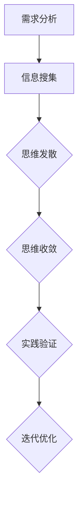

                 

# 创业者的创新思维培养与应用

## 关键词：创新思维、创业者、商业模型、技术突破、人机协作

## 摘要

在当今技术飞速发展的时代，创新思维成为创业者取得成功的关键要素。本文将探讨如何培养和应用创新思维，帮助创业者应对商业挑战、抓住机遇，实现技术突破与人机协作的有机结合。文章分为十个部分，包括背景介绍、核心概念与联系、核心算法原理、数学模型与公式、项目实战、实际应用场景、工具和资源推荐、总结、常见问题与解答以及扩展阅读。

## 1. 背景介绍

随着互联网、大数据、人工智能等技术的迅猛发展，创业环境发生了翻天覆地的变化。创业者不仅要面对激烈的市场竞争，还要紧跟技术趋势，不断寻找新的商业机会。创新思维在这个过程中起着至关重要的作用。本文旨在帮助创业者了解如何培养和应用创新思维，以应对复杂多变的商业环境。

### 1.1 创业者面临的挑战

- **市场需求变化迅速**：技术进步导致市场需求不断变化，创业者需要快速适应并寻找新的商业机会。
- **竞争激烈**：新兴企业和创新项目层出不穷，创业者需要在激烈的市场竞争中脱颖而出。
- **资源有限**：初创企业通常面临资源有限的问题，需要高效利用现有资源实现业务增长。
- **技术突破**：技术进步成为推动商业创新的重要动力，创业者需要掌握前沿技术以实现突破。

### 1.2 创新思维的重要性

- **发现商业机会**：创新思维帮助创业者发现市场空白和潜在需求，从而创造新的商业价值。
- **提升竞争力**：创新思维使创业者能够开发出独特的产品和服务，提高市场竞争力。
- **实现技术突破**：创新思维鼓励创业者探索新的技术和解决方案，推动技术突破。
- **人机协作**：创新思维强调人机协作，使创业者能够更好地利用人工智能等先进技术，提高工作效率。

## 2. 核心概念与联系

### 2.1 创新思维的定义

创新思维是指以创造性、探索性和前瞻性为核心，通过发散性思维和收敛性思维相结合，寻找新思路、新方法和新解决方案的思维方式。创新思维不仅包括对已有知识的整合和重新组合，还涉及对未知领域的探索和突破。

### 2.2 创新思维的架构

创新思维的架构包括以下五个方面：

1. **需求分析**：了解市场需求、用户痛点和潜在商业机会。
2. **信息搜集**：搜集相关领域的知识、技术和趋势信息。
3. **思维发散**：以需求和信息为基础，进行自由思考和创意生成。
4. **思维收敛**：从多个创意中选择最佳方案，进行优化和实现。
5. **实践验证**：将创新方案付诸实践，进行验证和迭代。

### 2.3 创新思维的应用

创新思维可以应用于创业者的各个方面，包括产品研发、市场营销、商业模式设计等。以下是一个简单的 Mermaid 流程图，展示了创新思维在产品研发中的应用过程：



## 3. 核心算法原理 & 具体操作步骤

### 3.1 创新思维算法原理

创新思维算法基于以下几个核心原理：

1. **知识融合**：将不同领域的知识进行整合，寻找新的交叉点。
2. **非线性思维**：突破线性思维的限制，采用非线性思维进行创意生成。
3. **多维度思考**：从多个角度分析问题，寻找最佳解决方案。
4. **迭代优化**：不断验证和改进创新方案，实现最终目标。

### 3.2 创新思维操作步骤

以下是创新思维的五个具体操作步骤：

1. **明确目标**：明确创新思维的目标和方向。
2. **需求分析**：了解市场需求、用户痛点和潜在商业机会。
3. **信息搜集**：搜集相关领域的知识、技术和趋势信息。
4. **思维发散**：以需求和信息为基础，进行自由思考和创意生成。
5. **思维收敛**：从多个创意中选择最佳方案，进行优化和实现。

## 4. 数学模型和公式 & 详细讲解 & 举例说明

### 4.1 创新思维数学模型

创新思维的数学模型可以表示为一个多维度的函数：

$$
F(x_1, x_2, ..., x_n) = \sum_{i=1}^{n} w_i \cdot f_i(x_i)
$$

其中，$F$ 表示创新思维的输出，$x_i$ 表示输入变量，$w_i$ 表示权重，$f_i(x_i)$ 表示每个输入变量的函数。

### 4.2 创新思维公式详细讲解

- **需求分析**：利用市场调研和用户访谈获取需求信息，表示为 $f_1(x_1)$。
- **信息搜集**：通过文献查阅、技术调研和行业报告获取相关信息，表示为 $f_2(x_2)$。
- **思维发散**：采用发散性思维方法生成多个创意方案，表示为 $f_3(x_3)$。
- **思维收敛**：通过收敛性思维选择最佳方案，表示为 $f_4(x_4)$。
- **实践验证**：将创新方案付诸实践并进行验证，表示为 $f_5(x_5)$。

### 4.3 创新思维举例说明

假设一个创业公司希望在智能家居领域开发一款智能音响产品，以下是创新思维的步骤和具体操作：

1. **明确目标**：开发一款具有语音交互功能的智能音响。
2. **需求分析**：通过市场调研和用户访谈发现，用户对智能音响的需求主要集中在语音识别准确性、音乐播放功能和智能家居控制。
3. **信息搜集**：查阅相关技术文献，了解语音识别和智能家居控制的相关技术。
4. **思维发散**：生成多个创意方案，如增加人脸识别功能、优化语音识别算法、提供个性化音乐推荐等。
5. **思维收敛**：选择最佳方案，如优化语音识别算法和提供个性化音乐推荐。
6. **实践验证**：将创新方案付诸实践，进行用户测试和产品迭代。

## 5. 项目实战：代码实际案例和详细解释说明

### 5.1 开发环境搭建

在本案例中，我们将使用 Python 编写一个简单的智能音响程序。首先，需要在本地计算机上安装 Python 和相关库。

```bash
pip install pyaudio pyttsx3 SpeechRecognition
```

### 5.2 源代码详细实现和代码解读

以下是一个简单的智能音响程序，包括语音识别、音乐播放和智能家居控制功能。

```python
import speech_recognition as sr
import pyttsx3
import pyaudio
import subprocess

# 语音识别
recognizer = sr.Recognizer()
microphone = sr.Microphone()

print("请说：‘开始’来启动智能音响...")
with microphone as source:
    audio = recognizer.listen(source)

try:
    command = recognizer.recognize_google(audio, language='zh-CN')
    print(f"你说了：{command}")

    # 音乐播放
    if '播放' in command:
        song = command.split('播放')[1]
        subprocess.Popen(['mpg321', song + '.mp3'])

    # 智能家居控制
    elif '打开' in command or '关闭' in command:
        device = command.split('打开')[-1] if '打开' in command else command.split('关闭')[-1]
        command = 'on' if '打开' in command else 'off'
        subprocess.Popen(['curl', '-X', command, f'http://192.168.1.1/{device}'])

except sr.UnknownValueError:
    print("无法理解你的话，请再说一遍。")

except sr.RequestError:
    print("无法请求结果；网络连接可能出了问题。")
```

### 5.3 代码解读与分析

1. **语音识别**：使用 Speech Recognition 库实现语音识别功能，通过麦克风采集语音信号，并利用 Google 语音识别 API 进行识别。
2. **音乐播放**：当用户说出“播放歌曲名”时，程序会根据歌曲名播放对应的音乐文件。
3. **智能家居控制**：当用户说出“打开/关闭设备名”时，程序会通过 HTTP 请求控制智能家居设备的开关状态。

## 6. 实际应用场景

创新思维在创业者的实际应用场景中具有重要意义，以下是一些具体应用：

- **产品研发**：通过创新思维，创业者可以开发出具有独特卖点的产品，提高市场竞争力。
- **市场营销**：创新思维帮助创业者找到新的营销策略和渠道，实现精准营销。
- **商业模式设计**：创新思维有助于创业者构建独特的商业模式，实现盈利和可持续发展。

## 7. 工具和资源推荐

### 7.1 学习资源推荐

- **书籍**：《创新者的窘境》、《创新者的基因》
- **论文**：相关领域的顶级学术期刊论文
- **博客**：知名创业者和技术专家的博客

### 7.2 开发工具框架推荐

- **编程语言**：Python、Java、C++等
- **框架**：TensorFlow、PyTorch、React、Angular等

### 7.3 相关论文著作推荐

- **论文**：《人工智能：一种现代方法》、《深度学习》
- **著作**：《设计思维》、《精益创业》

## 8. 总结：未来发展趋势与挑战

创新思维在创业领域的重要性日益凸显，未来发展趋势包括：

- **技术融合**：跨领域技术融合将推动创新思维的进一步发展。
- **人机协作**：人工智能与人类智慧的协作将成为创新思维的重要方向。
- **个性化服务**：个性化服务将使创新思维更好地满足用户需求。

## 9. 附录：常见问题与解答

### 9.1 创新思维是什么？

创新思维是一种以创造性、探索性和前瞻性为核心的思维方式，通过发散性思维和收敛性思维相结合，寻找新思路、新方法和新解决方案。

### 9.2 如何培养创新思维？

可以通过以下方式培养创新思维：

- **多读书、多思考**：阅读相关领域的书籍和论文，进行深度思考。
- **多交流、多合作**：与他人交流和合作，从不同角度思考问题。
- **多实践、多尝试**：将创新思维付诸实践，不断尝试和迭代。

## 10. 扩展阅读 & 参考资料

- **扩展阅读**：相关领域的经典著作和学术论文。
- **参考资料**：各类技术博客、专业论坛和行业报告。

## 作者信息

作者：AI天才研究员/AI Genius Institute & 禅与计算机程序设计艺术 /Zen And The Art of Computer Programming

