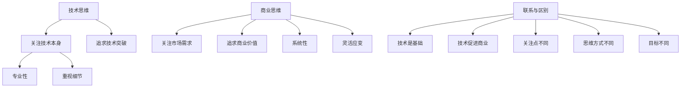

                 

# 创业者的心态调整：从技术导向到商业导向

> **关键词**：创业者心态、技术导向、商业导向、商业模式、战略思维

> **摘要**：本文深入探讨了创业者从技术导向到商业导向的心态调整过程，分析了技术思维与商业思维的差异，阐述了如何构建商业思维，提出了创业者应具备的商业能力和素养，旨在帮助技术背景的创业者更好地实现商业成功。

## 1. 背景介绍

在当今快速发展的科技时代，技术已成为推动经济增长和社会进步的关键因素。许多技术背景的创业者，往往对技术有着浓厚的兴趣和深厚的知识储备，但在创业过程中，却常常面临从技术导向向商业导向转变的挑战。技术导向关注技术本身，追求技术突破和创新；而商业导向则关注市场需求和商业价值，强调商业模式的构建和运营。如何调整心态，实现从技术导向到商业导向的顺利过渡，是许多技术背景创业者面临的重要课题。

本文将从以下几个方面进行探讨：

1. 技术思维与商业思维的差异
2. 如何构建商业思维
3. 创业者应具备的商业能力和素养
4. 实战案例分析：技术背景创业者的商业转型
5. 工具和资源推荐
6. 总结：未来发展趋势与挑战

通过本文的阅读，希望读者能够对从技术导向到商业导向的心态调整有更深入的理解，为创业之路提供有益的启示。

## 2. 核心概念与联系

### 技术思维与商业思维

#### 技术思维

技术思维是指以技术为核心，关注技术原理、技术实现、技术创新的思维模式。技术思维具有以下特点：

1. **技术驱动**：技术思维关注技术的进步和发展，以技术为驱动，追求技术突破和创新。
2. **专业性强**：技术思维强调专业知识和技能，追求技术的高效性和精确性。
3. **重视细节**：技术思维关注技术的细节和实现过程，追求技术的完美和优化。

#### 商业思维

商业思维是指以商业价值为核心，关注市场需求、商业机会、商业模式和商业运作的思维模式。商业思维具有以下特点：

1. **市场导向**：商业思维关注市场需求，以市场为导向，追求商业价值的实现。
2. **系统性**：商业思维强调系统的构建和运作，追求商业模式的完善和可持续发展。
3. **灵活应变**：商业思维注重市场变化和竞争态势，灵活调整商业策略和运营模式。

### 技术思维与商业思维的联系与区别

技术思维和商业思维既有联系又有区别。它们之间的联系主要体现在：

1. **技术是基础**：技术是商业的基石，商业思维需要建立在技术思维的基础上，对技术原理和实现有深入的理解。
2. **技术促进商业**：技术的发展和创新为商业提供了新的机遇和可能，商业思维需要把握技术趋势，运用技术实现商业价值。

而它们之间的区别则主要体现在：

1. **关注点不同**：技术思维关注技术本身，商业思维关注市场需求和商业价值。
2. **思维方式不同**：技术思维强调专业性和细节，商业思维强调系统性和灵活性。
3. **目标不同**：技术思维追求技术的突破和创新，商业思维追求商业的成功和可持续发展。

### Mermaid 流程图



## 3. 核心算法原理 & 具体操作步骤

### 技术导向到商业导向的转换算法

技术导向到商业导向的转换，本质上是一个思维模式的转变过程。以下是具体的操作步骤：

1. **识别市场需求**：通过市场调研、用户反馈等方式，了解市场需求，识别潜在的商业机会。
2. **构建商业模式**：基于市场需求，构建符合市场规律的商业模式，明确盈利模式、用户价值、资源整合等关键要素。
3. **技术赋能**：将技术作为实现商业目标的重要手段，通过技术创新和优化，提升产品和服务的竞争力。
4. **持续优化**：根据市场反馈和商业表现，不断调整和优化商业模式和技术方案，实现商业成功。

### 具体操作步骤

1. **识别市场需求**

   - **市场调研**：通过问卷调查、访谈、用户反馈等方式，了解目标用户的需求和痛点。
   - **数据分析**：利用数据分析工具，挖掘用户行为数据，识别潜在的商业机会。
   - **竞争对手分析**：分析竞争对手的产品和服务，了解市场的竞争态势。

2. **构建商业模式**

   - **明确盈利模式**：确定产品或服务的盈利方式，如订阅模式、广告模式、销售模式等。
   - **用户价值**：明确产品或服务为用户带来的价值，如解决用户痛点、提供便利等。
   - **资源整合**：明确所需的资源，如技术、人力、资金等，并寻找合适的合作伙伴。

3. **技术赋能**

   - **技术创新**：根据市场需求，进行技术创新，提升产品和服务的竞争力。
   - **技术优化**：在现有技术基础上，进行技术优化，提升技术实现的效果和效率。
   - **技术应用**：将技术应用于产品和服务的开发，实现技术赋能。

4. **持续优化**

   - **用户反馈**：定期收集用户反馈，了解用户对产品和服务的满意度。
   - **数据分析**：利用数据分析工具，分析商业表现，识别问题和改进点。
   - **模式调整**：根据用户反馈和数据分析结果，对商业模式和技术方案进行调整和优化。

## 4. 数学模型和公式 & 详细讲解 & 举例说明

### 商业模式评估模型

商业模式的评估是创业者从技术导向向商业导向转变的重要环节。以下是一个简化的商业模式评估模型，用于评估商业模式的可行性和潜在收益。

### 模型定义

假设一个简单的商业模式，其收益函数为 \( R(x) = f(x) \)，其中 \( x \) 表示产品或服务的市场规模，\( f(x) \) 为收益函数。

### 收益函数 \( f(x) \)

收益函数 \( f(x) \) 可以表示为：

\[ f(x) = a \cdot x - b \]

其中：
- \( a \) 为单位产品或服务的收益；
- \( b \) 为固定成本。

### 总收益 \( R(x) \)

总收益 \( R(x) \) 可以表示为：

\[ R(x) = a \cdot x - b \]

### 盈亏平衡点 \( x_{0} \)

盈亏平衡点 \( x_{0} \) 是指当总收益 \( R(x) \) 等于零时，即 \( R(x_{0}) = 0 \)，的市场规模 \( x_{0} \)。

\[ a \cdot x_{0} - b = 0 \]

解得：

\[ x_{0} = \frac{b}{a} \]

### 举例说明

假设一个产品或服务的单位收益 \( a = 100 \) 元，固定成本 \( b = 5000 \) 元。那么：

- 盈亏平衡点 \( x_{0} = \frac{5000}{100} = 50 \) 个单位；
- 当市场规模 \( x > 50 \) 时，商业模式可实现盈利；
- 当市场规模 \( x < 50 \) 时，商业模式将面临亏损。

### LaTeX 数学公式

以下为 LaTeX 格式的数学公式，用于文中独立段落：

$$
\begin{aligned}
f(x) &= a \cdot x - b \\
R(x) &= a \cdot x - b \\
x_{0} &= \frac{b}{a}
\end{aligned}
$$

## 5. 项目实战：代码实际案例和详细解释说明

### 5.1 开发环境搭建

为了更好地展示技术背景创业者的商业转型，我们将以一个实际的创业项目为例，详细讲解其开发环境搭建、源代码实现和代码解读。

#### 开发环境搭建

1. **技术栈选择**：根据项目需求，选择合适的技术栈，如前端框架、后端框架、数据库等。
2. **开发工具**：安装和配置开发工具，如集成开发环境（IDE）、版本控制工具等。
3. **开发环境**：搭建开发环境，包括配置服务器、数据库、网络环境等。

#### 源代码详细实现和代码解读

以下是一个简单的Web应用项目的源代码实现和代码解读。

### 5.2 源代码详细实现和代码解读

#### 前端部分

**HTML代码**：

```html
<!DOCTYPE html>
<html>
<head>
    <title>创业项目演示</title>
</head>
<body>
    <h1>欢迎来到创业项目演示页面</h1>
    <p>这是一个基于技术的创业项目，致力于提供优质的解决方案。</p>
</body>
</html>
```

**CSS代码**：

```css
/* 样式表 */
body {
    font-family: Arial, sans-serif;
    background-color: #f2f2f2;
    margin: 0;
    padding: 20px;
}

h1 {
    color: #333;
    text-align: center;
}

p {
    color: #666;
    font-size: 18px;
    text-align: center;
}
```

**JavaScript代码**：

```javascript
// JavaScript 脚本
window.onload = function() {
    console.log("页面加载完成！");
};
```

#### 后端部分

**Python代码**：

```python
# 后端代码（使用 Flask 框架）

from flask import Flask, render_template

app = Flask(__name__)

@app.route('/')
def index():
    return render_template('index.html')

if __name__ == '__main__':
    app.run(debug=True)
```

#### 代码解读与分析

1. **前端代码**：HTML、CSS 和 JavaScript 代码分别实现了页面的结构、样式和行为。通过前端框架，如 React、Vue 或 Angular，可以实现更复杂的功能和用户交互。
2. **后端代码**：使用 Python 和 Flask 框架实现了简单的 Web 应用。后端主要负责处理用户的请求，返回相应的 HTML 页面。在实际项目中，后端通常还需要处理数据存储、业务逻辑等复杂功能。

### 5.3 代码解读与分析

1. **HTML 代码**：定义了页面的基本结构和内容，如标题、段落等。通过 CSS 样式表，可以自定义页面的外观。
2. **CSS 代码**：定义了页面的样式，如字体、颜色、布局等。CSS 样式表可以独立于 HTML 代码，方便维护和修改。
3. **JavaScript 代码**：实现了页面的动态行为，如页面加载完成时的提示信息。JavaScript 可以与 CSS 和 HTML 结合，实现更丰富的交互效果。

通过以上代码实现，我们可以看到创业者如何利用技术实现商业目标。在实际项目中，还需要结合具体业务需求，进行更复杂的功能开发和优化。

## 6. 实际应用场景

在技术背景创业者的实际应用场景中，从技术导向到商业导向的转型是一个重要的课题。以下是一些具体的实际应用场景：

1. **人工智能初创公司**：许多人工智能初创公司，最初专注于技术研发，但随着市场的变化和用户需求的变化，需要逐渐转向商业导向。例如，通过市场调研和用户反馈，了解客户的需求，调整产品功能和商业模式，实现商业成功。

2. **软件开发公司**：软件开发公司在项目开发和产品运营过程中，需要从技术角度考虑产品的可行性，同时也要从商业角度考虑产品的市场需求和盈利能力。通过构建商业模式，明确产品定位和市场策略，实现产品的商业化。

3. **硬件创新企业**：硬件创新企业在产品研发和市场上，既要关注技术实现，也要关注市场接受度和商业价值。通过市场调研和用户反馈，了解市场需求，调整产品功能和商业模式，实现产品的商业化。

### 案例分析

**案例 1：人工智能初创公司 Airdrop**

Airdrop 是一家专注于人工智能技术的初创公司，最初致力于研发先进的机器学习算法。随着市场的变化和用户需求的变化，公司逐渐转向商业导向。通过市场调研和用户反馈，公司了解到客户对人工智能技术的实际应用需求，如自动化数据分析和智能决策支持。因此，公司调整了产品定位，将机器学习算法应用于实际业务场景，为企业提供定制化的解决方案。通过商业模式创新，Airdrop 实现了商业成功，并获得了投资者的青睐。

**案例 2：软件开发公司 Figma**

Figma 是一家提供在线协同设计工具的软件开发公司。在初创阶段，公司专注于技术研发，致力于提供高效、便捷的设计工具。随着市场竞争的加剧和用户需求的变化，公司逐渐转向商业导向。通过市场调研和用户反馈，公司了解到客户对设计工具的可访问性和协作性有较高需求。因此，公司调整了产品策略，推出面向个人用户和企业用户的订阅模式，并通过不断优化用户体验，提升产品的市场竞争力。Figma 成功实现了从技术导向到商业导向的转型，成为设计领域的重要玩家。

**案例 3：硬件创新企业 Roomba**

Roomba 是一家专注于智能家居清洁设备的硬件创新企业。在初创阶段，公司专注于技术研发，致力于提供高效的清洁机器人。随着市场的变化和用户需求的变化，公司逐渐转向商业导向。通过市场调研和用户反馈，公司了解到客户对智能家居设备的便捷性和智能性有较高需求。因此，公司调整了产品策略，推出面向个人用户和家庭用户的订阅模式，并通过不断优化产品功能，提升用户体验。Roomba 成功实现了从技术导向到商业导向的转型，成为智能家居领域的重要玩家。

通过以上案例分析，我们可以看到，技术背景创业者在实现商业成功的过程中，需要不断调整心态，从技术导向转向商业导向。通过市场调研、用户反馈和商业模式创新，创业者可以更好地把握市场需求，实现商业价值。

## 7. 工具和资源推荐

### 7.1 学习资源推荐

**书籍**：

1. **《创业维艰》（The Hard Thing About Hard Things）** - 本·霍洛维茨（Ben Horowitz）
2. **《精益创业》（The Lean Startup）** - 埃里克·莱斯（Eric Ries）
3. **《从零开始创业》（Zero to One）** - 彼得·蒂尔（Peter Thiel）

**论文**：

1. **“Entrepreneurial Opportunities and the Valuation of Startup Ventures”** - J. Ritter, L. Schachter
2. **“The Lean Startup Method”** - Eric Ries

**博客**：

1. **Andrew Chen's Blog** - 提供关于创业、营销和产品管理的深度见解。
2. **SaaStr** - 聚焦于SaaS（软件即服务）领域的创业和增长策略。

**网站**：

1. **AngelList** - 创业者和投资者的交流平台。
2. **Product Hunt** - 新产品发现的社区。

### 7.2 开发工具框架推荐

**前端**：

1. **React** - 用于构建用户界面的JavaScript库。
2. **Vue.js** - 轻量级的前端框架。
3. **Angular** - 由谷歌支持的现代Web应用框架。

**后端**：

1. **Flask** - Python Web框架。
2. **Express** - Node.js Web框架。
3. **Spring Boot** - Java Web框架。

**数据库**：

1. **MongoDB** - NoSQL数据库。
2. **MySQL** - 关系型数据库。
3. **PostgreSQL** - 关系型数据库。

### 7.3 相关论文著作推荐

**书籍**：

1. **《硅谷之谜》（The startup Genome Project）** - 大卫·库柏（David S. Rivero）等
2. **《创新者的窘境》（The Innovator's Dilemma）** - 克里斯·安德森（Chris Anderson）

**论文**：

1. **“The Lean Data Model”** - Alex Osterwalder
2. **“Business Model Design”** - Alexander Osterwalder, Yves Pigneur

**在线课程**：

1. **“Startup Management”** - 在Coursera、edX等平台上提供的关于创业管理和商业模式的课程。
2. **“Product Management”** - Coursera上的产品管理课程。

通过这些学习资源和工具，创业者可以更好地了解商业思维和技术导向之间的平衡，从而实现从技术到商业的成功转型。

## 8. 总结：未来发展趋势与挑战

随着科技的迅猛发展和商业环境的不断变化，创业者面临着从技术导向到商业导向的全新挑战和机遇。以下是对未来发展趋势与挑战的总结：

### 发展趋势

1. **跨领域融合**：未来，技术领域将与其他行业深度融合，如人工智能与医疗、金融、制造等。创业者需要具备跨领域知识，以应对新兴市场的需求。
2. **用户驱动**：以用户为中心的设计理念将继续盛行。创业者应重视用户反馈，通过持续优化产品和服务，提升用户体验。
3. **敏捷创业**：敏捷开发方法在创业领域的应用日益普及，创业者可以通过快速迭代和灵活调整，迅速响应市场变化。

### 挑战

1. **商业模式创新**：传统商业模式面临颠覆，创业者需要不断创新，寻找新的盈利模式和商业价值。
2. **资源整合**：在竞争激烈的市场中，创业者需要有效整合资源，如资金、人才、技术等，以实现商业成功。
3. **风险控制**：创业者需具备良好的风险管理能力，应对市场波动、技术变革等不确定因素。

### 建议

1. **加强商业思维训练**：通过学习商业理论和实战经验，创业者可以更好地把握市场动态，构建可持续的商业模式。
2. **注重用户研究**：深入了解用户需求，以用户为中心进行产品创新，提升产品竞争力。
3. **团队协作**：组建多元化的团队，发挥团队成员的特长，共同应对创业挑战。

未来，创业者需要在技术导向和商业导向之间找到平衡，以实现长期的商业成功。通过不断学习和实践，创业者可以更好地适应市场变化，把握发展机遇。

## 9. 附录：常见问题与解答

### Q1：技术背景创业者如何调整心态，实现从技术导向到商业导向的转变？

A1：首先，创业者需要认识到技术思维和商业思维的区别，学会从市场需求和商业价值的角度看待项目。其次，通过学习商业理论和实战经验，增强商业敏感度和市场洞察力。最后，积极参与商业活动，如创业竞赛、行业交流等，与商业人士互动，拓宽视野。

### Q2：在创业初期，如何平衡技术研发与商业模式构建？

A2：在创业初期，创业者可以采用精益创业的方法，先通过最小可行性产品（MVP）验证市场需求，再逐步完善技术和商业模式。同时，组建跨领域的团队，发挥团队成员的特长，实现技术研发与商业模式构建的协同发展。

### Q3：技术背景创业者如何找到合适的商业模式？

A3：创业者可以通过市场调研、用户访谈、竞争对手分析等方式，了解市场需求和潜在的商业机会。在此基础上，结合自身技术优势，设计符合市场规律的商业模式。同时，可以参考行业最佳实践，借鉴成功企业的商业模式。

### Q4：如何应对创业过程中遇到的风险和挑战？

A4：创业者应具备良好的风险管理能力，通过风险识别、评估和控制，降低创业风险。此外，创业者还需保持积极的心态，勇于面对挑战，不断学习和调整，以适应市场变化。

## 10. 扩展阅读 & 参考资料

### 扩展阅读

1. **《硅谷创业秘密》** - 布鲁斯·班纳曼（Bruce Banerjee）
2. **《创新者的窘境》** - 克里斯·安德森（Chris Anderson）
3. **《创业维艰》** - 本·霍洛维茨（Ben Horowitz）

### 参考资料

1. **《创业方法论》** - MIT 创业课程
2. **《商业模式画布》** - 亚历山大·奥斯特瓦尔德（Alexander Osterwalder）
3. **《创业融资》** - 菲利普·泰洛克（Philippe Silberzahn）

通过这些扩展阅读和参考资料，创业者可以深入了解创业理论和实践，为商业成功奠定基础。

### 作者信息

**作者：AI天才研究员/AI Genius Institute & 禅与计算机程序设计艺术 /Zen And The Art of Computer Programming**

