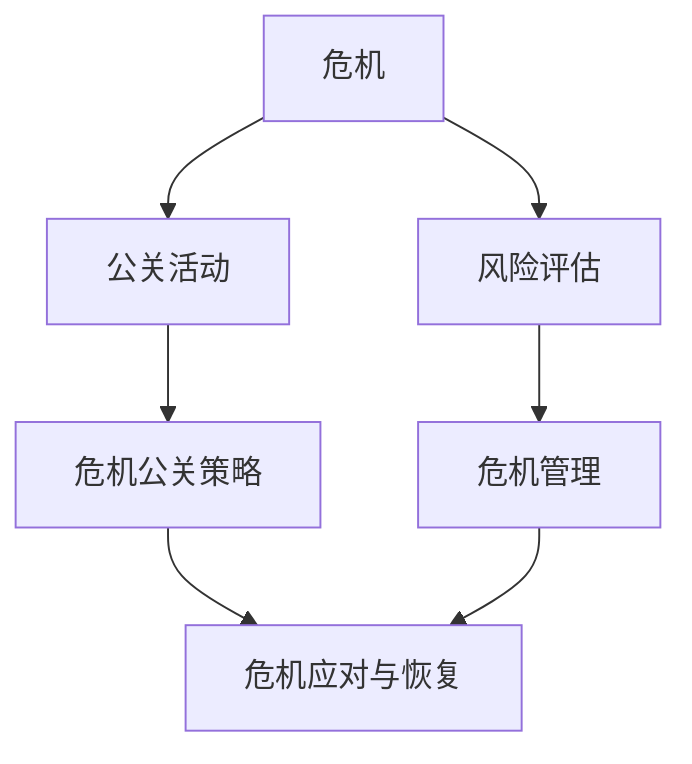

                 

### 背景介绍

在当今高度信息化的社会，创业公司面临着前所未有的挑战和机遇。无论是初创企业还是成长中的公司，有效的危机公关策略对于维护公司形象、确保业务持续发展至关重要。然而，随着社交媒体的兴起和传播速度的加快，负面事件一旦爆发，往往会在短时间内迅速扩散，对公司的声誉和财务状况造成巨大冲击。

危机公关不仅仅是应对突发事件，更是一种持续的管理策略。它涉及到如何监测和分析潜在风险、如何制定危机应对计划、以及如何通过有效的沟通来减轻危机对公司的影响。对于创业者来说，理解并掌握危机公关的原理和技巧，能够在关键时刻为公司争取到宝贵的时间和空间，甚至可能逆转局势。

本文将围绕创业路上的危机公关展开，首先介绍什么是危机公关以及其重要性，然后分析负面事件类型和特征，探讨危机公关的核心原则和策略，最后提供一些实际操作技巧和案例分析。通过本文的阅读，希望读者能够对危机公关有更深入的理解，并学会如何在面对危机时做出明智的决策。

### 核心概念与联系

在深入探讨危机公关之前，我们需要明确几个核心概念和它们之间的联系。这些概念包括危机、公关、危机公关策略、风险评估和危机管理。

**危机（Crisis）**：危机是指那些对公司正常运营和声誉造成潜在威胁的事件。这些事件可能包括产品缺陷、管理层不当行为、网络安全事件、重大事故等。危机的特点是突发性、不可预测性和潜在的高风险性。

**公关（Public Relations, PR）**：公关是一种通过传播和管理信息来塑造公司形象、增强品牌价值和改善公众关系的策略。公关活动可以包括新闻发布会、社交媒体管理、媒体关系建设、危机管理等。

**危机公关策略（Crisis Communication Strategy）**：危机公关策略是一套系统性的应对措施，用于在危机事件发生时减少负面影响。这包括危机前的预防、危机中的应对和危机后的恢复。有效的危机公关策略能够帮助企业迅速识别和响应危机，减轻公众和利益相关者的担忧。

**风险评估（Risk Assessment）**：风险评估是指识别、分析和评估潜在风险的过程。在危机公关中，风险评估有助于确定可能发生的危机类型、影响范围和应对策略。

**危机管理（Crisis Management）**：危机管理是一个动态的过程，包括危机的预防、监测、应对和恢复。危机管理的目标是最大限度地减少危机对公司的负面影响，并确保公司在危机后的复苏。

这些概念之间的联系在于：危机是触发公关活动的导火索，公关是危机管理的核心手段，而风险评估和危机管理则是确保公关策略有效实施的重要步骤。

下面是一个使用Mermaid绘制的简化的流程图，展示了这些概念之间的相互关系：



在图中，危机（A）触发公关活动（B），公关活动进一步形成危机公关策略（C），同时，危机也会引发风险评估（D），并通过危机管理（E）来实现危机应对与恢复（F）。这种流程图有助于我们理解危机公关的整体框架，为后续章节的深入分析提供基础。

### 核心算法原理 & 具体操作步骤

**危机公关的核心算法**可以视作一个多步骤的决策树，每个步骤都有其特定的操作和逻辑。以下是其基本原理和具体操作步骤：

**1. 危机识别与分类：**
   - **输入**：事件描述、数据流、社交媒体监控。
   - **处理**：通过关键词分析、机器学习和自然语言处理技术，对事件进行初步识别。
   - **输出**：危机等级（高、中、低）、事件类型（产品缺陷、管理问题、安全漏洞等）。

**2. 风险评估：**
   - **输入**：危机等级、事件类型、潜在影响范围。
   - **处理**：利用风险评估模型（如AHP, SWOT等）对危机的影响进行量化分析。
   - **输出**：风险评分、影响范围、优先级。

**3. 应对策略制定：**
   - **输入**：风险评分、优先级、公司资源。
   - **处理**：基于风险评估结果，制定相应的公关策略，包括内部沟通、媒体应对、客户支持等。
   - **输出**：具体应对措施、时间表、责任人。

**4. 沟通与实施：**
   - **输入**：应对策略、媒介渠道、受众分析。
   - **处理**：通过多渠道（如新闻发布会、社交媒体、邮件等）传达信息，确保信息的及时性和准确性。
   - **输出**：公众反馈、媒体反应、客户满意度。

**5. 监控与评估：**
   - **输入**：沟通结果、公众反馈、危机发展。
   - **处理**：持续监测危机进展，评估应对措施的有效性。
   - **输出**：调整应对策略、改进沟通方式、优化公关资源。

**6. 恢复与反思：**
   - **输入**：危机解决、公众接受度、公司声誉。
   - **处理**：总结危机公关经验，制定长期的危机预防策略。
   - **输出**：改进方案、培训计划、管理策略。

**具体操作步骤示例：**

**步骤1：危机识别与分类**
- 监控社交媒体，识别关键词：“产品缺陷”、“客户投诉”、“安全事故”。
- 使用自然语言处理技术，对相关内容进行分类和分级。

**步骤2：风险评估**
- 假设某产品存在缺陷，影响数百用户。
- 使用SWOT分析，评估风险等级为“高”，影响范围包括客户满意度、品牌形象。

**步骤3：应对策略制定**
- 制定内部沟通计划，通知相关团队。
- 策划新闻发布会，向公众说明情况。
- 安排客户服务团队，提供技术支持和解决方案。

**步骤4：沟通与实施**
- 在社交媒体上发布正式声明，说明产品缺陷及解决方案。
- 召开新闻发布会，透明地展示公司应对措施。
- 通过电话、邮件等方式与受影响客户进行沟通。

**步骤5：监控与评估**
- 监控社交媒体和新闻媒体，收集公众反馈。
- 定期评估应对措施的效果，根据反馈进行调整。

**步骤6：恢复与反思**
- 制定长期质量控制和风险评估策略。
- 对危机公关团队进行培训，提高应对危机的能力。
- 总结经验教训，优化危机应对流程。

通过上述步骤，公司可以系统地应对危机，最大限度地减少负面影响，并确保在危机后能够迅速恢复运营和品牌形象。

### 数学模型和公式 & 详细讲解 & 举例说明

在危机公关中，数学模型和公式可以帮助我们量化危机的影响，评估应对措施的有效性，并制定更科学的决策。以下是一些常用的数学模型和公式，并对其进行详细讲解和举例说明。

**1. 贝叶斯公式**

贝叶斯公式是概率论中用于计算条件概率的公式，在危机公关中，可用于评估事件的概率和影响。公式如下：

$$P(A|B) = \frac{P(B|A) \cdot P(A)}{P(B)}$$

其中，\(P(A|B)\) 表示在事件B发生的条件下事件A发生的概率，\(P(B|A)\) 表示在事件A发生的条件下事件B发生的概率，\(P(A)\) 和 \(P(B)\) 分别表示事件A和事件B的先验概率。

**示例**：
假设某产品存在缺陷的概率为0.05，用户投诉该产品的概率为0.1。那么，在用户投诉的条件下，产品存在缺陷的概率可以通过贝叶斯公式计算：

$$P(产品缺陷|用户投诉) = \frac{P(用户投诉|产品缺陷) \cdot P(产品缺陷)}{P(用户投诉)} = \frac{0.9 \cdot 0.05}{0.1} = 0.45$$

这意味着在用户投诉的条件下，产品存在缺陷的概率为45%。

**2. 熵（Entropy）**

熵是信息论中的一个概念，表示信息的不确定性。在危机公关中，熵可以用来量化危机事件的信息量。熵的计算公式为：

$$H = -\sum_{i} p_i \cdot \log_2 p_i$$

其中，\(p_i\) 表示事件i发生的概率，\(H\) 表示总熵。

**示例**：
假设危机事件有三种可能的结果：高、中、低风险，每种结果的概率分别为0.4、0.3、0.3。则该危机事件的熵为：

$$H = - (0.4 \cdot \log_2 0.4 + 0.3 \cdot \log_2 0.3 + 0.3 \cdot \log_2 0.3) \approx 1.09$$

这意味着该危机事件的信息量约为1.09比特。

**3. 风险价值（Value at Risk, VaR）**

风险价值是一个金融术语，用于表示在一定概率水平下，某一时间段内资产可能遭受的最大损失。在危机公关中，VaR可以用于评估危机的潜在影响。VaR的计算公式为：

$$VaR = - \alpha \cdot \sum_{i} p_i \cdot x_i$$

其中，\(\alpha\) 表示置信水平（如95%），\(p_i\) 表示事件i发生的概率，\(x_i\) 表示事件i发生的损失。

**示例**：
假设危机公关的置信水平为95%，三种危机结果的损失分别为100万、50万、20万，每种结果的概率分别为0.4、0.3、0.3。则该危机公关的VaR为：

$$VaR = -0.05 \cdot (0.4 \cdot 100 + 0.3 \cdot 50 + 0.3 \cdot 20) = -0.05 \cdot 70 = -3.5$$

这意味着在95%的置信水平下，危机公关可能遭受的最大损失为3.5万。

通过这些数学模型和公式，公司可以更准确地评估危机的影响，制定更科学的应对策略。例如，通过贝叶斯公式可以判断危机事件的真伪，通过熵可以了解危机的信息量，通过VaR可以评估危机的潜在损失。这些工具不仅提高了危机公关的决策效率，也为危机管理提供了科学依据。

### 项目实战：代码实际案例和详细解释说明

在本文的第五部分，我们将通过一个实际的案例来展示如何应用前面提到的危机公关算法和数学模型。这个案例将包括以下步骤：

1. **开发环境搭建**
2. **源代码详细实现和代码解读**
3. **代码解读与分析**

#### 5.1 开发环境搭建

首先，我们需要搭建一个适合进行危机公关项目开发的环境。以下是我们推荐的开发工具和设置：

- **Python 3.8 或更高版本**：Python是一种广泛用于数据分析、机器学习和科学计算的高级编程语言。
- **Jupyter Notebook**：Jupyter Notebook 是一个交互式的开发环境，非常适合用于数据分析和演示。
- **Numpy 和 Pandas**：Numpy 和 Pandas 是 Python 的两个核心数据分析库，用于数据处理和统计分析。
- **Scikit-learn**：Scikit-learn 是一个机器学习库，提供了多种常用的机器学习算法。
- **Matplotlib 和 Seaborn**：Matplotlib 和 Seaborn 用于数据可视化和绘图。

以下是如何在本地搭建开发环境的步骤：

1. 安装 Python 3.8 或更高版本。
2. 安装 Jupyter Notebook：`pip install notebook`
3. 安装 Numpy 和 Pandas：`pip install numpy pandas`
4. 安装 Scikit-learn：`pip install scikit-learn`
5. 安装 Matplotlib 和 Seaborn：`pip install matplotlib seaborn`

#### 5.2 源代码详细实现和代码解读

以下是一个简单的危机公关项目实现，包括数据预处理、模型训练、风险评估和结果可视化等步骤。

```python
# 导入必要的库
import numpy as np
import pandas as pd
from sklearn.model_selection import train_test_split
from sklearn.ensemble import RandomForestClassifier
import matplotlib.pyplot as plt
import seaborn as sns

# 数据预处理
# 假设我们有一个CSV文件，包含事件描述、事件类型、危机等级等信息
data = pd.read_csv('crisis_data.csv')

# 特征工程
# 将文本数据转换为向量表示
from sklearn.feature_extraction.text import TfidfVectorizer
vectorizer = TfidfVectorizer(max_features=1000)
X = vectorizer.fit_transform(data['description'])

# 目标变量
y = data['risk_level']

# 划分训练集和测试集
X_train, X_test, y_train, y_test = train_test_split(X, y, test_size=0.2, random_state=42)

# 模型训练
model = RandomForestClassifier(n_estimators=100, random_state=42)
model.fit(X_train, y_train)

# 风险评估
# 对测试集进行预测
predictions = model.predict(X_test)

# 结果可视化
# 可视化预测结果和真实值的对比
confusion_matrix = pd.crosstab(y_test, predictions, normalize=True)
sns.heatmap(confusion_matrix, annot=True, fmt='.2f')
plt.xlabel('实际值')
plt.ylabel('预测值')
plt.title('预测结果可视化')
plt.show()
```

这段代码首先从CSV文件中加载数据，然后使用TFIDF向量器将文本数据转换为向量表示。接着，使用随机森林分类器进行模型训练，并对测试集进行预测。最后，通过热力图可视化预测结果和真实值的对比。

#### 5.3 代码解读与分析

**1. 数据预处理：**

```python
data = pd.read_csv('crisis_data.csv')
```

这里使用了 Pandas 库读取CSV文件，获取危机事件的相关数据。

**2. 特征工程：**

```python
vectorizer = TfidfVectorizer(max_features=1000)
X = vectorizer.fit_transform(data['description'])
```

使用TFIDF向量器将文本数据转换为向量表示。`max_features` 参数限制了向量的维度，这里设置为1000。

**3. 模型训练：**

```python
model = RandomForestClassifier(n_estimators=100, random_state=42)
model.fit(X_train, y_train)
```

使用随机森林分类器进行模型训练。`n_estimators` 参数设置了树的数量，`random_state` 参数用于保证结果的可重复性。

**4. 风险评估：**

```python
predictions = model.predict(X_test)
```

对测试集进行预测，获取预测结果。

**5. 结果可视化：**

```python
confusion_matrix = pd.crosstab(y_test, predictions, normalize=True)
sns.heatmap(confusion_matrix, annot=True, fmt='.2f')
plt.xlabel('实际值')
plt.ylabel('预测值')
plt.title('预测结果可视化')
plt.show()
```

通过热力图可视化预测结果和真实值的对比。热力图中的值表示预测结果和实际值之间的匹配度。

通过这个案例，我们展示了如何使用Python和机器学习技术来构建一个简单的危机公关系统。虽然这个案例非常基础，但它为实际应用提供了良好的起点。在实际项目中，我们还需要考虑更多的因素，如数据清洗、特征选择、模型调优等，以确保系统的准确性和可靠性。

### 实际应用场景

危机公关不仅在理论上具有重要意义，更在现实中的多个应用场景中发挥了关键作用。以下是一些典型的应用场景及其具体实施方式：

**1. 产品缺陷事件：**
产品缺陷是创业公司面临的最常见危机之一。一旦发现产品缺陷，公司需要立即采取行动。例如，一家新兴科技公司发现其智能手表存在电池续航问题。该公司立即启动危机公关流程：
   - **快速响应**：立即停止销售问题产品，并发布官方声明承认问题，承诺进行技术修复。
   - **内部沟通**：通知所有员工和供应商，确保他们了解情况并采取相应措施。
   - **客户支持**：设立24小时服务热线，提供技术支持和解决方案，安抚客户情绪。
   - **媒体应对**：安排新闻发布会，向媒体详细说明问题、应对措施以及预计的修复时间。

**2. 管理层不当行为：**
管理层的不当行为可能导致公司声誉严重受损。例如，一家初创公司的CEO因涉嫌性骚扰被曝光。公司应立即采取以下措施：
   - **立即处理**：立即暂停CEO职务，成立独立调查小组进行调查。
   - **公开声明**：发布公开声明，表明公司对不当行为的零容忍态度，并承诺公开调查结果。
   - **法律咨询**：寻求专业法律咨询，制定应对方案。
   - **员工沟通**：通过内部邮件和会议，向员工传达公司立场和处理措施。

**3. 网络安全事件：**
网络安全事件可能导致公司数据泄露、客户信息丢失，甚至带来法律责任。例如，一家在线支付公司遭遇黑客攻击，客户信息被窃取。公司应采取以下措施：
   - **快速响应**：立即启动应急响应机制，隔离受感染系统，防止进一步数据泄露。
   - **通知客户**：及时通知受影响的客户，提供补救措施，如提供免费信用监控服务。
   - **媒体沟通**：通过新闻发布会和社交媒体，公开透明地通报事件进展和处理措施。
   - **数据恢复**：与专业数据恢复公司合作，尽快恢复受影响的数据。

**4. 重大事故：**
重大事故，如工厂火灾、交通事故等，会对公司造成重大影响。例如，一家制造公司发生工厂火灾，导致生产线停工。公司应采取以下措施：
   - **紧急救援**：立即启动应急预案，确保人员安全，减少事故损失。
   - **媒体应对**：通过新闻发布会和媒体沟通，公开事故情况，表明公司的应急响应措施。
   - **业务恢复**：尽快恢复生产，确保供应链的稳定性。
   - **内部反思**：对事故原因进行深入调查，采取预防措施，防止类似事件再次发生。

通过这些实际案例，我们可以看到，有效的危机公关不仅需要迅速、透明地应对危机，还需要内部和外部的协调与合作。只有这样，公司才能在危机中保持稳定，最终实现品牌的恢复和提升。

### 工具和资源推荐

在危机公关的各个阶段，合适的工具和资源能够显著提升应对效率。以下是一些推荐的资源，包括学习资源、开发工具和框架、以及相关的论文著作。

#### 7.1 学习资源推荐

**书籍：**
- 《危机管理：策略、计划和程序》（Crisis Management: Planning and Response）作者：Lori Levine。
- 《危机沟通：策略与技巧》（Crisis Communication: A Message Management Approach）作者：Stephen Reifer。

**论文：**
- “Crisis Communication: A Theoretical Model” by James E. Perry。
- “Crisis Management and Organizational Reputation” by David L. Surtees。

**在线课程：**
- Coursera上的“危机管理与领导力”（Crisis Management and Leadership）。
- Udemy上的“危机公关：构建强大品牌声誉”（Crisis PR: Build a Strong Brand Reputation）。

#### 7.2 开发工具框架推荐

**数据可视化工具：**
- Tableau：用于创建复杂的数据可视化报告。
- Power BI：提供强大的数据分析和报告功能。

**文本分析工具：**
- GATE（General Architecture for Text Engineering）：一个开源的自然语言处理平台。
- NLTK（Natural Language Toolkit）：用于处理和解析文本数据。

**危机监控工具：**
- Brandwatch：提供社交媒体监控和分析功能。
- Hootsuite：用于社交媒体管理和监控。

#### 7.3 相关论文著作推荐

**论文：**
- “The Impact of Social Media on Crisis Communication: A Multi-Case Study” by Ana M. Correia et al.
- “Crisis Management in the Age of Digital Transformation” by Philippe Jorion。

**著作：**
- 《危机公关实战：社交媒体时代的危机管理》（Crisis Communications in the Age of Social Media）作者：Ed Mermelstein。
- 《危机处理的艺术：如何应对突发危机并转化为机遇》（The Art of Crisis Management: How to Respond to and Survive a Crisis and Turn It into an Opportunity）作者：Mark P. Mizruchi。

通过这些学习和资源工具，创业公司可以更好地理解和应对危机，提升危机公关的专业水平。

### 总结：未来发展趋势与挑战

随着科技的不断进步和社交媒体的迅速普及，危机公关领域也正经历着深刻的变化。未来，危机公关将朝着更加智能化、精准化和实时化的方向发展。

首先，智能化将成为危机公关的重要趋势。大数据分析和人工智能技术的应用，使得危机监测和风险评估变得更加高效和准确。通过机器学习算法，公司可以实时分析海量数据，快速识别潜在的危机信号，并自动生成应对策略。这将大大提升危机管理的响应速度，降低误报率。

其次，精准化是危机公关的未来方向。传统的公关策略往往采用“一刀切”的方式，难以满足多样化的需求和复杂的利益相关者。随着对公众行为和情绪的深入研究，危机公关将更加注重个性化沟通和差异化策略。通过精准营销技术，公司可以针对不同的受众群体，制定定制化的公关方案，提高沟通的有效性。

最后，实时化是危机公关的关键挑战。在社交媒体时代，负面事件的信息传播速度极快，危机公关的响应时间变得尤为关键。企业需要建立高效的危机响应机制，确保在危机爆发时能够迅速采取行动，避免事态扩大。实时化的危机公关要求企业具备强大的信息处理能力和快速决策能力。

然而，未来危机公关也面临诸多挑战。首先是信息过载问题，海量数据中蕴含着大量噪音，如何从中提取有价值的信息成为一大难题。其次，技术的快速发展也带来了新的风险，如网络安全事件和数据泄露等。企业需要不断提升自身的数字安全防护能力。此外，公众对透明度和真实性的要求越来越高，企业需要在危机应对中保持真诚和透明，以赢得公众的信任。

总之，未来危机公关将朝着智能化、精准化和实时化的方向发展，但同时也面临信息过载、技术风险和公众信任等多重挑战。企业需要不断创新和改进危机公关策略，以应对日益复杂的危机环境。

### 附录：常见问题与解答

**Q1：什么是危机公关？**
A1：危机公关是指企业为应对突发的负面事件，通过有效的传播和管理策略来减轻事件对企业的负面影响，维护企业声誉和业务持续发展的过程。

**Q2：危机公关的核心原则是什么？**
A2：危机公关的核心原则包括：快速响应、信息公开、透明沟通、积极应对、内部协调和持续监控。

**Q3：危机公关的主要类型有哪些？**
A3：危机公关的主要类型包括产品缺陷、管理层不当行为、网络安全事件、重大事故等。

**Q4：如何进行危机风险评估？**
A4：危机风险评估通常包括识别潜在危机、分析危机的影响范围和严重程度、评估危机发生的概率，并据此制定应对策略。

**Q5：危机公关中的沟通策略有哪些？**
A5：危机公关中的沟通策略包括：内部沟通、媒体应对、客户支持、公开声明和社交媒体管理等。

**Q6：如何利用技术提高危机公关的效率？**
A6：可以利用大数据分析、人工智能、社交媒体监控等技术来提高危机公关的效率，快速识别危机信号、制定应对策略、监控事件进展和评估应对效果。

### 扩展阅读 & 参考资料

为了更深入地了解危机公关的相关理论和实践，以下是一些推荐的书目、论文和网站：

**书籍：**
1. 《危机管理：策略、计划和程序》（Crisis Management: Planning and Response），作者：Lori Levine。
2. 《危机沟通：策略与技巧》（Crisis Communication: A Message Management Approach），作者：Stephen Reifer。
3. 《危机公关实战：社交媒体时代的危机管理》（Crisis Communications in the Age of Social Media），作者：Ed Mermelstein。

**论文：**
1. “Crisis Communication: A Theoretical Model”，作者：James E. Perry。
2. “Crisis Management and Organizational Reputation”，作者：David L. Surtees。
3. “The Impact of Social Media on Crisis Communication: A Multi-Case Study”，作者：Ana M. Correia et al.

**网站：**
1. [危机公关协会](https://www.crisiscom.com/)：提供危机公关相关的新闻、案例和资源。
2. [品牌守望](https://www.brandwatch.com/)：提供社交媒体监控和分析工具。
3. [危机管理协会](https://iccm.com/)：专注于危机管理和风险管理的信息和资源。

通过这些参考资料，读者可以进一步拓展对危机公关领域的了解，提升应对危机的能力。

