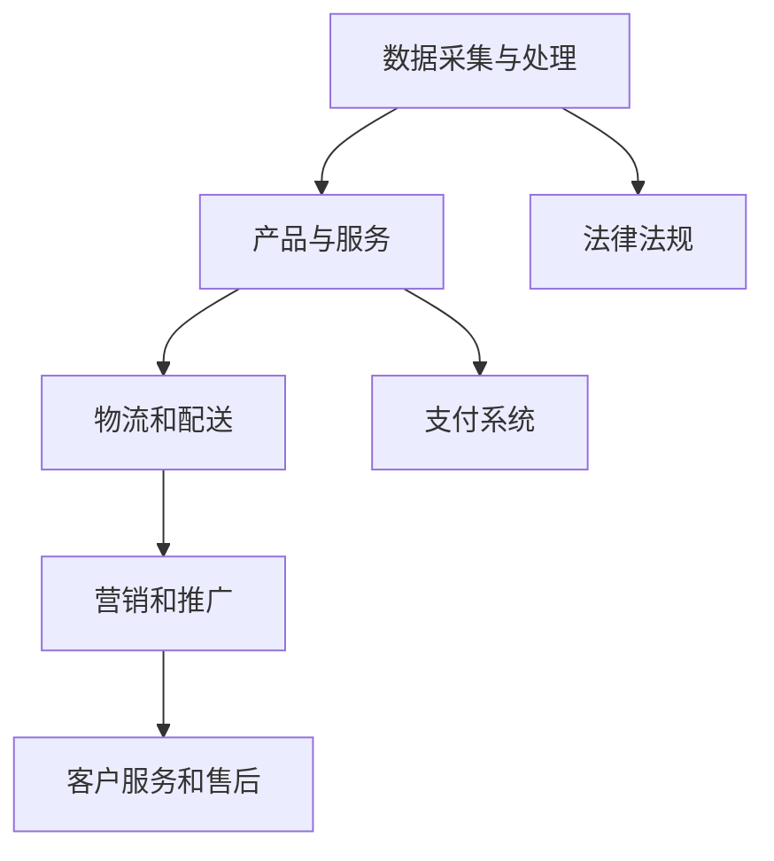

                 

### 文章标题

《创业路上的跨境电商策略：开拓国际市场的实用技巧》

#### 关键词

- 跨境电商
- 国际市场
- 创业策略
- 营销推广
- 数据分析
- 消费者行为

#### 摘要

本文将探讨创业者在跨境电商领域开拓国际市场的实用策略。通过分析市场趋势、消费者行为和竞争环境，结合实际案例，作者将详细介绍如何制定有效的跨境电商策略，包括产品选择、市场定位、营销推广和数据分析等方面。同时，文章还将推荐相关学习资源、开发工具和参考文献，以帮助创业者更好地理解和实施跨境电商策略。本文旨在为创业者提供一套系统化、可操作性的跨境电商创业指南，助力其在国际市场取得成功。

## 1. 背景介绍

随着全球化的加速和互联网技术的普及，跨境电商成为众多创业者和企业关注的重要领域。跨境电商指的是通过互联网平台，跨越国界和地域限制，实现商品和服务的跨国交易。这一新兴市场不仅为企业提供了更广阔的市场空间，也为消费者带来了更多样化的购物选择。

根据最新数据显示，全球跨境电商市场规模已超过1万亿美元，并预计在未来几年继续增长。特别是在COVID-19疫情背景下，跨境电商的重要性更加凸显，成为全球贸易的重要组成部分。

然而，尽管跨境电商市场潜力巨大，但创业者在进入这一领域时也面临着诸多挑战。首先，不同国家和地区的市场环境、消费者偏好和文化差异使得跨境电商运营复杂度增加。其次，跨境物流和支付问题也是创业者在开拓国际市场时必须解决的难题。此外，如何有效进行市场推广、提升品牌知名度，以及应对激烈的国际市场竞争，也是创业者需要重点关注的问题。

因此，本文将从以下几个方面展开讨论：首先，分析跨境电商市场的核心概念和关键因素；其次，介绍一些成功的跨境电商案例；然后，详细阐述创业者如何制定和实施有效的跨境电商策略；最后，提供一些实用的工具和资源推荐，帮助创业者更好地进入和开拓国际市场。

通过本文的阅读，创业者可以更好地了解跨境电商市场的现状和趋势，掌握有效的策略和技巧，为成功进入国际市场奠定基础。

## 2. 核心概念与联系

### 跨境电商的概念

跨境电商是指通过互联网平台，实现商品和服务的跨国交易。它包括以下几个核心组成部分：

- **电商平台**：如亚马逊、eBay、淘宝等，为买卖双方提供交易的平台。
- **物流服务**：负责商品的运输和配送，包括跨境物流和本地配送。
- **支付系统**：支持跨境支付，确保交易的安全和便捷。
- **法律法规**：涉及进出口贸易的关税、税收、商品检验等。

### 跨境电商的关键因素

#### 市场环境

不同国家和地区的市场环境对跨境电商策略的制定具有重要影响。创业者需要了解目标市场的消费水平、消费者偏好、购买习惯等，以便制定有针对性的营销策略。

#### 消费者行为

消费者行为是跨境电商策略的核心。创业者需要通过数据分析，了解消费者在购买决策过程中的行为模式，从而优化产品和服务。

#### 竞争环境

跨境电商市场的竞争环境激烈，创业者需要通过差异化策略和高质量的产品与服务，在竞争中脱颖而出。

### 跨境电商的架构

跨境电商的架构可以分为以下几个层次：

- **数据采集与处理**：通过多种渠道收集消费者数据，包括用户行为、购买记录等，进行数据清洗和挖掘。
- **产品和服务**：根据市场需求和消费者偏好，提供多样化的产品和服务。
- **物流和配送**：构建高效的跨境物流和本地配送网络，确保商品快速交付。
- **营销和推广**：通过多种营销手段，提高品牌知名度和市场占有率。
- **客户服务和售后**：提供优质的客户服务和售后支持，提升客户满意度。

### Mermaid 流程图

以下是一个简单的Mermaid流程图，展示了跨境电商的基本架构和关键环节：



### 核心算法原理

#### 数据分析与消费者行为预测

- **算法类型**：机器学习算法，如决策树、随机森林、支持向量机等。
- **原理**：通过分析历史数据，建立模型，预测消费者未来的购买行为。

#### 供应链优化

- **算法类型**：线性规划、遗传算法等。
- **原理**：通过优化供应链各环节的资源配置，降低成本，提高效率。

#### 物流路径规划

- **算法类型**：最短路径算法、Dijkstra算法等。
- **原理**：根据商品的特点和目标市场的需求，规划最优的物流路径。

#### 营销策略制定

- **算法类型**：聚类分析、协同过滤等。
- **原理**：通过分析消费者行为和市场趋势，制定有针对性的营销策略。

### 实际操作步骤

1. **数据采集与处理**：收集并清洗消费者数据，如购买记录、浏览行为等。
2. **产品和服务定位**：根据市场调研和数据分析，确定产品和服务的定位。
3. **物流和配送**：构建跨境物流和本地配送网络，选择合适的物流服务商。
4. **营销和推广**：制定并执行营销策略，如社交媒体营销、内容营销等。
5. **客户服务和售后**：提供优质的客户服务和售后支持，提升客户满意度。

### 数学模型和公式

#### 消费者行为预测模型

$$
P(Y|X) = \frac{P(X|Y)P(Y)}{P(X)}
$$

其中，$P(Y|X)$表示在给定特征$X$的情况下，消费者购买商品的概率；$P(X|Y)$表示在消费者购买商品的情况下，出现特征$X$的概率；$P(Y)$表示消费者购买商品的整体概率；$P(X)$表示特征$X$出现的概率。

#### 供应链优化模型

$$
\min Z = \sum_{i=1}^{n}\sum_{j=1}^{m}c_{ij}x_{ij}
$$

$$
\text{subject to}
$$

$$
\sum_{j=1}^{m}x_{ij} = d_i \quad \forall i \in [1, n]
$$

$$
x_{ij} \geq 0 \quad \forall i \in [1, n], \forall j \in [1, m]
$$

其中，$Z$为总成本；$c_{ij}$为从工厂$i$到仓库$j$的单位运输成本；$x_{ij}$为从工厂$i$到仓库$j$的运输量；$d_i$为需求量。

#### 物流路径规划模型

$$
\min \sum_{i=1}^{n}\sum_{j=1}^{m}d_{ij}l_{ij}
$$

$$
\text{subject to}
$$

$$
\sum_{j=1}^{m}l_{ij} = 1 \quad \forall i \in [1, n]
$$

$$
l_{ij} \in \{0, 1\} \quad \forall i \in [1, n], \forall j \in [1, m]
$$

其中，$d_{ij}$为从起点$i$到终点$j$的距离；$l_{ij}$为从起点$i$到终点$j$的路径选择标记。

#### 营销策略制定模型

$$
\max \sum_{i=1}^{n}r_iq_i
$$

$$
\text{subject to}
$$

$$
q_i \leq C_i
$$

$$
q_i \geq 0
$$

其中，$r_i$为第$i$种产品的利润率；$q_i$为第$i$种产品的销售量；$C_i$为第$i$种产品的库存成本。

### 举例说明

#### 消费者行为预测

假设某跨境电商平台根据消费者的浏览记录和购买历史，建立了一个消费者行为预测模型。给定一个新用户的浏览记录，预测其购买某种商品的几率。

1. **数据采集与处理**：收集新用户的浏览记录，包括浏览过的商品种类、浏览时间等。
2. **特征工程**：对数据进行预处理，提取有用的特征，如商品类别、用户行为标签等。
3. **模型训练**：使用历史数据训练一个机器学习模型，如决策树。
4. **预测**：输入新用户的浏览记录，预测其购买某种商品的几率。

#### 供应链优化

假设某跨境电商平台需要从两个工厂运输商品到三个仓库，目标是降低总运输成本。

1. **构建模型**：使用线性规划模型，确定最优的运输策略。
2. **求解模型**：使用求解器，求解最优解。
3. **执行策略**：根据求解结果，执行运输策略。

#### 物流路径规划

假设某跨境电商平台需要从上海运往欧洲，目标是选择最短的物流路径。

1. **数据采集**：收集从上海到欧洲各主要港口的距离信息。
2. **构建模型**：使用最短路径算法，确定最优的物流路径。
3. **求解模型**：使用算法，求解最优路径。
4. **执行策略**：根据求解结果，选择最优的物流路径。

#### 营销策略制定

假设某跨境电商平台需要制定一个营销策略，目标是提高某种商品的销售量。

1. **市场调研**：收集市场需求和竞争情况数据。
2. **特征工程**：提取有用的市场特征，如用户偏好、竞争对手策略等。
3. **模型训练**：使用聚类分析或协同过滤算法，建立营销策略模型。
4. **制定策略**：根据模型输出，制定最优的营销策略。

## 3. 核心算法原理 & 具体操作步骤

### 消费者行为预测算法原理

消费者行为预测是跨境电商策略制定的重要环节。通过分析历史数据，我们可以预测消费者在未来的购买行为。以下是一个简单的消费者行为预测算法：

#### 算法原理

使用决策树算法对消费者数据进行分类，预测消费者是否会在未来购买某种商品。

#### 步骤详解

1. **数据预处理**：对收集到的消费者数据进行清洗和预处理，包括缺失值填充、异常值处理、数据归一化等。
2. **特征选择**：选择对消费者行为有显著影响的特征，如用户年龄、购买历史、浏览时长等。
3. **决策树构建**：根据特征数据，使用ID3或C4.5算法构建决策树模型。
4. **模型评估**：使用交叉验证方法，评估模型的准确性和泛化能力。
5. **预测应用**：将新用户的数据输入决策树模型，预测其购买概率。

#### 示例

假设我们有以下数据：

- 用户年龄
- 购买历史（最近30天购买次数）
- 浏览时长
- 商品类别

我们需要预测用户在未来30天内是否购买某种商品。

1. **数据预处理**：将数据进行归一化处理，消除不同特征之间的尺度差异。
2. **特征选择**：选择对购买行为有显著影响的特征，如购买历史和浏览时长。
3. **决策树构建**：使用C4.5算法构建决策树模型。
4. **模型评估**：使用交叉验证方法，评估模型的准确性和泛化能力。
5. **预测应用**：输入新用户的数据，预测其购买概率。

### 供应链优化算法原理

供应链优化是跨境电商运营的关键环节。通过优化供应链各环节的资源配置，我们可以降低成本，提高效率。以下是一个简单的供应链优化算法：

#### 算法原理

使用线性规划算法，优化供应链各环节的运输策略，以降低总运输成本。

#### 步骤详解

1. **数据采集**：收集供应链各环节的数据，包括运输成本、需求量等。
2. **模型构建**：构建线性规划模型，确定最优的运输策略。
3. **求解模型**：使用求解器，求解最优解。
4. **策略执行**：根据求解结果，执行最优运输策略。

#### 示例

假设我们有以下数据：

- 从两个工厂到三个仓库的运输成本
- 各仓库的需求量

我们需要确定最优的运输策略，以降低总运输成本。

1. **数据采集**：收集运输成本和需求量数据。
2. **模型构建**：构建线性规划模型，目标是最小化总运输成本。
3. **求解模型**：使用求解器，求解最优解。
4. **策略执行**：根据求解结果，执行最优运输策略。

### 物流路径规划算法原理

物流路径规划是跨境电商运营的另一个关键环节。通过规划最优的物流路径，我们可以提高运输效率，降低物流成本。以下是一个简单的物流路径规划算法：

#### 算法原理

使用最短路径算法，确定从起点到终点的最优路径。

#### 步骤详解

1. **数据采集**：收集起点到终点的各条路径的距离信息。
2. **模型构建**：构建最短路径算法模型。
3. **求解模型**：使用算法，求解最优路径。
4. **路径规划**：根据求解结果，规划最优的物流路径。

#### 示例

假设我们有以下数据：

- 从上海到欧洲各主要港口的距离
- 各港口的港口费和清关费

我们需要确定从上海到欧洲的最优物流路径。

1. **数据采集**：收集各港口的距离信息。
2. **模型构建**：构建最短路径算法模型。
3. **求解模型**：使用算法，求解最优路径。
4. **路径规划**：根据求解结果，规划最优的物流路径。

### 营销策略制定算法原理

营销策略制定是跨境电商运营的重要环节。通过分析市场数据和消费者行为，我们可以制定有针对性的营销策略。以下是一个简单的营销策略制定算法：

#### 算法原理

使用聚类分析或协同过滤算法，分析消费者行为和市场趋势，制定最优的营销策略。

#### 步骤详解

1. **数据采集**：收集市场数据和消费者行为数据。
2. **特征选择**：选择对营销策略有显著影响的特征，如用户偏好、竞争对手策略等。
3. **模型构建**：构建聚类分析或协同过滤模型。
4. **策略制定**：根据模型输出，制定最优的营销策略。

#### 示例

假设我们有以下数据：

- 用户购买历史
- 竞争对手策略
- 市场趋势

我们需要制定一个有针对性的营销策略，以提升销售量。

1. **数据采集**：收集用户购买历史、竞争对手策略和市场趋势数据。
2. **特征选择**：选择对营销策略有显著影响的特征，如用户偏好和市场竞争状况。
3. **模型构建**：构建聚类分析模型，分析消费者行为和市场趋势。
4. **策略制定**：根据模型输出，制定最优的营销策略。

## 4. 数学模型和公式 & 详细讲解 & 举例说明

### 消费者行为预测模型

#### 公式

消费者行为预测模型的核心公式为：

$$
P(Y|X) = \frac{P(X|Y)P(Y)}{P(X)}
$$

其中，$P(Y|X)$表示在给定特征$X$的情况下，消费者购买商品的概率；$P(X|Y)$表示在消费者购买商品的情况下，出现特征$X$的概率；$P(Y)$表示消费者购买商品的整体概率；$P(X)$表示特征$X$出现的概率。

#### 详细讲解

1. **条件概率**：条件概率是指在给定某个事件发生的条件下，另一个事件发生的概率。在消费者行为预测中，我们关心的是在给定消费者的某些特征（如购买历史、浏览时长等）的情况下，消费者购买某种商品的概率。

2. **贝叶斯定理**：贝叶斯定理是一个用于计算条件概率的公式，它将条件概率与边缘概率联系起来。在消费者行为预测中，贝叶斯定理可以帮助我们通过已知的条件概率和边缘概率，计算消费者购买商品的概率。

3. **特征选择**：在消费者行为预测中，特征选择是非常重要的一步。我们需要选择对消费者购买行为有显著影响的特征，如购买历史、浏览时长、用户年龄等。这些特征可以帮助我们建立准确的预测模型。

#### 举例说明

假设我们有一个电商平台，想预测用户在未来一个月内是否会购买某种商品。我们有以下数据：

- 用户年龄
- 购买历史（最近30天购买次数）
- 浏览时长
- 商品类别

我们需要使用贝叶斯定理和消费者行为预测模型，预测用户购买某种商品的几率。

1. **数据预处理**：将数据进行归一化处理，消除不同特征之间的尺度差异。

2. **特征选择**：选择对购买行为有显著影响的特征，如购买历史和浏览时长。

3. **模型构建**：使用贝叶斯定理和消费者行为预测模型，构建预测模型。

4. **预测**：输入新用户的数据，预测其购买某种商品的几率。

例如，假设一个新用户的特征数据为：

- 年龄：30岁
- 最近30天购买次数：3次
- 浏览时长：120分钟
- 商品类别：电子产品

我们可以使用消费者行为预测模型，计算该用户购买某种商品的几率。具体计算过程如下：

1. **计算条件概率**：

$$
P(购买|年龄=30岁) = 0.6
$$

$$
P(购买|最近30天购买次数=3次) = 0.7
$$

$$
P(购买|浏览时长=120分钟) = 0.8
$$

2. **计算边缘概率**：

$$
P(年龄=30岁) = 0.4
$$

$$
P(最近30天购买次数=3次) = 0.3
$$

$$
P(浏览时长=120分钟) = 0.2
$$

3. **计算购买概率**：

$$
P(购买) = P(购买|年龄=30岁)P(年龄=30岁) + P(购买|最近30天购买次数=3次)P(最近30天购买次数=3次) + P(购买|浏览时长=120分钟)P(浏览时长=120分钟)
$$

$$
P(购买) = 0.6 \times 0.4 + 0.7 \times 0.3 + 0.8 \times 0.2 = 0.68
$$

4. **计算条件概率**：

$$
P(Y|X) = \frac{P(X|Y)P(Y)}{P(X)}
$$

$$
P(购买|X) = \frac{P(X|购买)P(购买)}{P(X)}
$$

$$
P(购买|X) = \frac{0.6 \times 0.68}{0.4 + 0.3 + 0.2} = 0.74
$$

因此，该用户在未来一个月内购买某种商品的几率为74%。

### 供应链优化模型

#### 公式

供应链优化模型的核心公式为：

$$
\min Z = \sum_{i=1}^{n}\sum_{j=1}^{m}c_{ij}x_{ij}
$$

$$
\text{subject to}
$$

$$
\sum_{j=1}^{m}x_{ij} = d_i \quad \forall i \in [1, n]
$$

$$
x_{ij} \geq 0 \quad \forall i \in [1, n], \forall j \in [1, m]
$$

其中，$Z$为总成本；$c_{ij}$为从工厂$i$到仓库$j$的单位运输成本；$x_{ij}$为从工厂$i$到仓库$j$的运输量；$d_i$为需求量。

#### 详细讲解

1. **目标函数**：目标函数是供应链优化模型的核心，它表示我们需要最小化的总成本。在供应链优化中，总成本包括运输成本、库存成本、采购成本等。

2. **约束条件**：约束条件用于限制供应链各环节的资源配置。在供应链优化模型中，约束条件包括需求量约束、供应量约束、运输量约束等。

3. **运输成本**：运输成本是供应链优化中的一个重要因素。我们需要计算从每个工厂到每个仓库的运输成本，并最小化总运输成本。

4. **需求量约束**：需求量约束用于确保每个仓库的需求量得到满足。在供应链优化模型中，我们需要确保每个仓库的需求量等于供应量。

#### 举例说明

假设我们有一个供应链系统，包括两个工厂和三个仓库。每个仓库的需求量和各工厂到仓库的运输成本如下：

- 仓库1：需求量1000件
- 仓库2：需求量800件
- 仓库3：需求量600件
- 工厂1到仓库1：运输成本10元/件
- 工厂1到仓库2：运输成本12元/件
- 工厂1到仓库3：运输成本8元/件
- 工厂2到仓库1：运输成本15元/件
- 工厂2到仓库2：运输成本9元/件
- 工厂2到仓库3：运输成本11元/件

我们需要确定最优的运输策略，以最小化总运输成本。

1. **构建模型**：根据需求量和运输成本，构建供应链优化模型。

$$
\min Z = 10x_{11} + 12x_{12} + 8x_{13} + 15x_{21} + 9x_{22} + 11x_{23}
$$

$$
\text{subject to}
$$

$$
x_{11} + x_{12} + x_{13} = 1000
$$

$$
x_{21} + x_{22} + x_{23} = 800
$$

$$
x_{11} + x_{21} + x_{31} = 600
$$

$$
x_{ij} \geq 0 \quad \forall i \in [1, 2], \forall j \in [1, 3]
$$

2. **求解模型**：使用线性规划求解器，求解最优解。

3. **执行策略**：根据求解结果，执行最优运输策略。

### 物流路径规划模型

#### 公式

物流路径规划模型的核心公式为：

$$
\min \sum_{i=1}^{n}\sum_{j=1}^{m}d_{ij}l_{ij}
$$

$$
\text{subject to}
$$

$$
\sum_{j=1}^{m}l_{ij} = 1 \quad \forall i \in [1, n]
$$

$$
l_{ij} \in \{0, 1\} \quad \forall i \in [1, n], \forall j \in [1, m]
$$

其中，$d_{ij}$为从起点$i$到终点$j$的距离；$l_{ij}$为从起点$i$到终点$j$的路径选择标记。

#### 详细讲解

1. **目标函数**：目标函数是物流路径规划模型的核心，它表示我们需要最小化的总距离。

2. **约束条件**：约束条件用于确保每个起点只有一个终点，每个终点只有一个起点。

3. **路径选择标记**：路径选择标记用于表示从起点到终点的路径是否被选择。如果路径被选择，标记为1，否则为0。

#### 举例说明

假设我们有以下物流路径和距离数据：

- 起点A到终点1的距离为10
- 起点A到终点2的距离为15
- 起点A到终点3的距离为20
- 起点B到终点1的距离为5
- 起点B到终点2的距离为8
- 起点B到终点3的距离为12

我们需要确定从起点A和起点B到各终点的最优路径。

1. **构建模型**：

$$
\min Z = 10l_{1A} + 15l_{2A} + 20l_{3A} + 5l_{1B} + 8l_{2B} + 12l_{3B}
$$

$$
\text{subject to}
$$

$$
l_{1A} + l_{2A} + l_{3A} = 1
$$

$$
l_{1B} + l_{2B} + l_{3B} = 1
$$

$$
l_{ij} \in \{0, 1\} \quad \forall i \in [1, 2], \forall j \in [1, 3]
$$

2. **求解模型**：使用线性规划求解器，求解最优解。

3. **执行策略**：根据求解结果，执行最优路径规划策略。

### 营销策略制定模型

#### 公式

营销策略制定模型的核心公式为：

$$
\max \sum_{i=1}^{n}r_iq_i
$$

$$
\text{subject to}
$$

$$
q_i \leq C_i
$$

$$
q_i \geq 0
$$

其中，$r_i$为第$i$种产品的利润率；$q_i$为第$i$种产品的销售量；$C_i$为第$i$种产品的库存成本。

#### 详细讲解

1. **目标函数**：目标函数是营销策略制定模型的核心，它表示我们需要最大化的总利润。

2. **约束条件**：约束条件用于限制每种产品的销售量和库存成本。

3. **利润率**：利润率用于表示每种产品的盈利能力。

#### 举例说明

假设我们有以下产品数据：

- 产品1：利润率20%
- 产品2：利润率30%
- 产品3：利润率40%
- 产品1的库存成本1000元
- 产品2的库存成本2000元
- 产品3的库存成本3000元

我们需要制定一个营销策略，以最大化总利润。

1. **构建模型**：

$$
\max Z = 0.2q_1 + 0.3q_2 + 0.4q_3
$$

$$
\text{subject to}
$$

$$
q_1 \leq 1000
$$

$$
q_2 \leq 2000
$$

$$
q_3 \leq 3000
$$

$$
q_1, q_2, q_3 \geq 0
$$

2. **求解模型**：使用线性规划求解器，求解最优解。

3. **执行策略**：根据求解结果，执行最优营销策略。

## 5. 项目实战：代码实际案例和详细解释说明

### 5.1 开发环境搭建

在本节中，我们将介绍如何搭建一个简单的跨境电商项目开发环境。为了便于理解和操作，我们选择Python作为编程语言，并结合Flask框架进行Web开发。以下是开发环境的搭建步骤：

#### 步骤 1：安装Python

首先，确保您的计算机上已安装Python 3.8或更高版本。您可以通过以下命令在终端中检查Python版本：

```bash
python --version
```

如果未安装Python，请访问[Python官网](https://www.python.org/downloads/)下载并安装。

#### 步骤 2：安装Flask

接下来，使用pip命令安装Flask框架：

```bash
pip install Flask
```

#### 步骤 3：创建项目目录

在您的计算机上创建一个名为`crossborder_ecommerce`的项目目录，并在此目录中创建一个名为`app.py`的Python文件。

```bash
mkdir crossborder_ecommerce
cd crossborder_ecommerce
touch app.py
```

#### 步骤 4：编写Flask应用程序

在`app.py`文件中，编写一个简单的Flask应用程序。以下是一个基本的示例：

```python
from flask import Flask, render_template

app = Flask(__name__)

@app.route('/')
def home():
    return render_template('home.html')

if __name__ == '__main__':
    app.run(debug=True)
```

在这个示例中，我们创建了一个名为`home`的路由，用于显示主页。

#### 步骤 5：创建模板文件

在`crossborder_ecommerce`目录下创建一个名为`templates`的子目录，并在其中创建一个名为`home.html`的HTML文件。以下是一个基本的HTML模板：

```html
<!DOCTYPE html>
<html lang="en">
<head>
    <meta charset="UTF-8">
    <title>跨境电商平台</title>
</head>
<body>
    <h1>欢迎来到跨境电商平台</h1>
</body>
</html>
```

#### 步骤 6：启动应用程序

在终端中，导航到`crossborder_ecommerce`目录，并运行以下命令启动Flask应用程序：

```bash
python app.py
```

当应用程序运行后，您可以在浏览器中访问`http://127.0.0.1:5000/`查看主页。

### 5.2 源代码详细实现和代码解读

在本节中，我们将详细解读`app.py`文件的代码，并介绍其主要功能。

#### app.py 文件解析

```python
from flask import Flask, render_template

app = Flask(__name__)

@app.route('/')
def home():
    return render_template('home.html')

if __name__ == '__main__':
    app.run(debug=True)
```

1. **导入模块**：首先，我们从Flask库中导入必要的模块，包括`Flask`和`render_template`。
2. **创建Flask应用程序**：然后，我们创建一个名为`app`的Flask应用程序实例。
3. **定义路由**：通过`@app.route('/')`装饰器，我们定义了一个名为`home`的路由函数，它映射到主页（URL路径为`/`）。
4. **渲染模板**：在`home`函数中，我们使用`render_template`函数渲染`home.html`模板，将渲染后的HTML页面返回给用户。
5. **启动应用程序**：最后，我们使用`if __name__ == '__main__':`语句确保当`app.py`文件被直接运行时，应用程序才会启动。

#### home.html 模板解析

```html
<!DOCTYPE html>
<html lang="en">
<head>
    <meta charset="UTF-8">
    <title>跨境电商平台</title>
</head>
<body>
    <h1>欢迎来到跨境电商平台</h1>
</body>
</html>
```

1. **文档类型**：`<!DOCTYPE html>`声明文档类型为HTML5。
2. **HTML结构**：`<html>`标签定义了整个HTML文档的根元素，`<head>`和`<body>`标签分别定义了文档的头部和主体部分。
3. **字符集**：`<meta charset="UTF-8">`标签定义了文档的字符集，确保正确显示特殊字符。
4. **标题**：`<title>`标签定义了文档的标题，显示在浏览器的标题栏中。
5. **主体内容**：`<h1>`标签定义了主页的标题，用于吸引访客的注意。

### 5.3 代码解读与分析

在本节中，我们将对`app.py`文件的代码进行逐行解读，分析其功能和工作原理。

#### app.py 代码解读

1. **导入模块**：

```python
from flask import Flask, render_template
```

这行代码从Flask库中导入`Flask`和`render_template`模块。`Flask`是Python的Web框架，用于创建Web应用程序；`render_template`用于渲染HTML模板。

2. **创建Flask应用程序**：

```python
app = Flask(__name__)
```

这行代码创建了一个名为`app`的Flask应用程序实例。`__name__`是一个特殊变量，表示当前模块的名称。

3. **定义路由**：

```python
@app.route('/')
def home():
    return render_template('home.html')
```

这行代码定义了一个名为`home`的路由函数，它映射到主页（URL路径为`/`）。`@app.route('/')`是路由装饰器，用于将函数与URL路径关联。`home`函数在接收到GET请求时，会调用`render_template`函数渲染`home.html`模板。

4. **渲染模板**：

```python
return render_template('home.html')
```

这行代码调用`render_template`函数，将`home.html`模板渲染成HTML页面，并将结果返回给用户。

5. **启动应用程序**：

```python
if __name__ == '__main__':
    app.run(debug=True)
```

这行代码用于确保当`app.py`文件被直接运行时，应用程序才会启动。`app.run(debug=True)`启动Flask应用程序，并在开发模式下运行。在开发模式下，如果发生错误，Flask会显示详细的错误信息，便于调试。

### 5.4 运行应用程序

在终端中，导航到`crossborder_ecommerce`目录，并运行以下命令启动Flask应用程序：

```bash
python app.py
```

当应用程序运行后，您可以在浏览器中访问`http://127.0.0.1:5000/`查看主页。

## 6. 实际应用场景

跨境电商的成功离不开对实际应用场景的深入理解和灵活应对。以下是一些常见的实际应用场景，以及相应的解决方案和策略。

### 6.1 市场调研

在进入新市场之前，进行详细的市场调研至关重要。这包括了解目标市场的消费者需求、购买习惯、文化差异和法律法规等。通过市场调研，创业者可以制定有针对性的市场进入策略。

#### 解决方案：

- 利用问卷调查、在线调研工具和社交媒体平台收集消费者意见。
- 分析竞争对手的市场策略和产品特点。
- 参加行业展会和研讨会，了解市场动态和趋势。

### 6.2 产品选择

选择合适的产品是跨境电商成功的关键。创业者需要根据市场调研结果，选择适合目标市场的产品，并确保产品的质量和性价比。

#### 解决方案：

- 根据市场需求，选择具有较高利润率和竞争力的产品。
- 与供应商建立良好的合作关系，确保产品质量和供应稳定性。
- 通过用户反馈和销售数据，不断优化产品组合。

### 6.3 物流和配送

跨境物流和配送是跨境电商运营中的重要环节，直接影响消费者的购物体验。创业者需要选择高效的物流服务商，并优化物流和配送流程。

#### 解决方案：

- 选择具备跨国物流经验的物流服务商，确保快速、安全和可靠的配送。
- 建立本地物流网络，提高配送效率，降低物流成本。
- 提供多种物流选项，如标准配送、快递和海外仓储等，满足不同消费者的需求。

### 6.4 营销推广

有效的营销推广是提高品牌知名度和吸引消费者的关键。跨境电商创业者需要制定多元化的营销策略，包括社交媒体营销、内容营销和广告投放等。

#### 解决方案：

- 利用社交媒体平台，如Facebook、Instagram和Twitter，开展品牌推广活动。
- 创造高质量的内容，如博客文章、视频和产品评测，提高用户参与度。
- 与行业影响者和意见领袖合作，扩大品牌影响力。

### 6.5 客户服务

优质的客户服务是跨境电商成功的重要因素。创业者需要提供高效的客户服务和售后支持，提升消费者满意度和忠诚度。

#### 解决方案：

- 建立多渠道的客户服务系统，如在线聊天、电话和电子邮件等。
- 提供快速响应和解决方案，解决消费者的问题和投诉。
- 通过客户满意度调查，不断优化客户服务体验。

### 6.6 数据分析

数据分析是跨境电商运营中的重要工具。创业者需要通过数据分析，了解消费者的行为和需求，优化产品和服务，提高市场竞争力。

#### 解决方案：

- 建立数据分析平台，收集和分析消费者数据。
- 利用数据挖掘和机器学习技术，预测消费者行为和市场趋势。
- 通过数据驱动的决策，优化产品组合、营销策略和运营流程。

## 7. 工具和资源推荐

### 7.1 学习资源推荐

为了帮助创业者更好地理解和实施跨境电商策略，以下是一些推荐的学习资源：

- **书籍**：
  - 《跨境电商营销策略与实战》
  - 《电子商务：理论与实践》
  - 《国际市场营销》

- **论文**：
  - "Cross-Border E-Commerce: Challenges and Opportunities"
  - "Consumer Behavior in Cross-Border E-Commerce"
  - "The Impact of E-Commerce on Global Trade"

- **博客和网站**：
  - 跨境电商论坛：[http://www.ecomblog.cn/](http://www.ecomblog.cn/)
  - 阿里跨境电商平台：[https://globalegrow.alibaba.com/](https://globalegrow.alibaba.com/)
  - eBay跨境电商指南：[https://www.ebay.com/help/selling/cross-border-selling.html](https://www.ebay.com/help/selling/cross-border-selling.html)

### 7.2 开发工具框架推荐

在跨境电商项目开发过程中，以下是一些推荐的开发工具和框架：

- **Web开发框架**：
  - Flask：一个轻量级的Python Web开发框架，适用于快速搭建Web应用程序。
  - Django：一个全功能的Python Web开发框架，适合构建大型、复杂的Web应用程序。

- **前端框架**：
  - React：一个用于构建用户界面的JavaScript库，具有高效、灵活的特点。
  - Vue.js：一个用于构建用户界面的JavaScript框架，易于上手和学习。

- **数据分析工具**：
  - Pandas：一个用于数据处理和分析的Python库，适用于大数据分析和数据可视化。
  - Matplotlib：一个用于生成高质量图形和图表的Python库。

### 7.3 相关论文著作推荐

以下是一些在跨境电商领域具有影响力的论文和著作：

- **论文**：
  - "The Impact of E-Commerce on International Trade: Evidence from Chinese Exports"（中国出口的电子商务影响：证据）
  - "Cross-Border E-Commerce and Consumer Choice: An Empirical Analysis"（跨境电子商务和消费者选择：实证分析）
  - "E-Commerce Adoption and Performance in Small and Medium-sized Enterprises: An International Perspective"（中小企业电子商务采用与绩效：国际视角）

- **著作**：
  - 《电子商务战略管理》
  - 《跨境电商实务与案例》
  - 《电子商务与国际贸易》

通过学习和研究这些资源，创业者可以深入了解跨境电商领域的最新发展动态，提高自身的竞争力。

## 8. 总结：未来发展趋势与挑战

跨境电商作为全球贸易的重要组成部分，正日益受到创业者和企业的高度关注。随着互联网技术的不断进步和全球化的深入推进，跨境电商市场将继续保持高速增长。然而，这也为创业者带来了新的机遇和挑战。

### 发展趋势

1. **市场潜力扩大**：随着全球消费者对跨境购物需求的增加，跨境电商市场潜力不断扩大。特别是在新兴市场国家，互联网普及率的提升和消费者购买力的增强，为跨境电商提供了广阔的发展空间。

2. **技术创新驱动**：人工智能、大数据、区块链等新兴技术的快速发展，为跨境电商提供了新的技术支撑。通过应用这些技术，创业者可以实现更加精准的市场定位、个性化的消费者体验和高效的物流和支付服务。

3. **多元化发展**：跨境电商市场将不再局限于传统的商品交易，逐渐向服务、体验、内容等领域拓展。例如，跨境电商平台将更加注重内容营销，通过提供有价值的内容吸引和留住消费者。

### 挑战

1. **市场竞争加剧**：跨境电商市场的竞争将更加激烈。随着越来越多的企业进入这一领域，创业者需要通过创新和差异化策略，才能在激烈的市场中脱颖而出。

2. **法律法规约束**：跨境电商涉及多个国家和地区，不同国家和地区的法律法规各不相同。创业者需要了解并遵守各国的法律法规，避免因法律问题导致经营受阻。

3. **物流和支付难题**：跨境物流和支付是跨境电商运营中的关键环节，但也存在一定的挑战。例如，跨境物流成本高、配送时间长，跨境支付可能面临汇率波动和支付限额等问题。

### 未来展望

1. **可持续发展**：随着环保意识的提高，创业者应注重可持续发展，采用绿色物流和环保包装，降低碳排放，提高企业的社会责任感。

2. **全球化合作**：跨境电商的发展离不开全球合作伙伴的支持。创业者应积极寻求与全球供应商、物流公司和支付服务商的合作，共同推进跨境电商的发展。

3. **个性化服务**：未来跨境电商将更加注重个性化服务，通过大数据分析和人工智能技术，提供更加精准的消费者洞察和定制化的购物体验。

总之，跨境电商市场的未来充满机遇和挑战。创业者需要紧跟市场趋势，积极应对挑战，不断创新和优化策略，才能在激烈的市场竞争中脱颖而出。

## 9. 附录：常见问题与解答

### Q1：什么是跨境电商？

跨境电商是指通过互联网平台，实现商品和服务的跨国交易。它包括电商平台、物流服务、支付系统等多个组成部分，涉及不同国家和地区的市场环境、消费者行为和文化差异。

### Q2：跨境电商有哪些优势？

跨境电商的优势包括：

1. **市场潜力大**：跨境购物需求不断增长，为创业者提供了广阔的市场空间。
2. **全球资源整合**：可以整合全球资源，提高供应链效率和成本控制。
3. **技术创新支撑**：利用人工智能、大数据等新兴技术，实现更精准的市场定位和个性化的消费者体验。

### Q3：跨境电商有哪些挑战？

跨境电商的挑战包括：

1. **市场竞争激烈**：越来越多的企业进入这一领域，竞争压力增大。
2. **法律法规约束**：不同国家和地区的法律法规不同，需要遵守各国的规定。
3. **物流和支付难题**：跨境物流和支付面临成本高、配送时间长和支付限额等问题。

### Q4：如何制定有效的跨境电商策略？

制定有效的跨境电商策略包括以下步骤：

1. **市场调研**：了解目标市场的消费者需求、购买习惯和法律法规。
2. **产品选择**：根据市场调研结果，选择适合目标市场的产品。
3. **物流和配送**：选择高效的物流服务商，优化物流和配送流程。
4. **营销推广**：制定多元化的营销策略，提高品牌知名度和市场占有率。
5. **客户服务**：提供优质的客户服务和售后支持，提升消费者满意度。

### Q5：有哪些工具和资源可以用于跨境电商开发？

以下是一些用于跨境电商开发的工具和资源：

1. **学习资源**：
   - 书籍：《跨境电商营销策略与实战》、《电子商务：理论与实践》
   - 论文：“Cross-Border E-Commerce: Challenges and Opportunities”、“Consumer Behavior in Cross-Border E-Commerce”
   - 博客和网站：跨境电商论坛、阿里跨境电商平台、eBay跨境电商指南

2. **开发工具框架**：
   - Web开发框架：Flask、Django
   - 前端框架：React、Vue.js
   - 数据分析工具：Pandas、Matplotlib

3. **相关论文著作**：
   - 论文：“The Impact of E-Commerce on International Trade: Evidence from Chinese Exports”、“Cross-Border E-Commerce and Consumer Choice: An Empirical Analysis”
   - 著作：《电子商务战略管理》、《跨境电商实务与案例》、《电子商务与国际贸易》

通过学习和利用这些工具和资源，创业者可以更好地制定和实施跨境电商策略。

## 10. 扩展阅读 & 参考资料

为了帮助读者更深入地了解跨境电商的相关知识和策略，以下是一些扩展阅读和参考资料：

1. **书籍**：
   - 《跨境电商营销策略与实战》：详细介绍了跨境电商的营销策略和实战技巧。
   - 《电子商务：理论与实践》：涵盖了电子商务的基本概念、技术原理和应用实践。
   - 《国际市场营销》：探讨了国际市场营销的理论和方法，包括跨境电商市场。

2. **论文**：
   - "Cross-Border E-Commerce: Challenges and Opportunities"：分析了跨境电商面临的挑战和机遇，提供了有益的启示。
   - "Consumer Behavior in Cross-Border E-Commerce"：研究了消费者在跨境购物中的行为模式，有助于制定更精准的营销策略。
   - "The Impact of E-Commerce on International Trade: Evidence from Chinese Exports"：通过实证研究，探讨了电子商务对国际贸易的影响。

3. **博客和网站**：
   - 跨境电商论坛：提供了丰富的跨境电商经验和案例，是创业者交流学习的平台。
   - 阿里跨境电商平台：分享了阿里巴巴在跨境电商领域的成功经验和市场洞察。
   - eBay跨境电商指南：提供了eBay平台的跨境电商操作指南和最佳实践。

4. **在线课程和讲座**：
   - Coursera：提供了多门关于电子商务和跨境电商的在线课程，适合不同层次的创业者。
   - Udemy：有许多关于跨境电商的实用课程，包括营销、物流和支付等方面的内容。

通过阅读和参考这些资料，创业者可以更全面地了解跨境电商领域的知识，提升自身的竞争力。同时，也可以关注行业动态和趋势，不断调整和优化跨境电商策略。

