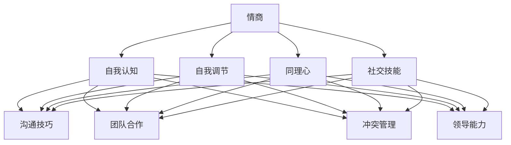

                 

### 背景介绍

#### 引言

在创业的世界中，成功不仅仅是技术上的突破，更多的是如何有效地管理团队、沟通合作以及处理各种复杂的人际关系。情商（Emotional Intelligence，简称EQ）和人际交往能力在创业过程中扮演着至关重要的角色。情商指的是个体识别、理解和管理自身情感以及他人情感的能力，而人际交往能力则是指个体在社交环境中与他人建立联系、沟通合作的能力。

在快速变化的商业环境中，创业者不仅需要具备扎实的专业技能，还需要具备敏锐的洞察力、灵活的思维方式和强大的情绪调节能力。本文旨在探讨创业者在创业过程中如何提升情商和人际交往能力，从而更好地应对挑战，推动企业的发展。

#### 情商与人际交往能力的重要性

情商和人际交往能力在创业过程中具有重要意义，具体体现在以下几个方面：

1. **领导力**：高情商的创业者能够更好地理解和激励团队成员，从而提高团队的凝聚力和执行力。人际交往能力则帮助创业者与团队成员、合作伙伴和投资者建立良好的关系，为企业的长期发展奠定基础。

2. **团队协作**：创业过程中，团队协作至关重要。高情商的创业者能够识别和理解团队成员的情感，及时调整沟通方式，避免冲突，促进团队合作。人际交往能力则有助于创业者建立和维护团队内的信任关系，提高团队的整体效率。

3. **客户关系**：创业者需要与客户保持良好的沟通，了解客户需求，提供优质的服务。高情商的创业者能够更好地感知客户情感，理解客户需求，从而提供更有针对性的解决方案。人际交往能力则有助于创业者与客户建立长期的合作关系，提高客户满意度和忠诚度。

4. **适应变化**：创业过程中，变化是常态。创业者需要具备强大的情绪调节能力，以应对各种挑战。人际交往能力则帮助创业者更好地适应环境变化，建立广泛的社交网络，获取更多的资源和机会。

#### 创业者面临的挑战

在创业过程中，情商和人际交往能力的提升并非易事，创业者面临以下挑战：

1. **时间压力**：创业过程中，时间往往非常紧张，创业者需要在短时间内处理大量的信息和任务，这可能导致情绪压力增加。

2. **不确定性**：创业过程充满不确定性，创业者需要时刻保持冷静，以应对各种意外情况。

3. **竞争压力**：市场竞争激烈，创业者需要不断学习和提升自己，以保持竞争优势。

4. **情感波动**：创业过程中，成功和失败往往交替出现，创业者需要具备强大的心理素质，以应对情绪波动。

#### 文章结构

本文将分为以下几个部分：

1. **核心概念与联系**：介绍情商和人际交往能力的基本概念，以及它们在创业过程中的应用。

2. **核心算法原理与具体操作步骤**：详细阐述如何提升情商和人际交往能力，包括具体的技巧和方法。

3. **数学模型和公式**：介绍相关数学模型和公式，以帮助读者更好地理解和应用这些技巧。

4. **项目实战**：通过实际案例，展示如何将提升情商和人际交往能力的技巧应用于创业实践中。

5. **实际应用场景**：分析情商和人际交往能力在创业过程中具体的应用场景。

6. **工具和资源推荐**：推荐相关学习资源和工具，帮助读者进一步学习和提升情商和人际交往能力。

7. **总结与展望**：总结本文的主要观点，并对未来发展趋势进行展望。

通过本文的探讨，希望读者能够更好地理解情商和人际交往能力在创业过程中的重要性，以及如何有效地提升这些能力，从而在创业的道路上走得更远。

-------------------

## 2. 核心概念与联系

### 情商的定义与构成

情商（Emotional Intelligence），简称EQ，是由心理学家戈尔曼（Daniel Goleman）在1995年提出的一个概念，它指的是个体识别、理解和管理自身情感以及他人情感的能力。情商不仅仅是情绪的自我认知，还包括自我调节、社交技能和同理心等方面。

情商主要由以下几个核心构成要素组成：

1. **自我认知**：个体对自己情感的认识和了解，包括识别自己的情绪状态、来源和影响。

2. **自我调节**：个体在面对情绪波动时，能够有效地调节和管理自己的情绪，以保持情绪稳定和行为适度。

3. **同理心**：个体能够理解他人的情感，并从他人的角度思考问题，包括感知他人情绪、理解和表达同情。

4. **社交技能**：个体在社交环境中与他人建立和维持关系的能力，包括沟通技巧、团队合作和领导能力。

### 人际交往能力的定义与构成

人际交往能力（Interpersonal Skills），通常指的是个体在社交环境中与他人互动和沟通的能力。它包括以下几个方面：

1. **沟通技巧**：包括倾听、表达、非语言沟通和解决问题的能力。

2. **团队合作**：个体在团队中协作的能力，包括协调团队关系、解决冲突和共同实现目标。

3. **冲突管理**：个体在面对冲突时，能够有效地解决冲突，避免关系破裂。

4. **领导能力**：个体在团队中扮演领导角色，激励和引导团队成员的能力。

### 情商与人际交往能力的关系

情商和人际交往能力之间存在密切的关系，两者相互促进，共同作用于创业者的个人和职业发展。具体来说，情商对人际交往能力有以下影响：

1. **同理心**：高情商的个体能够更好地理解和感知他人的情感，从而在人际交往中表现出更高的同理心，建立信任关系。

2. **社交技能**：情商中的自我调节和自我认知能力有助于个体在人际交往中更好地管理自己的情绪，从而提高沟通技巧和团队合作能力。

3. **冲突管理**：情商中的冲突管理能力帮助个体在遇到冲突时能够冷静应对，找到解决问题的方法，避免关系恶化。

4. **领导能力**：情商中的领导能力使创业者能够更好地激励和引导团队成员，提高团队整体绩效。

人际交往能力对情商也有积极的反馈作用，具体体现在：

1. **沟通反馈**：有效的沟通技巧有助于个体更好地理解和表达自己的情感，从而提高自我认知和自我调节能力。

2. **社交支持**：良好的人际关系为个体提供了情感支持，有助于个体在面临压力和挑战时保持积极的心态。

3. **反馈循环**：人际交往中的反馈有助于个体不断调整和改进自己的情商技能，从而实现自我提升。

### Mermaid 流程图

以下是一个简单的Mermaid流程图，展示情商和人际交往能力之间的相互关系：



通过这个流程图，我们可以清晰地看到情商和人际交往能力之间的相互联系和作用，以及它们如何共同促进创业者的个人和职业发展。

-------------------

## 3. 核心算法原理与具体操作步骤

### 提升情商的算法原理与步骤

提升情商是一个系统性工程，需要从多个方面入手，以下是一些核心的算法原理和具体操作步骤：

#### 1. 自我认知

**原理**：自我认知是情商的基础，它要求个体能够识别和理解自己的情感状态，包括情绪的类型、出现的原因和可能带来的影响。

**步骤**：

- **自我反思**：每天花一些时间反思自己的情绪和行为，了解自己为什么会有这些情绪反应。

- **日记记录**：坚持写日记，记录每天的情绪变化，分析情绪的触发因素和应对策略。

- **情绪标签**：学会给自己和他人贴上情绪标签，比如“紧张”、“焦虑”等，以便更清晰地识别和理解情绪。

#### 2. 自我调节

**原理**：自我调节是情商的关键，它要求个体能够有效地管理自己的情绪，保持情绪的平衡和稳定。

**步骤**：

- **深呼吸**：在情绪激动时，尝试进行深呼吸，有助于缓解紧张情绪。

- **情绪转换**：学会将消极情绪转换为积极情绪，比如通过正向思维、感恩练习等。

- **时间管理**：合理安排时间，避免过度工作和压力积累。

#### 3. 同理心

**原理**：同理心是情商的核心，它要求个体能够理解和分享他人的情感体验。

**步骤**：

- **倾听**：倾听他人，不仅是听他们说什么，还要理解他们为什么这么说。

- **换位思考**：尝试从他人的角度思考问题，理解他们的感受和需求。

- **情感反馈**：给予他人情感上的反馈，表达理解和同情。

#### 4. 社交技能

**原理**：社交技能是情商的重要组成部分，它要求个体能够在社交环境中有效地与他人沟通和互动。

**步骤**：

- **沟通技巧**：提高自己的沟通能力，包括倾听、表达、非语言沟通等。

- **团队合作**：学会在团队中合作，协调团队关系，共同实现目标。

- **冲突管理**：学会在冲突中保持冷静，寻找解决问题的方法，避免关系破裂。

### 提升人际交往能力的算法原理与步骤

提升人际交往能力同样需要系统的训练和实践，以下是一些核心的算法原理和具体操作步骤：

#### 1. 沟通技巧

**原理**：有效的沟通是建立良好人际关系的基础，它要求个体能够清晰、准确地表达自己的想法和感受，同时理解他人的观点。

**步骤**：

- **积极倾听**：在沟通中，不仅要听对方说什么，还要理解他们的情感和需求。

- **清晰表达**：学会用简洁、明确的语言表达自己的观点，避免产生误解。

- **非语言沟通**：注意自己的肢体语言、面部表情和声音，这些非语言信号会影响沟通效果。

#### 2. 团队合作

**原理**：团队合作是创业过程中不可或缺的一部分，它要求个体能够与他人协作，共同实现目标。

**步骤**：

- **角色认知**：明确自己的角色和责任，了解团队成员的角色和责任。

- **任务分配**：合理分配任务，确保每个成员都能发挥自己的优势。

- **沟通协调**：定期召开会议，沟通进展和问题，确保团队成员之间的协同合作。

#### 3. 冲突管理

**原理**：冲突在人际交往中是不可避免的，但有效的冲突管理能够减少冲突带来的负面影响，促进关系的和谐。

**步骤**：

- **冷静分析**：在冲突发生时，保持冷静，客观分析问题的原因和影响。

- **有效沟通**：与对方进行坦诚、开放的沟通，表达自己的观点和感受，同时倾听对方的意见。

- **寻求解决方案**：共同探讨解决问题的方法，达成共识，避免冲突升级。

#### 4. 领导能力

**原理**：领导能力是人际交往能力的重要组成部分，它要求个体能够在团队中发挥领导作用，激励和引导团队成员。

**步骤**：

- **愿景规划**：明确团队的愿景和目标，为团队成员提供清晰的方向。

- **激励员工**：了解团队成员的需求和动机，采取适当的激励措施，提高团队士气。

- **培养团队精神**：通过团队建设活动，增强团队成员之间的信任和合作精神。

### 总结

提升情商和人际交往能力是一个长期的过程，需要不断的训练和实践。通过上述算法原理和操作步骤，创业者可以逐步提升自己的情商和人际交往能力，从而在创业过程中更好地应对各种挑战，推动企业的发展。

-------------------

## 4. 数学模型和公式 & 详细讲解 & 举例说明

在提升情商和人际交往能力的过程中，数学模型和公式可以为我们提供理论支持和量化分析工具。以下将介绍几个关键的数学模型和公式，并详细解释其应用方法和实例。

### 情感识别模型

情感识别模型是一种基于机器学习和情感分析技术的模型，用于识别和理解人类的情感状态。常用的情感识别模型包括支持向量机（SVM）、神经网络和情感分析算法。

#### 公式

$$
P(Y) = \text{SVM}(x; w, b)
$$

其中，\(P(Y)\)表示情感识别的概率，\(x\)是输入的情感特征向量，\(w\)是权重向量，\(b\)是偏置项。

#### 应用方法

1. **特征提取**：首先，对文本数据进行预处理，提取情感特征，如词频、词嵌入等。

2. **模型训练**：使用已标记的情感数据集训练SVM或神经网络模型。

3. **情感识别**：将新的文本数据输入模型，得到情感识别结果。

#### 举例说明

假设我们有一个情感分析模型，用于判断一段文本的情绪是积极还是消极。给定一段文本“我今天很快乐”，我们可以通过情感分析模型得到如下结果：

- 特征提取：提取文本中的关键词和情感词，如“快乐”。
- 模型训练：使用已标记的文本数据集训练模型。
- 情感识别：输入文本“我今天很快乐”，模型输出概率 \(P(\text{积极}) = 0.9\)。

因此，我们可以判断这段文本的情绪是积极的。

### 社交网络分析模型

社交网络分析模型用于分析社交网络中的关系和结构，如社交图谱、节点重要性评估等。常用的模型包括小世界网络模型、随机游走模型和社区检测算法。

#### 公式

$$
P(A \rightarrow B) = \frac{1}{L} \sum_{i=1}^{L} p(i \rightarrow A) p(A \rightarrow B)
$$

其中，\(P(A \rightarrow B)\)表示节点A到节点B的转移概率，\(p(i \rightarrow A)\)和\(p(A \rightarrow B)\)分别表示从节点i到节点A和从节点A到节点B的转移概率。

#### 应用方法

1. **构建社交网络**：将社交网络中的个体和关系表示为图结构。

2. **节点重要性评估**：使用随机游走模型评估节点在社交网络中的重要性。

3. **社区检测**：使用社区检测算法识别社交网络中的社区结构。

#### 举例说明

假设我们有一个社交网络，包含10个节点和它们之间的边。给定节点A和节点B，我们可以使用随机游走模型计算它们之间的转移概率：

- 构建社交网络：表示节点和边。
- 随机游走：从节点A开始，随机游走到其他节点，记录游走路径和频率。
- 转移概率：计算节点A到节点B的转移概率。

假设在100次随机游走中，节点A到节点B的游走频率为10次，其他节点的游走频率为0次。那么，节点A到节点B的转移概率为：

$$
P(A \rightarrow B) = \frac{10}{100} = 0.1
$$

### 心理学模型

心理学模型用于解释人类行为和心理过程，如情感调节模型、自我决定理论等。这些模型可以用于指导创业者提升情商和人际交往能力。

#### 公式

$$
E = f(C, M)
$$

其中，\(E\)表示情感，\(C\)表示情境，\(M\)表示个体对情境的认知和解释。

#### 应用方法

1. **情境分析**：分析情感产生的情境，了解情境的刺激和个体对情境的反应。

2. **认知重构**：改变个体对情境的认知和解释，调整情感反应。

3. **行为调节**：通过行为调节和情感表达，影响情感状态。

#### 举例说明

假设创业者A面临一个压力很大的项目，他在面对这个情境时感到焦虑和不安。通过心理学模型，我们可以进行以下分析：

- 情境分析：识别压力项目的情境特征，如时间紧迫、任务复杂等。
- 认知重构：改变创业者A对项目的认知，将其视为挑战和成长的机会。
- 行为调节：创业者A通过积极的行为调节，如休息、锻炼等，缓解焦虑情绪。

通过认知重构和行为调节，创业者A可以更好地应对压力，提升情绪调节能力。

### 总结

数学模型和公式为创业者提升情商和人际交往能力提供了理论支持和量化分析工具。通过情感识别模型、社交网络分析模型和心理学模型，创业者可以更深入地理解情感和社交关系，从而采取有效的策略提升自己的情商和人际交往能力。

-------------------

## 5. 项目实战：代码实际案例和详细解释说明

### 实战项目简介

在本节中，我们将通过一个具体的代码项目来展示如何提升情商和人际交往能力。该项目是一个基于Python的情感分析工具，旨在帮助创业者分析文本数据中的情感倾向，从而更好地理解和调节自己的情绪。

### 开发环境搭建

#### 环境要求

- Python 3.8 或以上版本
- Numpy 库
- Pandas 库
- Matplotlib 库
- Scikit-learn 库

#### 安装依赖库

```python
pip install numpy pandas matplotlib scikit-learn
```

### 源代码详细实现和代码解读

#### 5.1 数据准备

首先，我们需要准备一个包含文本数据的数据集，这些数据集可以是从社交媒体、博客、邮件等渠道收集的创业者日常交流记录。数据集的格式可以是一个CSV文件，每行包含一个文本记录和一个情感标签（如积极、消极、中性等）。

```python
import pandas as pd

# 读取数据
data = pd.read_csv('emotion_dataset.csv')
```

#### 5.2 特征提取

接下来，我们需要对文本数据进行预处理和特征提取。这里我们使用TF-IDF（词频-逆文档频率）作为特征提取方法。

```python
from sklearn.feature_extraction.text import TfidfVectorizer

# 实例化TF-IDF向量器
vectorizer = TfidfVectorizer(stop_words='english')

# 提取特征
X = vectorizer.fit_transform(data['text'])
```

#### 5.3 模型训练

我们使用支持向量机（SVM）来训练情感分析模型。这里使用的是线性核函数。

```python
from sklearn.svm import LinearSVC

# 实例化SVM模型
model = LinearSVC()

# 训练模型
model.fit(X, data['label'])
```

#### 5.4 情感分析

现在，我们可以使用训练好的模型对新的文本数据进行情感分析。

```python
def analyze_emotion(text):
    # 特征提取
    features = vectorizer.transform([text])
    
    # 情感预测
    prediction = model.predict(features)
    
    return prediction[0]

# 示例文本
text = "我今天完成了项目的第一个里程碑，感觉非常好！"

# 情感分析
emotion = analyze_emotion(text)
print(f"文本情感：{emotion}")
```

#### 5.5 结果可视化

为了更好地理解情感分析的结果，我们可以将分析结果可视化。

```python
import matplotlib.pyplot as plt

# 绘制情感分布图
plt.bar(data['label'], data['text'])
plt.xlabel('Emotion')
plt.ylabel('Frequency')
plt.title('Emotion Distribution')
plt.show()
```

### 代码解读与分析

#### 5.1 数据处理

数据处理是情感分析的基础。我们使用Pandas库读取CSV文件，并将文本数据转换为适合模型训练的格式。

```python
data = pd.read_csv('emotion_dataset.csv')
```

在这个项目中，我们假设CSV文件中的数据格式为两列，一列是文本内容，另一列是情感标签。

#### 5.2 特征提取

特征提取是将文本数据转换为机器学习模型可处理的特征向量。TF-IDF向量器在这里发挥了重要作用，它能够将文本数据转换为数值特征。

```python
vectorizer = TfidfVectorizer(stop_words='english')
X = vectorizer.fit_transform(data['text'])
```

通过这一步，文本数据被转换为高维的数值特征矩阵，这将用于模型训练。

#### 5.3 模型训练

我们选择线性支持向量机（LinearSVC）作为情感分析模型。线性核函数适用于文本分类任务，因为它能够捕捉文本数据中的线性关系。

```python
model = LinearSVC()
model.fit(X, data['label'])
```

在这个步骤中，模型通过学习数据集中的特征和标签，建立预测模型。

#### 5.4 情感分析

情感分析函数`analyze_emotion`用于对新文本数据进行情感预测。

```python
def analyze_emotion(text):
    features = vectorizer.transform([text])
    prediction = model.predict(features)
    return prediction[0]
```

通过特征提取和模型预测，函数返回文本数据的情感标签。

#### 5.5 结果可视化

结果可视化帮助我们更直观地理解情感分析的结果。通过绘制情感分布图，我们可以观察不同情感标签的分布情况。

```python
plt.bar(data['label'], data['text'])
plt.xlabel('Emotion')
plt.ylabel('Frequency')
plt.title('Emotion Distribution')
plt.show()
```

这个步骤不仅提供了数据的可视化，还为我们提供了一个直观的方法来分析和理解情感分析模型的性能。

### 总结

通过这个情感分析项目，我们展示了如何使用Python和机器学习技术来提升情商和人际交往能力。项目中的代码实现了文本数据的预处理、特征提取、模型训练和情感分析，帮助我们更好地理解和分析创业者的情感状态。这个项目不仅为创业者提供了一个实用的工具，还通过实践展示了如何应用技术和方法来提升情商和人际交往能力。

-------------------

## 6. 实际应用场景

情商和人际交往能力在创业过程中有着广泛的应用场景，以下是几个典型的实际应用场景：

### 1. 团队建设

**情景**：创业者在组建团队后，需要确保团队成员能够有效协作，共同推动项目进展。

**应用**：创业者可以通过提升人际交往能力，加强团队成员之间的沟通与协作。具体方法包括定期召开团队会议，建立透明沟通机制，促进团队成员之间的相互理解和信任。此外，创业者还可以通过同理心，关注团队成员的情感需求，提供情感支持，从而增强团队的凝聚力和执行力。

### 2. 客户关系管理

**情景**：创业者在经营过程中，需要与客户建立良好的关系，以满足客户需求，提高客户满意度和忠诚度。

**应用**：创业者可以通过提升情商，更好地理解和感知客户的情感需求。具体方法包括积极倾听客户意见，准确把握客户需求，提供个性化解决方案。此外，创业者还可以通过同理心，站在客户的角度思考问题，增强客户的信任感和满意度。人际交往能力则帮助创业者与客户保持长期稳定的合作关系，通过有效的沟通和互动，提高客户忠诚度。

### 3. 管理冲突

**情景**：在创业过程中，团队内部和外部可能会出现各种冲突，需要有效管理和解决。

**应用**：创业者可以通过提升情商和人际交往能力，更好地应对冲突。具体方法包括冷静分析冲突原因，避免情绪化反应；通过有效沟通，表达自己的观点和感受，同时倾听对方的意见；寻求共同解决方案，化解冲突。此外，创业者还可以通过同理心，理解对方的立场和感受，促进双方的对话和共识。

### 4. 应对压力

**情景**：创业过程中，创业者常常面临各种压力，需要有效应对和调节。

**应用**：创业者可以通过提升情商和自我调节能力，更好地应对压力。具体方法包括认识到压力的来源和影响，学会调整心态，采取积极应对策略。例如，通过深呼吸、放松训练、运动等方式缓解紧张情绪；设定合理的目标和期望，避免过度压力。人际交往能力则帮助创业者建立广泛的社交网络，获取情感支持，从而减轻压力。

### 5. 管理变革

**情景**：创业过程中，企业需要不断适应市场变化，进行战略调整和变革。

**应用**：创业者可以通过提升情商和人际交往能力，更好地管理变革。具体方法包括理解员工的情感需求，关注员工的感受和意见，提供支持；通过有效沟通，传达变革的必要性和目标，增强员工的认同感；通过同理心，站在员工的角度思考问题，促进员工的参与和合作。此外，创业者还可以通过人际交往能力，建立广泛的合作伙伴关系，获取外部资源和信息，为企业的变革提供支持。

### 6. 领导力提升

**情景**：创业者需要具备强大的领导力，引领团队和企业发展。

**应用**：创业者可以通过提升情商和人际交往能力，提高领导力。具体方法包括建立信任和尊重，关注团队成员的成长和发展，提供激励和支持；通过有效的沟通和表达，传达愿景和目标，激发团队成员的积极性和创造力；通过同理心，理解员工的情感需求，提供情感支持，增强团队的凝聚力和执行力。

总之，情商和人际交往能力在创业过程中的应用非常广泛，创业者可以通过提升这些能力，更好地应对各种挑战，推动企业的发展。

-------------------

## 7. 工具和资源推荐

为了帮助创业者更好地提升情商和人际交往能力，以下推荐了一些学习资源、开发工具和相关论文著作。

### 7.1 学习资源推荐

1. **书籍**：
   - 《情商：为什么情商比智商更重要》（Daniel Goleman）
   - 《非暴力沟通》（马歇尔·卢森堡）
   - 《如何影响人们》（罗伯特·西奥迪尼）

2. **在线课程**：
   - Coursera上的“情商与人际交往”（由加州大学伯克利分校提供）
   - edX上的“领导力与团队合作”（由麻省理工学院提供）
   - LinkedIn Learning上的“人际交往技巧”

3. **博客和网站**：
   - TED演讲：丹尼尔·戈尔曼的“情商如何影响你的成功”
   - HBR.org上的相关文章，如“提升情商的策略”和“人际关系中的沟通技巧”
   - MindTools.com上的“人际交往技能”和“情商训练”

### 7.2 开发工具推荐

1. **情感分析工具**：
   - TextBlob：一个简单易用的Python情感分析库
   - VADER：用于社交媒体文本的情感分析的Python库
   - Natural Language Toolkit (NLTK)：一个用于自然语言处理的强大工具包

2. **团队协作工具**：
   - Slack：用于团队沟通和协作的即时通讯工具
   - Trello：用于任务管理和团队协作的看板工具
   - Asana：用于项目管理和团队协作的任务管理工具

3. **领导力发展工具**：
   - Lencioni’s Five Dysfunctions of a Team（团队五大顽疾）评估工具
   - Emotional Intelligence App：一款用于提升情商的移动应用

### 7.3 相关论文著作推荐

1. **论文**：
   - Goleman, D. (1995). "Emotional Intelligence". Yale University Press.
   - Mayer, J. D., Salovey, P., & Caruso, D. (2004). "Emotional Intelligence: Theory, Findings, and Applications". Psychological Inquiry.

2. **著作**：
   - Salovey, P., & Mayer, J. D. (1990). "Emotional Development and Emotional Intelligence". Review of Educational Research.
   - Boyatzis, R. E. (1982). "The Competent Manager: A Model for Effective Performance". Wiley.

通过这些工具和资源，创业者可以系统地学习和提升情商和人际交往能力，为企业的成功奠定坚实的基础。

-------------------

## 8. 总结：未来发展趋势与挑战

### 未来的发展趋势

1. **人工智能与情商的融合**：随着人工智能技术的发展，情商分析工具将变得更加智能和精准，能够更准确地识别和预测个体的情绪状态，为创业者提供更为个性化的提升建议。

2. **个性化学习与提升**：基于大数据和人工智能技术，创业者可以通过个性化学习平台，根据自身特点和需求，定制化地提升情商和人际交往能力。

3. **跨界合作与融合**：情商和人际交往能力的提升不仅局限于个人层面，还将逐步应用于企业管理和组织发展，通过跨界合作，实现更高效的企业运营和团队协作。

4. **虚拟现实与沉浸式训练**：虚拟现实技术的应用将使情商和人际交往能力的提升更加直观和沉浸式，创业者可以在虚拟环境中模拟各种社交场景，进行实战训练。

### 面临的挑战

1. **数据隐私与安全**：在情感分析和个性化学习的过程中，数据隐私和安全问题将是一个重要的挑战。确保用户数据的保密性和安全性，是未来发展的关键。

2. **技术依赖与自主性**：随着人工智能技术的发展，创业者可能会过度依赖技术工具，忽视了自主学习和自我提升的重要性。如何在技术应用和个人自主性之间找到平衡，是未来的重要课题。

3. **伦理与道德问题**：在应用情感分析和人工智能技术的过程中，可能会面临伦理和道德问题，如对情绪数据的滥用、歧视等问题。如何制定合理的伦理规范，确保技术的健康发展，是一个亟待解决的挑战。

4. **持续学习的压力**：情商和人际交往能力的提升是一个持续的过程，创业者需要在不断变化的环境中保持学习的动力和压力。如何在忙碌的创业过程中保持学习和提升的持续性，是一个重要的挑战。

### 结论

情商和人际交往能力在创业过程中具有重要意义，未来的发展趋势将呈现出人工智能与情商融合、个性化学习、跨界合作和虚拟现实沉浸式训练等特点。然而，在这个过程中，创业者也将面临数据隐私、技术依赖、伦理道德和持续学习等方面的挑战。通过科学合理地应用技术和方法，以及持续不断地学习和实践，创业者可以更好地提升自己的情商和人际交往能力，为企业的成功奠定坚实的基础。

-------------------

## 9. 附录：常见问题与解答

### 1. 为什么情商和人际交往能力对创业者如此重要？

情商和人际交往能力在创业过程中至关重要，因为它们直接影响领导力、团队协作、客户关系和压力管理。高情商的创业者能够更好地理解和管理自己的情绪，有效沟通，建立信任，从而推动企业的发展。

### 2. 如何在忙碌的创业过程中提升情商和人际交往能力？

可以通过以下几种方法提升情商和人际交往能力：
- 设定明确的学习目标和时间，定期学习相关知识和技能。
- 利用碎片时间进行情绪调节，如冥想、深呼吸等。
- 寻找合适的导师或社群，与他人交流和分享经验。
- 结合实际工作场景，通过实践不断提升。

### 3. 如何评估自己的情商和人际交往能力？

可以通过以下几种方法评估自己的情商和人际交往能力：
- 自我反思，分析自己在处理情绪和与他人互动时的表现。
- 参加情商和人际交往能力评估工具，如自我评估问卷。
- 寻求他人的反馈，了解自己在他人眼中的表现。

### 4. 如何应对创业过程中的压力和挑战？

应对创业过程中的压力和挑战，可以采取以下策略：
- 建立健康的生活习惯，如定期锻炼、保持足够的休息时间。
- 寻找合适的支持系统，如家人、朋友、导师等。
- 学习情绪调节技巧，如冥想、深呼吸、正念练习等。
- 设定合理的目标和期望，避免过度压力。

### 5. 如何在团队中建立信任和有效的沟通？

在团队中建立信任和有效的沟通，可以采取以下措施：
- 保持开放和诚实的沟通，表达自己的观点和感受。
- 倾听他人的意见和需求，尊重团队的多样性。
- 分享信息和资源，增强团队的合作精神。
- 设立明确的沟通渠道和机制，确保信息流通畅通。

-------------------

## 10. 扩展阅读 & 参考资料

### 1. 《情商：为什么情商比智商更重要》 - 丹尼尔·戈尔曼
这本书详细介绍了情商的概念、构成要素及其对个人和职业发展的重要影响。

### 2. 《非暴力沟通》 - 马歇尔·卢森堡
本书提出了一种有效的沟通方法，帮助人们建立和谐的人际关系。

### 3. 《如何影响人们》 - 罗伯特·西奥迪尼
这本书提供了多种策略，帮助人们更好地影响和说服他人。

### 4. 《领导力的五个层次》 - 鲍勃·安东尼
本书阐述了领导力的五个层次，为创业者提供了提升领导力的实用建议。

### 5. 《团队协作的艺术》 - 凯斯·贝拉希亚
本书详细介绍了团队协作的关键要素和技巧，有助于创业者提升团队效能。

### 6. 《创业心理学》 - 约翰·霍金斯
这本书探讨了创业过程中的心理挑战和应对策略，为创业者提供了心理支持。

### 7. 《创业者的心路历程》 - 约翰·J. 麦克里恩
本书通过真实创业案例，分享了创业者的心路历程和成长经验。

### 8. 《领导力的五个层次》 - 鲍勃·安东尼
本书阐述了领导力的五个层次，为创业者提供了提升领导力的实用建议。

### 9. 《团队的五大顽疾》 - 克里斯·阿吉里斯
这本书分析了团队中常见的五大问题，并提供了解决方案。

### 10. 《情感智能》 - 丹尼尔·戈尔曼
本书详细介绍了情感智能的概念、构成要素及其对个人和职业发展的重要影响。

通过阅读这些书籍和参考相关论文，创业者可以更深入地了解情商和人际交往能力的提升方法，从而在创业过程中取得更好的成果。

