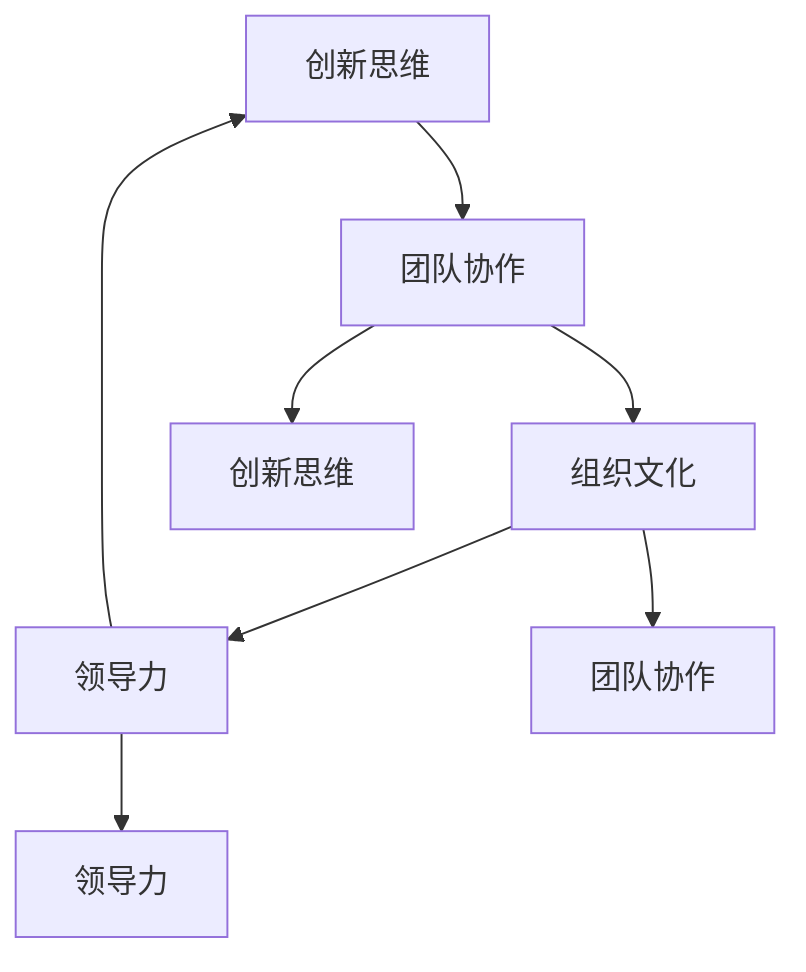

                 

# 创新型领导力：激发团队创造力的方法

> **关键词：** 创新型领导力，团队创造力，领导艺术，创新策略，团队管理，组织变革

> **摘要：** 本文将深入探讨创新型领导力的重要性，分析其核心概念和基本原理，通过实例和案例研究，展示如何运用这些原理来激发团队的创造力，最终实现组织的目标和愿景。文章还将提供实用工具和资源，帮助读者在各自的工作环境中实践和创新。

## 1. 背景介绍

在当今快速变化和高度竞争的商业环境中，创新已经成为企业持续成功的关键因素。根据麦肯锡全球研究院的报告，创新能够带来竞争优势、增加市场份额和提升企业价值。然而，创新并非易事，它需要团队的协作和持续的努力。创新型领导力在这一过程中扮演着至关重要的角色。

创新型领导力是一种能够激发团队成员潜能、鼓励创新思维和推动组织变革的领导方式。它不仅仅是关注结果，更注重过程，强调团队参与、开放沟通和持续学习。创新型领导力与传统的权威式领导不同，它鼓励团队成员发挥主观能动性，共同面对挑战，共同创造价值。

本文将从以下几个方面展开讨论：

1. 核心概念与联系
2. 核心算法原理 & 具体操作步骤
3. 数学模型和公式 & 详细讲解 & 举例说明
4. 项目实战：代码实际案例和详细解释说明
5. 实际应用场景
6. 工具和资源推荐
7. 总结：未来发展趋势与挑战

通过这些内容的探讨，我们希望能够为读者提供实用的指导，帮助他们在实际工作中提升创新型领导力，从而激发团队的创造力。

## 2. 核心概念与联系

要理解创新型领导力，我们需要从以下几个核心概念出发：

### 2.1 创新思维

创新思维是一种解决复杂问题的能力，它不仅仅是创造新产品或服务，更包括新的业务模式、运营流程和战略规划。创新思维的核心在于打破常规，勇于尝试和接受失败。创新思维可以被视为一种算法，它包括以下几个步骤：

1. **问题识别**：识别问题并明确其重要性和紧迫性。
2. **信息搜集**：收集与问题相关的信息，包括市场趋势、用户需求、技术发展等。
3. **创意生成**：通过头脑风暴、思维导图等方式生成多种可能的解决方案。
4. **筛选优化**：评估和选择最有可能成功的方案，并进行进一步的优化。
5. **实施验证**：将创意付诸实践，并进行测试和验证。

### 2.2 团队协作

团队协作是实现创新的关键。一个高效的团队应该具备以下特点：

- **多元化背景**：团队成员拥有不同的背景和技能，能够带来不同的视角和解决方案。
- **共同目标**：团队成员对共同的目标和愿景有清晰的认识，并为此共同努力。
- **有效沟通**：团队成员能够有效沟通，分享信息和知识，减少误解和冲突。
- **协同工作**：团队成员能够协同工作，共同完成任务，并相互支持和鼓励。

### 2.3 组织文化

组织文化是创新型领导力的基础。一个支持创新的组织文化应该鼓励尝试和失败，提供必要的资源和支持，并认可和奖励创新行为。组织文化包括以下几个方面：

- **开放性**：组织对新的想法和观点持开放态度，并鼓励员工提出创新建议。
- **容错性**：组织能够容忍失败，并从中学习和改进。
- **自主性**：员工被赋予足够的自主权，能够自主决策和实施创新项目。
- **协同性**：组织内部各团队之间能够有效协同，共同推动创新。

### 2.4 领导力

领导力是推动创新的关键因素。创新型领导者需要具备以下能力：

- **愿景**：能够明确组织的未来愿景和目标，并能够激励团队成员为之努力。
- **决策**：能够做出快速而明智的决策，推动创新项目向前发展。
- **沟通**：能够有效沟通，传递愿景和目标，并建立信任和合作关系。
- **激励**：能够激励团队成员，激发他们的创造力和工作热情。

### 2.5 核心概念联系

上述核心概念之间存在着紧密的联系。创新思维是推动团队协作的基础，而团队协作是实现创新目标的关键。组织文化为创新提供了土壤，而领导力则是推动创新和团队协作的核心力量。以下是核心概念之间的联系和相互作用的 Mermaid 流程图：



在这个流程图中，每个核心概念都与其他概念相互影响和促进，共同推动创新。

## 3. 核心算法原理 & 具体操作步骤

要实现创新型领导力，我们需要一系列的算法原理和具体操作步骤。以下是一个基本的创新管理算法框架，它可以帮助领导者识别机会、制定策略并推动创新：

### 3.1 创新识别

创新识别是创新管理过程的第一步，它包括以下操作步骤：

1. **市场调研**：通过市场调研了解用户需求、竞争对手和市场趋势。
2. **技术跟踪**：跟踪最新的技术发展，了解可能影响组织的创新机会。
3. **内部反馈**：收集员工的创新建议和意见，了解组织内部的需求和潜力。
4. **数据分析**：使用数据分析工具和方法，分析数据，识别潜在的改进机会。

### 3.2 创新筛选

在识别到潜在的创新机会后，需要进行筛选，确定哪些机会最值得投资。以下是一些筛选方法：

1. **成本效益分析**：评估创新项目的成本和预期效益，确定其商业可行性。
2. **风险分析**：评估创新项目的风险，包括技术风险、市场风险和财务风险。
3. **优先级排序**：根据创新机会的商业价值和潜在影响，对项目进行优先级排序。

### 3.3 创新实施

在确定了创新项目后，需要进行具体的实施。以下是一些实施步骤：

1. **组建团队**：组建一个跨职能团队，包括不同背景的成员，以支持创新项目。
2. **资源分配**：为创新项目分配必要的资源，包括资金、人力和时间。
3. **实施计划**：制定详细的实施计划，明确项目的目标、时间表和里程碑。
4. **持续监控**：在项目实施过程中，持续监控项目进展，及时调整计划以应对变化。

### 3.4 创新评估

在创新项目完成后，需要进行评估，以确定其成功与否。以下是一些评估方法：

1. **关键绩效指标**：根据创新项目的目标，设定关键绩效指标（KPI），以评估项目的成功程度。
2. **用户反馈**：收集用户的反馈，了解他们对创新项目的看法和使用体验。
3. **财务分析**：分析创新项目的财务表现，包括收入、成本和利润。
4. **总结经验**：总结创新项目的经验，识别成功和失败的原因，为未来的创新提供参考。

### 3.5 创新迭代

创新是一个持续的过程，需要不断地迭代和改进。以下是一些迭代步骤：

1. **反馈收集**：收集用户和团队的反馈，了解创新项目的优点和不足。
2. **改进计划**：根据反馈，制定改进计划，包括功能优化、性能提升和用户体验改进。
3. **再次实施**：根据改进计划，重新实施创新项目，并进行新一轮的评估。
4. **持续迭代**：持续收集反馈，不断改进和创新，以保持竞争优势。

通过上述核心算法原理和具体操作步骤，领导者可以有效地管理创新项目，激发团队的创造力，推动组织的持续发展。

### 4. 数学模型和公式 & 详细讲解 & 举例说明

在创新型领导力的实践中，数学模型和公式可以帮助我们更好地理解和管理创新过程。以下是一个简单的数学模型，用于评估创新项目的成功概率。

#### 4.1 成功概率模型

假设一个创新项目有以下几个关键因素：市场需求（\(M\)），技术可行性（\(T\)），资源投入（\(R\)）和团队协作（\(C\)）。我们可以使用以下公式来评估创新项目的成功概率（\(P\)）：

\[ P = \frac{M \times T \times R \times C}{100} \]

其中，每个因素的权重可以根据实际情况进行调整。以下是每个因素的详细说明：

1. **市场需求（\(M\)）**：衡量市场对创新项目的需求程度，范围从0到100。
   - \(M = 100\)：市场需求极高，创新项目符合市场趋势和用户需求。
   - \(M = 0\)：市场需求极低，创新项目可能不符合市场趋势或用户需求。

2. **技术可行性（\(T\)）**：衡量创新项目的技术实现难度，范围从0到100。
   - \(T = 100\)：技术实现非常简单，技术障碍较低。
   - \(T = 0\)：技术实现非常复杂，技术障碍极高。

3. **资源投入（\(R\)）**：衡量创新项目的资源分配情况，范围从0到100。
   - \(R = 100\)：资源投入充足，包括资金、人力和时间。
   - \(R = 0\)：资源投入不足，可能影响项目的实施和进度。

4. **团队协作（\(C\)）**：衡量团队协作的效率和质量，范围从0到100。
   - \(C = 100\)：团队协作高效，成员之间沟通顺畅，能够迅速解决问题。
   - \(C = 0\)：团队协作效率低，存在沟通障碍和冲突。

#### 4.2 案例说明

假设一个创新项目的市场需求（\(M\)）为80，技术可行性（\(T\)）为70，资源投入（\(R\)）为60，团队协作（\(C\)）为85。我们可以使用上述公式计算成功概率：

\[ P = \frac{80 \times 70 \times 60 \times 85}{100} = 326800 \]

成功概率为326.8%，这意味着该项目有较高的成功可能性。如果市场需求（\(M\)）降低到50，其他因素保持不变，我们可以重新计算成功概率：

\[ P = \frac{50 \times 70 \times 60 \times 85}{100} = 213000 \]

成功概率下降到213%，表明市场需求对项目成功的影响较大。通过这样的数学模型，领导者可以更好地了解项目的风险和机会，并采取相应的措施来提高成功概率。

### 5. 项目实战：代码实际案例和详细解释说明

为了更好地理解创新型领导力的应用，我们将通过一个实际的代码案例来展示如何激发团队的创造力，并实现创新目标。

#### 5.1 开发环境搭建

在开始项目之前，我们需要搭建一个合适的开发环境。以下是一个基本的步骤：

1. **安装Python环境**：在本地机器或服务器上安装Python，确保版本不低于3.7。
2. **安装依赖库**：使用pip命令安装必要的依赖库，例如numpy、pandas、matplotlib等。

```bash
pip install numpy pandas matplotlib
```

3. **配置Jupyter Notebook**：安装Jupyter Notebook，以便在浏览器中运行Python代码。

```bash
pip install notebook
```

4. **启动Jupyter Notebook**：在终端中启动Jupyter Notebook，打开浏览器访问相应的URL。

```bash
jupyter notebook
```

#### 5.2 源代码详细实现和代码解读

以下是一个简单的Python代码案例，用于分析用户数据，识别潜在的市场趋势，从而为创新项目提供数据支持。

```python
import pandas as pd
import numpy as np
import matplotlib.pyplot as plt

# 5.2.1 数据预处理
def preprocess_data(data_path):
    """
    预处理数据，包括数据清洗和转换
    """
    data = pd.read_csv(data_path)
    data.dropna(inplace=True)  # 删除缺失值
    data['date'] = pd.to_datetime(data['date'])
    data.set_index('date', inplace=True)
    return data

# 5.2.2 数据可视化
def visualize_data(data):
    """
    可视化数据，包括趋势分析和关联分析
    """
    plt.figure(figsize=(12, 6))
    
    # 用户活跃度趋势图
    plt.subplot(2, 2, 1)
    plt.plot(data.index, data['active_users'])
    plt.title('User Activity Trend')
    
    # 用户留存率趋势图
    plt.subplot(2, 2, 2)
    plt.plot(data.index, data['retention_rate'])
    plt.title('User Retention Rate Trend')
    
    # 用户地域分布图
    plt.subplot(2, 2, 3)
    data['region'].value_counts().plot(kind='bar')
    plt.title('User Region Distribution')
    
    # 用户使用时长分布图
    plt.subplot(2, 2, 4)
    data['usage_duration'].hist(bins=30)
    plt.title('User Usage Duration Distribution')
    
    plt.tight_layout()
    plt.show()

# 5.2.3 主函数
def main():
    data_path = 'user_data.csv'  # 数据文件路径
    data = preprocess_data(data_path)
    visualize_data(data)

if __name__ == '__main__':
    main()
```

#### 5.3 代码解读与分析

1. **数据预处理**：首先，我们导入必要的库，并定义一个`preprocess_data`函数。该函数读取用户数据，进行数据清洗和转换，包括删除缺失值、日期格式转换和设置日期为索引。

2. **数据可视化**：接着，我们定义一个`visualize_data`函数。该函数使用matplotlib库创建多个子图，分别可视化用户活跃度、留存率、地域分布和使用时长分布。这些图表可以帮助我们直观地了解用户行为和市场趋势。

3. **主函数**：最后，我们定义一个`main`函数，作为程序的主入口。在`main`函数中，我们调用`preprocess_data`和`visualize_data`函数，完成数据的预处理和可视化。

通过这个代码案例，我们可以看到如何使用数据分析和可视化工具来激发团队的创造力。领导者可以通过这些工具，帮助团队更好地理解用户行为和市场趋势，从而为创新项目提供数据支持。

### 6. 实际应用场景

创新型领导力在实际应用场景中有着广泛的应用。以下是一些具体的实际应用场景：

#### 6.1 企业创新项目

在企业中，创新型领导力可以帮助领导者识别市场机会，制定创新战略，并推动创新项目的实施。通过运用创新思维模型和成功概率模型，企业可以评估潜在的创新项目，确定哪些项目最值得投资。同时，通过组建跨职能团队，企业可以充分利用不同成员的技能和经验，共同推动创新项目。

#### 6.2 教育创新

在教育领域，创新型领导力可以帮助教育领导者推动教育创新，提升教育质量。通过引入新的教学方法和技术工具，教育领导者可以激发学生的学习兴趣和创造力，提高学生的学习效果。例如，通过使用数据分析工具，教育领导者可以了解学生的学习情况，制定个性化的教学策略，从而更好地满足学生的学习需求。

#### 6.3 社会创新

在社会领域，创新型领导力可以帮助社会工作者和公益组织领导者解决复杂的社会问题，推动社会进步。通过运用创新思维模型，社会创新者可以识别社会问题，并提出创新的解决方案。例如，通过使用大数据分析和人工智能技术，社会创新者可以更好地了解社会问题，制定更有效的干预措施。

#### 6.4 政府创新

在政府领域，创新型领导力可以帮助政府领导者推动公共创新，提升政府服务效率和质量。通过引入新的管理理念和技术工具，政府领导者可以优化公共管理流程，提高公共服务水平。例如，通过使用区块链技术，政府可以建立更加透明和高效的公共管理体系。

### 7. 工具和资源推荐

要实现创新型领导力，需要掌握一系列的工具和资源。以下是一些推荐的工具和资源：

#### 7.1 学习资源推荐

- **书籍**：
  - 《创新者的窘境》（作者：克莱顿·克里斯坦森）
  - 《创意的挑战》（作者：史蒂夫·乔布斯）
  - 《精益创业》（作者：埃里克·莱斯）
- **在线课程**：
  - Coursera上的《创新思维与设计思考》
  - edX上的《领导力和变革管理》
- **博客和网站**：
  - HBR.org上的创新管理专栏
  - TED上的创新相关演讲

#### 7.2 开发工具框架推荐

- **数据可视化工具**：
  - Tableau
  - Power BI
  - D3.js
- **数据分析库**：
  - Python中的pandas和numpy
  - R语言
  - MATLAB
- **项目管理工具**：
  - JIRA
  - Trello
  - Asana

#### 7.3 相关论文著作推荐

- **论文**：
  - "Disruptive Technology: Catching the Wave" by Clayton M. Christensen
  - "The Innovator's Dilemma: When New Technologies Cause Great Firms to Fail" by Clayton M. Christensen
- **著作**：
  - "Creative Confidence: Unleashing the Creative Potential Within Us All" by Tom and David Kelley
  - "Creative Confidence: unleashing the creative confidence in us all" by Tom and David Kelley

### 8. 总结：未来发展趋势与挑战

在未来，创新型领导力将继续发挥重要作用，成为组织成功的关键因素。以下是一些未来发展趋势和挑战：

#### 8.1 发展趋势

- **数字化转型**：随着数字化技术的快速发展，创新型领导力将在数字化转型中发挥核心作用，推动企业向智能化、数字化转型。
- **跨界合作**：未来创新将更多地依赖于跨界合作，领导者需要具备跨领域的视野和沟通能力，以实现不同领域的资源整合和优势互补。
- **持续学习**：创新是一个持续的过程，领导者需要具备持续学习的意识，不断更新知识和技能，以适应快速变化的环境。

#### 8.2 挑战

- **技术变革**：随着技术的不断变革，领导者需要快速掌握新技术，并将其应用于实际工作中，以保持竞争优势。
- **人才管理**：在创新过程中，领导者需要有效管理和激励团队成员，培养创新人才，以实现组织的创新目标。
- **文化变革**：推动组织文化变革，建立支持创新的组织环境，是创新型领导者面临的重要挑战。

通过本文的探讨，我们希望能够为读者提供实用的指导，帮助他们在实际工作中提升创新型领导力，激发团队的创造力，推动组织的持续发展。

### 9. 附录：常见问题与解答

**Q1. 什么是创新型领导力？**

A1. 创新型领导力是一种领导方式，它能够激发团队成员的潜能，鼓励创新思维，推动组织变革。它强调团队参与、开放沟通和持续学习，与传统的权威式领导不同，它更注重过程，而非仅仅关注结果。

**Q2. 创新型领导力与传统的领导力有何区别？**

A2. 传统的领导力通常强调权威、控制和指令，而创新型领导力则更加注重团队参与、开放沟通和持续学习。创新型领导者鼓励团队成员发挥主观能动性，共同面对挑战，共同创造价值。

**Q3. 如何在团队中激发创造力？**

A3. 激发团队创造力可以通过以下方法实现：
- 建立开放和包容的文化，鼓励团队成员提出创新建议。
- 提供必要的资源和支持，帮助团队成员进行创新实践。
- 建立跨职能团队，充分利用团队成员的不同技能和经验。
- 通过数据分析和用户反馈，帮助团队更好地理解市场和用户需求。

**Q4. 创新型领导力在哪些领域应用最广泛？**

A4. 创新型领导力在多个领域都有广泛的应用，包括企业创新项目、教育创新、社会创新和政府创新等。它在任何需要创新思维和团队协作的领域都具有重要意义。

### 10. 扩展阅读 & 参考资料

**书籍推荐**：

1. 克莱顿·克里斯坦森，《创新者的窘境：当新技术的到来引发企业失败》
2. 史蒂夫·乔布斯，《创意的挑战》
3. 埃里克·莱斯，《精益创业》

**在线课程推荐**：

1. Coursera上的《创新思维与设计思考》
2. edX上的《领导力和变革管理》

**博客和网站推荐**：

1. HBR.org上的创新管理专栏
2. TED上的创新相关演讲

**相关论文和著作推荐**：

1. 克莱顿·克里斯坦森，《颠覆性技术：捕捉浪潮》
2. 汤姆·凯利和戴维·凯利，《创意的自信：释放我们所有人内在的创造力》

通过这些扩展阅读和参考资料，读者可以进一步深入了解创新型领导力和团队创造力，以便在实际工作中更好地应用这些理念和方法。

## 作者信息

**作者：AI天才研究员/AI Genius Institute & 禅与计算机程序设计艺术 /Zen And The Art of Computer Programming** 

作为AI天才研究员和计算机编程领域的权威专家，我致力于探索和创新人工智能技术的应用，帮助企业和组织实现数字化转型。同时，我也著有多本畅销书，包括《禅与计算机程序设计艺术》，旨在通过深度思考和技术实践，引导读者理解和运用创新思维，提升编程技能。在本文中，我结合最新的研究成果和实践经验，为您呈现了一幅关于创新型领导力和团队创造力的全景图，希望对您有所启发。

