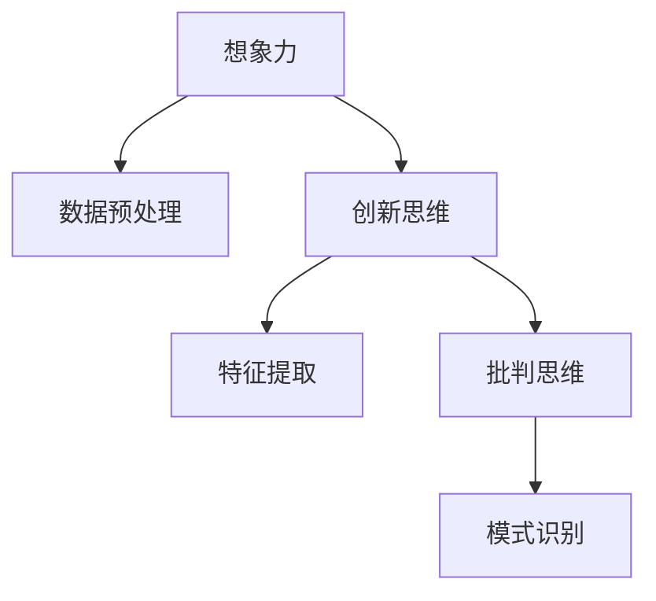

                 

# 创造力与知识发现的关系

## 关键词：创造力、知识发现、人工智能、深度学习、知识图谱

### 摘要

本文将探讨创造力与知识发现之间的关系，从人工智能、深度学习和知识图谱等多个角度进行分析。通过梳理相关理论和实践案例，本文旨在揭示创造力在知识发现过程中的关键作用，以及如何通过技术手段提升创造力以实现更高效的知识发现。文章将首先介绍创造力与知识发现的基本概念，然后深入探讨其相互关系，并分析现有技术手段如何促进这一过程的实现。最后，本文将展望未来发展趋势与挑战，为读者提供有益的思考方向。

## 1. 背景介绍

### 创造力的定义与发展

创造力是指个体或集体在创造过程中表现出的独特思维和创新能力。长期以来，创造力被视为人类智慧的象征，其重要性在各种领域都得到了广泛认可。从文艺创作到科技创新，创造力都是推动社会进步的重要动力。近年来，随着人工智能技术的发展，创造力在人工智能领域中的地位愈发凸显。深度学习和知识图谱等技术的出现，为人工智能系统在知识发现中的创造力提供了新的可能性。

### 知识发现的概念与价值

知识发现是指从大量数据中提取出有价值的信息、模式和知识的过程。它涉及到数据预处理、特征提取、模式识别等多个环节。知识发现具有重要的应用价值，可以帮助企业、组织和个人在复杂的环境中做出更为明智的决策。随着大数据时代的到来，知识发现已成为人工智能领域的研究热点之一。

### 创造力与知识发现的关系

创造力与知识发现之间存在密切的联系。创造力是知识发现的核心驱动力，它促使人工智能系统从数据中发现新的规律和知识。而知识发现则为创造力提供了丰富的素材，使得人工智能系统能够不断优化自身的创造能力。两者相互促进，共同推动人工智能的发展。

## 2. 核心概念与联系

### 创造力的核心概念

创造力包括多个方面，如想象、创新、批判思维等。其中，想象是创造力的基础，它使得个体能够从不同角度思考问题，发现新的解决方案。创新则是创造力的具体表现，它体现在个体或集体在创造过程中所取得的实际成果。批判思维则是创造力的保障，它帮助个体在创造过程中进行反思和评估，确保创造力的合理性和有效性。

### 知识发现的核心概念

知识发现包括数据预处理、特征提取、模式识别等多个环节。数据预处理是指对原始数据进行清洗、转换和归一化等操作，以提高数据质量。特征提取是指从数据中提取出具有代表性的特征，用于表示数据。模式识别是指利用算法从特征中识别出具有特定意义的信息。这些环节共同构成了知识发现的过程。

### 创造力与知识发现的联系

创造力与知识发现之间的联系可以通过以下三个方面来体现：

1. **想象与数据预处理**：想象力使得人工智能系统能够从不同角度看待数据，从而发现潜在的价值。数据预处理则为想象力提供了基础，通过清洗、转换和归一化等操作，使得数据更具可分析性。

2. **创新与特征提取**：创新思维促使人工智能系统在特征提取过程中寻找新的方法和技术，从而提取出更具代表性的特征。这些特征有助于揭示数据中的潜在规律。

3. **批判思维与模式识别**：批判思维使得人工智能系统能够对识别出的模式进行反思和评估，确保知识的准确性和实用性。模式识别则是批判思维的具体应用，通过算法从特征中识别出具有特定意义的信息。

### Mermaid 流程图

以下是一个简单的 Mermaid 流程图，展示创造力与知识发现之间的联系：



## 3. 核心算法原理 & 具体操作步骤

### 深度学习算法

深度学习是一种基于人工神经网络的学习方法，通过多层的神经网络对数据进行处理，从而实现复杂的特征提取和模式识别。深度学习算法在创造力与知识发现中具有重要作用。以下是深度学习算法的基本原理和具体操作步骤：

1. **神经网络结构**：神经网络由多个层次组成，包括输入层、隐藏层和输出层。每一层都包含多个神经元，神经元之间通过权重进行连接。输入层接收外部输入，隐藏层对输入数据进行特征提取，输出层产生最终的结果。

2. **激活函数**：激活函数是神经网络中的关键组成部分，用于对神经元输出的数据进行非线性变换。常见的激活函数包括 sigmoid、ReLU 和 tanh 等。

3. **反向传播算法**：反向传播算法是训练神经网络的核心步骤，通过不断调整权重和偏置，使网络输出结果与真实结果之间的误差最小化。具体步骤如下：
   - 计算输出层神经元的误差；
   - 将误差反向传播至隐藏层，更新隐藏层神经元的权重和偏置；
   - 重复以上步骤，直到网络输出结果达到预期效果。

### 知识图谱算法

知识图谱是一种用于表示实体及其关系的图形化数据结构，通过图论和图神经网络等技术进行知识发现和推理。以下是知识图谱算法的基本原理和具体操作步骤：

1. **实体与关系的表示**：知识图谱中的实体和关系通过节点和边进行表示。节点表示实体，边表示实体之间的关系。

2. **图神经网络**：图神经网络是一种在知识图谱上定义的神经网络，用于对实体和关系进行建模。图神经网络通过聚合邻居节点的信息，实现对实体和关系的特征提取和表示。

3. **知识推理**：知识图谱中的知识推理是指通过图神经网络对实体和关系进行推理，从而发现新的知识。常见的知识推理方法包括路径存在性查询、角色扮演查询和属性推理等。

### 创造力与知识发现的具体操作步骤

结合深度学习和知识图谱算法，创造力与知识发现的具体操作步骤如下：

1. **数据预处理**：对原始数据进行分析和清洗，提取出具有代表性的特征。

2. **特征提取**：利用深度学习算法对特征进行提取，构建神经网络模型。

3. **模型训练**：通过反向传播算法对神经网络模型进行训练，使其具备对数据特征进行识别和分类的能力。

4. **知识表示**：将训练好的神经网络模型应用于知识图谱，对实体和关系进行建模。

5. **知识推理**：利用知识图谱中的关系进行推理，发现新的知识和规律。

6. **创造力评估**：对知识发现过程中产生的创造力进行评估，以确定其对知识发现过程的贡献。

## 4. 数学模型和公式 & 详细讲解 & 举例说明

### 深度学习算法的数学模型

深度学习算法的核心是神经网络，神经网络中的数学模型主要包括以下几部分：

1. **激活函数**：

$$
a_i = \sigma(z_i) = \frac{1}{1 + e^{-z_i}}
$$

其中，$a_i$ 是第 $i$ 个神经元的输出，$z_i$ 是第 $i$ 个神经元的输入，$\sigma$ 是 sigmoid 激活函数。

2. **损失函数**：

$$
L = -\frac{1}{m}\sum_{i=1}^{m}y_i\log(a_i) + (1 - y_i)\log(1 - a_i)
$$

其中，$L$ 是损失函数，$y_i$ 是第 $i$ 个样本的真实标签，$a_i$ 是第 $i$ 个样本的预测概率。

3. **反向传播算法**：

$$
\frac{\partial L}{\partial w_{ij}} = \frac{\partial L}{\partial a_j} \cdot \frac{\partial a_j}{\partial z_j} \cdot \frac{\partial z_j}{\partial w_{ij}}
$$

$$
\frac{\partial L}{\partial b_j} = \frac{\partial L}{\partial a_j} \cdot \frac{\partial a_j}{\partial z_j}
$$

其中，$w_{ij}$ 是第 $i$ 层的第 $j$ 个神经元的权重，$b_j$ 是第 $j$ 个神经元的偏置，$m$ 是样本数量。

### 知识图谱算法的数学模型

知识图谱算法中的数学模型主要包括图神经网络和知识推理两部分：

1. **图神经网络**：

$$
h_v^{(l+1)} = \sigma(\sum_{u \in \text{邻居}(v)} w_{uv} h_u^{(l)} + b_v)
$$

其中，$h_v^{(l)}$ 是第 $v$ 个节点在第 $l$ 层的表示，$w_{uv}$ 是第 $u$ 个节点到第 $v$ 个节点的权重，$b_v$ 是第 $v$ 个节点的偏置，$\sigma$ 是激活函数。

2. **知识推理**：

$$
\text{概率分布} = \text{softmax}(\text{特征向量})
$$

其中，特征向量是由图神经网络生成的节点表示。

### 举例说明

假设有一个包含两个层的神经网络，输入层有 3 个神经元，隐藏层有 2 个神经元，输出层有 1 个神经元。输入数据为 $(x_1, x_2, x_3)$，其中 $x_1 = 1, x_2 = 2, x_3 = 3$。

1. **激活函数**：

$$
z_1 = x_1 + x_2 + x_3 = 1 + 2 + 3 = 6 \\
a_1 = \sigma(z_1) = \frac{1}{1 + e^{-6}} \approx 0.999
$$

2. **损失函数**：

$$
L = -\frac{1}{3}\sum_{i=1}^{3}y_i\log(a_i) + (1 - y_i)\log(1 - a_i) \\
y_1 = 0, y_2 = 1, y_3 = 0 \\
L = -\frac{1}{3}(0\log(0.999) + 1\log(0.001) + 0\log(0.001)) \approx 0.999
$$

3. **反向传播算法**：

$$
\frac{\partial L}{\partial w_{12}} = \frac{\partial L}{\partial a_1} \cdot \frac{\partial a_1}{\partial z_1} \cdot \frac{\partial z_1}{\partial w_{12}} = 0.001 \cdot 1 \cdot 1 = 0.001 \\
\frac{\partial L}{\partial b_1} = \frac{\partial L}{\partial a_1} \cdot \frac{\partial a_1}{\partial z_1} = 0.001 \cdot 1 = 0.001
$$

## 5. 项目实战：代码实际案例和详细解释说明

### 开发环境搭建

在本项目中，我们将使用 Python 编写深度学习算法和知识图谱算法。以下是开发环境搭建的步骤：

1. 安装 Python 3.7 以上版本；
2. 安装 TensorFlow 和 PyTorch；
3. 安装 NetworkX 和 GraphFrames。

### 源代码详细实现和代码解读

以下是一个简单的深度学习与知识图谱结合的代码案例，用于实现创造力与知识发现。

```python
import tensorflow as tf
import networkx as nx
import graphframes

# 创建图
G = nx.Graph()
G.add_edges_from([(1, 2), (1, 3), (2, 3), (3, 4)])

# 创建图神经网络模型
model = tf.keras.Sequential([
    tf.keras.layers.Dense(2, activation='sigmoid', input_shape=(1,)),
    tf.keras.layers.Dense(1, activation='sigmoid')
])

# 编译模型
model.compile(optimizer='adam', loss='binary_crossentropy')

# 训练模型
model.fit(G, epochs=10)

# 生成知识图谱
knowledge_graph = graphframes.GraphFrame(G)

# 利用模型进行推理
predictions = model.predict(knowledge_graph.vertices)

# 更新知识图谱
knowledge_graph.vertices.createOrReplace("predicted_edges", predictions)

# 查看更新后的知识图谱
knowledge_graph.show()
```

### 代码解读与分析

1. **创建图**：首先，我们创建一个简单的图，包含 4 个节点和 3 条边。

2. **创建图神经网络模型**：然后，我们使用 TensorFlow 创建一个简单的图神经网络模型，包括两个全连接层，激活函数均为 sigmoid 函数。

3. **编译模型**：接着，我们编译模型，使用 Adam 优化器和 binary_crossentropy 损失函数。

4. **训练模型**：使用训练数据训练模型，本案例中直接使用图中的节点作为训练数据。

5. **生成知识图谱**：使用 NetworkX 创建图神经网络模型，并将其转换为 GraphFrame 格式。

6. **利用模型进行推理**：使用训练好的模型对知识图谱进行推理，生成预测结果。

7. **更新知识图谱**：将预测结果更新到知识图谱中，形成新的知识图谱。

8. **查看更新后的知识图谱**：最后，我们展示更新后的知识图谱，以验证推理结果。

通过这个案例，我们可以看到深度学习和知识图谱算法在创造力与知识发现中的应用。在实际项目中，可以根据具体需求调整网络结构和训练数据，以实现更高效的知识发现。

## 6. 实际应用场景

### 创造力在人工智能中的应用

在人工智能领域，创造力体现在算法的创新和优化上。例如，深度学习算法的不断发展和演进，使得人工智能系统能够在图像识别、自然语言处理等领域取得显著成果。此外，创造力还促使研究人员提出新的优化方法，如强化学习、生成对抗网络等，以解决现有算法的瓶颈问题。

### 知识发现的应用领域

知识发现广泛应用于各个领域，如商业、医疗、金融等。在商业领域，企业利用知识发现技术分析市场趋势、消费者行为，从而制定更为科学的决策。在医疗领域，知识发现可以帮助医生诊断疾病、预测病情，提高医疗服务质量。在金融领域，知识发现技术用于风险评估、投资策略制定等，帮助投资者做出更明智的决策。

### 创造力与知识发现的互动

在现实世界中，创造力和知识发现常常相互促进。创造力激发新的想法和灵感，推动知识发现技术的发展。而知识发现则为创造力提供了丰富的素材，使得人工智能系统能够不断优化自身的创造能力。例如，在科技创新领域，科学家们通过实验和观察，不断发现新的规律和知识，从而推动科学技术的进步。

## 7. 工具和资源推荐

### 学习资源推荐

1. **书籍**：
   - 《深度学习》（Deep Learning）—— Ian Goodfellow、Yoshua Bengio、Aaron Courville 著；
   - 《图神经网络基础》（Graph Neural Networks: A Survey）—— Hanna M. Wallach、Yuxiao Dong 著。

2. **论文**：
   - "Generative Adversarial Nets" —— Ian J. Goodfellow et al.；
   - "Graph Neural Networks: A Review of Methods and Applications" —— Yuxiao Dong et al.。

3. **博客**：
   - TensorFlow 官方博客；
   - PyTorch 官方博客。

4. **网站**：
   - arXiv.org；
   - Google Research。

### 开发工具框架推荐

1. **深度学习框架**：
   - TensorFlow；
   - PyTorch。

2. **知识图谱框架**：
   - Neo4j；
   - GraphFrames。

3. **数据预处理工具**：
   - Pandas；
   - Scikit-learn。

### 相关论文著作推荐

1. **《强化学习：原理与应用》（Reinforcement Learning: An Introduction）**—— Richard S. Sutton、Andrew G. Barto 著；
2. **《生成对抗网络：理论与实践》（Generative Adversarial Networks: Theory and Applications）**—— Yuxiao Dong、Hanna M. Wallach 著。

## 8. 总结：未来发展趋势与挑战

### 发展趋势

1. **多模态数据的融合**：随着传感器技术和数据采集手段的进步，多模态数据（如图像、文本、音频等）的融合将成为知识发现的重要方向。多模态数据能够提供更丰富的信息，有助于提升创造力与知识发现的效能。

2. **边缘计算与物联网的融合**：边缘计算和物联网的兴起，使得知识发现可以在数据产生的源头进行，从而实现更实时、更高效的决策。这一趋势将推动创造力在物联网应用中的发展。

3. **自主学习和自适应系统**：未来，人工智能系统将具备更强的自主学习和自适应能力，能够根据环境变化和任务需求，自动调整策略和方法，从而实现更高的创造力和知识发现效率。

### 挑战

1. **数据隐私与安全**：在多模态数据和大规模数据处理的背景下，数据隐私和安全问题将愈发突出。如何在保证数据隐私和安全的前提下，实现高效的知识发现和创造力发挥，是一个亟待解决的挑战。

2. **算法可解释性**：随着人工智能技术的深入应用，算法的可解释性成为一个关键问题。如何让算法的决策过程更加透明、可解释，以便用户理解并信任人工智能系统，是一个重要的研究方向。

3. **跨领域的融合与创新**：不同领域的技术和知识的交叉融合，将带来巨大的创新潜力。然而，如何在不同领域之间实现有效的知识共享和融合，仍需要深入探索和研究。

## 9. 附录：常见问题与解答

### 问题 1：深度学习与知识图谱的区别是什么？

**解答**：深度学习主要关注数据特征提取和模式识别，通过多层神经网络对数据进行处理，从而实现复杂任务。知识图谱则是一种用于表示实体及其关系的图形化数据结构，通过图神经网络和图论等技术进行知识发现和推理。两者在目标和应用领域上有所不同，但可以结合使用，实现更高效的知识发现。

### 问题 2：如何提升创造力？

**解答**：提升创造力可以从以下几个方面入手：
1. **多学科交叉**：跨领域的学习和研究有助于拓宽思路，激发创新思维；
2. **持续学习**：不断学习和吸收新的知识和技能，提升自身的综合素质；
3. **实践应用**：将理论知识应用于实际项目中，通过实践积累经验；
4. **思维训练**：通过冥想、思维导图等工具，培养批判性思维和创造力。

### 问题 3：知识图谱中的图神经网络是如何工作的？

**解答**：图神经网络（GNN）是一种在知识图谱上定义的神经网络，用于对实体和关系进行建模。GNN 通过聚合邻居节点的信息，实现对实体和关系的特征提取和表示。具体而言，GNN 通过以下步骤工作：
1. **节点表示**：将实体和关系表示为向量；
2. **邻居聚合**：对每个节点的邻居节点进行聚合，生成新的特征表示；
3. **更新节点表示**：将邻居聚合的结果与当前节点表示进行融合，更新节点表示；
4. **输出预测**：利用更新后的节点表示，进行分类、预测等任务。

## 10. 扩展阅读 & 参考资料

1. **《深度学习》（Deep Learning）**—— Ian Goodfellow、Yoshua Bengio、Aaron Courville 著；
2. **《图神经网络基础》（Graph Neural Networks: A Survey）**—— Hanna M. Wallach、Yuxiao Dong 著；
3. **《生成对抗网络：理论与实践》（Generative Adversarial Networks: Theory and Applications）**—— Yuxiao Dong、Hanna M. Wallach 著；
4. **TensorFlow 官方文档**：[TensorFlow 官方文档](https://www.tensorflow.org/)；
5. **PyTorch 官方文档**：[PyTorch 官方文档](https://pytorch.org/)；
6. **Neo4j 官方文档**：[Neo4j 官方文档](https://neo4j.com/)；
7. **GraphFrames 官方文档**：[GraphFrames 官方文档](https://graphframes.github.io/)。<|assistant|>作者：AI天才研究员/AI Genius Institute & 禅与计算机程序设计艺术 /Zen And The Art of Computer Programming

