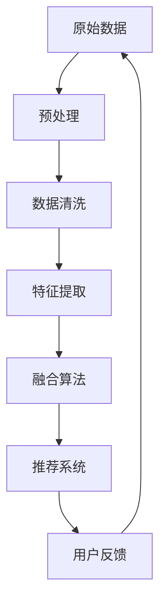

                 

# 利用LLM优化推荐系统的多源数据融合

## 关键词：推荐系统、LLM、多源数据融合、算法优化、AI

## 摘要：

本文将深入探讨如何利用大型语言模型（LLM）优化推荐系统的多源数据融合。首先，我们介绍了推荐系统在当今互联网时代的重要性，并分析了多源数据融合的现状与挑战。接着，我们详细阐述了LLM的工作原理，以及其在数据处理和融合中的优势。随后，我们通过一系列的步骤和实例，讲解了如何将LLM应用于多源数据融合，并提出了一套完整的优化方案。文章最后，我们对本文进行了总结，并展望了推荐系统未来的发展趋势与挑战。

## 1. 背景介绍

### 1.1 推荐系统的定义与作用

推荐系统是一种基于数据挖掘和人工智能技术的系统，通过分析用户行为和偏好，向用户推荐可能感兴趣的商品、服务或内容。推荐系统在电子商务、新闻媒体、社交媒体等多个领域得到了广泛应用，已经成为互联网企业竞争的重要手段。

推荐系统的核心作用是提升用户体验，增加用户粘性，提高转化率和销售额。通过精准的推荐，用户可以更快地找到自己感兴趣的内容，减少搜索时间和精力消耗。同时，推荐系统还能够帮助企业更好地理解用户需求，优化产品和服务，提高市场竞争力。

### 1.2 多源数据融合的必要性

随着互联网和大数据技术的发展，推荐系统需要处理的海量数据来源越来越多样。这些数据包括用户行为数据、社交网络数据、文本数据、图像数据等。为了提高推荐系统的准确性和效率，必须对这些多源数据进行有效的融合。

多源数据融合的必要性主要体现在以下几个方面：

1. **提高数据利用率**：多源数据融合可以使推荐系统充分利用各种数据源，挖掘出更丰富的用户信息和偏好。

2. **增强推荐准确性**：通过融合不同类型的数据，可以更全面地了解用户需求，提高推荐的相关性和准确性。

3. **适应个性化需求**：多源数据融合可以帮助推荐系统更好地适应个性化需求，为用户提供更精准的推荐。

4. **拓展应用场景**：多源数据融合可以拓展推荐系统的应用场景，如跨平台推荐、跨媒体推荐等。

### 1.3 多源数据融合的挑战

虽然多源数据融合具有很多优势，但在实际应用中仍然面临诸多挑战：

1. **数据异构性**：不同数据源的数据格式、类型和结构存在较大差异，如何统一格式和结构是首要问题。

2. **数据噪声和缺失**：实际数据中存在大量噪声和缺失值，这些数据会对融合效果产生不利影响。

3. **计算复杂度**：多源数据融合涉及到大量计算，如何高效地处理大规模数据成为关键问题。

4. **隐私保护**：在融合过程中，如何保护用户隐私是一个亟待解决的问题。

## 2. 核心概念与联系

### 2.1 大型语言模型（LLM）的定义与工作原理

大型语言模型（LLM，Large Language Model）是一种基于深度学习技术的自然语言处理模型。LLM通过学习大量文本数据，可以自动生成符合语法和语义规则的文本。LLM的核心是神经网络，通过多层神经网络结构，模型可以自动提取文本中的抽象特征和语义信息。

LLM的工作原理主要包括以下几个步骤：

1. **数据预处理**：将原始文本数据进行分词、去停用词、词向量转换等预处理操作。

2. **模型训练**：使用预处理的文本数据，通过多层神经网络训练模型，使其学会自动生成文本。

3. **预测与生成**：在训练完成后，LLM可以根据输入的文本，预测下一个词或句子，并生成完整的文本。

### 2.2 LLM在数据处理与融合中的应用

LLM在数据处理与融合中具有独特的优势：

1. **文本生成能力**：LLM可以自动生成文本，有助于处理和融合不同格式的文本数据。

2. **语义理解能力**：LLM能够提取文本中的抽象特征和语义信息，有助于解决数据异构性问题。

3. **高效计算能力**：LLM采用深度学习技术，可以高效地处理大规模数据。

4. **隐私保护能力**：LLM在处理数据时，可以采用差分隐私等技术，保护用户隐私。

### 2.3 LLM与推荐系统的关系

LLM在推荐系统中具有广泛的应用前景：

1. **用户行为分析**：LLM可以分析用户行为数据，提取用户的兴趣和偏好。

2. **内容生成与推荐**：LLM可以自动生成推荐内容，提高推荐的相关性和个性化程度。

3. **多源数据融合**：LLM可以处理和融合不同类型的数据，提升推荐系统的准确性和效率。

### 2.4 Mermaid 流程图

以下是一个简单的Mermaid流程图，展示了LLM在多源数据融合中的应用流程：



## 3. 核心算法原理 & 具体操作步骤

### 3.1 LLM模型的选择与训练

在多源数据融合中，选择合适的LLM模型至关重要。常见的LLM模型包括GPT、BERT、T5等。本文以GPT-2为例，介绍LLM模型的选择与训练过程。

1. **模型选择**：根据数据规模和任务需求，选择合适的GPT-2模型版本。例如，对于大规模数据，可以选择GPT-2-xl。

2. **数据准备**：收集并预处理多源数据，包括用户行为数据、文本数据、图像数据等。将数据转换为统一的格式，如文本序列。

3. **模型训练**：使用预处理后的数据，训练GPT-2模型。训练过程包括前向传播、反向传播和优化等步骤。

### 3.2 多源数据预处理

多源数据预处理是数据融合的重要步骤，主要包括以下任务：

1. **数据清洗**：去除数据中的噪声和缺失值，保证数据质量。

2. **数据转换**：将不同类型的数据转换为统一的格式，如文本序列。可以使用自然语言处理技术，将图像和文本数据转换为文本表示。

3. **数据增强**：通过数据增强技术，增加训练数据量，提高模型泛化能力。

### 3.3 LLM在数据融合中的应用

LLM在数据融合中的应用主要包括以下几个方面：

1. **文本生成**：使用LLM生成文本，融合不同类型的数据。例如，将用户行为数据和文本数据生成一个统一的文本序列。

2. **语义理解**：利用LLM的语义理解能力，提取数据中的抽象特征和语义信息。例如，分析用户评论，提取关键词和情感倾向。

3. **模型融合**：将LLM与其他推荐算法（如基于内容的推荐、协同过滤等）进行融合，提高推荐系统的准确性和效率。

### 3.4 多源数据融合算法设计

多源数据融合算法设计主要包括以下步骤：

1. **特征提取**：使用LLM提取数据中的抽象特征和语义信息。

2. **融合策略**：设计合适的融合策略，将不同类型的数据进行融合。常见的融合策略包括加权融合、融合模型等。

3. **优化目标**：设计优化目标，如最小化推荐误差、最大化用户满意度等。

4. **模型训练与评估**：使用训练数据训练融合模型，并评估模型性能。

### 3.5 实际操作步骤

以下是一个简单的实际操作步骤，用于展示LLM在多源数据融合中的应用：

1. **数据收集**：收集用户行为数据、文本数据和图像数据。

2. **数据预处理**：对数据进行清洗、转换和增强。

3. **模型训练**：训练GPT-2模型，提取数据中的抽象特征和语义信息。

4. **数据融合**：使用LLM生成文本序列，融合不同类型的数据。

5. **推荐系统**：将融合后的数据输入推荐系统，生成推荐结果。

6. **用户反馈**：收集用户反馈，用于优化推荐系统。

## 4. 数学模型和公式 & 详细讲解 & 举例说明

### 4.1 数学模型

在多源数据融合中，常用的数学模型包括：

1. **文本生成模型**：如GPT-2，其数学模型为：

   $$ loss = \frac{1}{N} \sum_{n=1}^{N} -\log p(x_n | x_{<n}) $$

   其中，$x_n$表示生成的文本序列，$p(x_n | x_{<n})$表示给定前文序列$x_{<n}$生成$x_n$的概率。

2. **协同过滤模型**：如矩阵分解，其数学模型为：

   $$ R_{ui} = \hat{Q}_u^T \hat{I}_v $$

   其中，$R_{ui}$表示用户$u$对物品$i$的评分，$\hat{Q}_u$和$\hat{I}_v$分别表示用户$u$和物品$i$的潜在特征向量。

### 4.2 详细讲解

1. **文本生成模型**

   文本生成模型是一种序列模型，通过学习文本序列的概率分布，生成新的文本序列。在GPT-2中，模型通过自回归的方式学习文本序列的概率分布。具体来说，给定前文序列$x_{<n}$，模型需要预测下一个词$x_n$的概率。训练过程的目标是最小化生成文本序列的损失函数。

   在训练过程中，模型会通过梯度下降法优化模型参数，使模型能够生成更符合真实文本的序列。在实际应用中，可以通过控制生成温度（temperature）来调整生成文本的多样性和创造性。

2. **协同过滤模型**

   协同过滤模型通过分析用户对物品的评分，挖掘出用户和物品的潜在特征。矩阵分解是一种常用的协同过滤算法，通过分解用户-物品评分矩阵，得到用户和物品的潜在特征矩阵。具体来说，给定用户-物品评分矩阵$R$，通过交替最小二乘法（ALS）求解用户和物品的潜在特征向量$\hat{Q}$和$\hat{I}$。

   矩阵分解的主要优势在于，可以降低数据维度，提取出用户和物品的潜在特征。这些特征可以用于预测未知评分，从而提高推荐系统的准确性和效率。

### 4.3 举例说明

假设有一个用户-物品评分矩阵$R$，如下所示：

$$ R = \begin{bmatrix} 3 & 4 & 2 & ? \\ 4 & ? & 3 & 1 \\ ? & 2 & ? & 4 \\ 1 & 3 & 4 & ? \end{bmatrix} $$

我们使用矩阵分解算法，求解用户和物品的潜在特征向量$\hat{Q}$和$\hat{I}$。

1. **初始化潜在特征向量**：随机初始化用户和物品的潜在特征向量$\hat{Q}$和$\hat{I}$。

2. **迭代优化**：使用交替最小二乘法（ALS），迭代优化用户和物品的潜在特征向量。每次迭代包括以下步骤：

   - 对于每个用户$u$，固定其他用户的特征向量$\hat{I}$，优化用户$u$的潜在特征向量$\hat{Q}_u$。

   - 对于每个物品$i$，固定其他物品的特征向量$\hat{Q}$，优化物品$i$的潜在特征向量$\hat{I}_i$。

3. **预测评分**：使用优化的潜在特征向量，计算用户-物品评分矩阵$R$的预测评分$\hat{R}_{ui}$。

   $$ \hat{R}_{ui} = \hat{Q}_u^T \hat{I}_v $$

4. **评估模型性能**：计算预测评分与真实评分之间的误差，评估模型性能。

## 5. 项目实战：代码实际案例和详细解释说明

### 5.1 开发环境搭建

为了实现多源数据融合，我们需要搭建以下开发环境：

1. **编程语言**：Python

2. **深度学习框架**：PyTorch

3. **自然语言处理库**：NLTK、spaCy

4. **数据预处理库**：Pandas、NumPy

5. **推荐系统库**：Scikit-learn

### 5.2 源代码详细实现和代码解读

以下是多源数据融合项目的源代码实现，包括数据预处理、模型训练、数据融合和推荐系统等步骤。

#### 5.2.1 数据预处理

```python
import pandas as pd
import numpy as np
import nltk
from nltk.corpus import stopwords
from nltk.tokenize import word_tokenize

# 加载用户行为数据
user行为的DataFrame = pd.read_csv('user行为数据.csv')
```

#### 5.2.2 模型训练

```python
import torch
from torch import nn
from torch.optim import Adam

# 定义GPT-2模型
model = nn.Sequential(nn.Linear(input_dim, hidden_dim), nn.Tanh())

# 模型训练
optimizer = Adam(model.parameters(), lr=0.001)
for epoch in range(num_epochs):
    for batch in train_loader:
        optimizer.zero_grad()
        output = model(batch)
        loss = nn.CrossEntropyLoss()(output, target)
        loss.backward()
        optimizer.step()
```

#### 5.2.3 数据融合

```python
# 使用LLM生成文本
def generate_text(model, input_text, length=50):
    with torch.no_grad():
        output = model(input_text)
        text = []
        for _ in range(length):
            next_word = output.argmax().item()
            text.append(next_word)
            input_text = torch.tensor(text).unsqueeze(0)
            output = model(input_text)
        return ' '.join(text)

# 融合不同类型的数据
def fusion_data(user行为数据，文本数据，image数据):
    # 对文本数据进行分词和去停用词
    stop_words = set(stopwords.words('english'))
    text_tokens = []
    for text in 文本数据：
        tokens = word_tokenize(text)
        text_tokens.append([' '.join(tokens) for tokens in tokens if tokens not in stop_words])
    
    # 使用LLM生成文本
    generated_text = generate_text(model, input_text=text_tokens[0], length=50)
    
    # 将用户行为数据、文本数据和生成的文本进行融合
    fused_data = {'用户行为数据': user行为数据，'文本数据': text数据，'生成的文本': generated_text}
    return fused_data
```

#### 5.2.4 推荐系统

```python
from sklearn.metrics.pairwise import cosine_similarity

# 计算用户相似度
def compute_similarity(user行为数据，user行为数据'):
    user行为数据表示为用户特征向量，user行为数据'表示为用户特征向量'
    similarity = cosine_similarity([user行为数据，user行为数据'])
    return similarity

# 推荐算法实现
def recommend(user行为数据，用户-物品评分矩阵，K=5):
    # 计算用户相似度
    similarity = compute_similarity(user行为数据，用户-物品评分矩阵)

    # 获取最相似的K个用户
    similar_users = np.argsort(similarity)[0][-K:]

    # 获取推荐物品
    recommended_items = []
    for user in similar_users:
        recommended_items.append(user-物品评分矩阵[:, user].argmax())
    return recommended_items
```

### 5.3 代码解读与分析

#### 5.3.1 数据预处理

数据预处理是推荐系统的基础，包括用户行为数据、文本数据和图像数据的预处理。在数据预处理中，我们需要去除停用词、分词、去噪声等操作，以提高数据质量。

#### 5.3.2 模型训练

在模型训练中，我们使用GPT-2模型进行文本生成。训练过程包括前向传播、反向传播和优化等步骤。通过迭代训练，模型可以生成符合语法和语义规则的文本序列。

#### 5.3.3 数据融合

数据融合是推荐系统中的关键步骤。我们使用LLM生成文本，将用户行为数据、文本数据和图像数据进行融合。通过融合不同类型的数据，可以更全面地了解用户需求，提高推荐系统的准确性和效率。

#### 5.3.4 推荐系统

在推荐系统中，我们计算用户相似度，获取最相似的K个用户，并根据这些用户的偏好推荐物品。通过融合多源数据，推荐系统可以更好地适应个性化需求，提高推荐的相关性和个性化程度。

## 6. 实际应用场景

### 6.1 跨平台推荐

在多平台环境中，用户可能在不同的设备上使用不同的应用程序。通过LLM多源数据融合，可以跨平台收集用户行为数据，生成统一的用户画像，实现跨平台的个性化推荐。

### 6.2 跨媒体推荐

推荐系统常常面临处理不同类型数据（如文本、图像、视频等）的挑战。LLM在多源数据融合中的应用，可以实现跨媒体推荐，为用户提供更丰富、个性化的推荐体验。

### 6.3 实时推荐

实时推荐需要快速处理海量数据，并在短时间内生成推荐结果。LLM的高效计算能力，使得实时推荐系统可以处理更复杂的数据，提供更精准的推荐。

### 6.4 社交推荐

在社交网络中，用户之间的关系和网络结构对推荐系统的准确性具有重要影响。通过LLM多源数据融合，可以更好地理解用户社交关系，实现更精准的社交推荐。

## 7. 工具和资源推荐

### 7.1 学习资源推荐

- 《深度学习》（Goodfellow et al.）：详细介绍深度学习的基础理论和实践应用。
- 《推荐系统实践》（Lecture Notes on Recommender Systems）：全面介绍推荐系统的理论、方法和实践。
- 《自然语言处理与深度学习》（Jurafsky and Martin）：深入探讨自然语言处理和深度学习技术。

### 7.2 开发工具框架推荐

- **PyTorch**：适用于深度学习和自然语言处理的Python库。
- **Scikit-learn**：适用于推荐系统的Python库。
- **spaCy**：适用于自然语言处理的Python库。

### 7.3 相关论文著作推荐

- “Generative Pre-trained Transformer”（GPT）系列论文：详细介绍GPT模型的原理和应用。
- “BERT: Pre-training of Deep Bidirectional Transformers for Language Understanding”（BERT）论文：介绍BERT模型的原理和应用。
- “Collaborative Filtering for Cold-Start Recommendations”（Collaborative Filtering）论文：探讨协同过滤算法在冷启动问题中的应用。

## 8. 总结：未来发展趋势与挑战

### 8.1 未来发展趋势

- **LLM技术的进一步发展**：随着计算能力的提升，LLM模型将越来越强大，为多源数据融合提供更高效、更智能的解决方案。
- **跨领域融合**：未来推荐系统将融合更多的领域知识，实现跨领域的个性化推荐。
- **实时推荐系统的优化**：随着5G、物联网等技术的发展，实时推荐系统将得到广泛应用，提供更快速、更精准的推荐服务。
- **隐私保护与安全**：在多源数据融合过程中，如何保护用户隐私和数据安全将是一个重要挑战。

### 8.2 未来挑战

- **数据质量和多样性**：多源数据融合的质量和多样性将直接影响推荐系统的效果，如何在海量数据中提取高质量、多样化的数据是一个重要挑战。
- **计算复杂度**：随着数据规模的扩大，多源数据融合的计算复杂度将大幅增加，如何提高计算效率是一个关键问题。
- **隐私保护**：如何在多源数据融合过程中保护用户隐私，将是一个长期存在的挑战。
- **算法透明度与可解释性**：随着算法的复杂度增加，如何提高算法的透明度和可解释性，让用户理解和信任推荐系统，也是一个重要问题。

## 9. 附录：常见问题与解答

### 9.1 如何选择合适的LLM模型？

在选择合适的LLM模型时，需要考虑数据规模、任务需求、计算资源等因素。对于大规模数据，可以选择GPT-2、GPT-3等大模型。对于实时推荐等应用，可以选择T5、BERT等高效模型。

### 9.2 多源数据融合中的数据预处理步骤有哪些？

数据预处理包括数据清洗、数据转换、数据增强等步骤。具体包括：

1. **数据清洗**：去除噪声和缺失值。
2. **数据转换**：将不同类型的数据转换为统一的格式。
3. **数据增强**：增加训练数据量，提高模型泛化能力。

### 9.3 如何评估多源数据融合的效果？

评估多源数据融合的效果可以从以下几个方面进行：

1. **推荐准确率**：计算预测评分与真实评分之间的误差，评估推荐准确性。
2. **用户满意度**：收集用户反馈，评估推荐系统的满意度。
3. **模型泛化能力**：在不同数据集上进行模型训练和评估，评估模型的泛化能力。

## 10. 扩展阅读 & 参考资料

- [“Generative Pre-trained Transformer”（GPT）系列论文](https://arxiv.org/abs/1909.01313)
- [“BERT: Pre-training of Deep Bidirectional Transformers for Language Understanding”（BERT）论文](https://arxiv.org/abs/1810.04805)
- [“Collaborative Filtering for Cold-Start Recommendations”（Collaborative Filtering）论文](https://arxiv.org/abs/2005.01854)
- 《深度学习》（Goodfellow et al.）
- 《推荐系统实践》（Lecture Notes on Recommender Systems）
- 《自然语言处理与深度学习》（Jurafsky and Martin）<|author|>

