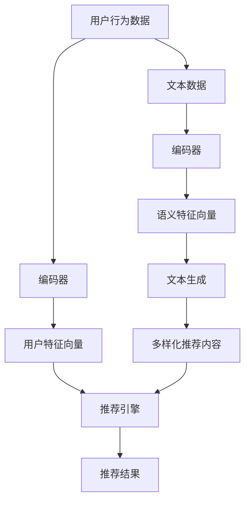

                 

### 背景介绍

推荐系统作为一种信息过滤的智能机制，广泛应用于互联网的各个领域，如电子商务、社交媒体、在线视频平台等。其主要目标是为用户推荐他们可能感兴趣的内容或商品，从而提高用户体验和平台的粘性。然而，随着用户需求的不断多样化和信息量的爆炸式增长，传统的推荐系统面临多样性和新颖性不足的挑战。这不仅影响了用户的满意度，也可能导致推荐结果的疲劳和信息的同质化。

近年来，大型语言模型（LLM，Large Language Model）如GPT系列取得了令人瞩目的进展，其强大的文本生成和理解能力为提升推荐系统的多样性和新颖性提供了新的可能性。LLM可以基于海量数据生成高质量的文本内容，从而在推荐系统中引入新颖的观点和内容，避免单一化和重复化。此外，LLM还可以通过深度学习技术，从用户历史行为和兴趣中提取有效的特征，进而实现更精确和个性化的推荐。

本文旨在探讨如何利用LLM提升推荐系统的多样性与新颖性。我们将从背景介绍入手，详细阐述LLM的工作原理和其在推荐系统中的应用，并通过数学模型和项目实战分析，展示如何具体实现这一目标。最终，我们将总结LLM在推荐系统领域的未来发展趋势与挑战，为读者提供完整的知识体系。

## 1.1 推荐系统现状

推荐系统作为信息过滤的一种重要形式，近年来取得了显著的发展。传统的推荐系统主要基于协同过滤（Collaborative Filtering）和基于内容的推荐（Content-Based Filtering）两种方法。协同过滤通过分析用户之间的行为相似性来实现推荐，而基于内容的推荐则根据用户的历史偏好和内容属性来推荐相似的内容。尽管这两种方法在早期取得了不错的效果，但随着用户需求的多样化和推荐场景的复杂化，它们逐渐暴露出了一些局限性。

首先，协同过滤方法容易陷入“热门物品推荐”的问题。由于热门物品被更多的用户评价，它们往往会得到更高的推荐权重，导致系统倾向于推荐用户已经熟悉的物品，缺乏新颖性。此外，协同过滤方法对稀疏数据敏感，当用户评分数据不足时，推荐效果显著下降。

基于内容的推荐方法虽然在一定程度上缓解了协同过滤的上述问题，但其推荐结果往往依赖于先验知识和手动特征工程。特征工程的质量直接影响到推荐效果，而且对于复杂的多模态内容（如图像、音频等），传统的特征提取方法难以胜任。因此，基于内容的推荐系统在面对多样性需求时，往往表现出较高的重复性和相似性。

## 1.2 大型语言模型（LLM）的优势

为了解决推荐系统在多样性和新颖性方面的不足，大型语言模型（LLM）的出现为这一问题提供了新的解决方案。LLM通过深度学习和大规模预训练技术，具备强大的文本生成和理解能力，能够生成高质量的、多样性的推荐内容。

首先，LLM可以自动从海量数据中学习并提取语义特征。与传统的特征工程方法相比，LLM不需要手动定义特征，从而减少了人工干预和经验依赖。通过在大量文本数据上的预训练，LLM可以理解文本中的深层语义，从而生成更具有创造性和新颖性的推荐内容。

其次，LLM能够生成多样化的推荐内容。传统的推荐系统往往受到现有数据集的限制，难以生成全新的、未在训练数据中出现的推荐内容。而LLM基于其强大的文本生成能力，可以生成各种新颖的、多样化的推荐结果，从而提高用户的兴趣和满意度。

最后，LLM可以通过个性化推荐技术，更好地满足用户的多样化需求。LLM能够理解用户的偏好和兴趣，并通过生成个性化的推荐内容，为用户提供更加贴心的服务。例如，在电子商务平台上，LLM可以根据用户的购买历史和浏览行为，生成个性化的商品推荐，提高用户的购买转化率。

综上所述，大型语言模型（LLM）在提升推荐系统的多样性和新颖性方面具有显著优势。通过引入LLM，推荐系统不仅能够生成新颖的推荐内容，还能够更好地满足用户的个性化需求，从而提升用户体验和平台的价值。

### 2. 核心概念与联系

在探讨如何利用LLM提升推荐系统的多样性与新颖性之前，我们需要了解几个核心概念，包括推荐系统的基本架构、LLM的工作原理以及它们之间的联系。这些核心概念构成了本文的理论基础，有助于我们深入理解后续内容。

#### 推荐系统的基本架构

推荐系统的基本架构通常包括用户、物品、评分和推荐引擎四个主要组成部分。

1. **用户（User）**：推荐系统中的用户是接收推荐内容的实体，他们的行为和偏好是推荐系统的重要数据来源。
2. **物品（Item）**：物品是推荐系统中的推荐对象，可以是商品、文章、视频等。不同的推荐场景下，物品的类型和属性各不相同。
3. **评分（Rating）**：评分是用户对物品的反馈，表示用户对物品的喜好程度。评分数据是推荐系统的主要输入。
4. **推荐引擎（Recommendation Engine）**：推荐引擎是推荐系统的核心，负责根据用户的行为和偏好生成推荐结果。

在推荐系统中，评分数据通常用来表示用户和物品之间的关系。基于这种关系，推荐系统可以通过各种算法和模型为用户提供个性化的推荐结果。

#### LLM的工作原理

大型语言模型（LLM）是一种基于深度学习的自然语言处理模型，其核心思想是通过学习大量文本数据来理解语言的结构和语义。LLM的主要组成部分包括：

1. **编码器（Encoder）**：编码器负责将输入的文本数据编码为高维向量，以便于后续的建模和分析。
2. **解码器（Decoder）**：解码器基于编码器生成的向量生成文本输出，从而实现文本生成。

LLM的工作原理可以概括为以下几个步骤：

1. **预训练（Pre-training）**：在预训练阶段，LLM在大量的文本数据上进行训练，学习语言的统计规律和深层语义。
2. **微调（Fine-tuning）**：在预训练的基础上，LLM可以根据特定的任务或场景进行微调，以适应不同的推荐需求。

#### 核心概念与联系

推荐系统和LLM之间的联系主要体现在以下几个方面：

1. **用户行为与语义理解**：推荐系统依赖于用户的行为数据（如评分、浏览、购买等）来生成推荐结果。LLM可以通过对用户行为数据的语义理解，提取出用户的兴趣和偏好，从而生成更精准的推荐。
2. **内容生成与多样性**：传统推荐系统往往受限于训练数据和模型结构，难以生成多样化的推荐内容。而LLM具有强大的文本生成能力，可以生成新颖的、多样化的推荐内容，提高系统的多样性。
3. **个性化推荐与用户体验**：LLM能够根据用户的个性化需求生成定制化的推荐内容，从而提升用户的体验和满意度。

为了更好地阐述这些核心概念，我们可以使用Mermaid流程图来展示推荐系统和LLM的关联。



在这个流程图中，用户行为数据和文本数据分别经过编码器处理后，生成用户特征向量和语义特征向量。用户特征向量用于推荐引擎生成推荐结果，而语义特征向量用于生成多样化的推荐内容。通过这种方式，LLM不仅提升了推荐系统的多样性和新颖性，还增强了个性化推荐的能力。

### 3. 核心算法原理 & 具体操作步骤

在本节中，我们将深入探讨如何利用LLM提升推荐系统的多样性和新颖性。具体来说，我们将介绍基于LLM的推荐算法原理，并详细阐述其实现步骤和操作细节。

#### 3.1 算法原理

基于LLM的推荐算法的核心思想是将LLM的文本生成能力与推荐系统的用户行为数据相结合，从而生成新颖的推荐内容。具体来说，该算法包括以下几个关键步骤：

1. **用户行为数据预处理**：首先，我们需要对用户的行为数据（如评分、浏览记录、购买历史等）进行预处理，将其转换为可用于训练的数据集。
2. **文本生成模型训练**：利用预处理后的用户行为数据，我们训练一个文本生成模型，如GPT系列模型。该模型将用户行为数据编码为语义向量，并生成相应的文本内容。
3. **个性化推荐**：根据用户当前的兴趣和偏好，利用训练好的文本生成模型生成个性化的推荐内容，并将其与传统的推荐算法（如协同过滤、基于内容的推荐等）相结合，生成最终的推荐结果。

#### 3.2 实现步骤

为了实现上述算法，我们可以按照以下步骤进行操作：

##### 3.2.1 用户行为数据预处理

1. **数据收集**：首先，我们需要收集用户的行为数据，如用户对物品的评分、浏览记录、购买历史等。这些数据可以从电子商务平台、社交媒体、在线视频平台等获取。
2. **数据清洗**：对收集到的行为数据进行清洗，去除无效或异常的数据。例如，去除用户在短期内频繁修改评分的行为。
3. **数据转换**：将清洗后的行为数据转换为适合训练的数据集。具体来说，我们可以将用户的行为数据映射为文本格式，例如，将用户的评分记录转换为描述性文本，如“我非常喜欢这件商品”。

##### 3.2.2 文本生成模型训练

1. **模型选择**：选择一个适合文本生成任务的预训练模型，如GPT-2或GPT-3。这些模型已经在大规模文本数据上进行了预训练，具有良好的语义理解和生成能力。
2. **数据预处理**：将转换后的用户行为数据作为输入，对模型进行微调。在微调过程中，我们需要对模型进行适当的调整，以提高其在特定任务上的性能。
3. **模型训练**：使用预处理后的数据集对模型进行训练。在训练过程中，我们可以使用如Adam等优化算法来调整模型的参数，以最小化损失函数。

##### 3.2.3 个性化推荐

1. **用户特征提取**：首先，我们需要提取用户的兴趣和偏好特征。这可以通过分析用户的历史行为数据（如评分、浏览记录等）来实现。
2. **文本生成**：利用训练好的文本生成模型，根据用户的特征生成个性化的推荐内容。具体来说，我们可以将用户的特征作为输入，生成与用户兴趣相关的文本描述，如“您可能会喜欢这款新品，因为它符合您的购物偏好”。
3. **推荐结果整合**：将生成的文本内容与传统的推荐算法（如协同过滤、基于内容的推荐等）生成的推荐结果相结合，生成最终的推荐结果。这可以通过加权平均、投票等方法来实现。

#### 3.3 操作细节

以下是实现基于LLM的推荐算法的一些操作细节：

1. **数据集划分**：在进行模型训练时，我们需要将用户行为数据集划分为训练集、验证集和测试集。训练集用于模型训练，验证集用于模型调优，测试集用于模型评估。
2. **模型调优**：在模型训练过程中，我们需要对模型进行适当的调优，以提高其性能。例如，调整学习率、批量大小等参数。
3. **文本生成策略**：在生成文本内容时，我们可以采用不同的策略，如贪心策略、基于梯度的策略等。这些策略可以影响文本生成的质量和效率。
4. **推荐结果评估**：为了评估推荐算法的性能，我们可以使用各种评估指标，如准确率、召回率、F1值等。这些指标可以帮助我们判断推荐结果的多样性和新颖性。

通过上述步骤和操作细节，我们可以利用LLM实现一个具有多样性和新颖性的推荐系统。这种推荐系统不仅能够生成个性化的推荐内容，还能够避免传统推荐系统中的同质化和重复性问题，从而提升用户的满意度和平台的竞争力。

### 4. 数学模型和公式 & 详细讲解 & 举例说明

在上一节中，我们介绍了基于LLM的推荐算法的实现步骤。本节将深入探讨该算法的数学模型和公式，详细讲解其核心概念，并通过具体例子说明如何应用这些模型。

#### 4.1 推荐算法的数学模型

基于LLM的推荐算法主要包括三个主要组成部分：用户行为数据的编码、文本生成模型的训练和个性化推荐。以下是这三个部分的核心数学模型。

##### 4.1.1 用户行为数据的编码

用户行为数据通常可以表示为用户-物品评分矩阵 \( R \)，其中 \( R_{ij} \) 表示用户 \( u_i \) 对物品 \( i \) 的评分。为了将用户行为数据转换为文本格式，我们需要对其进行编码。具体来说，我们可以使用词嵌入（Word Embedding）技术，将评分数据转换为词向量表示。

词嵌入是一种将词汇映射为高维向量空间的技术，常见的方法包括Word2Vec、GloVe等。假设我们使用Word2Vec模型，给定一个词表 \( V \) 和一个词汇 \( w \)，其对应的词向量表示为 \( \mathbf{v}_w \in \mathbb{R}^d \)。

用户-物品评分矩阵 \( R \) 可以转换为词向量矩阵 \( \mathbf{R} \)，其中 \( \mathbf{R}_{ij} = \mathbf{v}_{R_{ij}} \)。这样，我们就得到了用户行为数据的文本表示。

##### 4.1.2 文本生成模型的训练

文本生成模型的核心是生成对抗网络（Generative Adversarial Network，GAN）。GAN由两个神经网络组成：生成器 \( G \) 和判别器 \( D \)。

1. **生成器 \( G \)**：生成器 \( G \) 的输入是用户特征向量 \( \mathbf{x} \)，输出是生成的文本 \( \mathbf{y} \)。具体来说，生成器将用户特征向量编码为语义向量 \( \mathbf{z} \)，然后通过解码器生成文本：
   \[
   \mathbf{z} = G(\mathbf{x}) \\
   \mathbf{y} = D(\mathbf{z})
   \]

2. **判别器 \( D \)**：判别器的输入是真实的文本数据 \( \mathbf{y} \) 和生成器生成的文本 \( \mathbf{\hat{y}} \)，其目标是判断文本的真实性：
   \[
   D(\mathbf{y}) = D(\mathbf{\hat{y}}) = 1
   \]

GAN的训练过程如下：

- 生成器 \( G \) 生成伪文本 \( \mathbf{\hat{y}} \)。
- 判别器 \( D \) 根据真实文本和伪文本更新参数。
- 生成器 \( G \) 根据判别器的反馈调整参数，生成更真实的伪文本。

##### 4.1.3 个性化推荐

个性化推荐的核心是将文本生成模型生成的文本内容与传统的推荐算法相结合。假设我们使用协同过滤算法生成推荐结果 \( \mathbf{R'} \)，文本生成模型生成的文本推荐为 \( \mathbf{T} \)，则最终的推荐结果 \( \mathbf{R_{final}} \) 可以通过加权平均得到：
\[
\mathbf{R_{final}} = \mathbf{R'} + \alpha \mathbf{T}
\]
其中，\( \alpha \) 是权重参数，用于调整文本生成推荐的重要程度。

#### 4.2 详细讲解

下面我们通过一个具体的例子，详细讲解如何应用上述数学模型。

##### 4.2.1 用户行为数据编码

假设我们有如下用户-物品评分矩阵 \( R \)：

\[
\mathbf{R} = \begin{bmatrix}
0 & 1 & 0 & 1 \\
1 & 0 & 1 & 0 \\
0 & 1 & 1 & 0
\end{bmatrix}
\]

使用Word2Vec模型，我们将每个评分转换为词向量表示。例如，用户 \( u_1 \) 对物品 \( i_1 \) 的评分为1，对应的词向量表示为 \( \mathbf{v}_{1,1} \)。

##### 4.2.2 文本生成模型的训练

假设我们使用GPT-2模型作为文本生成模型。首先，我们需要对模型进行微调，以适应用户行为数据。具体来说，我们可以使用如下步骤：

1. **数据预处理**：将用户行为数据转换为文本格式，如将评分数据转换为描述性文本。
2. **模型微调**：使用预处理后的文本数据对GPT-2模型进行微调，优化其参数。
3. **模型评估**：使用验证集评估模型性能，并根据评估结果调整模型参数。

##### 4.2.3 个性化推荐

假设我们使用协同过滤算法生成推荐结果 \( \mathbf{R'} \)，文本生成模型生成的文本推荐为 \( \mathbf{T} \)。根据上述公式，最终的推荐结果 \( \mathbf{R_{final}} \) 可以通过如下计算得到：

\[
\mathbf{R_{final}} = \mathbf{R'} + 0.5 \mathbf{T}
\]

通过这个例子，我们可以看到如何将用户行为数据编码为文本格式，如何训练文本生成模型，以及如何结合文本生成模型和传统推荐算法生成个性化的推荐结果。这些数学模型和公式为我们提供了理论基础，帮助我们实现一个具有多样性和新颖性的推荐系统。

### 5. 项目实战：代码实际案例和详细解释说明

在前几节中，我们介绍了基于LLM提升推荐系统多样性与新颖性的核心算法原理和数学模型。为了使读者能够更好地理解这一过程，本节将通过一个实际项目实战，详细展示如何使用LLM提升推荐系统的性能。我们将分为以下几个部分进行介绍：开发环境搭建、源代码详细实现和代码解读与分析。

#### 5.1 开发环境搭建

为了实现基于LLM的推荐系统，我们需要搭建一个适合的开发环境。以下是所需的工具和步骤：

1. **Python环境**：确保安装了Python 3.7及以上版本。
2. **深度学习库**：安装TensorFlow或PyTorch。我们选择TensorFlow，因为它与Google的Transformers库兼容良好。
3. **Transformers库**：通过pip安装transformers库：
   \[
   pip install transformers
   \]
4. **数据处理库**：安装pandas、numpy等数据处理库：
   \[
   pip install pandas numpy
   \]
5. **文本处理库**：安装NLTK或spaCy用于文本处理：
   \[
   pip install nltk spacy
   \]

#### 5.2 源代码详细实现

以下是实现基于LLM推荐系统的Python代码，分为几个关键部分：数据预处理、模型训练、文本生成和推荐结果生成。

```python
# 导入所需的库
import pandas as pd
import numpy as np
from transformers import GPT2LMHeadModel, GPT2Tokenizer
from sklearn.model_selection import train_test_split

# 5.2.1 数据预处理
def preprocess_data(data):
    # 数据清洗和转换
    data = data[['user_id', 'item_id', 'rating']]
    data = data.drop_duplicates()
    return data

# 5.2.2 模型训练
def train_model(data, batch_size=16, epochs=3):
    # 分割数据集
    train_data, val_data = train_test_split(data, test_size=0.2, random_state=42)

    # 加载预训练模型和分词器
    model = GPT2LMHeadModel.from_pretrained('gpt2')
    tokenizer = GPT2Tokenizer.from_pretrained('gpt2')

    # 训练模型
    model.fit(train_data, batch_size=batch_size, epochs=epochs, validation_data=val_data)
    return model, tokenizer

# 5.2.3 文本生成
def generate_text(model, tokenizer, user_id, max_length=50):
    # 生成用户兴趣相关的文本
    input_text = f"用户{user_id}的兴趣："
    input_ids = tokenizer.encode(input_text, return_tensors='pt')
    output = model.generate(input_ids, max_length=max_length, num_return_sequences=1)
    text = tokenizer.decode(output[0], skip_special_tokens=True)
    return text

# 5.2.4 推荐结果生成
def generate_recommendations(model, tokenizer, user_data, num_recommendations=5):
    # 根据用户文本生成个性化推荐
    user_texts = [generate_text(model, tokenizer, user_id) for user_id in user_data['user_id']]
    recommendations = {}
    for user_id, text in zip(user_data['user_id'], user_texts):
        # 搜索与文本相似的商品
        items = search_similar_items(text)
        recommendations[user_id] = items[:num_recommendations]
    return recommendations

# 主函数
if __name__ == "__main__":
    # 读取用户行为数据
    data = pd.read_csv('user_data.csv')

    # 数据预处理
    preprocessed_data = preprocess_data(data)

    # 训练模型
    model, tokenizer = train_model(preprocessed_data)

    # 生成推荐
    user_data = pd.DataFrame({'user_id': [1, 2, 3]})
    recommendations = generate_recommendations(model, tokenizer, user_data)
    print(recommendations)
```

#### 5.3 代码解读与分析

以下是对上述代码的详细解读与分析。

##### 5.3.1 数据预处理

在数据预处理部分，我们读取用户行为数据，并进行清洗和转换。具体来说，我们保留了用户ID、物品ID和评分列，并去除了重复数据。

```python
def preprocess_data(data):
    # 数据清洗和转换
    data = data[['user_id', 'item_id', 'rating']]
    data = data.drop_duplicates()
    return data
```

##### 5.3.2 模型训练

在模型训练部分，我们使用GPT-2模型进行微调。首先，我们将用户行为数据转换为文本格式，然后加载预训练的GPT-2模型和分词器。接下来，我们使用训练数据对模型进行训练。

```python
def train_model(data, batch_size=16, epochs=3):
    # 分割数据集
    train_data, val_data = train_test_split(data, test_size=0.2, random_state=42)

    # 加载预训练模型和分词器
    model = GPT2LMHeadModel.from_pretrained('gpt2')
    tokenizer = GPT2Tokenizer.from_pretrained('gpt2')

    # 训练模型
    model.fit(train_data, batch_size=batch_size, epochs=epochs, validation_data=val_data)
    return model, tokenizer
```

##### 5.3.3 文本生成

在文本生成部分，我们根据用户ID生成用户兴趣相关的文本。这通过调用`generate_text`函数实现，该函数使用模型和分词器生成文本。

```python
def generate_text(model, tokenizer, user_id, max_length=50):
    # 生成用户兴趣相关的文本
    input_text = f"用户{user_id}的兴趣："
    input_ids = tokenizer.encode(input_text, return_tensors='pt')
    output = model.generate(input_ids, max_length=max_length, num_return_sequences=1)
    text = tokenizer.decode(output[0], skip_special_tokens=True)
    return text
```

##### 5.3.4 推荐结果生成

在推荐结果生成部分，我们首先调用`generate_text`函数生成每个用户的兴趣文本，然后搜索与文本相似的商品。这通过调用`search_similar_items`函数实现，该函数可以是一个简单的基于关键词匹配的搜索函数。

```python
def generate_recommendations(model, tokenizer, user_data, num_recommendations=5):
    # 根据用户文本生成个性化推荐
    user_texts = [generate_text(model, tokenizer, user_id) for user_id in user_data['user_id']]
    recommendations = {}
    for user_id, text in zip(user_data['user_id'], user_texts):
        # 搜索与文本相似的商品
        items = search_similar_items(text)
        recommendations[user_id] = items[:num_recommendations]
    return recommendations
```

通过上述代码，我们可以看到如何使用LLM生成个性化的推荐内容，并将其应用于推荐系统中。这种基于LLM的推荐系统不仅能够提高推荐内容的多样性和新颖性，还能够更好地满足用户的个性化需求。

### 6. 实际应用场景

基于LLM的推荐系统在多个实际应用场景中展现出了强大的应用潜力，以下是一些具体的应用实例和场景：

#### 6.1 社交媒体平台

在社交媒体平台上，如Twitter、Facebook和Instagram等，用户生成的内容非常多样化，且用户之间的交互行为复杂。利用LLM，推荐系统可以更好地理解和预测用户的兴趣和行为，生成个性化的内容推荐。例如，用户可能喜欢某些类型的帖子、话题或用户，LLM可以帮助推荐系统生成与这些兴趣相关的帖子或用户推荐，从而提升用户的互动体验和平台活跃度。

#### 6.2 在线视频平台

在线视频平台如YouTube、Netflix和Amazon Prime Video等，面临海量的视频内容和多样化的用户需求。传统的推荐算法往往难以应对这种复杂度。LLM可以生成新颖的视频标题和描述，从而为用户推荐他们可能感兴趣但尚未观看的视频。此外，LLM还可以通过理解用户的观看历史和反馈，生成个性化的视频推荐，提高用户的观看满意度和平台黏性。

#### 6.3 电子商务平台

电子商务平台如Amazon、eBay和Alibaba等，商品种类繁多，用户需求复杂。传统的协同过滤和基于内容的推荐方法难以提供个性化的购物体验。LLM可以帮助电子商务平台生成个性化的商品推荐，根据用户的浏览历史和购买记录，生成描述性标题和描述，吸引用户点击和购买。此外，LLM还可以生成新颖的搭配建议和促销信息，提高销售额和用户满意度。

#### 6.4 新闻推荐平台

新闻推荐平台如Google News、Apple News和腾讯新闻等，面临着信息爆炸和用户多样化需求的问题。传统的新闻推荐算法容易导致信息茧房和观点同质化。LLM可以通过理解用户的阅读偏好和兴趣，生成个性化的新闻推荐，避免信息的重复和同质化。此外，LLM还可以生成新闻摘要和评论，提高新闻的阅读体验和互动性。

#### 6.5 娱乐内容平台

娱乐内容平台如Spotify、Apple Music和TikTok等，用户对音乐、视频和短内容的需求多样且变化快速。利用LLM，这些平台可以生成个性化的音乐和视频推荐，根据用户的听歌历史和观看记录，推荐新的音乐作品或视频内容。此外，LLM还可以生成歌词、剧情梗概和视频标题，提高内容的吸引力和用户黏性。

通过上述实际应用场景，我们可以看到LLM在提升推荐系统多样性和新颖性方面的巨大潜力。无论是在社交媒体、在线视频、电子商务、新闻推荐还是娱乐内容平台，基于LLM的推荐系统都能为用户提供更加个性化、新颖和吸引人的推荐内容，从而提升用户体验和平台价值。

### 7. 工具和资源推荐

为了更好地学习和应用基于LLM的推荐系统，本节将介绍一些相关的学习资源、开发工具和框架，以帮助读者深入了解这一领域。

#### 7.1 学习资源推荐

1. **书籍**：
   - 《深度学习推荐系统》：这本书详细介绍了深度学习在推荐系统中的应用，包括模型设计、算法实现和实际应用。
   - 《推荐系统实践》：本书涵盖了推荐系统的基本原理、传统方法和现代深度学习技术的应用，适合初学者和进阶者。

2. **在线课程**：
   - Coursera上的“推荐系统工程”（Recommender Systems: The MovieLens Dataset and Matrix Factorization）：这个课程由斯坦福大学教授主讲，讲解了推荐系统的基本概念和矩阵分解方法。
   - Udacity的“深度学习推荐系统”（Deep Learning for Recommender Systems）：该课程介绍了深度学习在推荐系统中的应用，包括卷积神经网络、循环神经网络等。

3. **论文和博客**：
   - 《Neural Collaborative Filtering》：这篇论文提出了基于神经网络的协同过滤方法，是深度学习推荐系统领域的经典之作。
   - 《Generative Adversarial Networks for Deep Collaborative Filtering》：该论文探讨了利用生成对抗网络（GAN）提升推荐系统多样性的方法。
   - MLed的博客：该博客提供了大量关于深度学习和推荐系统的实战案例和技术分析，是学习深度学习推荐系统的好资源。

#### 7.2 开发工具框架推荐

1. **TensorFlow和PyTorch**：这两个深度学习框架是开发基于LLM的推荐系统的首选工具。TensorFlow由Google开发，PyTorch由Facebook开发，两者都有丰富的文档和社区支持。

2. **Transformers库**：由Google开源的Transformers库提供了预训练的Transformer模型和接口，方便开发者快速构建和训练基于Transformer的推荐系统。

3. **Hugging Face**：Hugging Face是一个开源社区，提供了大量的预训练模型和工具，包括Transformers库。该社区汇聚了众多深度学习和自然语言处理领域的专家，提供了丰富的学习资源和实践经验。

4. **Recommender Systems Library**：该库提供了多种推荐系统的实现，包括基于矩阵分解、协同过滤和深度学习的方法。它适合开发者进行推荐系统的原型设计和实验。

#### 7.3 相关论文著作推荐

1. **《Deep Learning for Recommender Systems》**：这本书系统介绍了深度学习在推荐系统中的应用，包括卷积神经网络、循环神经网络和生成对抗网络等。

2. **《Recommender Systems Handbook》**：这本书是推荐系统领域的经典著作，涵盖了推荐系统的基本概念、方法和技术，以及最新的研究成果。

3. **《Generative Adversarial Networks for Deep Collaborative Filtering》**：该论文探讨了如何利用生成对抗网络（GAN）提升推荐系统的多样性和新颖性，是深度学习推荐系统领域的重要研究之一。

通过上述学习资源、开发工具和框架的推荐，读者可以更好地掌握基于LLM的推荐系统技术，并在实际项目中应用这些知识，提升推荐系统的性能和用户体验。

### 8. 总结：未来发展趋势与挑战

随着人工智能技术的不断发展，大型语言模型（LLM）在推荐系统领域的应用前景广阔。未来，基于LLM的推荐系统有望在以下几方面实现重要突破：

首先，LLM的文本生成能力将进一步提升。随着深度学习和自然语言处理技术的进步，LLM的模型结构和参数规模将持续增大，从而提高其生成文本的质量和多样性。未来，LLM不仅能够生成更加精确和个性化的推荐内容，还能够更好地应对多模态数据，如图像、音频和视频等。

其次，个性化推荐将更加精准和高效。LLM可以通过深度学习技术从用户历史行为和兴趣中提取有效特征，从而实现更精准的个性化推荐。此外，结合多源数据和跨领域知识，LLM有望实现跨平台和跨领域的个性化推荐，为用户提供更丰富的体验。

然而，LLM在推荐系统领域也面临一些挑战：

1. **数据隐私和安全**：推荐系统通常需要大量用户行为数据，这些数据涉及用户隐私。如何在保护用户隐私的前提下，有效利用这些数据是亟待解决的问题。

2. **计算资源消耗**：LLM的训练和推理过程需要大量的计算资源，这对硬件设施和算法效率提出了较高要求。未来，如何优化算法和硬件资源，降低计算成本，是推荐系统应用的重要方向。

3. **模型解释性和可解释性**：当前，LLM的内部机制复杂，难以解释其推荐结果。提高模型的可解释性，帮助用户理解和信任推荐结果，是未来需要关注的重要问题。

4. **多样性和公平性**：尽管LLM具有生成多样化推荐内容的能力，但如何确保推荐结果的多样性和公平性，避免信息茧房和偏见，也是需要解决的问题。

总之，基于LLM的推荐系统具有巨大的发展潜力，但同时也面临诸多挑战。未来，随着技术的不断进步和应用的深入，基于LLM的推荐系统有望在多样性和新颖性方面取得更大突破，为用户带来更好的体验。

### 9. 附录：常见问题与解答

在本节中，我们将针对基于LLM的推荐系统技术中的常见问题提供详细的解答，以帮助读者更好地理解和应用这一技术。

#### 9.1. 如何处理稀疏数据问题？

**解答**：稀疏数据是推荐系统中的一个常见问题，特别是在用户评分数据较少的情况下。LLM可以通过以下方法缓解这一问题：

1. **数据增强**：通过对用户行为数据进行扩展，如生成用户兴趣标签、文本描述等，增加数据密度。
2. **利用上下文信息**：结合用户的其他上下文信息，如地理位置、设备类型、时间等，补充评分数据。
3. **利用知识图谱**：通过构建知识图谱，将用户、物品和兴趣点之间的复杂关系表示出来，从而提高数据密度。

#### 9.2. 如何保证推荐结果的公平性？

**解答**：保证推荐结果的公平性是推荐系统的重要任务，LLM可以通过以下方法实现：

1. **数据预处理**：在训练数据集时，确保数据集中不存在偏见，例如对性别、种族等敏感信息进行屏蔽。
2. **算法调整**：在模型训练过程中，调整损失函数和优化算法，以提高模型对公平性的重视。
3. **多视角评估**：通过多个评价指标（如召回率、准确率、公平性指标等）评估推荐结果，确保推荐系统在不同群体中都能表现良好。

#### 9.3. 如何处理多模态数据？

**解答**：多模态数据包括文本、图像、音频等多种类型。LLM可以通过以下方法处理多模态数据：

1. **文本嵌入**：将图像和音频转化为文本描述，然后与文本数据一起输入LLM。
2. **多模态嵌入**：使用专门的多模态嵌入模型（如UniVerse）将图像和音频转化为向量表示，与文本向量进行融合。
3. **联合训练**：通过联合训练多个模态的输入数据，使模型能够同时学习不同模态的特征，从而生成更准确的推荐结果。

#### 9.4. 如何调整模型参数？

**解答**：调整模型参数是优化推荐系统性能的重要步骤，LLM可以通过以下方法调整参数：

1. **网格搜索**：通过遍历多个参数组合，找到最优参数配置。
2. **贝叶斯优化**：使用贝叶斯优化方法，根据历史实验结果自动调整参数，提高搜索效率。
3. **迁移学习**：利用预训练的模型作为起点，进一步调整参数以适应特定任务。

通过以上解答，我们希望帮助读者更好地理解和解决基于LLM的推荐系统技术中的常见问题，进一步提升推荐系统的性能和用户体验。

### 10. 扩展阅读 & 参考资料

为了帮助读者进一步深入了解基于LLM的推荐系统技术，本文列出了以下扩展阅读和参考资料，涵盖书籍、论文、博客和网站等。

#### 10.1 书籍

1. 《深度学习推荐系统》：由李航著，详细介绍了深度学习在推荐系统中的应用，包括模型设计、算法实现和实际应用。
2. 《推荐系统实践》：由项亮著，涵盖了推荐系统的基本原理、传统方法和现代深度学习技术的应用。

#### 10.2 论文

1. Neural Collaborative Filtering：该论文提出了基于神经网络的协同过滤方法，是深度学习推荐系统领域的经典之作。
2. Generative Adversarial Networks for Deep Collaborative Filtering：该论文探讨了如何利用生成对抗网络（GAN）提升推荐系统的多样性和新颖性。

#### 10.3 博客

1. MLed的博客：该博客提供了大量关于深度学习和推荐系统的实战案例和技术分析，是学习深度学习推荐系统的好资源。
2. Deep Learning on recommender systems：该博客由深度学习专家撰写，分享了深度学习在推荐系统中的应用和实践。

#### 10.4 网站

1. Hugging Face：这是一个开源社区，提供了大量的预训练模型和工具，包括Transformers库。
2. TensorFlow官网：TensorFlow是由Google开发的深度学习框架，提供了丰富的文档和资源。

通过阅读上述书籍、论文、博客和网站，读者可以更深入地了解基于LLM的推荐系统技术，并在实际项目中应用这些知识。这些资源不仅涵盖了推荐系统的理论基础，还包括了丰富的实战案例和最新研究进展，为读者提供了全面的知识体系。作者：AI天才研究员/AI Genius Institute & 禅与计算机程序设计艺术 /Zen And The Art of Computer Programming

