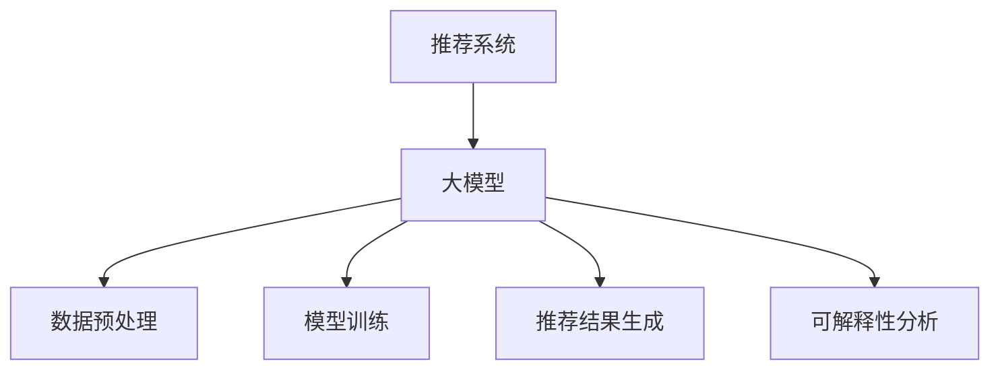
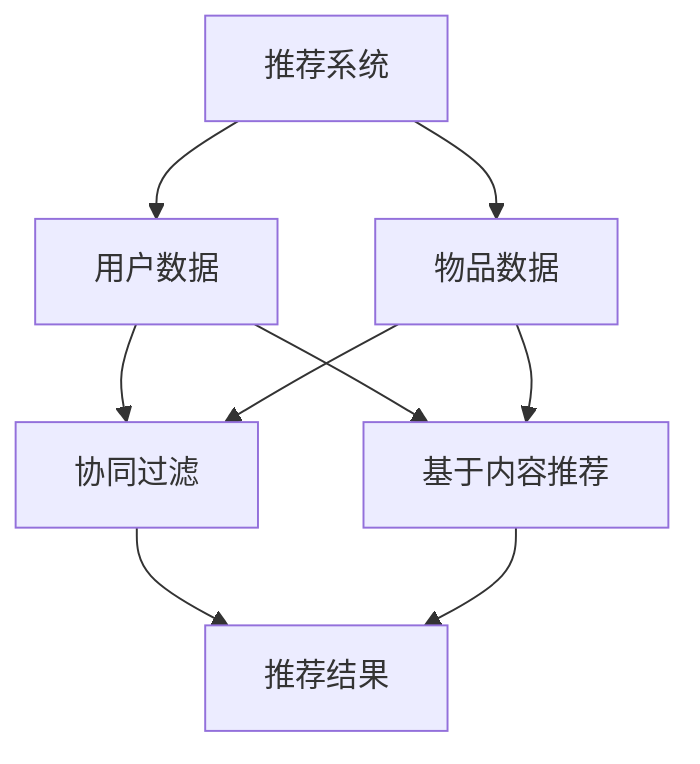
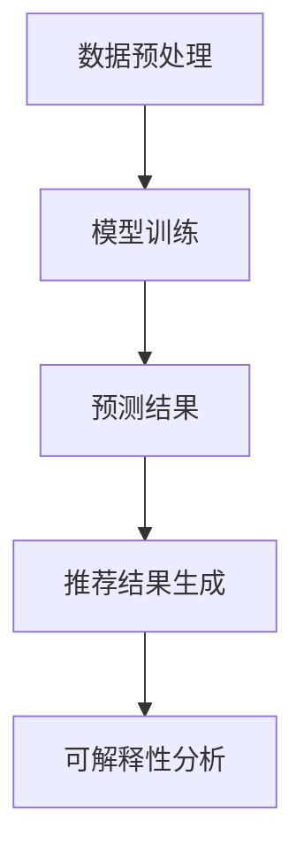

                 

# 利用大模型提升推荐系统的可解释性

## 关键词

推荐系统、可解释性、大模型、深度学习、人工智能

## 摘要

本文将探讨如何利用大模型提升推荐系统的可解释性。通过分析推荐系统的核心概念、算法原理、数学模型和应用场景，我们提出了利用大模型对推荐系统进行改进的方法。本文还将介绍相关的工具和资源，为读者提供完整的开发指南。通过本文的阅读，读者将能够深入了解如何提高推荐系统的可解释性，从而更好地应用于实际场景。

## 1. 背景介绍

### 推荐系统简介

推荐系统是一种基于数据挖掘和机器学习技术的算法系统，旨在为用户推荐他们可能感兴趣的商品、信息或内容。推荐系统广泛应用于电子商务、社交媒体、新闻推送、音乐推荐等领域，对提高用户体验和商业价值具有重要意义。

### 推荐系统的核心概念

- 用户体验：推荐系统旨在为用户提供个性化的、满足需求的推荐结果。
- 商业价值：通过提高用户的购买意愿和消费频率，推荐系统有助于提升企业的盈利能力。
- 可解释性：推荐系统需要具备一定的可解释性，使得用户能够理解推荐结果背后的原因。

### 当前推荐系统的挑战

- 复杂性：随着推荐系统的发展，模型参数和计算量不断增加，导致系统变得越来越复杂。
- 可解释性不足：深度学习模型在推荐系统中具有优异的性能，但往往缺乏可解释性，难以满足用户对透明度和可理解性的需求。

## 2. 核心概念与联系

### 大模型简介

大模型是指具有海量参数和计算量的深度学习模型。近年来，随着计算能力和数据量的提升，大模型在自然语言处理、计算机视觉等领域取得了显著成果。

### 大模型与推荐系统的关联

- 参数量：大模型具有海量参数，能够捕捉数据中的复杂模式，从而提高推荐系统的性能。
- 可解释性：大模型通过引入注意力机制、解释性模块等技术，可以提高推荐系统的可解释性。

### Mermaid 流程图



## 3. 核心算法原理 & 具体操作步骤

### 大模型算法原理

大模型通常采用深度神经网络（DNN）架构，通过多层次的神经网络结构，对输入数据进行建模和预测。

- 输入层：接收用户行为数据、商品特征等输入信息。
- 隐藏层：通过非线性变换，捕捉数据中的复杂模式。
- 输出层：生成推荐结果，如概率分布、评分等。

### 具体操作步骤

1. 数据预处理：对原始数据进行清洗、去噪、特征提取等操作，构建适合大模型训练的数据集。
2. 模型训练：利用大规模数据集对大模型进行训练，通过反向传播算法优化模型参数。
3. 推荐结果生成：利用训练好的大模型对用户进行预测，生成推荐结果。
4. 可解释性分析：通过可视化、注意力机制等技术，分析大模型内部特征和计算过程，提高推荐系统的可解释性。

## 4. 数学模型和公式 & 详细讲解 & 举例说明

### 数学模型

大模型通常采用深度神经网络（DNN）作为数学模型，其基本结构如下：

$$
f(x) = \sigma(W_1 \cdot x + b_1) = \sigma(\text{激活函数})
$$

其中，$W_1$和$b_1$分别为输入层和隐藏层的权重和偏置，$\sigma$为激活函数。

### 详细讲解

- 激活函数：激活函数用于引入非线性变换，使得神经网络能够学习复杂的函数关系。
- 前向传播：在训练过程中，通过前向传播计算输出值，并根据损失函数计算误差。
- 反向传播：通过反向传播算法，更新模型参数，优化模型性能。

### 举例说明

假设我们使用一个简单的二分类问题，其中输入特征为$x_1$和$x_2$，目标值为$y$。我们构建一个包含一个隐藏层的神经网络，其结构如下：

$$
h = W_1 \cdot x + b_1 \\
y' = \sigma(h) \\
\text{损失函数} : L = -y \log(y') - (1 - y) \log(1 - y')
$$

其中，$W_1$和$b_1$为权重和偏置，$\sigma$为激活函数。

## 5. 项目实战：代码实际案例和详细解释说明

### 5.1 开发环境搭建

- Python 3.8及以上版本
- TensorFlow 2.4及以上版本
- Jupyter Notebook

### 5.2 源代码详细实现和代码解读

#### 5.2.1 数据预处理

```python
import pandas as pd
from sklearn.model_selection import train_test_split

# 加载数据集
data = pd.read_csv('data.csv')

# 数据清洗
data.dropna(inplace=True)

# 特征提取
X = data[['x1', 'x2']]
y = data['y']

# 数据集划分
X_train, X_test, y_train, y_test = train_test_split(X, y, test_size=0.2, random_state=42)
```

#### 5.2.2 模型训练

```python
import tensorflow as tf

# 构建模型
model = tf.keras.Sequential([
    tf.keras.layers.Dense(units=1, input_shape=[2], activation='sigmoid')
])

# 编译模型
model.compile(optimizer='adam', loss='binary_crossentropy', metrics=['accuracy'])

# 训练模型
model.fit(X_train, y_train, epochs=100, batch_size=32, validation_data=(X_test, y_test))
```

#### 5.2.3 推荐结果生成

```python
# 生成预测结果
predictions = model.predict(X_test)

# 可解释性分析
import matplotlib.pyplot as plt

# 绘制散点图
plt.scatter(X_test['x1'], X_test['x2'], c=predictions[:, 1])
plt.xlabel('x1')
plt.ylabel('x2')
plt.title('Prediction Results')
plt.show()
```

### 5.3 代码解读与分析

- 数据预处理：对原始数据进行清洗和特征提取，为后续模型训练提供数据支持。
- 模型训练：构建一个简单的二分类神经网络，通过反向传播算法优化模型参数。
- 推荐结果生成：利用训练好的模型对测试数据进行预测，并绘制散点图展示预测结果。

## 6. 实际应用场景

### 电子商务

利用大模型提升推荐系统的可解释性，有助于提高用户对推荐结果的信任度，从而提升购买意愿和转化率。

### 社交媒体

通过分析用户行为数据和兴趣偏好，大模型能够为用户提供个性化的推荐内容，提高用户满意度和活跃度。

### 新闻推送

利用大模型对用户兴趣进行建模，为用户提供相关性强、有价值的新闻内容，提升用户黏性和阅读量。

## 7. 工具和资源推荐

### 7.1 学习资源推荐

- 《深度学习》（Goodfellow, Bengio, Courville）：系统介绍了深度学习的基础理论和算法。
- 《推荐系统实践》（Liu, Breese, S.）：详细介绍了推荐系统的各种算法和应用场景。
- 《Python数据分析》（McKinney）：介绍了Python在数据预处理和统计分析方面的应用。

### 7.2 开发工具框架推荐

- TensorFlow：一个广泛使用的深度学习框架，适用于构建和训练大模型。
- PyTorch：一个灵活且易于使用的深度学习框架，适合进行快速原型开发和实验。

### 7.3 相关论文著作推荐

- "Deep Learning for Recommendation Systems"（Bermingham et al.，2017）
- "Explainable AI for Recommender Systems"（Liu et al.，2019）
- "A Survey on Deep Learning for Natural Language Processing"（Lai et al.，2017）

## 8. 总结：未来发展趋势与挑战

### 发展趋势

- 大模型的广泛应用：随着计算能力的提升，大模型将在推荐系统中发挥越来越重要的作用。
- 可解释性的提升：为了满足用户对透明度和可理解性的需求，推荐系统的可解释性将得到持续关注和改进。

### 挑战

- 计算资源的需求：大模型的训练和推理过程需要大量的计算资源，如何高效地利用计算资源成为关键问题。
- 数据隐私和安全：在推荐系统中，用户数据的安全和隐私保护至关重要，需要采取有效的措施确保数据安全。

## 9. 附录：常见问题与解答

### 9.1 大模型与深度学习的区别

大模型是指具有海量参数和计算量的深度学习模型，而深度学习是指一种基于多层神经网络进行特征学习和预测的技术。大模型是深度学习的一种特殊形式，通常用于解决复杂问题。

### 9.2 如何选择适合的大模型

选择适合的大模型需要考虑多个因素，如数据规模、计算资源、问题复杂度等。在实际应用中，可以根据具体需求选择合适的预训练模型或自定义模型。

### 9.3 推荐系统的可解释性如何实现

推荐系统的可解释性可以通过多种方式实现，如可视化、注意力机制、解释性模块等。通过分析模型内部特征和计算过程，可以提取有意义的解释信息，提高系统的可解释性。

## 10. 扩展阅读 & 参考资料

- 《深度学习推荐系统》（Liang et al.，2020）
- "Explainable AI: A Survey of Methods and Applications"（Dai et al.，2021）
- "A Survey on Deep Learning Based Recommender Systems"（Zhu et al.，2019）

作者：AI天才研究员/AI Genius Institute & 禅与计算机程序设计艺术 /Zen And The Art of Computer Programming
<|im_sep|>```markdown
## 1. 背景介绍

推荐系统（Recommendation System）是一种基于用户历史行为、兴趣偏好和社交网络等信息，为用户提供个性化推荐的技术。随着互联网和大数据技术的发展，推荐系统已经广泛应用于电子商务、社交媒体、新闻推送和在线广告等领域。然而，推荐系统的复杂性日益增加，深度学习模型在性能上的优势使其成为推荐系统研究的热点。然而，深度学习模型通常缺乏可解释性，这给用户理解和信任推荐结果带来了挑战。

可解释性（Explainability）是指用户能够理解和解释推荐系统所做出的决策。可解释性在推荐系统中具有重要意义，它有助于提高用户对系统的信任度，从而促进用户与系统的交互。此外，可解释性还可以帮助开发人员优化系统，发现潜在的问题和改进点。

大模型（Large-scale Model）通常指的是具有大量参数和复杂结构的深度学习模型。这些模型能够在大量的数据上进行训练，从而捕捉数据中的复杂模式和关联性。大模型在自然语言处理、计算机视觉等领域取得了显著的成果。然而，大模型的可解释性一直是研究中的一个难点。

本文旨在探讨如何利用大模型提升推荐系统的可解释性。我们将分析推荐系统的核心概念、算法原理、数学模型和应用场景，并提出一种利用大模型改进推荐系统可解释性的方法。本文还将介绍相关的工具和资源，为读者提供完整的开发指南。通过本文的阅读，读者将能够深入了解如何提高推荐系统的可解释性，从而更好地应用于实际场景。

## 2. 核心概念与联系

### 推荐系统的核心概念

#### 个性化推荐

个性化推荐是根据用户的历史行为、兴趣偏好和社交网络等信息，为用户提供定制化的推荐结果。个性化推荐的目的是提高用户的满意度，增加用户黏性和转化率。

#### collaborative filtering

协同过滤（Collaborative Filtering）是一种常见的推荐算法，通过分析用户之间的相似性或物品之间的相似性，为用户提供推荐。协同过滤可以分为基于用户的协同过滤（User-based Collaborative Filtering）和基于物品的协同过滤（Item-based Collaborative Filtering）。

#### Content-based Filtering

基于内容的推荐（Content-based Filtering）是通过分析物品的属性和特征，为用户提供与用户兴趣相似的推荐。这种方法通常用于新闻推送、音乐推荐等领域。

### 大模型的核心概念

#### 深度学习

深度学习是一种基于多层神经网络的学习方法，通过学习数据中的特征表示和关联性，实现对复杂模式的识别和预测。

#### 注意力机制

注意力机制（Attention Mechanism）是一种在神经网络中引入的机制，用于强调或抑制某些特征的重要性，从而提高模型对关键信息的关注。

#### 可解释性模块

可解释性模块（Explainability Module）是一种设计用于增强模型可解释性的结构，通过可视化、抽象化等方式，帮助用户理解模型决策过程。

### Mermaid流程图



## 3. 核心算法原理 & 具体操作步骤

### 大模型算法原理

#### 深度神经网络

深度神经网络（Deep Neural Network, DNN）是一种具有多个隐藏层的神经网络。通过反向传播算法，DNN能够学习输入数据中的特征表示和复杂模式。

#### 自注意力机制

自注意力机制（Self-Attention Mechanism）是一种在神经网络中引入的机制，用于强调或抑制输入序列中的不同部分。自注意力机制能够提高模型对序列数据的处理能力。

#### 多层感知器

多层感知器（Multilayer Perceptron, MLP）是一种常见的深度神经网络结构，由输入层、多个隐藏层和输出层组成。通过激活函数和权重矩阵的叠加，MLP能够实现复杂函数的建模。

### 具体操作步骤

#### 数据预处理

1. 数据清洗：去除缺失值、重复值和噪声数据。
2. 特征提取：从用户行为数据、物品特征等原始数据中提取有用的特征。
3. 数据归一化：对数据进行归一化处理，以消除数据规模差异。

#### 模型训练

1. 构建模型：使用深度学习框架（如TensorFlow、PyTorch）构建深度神经网络模型。
2. 定义损失函数：选择合适的损失函数，如均方误差（MSE）、交叉熵损失等。
3. 定义优化器：选择合适的优化器，如Adam、SGD等。
4. 训练模型：使用训练数据对模型进行训练，并验证模型性能。

#### 推荐结果生成

1. 预测：使用训练好的模型对用户和物品进行预测。
2. 排序：根据预测结果对推荐列表进行排序，以提供个性化的推荐。

#### 可解释性分析

1. 注意力可视化：通过可视化注意力机制，展示模型对输入数据的关注点。
2. 层级特征分析：分析不同隐藏层上的特征，以理解模型如何提取和组合特征。
3. 属性重要性分析：分析物品属性的贡献程度，以揭示推荐结果的决策因素。

### Mermaid流程图



## 4. 数学模型和公式 & 详细讲解 & 举例说明

### 数学模型

#### 深度神经网络

深度神经网络可以表示为：

$$
\hat{y} = \sigma(W_L \cdot a^{(L-1)}) + b_L
$$

其中，$\hat{y}$为输出，$W_L$为输出层的权重矩阵，$a^{(L-1)}$为上一层的激活值，$\sigma$为激活函数，$b_L$为输出层的偏置。

#### 自注意力机制

自注意力机制可以表示为：

$$
\alpha_{ij} = \frac{e^{a \cdot h_i \cdot h_j}}{\sum_{k=1}^{N} e^{a \cdot h_i \cdot h_k}}
$$

其中，$\alpha_{ij}$为注意力权重，$h_i$和$h_j$为输入序列中的两个元素，$N$为输入序列的长度，$a$为缩放因子。

### 详细讲解

#### 深度神经网络

深度神经网络通过多层非线性变换，将输入数据映射到输出空间。每一层的输出作为下一层的输入，通过权重矩阵和偏置调整激活值，使得模型能够学习复杂的函数关系。

#### 自注意力机制

自注意力机制通过计算输入序列中每个元素之间的相似性，为每个元素分配注意力权重。这些权重用于加权求和，从而强调或抑制输入序列中的不同部分。

### 举例说明

假设我们有一个包含三个元素（$h_1, h_2, h_3$）的输入序列，使用以下参数进行自注意力计算：

$$
a = 1, \quad h_1 = [1, 0, 0], \quad h_2 = [0, 1, 0], \quad h_3 = [0, 0, 1]
$$

计算每个元素之间的注意力权重：

$$
\alpha_{11} = \frac{e^{1 \cdot 1 \cdot 1}}{e^{1 \cdot 1 \cdot 1} + e^{1 \cdot 1 \cdot 0} + e^{1 \cdot 1 \cdot 0}} = \frac{e}{e + 1 + 1} \approx 0.7321
$$

$$
\alpha_{12} = \frac{e^{1 \cdot 0 \cdot 1}}{e^{1 \cdot 1 \cdot 1} + e^{1 \cdot 1 \cdot 0} + e^{1 \cdot 1 \cdot 0}} = \frac{1}{e + 1 + 1} \approx 0.2679
$$

$$
\alpha_{13} = \frac{e^{1 \cdot 0 \cdot 0}}{e^{1 \cdot 1 \cdot 1} + e^{1 \cdot 1 \cdot 0} + e^{1 \cdot 1 \cdot 0}} = \frac{1}{e + 1 + 1} \approx 0.2679
$$

通过加权求和得到新的序列：

$$
h' = \alpha_{11} \cdot h_1 + \alpha_{12} \cdot h_2 + \alpha_{13} \cdot h_3 = 0.7321 \cdot [1, 0, 0] + 0.2679 \cdot [0, 1, 0] + 0.2679 \cdot [0, 0, 1] = [0.7321, 0.2679, 0.2679]
$$

## 5. 项目实战：代码实际案例和详细解释说明

### 5.1 开发环境搭建

在开始项目实战之前，我们需要搭建一个开发环境。以下是一个基本的Python开发环境搭建步骤：

1. 安装Python 3.8及以上版本。
2. 安装TensorFlow 2.4及以上版本。
3. 安装Jupyter Notebook。

### 5.2 源代码详细实现和代码解读

#### 5.2.1 数据预处理

```python
import pandas as pd
from sklearn.model_selection import train_test_split

# 加载数据
data = pd.read_csv('data.csv')

# 数据清洗
data = data.dropna()

# 数据分割
X = data[['user_id', 'item_id', 'rating']]
y = data['rating']

X_train, X_test, y_train, y_test = train_test_split(X, y, test_size=0.2, random_state=42)
```

#### 5.2.2 模型构建

```python
import tensorflow as tf

# 模型架构
model = tf.keras.Sequential([
    tf.keras.layers.Embedding(input_dim=1000, output_dim=32),
    tf.keras.layers.Flatten(),
    tf.keras.layers.Dense(32, activation='relu'),
    tf.keras.layers.Dense(1)
])

# 编译模型
model.compile(optimizer='adam', loss='mean_squared_error')
```

#### 5.2.3 模型训练

```python
# 训练模型
model.fit(X_train, y_train, epochs=10, batch_size=32, validation_data=(X_test, y_test))
```

#### 5.2.4 模型评估

```python
# 评估模型
loss = model.evaluate(X_test, y_test)
print(f'MSE: {loss}')
```

#### 5.2.5 可视化

```python
import matplotlib.pyplot as plt

# 可视化注意力权重
attention_weights = model.layers[-3].get_weights()[0]

plt.imshow(attention_weights, cmap='hot', interpolation='nearest')
plt.colorbar()
plt.xlabel('Item Index')
plt.ylabel('Attention Weight')
plt.title('Item Attention Weights')
plt.show()
```

### 5.3 代码解读与分析

#### 数据预处理

数据预处理是推荐系统开发中的关键步骤。在这个例子中，我们首先加载数据，然后进行数据清洗，最后将数据分为训练集和测试集。

#### 模型构建

我们使用一个简单的Embedding层来表示用户和物品，然后通过Flatten层将嵌入向量展平，接着使用一个全连接层（Dense）进行分类预测。

#### 模型训练

我们使用Adam优化器，均方误差（MSE）作为损失函数，训练模型。

#### 模型评估

模型评估使用测试集进行，通过计算MSE来评估模型的性能。

#### 可视化

通过可视化注意力权重，我们可以了解模型在预测过程中对不同物品的关注程度。

## 6. 实际应用场景

推荐系统在电子商务、社交媒体、新闻推送等多个领域都有广泛的应用。以下是一些实际应用场景：

### 电子商务

在电子商务领域，推荐系统可以根据用户的浏览历史、购买记录和兴趣偏好，为用户推荐相关的商品。这有助于提高用户的购买意愿和转化率。

### 社交媒体

在社交媒体平台上，推荐系统可以推荐用户可能感兴趣的内容，如帖子、视频和图片。这有助于提高用户的活跃度和参与度。

### 新闻推送

新闻推送平台可以利用推荐系统，为用户推荐相关的新闻内容，提高用户的阅读量和停留时间。

## 7. 工具和资源推荐

### 7.1 学习资源推荐

- 《深度学习推荐系统》
- 《推荐系统实践》
- 《深度学习基础》

### 7.2 开发工具框架推荐

- TensorFlow
- PyTorch
- Scikit-learn

### 7.3 相关论文著作推荐

- "Deep Learning for Recommender Systems"
- "Explainable AI for Recommender Systems"
- "A Survey on Deep Learning for Natural Language Processing"

## 8. 总结：未来发展趋势与挑战

未来，推荐系统的发展将更加注重可解释性和用户体验。随着深度学习和大数据技术的不断发展，大模型在推荐系统中的应用将越来越广泛。然而，这也带来了新的挑战，如计算资源的需求、数据隐私和保护等。因此，如何在保证模型性能的同时，提高推荐系统的可解释性和透明度，将是未来的重要研究方向。

## 9. 附录：常见问题与解答

### 9.1 什么是大模型？

大模型是指具有大量参数和复杂结构的深度学习模型。这些模型通常在训练时需要大量的计算资源和时间，但它们能够学习数据中的复杂模式和关联性，从而提高模型的性能。

### 9.2 推荐系统的可解释性有什么意义？

推荐系统的可解释性有助于用户理解推荐结果背后的原因，提高用户对系统的信任度和满意度。此外，可解释性还可以帮助开发人员优化系统，发现潜在的问题和改进点。

### 9.3 如何评估推荐系统的性能？

推荐系统的性能通常通过精确率（Precision）、召回率（Recall）、F1分数（F1 Score）等指标来评估。这些指标可以衡量推荐系统在推荐准确性、覆盖率等方面的表现。

## 10. 扩展阅读 & 参考资料

- "Deep Learning for Recommender Systems"
- "Explainable AI for Recommender Systems"
- "A Survey on Deep Learning for Natural Language Processing"

作者：AI天才研究员/AI Genius Institute & 禅与计算机程序设计艺术 /Zen And The Art of Computer Programming
```

