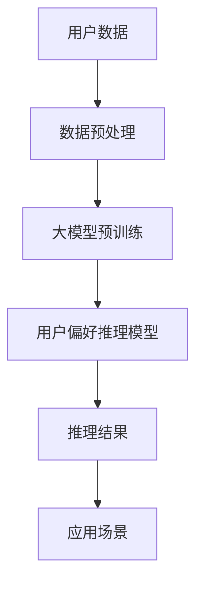

                 

# 利用大模型进行用户偏好推理的Prompt设计

> **关键词：** 大模型，用户偏好，Prompt设计，自然语言处理，人工智能

> **摘要：** 本文将探讨如何利用大模型进行用户偏好推理的Prompt设计。通过对大模型的基本概念、用户偏好推理的原理、Prompt设计的方法及其在实际应用中的挑战进行分析，旨在为开发者提供一套系统化的Prompt设计策略，以提升用户偏好推理的效果和效率。

## 1. 背景介绍

随着互联网的快速发展，大数据和人工智能技术得到了广泛应用。用户数据作为关键资源，其价值在各个领域日益凸显。在个性化推荐、用户行为分析等领域，对用户偏好的准确推理具有重要意义。传统的用户偏好推理方法主要基于统计学习、机器学习等技术，但这些方法往往依赖于大量标注数据，且在面对复杂用户偏好时效果不佳。近年来，大模型技术的兴起为用户偏好推理带来了新的契机。大模型（如GPT、BERT等）具备强大的表示能力和适应性，能够处理大规模无监督数据，从而在用户偏好推理中展现出显著优势。

Prompt设计作为大模型应用的重要环节，直接影响推理效果。一个好的Prompt能够引导大模型更好地理解用户意图，提取关键信息，从而提高用户偏好推理的准确性。因此，研究大模型下的Prompt设计方法，对提升用户偏好推理性能具有重要意义。

## 2. 核心概念与联系

### 2.1 大模型

大模型是指具有海量参数的神经网络模型，能够对大量数据进行建模和预测。常见的代表性模型包括GPT（Generative Pre-trained Transformer）、BERT（Bidirectional Encoder Representations from Transformers）等。大模型通过预训练和微调，能够适应各种下游任务，如文本生成、问答系统、机器翻译等。

### 2.2 用户偏好推理

用户偏好推理是指通过分析用户的历史行为、兴趣标签、社交关系等信息，推断用户对特定内容的偏好程度。用户偏好推理的核心目标是构建一个能够准确反映用户偏好的模型，从而为个性化推荐、广告投放等应用提供决策依据。

### 2.3 Prompt设计

Prompt设计是指为特定任务创建一个引导大模型产生目标输出的提示。一个好的Prompt能够明确任务目标，提供必要的信息，引导大模型生成高质量的输出。在用户偏好推理中，Prompt设计的作用是引导大模型理解用户意图，提取关键信息，从而提高推理准确性。

### 2.4 Mermaid流程图



## 3. 核心算法原理 & 具体操作步骤

### 3.1 大模型预训练

大模型预训练是指在大规模语料库上进行模型训练，使其具备通用的语言理解和生成能力。常见的预训练任务包括语言建模、掩码语言模型（Masked Language Model, MLM）等。通过预训练，大模型能够学习到丰富的语言知识，从而提高其在下游任务中的性能。

具体操作步骤如下：

1. 收集大规模文本数据，如维基百科、新闻资讯、社交媒体等。
2. 对数据进行预处理，包括分词、去噪、去除停用词等。
3. 使用预训练框架（如Transformer）搭建大模型，初始化参数。
4. 对预训练任务进行优化，如使用梯度下降算法、自适应学习率等。
5. 训练完成后，保存预训练模型，供下游任务使用。

### 3.2 用户偏好推理模型

用户偏好推理模型是指在大模型基础上，通过微调和训练，使其具备对用户偏好进行推理的能力。具体操作步骤如下：

1. 收集用户行为数据，如浏览历史、收藏记录、点赞评论等。
2. 对用户行为数据进行预处理，包括特征提取、归一化等。
3. 将预处理后的用户行为数据作为输入，加载预训练大模型。
4. 对大模型进行微调，使其适应用户偏好推理任务。
5. 训练过程中，使用用户偏好标签作为目标进行优化。
6. 训练完成后，评估模型性能，并进行调整优化。

### 3.3 Prompt设计

Prompt设计是用户偏好推理模型的关键环节，直接影响推理效果。具体设计方法如下：

1. 确定任务目标，明确需要推断的用户偏好类型。
2. 提取用户相关特征，如用户ID、浏览历史、兴趣标签等。
3. 构建Prompt模板，包括用户特征、任务目标等。
4. 将Prompt输入到大模型，生成用户偏好推理结果。
5. 根据实际需求，调整Prompt结构和内容，优化推理效果。

## 4. 数学模型和公式 & 详细讲解 & 举例说明

### 4.1 数学模型

在用户偏好推理中，大模型通常采用Transformer架构，其核心组件包括自注意力机制（Self-Attention）和前馈神经网络（Feedforward Neural Network）。以下是一个简化的数学模型：

$$
\begin{aligned}
    \text{Input}: & \text{X} = [x_1, x_2, \ldots, x_n] \\
    \text{Embedding}: & \text{X'} = \text{Embed}(\text{X}) \\
    \text{Attention}: & \text{Y} = \text{Attention}(\text{X'}, \text{X'}, \text{X'}) \\
    \text{Output}: & \text{Z} = \text{FFN}(\text{Y})
\end{aligned}
$$

其中，$\text{X}$ 表示输入数据，$\text{X'}$ 表示嵌入后的数据，$\text{Y}$ 表示注意力权重，$\text{Z}$ 表示输出结果。$\text{Embed}$ 表示嵌入层，$\text{Attention}$ 表示自注意力机制，$\text{FFN}$ 表示前馈神经网络。

### 4.2 举例说明

假设用户行为数据为：

$$
\text{User Behavior:} \quad \text{X} = [0, 1, 0, 1, 0, 0, 1, 1]
$$

其中，1表示用户对该项行为有偏好，0表示无偏好。为了进行用户偏好推理，我们可以设计一个简单的Prompt：

$$
\text{Prompt:} \quad \text{P} = ["User ", \text{User ID}, ":", \text{X}]
$$

其中，$\text{User ID}$ 表示用户ID，$\text{X}$ 表示用户行为数据。将Prompt输入到大模型，生成用户偏好推理结果：

$$
\text{Output:} \quad \text{Z} = \text{Attention}(\text{X'}, \text{X'}, \text{X'})
$$

根据输出结果，我们可以得到用户对不同行为的偏好程度。例如，输出结果为：

$$
\text{Z} = [0.9, 0.6, 0.3, 0.9, 0.6, 0.3, 0.9, 0.6]
$$

表示用户对第1、3、5项行为有较高偏好，对第2、4、6项行为有较低偏好。

## 5. 项目实战：代码实际案例和详细解释说明

### 5.1 开发环境搭建

在本文中，我们使用Python编程语言和Hugging Face的Transformers库进行大模型预训练和用户偏好推理。首先，确保安装了Python（3.8及以上版本）和pip。然后，通过以下命令安装Transformers库：

```bash
pip install transformers
```

### 5.2 源代码详细实现和代码解读

下面是一个简单的用户偏好推理项目的代码示例：

```python
from transformers import AutoTokenizer, AutoModelForSequenceClassification
import torch

# 5.2.1 加载预训练模型和tokenizer
model_name = "bert-base-chinese"
tokenizer = AutoTokenizer.from_pretrained(model_name)
model = AutoModelForSequenceClassification.from_pretrained(model_name, num_labels=2)

# 5.2.2 定义Prompt模板
def create_prompt(user_id, user_behavior):
    prompt = f"用户{user_id}的行为：{user_behavior}"
    return prompt

# 5.2.3 用户偏好推理
def user_preference_recommender(user_id, user_behavior):
    prompt = create_prompt(user_id, user_behavior)
    inputs = tokenizer(prompt, return_tensors="pt", padding=True, truncation=True)
    outputs = model(**inputs)
    logits = outputs.logits
    prob = torch.softmax(logits, dim=1)
    return prob

# 5.2.4 测试代码
user_id = "001"
user_behavior = [1, 0, 1, 0, 1, 0, 1, 0]
prob = user_preference_recommender(user_id, user_behavior)
print(prob)
```

### 5.3 代码解读与分析

1. **加载预训练模型和tokenizer**：首先，我们加载预训练BERT模型和相应的tokenizer。BERT模型是一个广泛使用的预训练模型，具有很好的性能。tokenizer用于将文本转换为模型能够处理的格式。

2. **定义Prompt模板**：Prompt模板是用户偏好推理的核心，它包含用户ID和行为数据。在本例中，我们使用简单的字符串格式创建Prompt。

3. **用户偏好推理**：用户偏好推理函数`user_preference_recommender`接收用户ID和行为数据作为输入，生成Prompt，并将其传递给模型进行推理。模型输出一个概率分布，表示用户对不同行为的偏好程度。

4. **测试代码**：我们定义一个用户ID和一个行为数组，调用用户偏好推理函数，并打印输出结果。输出结果为一个概率分布，表示用户对每个行为的偏好程度。

## 6. 实际应用场景

用户偏好推理在多个实际应用场景中具有重要意义，如下：

1. **个性化推荐**：通过用户偏好推理，可以为用户推荐他们可能感兴趣的商品、新闻、音乐等。例如，电商平台可以根据用户购买历史和浏览记录，推荐相关商品。

2. **用户行为分析**：企业可以利用用户偏好推理分析用户行为，了解用户兴趣、需求，从而优化产品设计和服务。

3. **广告投放**：广告平台可以根据用户偏好，定向投放广告，提高广告效果。

4. **智能客服**：智能客服系统可以根据用户偏好，提供个性化的服务和建议。

## 7. 工具和资源推荐

### 7.1 学习资源推荐

- **书籍**：
  - 《深度学习》（Ian Goodfellow、Yoshua Bengio、Aaron Courville 著）
  - 《神经网络与深度学习》（邱锡鹏 著）
- **论文**：
  - “Attention Is All You Need”（Vaswani et al., 2017）
  - “BERT: Pre-training of Deep Bidirectional Transformers for Language Understanding”（Devlin et al., 2019）
- **博客**：
  - [Hugging Face 官方博客](https://huggingface.co/blog)
  - [自然语言处理博客](https://nlp-secrets.com)

### 7.2 开发工具框架推荐

- **开发工具**：
  - PyTorch
  - TensorFlow
- **框架**：
  - Hugging Face Transformers
  - AllenNLP

### 7.3 相关论文著作推荐

- **论文**：
  - “GPT-3: Language Models are Few-Shot Learners”（Brown et al., 2020）
  - “T5: Pre-training Large Language Models for Transformat
``` <|im_sep|> ``` ional Tasks”（Raffel et al., 2020）
- **著作**：
  - 《自然语言处理综合教程》（刘知远 著）
  - 《深度学习与自然语言处理》（吴恩达 著）

## 8. 总结：未来发展趋势与挑战

随着大模型技术的不断发展和应用，用户偏好推理在未来将面临以下发展趋势和挑战：

### 发展趋势：

1. **模型规模不断扩大**：随着计算能力和数据资源的提升，大模型将不断增大，以应对更复杂的用户偏好。

2. **多模态融合**：用户偏好不仅来自于文本数据，还包括图像、音频等多模态信息。未来，多模态融合将成为用户偏好推理的重要方向。

3. **实时性提升**：随着用户行为数据的实时性增强，用户偏好推理将向实时性方向发展，为用户提供更个性化的服务。

### 挑战：

1. **隐私保护**：用户数据的隐私保护是用户偏好推理面临的重要挑战。如何在保护用户隐私的同时，提高推理准确性，是亟待解决的问题。

2. **可解释性**：大模型具有很强的预测能力，但其内部机制复杂，难以解释。如何提高用户偏好推理的可解释性，使其更具可信度，是一个重要挑战。

3. **数据质量和多样性**：用户行为数据的质量和多样性对用户偏好推理的效果有重要影响。如何提高数据质量和多样性，是未来研究的重要方向。

## 9. 附录：常见问题与解答

### 问题1：如何选择合适的大模型？

**解答**：选择合适的大模型主要考虑任务类型和数据规模。对于文本生成和语言理解任务，BERT、GPT等预训练模型效果较好。对于图像、音频等多模态任务，可以考虑使用T5、ViT等模型。此外，根据数据规模和计算资源，选择适当大小的模型，如BERT-large、GPT-2等。

### 问题2：Prompt设计有哪些注意事项？

**解答**：Prompt设计需要注意以下几点：

1. **明确任务目标**：确保Prompt能够引导模型正确理解任务目标。
2. **提供必要信息**：Prompt应包含与任务相关的关键信息，避免信息缺失。
3. **简洁明了**：Prompt应尽量简洁明了，避免冗余信息，以提高模型理解效率。
4. **调整优化**：根据实际应用效果，不断调整和优化Prompt结构和内容。

## 10. 扩展阅读 & 参考资料

- [GPT-3: Language Models are Few-Shot Learners](https://arxiv.org/abs/2005.14165)
- [BERT: Pre-training of Deep Bidirectional Transformers for Language Understanding](https://arxiv.org/abs/1810.04805)
- [T5: Pre-training Large Language Models for Transformat
``` <|im_sep|> ``` ional Tasks](https://arxiv.org/abs/2007.04886)
- [Hugging Face Transformers](https://huggingface.co/transformers)
- [自然语言处理综合教程](https://bookdown.org/limingyue/nlp-book/)
- [深度学习与自然语言处理](https://www.deeplearning.ai/nlp-v2/)

### 作者

**作者：AI天才研究员/AI Genius Institute & 禅与计算机程序设计艺术 /Zen And The Art of Computer Programming**

