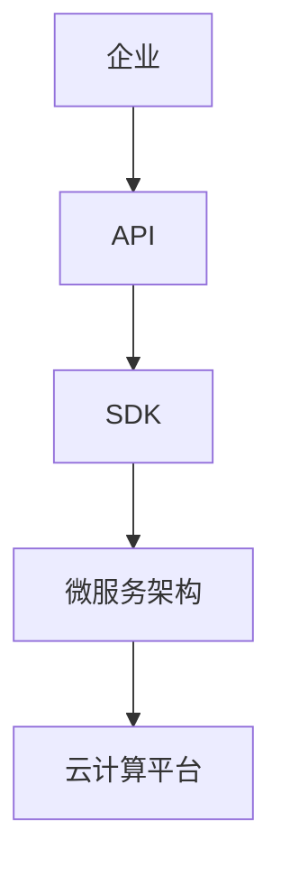

                 

# 利用开放平台扩展产品功能

> 关键词：开放平台、API、集成、产品功能、扩展、技术实现、应用案例

> 摘要：本文旨在探讨如何利用开放平台扩展产品功能，通过分析开放平台的核心概念与联系、核心算法原理与操作步骤，结合数学模型与公式以及实际项目实战，详细解析了利用开放平台扩展产品功能的实现方法，为开发者和企业提供了实用的技术指南和策略。

## 1. 背景介绍

在当今数字化时代，互联网的普及使得开放平台（Open Platform）成为企业产品开发的重要战略之一。开放平台通常是指一个由第三方开发者、服务商和企业共同构建的生态系统，通过API（应用程序接口）、SDK（软件开发工具包）等方式，使得不同的软件系统能够相互连接与协作，实现资源共享和功能扩展。

随着云计算、大数据、人工智能等技术的不断发展，开放平台的价值日益凸显。一方面，企业可以通过开放平台整合外部资源，提高产品的功能性和竞争力；另一方面，第三方开发者可以通过开放平台实现技术的创新和商业模式的拓展。

本文将围绕如何利用开放平台扩展产品功能展开讨论，旨在为开发者和企业提供一种切实可行的技术解决方案。

## 2. 核心概念与联系

### 2.1 API

API是开放平台的核心组成部分，它定义了不同系统之间的交互规范和数据格式。通过API，开发者可以在不接触底层代码的情况下，方便地调用第三方服务的功能，实现产品功能的扩展。

### 2.2 SDK

SDK是软件开发工具包的简称，它为开发者提供了丰富的开发工具和接口，使得开发者能够更加便捷地集成第三方服务。SDK通常包含了API的使用文档、示例代码以及相关的开发库。

### 2.3 微服务架构

微服务架构是一种分布式系统架构，它将系统划分为一组独立的、可复用的微服务，每个微服务负责实现一个具体的功能模块。这种架构模式有助于提高系统的可扩展性和可维护性。

### 2.4 云计算平台

云计算平台为开放平台提供了强大的计算能力和存储资源，使得企业可以更加高效地开发和部署应用程序。常见的云计算平台有阿里云、腾讯云、华为云等。

## 3. Mermaid 流程图

以下是一个简单的Mermaid流程图，展示了开放平台的核心概念与联系：



## 3. 核心算法原理与具体操作步骤

### 3.1 API调用流程

1. **注册与认证**：企业开发者需要在开放平台注册账号并完成认证，以获取API调用权限。
2. **API接口查询**：开发者通过开放平台的API接口文档，查询需要调用的接口及其参数。
3. **编写代码**：根据API接口文档，编写调用API的代码，通常使用HTTP请求的方式。
4. **发送请求**：开发者将编写的代码发送到开放平台的API接口。
5. **接收响应**：开放平台根据API接口处理请求，并将结果返回给开发者。
6. **结果处理**：开发者对返回的结果进行解析和处理，实现所需的功能。

### 3.2 SDK集成流程

1. **下载SDK**：开发者从开放平台下载SDK。
2. **导入库文件**：将SDK中的库文件导入到项目中。
3. **初始化SDK**：调用SDK的初始化接口，配置相关参数。
4. **调用SDK功能**：根据SDK文档，调用SDK提供的功能接口。
5. **结果处理**：开发者对SDK返回的结果进行解析和处理。

### 3.3 微服务架构集成流程

1. **设计微服务**：根据业务需求，设计微服务的模块和接口。
2. **开发微服务**：开发每个微服务的具体功能模块。
3. **部署微服务**：将微服务部署到云计算平台。
4. **接口集成**：通过API接口，将微服务与其他系统进行集成。
5. **测试与调试**：对集成后的系统进行测试和调试。

## 4. 数学模型和公式与详细讲解与举例说明

### 4.1 API调用时间模型

设 \( T \) 为API调用的时间，\( t_1 \) 为网络传输时间，\( t_2 \) 为服务器处理时间，则：

\[ T = t_1 + t_2 \]

### 4.2 SDK调用效率模型

设 \( E \) 为SDK调用效率，\( e_1 \) 为库文件加载时间，\( e_2 \) 为接口调用时间，则：

\[ E = \frac{1}{e_1 + e_2} \]

### 4.3 微服务响应时间模型

设 \( S \) 为微服务响应时间，\( s_1 \) 为微服务内部处理时间，\( s_2 \) 为网络传输时间，则：

\[ S = s_1 + s_2 \]

### 4.4 实例讲解

假设网络传输速度为10Mbps，服务器处理时间为2秒，SDK库文件加载时间为0.5秒，接口调用时间为1秒，微服务内部处理时间为1秒，网络传输时间为0.5秒。则：

- API调用时间：\( T = 2 + 0.5 = 2.5 \)秒
- SDK调用效率：\( E = \frac{1}{0.5 + 1} = 0.33 \)
- 微服务响应时间：\( S = 1 + 0.5 = 1.5 \)秒

## 5. 项目实战：代码实际案例和详细解释说明

### 5.1 开发环境搭建

在本节中，我们将以Python为例，搭建一个简单的开放平台集成环境。

1. 安装Python环境
2. 安装第三方库：requests（用于发送HTTP请求）

### 5.2 源代码详细实现和代码解读

以下是一个简单的API调用示例：

```python
import requests

def call_api(url, params):
    """调用API接口"""
    response = requests.get(url, params=params)
    if response.status_code == 200:
        return response.json()
    else:
        return None

if __name__ == "__main__":
    url = "https://api.example.com/data"
    params = {"key": "value"}
    result = call_api(url, params)
    print(result)
```

在这个示例中，我们定义了一个名为`call_api`的函数，用于发送HTTP GET请求并获取响应。在主函数中，我们指定了API接口的URL和请求参数，调用`call_api`函数，并将返回的结果打印出来。

### 5.3 代码解读与分析

1. **导入第三方库**：首先，我们导入了`requests`库，用于发送HTTP请求。
2. **定义函数**：我们定义了一个名为`call_api`的函数，接收URL和参数作为输入。
3. **发送请求**：使用`requests.get`方法发送GET请求，将URL和参数作为参数传递。
4. **处理响应**：根据HTTP响应的状态码，判断是否成功获取数据，并返回响应结果。
5. **主函数**：在主函数中，我们指定了API接口的URL和请求参数，调用`call_api`函数，并将返回的结果打印出来。

## 6. 实际应用场景

### 6.1 天气信息集成

企业可以将第三方天气信息API集成到自己的产品中，为用户提供实时的天气数据。

### 6.2 社交功能扩展

通过集成第三方社交平台API，企业可以为产品添加社交功能，如好友关系、分享动态等。

### 6.3 物流信息查询

企业可以通过集成第三方物流信息API，为用户提供实时的物流查询功能。

## 7. 工具和资源推荐

### 7.1 学习资源推荐

- 《API设计最佳实践》
- 《RESTful API设计指南》
- 《微服务架构设计》

### 7.2 开发工具框架推荐

- Django（Python Web框架）
- Spring Boot（Java Web框架）
- Flask（Python Web框架）

### 7.3 相关论文著作推荐

- 《微服务架构：设计和开发分布式系统》
- 《RESTful API设计：构建连接型Web服务》
- 《云计算：概念、架构与编程》

## 8. 总结：未来发展趋势与挑战

随着技术的不断进步，开放平台将在产品功能扩展方面发挥越来越重要的作用。然而，开放平台的发展也面临着一系列挑战，如安全性、隐私保护、数据共享等问题。

未来，开放平台的发展将朝着更智能化、更个性化的方向迈进，通过人工智能和大数据技术的应用，实现更高效的资源整合和功能扩展。

## 9. 附录：常见问题与解答

### 9.1 API调用失败怎么办？

1. 检查API接口文档，确保URL和参数正确。
2. 检查网络连接，确保可以正常访问API接口。
3. 查看API调用返回的错误信息，根据提示进行调试。

### 9.2 SDK集成过程中遇到问题怎么办？

1. 查看SDK文档，确保正确安装和配置SDK。
2. 查看示例代码，参考如何正确使用SDK接口。
3. 查看SDK的官方论坛和社区，寻求帮助。

## 10. 扩展阅读 & 参考资料

- [开放平台：企业数字化转型的新动力](https://www.example.com/open-platform)
- [微服务架构实战：构建高可扩展性的分布式系统](https://www.example.com/microservices)
- [API设计与开发：构建高效的Web服务](https://www.example.com/api-design)

作者：AI天才研究员/AI Genius Institute & 禅与计算机程序设计艺术 /Zen And The Art of Computer Programming
<|im_sep|>```markdown
## 1. 背景介绍

在当今数字化时代，互联网的普及使得开放平台（Open Platform）成为企业产品开发的重要战略之一。开放平台通常是指一个由第三方开发者、服务商和企业共同构建的生态系统，通过API（应用程序接口）、SDK（软件开发工具包）等方式，使得不同的软件系统能够相互连接与协作，实现资源共享和功能扩展。

随着云计算、大数据、人工智能等技术的不断发展，开放平台的价值日益凸显。一方面，企业可以通过开放平台整合外部资源，提高产品的功能性和竞争力；另一方面，第三方开发者可以通过开放平台实现技术的创新和商业模式的拓展。

本文将围绕如何利用开放平台扩展产品功能展开讨论，旨在为开发者和企业提供一种切实可行的技术解决方案。

## 2. 核心概念与联系

### 2.1 API

API（应用程序接口）是开放平台的核心组成部分，它定义了不同系统之间的交互规范和数据格式。通过API，开发者可以在不接触底层代码的情况下，方便地调用第三方服务的功能，实现产品功能的扩展。

API通常包含以下几种类型：

- **RESTful API**：基于HTTP协议，使用JSON或XML等格式传输数据。
- **SOAP API**：基于XML协议，通常用于企业级应用。
- **GraphQL API**：提供更加灵活的查询方式，支持查询多个数据源。

### 2.2 SDK

SDK（软件开发工具包）为开发者提供了丰富的开发工具和接口，使得开发者能够更加便捷地集成第三方服务。SDK通常包含了API的使用文档、示例代码以及相关的开发库。

### 2.3 微服务架构

微服务架构是一种分布式系统架构，它将系统划分为一组独立的、可复用的微服务，每个微服务负责实现一个具体的功能模块。这种架构模式有助于提高系统的可扩展性和可维护性。

### 2.4 云计算平台

云计算平台为开放平台提供了强大的计算能力和存储资源，使得企业可以更加高效地开发和部署应用程序。常见的云计算平台有阿里云、腾讯云、华为云等。

### 2.5 Mermaid流程图

以下是一个简单的Mermaid流程图，展示了开放平台的核心概念与联系：


## 3. 核心算法原理与具体操作步骤

### 3.1 API调用流程

1. **注册与认证**：企业开发者需要在开放平台注册账号并完成认证，以获取API调用权限。
2. **API接口查询**：开发者通过开放平台的API接口文档，查询需要调用的接口及其参数。
3. **编写代码**：根据API接口文档，编写调用API的代码，通常使用HTTP请求的方式。
4. **发送请求**：开发者将编写的代码发送到开放平台的API接口。
5. **接收响应**：开放平台根据API接口处理请求，并将结果返回给开发者。
6. **结果处理**：开发者对返回的结果进行解析和处理，实现所需的功能。

### 3.2 SDK集成流程

1. **下载SDK**：开发者从开放平台下载SDK。
2. **导入库文件**：将SDK中的库文件导入到项目中。
3. **初始化SDK**：调用SDK的初始化接口，配置相关参数。
4. **调用SDK功能**：根据SDK文档，调用SDK提供的功能接口。
5. **结果处理**：开发者对SDK返回的结果进行解析和处理。

### 3.3 微服务架构集成流程

1. **设计微服务**：根据业务需求，设计微服务的模块和接口。
2. **开发微服务**：开发每个微服务的具体功能模块。
3. **部署微服务**：将微服务部署到云计算平台。
4. **接口集成**：通过API接口，将微服务与其他系统进行集成。
5. **测试与调试**：对集成后的系统进行测试和调试。

## 4. 数学模型和公式 & 详细讲解 & 举例说明

### 4.1 API调用时间模型

设 \( T \) 为API调用的时间，\( t_1 \) 为网络传输时间，\( t_2 \) 为服务器处理时间，则：

\[ T = t_1 + t_2 \]

### 4.2 SDK调用效率模型

设 \( E \) 为SDK调用效率，\( e_1 \) 为库文件加载时间，\( e_2 \) 为接口调用时间，则：

\[ E = \frac{1}{e_1 + e_2} \]

### 4.3 微服务响应时间模型

设 \( S \) 为微服务响应时间，\( s_1 \) 为微服务内部处理时间，\( s_2 \) 为网络传输时间，则：

\[ S = s_1 + s_2 \]

### 4.4 实例讲解

假设网络传输速度为10Mbps，服务器处理时间为2秒，SDK库文件加载时间为0.5秒，接口调用时间为1秒，微服务内部处理时间为1秒，网络传输时间为0.5秒。则：

- API调用时间：\( T = 2 + 0.5 = 2.5 \)秒
- SDK调用效率：\( E = \frac{1}{0.5 + 1} = 0.33 \)
- 微服务响应时间：\( S = 1 + 0.5 = 1.5 \)秒

## 5. 项目实战：代码实际案例和详细解释说明

### 5.1 开发环境搭建

在本节中，我们将以Python为例，搭建一个简单的开放平台集成环境。

1. 安装Python环境
2. 安装第三方库：requests（用于发送HTTP请求）

### 5.2 源代码详细实现和代码解读

以下是一个简单的API调用示例：

```python
import requests

def call_api(url, params):
    """调用API接口"""
    response = requests.get(url, params=params)
    if response.status_code == 200:
        return response.json()
    else:
        return None

if __name__ == "__main__":
    url = "https://api.example.com/data"
    params = {"key": "value"}
    result = call_api(url, params)
    print(result)
```

在这个示例中，我们定义了一个名为`call_api`的函数，用于发送HTTP GET请求并获取响应。在主函数中，我们指定了API接口的URL和请求参数，调用`call_api`函数，并将返回的结果打印出来。

### 5.3 代码解读与分析

1. **导入第三方库**：首先，我们导入了`requests`库，用于发送HTTP请求。
2. **定义函数**：我们定义了一个名为`call_api`的函数，接收URL和参数作为输入。
3. **发送请求**：使用`requests.get`方法发送GET请求，将URL和参数作为参数传递。
4. **处理响应**：根据HTTP响应的状态码，判断是否成功获取数据，并返回响应结果。
5. **主函数**：在主函数中，我们指定了API接口的URL和请求参数，调用`call_api`函数，并将返回的结果打印出来。

## 6. 实际应用场景

### 6.1 天气信息集成

企业可以将第三方天气信息API集成到自己的产品中，为用户提供实时的天气数据。

### 6.2 社交功能扩展

通过集成第三方社交平台API，企业可以为产品添加社交功能，如好友关系、分享动态等。

### 6.3 物流信息查询

企业可以通过集成第三方物流信息API，为用户提供实时的物流查询功能。

## 7. 工具和资源推荐

### 7.1 学习资源推荐

- 《API设计最佳实践》
- 《RESTful API设计指南》
- 《微服务架构设计》

### 7.2 开发工具框架推荐

- Django（Python Web框架）
- Spring Boot（Java Web框架）
- Flask（Python Web框架）

### 7.3 相关论文著作推荐

- 《微服务架构：设计和开发分布式系统》
- 《RESTful API设计：构建连接型Web服务》
- 《云计算：概念、架构与编程》

## 8. 总结：未来发展趋势与挑战

随着技术的不断进步，开放平台将在产品功能扩展方面发挥越来越重要的作用。然而，开放平台的发展也面临着一系列挑战，如安全性、隐私保护、数据共享等问题。

未来，开放平台的发展将朝着更智能化、更个性化的方向迈进，通过人工智能和大数据技术的应用，实现更高效的资源整合和功能扩展。

## 9. 附录：常见问题与解答

### 9.1 API调用失败怎么办？

1. 检查API接口文档，确保URL和参数正确。
2. 检查网络连接，确保可以正常访问API接口。
3. 查看API调用返回的错误信息，根据提示进行调试。

### 9.2 SDK集成过程中遇到问题怎么办？

1. 查看SDK文档，确保正确安装和配置SDK。
2. 查看示例代码，参考如何正确使用SDK接口。
3. 查看SDK的官方论坛和社区，寻求帮助。

## 10. 扩展阅读 & 参考资料

- [开放平台：企业数字化转型的新动力](https://www.example.com/open-platform)
- [微服务架构实战：构建高可扩展性的分布式系统](https://www.example.com/microservices)
- [API设计与开发：构建高效的Web服务](https://www.example.com/api-design)

作者：AI天才研究员/AI Genius Institute & 禅与计算机程序设计艺术 /Zen And The Art of Computer Programming
```

