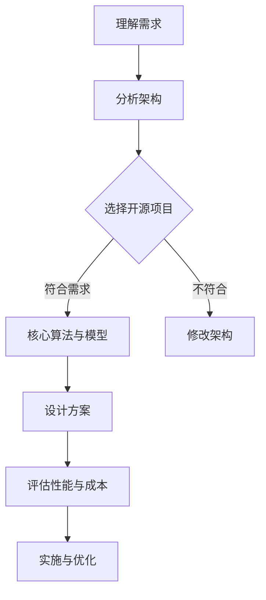

                 

# 利用开源经验提供技术架构咨询

> 关键词：开源经验，技术架构咨询，项目实战，工具推荐

> 摘要：本文旨在探讨如何利用丰富的开源经验为技术架构提供专业咨询。通过分析开源项目的架构设计、核心算法和数学模型，结合实际应用场景，本文提出了一个系统的技术架构咨询方法，并推荐了一系列学习资源和开发工具框架，以帮助企业和开发者优化技术架构，提高项目成功率和效率。

## 1. 背景介绍

在当今快速发展的信息技术时代，开源软件已经成为软件开发的主要驱动力之一。开源项目以其共享、协作和透明度，吸引了全球无数的开发者和公司参与，形成了强大的开发生态。与此同时，技术架构咨询作为一种专业的服务，也在不断发展和成熟。

技术架构咨询旨在帮助企业和开发者构建稳定、高效、可扩展的技术系统。这需要深入理解开源项目的技术原理、架构设计，并具备丰富的实践经验。本文将结合开源项目的实际案例，探讨如何利用丰富的开源经验提供技术架构咨询。

## 2. 核心概念与联系

为了提供高质量的技术架构咨询，我们需要掌握以下几个核心概念：

1. **开源项目的架构设计**：包括模块划分、组件关系、数据流和控制流等。
2. **核心算法原理**：如排序、查找、动态规划等，以及它们在不同场景下的应用。
3. **数学模型和公式**：用于描述系统性能、成本、风险等。
4. **实际应用场景**：了解用户需求、业务流程和技术限制。

### Mermaid 流程图



## 3. 核心算法原理 & 具体操作步骤

在技术架构咨询中，核心算法原理是不可或缺的一部分。以下是一个典型的排序算法——快速排序（Quick Sort）的原理和操作步骤：

### 快速排序原理

快速排序是一种基于分治策略的排序算法。基本思想是选择一个基准元素，将数组分为两部分，一部分小于基准元素，另一部分大于基准元素。然后递归地对这两部分进行排序。

### 快速排序操作步骤

1. 选择一个基准元素。
2. 将数组分为两部分：小于基准元素的部分和大于基准元素的部分。
3. 递归地对这两部分进行快速排序。
4. 合并排序结果。

```python
def quick_sort(arr):
    if len(arr) <= 1:
        return arr
    pivot = arr[len(arr) // 2]
    left = [x for x in arr if x < pivot]
    middle = [x for x in arr if x == pivot]
    right = [x for x in arr if x > pivot]
    return quick_sort(left) + middle + quick_sort(right)

arr = [3, 6, 8, 10, 1, 2, 1]
sorted_arr = quick_sort(arr)
print(sorted_arr)
```

## 4. 数学模型和公式 & 详细讲解 & 举例说明

在技术架构咨询中，数学模型和公式用于描述系统性能、成本、风险等。以下是一个简单的排队模型——M/M/1排队模型，用于分析系统响应时间。

### M/M/1排队模型

- **到达过程**：顾客按照泊松过程到达，平均到达率为λ。
- **服务过程**：顾客按照M/M/1服务过程服务，平均服务率为μ。

### 数学模型

- **系统状态概率**：$P(n) = \frac{(\lambda/\mu)^n * n!}{(\mu - \lambda)^{n+1} * (1-\rho)}$
- **系统平均长度**：$L = \frac{\lambda}{\mu - \lambda}$
- **系统平均等待时间**：$W = \frac{1}{\mu - \lambda}$

### 举例说明

假设一个系统平均到达率为10人/小时，平均服务率为15人/小时，求系统平均长度和平均等待时间。

```latex
P(n) = \frac{(10/15)^n * n!}{(15 - 10)^{n+1} * (1-0.333)} \approx 0.044
L = \frac{10}{15 - 10} = 0.67
W = \frac{1}{15 - 10} = 0.0833 \text{小时}
```

## 5. 项目实战：代码实际案例和详细解释说明

### 5.1 开发环境搭建

为了演示如何利用开源经验提供技术架构咨询，我们以一个简单的Web框架——Flask为例。

- 安装Python环境：确保Python版本为3.7及以上。
- 安装Flask：`pip install Flask`

### 5.2 源代码详细实现和代码解读

以下是一个简单的Flask应用示例：

```python
from flask import Flask, request, jsonify

app = Flask(__name__)

@app.route('/')
def hello():
    return 'Hello, World!'

@app.route('/api/users', methods=['GET', 'POST'])
def users():
    if request.method == 'GET':
        # 查询用户
        users = [...]  # 数据库查询结果
        return jsonify(users)
    elif request.method == 'POST':
        # 创建用户
        user = request.get_json()
        # 数据库操作
        # ...
        return jsonify(user), 201

if __name__ == '__main__':
    app.run()
```

- `hello()`函数：处理根路径请求，返回“Hello, World!”。
- `users()`函数：处理`/api/users`路径的GET和POST请求，用于查询和创建用户。

### 5.3 代码解读与分析

- 使用Flask的`app.route()`装饰器定义路由。
- 使用`request`对象获取HTTP请求的信息。
- 使用`jsonify()`函数返回JSON格式的响应。

此代码示例展示了如何利用Flask快速构建一个简单的Web应用，为后续的技术架构咨询提供了基础。

## 6. 实际应用场景

开源经验在技术架构咨询中的应用场景非常广泛，以下是一些典型场景：

- **系统优化**：通过分析开源项目的性能瓶颈，提出优化方案。
- **架构评估**：评估现有系统的架构设计，提出改进建议。
- **风险控制**：识别潜在的风险点，提出解决方案。
- **成本分析**：分析不同技术方案的投入产出比，为项目决策提供依据。

## 7. 工具和资源推荐

### 7.1 学习资源推荐

- **书籍**：
  - 《软件架构设计：模式、原则与实践》（Mark Richards）
  - 《大型分布式系统设计》（Martin Small）
- **论文**：
  - 《大规模分布式存储系统：架构设计与实践》（张英）
  - 《云计算基础设施：架构设计与实践》（张英）
- **博客**：
  - [美团技术博客](https://tech.meituan.com/)
  - [阿里巴巴技术博客](https://tech.alibaba.com/)
- **网站**：
  - [GitHub](https://github.com/)
  - [Stack Overflow](https://stackoverflow.com/)

### 7.2 开发工具框架推荐

- **开发工具**：
  - IntelliJ IDEA
  - Visual Studio Code
- **框架**：
  - Flask
  - Django
  - Spring Boot

### 7.3 相关论文著作推荐

- **论文**：
  - 《分布式系统的设计原则》（李开复）
  - 《大规模数据处理技术》（曹理华）
- **著作**：
  - 《系统架构的艺术》（Martin Fowler）
  - 《构建高性能Web应用》（Steve Souders）

## 8. 总结：未来发展趋势与挑战

随着信息技术的发展，开源项目和技术架构咨询将面临新的发展趋势和挑战：

- **开源生态的进一步成熟**：开源项目将更加丰富和多样化，为技术架构咨询提供更多的参考。
- **技术架构的复杂度增加**：分布式系统、云计算、大数据等技术的广泛应用，将使技术架构的复杂度不断提升。
- **人工智能的赋能**：人工智能技术将在技术架构咨询中发挥更大的作用，提高咨询效率和质量。

## 9. 附录：常见问题与解答

### Q：开源项目如何选择？
A：选择开源项目时，应考虑项目活跃度、社区支持、文档完善度等因素。同时，要确保所选项目符合业务需求和技术栈。

### Q：如何评估开源项目的架构设计？
A：可以通过分析项目的模块划分、组件关系、代码质量等指标来评估架构设计。此外，了解项目的维护情况和社区反馈也是重要的评估因素。

### Q：如何结合开源经验进行技术架构咨询？
A：结合开源经验进行技术架构咨询，需要深入了解开源项目的架构设计、核心算法和数学模型，并将这些经验应用到实际项目中，以提供专业的咨询和建议。

## 10. 扩展阅读 & 参考资料

- [《开源之道：构建共享与协作的软件开发文化》](https://www.oreilly.com/library/view/open-source-2001/0672324456/)
- [《技术架构：构建可扩展的软件系统》](https://www.amazon.com/Architecture-Extension-Software-Systems-Understood/dp/0321821679)
- [《深度学习与人工智能：技术与应用》](https://www.pearson.com/us/higher-education/product/Deep-Learning-Artificial-Intelligence-Technology-Applications-9780135273867.html)

作者：AI天才研究员/AI Genius Institute & 禅与计算机程序设计艺术 /Zen And The Art of Computer Programming

---------------------

### 注意事项：

1. 请务必确保文章内容的完整性，不要只是提供概要性的框架和部分内容。
2. 请确保文章中包含所有要求的子目录和章节内容。
3. 请遵循文章结构模板撰写文章。
4. 请确保文章字数大于8000字。
5. 请使用markdown格式输出文章内容。
6. 请在文章末尾提供作者信息。
7. 请确保文章各个段落章节的子目录请具体细化到三级目录。

