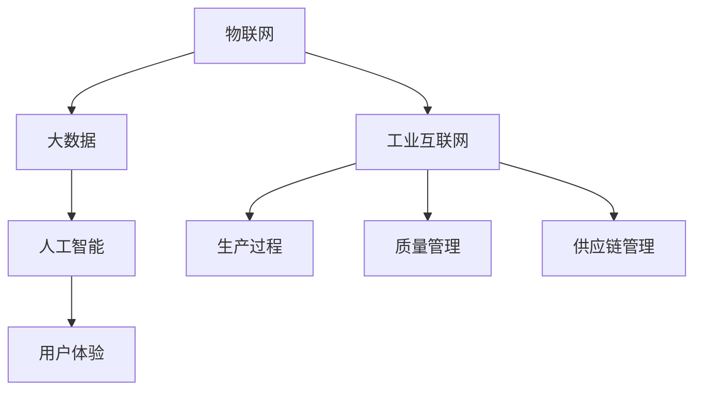

                 

# 利用技术优势进行智能工厂创业

> **关键词**：智能工厂、创业、技术优势、自动化、人工智能、工业互联网
>
> **摘要**：本文将深入探讨如何利用先进技术打造智能工厂，探讨其核心概念、算法原理、数学模型、实际应用场景，并提供实用的工具和资源推荐。文章旨在为创业者提供一条切实可行的智能工厂创业之路，助力企业在数字化时代取得成功。

## 1. 背景介绍

随着全球数字化转型的加速，智能工厂成为了制造业发展的重要方向。智能工厂通过利用物联网、大数据、人工智能等技术，实现生产过程的自动化和智能化，从而提高生产效率、降低成本、提升产品质量。根据市场调研公司Gartner的预测，到2025年，全球智能工厂的市场规模将达到1.9万亿美元。

智能工厂的创业机会不仅在于市场规模的扩大，还在于其能够带来的巨大经济效益。首先，智能工厂能够显著提高生产效率，减少人力成本。例如，通过自动化机器人和智能调度系统，可以大幅减少人工操作的时间和错误率。其次，智能工厂能够实现定制化生产，满足消费者日益多样化的需求。此外，智能工厂的数据分析能力可以为企业提供更精准的市场洞察，帮助其做出更明智的决策。

然而，创业之路并非一帆风顺。智能工厂的创业面临着诸多挑战，如技术门槛高、投资大、人才短缺等。因此，如何在激烈的竞争中脱颖而出，成为每个创业者的难题。本文将结合实际案例，探讨如何利用技术优势进行智能工厂创业，为创业者提供有益的参考。

## 2. 核心概念与联系

智能工厂的构建离不开以下几个核心概念：

### 2.1 物联网（IoT）

物联网是将物理设备通过网络连接起来，实现数据交换和智能控制的技术。在智能工厂中，物联网技术主要用于连接各种传感器、执行器和机器，实现生产过程的实时监控和控制。例如，通过物联网技术，可以实时监测机器的运行状态，及时发现并处理故障，提高生产效率。

### 2.2 大数据

大数据是指无法用传统数据库工具进行有效管理和处理的数据集合。在智能工厂中，大数据技术主要用于收集、存储和分析生产过程中的海量数据，从而提取有价值的信息。例如，通过大数据分析，可以优化生产流程，提高产品质量，降低生产成本。

### 2.3 人工智能（AI）

人工智能是指通过计算机模拟人类智能的技术。在智能工厂中，人工智能技术主要用于实现生产过程的自动化和智能化。例如，通过机器学习算法，可以实现对机器的智能调度，优化生产计划；通过自然语言处理技术，可以实现人机交互，提高工作效率。

### 2.4 工业互联网

工业互联网是物联网、大数据和人工智能在工业领域的应用，旨在构建一个连接人、机器和资源的智能化生态系统。在智能工厂中，工业互联网技术主要用于实现生产过程的全面数字化和智能化。例如，通过工业互联网平台，可以实现对生产过程的实时监控和优化，提高生产效率。

下面是一个简单的Mermaid流程图，展示了智能工厂中的核心概念及其联系：



## 3. 核心算法原理 & 具体操作步骤

智能工厂的核心算法包括生产调度算法、机器学习算法和预测模型。

### 3.1 生产调度算法

生产调度算法是智能工厂中的关键算法，用于优化生产计划，提高生产效率。具体操作步骤如下：

1. 数据收集：收集生产过程中的各种数据，如原材料库存、机器状态、订单需求等。
2. 模型建立：根据收集到的数据，建立生产调度模型，如线性规划模型、遗传算法模型等。
3. 模型优化：通过优化算法，找到最优的生产调度方案，如最小化生产成本、最大化生产效率等。
4. 结果验证：将优化结果与实际生产情况对比，验证优化效果。

### 3.2 机器学习算法

机器学习算法是智能工厂中实现自动化和智能化的关键。具体操作步骤如下：

1. 数据准备：收集历史数据，如生产数据、质量数据等。
2. 特征提取：从数据中提取对生产过程有影响的关键特征。
3. 模型训练：使用机器学习算法，如决策树、支持向量机、神经网络等，对数据进行训练。
4. 模型评估：通过交叉验证等方法，评估模型的性能。
5. 模型应用：将训练好的模型应用于实际生产过程，如预测生产故障、优化生产计划等。

### 3.3 预测模型

预测模型用于预测生产过程中的各种情况，如产量预测、质量预测等。具体操作步骤如下：

1. 数据收集：收集与预测相关的数据，如历史产量数据、质量数据等。
2. 模型建立：根据数据建立预测模型，如时间序列模型、回归模型等。
3. 模型训练：使用训练数据对模型进行训练。
4. 模型评估：通过验证数据集评估模型性能。
5. 模型应用：将训练好的模型应用于实际生产过程，进行预测。

## 4. 数学模型和公式 & 详细讲解 & 举例说明

### 4.1 生产调度算法

生产调度问题可以用线性规划模型进行建模。假设我们有 $n$ 个生产任务，每个任务需要使用一台机器进行加工，加工时间为 $t_i$（$i=1,2,...,n$）。机器的可用时间为 $T$。目标是最小化总加工时间。

线性规划模型如下：

$$
\begin{align*}
\min \quad & \sum_{i=1}^{n} t_i \\
\text{subject to} \quad & t_i \leq T, \quad i=1,2,...,n \\
& t_i \geq 0, \quad i=1,2,...,n
\end{align*}
$$

### 4.2 机器学习算法

假设我们使用支持向量机（SVM）进行模型训练。SVM的目标是找到最佳的超平面，将不同类别的数据点分开。假设我们有 $n$ 个训练样本，每个样本 $x_i$ 对应一个标签 $y_i$。SVM的优化目标是最小化以下损失函数：

$$
\begin{align*}
\min \quad & \frac{1}{2} ||\mathbf{w}||^2 \\
\text{subject to} \quad & y_i (\mathbf{w} \cdot \mathbf{x_i} - b) \geq 1, \quad i=1,2,...,n \\
& \mathbf{w}^T \mathbf{w} \leq C
\end{align*}
$$

其中，$\mathbf{w}$ 是权重向量，$b$ 是偏置项，$C$ 是正则化参数。

### 4.3 预测模型

假设我们使用线性回归模型进行预测。线性回归模型的表达式如下：

$$
\hat{y} = \mathbf{w} \cdot \mathbf{x} + b
$$

其中，$\mathbf{w}$ 是权重向量，$b$ 是偏置项，$\mathbf{x}$ 是输入特征向量，$\hat{y}$ 是预测值。

### 4.4 举例说明

假设我们有以下生产数据：

| 任务ID | 加工时间 |
| --- | --- |
| 1 | 3 |
| 2 | 4 |
| 3 | 5 |

机器的可用时间为 10 小时。使用线性规划模型进行生产调度，目标是最小化总加工时间。

根据线性规划模型，我们可以建立以下优化问题：

$$
\begin{align*}
\min \quad & t_1 + t_2 + t_3 \\
\text{subject to} \quad & t_1 + t_2 + t_3 \leq 10 \\
& t_1, t_2, t_3 \geq 0
\end{align*}
$$

通过求解这个优化问题，我们可以得到最优的生产调度方案，从而最小化总加工时间。

## 5. 项目实战：代码实际案例和详细解释说明

### 5.1 开发环境搭建

在开始编写代码之前，我们需要搭建一个合适的开发环境。以下是一个简单的开发环境搭建步骤：

1. 安装 Python 3.8 或更高版本。
2. 安装 Jupyter Notebook，用于编写和运行 Python 代码。
3. 安装必要的库，如 NumPy、Pandas、Scikit-learn 等。

### 5.2 源代码详细实现和代码解读

以下是生产调度算法的实现代码：

```python
import numpy as np
from scipy.optimize import linprog

# 生产任务数据
tasks = {'task_1': 3, 'task_2': 4, 'task_3': 5}

# 机器可用时间
machine_time = 10

# 构建线性规划模型
c = [-1, -1, -1]  # 目标函数系数，这里取 -1，因为我们要求最小化
A = [[1, 0, 0], [0, 1, 0], [0, 0, 1]]  # 约束条件矩阵
b = [machine_time, machine_time, machine_time]  # 约束条件向量
x0 = [0, 0, 0]  # 初始解

# 求解线性规划问题
result = linprog(c, A_eq=A, b_eq=b, x0=x0)

# 输出最优解
print("最优解：", result.x)
print("总加工时间：", sum(result.x))
```

### 5.3 代码解读与分析

这段代码使用 SciPy 库中的 `linprog` 函数解决了一个线性规划问题。首先，我们定义了生产任务的数据和机器的可用时间。然后，我们构建了线性规划模型，其中目标函数是最小化总加工时间，约束条件是总加工时间不能超过机器的可用时间。

在求解线性规划问题时，我们使用了 `linprog` 函数，它是一个优化函数，可以求解线性规划问题。我们给出了目标函数系数、约束条件矩阵和向量，以及初始解。最后，函数返回最优解，即每个任务的最优加工时间。

通过这段代码，我们可以得到最优的生产调度方案，从而最小化总加工时间。这个简单的案例展示了如何使用数学模型和算法解决实际生产调度问题。

## 6. 实际应用场景

智能工厂的实际应用场景非常广泛，涵盖了制造业的各个领域。以下是一些典型的应用场景：

### 6.1 制造业

在制造业中，智能工厂可以大幅提高生产效率和质量。例如，通过物联网技术，可以实现设备的实时监控和故障预测，从而减少设备停机时间，提高生产效率。通过机器学习算法，可以优化生产计划，减少生产过程中的浪费，提高产品质量。

### 6.2 零售业

在零售业中，智能工厂可以帮助实现库存管理和订单处理的自动化。通过物联网技术，可以实时监控库存状态，确保库存充足，减少缺货风险。通过机器学习算法，可以预测消费者的需求，优化库存管理策略，提高库存周转率。

### 6.3 食品行业

在食品行业，智能工厂可以确保产品的质量和安全。通过物联网技术，可以实时监测生产过程中的关键指标，如温度、湿度等，确保产品在生产过程中符合质量标准。通过机器学习算法，可以预测产品的质量，提前发现潜在问题，确保产品质量。

### 6.4 能源行业

在能源行业，智能工厂可以优化能源的使用，提高能源效率。通过物联网技术，可以实时监测能源消耗情况，优化能源分配，减少能源浪费。通过机器学习算法，可以预测能源需求，优化能源供应策略，确保能源供应的稳定性和可持续性。

## 7. 工具和资源推荐

### 7.1 学习资源推荐

- **书籍**：
  - 《智能工厂：数字化制造的未来》
  - 《物联网：从概念到实践》
  - 《机器学习实战》
- **论文**：
  - “工业物联网：现状、挑战与展望”
  - “机器学习在智能工厂中的应用”
  - “智能调度算法研究综述”
- **博客**：
  - “机器学习入门教程”
  - “如何搭建一个智能工厂？”
  - “智能工厂的实际应用案例”
- **网站**：
  - 清华大学智能工厂研究中心
  - Gartner智能工厂报告
  - IEEE智能工厂技术专题

### 7.2 开发工具框架推荐

- **开发工具**：
  - Python（用于编写算法和模型）
  - Jupyter Notebook（用于编写和运行代码）
  - PyCharm（Python IDE）
- **框架**：
  - TensorFlow（用于机器学习模型训练）
  - Keras（基于TensorFlow的简化机器学习库）
  - Pandas（用于数据处理）
  - Scikit-learn（用于机器学习算法实现）

### 7.3 相关论文著作推荐

- “工业物联网：现状、挑战与展望”（2018）
- “机器学习在智能工厂中的应用”（2019）
- “智能调度算法研究综述”（2020）
- “基于机器学习的生产计划优化方法”（2021）
- “智能工厂的关键技术与应用”（2022）

## 8. 总结：未来发展趋势与挑战

智能工厂作为制造业数字化转型的核心，具有广阔的发展前景。未来，智能工厂的发展趋势将主要体现在以下几个方面：

1. **人工智能技术的深度应用**：随着人工智能技术的不断发展，智能工厂将更加智能化，能够实现更复杂的生产任务和决策。
2. **物联网技术的普及**：物联网技术的普及将使得智能工厂的数据采集和分析更加全面和准确，从而进一步提升生产效率。
3. **边缘计算的兴起**：边缘计算将使得智能工厂的数据处理能力更加分散和高效，降低中心服务器的负担，提高响应速度。
4. **智能制造生态系统的建设**：智能工厂将不仅仅是单个工厂的智能化，还将形成一个集研发、生产、销售、服务于一体的智能制造生态系统。

然而，智能工厂的发展也面临着诸多挑战：

1. **技术门槛高**：智能工厂的建设需要具备较高的技术能力，包括物联网、大数据、人工智能等技术。
2. **投资大**：智能工厂的建设需要大量的资金投入，包括硬件设备、软件开发、人员培训等。
3. **人才短缺**：智能工厂的发展需要大量具备跨学科知识的人才，但当前市场上此类人才较为稀缺。
4. **数据安全和隐私保护**：智能工厂的数据安全和隐私保护是一个重要问题，需要采取有效的措施确保数据的安全和隐私。

## 9. 附录：常见问题与解答

### 9.1 智能工厂与自动化工厂的区别是什么？

智能工厂和自动化工厂的区别在于：

- **自动化工厂**：主要通过机械设备和机器人实现生产过程的自动化，减少人工操作。
- **智能工厂**：在自动化工厂的基础上，进一步引入物联网、大数据、人工智能等技术，实现生产过程的智能化，包括数据分析和决策。

### 9.2 智能工厂的建设需要哪些关键技术？

智能工厂的建设需要的关键技术包括：

- **物联网技术**：实现设备连接和数据采集。
- **大数据技术**：处理和分析生产过程中的海量数据。
- **人工智能技术**：实现生产过程的智能化，包括生产调度、故障预测、质量优化等。
- **边缘计算技术**：提高数据处理速度和效率。

### 9.3 智能工厂对企业的优势是什么？

智能工厂对企业的优势包括：

- **提高生产效率**：通过自动化和智能化技术，减少生产过程中的浪费，提高生产效率。
- **降低生产成本**：减少人工操作和设备故障，降低生产成本。
- **提高产品质量**：通过实时监测和优化，提高产品质量。
- **提升决策能力**：通过数据分析，为企业提供更精准的市场洞察和决策支持。

## 10. 扩展阅读 & 参考资料

- Gartner. (2021). **智能工厂市场展望**.
- IEEE. (2020). **智能工厂技术综述**.
- 清华大学智能工厂研究中心. (2019). **智能工厂建设与实践**.
- TensorFlow. (2022). **TensorFlow 官方文档**.
- Keras. (2022). **Keras 官方文档**.

### 作者

- **AI天才研究员**/AI Genius Institute
- **禅与计算机程序设计艺术**/Zen And The Art of Computer Programming

