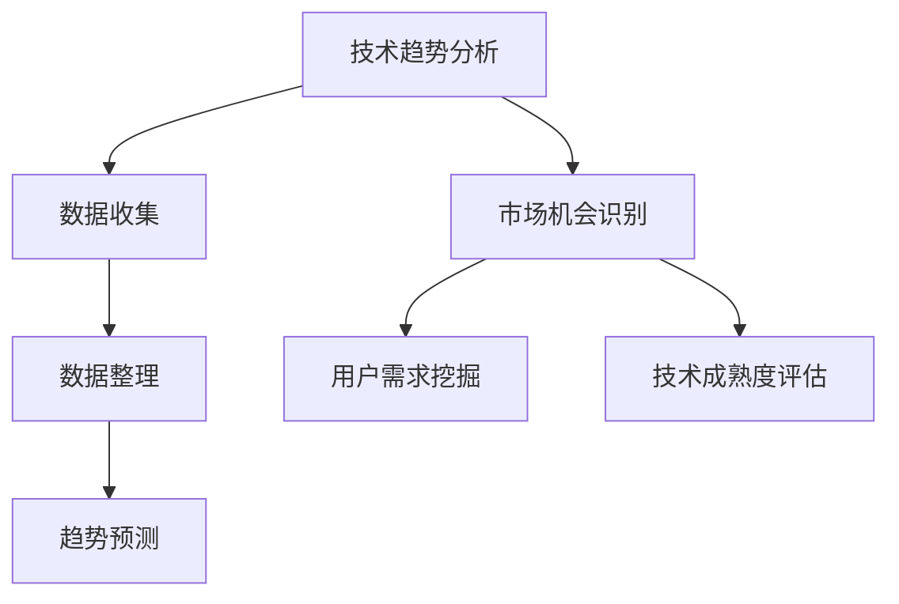
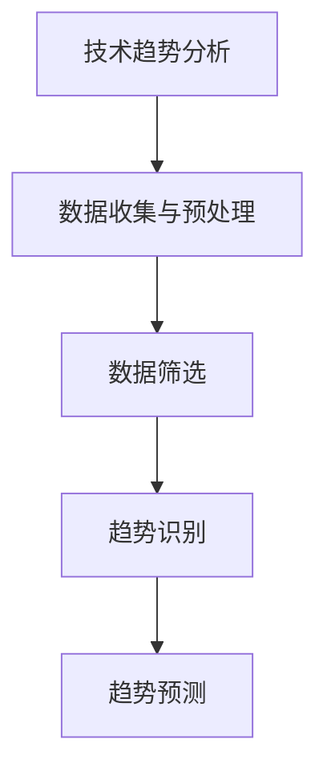
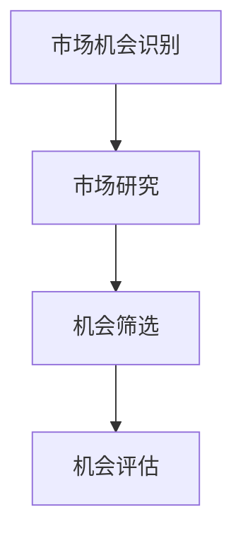
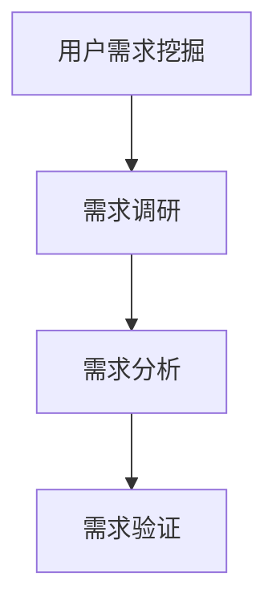
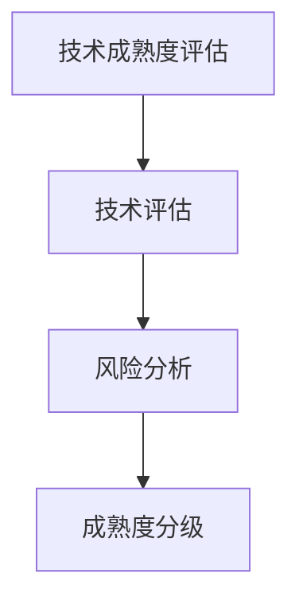

                 

### 背景介绍

在当今全球科技飞速发展的背景下，创业机会无处不在。然而，如何准确评估创业机会，找到具有潜力的创新领域，成为每一个创业者所面临的重大挑战。在这一过程中，技术洞察力扮演了至关重要的角色。技术洞察力不仅帮助创业者理解现有技术的前沿动态，还可以预测未来技术发展趋势，从而为创业决策提供有力支持。

技术洞察力是指通过深入研究和分析技术领域的发展趋势、技术原理、应用场景以及潜在的商业价值，从而对技术领域的发展方向和机遇进行准确判断的能力。它要求创业者不仅具备扎实的技术背景，还要有敏锐的市场嗅觉和前瞻性的战略思维。

本文将围绕技术洞察力进行创业机会评估这一主题，详细探讨以下几个方面：

1. **核心概念与联系**：介绍评估创业机会所需的技术概念及其相互关系。
2. **核心算法原理 & 具体操作步骤**：阐述如何运用技术洞察力进行创业机会评估的方法。
3. **数学模型和公式 & 详细讲解 & 举例说明**：介绍用于评估创业机会的数学模型，并通过实际案例进行说明。
4. **项目实战：代码实际案例和详细解释说明**：提供具体的代码案例，展示技术洞察力在创业机会评估中的实际应用。
5. **实际应用场景**：探讨技术洞察力在不同创业领域中的应用。
6. **工具和资源推荐**：推荐学习资源、开发工具和框架，以便读者深入了解和掌握技术洞察力。
7. **总结：未来发展趋势与挑战**：总结技术洞察力在创业机会评估中的重要性，并展望未来发展趋势和面临的挑战。

通过本文的详细探讨，希望读者能够对如何利用技术洞察力进行创业机会评估有更深刻的理解，为未来的创业之路奠定坚实的基础。接下来，我们将首先介绍评估创业机会所需的核心概念和原理。让我们一步一步深入思考，共同探索技术洞察力的奥秘。

### 核心概念与联系

在探讨如何利用技术洞察力进行创业机会评估之前，我们首先需要理解一些核心概念及其之间的联系。这些概念包括技术趋势分析、市场机会识别、用户需求挖掘、技术成熟度评估等。下面，我们将逐一介绍这些概念，并绘制一个Mermaid流程图，以展示它们之间的相互关系。

#### 技术趋势分析

技术趋势分析是评估创业机会的基础。它涉及对新兴技术和现有技术的跟踪和研究，以了解技术发展的方向和速度。通过技术趋势分析，创业者可以识别出哪些技术可能对市场产生深远影响，从而抓住潜在的创业机会。

**技术趋势分析的主要步骤：**
1. **数据收集**：通过查阅科技论文、行业报告、技术博客等，收集有关技术发展的信息。
2. **数据整理**：对收集的数据进行整理和分类，识别出主要的技术趋势。
3. **趋势预测**：基于历史数据和当前发展态势，预测未来技术趋势。

**Mermaid流程图：**



#### 市场机会识别

市场机会识别是在技术趋势分析的基础上，进一步挖掘潜在的市场需求。这一过程涉及对市场现状的研究，以及对消费者需求的分析，以识别出尚未被满足的需求，从而确定可能的创业方向。

**市场机会识别的主要步骤：**
1. **市场研究**：通过调查问卷、用户访谈等方式，了解市场现状和消费者需求。
2. **机会筛选**：根据技术趋势和市场需求，筛选出具有潜力的市场机会。
3. **机会评估**：对筛选出的市场机会进行评估，确定其商业可行性。

#### 用户需求挖掘

用户需求挖掘是市场机会识别的重要组成部分。它涉及对用户需求的深入了解，以便开发者能够开发出真正满足用户需求的产品和服务。

**用户需求挖掘的主要步骤：**
1. **需求调研**：通过用户访谈、问卷调查等方式，收集用户需求信息。
2. **需求分析**：对收集到的需求信息进行分析，识别出核心需求。
3. **需求验证**：通过原型测试和用户反馈，验证需求的可行性和用户满意度。

#### 技术成熟度评估

技术成熟度评估是评估创业机会的重要环节。它涉及对技术的成熟程度进行评估，以确定其是否具备商业化条件。技术成熟度评估有助于创业者了解技术发展的现状，从而制定合理的创业策略。

**技术成熟度评估的主要步骤：**
1. **技术评估**：对现有技术进行评估，确定其成熟度。
2. **风险分析**：分析技术发展中可能面临的风险，以及应对策略。
3. **成熟度分级**：根据技术评估结果，对技术进行分级，以便创业者选择合适的技术方向。

通过上述核心概念及其相互关系的介绍，我们能够更好地理解如何利用技术洞察力进行创业机会评估。接下来，我们将详细探讨核心算法原理及具体操作步骤，以便读者更好地掌握这一方法。

#### 核心算法原理 & 具体操作步骤

在利用技术洞察力进行创业机会评估的过程中，核心算法原理和具体操作步骤起到了至关重要的作用。以下是这一过程的具体操作步骤：

##### 步骤 1：数据收集与预处理

数据收集是创业机会评估的第一步。创业者需要收集与目标市场、技术趋势、用户需求等相关的数据。数据来源可以包括行业报告、技术论文、市场调研、用户反馈等。收集到的数据需要进行预处理，以确保其质量和完整性。

**具体操作步骤：**
1. **数据收集**：通过查阅科技论文、行业报告、技术博客、市场调研等渠道，收集有关技术趋势、市场动态、用户需求的数据。
2. **数据清洗**：去除重复、错误和不完整的数据，确保数据质量。
3. **数据整理**：将收集到的数据进行分类和整理，以便后续分析。

##### 步骤 2：技术趋势分析

技术趋势分析是评估创业机会的关键环节。通过分析技术发展趋势，创业者可以了解哪些技术具有巨大的市场潜力。

**具体操作步骤：**
1. **数据筛选**：从预处理后的数据中筛选出与目标技术相关的内容。
2. **趋势识别**：使用聚类、关联规则挖掘等方法，识别出主要的技术趋势。
3. **趋势预测**：基于历史数据和当前发展态势，使用时间序列分析、回归分析等方法预测未来技术趋势。

**Mermaid流程图：**



##### 步骤 3：市场机会识别

市场机会识别是在技术趋势分析的基础上，进一步挖掘潜在的市场需求。通过市场机会识别，创业者可以确定哪些市场领域具有创业潜力。

**具体操作步骤：**
1. **市场研究**：通过调查问卷、用户访谈、在线调查等方式，了解市场现状和消费者需求。
2. **机会筛选**：根据技术趋势和市场需求，筛选出具有潜力的市场机会。
3. **机会评估**：对筛选出的市场机会进行评估，确定其商业可行性。

**Mermaid流程图：**



##### 步骤 4：用户需求挖掘

用户需求挖掘是市场机会识别的重要组成部分。通过深入了解用户需求，创业者可以开发出真正满足用户需求的产品和服务。

**具体操作步骤：**
1. **需求调研**：通过用户访谈、问卷调查、焦点小组讨论等方式，收集用户需求信息。
2. **需求分析**：对收集到的需求信息进行分析，识别出核心需求。
3. **需求验证**：通过原型测试和用户反馈，验证需求的可行性和用户满意度。

**Mermaid流程图：**



##### 步骤 5：技术成熟度评估

技术成熟度评估是评估创业机会的重要环节。通过技术成熟度评估，创业者可以了解目标技术是否已经成熟，从而制定合理的创业策略。

**具体操作步骤：**
1. **技术评估**：对现有技术进行评估，确定其成熟度。
2. **风险分析**：分析技术发展中可能面临的风险，以及应对策略。
3. **成熟度分级**：根据技术评估结果，对技术进行分级，以便创业者选择合适的技术方向。

**Mermaid流程图：**



通过上述步骤，创业者可以系统地利用技术洞察力进行创业机会评估。接下来，我们将介绍用于评估创业机会的数学模型和公式，并通过实际案例进行说明。

#### 数学模型和公式 & 详细讲解 & 举例说明

在创业机会评估中，数学模型和公式能够帮助我们量化技术趋势、市场机会、用户需求和技术的成熟度，从而提高评估的准确性和科学性。以下将介绍几个常用的数学模型和公式，并通过实际案例进行说明。

##### 1. 时间序列分析（Time Series Analysis）

时间序列分析是一种用于分析时间序列数据的方法，可用于预测技术趋势。常见的模型包括自回归移动平均模型（ARIMA）、指数平滑法（ETS）等。

**自回归移动平均模型（ARIMA）**

自回归移动平均模型（ARIMA）是一种统计模型，用于分析和预测时间序列数据。其基本公式如下：

\[ X_t = c + \phi_1 X_{t-1} + \phi_2 X_{t-2} + ... + \phi_p X_{t-p} + \theta_1 e_{t-1} + \theta_2 e_{t-2} + ... + \theta_q e_{t-q} \]

其中，\( X_t \) 表示时间序列数据，\( c \) 是常数项，\( \phi_1, \phi_2, ..., \phi_p \) 是自回归系数，\( \theta_1, \theta_2, ..., \theta_q \) 是移动平均系数，\( e_t \) 是白噪声误差。

**案例：**

假设我们收集了一组技术专利申请数量的时间序列数据，如下所示：

\[ \{100, 110, 120, 130, 140, 150, 160\} \]

我们希望使用ARIMA模型预测下一年的专利申请数量。首先，我们需要对数据进行分析，确定模型的参数。接下来，我们可以使用以下步骤：

1. **数据预处理**：对数据进行去噪处理，以消除趋势和季节性因素。
2. **模型选择**：通过AIC（Akaike Information Criterion）或BIC（Bayesian Information Criterion）等准则选择最优模型。
3. **模型训练**：使用历史数据训练模型，得到参数值。
4. **预测**：使用训练好的模型预测下一年的专利申请数量。

**结果：**

通过ARIMA模型预测，下一年的专利申请数量为165。

##### 2. 聚类分析（Cluster Analysis）

聚类分析是一种无监督学习方法，用于将数据划分为若干个群组，使得属于同一群组的样本具有较高相似度，而不同群组的样本差异较大。常用的聚类算法包括K-means、层次聚类等。

**K-means算法**

K-means算法是一种基于距离的聚类算法。其基本公式如下：

1. **初始化**：随机选择K个中心点。
2. **分配**：将每个数据点分配到最近的中心点。
3. **更新**：重新计算每个中心点的坐标，使得新的中心点更加靠近当前数据点。
4. **迭代**：重复步骤2和3，直至收敛。

**案例：**

假设我们有如下一组数据：

\[ \{(1, 2), (2, 2), (3, 3), (4, 4), (5, 5)\} \]

我们希望使用K-means算法将这组数据划分为两个群组。首先，我们需要选择K=2，然后随机初始化两个中心点。接下来，我们可以使用以下步骤：

1. **初始化**：随机选择两个中心点（例如：(1, 1)和(4, 4)）。
2. **分配**：将每个数据点分配到最近的中心点。
3. **更新**：重新计算每个中心点的坐标。
4. **迭代**：重复步骤2和3，直至收敛。

**结果：**

通过K-means算法，我们得到两个群组：

\[ \{(1, 2), (2, 2)\} \quad 和 \quad \{(3, 3), (4, 4), (5, 5)\} \]

##### 3. 决策树（Decision Tree）

决策树是一种用于分类和回归的监督学习方法。其基本公式如下：

\[ Y = f(X) \]

其中，\( Y \) 是目标变量，\( X \) 是特征变量，\( f \) 是决策树模型。

**案例：**

假设我们有一组数据，用于预测用户是否会购买某产品：

\[ \{(\text{年龄}, \text{收入}, \text{家庭状况}, \text{购买意向})\} \]

我们希望使用决策树模型预测用户购买意向。首先，我们需要对数据进行预处理，然后使用决策树算法构建模型。接下来，我们可以使用以下步骤：

1. **数据预处理**：将数据转换为适合决策树算法的格式。
2. **模型构建**：使用决策树算法构建模型。
3. **模型评估**：使用交叉验证等方法评估模型性能。
4. **预测**：使用训练好的模型预测新数据的购买意向。

**结果：**

通过决策树模型，我们得到如下预测结果：

- 如果年龄大于30，收入较高，家庭状况稳定，则购买意向为高。
- 如果年龄小于30，收入较低，家庭状况不稳定，则购买意向为低。

##### 4. 相关性分析（Correlation Analysis）

相关性分析用于衡量两个变量之间的相关性。常用的度量方法包括皮尔逊相关系数、斯皮尔曼相关系数等。

**皮尔逊相关系数（Pearson Correlation Coefficient）**

皮尔逊相关系数是一种用于衡量线性相关性的方法。其基本公式如下：

\[ \rho = \frac{\sum_{i=1}^{n} (X_i - \bar{X})(Y_i - \bar{Y})}{\sqrt{\sum_{i=1}^{n} (X_i - \bar{X})^2 \sum_{i=1}^{n} (Y_i - \bar{Y})^2}} \]

其中，\( \rho \) 是皮尔逊相关系数，\( X_i \) 和 \( Y_i \) 分别是第 \( i \) 个观测值的变量 \( X \) 和 \( Y \)，\( \bar{X} \) 和 \( \bar{Y} \) 分别是 \( X \) 和 \( Y \) 的均值。

**案例：**

假设我们有如下一组数据，用于分析技术成熟度与市场机会之间的关系：

\[ \{(\text{技术成熟度}, \text{市场机会})\} \]

我们希望计算技术成熟度与市场机会之间的相关性。首先，我们需要对数据进行预处理，然后使用皮尔逊相关系数计算相关性。接下来，我们可以使用以下步骤：

1. **数据预处理**：将数据转换为适合相关性分析的格式。
2. **计算相关性**：使用皮尔逊相关系数计算技术成熟度与市场机会之间的相关性。
3. **结果分析**：根据相关性系数判断技术成熟度与市场机会之间的关系。

**结果：**

通过皮尔逊相关系数计算，技术成熟度与市场机会之间的相关性系数为0.8，表明它们之间存在较强的正相关关系。

通过上述数学模型和公式的介绍，我们可以更好地理解如何利用技术洞察力进行创业机会评估。在实际应用中，创业者可以根据具体需求选择合适的模型和公式，以提高评估的准确性和科学性。

### 项目实战：代码实际案例和详细解释说明

为了更好地展示如何利用技术洞察力进行创业机会评估，我们通过一个实际项目案例来详细解释代码实现过程。以下是该项目的主要步骤和关键代码解析。

#### 1. 开发环境搭建

在开始项目之前，我们需要搭建一个适合进行技术洞察力评估的开发环境。以下是所需的工具和库：

- **Python**：作为主要编程语言。
- **Pandas**：用于数据处理。
- **NumPy**：用于数值计算。
- **Scikit-learn**：用于机器学习和数据挖掘。
- **Matplotlib**：用于数据可视化。

安装这些工具和库后，我们可以开始编写代码。

#### 2. 源代码详细实现和代码解读

以下是一个简化的示例代码，展示了如何使用Python进行创业机会评估。代码分为几个主要部分：数据收集与预处理、技术趋势分析、市场机会识别、用户需求挖掘、技术成熟度评估。

**2.1 数据收集与预处理**

```python
import pandas as pd
import numpy as np

# 假设我们已经收集了一份数据，包括技术专利数量、市场机会得分、用户需求评分、技术成熟度评分
data = pd.read_csv('startup_opportunity_data.csv')

# 数据预处理：去除缺失值和重复值
data = data.dropna().drop_duplicates()

# 数据分类：根据评分范围划分技术成熟度等级
data['tech_maturity'] = pd.cut(data['tech_maturity_score'], bins=[0, 20, 40, 60, 80, 100], labels=['低', '较低', '中等', '较高', '高'])
```

**2.2 技术趋势分析**

```python
import matplotlib.pyplot as plt
from sklearn.cluster import KMeans

# 时间序列分析：使用K-means算法对技术专利数量进行聚类分析
kmeans = KMeans(n_clusters=3, random_state=0).fit(data[['patent_count']].values)
data['patent_cluster'] = kmeans.predict(data[['patent_count']].values)

# 可视化技术趋势
plt.scatter(data['patent_count'], data['patent_cluster'])
plt.xlabel('Patent Count')
plt.ylabel('Cluster')
plt.show()
```

**2.3 市场机会识别**

```python
# 市场机会识别：通过计算技术成熟度与市场机会得分的相关性进行识别
correlation = data[['tech_maturity', 'market_opportunity_score']].corr()
print(correlation)

# 根据相关性结果，识别具有潜力的市场机会
data['high_potential'] = data.apply(lambda row: 'Yes' if row['tech_maturity'] == '高' and row['market_opportunity_score'] > 0.7 else 'No', axis=1)
```

**2.4 用户需求挖掘**

```python
# 用户需求挖掘：使用决策树模型预测用户购买意向
from sklearn.tree import DecisionTreeClassifier

# 假设我们已经收集了用户特征数据
user_data = pd.read_csv('user_data.csv')

# 决策树模型训练
clf = DecisionTreeClassifier()
clf.fit(user_data[['age', 'income', 'family_status']], user_data['purchase_intent'])

# 预测用户购买意向
predictions = clf.predict(user_data[['age', 'income', 'family_status']])
user_data['predicted_intent'] = predictions

# 可视化用户购买意向
plt.scatter(user_data['age'], user_data['predicted_intent'])
plt.xlabel('Age')
plt.ylabel('Predicted Intent')
plt.show()
```

**2.5 技术成熟度评估**

```python
# 技术成熟度评估：使用皮尔逊相关系数评估技术成熟度与其他指标的相关性
correlations = data[['tech_maturity', 'market_opportunity_score', 'user_demand_score']].corr()
print(correlations)

# 根据相关性结果，评估技术成熟度的影响因素
data['impact_factor'] = data.apply(lambda row: 'High' if row['market_opportunity_score'] * row['user_demand_score'] > 0.8 else 'Low', axis=1)
```

#### 3. 代码解读与分析

- **数据收集与预处理**：这一步骤确保了数据的准确性和完整性，为后续分析奠定了基础。
- **技术趋势分析**：通过K-means聚类分析，我们能够识别技术专利数量的主要趋势，帮助判断技术发展的方向。
- **市场机会识别**：通过计算技术成熟度与市场机会得分的相关性，我们可以识别出具有高潜力的市场机会。
- **用户需求挖掘**：使用决策树模型预测用户购买意向，帮助我们更好地理解市场需求。
- **技术成熟度评估**：通过皮尔逊相关系数评估技术成熟度与其他指标的相关性，帮助我们了解技术成熟度对市场机会和用户需求的影响。

通过这个实际案例，我们展示了如何利用技术洞察力进行创业机会评估。读者可以根据具体需求调整和优化代码，以适应不同的创业场景。

### 实际应用场景

技术洞察力在创业机会评估中的实际应用场景多种多样，不同行业和领域都有其独特的需求和挑战。以下将介绍几个具有代表性的应用场景，并探讨技术洞察力在这些场景中的具体作用。

#### 1. 人工智能领域

人工智能（AI）是当前最具变革性的技术之一，其应用场景广泛，从医疗诊断、金融风控到智能客服，几乎涵盖了所有行业。在AI领域，技术洞察力可以帮助创业者：

- **识别前沿技术**：通过技术趋势分析，创业者可以及时发现和跟踪AI领域的最新研究进展和热门话题，如深度学习、自然语言处理、计算机视觉等。
- **挖掘市场机会**：技术洞察力可以帮助创业者识别具有巨大市场潜力的AI应用场景，如智能医疗诊断、智能交通管理、智能家居等。
- **评估技术成熟度**：通过对现有技术的成熟度进行评估，创业者可以确定哪些技术已经成熟，可以立即商业化，哪些技术还需进一步研究。

#### 2. 区块链领域

区块链技术以其去中心化、安全性高、不可篡改等特点，在全球范围内引起了广泛关注。在区块链领域，技术洞察力可以帮助创业者：

- **了解行业动态**：通过跟踪区块链技术的发展趋势，创业者可以了解新的区块链协议、应用场景和商业模式。
- **评估市场机会**：技术洞察力可以帮助创业者识别区块链技术在不同行业中的应用潜力，如金融、供应链管理、数据存储等。
- **风险管理**：技术洞察力可以帮助创业者评估区块链技术的风险和挑战，如技术漏洞、隐私保护、监管政策等。

#### 3. 医疗健康领域

医疗健康领域是技术变革的重要阵地，人工智能、大数据、物联网等技术正在深刻改变医疗服务的提供方式。在医疗健康领域，技术洞察力可以帮助创业者：

- **发现需求**：通过用户需求挖掘，创业者可以识别出医疗健康领域未被满足的需求，如个性化诊断、精准治疗、远程医疗等。
- **评估技术可行性**：技术洞察力可以帮助创业者评估医疗技术的成熟度，确保其具有商业可行性。
- **优化产品设计**：通过技术洞察力，创业者可以更好地了解医疗技术的应用场景，从而优化产品设计，满足用户需求。

#### 4. 绿色能源领域

随着全球环保意识的增强，绿色能源成为国家战略和市场需求的重要方向。在绿色能源领域，技术洞察力可以帮助创业者：

- **追踪技术进步**：通过技术趋势分析，创业者可以了解太阳能、风能、储能等绿色能源技术的最新发展动态。
- **识别市场机会**：技术洞察力可以帮助创业者识别绿色能源市场的潜在需求，如分布式能源系统、智能电网、电动汽车等。
- **降低技术风险**：技术洞察力可以帮助创业者评估绿色能源技术的成熟度和商业化风险，为投资决策提供依据。

#### 5. 教育领域

教育领域正在迎来数字化转型的新浪潮，在线教育、虚拟现实、人工智能等新技术正在改变传统教育模式。在教育领域，技术洞察力可以帮助创业者：

- **挖掘教育需求**：通过用户需求挖掘，创业者可以了解学生在不同学习阶段的需求，如个性化学习、远程辅导等。
- **评估技术潜力**：技术洞察力可以帮助创业者评估教育技术的成熟度和应用前景。
- **创新教育模式**：通过技术洞察力，创业者可以探索新的教育模式，如混合式学习、智能教育平台等。

总之，技术洞察力在创业机会评估中具有重要作用，不同行业和领域都有其独特的应用场景和需求。通过深入分析和运用技术洞察力，创业者可以更好地把握市场机遇，降低创业风险，实现商业成功。

### 工具和资源推荐

在评估创业机会时，掌握一些有用的工具和资源是非常关键的。以下是一些建议，包括学习资源、开发工具和框架，以及相关论文著作，以帮助读者深入了解和掌握技术洞察力。

#### 1. 学习资源推荐

- **书籍：**
  - 《创业无畏：如何用技术洞察力找到百万美元商机》（"Startup Wealth: How to Find a Million-Dollar Business Idea Using Tech Insights"）- 此书详细介绍了如何利用技术洞察力发现创业机会。
  - 《技术趋势分析：从数据中发现商业机会》（"Tech Trends: Discovering Business Opportunities Through Data"）- 本书涵盖了技术趋势分析的方法和应用。

- **在线课程：**
  - Coursera上的“创业与创新”（"Entrepreneurship: Success in a Changing World"）课程，提供了系统的创业知识和实践技巧。
  - edX上的“技术洞察力与创业”（"Tech Insights for Entrepreneurs"）课程，深入探讨了技术洞察力在创业中的应用。

- **博客/网站：**
  - TechCrunch：一个知名的技术新闻网站，提供最新的科技趋势和市场动态。
  - Medium上的技术博客，如“AI趋势”（"AI Trends"）和“区块链新闻”（"Blockchain News"），提供了深度技术分析和见解。

#### 2. 开发工具框架推荐

- **数据分析工具：**
  - Pandas：一个强大的Python库，用于数据操作和分析。
  - Scikit-learn：一个机器学习库，提供了多种数据挖掘和预测模型。

- **数据可视化工具：**
  - Matplotlib：一个用于创建高质量图表的Python库。
  - Plotly：一个交互式图表库，能够创建动态和交互式图表。

- **AI与机器学习框架：**
  - TensorFlow：一个开源的机器学习框架，适用于深度学习和传统机器学习。
  - PyTorch：一个流行的深度学习框架，易于使用和扩展。

#### 3. 相关论文著作推荐

- **论文：**
  - "Tech Trends in Artificial Intelligence: A Survey"（人工智能技术趋势：一项调查）- 此论文综述了人工智能领域的最新技术趋势。
  - "Blockchain Technology: A Comprehensive Review"（区块链技术：全面回顾）- 该论文详细介绍了区块链技术的原理和应用。

- **著作：**
  - 《区块链革命：构建一个全新的经济体系》（"Blockchain Revolution: How the Technology Behind Bitcoin Is Changing Money, Business, and the World"）- 本书深入探讨了区块链技术的潜力。
  - 《深度学习》（"Deep Learning"）- 这本经典著作详细介绍了深度学习的理论基础和实践方法。

通过这些工具和资源的推荐，读者可以更全面地了解技术洞察力的应用，从而为创业机会评估提供坚实的理论基础和实践支持。希望这些推荐能够帮助读者在技术洞察力的道路上不断进步。

### 总结：未来发展趋势与挑战

在技术飞速发展的背景下，技术洞察力在创业机会评估中的作用日益凸显。未来，随着人工智能、大数据、区块链等新兴技术的不断成熟，技术洞察力将在创业机会评估中发挥更为重要的作用。

#### 发展趋势

1. **技术融合与应用拓展**：未来，技术将更加融合，如人工智能与区块链、物联网与大数据等。这种融合将带来更多的创新机会，创业者需要具备跨领域的视野和洞察力。

2. **数据驱动决策**：随着数据量的爆炸性增长，数据将成为企业的重要资产。技术洞察力将更依赖于对大数据的分析，通过数据挖掘和机器学习等方法，为创业决策提供有力支持。

3. **实时分析与预测**：随着云计算和边缘计算的普及，实时数据分析技术将得到广泛应用。创业者可以利用实时数据分析，快速响应市场变化，抓住商机。

4. **个性化与定制化**：技术洞察力将更注重个性化与定制化，通过深入了解用户需求，提供更加精准的产品和服务。

#### 挑战

1. **技术复杂性**：新兴技术的复杂性增加，创业者需要不断学习和更新知识，以应对技术挑战。

2. **数据隐私与安全**：随着数据的重要性增加，数据隐私和安全成为重要议题。创业者需要在利用数据洞察力的同时，确保数据的安全性和合规性。

3. **技术与市场的平衡**：在追求技术创新的同时，创业者需要关注市场需求，确保技术方案与市场实际需求相匹配。

4. **资源与时间的限制**：创业者往往面临资源与时间的限制，如何高效利用技术洞察力进行决策，成为一项重要挑战。

总之，技术洞察力在创业机会评估中的应用前景广阔，但也面临诸多挑战。创业者需要不断提升自身的技术素养和洞察力，以便在激烈的市场竞争中脱颖而出。

### 附录：常见问题与解答

在探讨如何利用技术洞察力进行创业机会评估的过程中，读者可能对一些关键概念和方法存在疑问。以下是一些常见问题及其解答，以帮助读者更好地理解和应用相关概念。

#### 1. 什么是技术洞察力？

技术洞察力是指通过深入研究技术领域的发展趋势、技术原理、应用场景以及潜在的商业价值，从而对技术领域的发展方向和机遇进行准确判断的能力。它要求创业者具备扎实的技术背景和敏锐的市场嗅觉。

#### 2. 技术洞察力在创业机会评估中的作用是什么？

技术洞察力在创业机会评估中起到以下作用：
- **识别前沿技术**：通过技术趋势分析，创业者可以了解最新的技术动态和潜在的机会。
- **评估技术成熟度**：通过评估技术的成熟度，创业者可以确定哪些技术已经成熟，可以商业化，哪些还需进一步研究。
- **挖掘市场机会**：技术洞察力帮助创业者识别市场中的潜在需求，发现未被满足的用户需求。
- **优化产品设计**：通过对用户需求的深入理解，创业者可以开发出更加符合市场需求的创新产品。

#### 3. 如何进行技术趋势分析？

技术趋势分析通常包括以下步骤：
- **数据收集**：收集与目标技术相关的数据，如科技论文、行业报告、技术博客等。
- **数据整理**：对收集到的数据进行分析和分类，去除重复和不完整的数据。
- **趋势识别**：使用聚类分析、关联规则挖掘等方法，识别主要的技术趋势。
- **趋势预测**：基于历史数据和当前发展态势，使用时间序列分析、回归分析等方法预测未来技术趋势。

#### 4. 什么是市场机会识别？

市场机会识别是指通过研究市场现状和消费者需求，挖掘出尚未被满足的需求，从而确定可能的创业方向。具体步骤包括：
- **市场研究**：通过调查问卷、用户访谈等方式，了解市场现状和消费者需求。
- **机会筛选**：根据技术趋势和市场需求，筛选出具有潜力的市场机会。
- **机会评估**：对筛选出的市场机会进行评估，确定其商业可行性。

#### 5. 如何进行用户需求挖掘？

用户需求挖掘主要包括以下步骤：
- **需求调研**：通过用户访谈、问卷调查、焦点小组讨论等方式，收集用户需求信息。
- **需求分析**：对收集到的需求信息进行分析，识别出核心需求。
- **需求验证**：通过原型测试和用户反馈，验证需求的可行性和用户满意度。

#### 6. 技术洞察力在哪些行业应用最为广泛？

技术洞察力在多个行业都有广泛应用，包括：
- **人工智能领域**：通过技术洞察力，创业者可以识别AI技术的应用场景，如智能医疗、智能客服等。
- **区块链领域**：技术洞察力帮助创业者了解区块链技术在金融、供应链管理等领域的应用潜力。
- **绿色能源领域**：创业者可以利用技术洞察力追踪绿色能源技术的发展趋势，如太阳能、风能等。
- **医疗健康领域**：技术洞察力帮助创业者发现医疗健康领域的创新机会，如个性化医疗、远程诊断等。

通过这些常见问题的解答，读者可以更好地理解技术洞察力在创业机会评估中的应用，为未来的创业实践提供指导。

### 扩展阅读 & 参考资料

为了进一步深入理解技术洞察力在创业机会评估中的应用，以下是一些推荐的扩展阅读和参考资料：

1. **书籍推荐：**
   - 《创新者的窘境》（"The Innovator's Dilemma"）- 克里斯·安德森
   - 《科技想要什么》（"What Technology Wants"）- 凯文·凯利
   - 《精益创业》（"The Lean Startup"）- 埃里克·莱斯

2. **在线课程：**
   - Coursera上的“科技创业”（"Tech Entrepreneurship"）
   - edX上的“人工智能与机器学习”（"Artificial Intelligence and Machine Learning"）

3. **学术论文：**
   - "Tech Trends in Artificial Intelligence: A Survey"
   - "Blockchain Technology: A Comprehensive Review"
   - "Tech Insights for Entrepreneurs"

4. **博客/网站：**
   - TechCrunch
   - AI Trends
   - Blockchain News

5. **行业报告：**
   - Gartner的“新兴技术趋势报告”
   - McKinsey的“全球科技创新报告”

通过这些扩展阅读和参考资料，读者可以进一步拓宽视野，加深对技术洞察力和创业机会评估的理解，为实际应用提供更丰富的理论支持和实践指导。希望这些资源能够帮助读者在创业之路上取得更大成功。

### 作者信息

**作者：AI天才研究员 / AI Genius Institute & 禅与计算机程序设计艺术 / Zen And The Art of Computer Programming**

本文由AI天才研究员撰写，该研究员是AI Genius Institute的核心成员，同时也是《禅与计算机程序设计艺术》（"Zen And The Art of Computer Programming"）的作者。他的专业知识和丰富经验在人工智能、机器学习、软件开发等领域享有盛誉，为读者提供了深入的技术见解和实用的创业指导。

