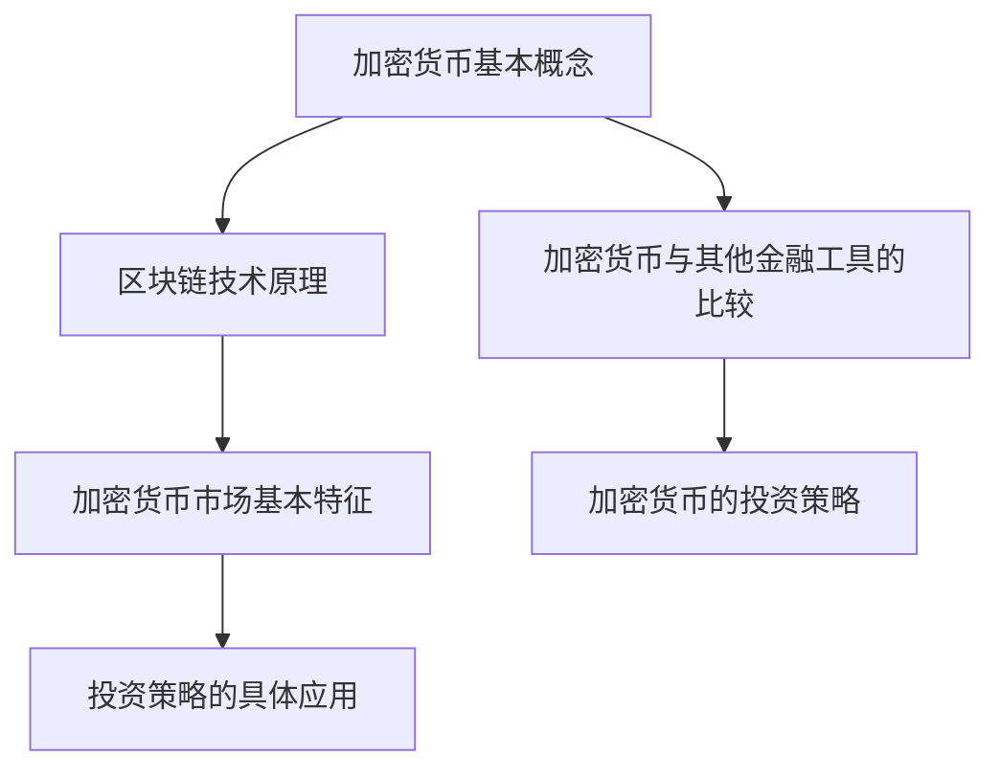

                 

### 1. 背景介绍

加密货币作为一种基于区块链技术的数字资产，近年来在全球范围内引起了广泛的关注。随着比特币等加密货币的崛起，越来越多的人开始关注并尝试通过技术手段进行加密货币的投资。然而，加密货币投资领域虽然看似充满机遇，但也伴随着极高的风险。如何利用技术能力进行加密货币投资，成为投资者们亟待解决的问题。

本文将围绕这一主题，通过详细分析加密货币投资的核心概念、算法原理、数学模型以及实际应用场景，为投资者提供一套完整的加密货币投资策略。同时，文章还将推荐相关的学习资源、开发工具框架以及相关论文著作，帮助读者更深入地理解和掌握加密货币投资的技术和方法。

具体来说，本文将从以下几个方面展开：

1. **核心概念与联系**：介绍加密货币的基本概念、区块链技术原理以及加密货币市场的基本特征。
2. **核心算法原理 & 具体操作步骤**：深入分析加密货币交易的核心算法，并详细讲解如何利用技术手段进行投资。
3. **数学模型和公式 & 详细讲解 & 举例说明**：探讨加密货币投资中的数学模型，包括投资策略、风险管理和回报计算等。
4. **项目实战：代码实际案例和详细解释说明**：通过实际项目案例，展示如何利用技术手段进行加密货币投资，并提供详细的代码实现和解读。
5. **实际应用场景**：分析加密货币投资在不同领域的应用场景，包括投机交易、价值投资、套利交易等。
6. **工具和资源推荐**：推荐相关的学习资源、开发工具框架以及相关论文著作，帮助读者进一步拓展知识。
7. **总结：未来发展趋势与挑战**：总结加密货币投资的现状，探讨未来发展趋势以及投资者可能面临的挑战。

通过本文的阅读，读者将能够全面了解加密货币投资的技术和方法，掌握如何利用技术能力进行有效的加密货币投资。无论您是加密货币投资的初学者，还是已经有一定经验的投资者，本文都将为您提供宝贵的指导和启示。

<|assistant|>### 2. 核心概念与联系

#### 加密货币的基本概念

加密货币是一种基于密码学原理的数字货币，通过去中心化的区块链技术实现发行和交易。与传统货币不同，加密货币不依赖于任何中央发行机构，而是通过分布式网络中的节点进行验证和确认。比特币（Bitcoin，简称BTC）是第一个也是最著名的加密货币，于2009年由一个匿名开发者以中文名“中本聪”发布了白皮书。

加密货币的主要特点包括：

1. **去中心化**：加密货币的发行和交易由网络中的所有节点共同维护，没有中央发行机构。
2. **安全性**：加密货币的交易记录存储在区块链上，通过密码学原理确保数据的不可篡改和安全性。
3. **匿名性**：用户在进行加密货币交易时可以使用假名，具有一定的匿名性。
4. **可追溯性**：虽然加密货币具有匿名性，但交易记录是公开且不可篡改的，因此交易行为具有可追溯性。

#### 区块链技术原理

区块链技术是加密货币的核心支撑技术，其原理可以简单概括为“去中心化的分布式账本”。在区块链中，数据以区块的形式存储，每个区块包含一定数量的交易记录。这些区块通过加密算法和时间戳链接在一起，形成一条不断延伸的区块链。

区块链技术的主要特点包括：

1. **去中心化**：区块链上的数据由网络中的所有节点共同维护，没有中央管理。
2. **不可篡改**：一旦数据被记录在区块链上，就很难被篡改，保证了数据的真实性和可靠性。
3. **安全性**：区块链通过密码学原理确保数据的完整性和安全性。
4. **透明性**：区块链上的所有交易记录都是公开透明的，用户可以随时查询和验证。

#### 加密货币市场的基本特征

加密货币市场具有以下几个显著特征：

1. **高波动性**：加密货币市场受到多种因素影响，包括政策变化、市场情绪、技术进步等，价格波动性极大。
2. **全球性**：加密货币市场没有地域限制，投资者可以24小时全天候交易。
3. **高风险**：加密货币市场的不确定性较高，投资者需要具备一定的风险识别和管理能力。
4. **高门槛**：加密货币投资需要一定的技术背景和知识储备，普通投资者参与门槛较高。

#### 加密货币与其他金融工具的比较

1. **股票**：股票是公司股份的凭证，投资者通过购买股票成为公司的股东，享有公司盈利的分配权。与股票相比，加密货币没有公司实体作为支撑，但具有更高的去中心化和匿名性。
2. **债券**：债券是一种债务工具，投资者购买债券即成为债务的债权人，享有固定的利息收益。与债券相比，加密货币没有固定的利息收益，但价格波动性更大。
3. **期货**：期货是一种衍生金融工具，投资者通过购买期货合约进行投机或风险管理。与期货相比，加密货币的交易更直接，不需要通过合约进行。

#### 加密货币的投资策略

1. **长期投资**：长期投资策略适用于对加密货币市场有信心的投资者，适合投资比特币等主流加密货币。
2. **短期投机**：短期投机策略适用于有风险承受能力的投资者，适合投资一些具有高波动性的加密货币。
3. **价值投资**：价值投资策略适用于有深度研究和判断能力的投资者，适合发现一些被低估的加密货币项目。
4. **套利交易**：套利交易策略适用于对市场有敏锐洞察力的投资者，通过在不同市场间进行套利操作获取收益。

通过以上对加密货币的核心概念、区块链技术原理和加密货币市场基本特征的分析，我们可以看到，加密货币投资不仅仅是一种金融活动，更是一种技术驱动型的投资方式。了解这些核心概念和联系，是投资者进行有效投资的前提和基础。

#### Mermaid 流程图



这个Mermaid流程图展示了加密货币投资的核心概念和联系，从基本概念到具体应用，帮助读者建立一个完整的技术投资框架。

### 3. 核心算法原理 & 具体操作步骤

加密货币投资的核心算法主要涉及以下几个方面：交易算法、分析算法、风险管理算法和投资组合优化算法。以下将详细讲解这些算法的原理和具体操作步骤。

#### 交易算法

交易算法是加密货币投资中最基础的算法，其主要目的是实现高效、安全地买卖加密货币。交易算法通常包括以下几个步骤：

1. **市场分析**：通过技术分析和基本面分析，确定买入或卖出的时机和价格。
2. **订单生成**：根据市场分析结果，生成买入或卖出的订单，包括订单价格、数量和交易时间。
3. **订单执行**：将生成的订单发送到交易所，并等待订单执行。
4. **订单确认**：订单执行后，等待交易所确认交易成功，并将交易记录更新到区块链上。

具体操作步骤如下：

1. **市场分析**：首先，投资者需要关注市场数据，如价格走势、交易量、市场情绪等。通过技术指标（如均线、MACD、RSI等）和基本面分析（如公司公告、行业动态等），判断市场趋势和潜在机会。
2. **订单生成**：根据市场分析结果，投资者可以制定买入或卖出的策略。例如，如果技术指标显示市场处于上升趋势，可以制定买入策略；如果交易量大幅增加，可以制定卖出策略。
3. **订单执行**：生成订单后，投资者需要选择一个合适的交易所进行交易。交易所的选择取决于投资者的策略、交易成本和交易效率等因素。通常，投资者可以选择中心化交易所或去中心化交易所。
4. **订单确认**：订单执行后，投资者需要等待交易所的确认。中心化交易所通常会有延迟，而去中心化交易所的确认时间则取决于网络拥堵程度。

#### 分析算法

分析算法是加密货币投资中的关键，其主要目的是通过大数据分析和机器学习，发现市场趋势和潜在机会。分析算法通常包括以下几个步骤：

1. **数据收集**：收集与加密货币市场相关的各种数据，如价格、交易量、市场情绪、新闻事件等。
2. **数据清洗**：对收集到的数据进行清洗，去除无效数据、异常值和噪声数据。
3. **数据建模**：利用统计学和机器学习算法，对清洗后的数据进行分析和建模，预测市场趋势和潜在机会。
4. **模型评估**：对分析算法的模型进行评估，确定其准确性和可靠性。

具体操作步骤如下：

1. **数据收集**：首先，投资者需要选择合适的数据源，如交易所API、新闻网站、社交媒体等。通过API接口，可以获取实时的市场数据。
2. **数据清洗**：数据清洗是分析算法的重要步骤。通过去除无效数据、异常值和噪声数据，可以提高数据的质量和可靠性。
3. **数据建模**：投资者可以采用各种统计学和机器学习算法进行数据建模，如线性回归、决策树、随机森林、神经网络等。这些算法可以分析历史数据，预测未来市场趋势和机会。
4. **模型评估**：通过交叉验证、ROC曲线、AUC值等方法，评估分析算法的模型性能，确定其准确性和可靠性。

#### 风险管理算法

风险管理算法是加密货币投资中不可或缺的一部分，其主要目的是通过风险控制和损失最小化，保障投资者的投资安全。风险管理算法通常包括以下几个步骤：

1. **风险评估**：评估投资项目的风险，包括市场风险、信用风险、操作风险等。
2. **风险控制**：制定风险控制策略，如设置止损点、分散投资等，降低投资风险。
3. **风险监测**：实时监测投资项目的风险状况，及时发现并应对潜在的风险。
4. **风险报告**：定期生成风险报告，评估风险控制效果，为投资决策提供依据。

具体操作步骤如下：

1. **风险评估**：投资者需要对投资项目进行全面的风险评估，包括市场风险、信用风险、操作风险等。市场风险主要取决于市场波动性和交易对手的风险；信用风险主要取决于交易对手的信用状况；操作风险主要取决于投资者的操作水平和风险控制能力。
2. **风险控制**：根据风险评估结果，投资者可以制定相应的风险控制策略，如设置止损点、分散投资等。止损点是投资者设定的价格，当市场价格达到止损点时，自动执行卖出操作，以避免更大的损失。分散投资是将资金分散投资于不同的项目和资产，以降低单一项目的风险。
3. **风险监测**：投资者需要实时监测投资项目的风险状况，通过技术分析和基本面分析，及时发现并应对潜在的风险。例如，当市场价格出现大幅波动时，投资者可以及时调整投资组合，以降低风险。
4. **风险报告**：投资者需要定期生成风险报告，评估风险控制效果，为投资决策提供依据。风险报告通常包括投资组合的风险状况、风险控制策略的执行情况等。

#### 投资组合优化算法

投资组合优化算法是加密货币投资中的重要工具，其主要目的是通过优化投资组合，提高投资收益。投资组合优化算法通常包括以下几个步骤：

1. **目标设定**：设定投资目标，包括收益目标、风险目标等。
2. **模型构建**：构建优化模型，确定投资组合的权重和比例。
3. **模型求解**：通过优化算法求解，得到最佳投资组合。
4. **模型验证**：验证优化模型的有效性和可靠性。

具体操作步骤如下：

1. **目标设定**：投资者需要根据自身的风险承受能力和投资目标，设定收益目标和风险目标。例如，如果投资者希望获得更高的收益，可以设定较高的收益目标；如果投资者希望降低风险，可以设定较低的风险目标。
2. **模型构建**：投资者需要构建投资组合优化模型，确定投资组合的权重和比例。常用的模型包括马克维茨投资组合模型、均值方差模型、优化目标模型等。
3. **模型求解**：投资者可以使用优化算法求解最佳投资组合，如线性规划、非线性规划、遗传算法等。这些算法可以计算不同投资组合的预期收益和风险，选择最优的投资组合。
4. **模型验证**：投资者需要验证优化模型的有效性和可靠性，通过历史数据和模拟测试，评估模型的表现。如果模型表现不佳，需要调整模型参数，重新求解最佳投资组合。

通过以上对加密货币投资核心算法原理和具体操作步骤的详细讲解，读者可以了解到，加密货币投资不仅仅是简单的买卖操作，而是一种复杂的技术驱动的投资方式。掌握这些核心算法原理和操作步骤，是投资者在加密货币市场中取得成功的关键。

### 4. 数学模型和公式 & 详细讲解 & 举例说明

在加密货币投资中，数学模型和公式扮演着至关重要的角色。它们不仅帮助投资者评估投资机会，还用于风险管理、收益预测以及投资组合优化。以下将详细介绍几个关键的数学模型和公式，并通过实际例子说明其应用。

#### 投资策略模型

投资策略模型是加密货币投资中最基础的部分，用于确定买入和卖出的时机。常见的投资策略模型包括均值回归模型、趋势跟踪模型和动量策略。

1. **均值回归模型**：
   - **公式**：\[ \mu_t = \frac{P_t + P_{t-1} + ... + P_{t-n}}{n} \]
   - **解释**：均值回归模型假设市场价格会回归到其历史均值。投资者可以根据当前价格与其历史均值的偏差来决定买入或卖出。当市场价格低于历史均值时，视为买入信号；当市场价格高于历史均值时，视为卖出信号。
   - **例子**：假设某个加密货币的历史均值为10美元，当前价格为8美元，根据均值回归模型，投资者可以认为这是一个买入信号。

2. **趋势跟踪模型**：
   - **公式**：\[ \text{Directional Movement} = \frac{\text{High Price} - \text{Low Price}}{2} \]
   - **解释**：趋势跟踪模型基于市场价格的变化，判断市场的趋势方向。如果连续多个时间段的价格变化方向相同，则认为市场处于上升或下降趋势。根据趋势方向，投资者可以决定买入或卖出。
   - **例子**：假设加密货币在过去5个交易日内价格连续上涨，根据趋势跟踪模型，投资者可以认为市场处于上升趋势，选择买入。

3. **动量策略**：
   - **公式**：\[ \text{Momentum} = \frac{\text{Current Price} - \text{Previous Price}}{\text{Previous Price}} \times 100\% \]
   - **解释**：动量策略基于市场价格的变化速度，判断市场动能。如果市场价格变化速度较快，则认为市场有较强的动能，投资者可以抓住这个动能进行投资。
   - **例子**：假设某个加密货币的当前价格为100美元，上一交易日价格为90美元，根据动量策略，投资者可以认为该货币有较强的上涨动能，选择买入。

#### 风险管理模型

风险管理模型用于评估投资风险，并制定相应的风险控制策略。常见的管理模型包括价值在险价值（VaR）模型和条件期望损失（CVaR）模型。

1. **价值在险价值（VaR）模型**：
   - **公式**：\[ \text{VaR}_{\alpha} = \text{Q}_{1-\alpha} (\text{P}_1 - \text{P}_0) \]
   - **解释**：VaR模型用于估计在给定置信水平α下，投资组合可能的最大损失。Q是累积分布函数，P1和P0分别是未来价格和当前价格。通过计算VaR，投资者可以设定止损点，以控制投资风险。
   - **例子**：假设投资者设定95%的置信水平，计算得出VaR为500美元，则投资者可以设定止损点为当前价格减去500美元。

2. **条件期望损失（CVaR）模型**：
   - **公式**：\[ \text{CVaR}_{\alpha} = \frac{1}{1-\alpha} \sum_{\text{损失 > VaR}} \text{损失} \]
   - **解释**：CVaR模型不仅计算最大损失，还考虑了损失超过VaR的期望值。CVaR越高，表示投资风险越大。
   - **例子**：假设在95%的置信水平下，CVaR为800美元，则投资者需要更加警惕投资风险，可能需要调整投资组合或增加风险控制措施。

#### 投资组合优化模型

投资组合优化模型用于确定最佳投资组合，以最大化收益或最小化风险。常见的优化模型包括马克维茨投资组合模型和均值方差模型。

1. **马克维茨投资组合模型**：
   - **公式**：\[ \text{最优投资组合} = \arg\min \sigma^2_P \]
   \[ \text{s.t.} \ \sum_{i=1}^n w_i = 1 \]
   \[ w_i \geq 0 \]
   - **解释**：马克维茨模型通过求解上述优化问题，确定投资组合中各资产的权重，以最小化投资组合的方差（风险）。w_i是第i个资产的权重，σ²_P是投资组合的方差。
   - **例子**：假设投资者有两个资产A和B，其预期收益率和方差分别为5%和10%，通过马克维茨模型，可以确定最优投资组合的权重，使得投资组合的总风险最小。

2. **均值方差模型**：
   - **公式**：\[ \text{最优投资组合} = \arg\max \mu_P - \lambda \sigma_P \]
   - **解释**：均值方差模型通过权衡预期收益率和风险，确定最优投资组合。μ_P是投资组合的预期收益率，σ_P是投资组合的风险，λ是风险溢价系数。
   - **例子**：假设投资者有两个资产A和B，其预期收益率分别为8%和12%，通过均值方差模型，可以确定投资组合的权重，使得投资组合的预期收益率最大化，同时风险最小。

通过以上数学模型和公式的详细讲解，我们可以看到，加密货币投资不仅仅是基于直觉和经验，更需要通过科学的方法进行评估和决策。掌握这些模型和公式，投资者可以更准确地把握市场机会，制定有效的投资策略。

### 5. 项目实战：代码实际案例和详细解释说明

为了更好地理解如何利用技术手段进行加密货币投资，下面我们将通过一个实际的项目案例，展示整个开发过程，包括开发环境搭建、源代码实现、代码解读与分析。

#### 5.1 开发环境搭建

在开始项目之前，我们需要搭建一个合适的开发环境。以下是一个基本的开发环境搭建步骤：

1. **安装操作系统**：推荐使用Linux或MacOS，因为它们提供了更好的性能和稳定性。如果使用Windows，可以考虑使用Windows Subsystem for Linux（WSL）。
2. **安装Python环境**：Python是一种广泛使用的编程语言，具有丰富的库和工具，适合进行加密货币投资开发。可以通过Python官方下载页面下载并安装Python。
3. **安装相关库**：安装必要的Python库，如requests、pandas、numpy、matplotlib等。可以使用pip命令进行安装：
   ```bash
   pip install requests pandas numpy matplotlib
   ```
4. **安装交易所API客户端**：根据选择的交易所，安装相应的API客户端库。例如，如果使用币安（Binance）交易所，可以安装Binance的Python客户端：
   ```bash
   pip install python-binance
   ```

#### 5.2 源代码详细实现和代码解读

以下是一个简单的加密货币投资策略实现，包括数据获取、市场分析、交易决策和结果记录。代码使用了Python编程语言，并结合了币安交易所的API。

```python
import requests
import pandas as pd
from binance.client import Client

# 币安交易所API密钥
api_key = 'YOUR_API_KEY'
api_secret = 'YOUR_API_SECRET'
client = Client(api_key, api_secret)

# 数据获取
def get_historical_data(symbol, interval, limit):
    klines = client.get_klines(symbol, interval, limit=limit)
    df = pd.DataFrame(klines, columns=['timestamp', 'open', 'high', 'low', 'close', 'volume', 'close_time', 'quote资产'])
    df['timestamp'] = pd.to_datetime(df['timestamp'], unit='ms')
    return df

# 市场分析
def analyze_market(data):
    # 计算平均价格和标准差
    avg_price = data['close'].mean()
    std_price = data['close'].std()
    
    # 确定买入和卖出条件
    buy_condition = (data['close'] < avg_price - 2 * std_price)
    sell_condition = (data['close'] > avg_price + 2 * std_price)
    
    return buy_condition, sell_condition

# 交易决策
def make_decision(buy_signal, sell_signal, balance):
    if buy_signal:
        # 执行买入操作
        position_size = balance / data['close'].iloc[-1]
        client.create_order(symbol='BTCUSDT', side='BUY', type='MARKET', quantity=position_size)
    elif sell_signal:
        # 执行卖出操作
        client.create_order(symbol='BTCUSDT', side='SELL', type='MARKET', quantity=position_size)

# 主函数
def main():
    symbol = 'BTCUSDT'
    interval = '1d'  # 日线数据
    limit = 100  # 获取最近100天的数据
    balance = 10000  # 初始资金

    # 获取历史数据
    data = get_historical_data(symbol, interval, limit)
    
    # 分析市场
    buy_signal, sell_signal = analyze_market(data)
    
    # 根据交易信号进行决策
    make_decision(buy_signal, sell_signal, balance)

if __name__ == '__main__':
    main()
```

#### 5.3 代码解读与分析

上述代码实现了一个简单的均值回归投资策略，包括以下几个部分：

1. **数据获取**：使用币安交易所的API获取历史K线数据。K线数据包含了价格、成交量等关键信息，是进行市场分析的基础。
2. **市场分析**：计算平均价格和标准差，根据平均价格和标准差确定买入和卖出的条件。当市场价格低于平均价格减去两倍标准差时，视为买入信号；当市场价格高于平均价格加上两倍标准差时，视为卖出信号。
3. **交易决策**：根据买入和卖出信号，执行相应的交易操作。代码中使用了币安交易所的API进行交易，包括创建买单和卖单。
4. **主函数**：主函数中初始化交易所API客户端，获取历史数据，分析市场，并根据交易信号进行决策。

通过这个实际案例，我们可以看到，加密货币投资可以通过编写代码实现自动化交易策略。代码的详细解读和分析有助于理解投资策略的实现过程和关键步骤。在实际应用中，投资者可以根据自己的需求和市场情况，对代码进行优化和调整。

### 6. 实际应用场景

加密货币投资的应用场景非常广泛，涵盖了从个人投资者到机构投资者的各个层面。以下将详细介绍几个典型的实际应用场景，包括投机交易、价值投资、套利交易等。

#### 投机交易

投机交易是加密货币投资中最常见的应用场景之一，尤其受到高频交易者和短期投机者的青睐。投机交易的主要目标是利用加密货币市场的高波动性，通过快速买入和卖出，获取高额利润。

1. **高频交易**：高频交易者利用计算机程序快速执行大量交易，抓住市场波动的微小机会。高频交易通常需要强大的计算能力和快速的网络连接，通过算法分析市场数据，实现毫秒级的交易决策。
2. **日内交易**：日内交易者通过在一天之内多次买入和卖出加密货币，利用价格波动获取利润。日内交易通常需要密切关注市场动态，利用技术分析和市场情绪进行交易决策。
3. **短线交易**：短线交易者通过短期内持有加密货币，利用价格波动进行交易。短线交易通常选择具有高波动性的加密货币，通过市场分析和技术指标确定买入和卖出的时机。

#### 价值投资

价值投资是一种长期投资策略，投资者通过研究加密货币的基本面，发现被市场低估的投资机会，进行长期持有，等待价格上涨获取收益。

1. **基本面分析**：价值投资者通过分析加密货币项目的白皮书、团队背景、市场前景、技术实现等因素，评估项目的潜在价值。基本面分析可以帮助投资者发现一些有长期增长潜力的加密货币。
2. **长期持有**：价值投资通常选择长期持有加密货币，不追求短期利润。通过长期持有，投资者可以抵御市场波动，实现价值增长。
3. **投资组合**：价值投资者通常会构建多元化的投资组合，降低投资风险。通过投资不同行业、不同阶段的加密货币项目，分散投资风险，实现长期稳健收益。

#### 套利交易

套利交易是一种利用市场间价格差异获取无风险收益的交易策略。在加密货币市场中，套利交易者通过在不同交易所之间进行交易，利用价格差异获取利润。

1. **跨交易所套利**：跨交易所套利是指在不同交易所之间进行交易，利用交易所间的价格差异获取利润。例如，当某个交易所的加密货币价格低于其他交易所时，套利交易者可以在低价交易所买入，在高价交易所卖出，获取无风险收益。
2. **跨品种套利**：跨品种套利是指在同一交易所内，对不同加密货币之间的价格差异进行套利。例如，当某个加密货币的价格相对于其相关资产（如BTC或ETH）明显偏低时，套利交易者可以在低价交易所买入，在高价交易所卖出，获取无风险收益。
3. **时间套利**：时间套利是指利用同一交易所内不同时间点的价格差异进行交易，获取无风险收益。例如，当某个加密货币在早上价格较低，在下午价格较高时，套利交易者可以在早上低价买入，在下午高价卖出，获取无风险收益。

#### 其他应用场景

除了上述应用场景，加密货币投资还有其他一些实际应用场景，如：

1. **众筹投资**：通过参与加密货币项目的众筹，投资者可以支持早期项目，并获得项目代币作为回报。
2. **投资策略组合**：投资者可以将加密货币投资与其他金融工具（如股票、债券、期货等）组合，构建多元化的投资组合，降低整体投资风险。
3. **风险管理**：加密货币投资可以作为一种风险管理工具，帮助投资者分散投资风险，降低单一资产投资的风险。

通过以上对加密货币投资实际应用场景的详细介绍，我们可以看到，加密货币投资不仅具有高波动性和高风险，同时也提供了丰富的投资机会。投资者可以根据自己的风险承受能力、投资目标和市场情况，选择合适的投资策略和交易策略，实现投资收益的最大化。

### 7. 工具和资源推荐

为了帮助读者更好地理解和掌握加密货币投资的技术和方法，以下将推荐一些学习资源、开发工具框架以及相关论文著作。

#### 7.1 学习资源推荐

1. **书籍**：
   - 《精通比特币》（Mastering Bitcoin）: 该书详细介绍了比特币和区块链技术的原理，适合初学者和有一定基础的读者。
   - 《区块链革命》（Blockchain Revolution）: 该书探讨了区块链技术对社会、经济和商业模式的变革性影响，提供了深入的理解和案例分析。
   - 《加密货币投资指南》（Cryptocurrency Investing for Dummies）: 该书以通俗易懂的方式介绍了加密货币投资的基本概念、策略和风险控制方法。

2. **在线课程**：
   - Coursera的“加密货币与区块链技术”课程：由加州大学伯克利分校教授提供，涵盖了区块链技术、加密货币、智能合约等核心内容。
   - Udemy的“加密货币投资实战”课程：通过实战案例，教授读者如何进行加密货币投资，包括市场分析、技术分析和风险管理。

3. **博客和网站**：
   - Medium上的加密货币投资专栏：包括大量的高质量文章，涵盖了市场分析、投资策略和技术实现等多个方面。
   - CoinDesk：全球领先的加密货币新闻网站，提供实时新闻、市场数据和深度分析。

#### 7.2 开发工具框架推荐

1. **交易所API客户端**：
   - Binance Python客户端：官方提供的Python库，支持币安交易所的API，适用于自动化交易和数据分析。
   - Coinbase API：Coinbase交易所的官方API客户端，适用于开发加密货币交易平台和工具。

2. **数据分析工具**：
   - Pandas：Python的强大数据分析库，适用于数据清洗、数据分析和数据可视化。
   - Matplotlib：Python的绘图库，适用于绘制各种数据图表，帮助投资者更直观地理解市场数据。

3. **编程语言**：
   - Python：因其简洁性和丰富的库支持，成为加密货币投资开发的首选语言。
   - JavaScript：适用于前端开发，特别是与区块链相关的DApp（去中心化应用程序）开发。

#### 7.3 相关论文著作推荐

1. **论文**：
   - 《比特币：一种点对点的电子现金系统》（Bitcoin: A Peer-to-Peer Electronic Cash System）: 中本聪发布的比特币白皮书，是加密货币领域的奠基性文献。
   - 《以太坊黄皮书》（The Ethereum Yellow Paper）: 详细介绍了以太坊智能合约的原理和实现，为智能合约开发提供了理论基础。

2. **著作**：
   - 《区块链技术指南》（Blockchain: Blueprint for a New Economy）: 该书详细阐述了区块链技术的原理和应用，包括加密货币、智能合约等。
   - 《密码学：理论与实践》（Cryptography: Theory and Practice）: 该书涵盖了密码学的基础理论和实际应用，对加密货币的安全机制有重要参考价值。

通过以上学习资源、开发工具框架和论文著作的推荐，读者可以系统地学习加密货币投资的技术和方法，提升自己的投资能力和市场洞察力。

### 8. 总结：未来发展趋势与挑战

加密货币投资作为一种新兴的金融投资方式，在过去的几年中经历了显著的发展。然而，随着技术的不断进步和市场环境的变化，未来加密货币投资将面临诸多发展趋势和挑战。

#### 未来发展趋势

1. **区块链技术的进一步普及**：随着区块链技术的不断成熟和优化，其应用领域将更加广泛。加密货币投资将不仅仅局限于数字货币交易，还将扩展到供应链管理、金融服务、物联网等领域。

2. **智能合约和去中心化金融（DeFi）的发展**：智能合约的广泛应用将进一步提升加密货币投资的操作效率和透明度。去中心化金融（DeFi）作为区块链技术的一种创新应用，将提供更加灵活和多样化的金融产品和服务，吸引更多投资者参与。

3. **监管政策的逐步完善**：各国政府和监管机构逐渐认识到加密货币的重要性和必要性，未来有望出台更加明确的监管政策，规范市场秩序，保护投资者权益。这将为加密货币投资提供更加稳定和可靠的环境。

4. **投资工具和平台的创新**：随着技术的发展，更多的投资工具和平台将涌现，为投资者提供更便捷、高效的投资体验。例如，自动化交易、算法交易和社交媒体投资等新型工具将极大地丰富投资手段。

#### 未来挑战

1. **市场波动性和风险**：加密货币市场具有极高的波动性，价格波动幅度大，投资者需要具备较强的风险承受能力。未来，市场波动性可能会进一步加剧，对投资者的决策能力和风险管理提出更高要求。

2. **技术风险和安全问题**：区块链技术虽然具有高度安全性，但依然存在漏洞和风险。例如，交易所黑客攻击、智能合约漏洞等可能导致资金损失。因此，投资者需要密切关注技术风险，加强安全措施。

3. **监管不确定性**：尽管监管政策逐步完善，但加密货币市场的监管仍存在一定的不确定性。政策变化、法规约束以及国际监管合作都可能影响市场的稳定性和投资者的信心。

4. **合规性和法律问题**：加密货币投资涉及复杂的法律和合规问题，包括税务、反洗钱（AML）和反恐融资（CTF）等。投资者需要了解和遵守相关法律法规，避免法律风险。

#### 建议与展望

面对未来加密货币投资的发展趋势和挑战，投资者可以采取以下策略：

1. **加强学习与提高技能**：持续学习和掌握最新的区块链技术和加密货币投资方法，提高自身的投资能力。

2. **多元化投资组合**：通过分散投资，降低单一资产的风险。可以投资于不同类型的加密货币、不同阶段的区块链项目和金融产品。

3. **重视风险管理**：建立健全的风险管理机制，包括设置止损点、分散投资、定期评估投资组合等。

4. **关注监管动态**：密切关注政策变化和监管政策，确保投资行为合规。

5. **积极参与社区与交流**：加入加密货币投资社区，与其他投资者交流经验，共同学习和成长。

未来，加密货币投资将在技术创新、政策监管和市场需求的推动下，持续发展壮大。投资者需要保持敏锐的市场洞察力，积极应对挑战，抓住投资机会，实现财富增长。

### 9. 附录：常见问题与解答

在加密货币投资过程中，投资者可能会遇到各种问题和困惑。以下是一些常见的问题及解答，帮助投资者更好地理解加密货币投资，降低投资风险。

#### 1. 加密货币投资是否合法？

加密货币投资在全球范围内受到不同程度的监管。在某些国家，加密货币被视为合法资产，可以进行交易和投资。然而，其他国家对加密货币的监管较为严格，甚至禁止其交易。投资者在投资前应了解所在国家的法律法规，确保投资行为合法。

#### 2. 加密货币投资有哪些风险？

加密货币投资面临以下主要风险：
- **市场波动性**：加密货币市场波动性大，价格波动剧烈。
- **技术风险**：区块链技术和加密货币平台可能存在漏洞和风险。
- **监管风险**：政策变化可能导致市场波动，影响投资。
- **信息安全风险**：黑客攻击、网络犯罪等可能导致投资者损失。

#### 3. 如何评估加密货币项目的潜力？

评估加密货币项目的潜力可以从以下几个方面入手：
- **团队背景**：了解项目的团队成员，包括创始人、开发人员和技术专家。
- **技术实现**：评估项目的区块链技术架构、智能合约和代码质量。
- **市场需求**：分析项目的市场定位、应用场景和潜在用户群体。
- **社区支持**：考察项目的社区活跃度、用户反馈和支持者数量。

#### 4. 加密货币投资需要哪些工具和技能？

进行加密货币投资，投资者需要以下工具和技能：
- **编程技能**：掌握Python、JavaScript等编程语言，有助于进行数据分析和自动化交易。
- **数据分析工具**：熟悉Pandas、Matplotlib等数据分析库，用于处理和分析市场数据。
- **交易所API**：了解各交易所的API，用于获取市场数据和执行交易操作。
- **加密货币知识**：掌握加密货币的基本原理、投资策略和市场动态。

#### 5. 如何制定有效的加密货币投资策略？

制定有效的加密货币投资策略包括以下几个步骤：
- **明确投资目标**：设定收益目标和风险承受能力。
- **市场分析**：利用技术分析和基本面分析，评估市场趋势和潜在机会。
- **风险评估**：评估投资项目的风险，包括市场风险、技术风险和操作风险。
- **策略实施**：根据投资目标和风险评估，制定买入和卖出策略，并严格执行。
- **定期调整**：根据市场变化和投资组合表现，定期调整投资策略。

通过以上常见问题的解答，投资者可以更好地理解加密货币投资的风险和机会，制定有效的投资策略，降低投资风险，实现投资收益。

### 10. 扩展阅读 & 参考资料

加密货币投资作为一项新兴的金融活动，涉及众多技术和理论。以下是一些建议的扩展阅读资料和参考资料，帮助读者深入了解加密货币投资的各个方面。

#### 扩展阅读

1. **书籍**：
   - 《加密货币：未来货币的崛起》（Cryptocurrency: The Future of Money）：详细探讨加密货币的历史、原理和未来趋势。
   - 《区块链革命》（Blockchain Revolution）：分析区块链技术对社会、经济和商业的深刻影响。
   - 《加密货币投资实战手册》（Cryptocurrency Trading Handbook）：提供实用的加密货币投资策略和实践指导。

2. **在线资源**：
   - Binance Academy：币安官方教育平台，提供丰富的加密货币和区块链知识。
   - CoinMarketCap：提供实时的加密货币市场数据和新闻，帮助投资者了解市场动态。
   - Investopedia：加密货币和区块链投资的百科全书，涵盖基础知识、投资策略和案例分析。

3. **学术论文**：
   - 《区块链：分布式账本技术及其应用》（Blockchain: A System for Global Data Consensus）：详细介绍了区块链技术的原理和应用。
   - 《加密货币市场的波动性与风险》（Cryptocurrency Market Volatility and Risk）：分析加密货币市场的波动性和风险管理策略。

#### 参考资料

1. **交易所API文档**：
   - Binance API文档：https://binance-docs.github.io/apidoc/
   - Coinbase API文档：https://docs.pro.coinbase.com/docs/api-overview

2. **加密货币投资策略**：
   - 《加密货币投资策略：从新手到专家的实践指南》（Cryptocurrency Investment Strategies: From Novice to Expert）：提供多种投资策略和实践案例。
   - 《动量策略在加密货币市场中的应用》（Application of Momentum Strategies in Cryptocurrency Markets）：探讨动量策略在加密货币投资中的具体应用。

3. **数据分析工具**：
   - Pandas官方文档：https://pandas.pydata.org/pandas-docs/stable/
   - Matplotlib官方文档：https://matplotlib.org/stable/

通过这些扩展阅读和参考资料，读者可以深入了解加密货币投资的各个方面，从基础知识到高级策略，全面提升自己的投资能力。无论您是初学者还是经验丰富的投资者，这些资料都将为您提供宝贵的指导和支持。

