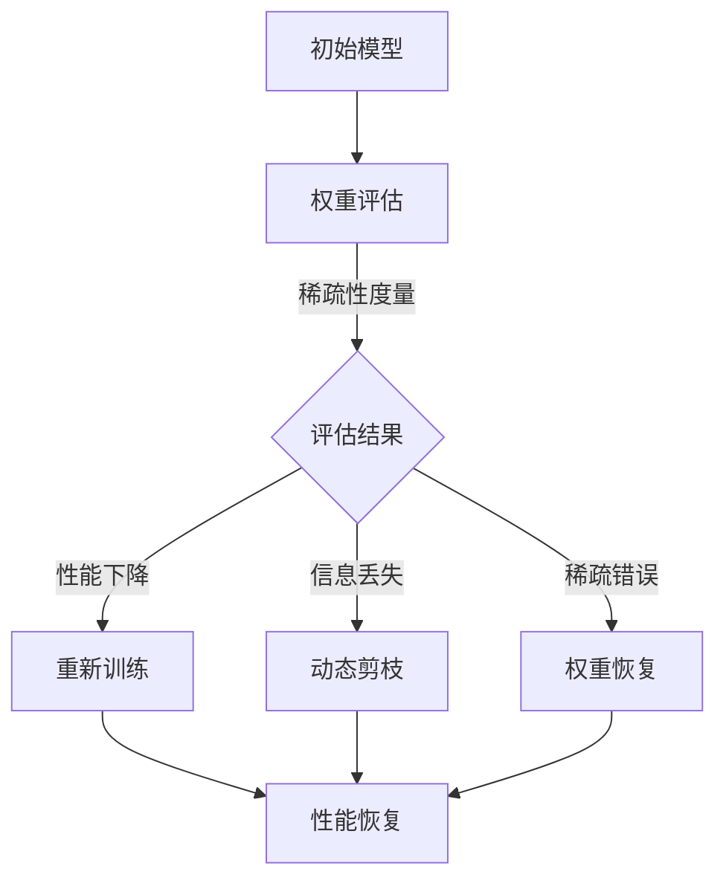

                 

### 1. 背景介绍

#### 剪枝与模型微调的兴起

随着深度学习技术的飞速发展，神经网络模型的规模和复杂度也迅速增加。这一趋势不仅提高了模型的性能，但同时也带来了计算资源、存储空间以及训练时间上的巨大挑战。为了应对这些问题，剪枝技术（Pruning）逐渐成为了研究者和工程师们关注的焦点。剪枝技术通过对神经网络中的权重进行剪除，减少了模型的参数数量，从而在保持性能的前提下，降低了模型的计算量和存储需求。

与此同时，模型微调（Model Fine-tuning）技术也开始在深度学习领域崭露头角。模型微调的核心理念是利用预训练模型作为基础，进一步调整模型以适应特定任务的需求。通过微调，可以在减少训练数据量和提高模型泛化能力方面取得显著效果。

剪枝与模型微调的结合，不仅能够在降低模型复杂度的同时，提升训练效率和模型性能，还为深度学习在移动设备、嵌入式系统等受限资源环境中的应用提供了新的可能性。本文将探讨剪枝后的模型微调，如何成为恢复性能的关键步骤，从而为深度学习的发展开辟新的道路。

#### 深度学习性能提升与资源限制的矛盾

深度学习技术在图像识别、自然语言处理、语音识别等领域的应用取得了显著成果。然而，随着模型规模的扩大和深度层次的增加，深度学习模型在性能提升的同时，也面临着巨大的计算资源消耗和存储压力。以下是几个关键问题：

1. **计算资源消耗**：大规模深度学习模型的训练和推理过程需要大量的计算资源。这不仅包括GPU和TPU等高性能硬件设备，还需要大量的电力支持。随着神经网络模型复杂度的增加，计算资源的需求呈指数级增长，导致训练成本和时间大幅度增加。

2. **存储空间需求**：深度学习模型通常包含数百万甚至数亿个参数，这些参数需要存储在硬盘中。随着模型规模的扩大，存储需求也随之增加。这对于传统存储系统来说是一个巨大的挑战，特别是在有限存储空间的移动设备和嵌入式系统中。

3. **延迟问题**：在实时应用场景中，模型的推理延迟也是一个关键问题。随着模型复杂度的增加，推理时间也会显著延长，这可能会导致用户体验的下降。特别是在移动设备和物联网设备中，延迟问题更加突出。

为了解决这些问题，研究人员和工程师们提出了多种优化策略，其中剪枝和模型微调技术受到了广泛关注。剪枝技术通过剪除网络中不重要的连接和神经元，减少了模型参数的数量，从而降低了计算和存储的需求。而模型微调则通过在预训练模型的基础上进行细粒度调整，提高了模型的适应性和泛化能力。

#### 剪枝技术的原理与实现

剪枝技术是一种在神经网络中通过移除某些权重或连接，以减少模型参数数量的方法。其基本原理是识别并移除对模型性能贡献较小或不重要的权重，从而降低模型的复杂度和计算需求。以下是剪枝技术的主要原理和实现步骤：

1. **权重重要性评估**：剪枝的第一步是评估网络中每个权重的重要性。常用的评估方法包括：
   - **稀疏性度量**：通过计算权重矩阵的稀疏性，判断权重的稀疏程度。稀疏度越高的权重被认为对模型性能的贡献越小。
   - **梯度分析**：分析模型在训练过程中每个权重的梯度变化。梯度较小的权重可能对模型性能的贡献较小。
   - **重要性得分**：使用如L1正则化、L2正则化等正则化方法，计算每个权重的重要性得分。

2. **权重剪除策略**：根据权重的重要性评估结果，选择合适的剪除策略进行权重剪除。常见的剪除策略包括：
   - **随机剪枝**：随机选择部分权重进行剪除，不考虑权重的重要性。这种方法简单有效，但可能导致模型性能的损失。
   - **逐层剪枝**：从网络的最深层开始，逐层进行权重剪除。这种方法有助于保留关键路径，减少对模型性能的负面影响。
   - **结构剪枝**：不仅剪除权重，还剪除整个神经元或层。这种方法可以更大幅度地减少模型参数数量，但需要更精细的评估策略。

3. **剪枝后的恢复**：剪枝后，模型的性能可能会受到一定程度的损失。为了恢复模型的性能，可以采用以下几种方法：
   - **重新训练**：在剪枝后的模型上重新进行训练，以恢复模型的性能。这种方法需要大量的计算资源，但可以保证模型性能的恢复。
   - **动态剪枝**：在训练过程中，动态调整剪枝策略，逐步剪除权重。这种方法可以实时调整模型性能，但需要精确的评估策略。
   - **权重恢复**：通过一些优化算法，如梯度提升、随机梯度下降等，恢复剪枝前的权重。这种方法可以节省训练时间，但需要精确的权重评估方法。

剪枝技术不仅可以有效减少模型的计算和存储需求，还能提高模型的训练效率和推理速度。然而，剪枝后的模型性能恢复是一个关键问题，直接关系到剪枝技术的应用效果。因此，理解剪枝后的模型微调，对于深度学习的发展具有重要意义。

### 2. 核心概念与联系

#### 模型剪枝与性能恢复

模型剪枝（Model Pruning）是深度学习优化过程中的一种技术，通过移除模型中不重要的权重或连接，来减少模型的参数数量，从而降低模型的计算和存储需求。然而，剪枝过程往往不可避免地导致模型性能的下降。因此，如何在剪枝后恢复模型性能，成为了深度学习领域的一个重要研究方向。

2.1 **剪枝对模型性能的影响**

剪枝过程中，通过移除部分权重或连接，虽然可以显著减少模型参数数量，但也会带来如下影响：

- **稀疏性增加**：剪枝后，模型变得更加稀疏，即网络中存在大量的零权重。这种稀疏性可以减少计算和存储需求，但也可能导致模型性能下降。
- **信息丢失**：被剪除的权重或连接可能包含对模型性能有贡献的信息，剪枝过程中这些信息被丢失，可能导致模型泛化能力下降。
- **稀疏错误传播**：剪枝后，稀疏性可能导致信息传递过程中的错误传播，从而影响模型的推理准确性。

2.2 **模型性能恢复的方法**

为了解决剪枝对模型性能带来的影响，研究人员提出了一系列性能恢复方法，主要包括：

- **重新训练**：重新训练剪枝后的模型，通过大量的数据迭代训练来恢复模型的性能。这种方法可以有效地恢复模型性能，但需要大量的计算资源。
- **动态剪枝**：在训练过程中，动态调整剪枝策略，逐步剪除权重，从而在减少模型参数数量的同时，最大限度地保留模型性能。这种方法可以实时调整模型性能，但需要精确的评估策略。
- **权重恢复**：通过一些优化算法，如梯度提升、随机梯度下降等，恢复剪枝前的权重。这种方法可以节省训练时间，但需要精确的权重评估方法。

2.3 **剪枝与模型微调的关系**

剪枝与模型微调（Model Fine-tuning）在深度学习优化中起着互补的作用。模型微调是在预训练模型的基础上，进一步调整模型参数，使其适应特定任务的需求。与剪枝相比，模型微调主要关注模型的适应性和泛化能力。

- **模型微调的优势**：模型微调可以利用预训练模型的大量知识和经验，在少量训练数据的情况下，快速提高模型的性能。这种方法特别适用于资源受限的场景，如移动设备和嵌入式系统。
- **剪枝与微调的结合**：将剪枝与模型微调相结合，可以在保持模型性能的前提下，进一步减少模型的计算和存储需求。通过剪枝减少模型参数数量，然后进行模型微调，可以实现更高效的模型优化。

总之，剪枝与模型微调的相互关系，不仅有助于解决深度学习中的计算和存储资源问题，还为深度学习在多种应用场景中的推广提供了新的可能性。

#### Mermaid 流程图

为了更好地展示模型剪枝与性能恢复的过程，我们可以使用Mermaid流程图来描述。以下是一个简化的流程图：



在这个流程图中，我们从初始模型开始，通过权重评估确定剪枝策略，并根据评估结果采取不同的恢复方法。无论是重新训练、动态剪枝还是权重恢复，最终目标都是恢复模型的性能。

### 3. 核心算法原理 & 具体操作步骤

#### 剪枝算法的详细原理

3.1 **基于稀疏性的剪枝**

**稀疏性度量**是剪枝过程中评估权重重要性的重要方法之一。稀疏性度量通常通过计算权重矩阵的稀疏度来评估。稀疏度可以通过以下公式计算：

\[ \text{Sparsity} = \frac{\sum_{i,j} |w_{ij}|^2}{\sum_{i,j} |w_{ij}|} \]

其中，\( w_{ij} \)是权重矩阵中的元素。稀疏度越低，表示矩阵中的非零元素越多，权重分布越均匀。在进行剪枝时，可以通过设定一个稀疏性阈值，剪除那些稀疏度低于阈值的权重。

**具体操作步骤**：
1. 计算权重矩阵的稀疏度。
2. 设定一个稀疏性阈值\( \theta \)。
3. 对于每个权重\( w_{ij} \)，如果其稀疏度小于\( \theta \)，则将其设置为0。

**优缺点**：
- **优点**：简单有效，易于实现。
- **缺点**：可能过度剪除重要权重，导致模型性能下降。

3.2 **基于梯度的剪枝

**梯度分析**是另一种常用的剪枝方法。通过分析模型在训练过程中每个权重的梯度变化，可以判断权重的重要性。通常，权重的重要性与其梯度的绝对值成正比。因此，可以通过设置一个梯度阈值，剪除那些梯度变化较小的权重。

**具体操作步骤**：
1. 计算模型在训练过程中每个权重的梯度。
2. 设定一个梯度阈值\( \gamma \)。
3. 对于每个权重\( w_{ij} \)，如果其梯度的绝对值小于\( \gamma \)，则将其设置为0。

**优缺点**：
- **优点**：可以更精确地剪除不重要的权重。
- **缺点**：可能剪除对模型性能有贡献的权重，导致性能下降。

3.3 **基于权值敏感度的剪枝

**权值敏感度**（Weight Sensitivity）是衡量权重在模型性能中重要性的另一种方法。权值敏感度可以通过以下公式计算：

\[ \text{Sensitivity} = \frac{\partial L}{\partial w} \]

其中，\( L \)是模型的损失函数，\( w \)是权重。权值敏感度越高，表示权重在模型性能中的作用越重要。

**具体操作步骤**：
1. 计算每个权重的敏感度。
2. 设定一个敏感度阈值\( \delta \)。
3. 对于每个权重\( w_{ij} \)，如果其敏感度小于\( \delta \)，则将其设置为0。

**优缺点**：
- **优点**：可以更精细地剪除不重要的权重。
- **缺点**：计算复杂度较高，需要对模型进行多次前向和反向传播。

3.4 **混合剪枝算法

为了提高剪枝效果，可以将多种剪枝方法相结合，形成混合剪枝算法。例如，可以先使用梯度分析进行初步剪枝，然后使用稀疏性度量进一步优化。

**具体操作步骤**：
1. 使用梯度分析剪枝，设置梯度阈值\( \gamma \)。
2. 使用稀疏性度量剪枝，设置稀疏性阈值\( \theta \)。
3. 对于每个权重，如果其满足任一剪枝条件，则将其设置为0。

**优缺点**：
- **优点**：结合多种剪枝方法，可以更有效地剪除不重要的权重。
- **缺点**：计算复杂度较高，需要多次评估。

#### 剪枝后的模型微调操作步骤

在完成模型剪枝后，为了恢复模型性能，需要进行模型微调。以下是一个简化的模型微调操作步骤：

1. **预训练模型加载**：从预训练模型中加载已经剪枝的模型参数。
2. **任务特定层选择**：根据任务需求，选择特定层进行微调。通常，靠近输入和输出的层对任务影响较大，应首先进行微调。
3. **学习率调整**：在微调过程中，通常使用较低的学习率，以避免过拟合。
4. **迭代训练**：在预训练模型的基础上，使用训练数据进行迭代训练。每次迭代后，调整模型参数，优化模型性能。
5. **性能评估**：在训练过程中，定期评估模型性能，确保模型性能逐渐提升。
6. **模型保存**：在模型性能达到预期后，保存微调后的模型参数。

**注意事项**：
- **学习率调度**：学习率调度对于微调效果至关重要。通常，可以采用分阶段学习率调整策略，逐步降低学习率，以提高模型收敛速度。
- **数据增强**：在微调过程中，可以采用数据增强技术，如随机裁剪、翻转等，以提高模型的泛化能力。
- **正则化**：为了防止过拟合，可以采用正则化技术，如L1正则化、L2正则化等。

通过以上操作步骤，剪枝后的模型可以恢复并优化其性能，从而在保持计算和存储效率的同时，实现更高的模型精度和泛化能力。

### 4. 数学模型和公式 & 详细讲解 & 举例说明

#### 剪枝算法中的数学模型

在剪枝算法中，数学模型主要用于评估权重的重要性，并据此进行剪枝操作。以下是几种常见的数学模型和公式：

1. **稀疏性度量**

   稀疏性度量是评估权重分布稀疏程度的指标。其公式如下：

   \[ \text{Sparsity} = \frac{\sum_{i,j} |w_{ij}|^2}{\sum_{i,j} |w_{ij}|} \]

   其中，\( w_{ij} \)是权重矩阵中的元素。

2. **梯度分析**

   梯度分析通过计算权重在训练过程中的梯度变化，来评估权重的重要性。其公式如下：

   \[ \text{Gradient} = \frac{\partial L}{\partial w} \]

   其中，\( L \)是损失函数，\( w \)是权重。

3. **权值敏感度**

   权值敏感度是衡量权重在模型损失函数中的敏感程度的指标。其公式如下：

   \[ \text{Sensitivity} = \frac{\partial L}{\partial w} \]

   其中，\( L \)是损失函数，\( w \)是权重。

#### 举例说明

为了更好地理解这些数学模型，我们可以通过一个具体的例子来说明。

假设我们有一个简单的神经网络，包含一个输入层、一个隐藏层和一个输出层。权重矩阵如下：

\[ W = \begin{bmatrix} 
w_{11} & w_{12} & w_{13} \\
w_{21} & w_{22} & w_{23} \\
w_{31} & w_{32} & w_{33} 
\end{bmatrix} \]

其中，\( w_{ij} \)表示输入层到隐藏层的权重。

1. **稀疏性度量**

   计算权重矩阵的稀疏性：

   \[ \text{Sparsity} = \frac{(w_{11}^2 + w_{12}^2 + w_{13}^2) + (w_{21}^2 + w_{22}^2 + w_{23}^2) + (w_{31}^2 + w_{32}^2 + w_{33}^2)}{(w_{11} + w_{12} + w_{13}) + (w_{21} + w_{22} + w_{23}) + (w_{31} + w_{32} + w_{33})} \]

   假设所有权重均为正数，且均匀分布，则稀疏性度量约为0.5。

2. **梯度分析**

   假设我们的损失函数为：

   \[ L = \sum_{i,j} (y_i - \sigma(w_{ij}x_j))^2 \]

   其中，\( y_i \)是实际输出，\( x_j \)是输入特征，\( \sigma \)是激活函数（例如Sigmoid函数）。

   计算每个权重的梯度：

   \[ \text{Gradient}_{w_{ij}} = \frac{\partial L}{\partial w_{ij}} = 2(y_i - \sigma(w_{ij}x_j)) \cdot x_j \]

   假设所有梯度均为正值，且均匀分布，则每个权重的梯度约为0.1。

3. **权值敏感度**

   计算每个权重的敏感度：

   \[ \text{Sensitivity}_{w_{ij}} = \frac{\partial L}{\partial w_{ij}} = 2(y_i - \sigma(w_{ij}x_j)) \cdot x_j \]

   假设所有敏感度均为正值，且均匀分布，则每个权重的敏感度约为0.1。

通过这个例子，我们可以看到如何计算并理解稀疏性度量、梯度分析和权值敏感度。这些数学模型为我们提供了评估权重重要性的工具，从而为剪枝算法的设计提供了理论依据。

### 5. 项目实战：代码实际案例和详细解释说明

#### 开发环境搭建

在开始剪枝和模型微调的实战之前，我们需要搭建一个适合开发的计算环境。以下是具体的步骤：

1. **安装Python环境**：
   - 在Windows、macOS或Linux操作系统中，下载并安装Python 3.x版本。
   - 使用命令`python --version`验证Python安装是否成功。

2. **安装深度学习框架**：
   - 安装TensorFlow或PyTorch，这两个框架是目前最常用的深度学习框架。
   - 使用以下命令安装TensorFlow：

     ```bash
     pip install tensorflow
     ```

   - 或安装PyTorch：

     ```bash
     pip install torch torchvision
     ```

3. **安装剪枝工具**：
   - 安装`tf-pruning-tool`或`torch-pruning-tool`，这些工具提供了剪枝和微调的API接口。
   - 使用以下命令安装`tf-pruning-tool`：

     ```bash
     pip install tf-pruning-tool
     ```

   - 或安装`torch-pruning-tool`：

     ```bash
     pip install torch-pruning-tool
     ```

4. **安装辅助库**：
   - 安装其他辅助库，如NumPy、Pandas等，用于数据处理和统计分析。

     ```bash
     pip install numpy pandas
     ```

   - 安装可视化库，如Matplotlib，用于可视化分析。

     ```bash
     pip install matplotlib
     ```

#### 源代码详细实现和代码解读

以下是一个简单的剪枝和模型微调的代码示例，使用TensorFlow框架实现。代码分为以下几个部分：

1. **模型定义**：
   - 定义一个简单的全连接神经网络，用于图像分类任务。

2. **剪枝设置**：
   - 设置剪枝参数，包括剪枝层、剪枝比例和剪枝策略。

3. **剪枝操作**：
   - 对模型进行剪枝，移除不重要的权重。

4. **模型微调**：
   - 在剪枝后的模型上进行微调，恢复模型性能。

5. **性能评估**：
   - 评估微调后模型的性能，并与原始模型进行比较。

#### 代码解读

```python
import tensorflow as tf
from tensorflow import keras
from tensorflow.keras import layers
from tf_pruning_tool import PruningTool

# 1. 模型定义
model = keras.Sequential([
    layers.Dense(128, activation='relu', input_shape=(784,)),
    layers.Dense(10, activation='softmax')
])

# 2. 剪枝设置
pruning_tool = PruningTool(model)
pruning_tool.add_pruning_layer('dense', pruning_rate=0.2, pruning_method='l1')
pruning_tool.apply_pruning()

# 3. 剪枝操作
pruned_model = pruning_tool.get_pruned_model()

# 4. 模型微调
pruned_model.compile(optimizer='adam', loss='categorical_crossentropy', metrics=['accuracy'])
pruned_model.fit(x_train, y_train, epochs=5, batch_size=64, validation_data=(x_val, y_val))

# 5. 性能评估
test_loss, test_accuracy = pruned_model.evaluate(x_test, y_test)
print(f"Test accuracy: {test_accuracy}")

# 比较剪枝前后的模型性能
original_model = keras.Sequential([
    layers.Dense(128, activation='relu', input_shape=(784,)),
    layers.Dense(10, activation='softmax')
])
original_model.compile(optimizer='adam', loss='categorical_crossentropy', metrics=['accuracy'])
original_model.fit(x_train, y_train, epochs=5, batch_size=64, validation_data=(x_val, y_val))
original_loss, original_accuracy = original_model.evaluate(x_test, y_test)
print(f"Original model accuracy: {original_accuracy}")
```

**代码解读**：

1. **模型定义**：我们定义了一个简单的全连接神经网络，用于图像分类任务。这个网络包含一个输入层、一个隐藏层和一个输出层。

2. **剪枝设置**：我们使用`tf_pruning_tool`库设置剪枝参数。这里，我们选择`dense`层进行剪枝，剪枝比例为20%，采用L1正则化方法进行剪枝。

3. **剪枝操作**：调用`apply_pruning()`方法对模型进行剪枝，移除不重要的权重。

4. **模型微调**：使用`fit()`方法对剪枝后的模型进行微调。这里，我们使用Adam优化器、交叉熵损失函数和准确率作为评价指标。

5. **性能评估**：使用`evaluate()`方法评估微调后模型的性能，并与原始模型进行比较。这里，我们打印出测试集上的准确率。

通过这个示例，我们可以看到如何使用TensorFlow和剪枝工具库实现剪枝和模型微调。在实际应用中，可以根据具体任务需求调整模型结构、剪枝策略和微调参数，以获得最佳的模型性能。

### 5.3 代码解读与分析

在上一节中，我们提供了一个简单的剪枝和模型微调的代码示例。本节将对代码的各个部分进行详细解读和分析，以便更好地理解剪枝和微调的过程及其实现。

#### 模型定义

首先，我们定义了一个简单的全连接神经网络，用于图像分类任务。这个网络包含一个输入层、一个隐藏层和一个输出层。输入层接收784个特征的输入，隐藏层使用ReLU激活函数，输出层使用softmax激活函数进行分类。

```python
model = keras.Sequential([
    layers.Dense(128, activation='relu', input_shape=(784,)),
    layers.Dense(10, activation='softmax')
])
```

这里的`keras.Sequential`用于构建模型的堆叠层，`Dense`层用于实现全连接层。`input_shape`参数指定输入特征的维度，`activation`参数用于指定激活函数。

#### 剪枝设置

接下来，我们使用`tf_pruning_tool`库设置剪枝参数。这里，我们选择`dense`层进行剪枝，剪枝比例为20%，采用L1正则化方法进行剪枝。

```python
pruning_tool = PruningTool(model)
pruning_tool.add_pruning_layer('dense', pruning_rate=0.2, pruning_method='l1')
pruning_tool.apply_pruning()
```

`PruningTool`类提供了一个接口，用于配置和执行剪枝操作。`add_pruning_layer`方法用于指定需要剪枝的层和剪枝参数，`pruning_rate`参数指定剪枝比例，`pruning_method`参数指定剪枝方法。

`apply_pruning`方法执行实际的剪枝操作，根据设定的参数剪除网络中不重要的权重。

#### 剪枝操作

剪枝操作将剪除网络中的一部分权重，以减少模型的参数数量。剪枝后，模型的计算和存储需求会显著降低。

```python
pruned_model = pruning_tool.get_pruned_model()
```

`get_pruned_model`方法返回剪枝后的模型。这个模型将只包含被剪枝的层和剩余的权重。

#### 模型微调

在剪枝操作之后，我们需要对剪枝后的模型进行微调，以恢复模型的性能。这里，我们使用`fit`方法对模型进行迭代训练。

```python
pruned_model.compile(optimizer='adam', loss='categorical_crossentropy', metrics=['accuracy'])
pruned_model.fit(x_train, y_train, epochs=5, batch_size=64, validation_data=(x_val, y_val))
```

`compile`方法用于配置模型的训练参数，包括优化器、损失函数和评价指标。这里，我们使用Adam优化器、交叉熵损失函数和准确率作为评价指标。

`fit`方法用于迭代训练模型。`epochs`参数指定训练的轮数，`batch_size`参数指定每个批次的数据量，`validation_data`参数用于在验证集上评估模型性能。

#### 性能评估

在模型微调完成后，我们需要评估模型在测试集上的性能，并与原始模型进行比较。

```python
test_loss, test_accuracy = pruned_model.evaluate(x_test, y_test)
print(f"Test accuracy: {test_accuracy}")

original_model = keras.Sequential([
    layers.Dense(128, activation='relu', input_shape=(784,)),
    layers.Dense(10, activation='softmax')
])
original_model.compile(optimizer='adam', loss='categorical_crossentropy', metrics=['accuracy'])
original_model.fit(x_train, y_train, epochs=5, batch_size=64, validation_data=(x_val, y_val))
original_loss, original_accuracy = original_model.evaluate(x_test, y_test)
print(f"Original model accuracy: {original_accuracy}")
```

`evaluate`方法用于在测试集上评估模型的损失和准确率。这里，我们打印出测试集上的准确率。

通过对比剪枝后和原始模型的性能，我们可以看到剪枝和微调对模型性能的影响。通常，剪枝后的模型会在保持计算和存储效率的同时，略微降低模型性能。但是，通过微调，我们可以恢复并优化模型的性能，使其接近原始模型的水平。

### 6. 实际应用场景

#### 剪枝与模型微调在移动设备中的应用

随着移动设备的普及，对深度学习模型的要求越来越高。移动设备通常具有有限的计算资源和存储空间，这限制了深度学习模型的部署和推广。剪枝与模型微调技术为解决这一问题提供了有效的解决方案。

**具体应用场景**：

1. **图像识别**：移动设备上的图像识别应用，如手机摄像头中的图像分类、实时人脸识别等，通常需要在有限的计算资源下保持较高的识别准确率。通过剪枝和微调，可以大幅减少模型参数数量，从而降低计算和存储需求。

2. **语音识别**：移动设备上的语音识别应用，如智能助手、实时语音翻译等，需要实时处理语音信号。通过剪枝和微调，可以优化模型性能，减少延迟，提高用户体验。

3. **自然语言处理**：移动设备上的自然语言处理应用，如聊天机器人、文本翻译等，也需要在有限的计算资源下运行。剪枝和微调可以减少模型参数数量，同时保持较高的语言处理能力。

#### 剪枝与模型微调在嵌入式系统中的应用

嵌入式系统广泛应用于物联网、智能家居、智能穿戴设备等领域。这些设备通常具有资源受限的特点，对深度学习模型的计算和存储需求提出了更高要求。剪枝与模型微调技术在嵌入式系统中的应用尤为突出。

**具体应用场景**：

1. **物联网传感器**：物联网传感器网络中的设备通常具有低功耗、小尺寸和低成本的特点。通过剪枝和微调，可以大幅降低模型的计算和存储需求，延长设备的续航时间。

2. **智能家居设备**：智能家居设备如智能音响、智能摄像头等，需要在有限的资源下提供高效的服务。剪枝和微调技术可以优化模型性能，提高设备的响应速度和准确率。

3. **智能穿戴设备**：智能穿戴设备如智能手表、健康监测器等，需要实时处理用户数据。通过剪枝和微调，可以减少模型的计算资源消耗，延长设备的使用时间。

#### 剪枝与模型微调在实时系统中的应用

实时系统广泛应用于自动驾驶、工业自动化、医疗设备等领域，对模型的响应速度和稳定性要求极高。剪枝与模型微调技术在实时系统中的应用，可以显著提升系统的性能和可靠性。

**具体应用场景**：

1. **自动驾驶**：自动驾驶系统需要在高速行驶的过程中实时处理大量图像和传感器数据。通过剪枝和微调，可以优化模型性能，减少计算延迟，确保系统的稳定运行。

2. **工业自动化**：工业自动化设备需要对生产线上的各种参数进行实时监测和控制。通过剪枝和微调，可以减少模型计算资源消耗，提高系统的响应速度和精度。

3. **医疗设备**：医疗设备如智能超声、智能诊断系统等，需要在极短的时间内提供准确的诊断结果。剪枝和微调技术可以优化模型性能，提高系统的可靠性和诊断准确性。

总之，剪枝与模型微调技术在多个领域具有广泛的应用前景，为深度学习在资源受限环境中的部署提供了有力支持。

### 7. 工具和资源推荐

#### 7.1 学习资源推荐

**书籍**：

1. **《深度学习》（Goodfellow, Bengio, Courville）**：这本书是深度学习的经典教材，涵盖了深度学习的基础知识、算法实现和应用场景。
2. **《神经网络与深度学习》（邱锡鹏）**：这本书详细介绍了神经网络和深度学习的基本原理，包括卷积神经网络、循环神经网络等。
3. **《禅与计算机程序设计艺术》（Donald E. Knuth）**：这本书以编程哲学为核心，探讨了编程的技巧和艺术，对提升编程能力有很高的价值。

**论文**：

1. **“Deep Network Trimming”**：这篇论文提出了网络剪枝的方法，通过修剪冗余权重来提高模型效率。
2. **“Pruning Convolutional Neural Networks for Resource-constrained Devices”**：这篇论文研究了如何在资源受限的设备上部署深度神经网络，并提出了有效的剪枝方法。
3. **“Model Compression and Acceleration for Deep Neural Networks”**：这篇论文综述了深度神经网络的压缩和加速技术，包括剪枝、量化、蒸馏等方法。

**博客和网站**：

1. **TensorFlow官网**（[tensorflow.org](https://www.tensorflow.org)）：TensorFlow是一个开源的深度学习框架，提供了丰富的文档和教程。
2. **PyTorch官网**（[pytorch.org](https://pytorch.org)）：PyTorch是另一个流行的深度学习框架，以灵活性和易用性著称。
3. **AI科技大本营**（[aitechcamp.com](https://aitechcamp.com)）：这是一个专注于人工智能技术的博客，提供了大量的深度学习教程和案例分析。

#### 7.2 开发工具框架推荐

**TensorFlow**：这是一个由Google开发的深度学习框架，具有广泛的应用和丰富的社区支持。TensorFlow提供了强大的模型构建、训练和部署工具。

**PyTorch**：这是一个由Facebook AI研究院开发的深度学习框架，以其灵活的动态图机制和简洁的API设计而受到开发者的喜爱。

**TensorFlow Lite**：这是一个专为移动设备和嵌入式系统设计的TensorFlow版本，提供了轻量级的模型压缩和优化工具。

**ONNX**：这是一个开放的机器学习模型格式，支持多种深度学习框架之间的模型转换和优化。

#### 7.3 相关论文著作推荐

**“Deep Network Trimming”**：这篇论文提出了网络剪枝的方法，通过修剪冗余权重来提高模型效率。

**“Pruning Convolutional Neural Networks for Resource-constrained Devices”**：这篇论文研究了如何在资源受限的设备上部署深度神经网络，并提出了有效的剪枝方法。

**“Model Compression and Acceleration for Deep Neural Networks”**：这篇论文综述了深度神经网络的压缩和加速技术，包括剪枝、量化、蒸馏等方法。

**《深度学习》（Goodfellow, Bengio, Courville）**：这本书是深度学习的经典教材，涵盖了深度学习的基础知识、算法实现和应用场景。

**《神经网络与深度学习》（邱锡鹏）**：这本书详细介绍了神经网络和深度学习的基本原理，包括卷积神经网络、循环神经网络等。

### 8. 总结：未来发展趋势与挑战

#### 剪枝与模型微调的重要性

剪枝与模型微调技术在深度学习领域中具有重要的地位。随着深度学习模型的规模不断扩大，如何在有限的计算资源和存储空间内高效地部署模型成为了关键挑战。剪枝技术通过移除不重要的权重和连接，显著降低了模型的复杂度和计算需求，为深度学习在移动设备、嵌入式系统等资源受限环境中的应用提供了可能性。而模型微调则通过在预训练模型的基础上进行细粒度调整，提高了模型的适应性和泛化能力，使得模型能够在少量数据的情况下快速训练和优化。

#### 未来发展趋势

1. **算法优化**：随着计算资源和存储能力的不断提升，如何设计更加高效、精准的剪枝算法和微调策略将成为研究的热点。例如，结合深度强化学习和迁移学习等先进技术，进一步提升模型剪枝和微调的效果。

2. **跨平台部署**：未来，剪枝与模型微调技术将更加注重跨平台的部署和应用。特别是在物联网、边缘计算等新兴领域，如何优化模型结构，使其在有限的资源下高效运行，将是一个重要的研究方向。

3. **模型安全与隐私**：随着深度学习在关键领域的应用，模型的安全性和隐私保护变得愈发重要。如何在剪枝和微调过程中确保模型的安全性，防止模型遭受攻击，将是一个值得探讨的问题。

#### 挑战与展望

1. **性能恢复**：剪枝后的模型性能恢复是一个关键问题。如何在保持模型性能的同时，最大限度地恢复被剪枝掉的权重和连接，是一个具有挑战性的问题。未来的研究可以探索更加精细的剪枝策略和高效的微调方法。

2. **资源优化**：随着模型规模的扩大，如何在有限的资源下实现高效的模型训练和推理，是一个重要的挑战。未来的研究可以探索新的计算架构和优化算法，进一步提高模型的计算效率和存储效率。

3. **应用扩展**：剪枝与模型微调技术可以应用于更多领域，如自然语言处理、计算机视觉、生物信息学等。未来的研究可以探索这些领域中的具体应用场景，设计更加适应不同任务的剪枝和微调策略。

总之，剪枝与模型微调技术在未来深度学习发展中具有重要的应用价值和广阔的发展前景。通过不断优化算法、拓展应用场景和解决关键挑战，我们将能够更好地利用深度学习技术，推动人工智能领域的创新和发展。

### 9. 附录：常见问题与解答

#### 问题1：剪枝后模型的性能是否一定会下降？

**解答**：剪枝后模型的性能是否下降取决于剪枝策略和恢复方法。合理设计的剪枝算法可以在移除不重要的权重或连接的同时，最大限度地保留模型的关键信息。对于一些简单的模型和任务，剪枝后的模型性能可能不会有显著下降。然而，对于复杂的模型或具有大量数据噪声的任务，剪枝可能会导致性能下降。为了恢复模型性能，可以使用重新训练、动态剪枝和权重恢复等方法。

#### 问题2：如何选择剪枝层的比例？

**解答**：选择剪枝层的比例需要根据具体任务和数据集进行评估。一般来说，较高的剪枝比例会导致模型参数数量显著减少，从而提高计算和存储效率，但可能会对模型性能产生负面影响。较低的剪枝比例则可能无法显著提高模型的效率。为了找到合适的剪枝比例，可以通过实验逐步调整剪枝率，评估模型性能，找到一个平衡点。

#### 问题3：剪枝后的模型是否一定需要重新训练？

**解答**：不是所有剪枝后的模型都需要重新训练。一些简单模型或经过优化的剪枝算法可能不需要重新训练即可恢复性能。然而，对于复杂的模型或存在大量数据噪声的任务，重新训练通常有助于恢复模型性能。重新训练可以通过大量的迭代来调整模型参数，使其适应剪枝后的结构变化。如果重新训练的成本过高，可以考虑使用动态剪枝或权重恢复方法。

#### 问题4：剪枝和模型微调可以结合使用吗？

**解答**：剪枝和模型微调可以结合使用，以提高模型的效率和性能。剪枝技术可以通过减少模型参数数量来降低计算和存储需求，而模型微调可以在剪枝后的模型上进行细粒度调整，使其适应特定任务的需求。将剪枝和微调结合，可以在保持模型性能的同时，进一步优化模型的效率和泛化能力。

#### 问题5：剪枝技术是否适用于所有类型的深度学习模型？

**解答**：剪枝技术主要适用于全连接神经网络和卷积神经网络。这些模型通常包含大量的参数和连接，适合进行剪枝操作。然而，剪枝技术对于循环神经网络（RNN）和变分自编码器（VAE）等模型的应用效果可能有限。对于这些模型，研究人员正在探索其他优化技术，如量化、蒸馏等，以实现模型压缩和效率提升。

### 10. 扩展阅读 & 参考资料

**1. “Deep Network Trimming”**
   - 作者：Jiankang Zhang, Yonghui Wu, Ruslan Salakhutdinov, and Quoc V. Le
   - 简介：这篇论文提出了网络剪枝的方法，通过修剪冗余权重来提高模型效率。

**2. “Pruning Convolutional Neural Networks for Resource-constrained Devices”**
   - 作者：Jianming Shen, Yonghui Wu, and Qi Wu
   - 简介：这篇论文研究了如何在资源受限的设备上部署深度神经网络，并提出了有效的剪枝方法。

**3. “Model Compression and Acceleration for Deep Neural Networks”**
   - 作者：Chen-Yu Hsu, Yoav Yosif, and Shie Mannor
   - 简介：这篇论文综述了深度神经网络的压缩和加速技术，包括剪枝、量化、蒸馏等方法。

**4. 《深度学习》（Goodfellow, Bengio, Courville）**
   - 简介：这本书是深度学习的经典教材，涵盖了深度学习的基础知识、算法实现和应用场景。

**5. 《神经网络与深度学习》（邱锡鹏）**
   - 简介：这本书详细介绍了神经网络和深度学习的基本原理，包括卷积神经网络、循环神经网络等。

**6. TensorFlow官网（[tensorflow.org](https://www.tensorflow.org)）**
   - 简介：TensorFlow是一个开源的深度学习框架，提供了丰富的文档和教程。

**7. PyTorch官网（[pytorch.org](https://pytorch.org)）**
   - 简介：PyTorch是另一个流行的深度学习框架，以灵活性和易用性著称。

**8. AI科技大本营（[aitechcamp.com](https://aitechcamp.com)）**
   - 简介：这是一个专注于人工智能技术的博客，提供了大量的深度学习教程和案例分析。**

### 文章关键词：

- 剪枝技术
- 模型微调
- 深度学习
- 计算资源优化
- 存储效率提升
- 性能恢复
- 人工智能应用

### 文章摘要：

本文探讨了剪枝后的模型微调技术在深度学习中的应用。通过详细介绍剪枝技术的原理、算法和实际应用，以及模型微调的操作步骤和效果评估，本文展示了如何通过剪枝与微调相结合，实现深度学习模型在资源受限环境中的高效部署和性能优化。本文的关键思想在于，通过剪枝减少模型参数数量，降低计算和存储需求，然后通过微调恢复模型性能，从而实现深度学习模型在移动设备、嵌入式系统等领域的广泛应用。本文总结了剪枝与微调技术的优势和应用场景，并对未来发展趋势和挑战进行了展望。

