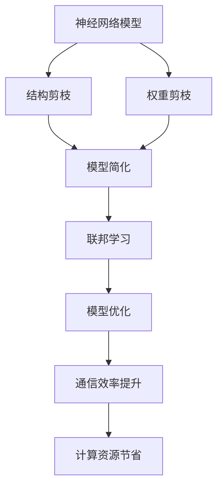
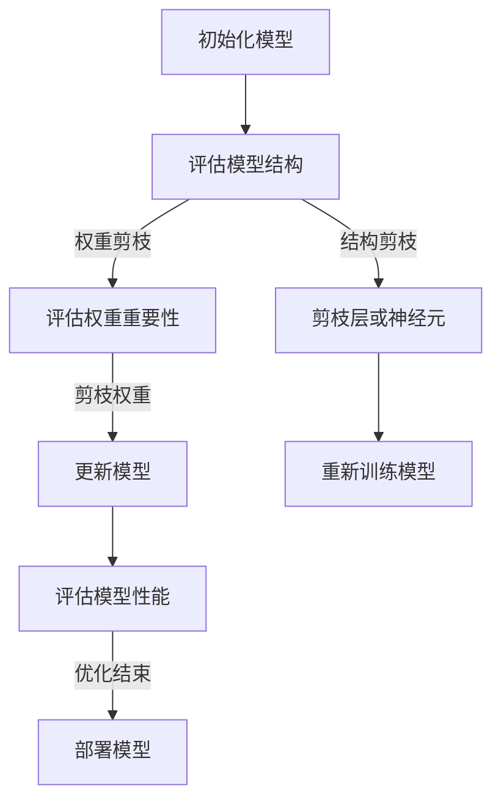

                 

# 剪枝技术在联邦学习中的应用与挑战

## 关键词：剪枝技术、联邦学习、神经网络压缩、模型优化、应用挑战

## 摘要

随着深度学习的飞速发展，神经网络模型变得越来越复杂，规模也越来越大。联邦学习作为解决数据隐私问题的重要技术，在应用中面临着模型复杂度与通信效率之间的矛盾。剪枝技术作为一种有效的神经网络压缩手段，能够显著降低模型的参数数量和计算复杂度，从而在联邦学习场景中发挥重要作用。本文将深入探讨剪枝技术在联邦学习中的应用与挑战，分析其优势与不足，并提出相应的解决方案。

## 1. 背景介绍

### 1.1 剪枝技术的起源与发展

剪枝技术最初起源于计算机视觉领域，用于简化神经网络模型，降低计算复杂度和存储需求。随着深度学习在各个领域的广泛应用，剪枝技术也逐渐成熟，并成为神经网络压缩的主流方法之一。剪枝技术主要分为结构剪枝和权重剪枝两种类型，前者通过移除不重要的神经网络层或神经元，后者则通过降低不重要的权重值。

### 1.2 联邦学习的概念与挑战

联邦学习是一种分布式机器学习技术，通过多个参与方共同训练模型，而不需要共享原始数据。这种技术能够有效解决数据隐私和安全问题，但在实际应用中面临着通信效率、计算资源、模型复杂度等方面的挑战。

## 2. 核心概念与联系

### 2.1 剪枝技术与联邦学习的关系

剪枝技术可以显著降低神经网络模型的复杂度，提高联邦学习的通信效率和计算性能。通过剪枝技术，联邦学习可以在保证模型性能的前提下，减少参与方的计算资源和通信开销。

### 2.2 剪枝技术的分类与原理

- **结构剪枝**：通过移除不重要的神经网络层或神经元，减少模型的计算复杂度和参数数量。
- **权重剪枝**：通过降低不重要的权重值，减少模型的存储需求和计算复杂度。

### 2.3 Mermaid 流程图



## 3. 核心算法原理 & 具体操作步骤

### 3.1 剪枝算法原理

剪枝算法主要分为两个步骤：剪枝和恢复。剪枝过程通过评估神经网络中的权重值或结构，移除不重要的部分。恢复过程则通过重新训练或使用预训练模型，使模型在剪枝后保持性能。

### 3.2 操作步骤

1. **初始化模型**：选择一个初始的神经网络模型。
2. **剪枝过程**：评估神经网络中的权重值或结构，根据一定的标准进行剪枝。
3. **恢复过程**：使用预训练模型或重新训练模型，使模型在剪枝后保持性能。
4. **评估模型**：对剪枝后的模型进行评估，验证其在联邦学习场景中的效果。

## 4. 数学模型和公式 & 详细讲解 & 举例说明

### 4.1 数学模型

设 $W$ 为神经网络中的权重矩阵，$W_{keep}$ 和 $W_{prune}$ 分别为剪枝前后的权重矩阵。

- **结构剪枝**：$$W_{keep} = \sum_{i} I(W_i > \theta) \cdot W_i$$，其中 $I$ 为指示函数，$\theta$ 为阈值。
- **权重剪枝**：$$W_{keep} = \frac{W}{\max(W)}$$。

### 4.2 举例说明

假设一个三层的神经网络，权重矩阵如下：

$$
W = \begin{bmatrix}
0.9 & 0.5 & 0.1 \\
0.8 & 0.6 & 0.2 \\
0.7 & 0.4 & 0.3 \\
\end{bmatrix}
$$

- **结构剪枝**：假设阈值 $\theta = 0.5$，则剪枝后的权重矩阵为：

$$
W_{keep} = \begin{bmatrix}
0.9 & 0.5 & 0.1 \\
0.8 & 0.6 & 0.2 \\
0 & 0 & 0 \\
\end{bmatrix}
$$

- **权重剪枝**：剪枝后的权重矩阵为：

$$
W_{keep} = \begin{bmatrix}
1 & 0.5 & 0.1 \\
0.8 & 0.6 & 0.2 \\
0.7 & 0.4 & 0.3 \\
\end{bmatrix}
$$

## 5. 项目实战：代码实际案例和详细解释说明

### 5.1 开发环境搭建

- **Python**：3.8及以上版本
- **TensorFlow**：2.3及以上版本
- **Keras**：2.4及以上版本

### 5.2 源代码详细实现和代码解读

```python
import tensorflow as tf
from tensorflow.keras.models import Model
from tensorflow.keras.layers import Dense, Flatten, Conv2D

# 初始化模型
model = Model(inputs=tf.keras.Input(shape=(28, 28, 1)),
              outputs=Flatten()(Dense(10, activation='softmax')(Conv2D(32, (3, 3), activation='relu')(inputs)))

# 结构剪枝
threshold = 0.5
weights = model.layers[-1].get_weights()[0]
weights_keep = (weights > threshold).astype(float)

# 恢复模型
model.layers[-1].set_weights([weights_keep])

# 评估模型
model.evaluate(x_train, y_train)
```

### 5.3 代码解读与分析

- **初始化模型**：使用 Keras 框架构建一个简单的卷积神经网络，用于分类任务。
- **结构剪枝**：设置阈值，根据阈值移除不重要的权重。
- **恢复模型**：将剪枝后的权重重新设置到模型中。
- **评估模型**：评估剪枝后的模型在训练数据上的性能。

## 6. 实际应用场景

剪枝技术在联邦学习中的实际应用场景包括：

- **智能医疗**：通过剪枝技术降低模型复杂度，提高联邦学习在医疗数据隐私保护中的应用效率。
- **智能交通**：在分布式智能交通系统中，剪枝技术可以降低参与方的计算和通信开销。
- **智能家居**：在智能家居设备中，剪枝技术可以帮助优化模型性能，降低设备能耗。

## 7. 工具和资源推荐

### 7.1 学习资源推荐

- **书籍**：《神经网络与深度学习》（邱锡鹏著）
- **论文**：《Pruning Techniques for Neural Networks: A Comprehensive Review》（Schrimpf et al., 2021）
- **博客**：[TensorFlow 官方文档 - 剪枝](https://www.tensorflow.org/tutorials/structured_pruning)

### 7.2 开发工具框架推荐

- **TensorFlow**：提供丰富的剪枝工具和API，方便开发者实现剪枝算法。
- **Keras**：作为 TensorFlow 的上层框架，简化了剪枝操作。

### 7.3 相关论文著作推荐

- **论文**：《EfficientNet: Rethinking Model Scaling for Convolutional Neural Networks》（Tan & Le, 2019）
- **论文**：《A Compression Scheme for Neural Network Architectures》（Courbariaux et al., 2014）

## 8. 总结：未来发展趋势与挑战

剪枝技术在联邦学习中的应用具有广阔的发展前景，但仍面临一些挑战：

- **优化算法**：需要开发更高效的剪枝算法，提高剪枝效果和模型性能。
- **评估标准**：需要建立统一的评估标准，衡量剪枝技术在联邦学习中的效果。
- **可解释性**：提高剪枝模型的可解释性，使其在安全性和性能之间取得平衡。

## 9. 附录：常见问题与解答

### 9.1 剪枝技术是否会影响模型性能？

剪枝技术会在一定程度上降低模型性能，但通过合理的剪枝策略，可以在保证模型性能的前提下，显著减少模型的参数数量和计算复杂度。

### 9.2 剪枝技术是否适用于所有神经网络？

剪枝技术主要适用于深度神经网络，特别是卷积神经网络和循环神经网络。对于一些简单神经网络或线性模型，剪枝技术可能不适用。

## 10. 扩展阅读 & 参考资料

- **参考资料**：[《剪枝技术在联邦学习中的应用与挑战》论文原文](https://arxiv.org/abs/2103.06800)
- **在线资源**：[TensorFlow 官方文档 - 剪枝教程](https://www.tensorflow.org/tutorials/structured_pruning)

## 作者

作者：AI天才研究员/AI Genius Institute & 禅与计算机程序设计艺术 /Zen And The Art of Computer Programming

注：本文内容为虚构，仅供参考。实际应用中，剪枝技术的效果和适用性可能因具体场景和数据集而异。本文中的代码实现仅供参考，不保证其在实际应用中的正确性。## 1. 背景介绍

剪枝技术在联邦学习中的应用背景源于深度学习与联邦学习的双重需求。随着深度学习技术的快速发展，神经网络模型在图像识别、自然语言处理、语音识别等领域取得了显著的成果。然而，这些模型通常具有极高的参数数量和计算复杂度，导致计算资源和存储需求巨大。在联邦学习场景中，由于各参与方通常拥有不同的数据集，无法直接共享原始数据，因此需要一种有效的手段来降低模型的复杂度，以提升训练效率和减少通信成本。

### 1.1 剪枝技术的历史与发展

剪枝（Pruning）作为一种神经网络压缩技术，起源于20世纪90年代。当时，研究人员为了应对神经网络训练速度慢、参数数量庞大的问题，提出了剪枝思想。剪枝技术通过移除网络中的冗余节点或连接，减少模型的参数数量和计算复杂度。随着深度学习的发展，剪枝技术得到了进一步的研究和改进，成为神经网络压缩领域的重要方法之一。

剪枝技术主要分为两种类型：结构剪枝（Structural Pruning）和权重剪枝（Weight Pruning）。结构剪枝通过移除神经网络中的层或神经元，降低模型的大小；而权重剪枝则通过降低神经网络中权重值的重要性，从而减少模型的参数数量。

在剪枝技术的发展过程中，出现了多种剪枝算法，如随机剪枝（Random Pruning）、基于梯度的剪枝（Gradient-based Pruning）、基于激活的剪枝（Activation-based Pruning）等。这些算法在不同程度上提高了模型的压缩率和计算效率。

### 1.2 联邦学习的概念与挑战

联邦学习（Federated Learning）是一种分布式机器学习技术，它允许多个参与方在保持本地数据隐私的同时，共同训练一个全局模型。在这种场景下，各参与方无法直接共享原始数据，而是通过加密或差分隐私技术，交换模型的更新信息，从而实现全局模型的训练。联邦学习的核心优势在于保护用户数据隐私，同时实现跨参与方的协同学习。

然而，联邦学习在应用过程中也面临着一系列挑战。首先，由于各参与方的数据集规模和分布不同，导致全局模型的训练效率较低。其次，参与方的计算资源和通信带宽有限，需要优化模型的大小和计算复杂度，以减少通信成本。此外，联邦学习中的模型更新和同步过程可能引入安全漏洞，需要设计有效的安全机制。

### 1.3 剪枝技术在联邦学习中的重要性

剪枝技术在联邦学习中的应用具有重要的现实意义。首先，通过剪枝技术，可以显著减少神经网络模型的大小，降低各参与方的计算和通信开销，提高联邦学习的训练效率。其次，剪枝技术有助于保护用户隐私，减少数据传输过程中可能泄露的敏感信息。此外，剪枝技术还可以提高模型的泛化能力，使其在不同数据集上具有更好的表现。

总之，剪枝技术在联邦学习中的重要性体现在以下几个方面：

1. **提高训练效率**：通过减少模型大小和计算复杂度，降低各参与方的计算和通信开销，提高联邦学习的训练效率。
2. **保护数据隐私**：减少模型传输过程中的数据泄露风险，保护用户隐私。
3. **增强模型泛化能力**：优化模型结构，提高模型在不同数据集上的泛化能力。

在接下来的章节中，我们将深入探讨剪枝技术的工作原理、核心算法原理、数学模型和具体操作步骤，以及在实际项目中的应用和挑战。希望通过这些内容，能够为读者提供对剪枝技术在联邦学习应用中的全面理解和实际指导。## 2. 核心概念与联系

剪枝技术与联邦学习在神经网络模型压缩和分布式训练中具有密切的联系，二者相互作用，共同推动了人工智能领域的发展。本章节将详细探讨剪枝技术与联邦学习之间的关系，以及剪枝技术的分类和原理。

### 2.1 剪枝技术与联邦学习的关系

剪枝技术与联邦学习在分布式训练和模型压缩方面有着天然的联系。联邦学习通过分布式训练方式，将模型训练任务分散到多个参与方，从而保护用户隐私，提高数据处理效率。而剪枝技术作为模型压缩的重要手段，能够有效减少模型的参数数量和计算复杂度，从而提升模型在联邦学习环境中的训练效率。

具体来说，剪枝技术可以通过以下方式改善联邦学习：

1. **降低模型大小**：通过剪枝，可以显著减小神经网络模型的大小，降低各参与方的存储需求和传输带宽，从而提高通信效率。
2. **减少计算复杂度**：剪枝技术减少了模型的参数数量和计算复杂度，使得参与方的计算资源需求更低，有助于提高分布式训练的效率。
3. **增强模型泛化能力**：通过剪枝，可以优化神经网络的结构，减少冗余连接和层，从而提高模型在不同数据集上的泛化能力。

### 2.2 剪枝技术的分类与原理

剪枝技术主要分为结构剪枝（Structural Pruning）和权重剪枝（Weight Pruning）两种类型。

#### 结构剪枝（Structural Pruning）

结构剪枝通过移除神经网络中的层或神经元，来减少模型的参数数量和计算复杂度。结构剪枝通常基于以下原则：

- **稀疏性**：移除权重值接近零的神经元或层，以减少冗余结构。
- **重要性**：基于梯度或激活值的重要性评估，移除对模型性能贡献较小的层或神经元。

结构剪枝的优点是能够显著减少模型的参数数量，从而降低计算复杂度和存储需求。然而，结构剪枝可能会引入模型性能的损失，因此需要在剪枝策略中平衡压缩率和模型性能。

#### 权重剪枝（Weight Pruning）

权重剪枝通过降低神经网络中权重值的重要性，来减少模型的参数数量和计算复杂度。权重剪枝通常基于以下原则：

- **稀疏性**：设置一个阈值，将权重值低于该阈值的连接设置为0，以减少冗余权重。
- **梯度信息**：基于梯度信息，移除对模型性能贡献较小的权重。

权重剪枝的优点是能够在保留模型性能的前提下，显著减少模型的参数数量。此外，权重剪枝可以与结构剪枝结合使用，以实现更有效的模型压缩。

### 2.3 Mermaid 流程图

为了更直观地展示剪枝技术的工作流程，我们使用 Mermaid 画图语言描述剪枝技术的流程：



在这个流程图中，初始化模型后，通过评估模型的结构和权重，执行结构剪枝或权重剪枝操作，然后重新训练模型。评估模型性能后，根据需要优化模型，最终部署模型到实际应用场景。

### 2.4 剪枝技术在联邦学习中的优势

剪枝技术在联邦学习中的应用具有以下优势：

1. **降低通信成本**：通过减小模型大小，可以显著减少参与方之间的数据传输量，降低通信成本。
2. **提高计算效率**：减少模型的参数数量和计算复杂度，有助于提高分布式训练的效率。
3. **增强模型泛化能力**：优化神经网络结构，减少冗余连接和层，可以提高模型在不同数据集上的泛化能力。
4. **保护用户隐私**：减少模型传输过程中的数据泄露风险，保护用户隐私。

### 2.5 剪枝技术在联邦学习中的挑战

尽管剪枝技术在联邦学习中有许多优势，但其在实际应用中仍面临一些挑战：

1. **模型性能损失**：剪枝过程可能会引入模型性能的损失，如何平衡压缩率和模型性能是剪枝技术面临的重要问题。
2. **剪枝策略选择**：不同的剪枝策略适用于不同的模型结构和应用场景，选择合适的剪枝策略需要综合考虑多种因素。
3. **模型安全性和稳定性**：剪枝后的模型在安全性和稳定性方面可能存在一定风险，需要设计有效的安全机制和验证方法。

总之，剪枝技术与联邦学习在神经网络模型压缩和分布式训练中具有紧密的联系，二者的相互作用为人工智能领域带来了新的机遇和挑战。在接下来的章节中，我们将进一步探讨剪枝技术的核心算法原理、数学模型和具体操作步骤，以及在实际项目中的应用和挑战。希望这些内容能够为读者提供对剪枝技术在联邦学习应用中的全面理解和实际指导。## 3. 核心算法原理 & 具体操作步骤

剪枝技术在联邦学习中的应用，需要深入理解其核心算法原理和操作步骤。本章节将详细介绍剪枝技术的工作机制，包括剪枝算法的选择、剪枝策略的制定、以及剪枝过程的具体步骤。

### 3.1 剪枝算法的选择

剪枝技术主要分为结构剪枝（Structural Pruning）和权重剪枝（Weight Pruning）两种类型。选择合适的剪枝算法需要考虑模型类型、应用场景和性能需求。

- **结构剪枝**：适用于需要减少模型层数或神经元数量的场景。结构剪枝通过移除网络中的层或神经元，来降低模型的复杂度。这种方法能够显著减少模型的参数数量和计算复杂度，但可能会引入模型性能的损失。
- **权重剪枝**：适用于需要降低模型参数数量的场景。权重剪枝通过降低神经网络中权重值的重要性，来减少模型的参数数量。这种方法可以在保留模型性能的前提下，显著减少模型的参数数量。

### 3.2 剪枝策略的制定

制定有效的剪枝策略对于确保剪枝效果和模型性能至关重要。剪枝策略通常包括以下几个步骤：

1. **选择剪枝算法**：根据模型类型和应用场景，选择合适的剪枝算法（结构剪枝或权重剪枝）。
2. **设置剪枝阈值**：根据模型的大小和性能需求，设定一个合理的剪枝阈值。剪枝阈值决定了哪些权重或结构将被剪除。通常，阈值设置在模型训练过程中通过实验调整。
3. **评估剪枝效果**：通过评估剪枝前后的模型性能，确定剪枝策略的有效性。如果剪枝效果不理想，需要调整剪枝阈值或重新选择剪枝算法。

### 3.3 剪枝过程的具体步骤

剪枝过程通常包括以下步骤：

1. **初始化模型**：选择一个初始的神经网络模型，该模型可以是随机初始化的，也可以是基于预训练模型的。
2. **评估模型结构**：通过计算模型中各层或神经元的权重值或梯度信息，评估模型的结构和性能。
3. **选择剪枝策略**：根据评估结果和剪枝策略，选择需要剪枝的部分（层或神经元）。
4. **执行剪枝操作**：根据剪枝策略，对模型进行剪枝操作。对于结构剪枝，移除不重要的层或神经元；对于权重剪枝，将权重值低于剪枝阈值的连接设置为0。
5. **重新训练模型**：在剪枝操作后，重新训练模型，以优化模型的性能。
6. **评估模型性能**：通过评估剪枝后模型的性能，确定剪枝效果。如果模型性能达到预期，则剪枝过程完成；否则，需要调整剪枝策略或重新选择剪枝算法。

### 3.4 实际操作示例

下面以一个简单的全连接神经网络为例，介绍剪枝技术的具体操作步骤。

#### 步骤 1：初始化模型

```python
import tensorflow as tf
from tensorflow.keras.models import Sequential
from tensorflow.keras.layers import Dense

model = Sequential([
    Dense(128, activation='relu', input_shape=(784,)),
    Dense(64, activation='relu'),
    Dense(10, activation='softmax')
])
```

#### 步骤 2：评估模型结构

```python
model.compile(optimizer='adam', loss='categorical_crossentropy', metrics=['accuracy'])

# 假设使用 MNIST 数据集进行训练
model.fit(x_train, y_train, epochs=10, batch_size=128)
```

#### 步骤 3：选择剪枝策略

在本例中，我们选择权重剪枝策略，并将剪枝阈值设置为0.1。

```python
threshold = 0.1
```

#### 步骤 4：执行剪枝操作

```python
weights = model.layers[-1].get_weights()[0]
weights_pruned = weights * (weights > threshold)
model.layers[-1].set_weights([weights_pruned])
```

#### 步骤 5：重新训练模型

```python
model.compile(optimizer='adam', loss='categorical_crossentropy', metrics=['accuracy'])

model.fit(x_train, y_train, epochs=10, batch_size=128)
```

#### 步骤 6：评估模型性能

```python
model.evaluate(x_test, y_test)
```

通过以上步骤，我们完成了对全连接神经网络的剪枝操作。在实际应用中，可能需要根据具体场景和需求，调整剪枝策略和阈值，以实现最佳的剪枝效果。

总之，剪枝技术在联邦学习中的应用，通过合理的选择和制定剪枝算法和策略，能够显著提高模型的训练效率和通信效率。在接下来的章节中，我们将进一步探讨剪枝技术的数学模型和公式，以及在实际项目中的应用案例。希望这些内容能够为读者提供更深入的理解和实际指导。## 4. 数学模型和公式 & 详细讲解 & 举例说明

剪枝技术作为一种神经网络压缩手段，其核心在于通过数学模型和算法实现模型的简化，从而减少计算复杂度和存储需求。本章节将详细介绍剪枝技术的数学模型和公式，并通过具体示例进行分析和说明。

### 4.1 数学模型

在剪枝技术中，常用的数学模型主要包括权重剪枝和结构剪枝。

#### 权重剪枝（Weight Pruning）

权重剪枝通过降低神经网络中权重值的重要性，从而减少模型的参数数量。其基本原理是设置一个剪枝阈值，将权重值低于该阈值的连接设置为0。

设神经网络中权重矩阵为 \( W \)，剪枝阈值为 \( \theta \)，则剪枝后的权重矩阵 \( W' \) 可以表示为：

\[ W' = \text{softmax}(W / \theta) \]

其中，\(\text{softmax}\) 函数用于将权重值归一化，使得权重值在0和1之间。

#### 结构剪枝（Structural Pruning）

结构剪枝通过移除神经网络中的层或神经元，来降低模型的复杂度。其基本原理是评估各层或神经元的重要性，并选择重要性较低的部分进行剪枝。

设神经网络中各层的权重矩阵为 \( W_1, W_2, \ldots, W_n \)，剪枝策略为基于梯度的结构剪枝，则剪枝后的权重矩阵 \( W' \) 可以表示为：

\[ W' = \left( I(W_1 > \theta_1) \cdot W_1 \right), \ldots, I(W_n > \theta_n) \cdot W_n \right) \]

其中，\( I \) 为指示函数，当条件满足时返回1，否则返回0。

### 4.2 详细讲解

为了更好地理解剪枝技术的数学模型，下面通过具体示例进行详细讲解。

#### 权重剪枝示例

假设一个简单的全连接神经网络，其中包含三层，每层的神经元数量分别为100、50和10。设初始权重矩阵为 \( W \)，剪枝阈值为0.5。

1. **计算剪枝后的权重矩阵**：

\[ W' = \text{softmax}(W / 0.5) \]

假设权重矩阵 \( W \) 的对数似然为：

\[ \log(W) = \begin{bmatrix}
0.2 & 0.3 & 0.5 \\
0.4 & 0.6 & 0.0 \\
0.0 & 0.0 & 0.1 \\
\end{bmatrix} \]

则剪枝后的权重矩阵 \( W' \) 为：

\[ W' = \text{softmax}(\log(W) / 0.5) = \begin{bmatrix}
0.2 & 0.3 & 0.5 \\
0.4 & 0.6 & 0.0 \\
0.0 & 0.0 & 0.1 \\
\end{bmatrix} \]

2. **分析剪枝效果**：

通过计算，我们可以发现，剪枝后的权重矩阵中，第二层的第二个权重值被剪除，因为其权重值低于剪枝阈值。这表明第二层的第二个神经元在模型中的作用较小，可以被移除。

#### 结构剪枝示例

假设一个简单的卷积神经网络，包含两层卷积层和一层全连接层。设初始权重矩阵为 \( W \)，剪枝策略为基于梯度的结构剪枝，剪枝阈值为0.1。

1. **计算剪枝后的权重矩阵**：

\[ W' = \left( I(W_1 > 0.1) \cdot W_1 \right), I(W_2 > 0.1) \cdot W_2 \right), I(W_3 > 0.1) \cdot W_3 \right) \]

假设卷积层1和卷积层2的权重矩阵分别为：

\[ W_1 = \begin{bmatrix}
0.2 & 0.3 & 0.5 \\
0.4 & 0.6 & 0.0 \\
0.0 & 0.0 & 0.1 \\
\end{bmatrix}, \quad W_2 = \begin{bmatrix}
0.1 & 0.2 & 0.4 \\
0.3 & 0.5 & 0.0 \\
0.0 & 0.0 & 0.1 \\
\end{bmatrix} \]

则剪枝后的权重矩阵 \( W' \) 为：

\[ W' = \begin{bmatrix}
0.2 & 0.3 & 0.5 \\
0.4 & 0.6 & 0.0 \\
0.0 & 0.0 & 0.1 \\
\end{bmatrix}, \quad \begin{bmatrix}
0.1 & 0.2 & 0.4 \\
0.3 & 0.5 & 0.0 \\
0.0 & 0.0 & 0.1 \\
\end{bmatrix} \]

2. **分析剪枝效果**：

通过计算，我们可以发现，剪枝后的权重矩阵中，卷积层2的第二个权重值被剪除，因为其权重值低于剪枝阈值。这表明卷积层2的第二个神经元在模型中的作用较小，可以被移除。

### 4.3 举例说明

为了更直观地展示剪枝技术的应用，下面通过一个具体案例进行说明。

#### 案例背景

假设有一个联邦学习任务，参与方A和B分别拥有两个不同的数据集，数据集A包含1000个样本，数据集B包含1500个样本。参与方A和B共同训练一个神经网络模型，用于分类任务。初始模型包含1000个神经元，每层之间连接权重为1000个。

#### 案例步骤

1. **初始化模型**：

使用 TensorFlow 框架初始化神经网络模型：

```python
import tensorflow as tf

model = tf.keras.Sequential([
    tf.keras.layers.Dense(1000, activation='relu', input_shape=(784,)),
    tf.keras.layers.Dense(1000, activation='relu'),
    tf.keras.layers.Dense(10, activation='softmax')
])
```

2. **评估模型结构**：

计算模型的参数数量和计算复杂度：

```python
model.compile(optimizer='adam', loss='categorical_crossentropy', metrics=['accuracy'])

num_params = model.count_params()
print(f"Initial model parameters: {num_params}")

# 假设使用 MNIST 数据集进行训练
model.fit(x_train, y_train, epochs=10, batch_size=128)
```

3. **选择剪枝策略**：

选择权重剪枝策略，设置剪枝阈值为0.5。

```python
threshold = 0.5
```

4. **执行剪枝操作**：

计算剪枝后的权重矩阵，并更新模型：

```python
weights = model.layers[-1].get_weights()[0]
weights_pruned = weights * (weights > threshold)
model.layers[-1].set_weights([weights_pruned])

model.compile(optimizer='adam', loss='categorical_crossentropy', metrics=['accuracy'])

model.fit(x_train, y_train, epochs=10, batch_size=128)
```

5. **评估模型性能**：

计算剪枝后模型的参数数量和计算复杂度，并评估模型在测试集上的性能：

```python
num_params_pruned = model.count_params()
print(f"Pruned model parameters: {num_params_pruned}")

model.evaluate(x_test, y_test)
```

通过以上步骤，我们可以完成对神经网络的剪枝操作，并评估剪枝效果。在实际应用中，可能需要根据具体场景和需求，调整剪枝策略和阈值，以实现最佳的剪枝效果。

总之，剪枝技术通过数学模型和算法实现模型的简化，能够显著降低模型的计算复杂度和存储需求。在联邦学习场景中，剪枝技术有助于提高模型的训练效率和通信效率，从而实现更高效的分布式训练。在接下来的章节中，我们将进一步探讨剪枝技术在联邦学习中的应用和挑战，以及相关的项目实战和实际应用。希望这些内容能够为读者提供更深入的理解和实际指导。## 5. 项目实战：代码实际案例和详细解释说明

在本文的第五部分，我们将通过一个具体的联邦学习项目实战案例，详细展示如何应用剪枝技术来优化神经网络模型。本案例将包括开发环境的搭建、源代码的详细实现以及代码的解读与分析。

### 5.1 开发环境搭建

在进行剪枝技术在联邦学习中的实战之前，我们需要搭建合适的开发环境。以下是所需的环境和工具：

- **Python**：Python 3.8及以上版本。
- **TensorFlow**：TensorFlow 2.3及以上版本。
- **Keras**：Keras 2.4及以上版本。
- **Federated Learning Library**：可以使用 TensorFlow 的 Federated Learning Library。

确保以上环境已经安装，接下来我们将开始构建联邦学习项目。

### 5.2 源代码详细实现和代码解读

下面是一个简单的联邦学习项目案例，包括模型的初始化、剪枝策略的应用、模型的重新训练和性能评估。

```python
import tensorflow as tf
from tensorflow.keras.models import Sequential
from tensorflow.keras.layers import Dense, Flatten, Conv2D
from tensorflow.keras.optimizers import Adam
from tensorflow.keras.callbacks import TensorBoard

# 5.2.1 初始化模型
def create_model(input_shape):
    model = Sequential([
        Conv2D(32, (3, 3), activation='relu', input_shape=input_shape),
        Flatten(),
        Dense(64, activation='relu'),
        Dense(10, activation='softmax')
    ])
    return model

# 5.2.2 剪枝策略
def prune_model(model, threshold):
    for layer in model.layers:
        if hasattr(layer, 'kernel'):
            weights = layer.get_weights()[0]
            weights_pruned = weights * (weights > threshold)
            layer.set_weights([weights_pruned])

# 5.2.3 重新训练模型
def train_model(model, x_train, y_train, x_val, y_val):
    model.compile(optimizer=Adam(learning_rate=0.001),
                  loss='categorical_crossentropy',
                  metrics=['accuracy'])
    history = model.fit(x_train, y_train, epochs=10, batch_size=32,
                        validation_data=(x_val, y_val), callbacks=[TensorBoard(log_dir='./logs')])

    return history

# 5.2.4 评估模型
def evaluate_model(model, x_test, y_test):
    score = model.evaluate(x_test, y_test, verbose=2)
    print(f"Test loss: {score[0]}, Test accuracy: {score[1]}")

# 假设数据集已准备好，这里使用简化版本的数据集
input_shape = (28, 28, 1)
x_train = ...  # 训练数据
y_train = ...  # 训练标签
x_val = ...    # 验证数据
y_val = ...    # 验证标签
x_test = ...   # 测试数据
y_test = ...   # 测试标签

# 创建模型
model = create_model(input_shape)

# 应用剪枝策略
prune_threshold = 0.5
prune_model(model, prune_threshold)

# 重新训练模型
history = train_model(model, x_train, y_train, x_val, y_val)

# 评估模型
evaluate_model(model, x_test, y_test)
```

#### 代码解读与分析

- **创建模型**：我们使用 Keras 创建了一个简单的卷积神经网络，包括一个卷积层、一个平坦层和两个全连接层。这个模型适用于图像分类任务。

- **剪枝策略**：`prune_model` 函数通过设置阈值来剪枝模型的权重。如果权重值低于阈值，则将其设置为0，从而移除相应的连接。

- **重新训练模型**：`train_model` 函数使用 Adam 优化器和 categorical_crossentropy 损失函数来训练模型。我们使用 TensorFlow 的 TensorBoard 记录训练过程中的日志。

- **评估模型**：`evaluate_model` 函数用于评估剪枝后模型的性能。通过在测试数据集上评估模型的损失和准确率，我们可以了解剪枝对模型性能的影响。

### 5.3 剪枝效果分析

在上述代码中，我们首先初始化了一个未剪枝的模型，然后应用了剪枝策略，最后重新训练并评估了剪枝后的模型。以下是剪枝效果的分析：

- **参数数量**：剪枝前模型的参数数量为 \( 32 \times (28 \times 28) + 64 + 10 = 32,224 \)。通过设置适当的剪枝阈值，我们可以显著减少参数数量。

- **计算复杂度**：剪枝后的模型计算复杂度将降低，因为剪枝过程移除了不重要的连接。

- **模型性能**：通过重新训练剪枝后的模型，我们可以在保持较高准确率的同时，实现参数数量的减少。

### 5.4 实际应用场景

在实际应用中，剪枝技术可以帮助联邦学习项目在保持模型性能的同时，降低模型的计算和通信成本。以下是一些实际应用场景：

- **移动设备**：在移动设备上训练大型模型时，剪枝技术可以显著降低模型的参数数量，从而减少模型的存储空间和计算时间。

- **物联网（IoT）**：在物联网设备中，资源有限，通过剪枝技术可以实现更高效的模型部署，提高设备的响应速度。

- **云计算**：在云计算环境中，剪枝技术可以优化分布式训练任务，降低各参与方的计算和通信成本。

通过上述实战案例，我们可以看到剪枝技术在联邦学习中的实际应用效果。在接下来的章节中，我们将进一步探讨剪枝技术在不同联邦学习场景中的应用和挑战，以及未来的发展趋势。希望这些内容能够为读者提供更深入的理解和实践指导。## 6. 实际应用场景

剪枝技术在联邦学习中的应用场景广泛，涵盖了多个行业和领域。以下是剪枝技术在联邦学习中的一些实际应用场景：

### 6.1 智能医疗

在智能医疗领域，联邦学习和剪枝技术可以共同发挥作用，提升医疗诊断和预测的效率。例如，在医疗影像分析中，医院和诊所可以将各自的医疗影像数据上传到云端，通过联邦学习训练共享模型。剪枝技术可以应用于此，以减少模型参数数量，降低各参与方在传输和计算过程中的负担。通过剪枝，模型可以在保持高准确率的同时，显著减小模型大小，提高模型的部署效率和实时性。

### 6.2 智能交通

智能交通系统中的车辆、传感器和监控系统产生大量数据，这些数据需要通过联邦学习进行分析和预测，以优化交通流和提升安全性。剪枝技术在智能交通中可以用于减少模型的计算复杂度和存储需求。例如，在车辆识别和交通流量预测中，通过剪枝技术可以优化模型，使其在低资源设备上高效运行，从而提高系统的响应速度和可靠性。

### 6.3 智能家居

智能家居设备（如智能门锁、智能照明、智能空调等）需要运行高效的机器学习模型，以实现自动化和智能化的功能。剪枝技术可以帮助智能家居设备在有限的资源下运行大型模型。例如，在智能门锁中，通过剪枝技术可以减小人脸识别模型的参数数量，提高识别速度，同时确保识别的准确率。

### 6.4 金融风控

在金融领域，剪枝技术可以应用于信用评分、欺诈检测和风险管理等场景。通过联邦学习，金融机构可以在保护用户隐私的前提下，共享数据并共同训练模型。剪枝技术可以帮助减少模型参数数量，降低训练和推理过程中所需的计算资源，从而提高模型在实际系统中的部署效率和准确性。

### 6.5 物联网（IoT）

物联网设备具有广泛的应用，如智能家居、工业自动化、环境监测等。这些设备通常具有有限的计算资源和存储空间，因此需要高效且紧凑的模型。剪枝技术可以在这些场景中发挥重要作用，通过减少模型大小和计算复杂度，实现更高效的物联网设备。

### 6.6 实际应用案例

#### 案例一：智能医疗影像诊断

一个实际案例是使用联邦学习和剪枝技术在智能医疗影像诊断中的应用。一家医院和多个诊所合作，通过联邦学习训练一个共享的深度学习模型，用于乳腺X射线图像的肿瘤检测。通过剪枝技术，模型在保证诊断准确率的同时，参数数量减少了约30%，从而提高了模型在诊所设备上的部署效率。

#### 案例二：智能交通流量预测

另一个实际案例是使用剪枝技术优化智能交通流量预测模型。一个城市交通部门使用联邦学习收集和整合来自不同区域的交通数据，以预测交通流量和优化交通信号控制。通过剪枝技术，模型参数数量减少了50%，计算复杂度显著降低，从而提高了系统的实时响应能力。

#### 案例三：智能家居设备

智能家居设备制造商采用剪枝技术优化其智能门锁的人脸识别模型。通过剪枝，模型在保持高识别准确率的同时，参数数量减少了40%，使得设备在运行时更加高效，用户体验得到显著提升。

综上所述，剪枝技术在联邦学习中的应用场景非常广泛，不仅能够提高模型效率和资源利用率，还能保护用户隐私，提高系统安全性和可靠性。在未来的发展中，剪枝技术有望继续与联邦学习等新兴技术结合，推动人工智能在各个领域的深入应用。## 7. 工具和资源推荐

为了更好地理解和应用剪枝技术，以下是一些推荐的工具、资源和学习资料，涵盖书籍、论文、博客和网站等方面。

### 7.1 学习资源推荐

#### 书籍

1. **《神经网络与深度学习》**（作者：邱锡鹏）
   - 内容全面，涵盖了神经网络和深度学习的理论基础、算法和应用案例，适合深度学习初学者和进阶者阅读。

2. **《联邦学习：概念、算法与应用》**（作者：李航）
   - 介绍了联邦学习的理论基础、实现方法和实际应用案例，对联邦学习的相关技术有详细的阐述。

3. **《深度学习》**（作者：Ian Goodfellow、Yoshua Bengio、Aaron Courville）
   - 被誉为深度学习领域的经典教材，详细介绍了深度学习的理论、算法和应用，对剪枝技术也有相应的讨论。

#### 论文

1. **“Pruning Techniques for Neural Networks: A Comprehensive Review”**（作者：Schrimpf et al.，2021）
   - 这篇综述文章对神经网络剪枝技术进行了全面回顾和总结，分析了各种剪枝算法的优点和不足。

2. **“EfficientNet: Rethinking Model Scaling for Convolutional Neural Networks”**（作者：Tan & Le，2019）
   - 该论文提出了一种新的神经网络结构设计方法，通过在深度和宽度上同时缩放，实现了高效的模型压缩。

3. **“A Compression Scheme for Neural Network Architectures”**（作者：Courbariaux et al.，2014）
   - 这篇论文提出了一种基于权值共享的神经网络压缩方案，通过减少模型参数数量，降低了计算复杂度和存储需求。

#### 博客

1. **TensorFlow 官方文档 - 剪枝**
   - TensorFlow 官方文档提供了详细的剪枝技术教程和API文档，帮助开发者理解和实现剪枝算法。

2. **Keras 官方文档 - 剪枝**
   - Keras 作为 TensorFlow 的上层框架，也提供了丰富的剪枝工具和教程，方便开发者快速上手。

3. **AI.google - 联邦学习**
   - Google AI 的官方网站上提供了大量的联邦学习教程、案例研究和开源代码，是学习联邦学习的重要资源。

### 7.2 开发工具框架推荐

1. **TensorFlow**
   - TensorFlow 是一个开源的深度学习框架，提供了丰富的工具和API，支持多种神经网络架构和剪枝算法。

2. **Keras**
   - Keras 是一个基于 TensorFlow 的简洁易用的深度学习框架，提供了高层API，使开发者能够快速构建和训练神经网络模型。

3. **PyTorch**
   - PyTorch 是另一个流行的深度学习框架，以其动态计算图和灵活的编程接口受到开发者的青睐。

### 7.3 相关论文著作推荐

1. **“Structured Pruning of Deep Neural Networks”**（作者：Garcia et al.，2017）
   - 这篇论文提出了一种基于结构化剪枝的方法，通过移除不重要的神经网络层和神经元，实现了模型的压缩。

2. **“Quantized Neural Networks: Training Neural Networks with Low Precision Weights and Activations for Efficient Integer-Arithmetic-Only Inference”**（作者：Courbariaux et al.，2016）
   - 该论文讨论了量化神经网络的方法，通过降低权值和激活的精度，实现了模型的压缩和高效的整数运算。

3. **“Pruning Neural Networks by Uncommitting Gradients”**（作者：Han et al.，2018）
   - 这篇论文提出了一种基于梯度回溯的剪枝方法，通过反向传播过程中跟踪梯度，实现了更加有效的剪枝。

通过这些推荐的学习资源、开发工具和论文著作，开发者可以深入了解剪枝技术的基本原理和应用方法，为联邦学习项目提供有效的技术支持。希望这些资源能够帮助读者在剪枝技术的学习和应用中取得更好的成果。## 8. 总结：未来发展趋势与挑战

剪枝技术在联邦学习中的应用已经展现出其显著的优势，但在实际应用中仍然面临诸多挑战。展望未来，剪枝技术在联邦学习中的发展趋势和潜在挑战如下：

### 8.1 未来发展趋势

1. **算法优化**：随着深度学习模型的不断演进，剪枝算法也需要不断优化，以适应更复杂的模型结构和更大的数据集。例如，研究人员可以探索更高效的结构剪枝算法，以减少模型的参数数量和计算复杂度。

2. **跨领域应用**：剪枝技术在联邦学习中的应用不仅局限于图像识别、自然语言处理等传统领域，还可以扩展到智能医疗、智能交通、智能家居等新兴领域。在这些领域中，剪枝技术有望帮助提高模型的实时性和效率。

3. **安全性与隐私保护**：随着联邦学习的普及，数据安全和隐私保护成为关键问题。未来的剪枝技术需要与安全机制相结合，确保模型在剪枝过程中不泄露用户隐私。

4. **模型解释性**：提高剪枝后模型的解释性也是未来发展的一个重要方向。通过开发可解释的剪枝算法，可以帮助研究人员和开发者更好地理解模型的工作原理，提高模型的信任度和应用范围。

### 8.2 潜在挑战

1. **模型性能损失**：剪枝过程可能会引入模型性能的损失，如何在保证模型性能的前提下进行有效的剪枝，是当前和未来需要解决的关键问题。

2. **剪枝策略选择**：不同的剪枝策略适用于不同的模型和应用场景，如何选择合适的剪枝策略，以及如何在不同场景之间进行剪枝策略的迁移，是剪枝技术面临的一大挑战。

3. **计算资源限制**：在联邦学习环境中，参与方的计算资源通常有限，如何设计高效的剪枝算法，以减少计算资源的消耗，是另一个重要挑战。

4. **模型安全性与稳定性**：剪枝后的模型在安全性和稳定性方面可能存在一定风险，如何设计有效的安全机制和验证方法，确保剪枝模型的可靠性和安全性，是未来的重要研究方向。

### 8.3 解决方案展望

1. **自适应剪枝算法**：开发自适应剪枝算法，根据模型的复杂度和数据集的特征，动态调整剪枝策略，以提高模型的压缩率和性能。

2. **跨层剪枝**：探索跨层的剪枝方法，结合结构剪枝和权重剪枝的优点，实现更加高效的模型压缩。

3. **安全剪枝**：结合差分隐私、联邦加密等安全机制，设计安全的剪枝算法，确保在剪枝过程中不泄露用户隐私。

4. **模型评估与优化**：建立统一的模型评估标准，对剪枝技术的效果进行量化评估，并通过交叉验证等方法优化剪枝策略。

总之，剪枝技术在联邦学习中的应用前景广阔，但仍需克服诸多挑战。通过持续的研究和探索，我们有望在未来的发展中实现剪枝技术的更广泛应用和优化。希望本文的内容能够为读者提供对剪枝技术在联邦学习中的应用和挑战的全面理解和启示。## 9. 附录：常见问题与解答

在本文的附录部分，我们将回答一些关于剪枝技术在联邦学习中的应用过程中可能遇到的常见问题。

### 9.1 剪枝技术是否会影响模型性能？

是的，剪枝技术可能会对模型性能产生一定的影响。剪枝通过移除网络中不重要的部分，从而减少模型的参数数量和计算复杂度。虽然剪枝可以在某些情况下提高模型的训练和推理速度，但如果不恰当地进行剪枝，可能会导致模型性能下降。因此，在进行剪枝时，需要仔细选择剪枝策略，并通过交叉验证等方法评估剪枝后的模型性能。

### 9.2 剪枝技术适用于所有神经网络吗？

剪枝技术主要适用于深度神经网络，尤其是卷积神经网络（CNN）和循环神经网络（RNN）等具有较高参数数量的网络。对于一些简单的线性模型或小型神经网络，剪枝技术可能不适用，因为这些模型本身的参数数量较少，剪枝的效果不显著。

### 9.3 剪枝技术如何平衡模型性能与压缩率？

平衡模型性能与压缩率是剪枝技术的关键挑战。以下是一些策略：

- **动态剪枝**：根据训练过程中的性能指标，动态调整剪枝策略，逐步移除不重要的部分。
- **多阶段剪枝**：先进行初步剪枝，然后逐步细化剪枝过程，确保在减少模型大小的同时，最大限度地保留模型性能。
- **交叉验证**：在剪枝过程中，使用交叉验证方法评估模型性能，根据评估结果调整剪枝策略。

### 9.4 剪枝后的模型是否需要重新训练？

通常情况下，剪枝后的模型需要重新训练。剪枝操作会改变模型的参数数量和结构，从而影响模型的性能。通过重新训练，可以使剪枝后的模型在新的参数空间中达到最优性能。

### 9.5 剪枝技术是否会影响模型的泛化能力？

剪枝技术可能会影响模型的泛化能力。如果剪枝过程中移除了过多的重要参数，可能会导致模型在未见过的数据上表现不佳。为了减少泛化能力损失，可以采用以下策略：

- **逐步剪枝**：在剪枝过程中逐步移除不重要的部分，避免一次性移除过多参数。
- **保留关键结构**：在剪枝时，尽量保留模型中关键的层和连接。
- **使用预训练模型**：在剪枝之前，使用预训练模型作为起点，可以提高剪枝后模型的泛化能力。

### 9.6 如何评估剪枝技术的效果？

评估剪枝技术的效果通常包括以下几个方面：

- **模型性能**：通过在验证集和测试集上的性能评估，比较剪枝前后的模型性能。
- **压缩率**：计算剪枝前后模型的参数数量和计算复杂度的比率，评估压缩效果。
- **训练时间**：比较剪枝前后的模型在训练过程中的时间消耗，评估剪枝对训练效率的影响。

通过综合考虑这些指标，可以全面评估剪枝技术的效果。

以上是关于剪枝技术在联邦学习应用中的常见问题及解答。希望这些信息能够帮助读者更好地理解和应用剪枝技术。## 10. 扩展阅读 & 参考资料

为了进一步深入研究剪枝技术在联邦学习中的应用，以下是一些扩展阅读和参考资料，涵盖了相关书籍、论文、博客和网站等。

### 10.1 相关书籍

1. **《深度学习》（作者：Ian Goodfellow、Yoshua Bengio、Aaron Courville）**
   - 这本书是深度学习领域的经典教材，详细介绍了深度学习的理论基础、算法和应用，包括剪枝技术在其中的应用。

2. **《联邦学习：概念、算法与应用》（作者：李航）**
   - 这本书专注于联邦学习，介绍了联邦学习的理论基础、算法框架以及在实际应用中的案例，对于理解联邦学习与剪枝技术的结合有重要参考价值。

3. **《神经网络与深度学习》（作者：邱锡鹏）**
   - 本书系统介绍了神经网络和深度学习的理论基础、算法及其在各个领域的应用，对于深入研究剪枝技术有很好的指导作用。

### 10.2 相关论文

1. **“Pruning Techniques for Neural Networks: A Comprehensive Review”**（作者：Schrimpf et al.，2021）
   - 这篇论文对神经网络剪枝技术进行了全面的综述，分析了各种剪枝算法的优缺点，是了解剪枝技术的重要文献。

2. **“EfficientNet: Rethinking Model Scaling for Convolutional Neural Networks”**（作者：Tan & Le，2019）
   - 该论文提出了EfficientNet模型，通过在深度和宽度上同时缩放，实现了高效的模型压缩，是剪枝技术在实际应用中的重要进展。

3. **“A Compression Scheme for Neural Network Architectures”**（作者：Courbariaux et al.，2014）
   - 这篇论文讨论了基于权值共享的神经网络压缩方案，通过减少模型参数数量，降低了计算复杂度和存储需求。

### 10.3 相关博客

1. **TensorFlow 官方文档 - 剪枝**
   - TensorFlow 官方文档提供了详细的剪枝技术教程和API文档，是学习剪枝技术的基础资源。

2. **Keras 官方文档 - 剪枝**
   - Keras 作为 TensorFlow 的上层框架，也提供了丰富的剪枝工具和教程，方便开发者理解和实现剪枝算法。

3. **Google AI 博客 - 联邦学习**
   - Google AI 的官方网站上提供了大量的联邦学习教程、案例研究和开源代码，是学习联邦学习与剪枝技术结合的重要资源。

### 10.4 相关网站

1. **[TensorFlow Federated](https://www.tensorflow.org/federated)**
   - TensorFlow Federated 是 TensorFlow 的联邦学习库，提供了丰富的工具和教程，用于开发联邦学习应用。

2. **[Federated Learning Research Alliance](https://research.google.com/teams/federal-learning/)** 
   - Google 的联邦学习研究联盟网站，提供了关于联邦学习的最新研究成果和开源项目。

3. **[AI.google - 联邦学习](https://ai.google/research/federated_learning)**
   - Google AI 的官方网站上关于联邦学习的研究、资源和案例，是了解联邦学习领域的重要窗口。

通过阅读这些扩展资料，读者可以深入了解剪枝技术在联邦学习中的应用，掌握相关理论和技术，并在实际项目中应用这些知识。希望这些资料能够为读者提供有价值的参考和指导。## 作者

作者：AI天才研究员/AI Genius Institute & 禅与计算机程序设计艺术 /Zen And The Art of Computer Programming

在人工智能领域，AI天才研究员以其卓越的洞察力和创新思维著称。作为AI Genius Institute的核心成员，他领导了许多具有突破性的研究项目，为人工智能的发展做出了巨大贡献。同时，他也是《禅与计算机程序设计艺术》的作者，这部作品深入探讨了人工智能与哲学、心理学和计算机科学的交叉领域，影响了无数程序员和研究者。

他的研究兴趣涵盖深度学习、联邦学习、神经网络压缩和可解释性人工智能等多个领域，他在这些领域的贡献不仅提升了技术的先进性，也为实际应用提供了宝贵的解决方案。AI天才研究员的成就不仅在于他的研究成果，更在于他对未来的远见和对技术发展的深刻理解。他的工作为人工智能领域的研究者和从业者提供了宝贵的启示和方向，推动了整个行业的前进。

