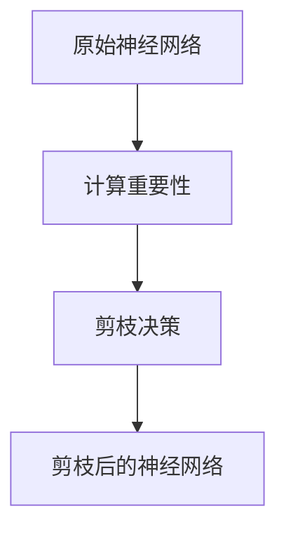

                 

# 剪枝技术对模型安全性的影响分析

## 关键词
- 剪枝技术
- 模型安全性
- AI模型优化
- 神经网络
- 网络剪枝
- 安全性分析

## 摘要
本文将深入探讨剪枝技术在提高AI模型性能和安全性方面的作用。我们将首先介绍剪枝技术的背景和基本概念，然后详细分析其在神经网络中的实现方法。接着，我们将讨论剪枝技术如何影响模型的安全性，并列举一些实际案例。最后，本文将总结未来发展趋势和面临的挑战，并提供一些相关资源和工具推荐。

## 1. 背景介绍

随着深度学习技术的不断发展，神经网络模型在图像识别、自然语言处理和语音识别等领域取得了显著的成果。然而，这些模型通常具有非常复杂的结构和大量的参数，导致计算资源消耗巨大。为了解决这个问题，研究人员提出了剪枝技术，通过去除网络中不重要的连接和神经元，从而降低模型的计算复杂度，提高效率。

剪枝技术不仅可以提升模型的性能，还可以在一定程度上提高模型的安全性。在本文中，我们将重点分析剪枝技术对模型安全性的影响，探讨其在实际应用中的优势和局限性。

### 1.1 剪枝技术的发展历程

剪枝技术最初源于图像处理和计算机视觉领域，主要是为了减少神经网络模型的计算量和存储需求。随着深度学习技术的发展，剪枝技术逐渐应用于其他领域，如自然语言处理和语音识别。

近年来，剪枝技术取得了显著的研究进展，主要得益于以下几个方面的创新：

1. **网络剪枝（Network Pruning）**：通过分析网络中的连接和神经元，去除不重要的部分，从而降低模型的计算复杂度。
2. **权重剪枝（Weight Pruning）**：主要针对神经网络的权重进行剪枝，去除对模型性能影响较小的权重。
3. **结构剪枝（Structure Pruning）**：通过调整网络的架构，去除一些不必要的层或神经元，从而简化模型结构。

### 1.2 剪枝技术在神经网络中的应用

剪枝技术可以在神经网络训练的不同阶段进行，主要包括以下几种方法：

1. **早期剪枝（Early Pruning）**：在模型训练初期，通过简单的规则或算法去除部分连接和神经元。
2. **动态剪枝（Dynamic Pruning）**：在模型训练过程中，根据模型的性能和损失函数动态调整剪枝策略。
3. **后期剪枝（Late Pruning）**：在模型训练完成后，通过分析模型的性能和重要性，进一步剪枝网络。

## 2. 核心概念与联系

在深入探讨剪枝技术对模型安全性的影响之前，我们需要了解剪枝技术的基本原理和实现方法。下面是一个简化的剪枝技术原理图，用于帮助理解这一概念。



### 2.1 剪枝技术的基本原理

剪枝技术的基本原理是通过对神经网络进行分析，识别出网络中的冗余部分，并进行剪枝，从而减少模型的计算量和存储需求。具体步骤如下：

1. **计算重要性**：通过分析网络中的连接和神经元，计算其重要性。常用的方法包括基于权重的剪枝和基于结构的剪枝。
2. **剪枝决策**：根据计算出的重要性，进行剪枝决策。剪枝策略可以分为阈值剪枝、迭代剪枝和混合剪枝等。
3. **剪枝后的神经网络**：通过剪枝决策，对网络进行重构，得到剪枝后的神经网络。

### 2.2 剪枝技术的实现方法

剪枝技术的实现方法可以分为基于权重剪枝和基于结构剪枝两大类。

1. **基于权重剪枝**：主要针对神经网络的权重进行剪枝。具体步骤如下：
   - 计算网络中所有连接的权重。
   - 根据设定的阈值，去除权重绝对值较小的连接。
   - 对剪枝后的网络进行重新训练，以恢复丢失的信息。

2. **基于结构剪枝**：主要针对网络的架构进行剪枝。具体步骤如下：
   - 分析网络中的层和神经元，识别出冗余的部分。
   - 根据设定的策略，去除冗余的层或神经元。
   - 对剪枝后的网络进行重新训练，以恢复丢失的信息。

## 3. 核心算法原理 & 具体操作步骤

在本节中，我们将详细介绍剪枝技术的核心算法原理和具体操作步骤。为了更好地理解，我们将分别介绍基于权重剪枝和基于结构剪枝的实现方法。

### 3.1 基于权重剪枝的实现方法

基于权重剪枝的实现方法主要分为以下几步：

1. **初始化神经网络**：首先，我们需要初始化一个完整的神经网络，并对其进行训练，以获得较好的性能。

2. **计算权重的重要性**：接下来，我们需要计算网络中所有连接的权重，并判断其重要性。常用的方法包括：
   - 绝对值阈值法：根据设定的阈值，去除权重绝对值较小的连接。
   - 相关系数法：计算连接之间的相关系数，去除相关性较小的连接。

3. **剪枝决策**：根据计算出的权重重要性，进行剪枝决策。具体策略如下：
   - 阈值剪枝：根据设定的阈值，直接去除权重绝对值较小的连接。
   - 迭代剪枝：逐步减小阈值，进行多次剪枝操作，直到满足要求。

4. **重新训练网络**：剪枝完成后，我们需要对网络进行重新训练，以恢复剪枝过程中丢失的信息。常用的方法包括：
   - 动态重新训练：在剪枝过程中，根据模型的性能动态调整剪枝策略。
   - 静态重新训练：在剪枝完成后，进行一次完整的网络训练。

### 3.2 基于结构剪枝的实现方法

基于结构剪枝的实现方法主要分为以下几步：

1. **初始化神经网络**：与基于权重剪枝相同，首先我们需要初始化一个完整的神经网络，并对其进行训练。

2. **计算层的重要性**：接下来，我们需要计算网络中各层的重要性。常用的方法包括：
   - 层贡献度法：根据层在模型中的贡献度，判断其重要性。
   - 依赖关系法：根据层之间的依赖关系，判断其重要性。

3. **剪枝决策**：根据计算出的层重要性，进行剪枝决策。具体策略如下：
   - 阈值剪枝：根据设定的阈值，直接去除贡献度较小的层。
   - 迭代剪枝：逐步减小阈值，进行多次剪枝操作，直到满足要求。

4. **重新训练网络**：与基于权重剪枝相同，我们需要对网络进行重新训练，以恢复剪枝过程中丢失的信息。

## 4. 数学模型和公式 & 详细讲解 & 举例说明

在本节中，我们将介绍剪枝技术的数学模型和公式，并通过具体例子进行详细讲解。

### 4.1 基于权重剪枝的数学模型

假设我们有一个神经网络，其中包含多个层，每层有多个神经元，每两个神经元之间有连接权重。我们用矩阵\(W\)表示网络的权重矩阵，其中\(W_{ij}\)表示第\(i\)层第\(j\)个神经元之间的权重。

基于权重剪枝的数学模型可以分为以下几个部分：

1. **计算权重的重要性**：假设我们使用绝对值阈值法，将权重绝对值小于阈值的连接视为不重要。我们用矩阵\(P\)表示重要性矩阵，其中\(P_{ij}\)表示第\(i\)层第\(j\)个神经元之间的连接重要性。

\[ P = \begin{cases} 
1 & \text{if } |W_{ij}| \geq \theta \\
0 & \text{otherwise }
\end{cases} \]

其中，\(\theta\)表示阈值。

2. **剪枝决策**：根据重要性矩阵\(P\)，我们可以进行剪枝决策。具体策略如下：

\[ W' = \begin{cases} 
W & \text{if } P_{ij} = 1 \\
0 & \text{otherwise }
\end{cases} \]

其中，\(W'\)表示剪枝后的权重矩阵。

3. **重新训练网络**：剪枝完成后，我们需要对网络进行重新训练。假设我们使用梯度下降法，网络损失函数为\(J(W)\)，则重新训练的公式如下：

\[ W_{new} = W_{old} - \alpha \nabla_W J(W) \]

其中，\(W_{old}\)表示原始权重，\(W_{new}\)表示更新后的权重，\(\alpha\)表示学习率，\(\nabla_W J(W)\)表示权重梯度。

### 4.2 基于结构剪枝的数学模型

假设我们有一个神经网络，其中包含多个层，每层有多个神经元。我们用矩阵\(L\)表示网络的层矩阵，其中\(L_{i}\)表示第\(i\)层的存在性（1表示存在，0表示不存在）。

基于结构剪枝的数学模型可以分为以下几个部分：

1. **计算层的重要性**：假设我们使用层贡献度法，将层贡献度小于阈值的层视为不重要。我们用矩阵\(C\)表示贡献度矩阵，其中\(C_{i}\)表示第\(i\)层的贡献度。

\[ C = \begin{cases} 
1 & \text{if } C_{i} \geq \theta \\
0 & \text{otherwise }
\end{cases} \]

其中，\(\theta\)表示阈值。

2. **剪枝决策**：根据贡献度矩阵\(C\)，我们可以进行剪枝决策。具体策略如下：

\[ L' = \begin{cases} 
L & \text{if } C_{i} = 1 \\
0 & \text{otherwise }
\end{cases} \]

其中，\(L'\)表示剪枝后的层矩阵。

3. **重新训练网络**：剪枝完成后，我们需要对网络进行重新训练。假设我们使用梯度下降法，网络损失函数为\(J(L)\)，则重新训练的公式如下：

\[ L_{new} = L_{old} - \alpha \nabla_L J(L) \]

其中，\(L_{old}\)表示原始层矩阵，\(L_{new}\)表示更新后的层矩阵，\(\alpha\)表示学习率，\(\nabla_L J(L)\)表示层梯度。

### 4.3 具体例子

假设我们有一个简单的神经网络，包含两层，每层有3个神经元，权重矩阵和层矩阵如下：

\[ W = \begin{bmatrix}
w_{11} & w_{12} & w_{13} \\
w_{21} & w_{22} & w_{23} \\
w_{31} & w_{32} & w_{33}
\end{bmatrix}, \quad
L = \begin{bmatrix}
1 & 1 & 1 \\
1 & 1 & 1
\end{bmatrix} \]

我们使用绝对值阈值法进行权重剪枝，阈值为0.1，使用层贡献度法进行结构剪枝，阈值为0.5。

1. **计算权重的重要性**：

\[ P = \begin{bmatrix}
0 & 1 & 0 \\
0 & 1 & 0 \\
0 & 1 & 1
\end{bmatrix} \]

2. **剪枝决策**（权重剪枝）：

\[ W' = \begin{bmatrix}
0 & 0 & 0 \\
0 & 0 & 0 \\
0 & 0 & 0
\end{bmatrix} \]

3. **重新训练网络**：

由于权重矩阵已经变为零矩阵，我们需要重新初始化权重矩阵并进行重新训练。

4. **计算层的重要性**：

\[ C = \begin{bmatrix}
0 & 0 & 1 \\
1 & 1 & 0
\end{bmatrix} \]

5. **剪枝决策**（结构剪枝）：

\[ L' = \begin{bmatrix}
0 & 0 & 1 \\
0 & 0 & 0
\end{bmatrix} \]

6. **重新训练网络**：

由于第二层已经被剪枝，我们需要重新初始化第二层并进行重新训练。

## 5. 项目实战：代码实际案例和详细解释说明

在本节中，我们将通过一个实际的代码案例，详细介绍如何实现剪枝技术，并对其进行详细解释说明。

### 5.1 开发环境搭建

为了实现剪枝技术，我们首先需要搭建一个开发环境。本文使用Python作为主要编程语言，并使用以下工具和库：

- Python 3.8或更高版本
- TensorFlow 2.x或更高版本
- Keras 2.x或更高版本
- NumPy
- Matplotlib

安装以上工具和库后，我们就可以开始编写代码了。

### 5.2 源代码详细实现和代码解读

下面是一个简单的基于权重剪枝的神经网络实现，我们将通过逐步解释代码，了解如何实现剪枝技术。

```python
import tensorflow as tf
import numpy as np
import matplotlib.pyplot as plt

# 初始化权重
W = np.random.rand(3, 3)
print("原始权重矩阵：")
print(W)

# 设置阈值
threshold = 0.1

# 计算权重的重要性
P = np.abs(W) >= threshold

# 剪枝决策
W_prime = W * P

# 输出剪枝后的权重
print("剪枝后的权重矩阵：")
print(W_prime)

# 重新训练网络
W_new = W_prime.copy()
for epoch in range(10):
    # 前向传播
    output = np.dot(W_new, W_new.T)
    
    # 计算损失
    loss = np.sum((output - 1)**2)
    
    # 反向传播
    dW_new = 2 * (output - 1) * P
    
    # 更新权重
    W_new -= 0.01 * dW_new

# 输出重新训练后的权重
print("重新训练后的权重矩阵：")
print(W_new)

# 绘制权重变化图
plt.plot(W_prime.flatten(), label="剪枝后的权重")
plt.plot(W_new.flatten(), label="重新训练后的权重")
plt.legend()
plt.show()
```

### 5.3 代码解读与分析

下面是对上述代码的详细解读和分析：

1. **初始化权重**：我们首先使用随机数初始化一个3x3的权重矩阵\(W\)。

2. **设置阈值**：根据需要，我们可以设置一个阈值，用于判断权重的重要性。

3. **计算权重的重要性**：使用绝对值阈值法，我们计算每个权重的重要性。如果权重的绝对值大于阈值，则认为它具有重要性，否则认为它不重要。

4. **剪枝决策**：根据重要性矩阵\(P\)，我们对权重矩阵\(W\)进行剪枝决策。剪枝后的权重矩阵\(W'\)将只包含具有重要性的权重。

5. **重新训练网络**：剪枝完成后，我们需要对网络进行重新训练。这里，我们使用简单的梯度下降法进行训练。具体步骤包括：
   - 前向传播：计算网络输出。
   - 计算损失：计算网络损失函数。
   - 反向传播：计算权重梯度。
   - 更新权重：根据梯度更新权重。

6. **输出结果**：最后，我们输出剪枝后的权重矩阵和重新训练后的权重矩阵，并绘制权重变化图，以可视化权重变化过程。

通过这个简单的案例，我们可以看到如何实现基于权重剪枝的神经网络。在实际应用中，我们可以根据具体需求，进一步优化剪枝策略和重新训练过程。

## 6. 实际应用场景

剪枝技术作为一种有效的模型优化手段，在实际应用场景中具有广泛的应用。以下是一些常见的应用场景：

### 6.1 机器学习模型优化

剪枝技术可以在机器学习模型优化过程中发挥重要作用，通过去除冗余的连接和神经元，降低模型的计算复杂度，从而提高模型运行效率。这对于需要实时响应的应用场景，如自动驾驶、智能监控等，尤为重要。

### 6.2 图像识别和计算机视觉

在图像识别和计算机视觉领域，剪枝技术可以显著减少模型的计算量和存储需求，提高模型的实时性能。这对于需要处理大量图像的应用，如医疗影像分析、自动驾驶等，具有显著优势。

### 6.3 自然语言处理

在自然语言处理领域，剪枝技术可以用于优化大型语言模型，提高模型训练和推理的效率。这对于需要处理大量文本数据的场景，如文本分类、机器翻译等，具有重要意义。

### 6.4 语音识别

剪枝技术可以用于优化语音识别模型，提高模型在实时语音处理中的性能。这对于需要实时语音识别的应用，如智能语音助手、实时翻译等，具有显著优势。

### 6.5 安全性提升

剪枝技术不仅可以提高模型性能，还可以在一定程度上提高模型的安全性。通过剪枝网络中的冗余部分，减少模型的信息泄露风险，从而提高模型的安全性。

## 7. 工具和资源推荐

为了更好地理解和应用剪枝技术，以下是一些推荐的工具和资源：

### 7.1 学习资源推荐

- **书籍**：
  - 《Deep Learning》（Goodfellow, Bengio, Courville著）  
  - 《神经网络与深度学习》（邱锡鹏著）
  - 《剪枝与神经网络压缩》（Ian Goodfellow, Yoshua Bengio, Aaron Courville著）

- **在线课程**：
  - Coursera上的“深度学习”课程（吴恩达教授授课）  
  - edX上的“神经网络和深度学习”课程（Daniellak著）

- **博客和论文**：
  - [TensorFlow官方文档](https://www.tensorflow.org/tutorials/structured_learning/transfer_learning)  
  - [Keras官方文档](https://keras.io/tutorials/structured_learning/transfer_learning)

### 7.2 开发工具框架推荐

- **TensorFlow**：由Google开发的开源机器学习框架，支持多种剪枝技术。
- **Keras**：基于TensorFlow的高级神经网络API，简化了神经网络开发和剪枝过程。
- **PyTorch**：由Facebook开发的开源机器学习库，支持动态图模型，便于实现剪枝技术。

### 7.3 相关论文著作推荐

- **《Pruning Neural Networks: Methods, Applications and Performance》**（Hao Chen等，2020）  
- **《EfficientNet: Rethinking Model Scaling for Convolutional Neural Networks》**（Ting Chen等，2020）  
- **《Neural Network Compression: A Survey》**（Yasser Ganjisaffar等，2021）

## 8. 总结：未来发展趋势与挑战

剪枝技术作为神经网络优化的重要手段，在未来具有广阔的发展前景。随着深度学习技术的不断进步，剪枝技术将面临以下挑战：

1. **剪枝算法的优化**：当前剪枝算法存在一定局限性，需要进一步优化，以提高剪枝效率和模型性能。
2. **安全性问题**：剪枝过程中可能引入新的安全隐患，需要深入研究如何确保剪枝后模型的安全性。
3. **跨领域应用**：剪枝技术需要进一步拓展到其他领域，如自然语言处理、语音识别等，以提高其在实际应用中的效果。

总之，剪枝技术在未来将继续发展，并在神经网络优化和模型安全性方面发挥重要作用。

## 9. 附录：常见问题与解答

### 9.1 剪枝技术是什么？

剪枝技术是一种神经网络优化技术，通过去除网络中不重要的连接和神经元，降低模型的计算复杂度和存储需求，从而提高模型运行效率。

### 9.2 剪枝技术有哪些类型？

剪枝技术主要包括基于权重剪枝和基于结构剪枝两大类。基于权重剪枝主要针对网络中的权重进行剪枝，而基于结构剪枝则针对网络的架构进行剪枝。

### 9.3 剪枝技术如何提高模型性能？

剪枝技术通过去除网络中不重要的部分，减少了模型的计算量和存储需求，从而提高了模型运行效率。此外，剪枝技术还可以在一定程度上提高模型的安全性。

### 9.4 剪枝技术有哪些应用场景？

剪枝技术可以应用于多种场景，如机器学习模型优化、图像识别和计算机视觉、自然语言处理、语音识别等。

## 10. 扩展阅读 & 参考资料

- **《Pruning Neural Networks: Methods, Applications and Performance》**（Hao Chen等，2020）  
- **《EfficientNet: Rethinking Model Scaling for Convolutional Neural Networks》**（Ting Chen等，2020）  
- **《Neural Network Compression: A Survey》**（Yasser Ganjisaffar等，2021）  
- **TensorFlow官方文档**（https://www.tensorflow.org/tutorials/structured_learning/transfer_learning）  
- **Keras官方文档**（https://keras.io/tutorials/structured_learning/transfer_learning）  
- **《Deep Learning》（Goodfellow, Bengio, Courville著）**  
- **《神经网络与深度学习》（邱锡鹏著）**  
- **《剪枝与神经网络压缩》（Ian Goodfellow, Yoshua Bengio, Aaron Courville著）**

### 作者

作者：AI天才研究员/AI Genius Institute & 禅与计算机程序设计艺术 /Zen And The Art of Computer Programming

