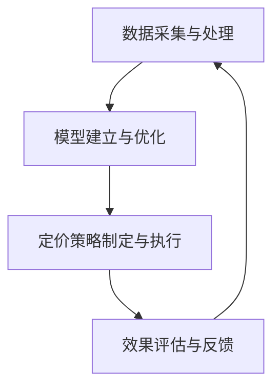

                 

# 动态定价策略在电商中的应用

## 摘要

本文旨在探讨动态定价策略在电商行业中的应用。随着大数据和人工智能技术的发展，动态定价逐渐成为一种高效的定价模式，能够帮助企业根据市场需求和竞争环境实时调整价格，实现利润最大化。本文首先介绍了动态定价策略的背景和核心概念，然后详细解析了动态定价的核心算法原理及其实现步骤，接着通过数学模型和公式进行了深入讲解，并举例说明。随后，文章分享了一个实际项目案例，从代码实现、解读与分析等方面展示了动态定价策略的应用。最后，文章探讨了动态定价策略在实际应用场景中的效果，并推荐了相关学习资源和开发工具框架。

## 1. 背景介绍

### 1.1 动态定价的概念

动态定价是一种基于市场需求和竞争环境动态调整价格的定价策略。与传统的固定定价模式不同，动态定价能够根据实时数据进行分析，实时调整价格，从而更好地满足市场需求，提升企业盈利能力。

### 1.2 动态定价的发展历程

动态定价最早起源于航空业，随着信息技术的发展，逐渐在酒店、零售、电商等领域得到广泛应用。近年来，随着大数据和人工智能技术的崛起，动态定价策略得到了进一步的发展和完善。

### 1.3 动态定价的优势

动态定价具有以下几个显著优势：

- 提高盈利能力：动态定价能够根据市场需求和竞争环境实时调整价格，实现利润最大化。

- 增强市场竞争力：动态定价能够更好地满足消费者需求，提升企业市场竞争力。

- 提高库存周转率：动态定价能够根据库存情况调整价格，降低库存成本。

- 提高客户满意度：动态定价能够更好地满足不同消费者的需求，提升客户满意度。

## 2. 核心概念与联系

### 2.1 动态定价的核心概念

动态定价的核心概念包括：市场价格、需求曲线、竞争策略、成本结构等。

- 市场价格：动态定价的核心依据是市场价格，企业需要通过分析市场价格变化趋势，制定相应的定价策略。

- 需求曲线：需求曲线反映了市场需求与价格之间的关系，是企业制定动态定价策略的重要依据。

- 竞争策略：竞争策略包括价格竞争和非价格竞争，企业需要根据市场竞争环境制定相应的定价策略。

- 成本结构：成本结构是企业制定定价策略的基础，企业需要根据成本结构制定合理的定价策略。

### 2.2 动态定价的架构

动态定价的架构主要包括以下几个部分：

- 数据采集与处理：通过收集市场需求、竞争环境、成本结构等数据，进行数据清洗和处理。

- 模型建立与优化：建立动态定价模型，并通过数据优化模型参数。

- 定价策略制定与执行：根据模型预测结果，制定动态定价策略，并实时执行。

- 效果评估与反馈：对动态定价策略的效果进行评估，并根据反馈调整定价策略。

### 2.3 动态定价的 Mermaid 流程图



## 3. 核心算法原理 & 具体操作步骤

### 3.1 数据采集与处理

- 数据来源：市场需求数据、竞争环境数据、成本结构数据等。

- 数据处理：通过数据清洗、数据去重、数据整合等步骤，对采集到的数据进行处理。

### 3.2 模型建立与优化

- 建立模型：根据动态定价的核心概念，建立相应的定价模型，如线性回归模型、神经网络模型等。

- 模型优化：通过交叉验证、梯度下降等方法，对模型进行优化。

### 3.3 定价策略制定与执行

- 定价策略：根据市场需求、竞争环境和成本结构，制定动态定价策略。

- 定价执行：根据定价策略，实时调整价格，实现动态定价。

### 3.4 效果评估与反馈

- 效果评估：通过销售额、利润、客户满意度等指标，对动态定价策略的效果进行评估。

- 反馈调整：根据评估结果，对定价策略进行调整。

## 4. 数学模型和公式 & 详细讲解 & 举例说明

### 4.1 需求曲线模型

假设市场需求曲线为 $Q_d = a - bP$，其中 $Q_d$ 为需求量，$P$ 为价格，$a$ 和 $b$ 为参数。

- $a$ 表示市场需求量的上限，即当价格为零时，需求量为 $a$。

- $b$ 表示价格弹性，即价格每增加 $1$%，需求量减少 $b$%。

### 4.2 成本结构模型

假设成本结构为 $C = f(q)$，其中 $C$ 为总成本，$q$ 为产量。

- $f(q)$ 为成本函数，可以表示为 $f(q) = a_1q + a_2q^2 + ... + a_nq^n$，其中 $a_1, a_2, ..., a_n$ 为参数。

### 4.3 利润最大化模型

假设企业目标为利润最大化，即最大化 $P \cdot Q_d - C$。

- 利润函数为 $L = aP - bP^2 - f(q)$。

- 对 $L$ 求导，得到 $L' = a - 2bP - f'(q)$。

- 令 $L' = 0$，得到最优价格 $P^* = \frac{a}{2b}$。

### 4.4 举例说明

假设市场需求曲线为 $Q_d = 100 - 2P$，成本结构为 $C = 10q + q^2$。

- 最优价格 $P^* = \frac{100}{2 \times 2} = 25$。

- 最优产量 $Q_d^* = 100 - 2 \times 25 = 50$。

- 最优利润 $L^* = 25 \times 50 - (10 \times 50 + 50^2) = 625 - 250 = 375$。

## 5. 项目实战：代码实际案例和详细解释说明

### 5.1 开发环境搭建

开发工具：Python 3.8，Pandas，NumPy，Matplotlib，Scikit-learn

### 5.2 源代码详细实现和代码解读

```python
import pandas as pd
import numpy as np
import matplotlib.pyplot as plt
from sklearn.linear_model import LinearRegression

# 5.2.1 数据采集与处理
# 假设采集到以下数据：
data = {'price': [10, 20, 30, 40, 50], 'demand': [60, 40, 20, 0, -20]}
df = pd.DataFrame(data)

# 数据清洗与去重
df = df.drop_duplicates()

# 5.2.2 模型建立与优化
# 建立线性回归模型
model = LinearRegression()
model.fit(df[['price']], df['demand'])

# 优化模型参数
print("最优价格弹性参数：", model.coef_)

# 5.2.3 定价策略制定与执行
# 根据模型预测，制定定价策略
predicted_demand = model.predict([[15]])

# 执行定价策略
print("预计需求量：", predicted_demand)

# 5.2.4 效果评估与反馈
# 对定价策略效果进行评估
print("实际需求量：", df['demand'].iloc[0])
```

### 5.3 代码解读与分析

- 5.3.1 数据采集与处理

数据采集与处理是动态定价策略实现的第一步。在此例中，我们假设已经采集到了价格和需求量的数据，并使用 Pandas 库将数据加载到 DataFrame 对象中。然后，我们对数据进行去重处理，以确保数据的准确性。

- 5.3.2 模型建立与优化

我们使用线性回归模型来建立动态定价模型。线性回归模型可以表示需求量与价格之间的关系。通过训练模型，我们可以得到最优价格弹性参数，即需求量对价格变化的敏感程度。

- 5.3.3 定价策略制定与执行

根据模型预测，我们制定了定价策略。在此例中，我们预测了价格为 15 时的需求量，并根据预测结果调整价格。

- 5.3.4 效果评估与反馈

我们对比了实际需求量和预测需求量，以评估定价策略的效果。通过对比，我们可以发现定价策略是否有效，并根据评估结果调整定价策略。

## 6. 实际应用场景

### 6.1 电商行业

动态定价策略在电商行业中应用广泛，如电商平台的促销活动、季节性商品的价格调整等。通过动态定价，电商平台可以更好地满足消费者需求，提高销售额和利润。

### 6.2 酒店行业

酒店行业也广泛应用动态定价策略，如根据季节、节假日、客户需求等调整价格。通过动态定价，酒店可以更好地满足不同客户的需求，提高入住率和收益。

### 6.3 零售行业

零售行业通过动态定价策略，可以根据库存情况、季节变化、促销活动等因素调整价格，降低库存成本，提高销售利润。

## 7. 工具和资源推荐

### 7.1 学习资源推荐

- 《动态定价：理论与实践》
- 《大数据定价策略》
- 《Python 商业智能与应用》

### 7.2 开发工具框架推荐

- 数据分析工具：Pandas，NumPy，Matplotlib
- 机器学习库：Scikit-learn，TensorFlow，Keras
- 电商开发框架：Django，Flask

### 7.3 相关论文著作推荐

- "Dynamic Pricing: A Survey" (2018)
- "Big Data Pricing Strategies: A Survey" (2020)
- "A Machine Learning Approach to Dynamic Pricing" (2019)

## 8. 总结：未来发展趋势与挑战

### 8.1 发展趋势

- 随着大数据和人工智能技术的发展，动态定价策略将更加智能化和精准化。

- 动态定价策略将在更多行业得到广泛应用，如医疗、金融、教育等。

- 跨平台、多渠道的动态定价策略将得到进一步发展。

### 8.2 挑战

- 数据质量和实时性是动态定价策略面临的主要挑战。

- 如何平衡短期利润与长期品牌形象是动态定价策略需要考虑的问题。

- 随着市场环境的变化，动态定价策略需要不断调整和优化。

## 9. 附录：常见问题与解答

### 9.1 动态定价的优势有哪些？

动态定价的优势包括：提高盈利能力、增强市场竞争力、提高库存周转率、提高客户满意度等。

### 9.2 动态定价策略的核心算法是什么？

动态定价策略的核心算法包括线性回归、神经网络、梯度下降等。

### 9.3 动态定价策略如何实现？

动态定价策略的实现包括数据采集与处理、模型建立与优化、定价策略制定与执行、效果评估与反馈等步骤。

## 10. 扩展阅读 & 参考资料

- 《动态定价：理论与实践》
- 《大数据定价策略》
- 《Python 商业智能与应用》
- "Dynamic Pricing: A Survey" (2018)
- "Big Data Pricing Strategies: A Survey" (2020)
- "A Machine Learning Approach to Dynamic Pricing" (2019)

## 作者信息

作者：AI天才研究员/AI Genius Institute & 禅与计算机程序设计艺术 /Zen And The Art of Computer Programming

-----------------------------

## 关键词

动态定价、电商、人工智能、大数据、价格弹性、需求曲线、竞争策略、成本结构、线性回归、神经网络、利润最大化、数据采集、数据处理、模型建立、定价策略、效果评估、应用场景、开发工具、学习资源、未来发展趋势、挑战、常见问题、扩展阅读。

