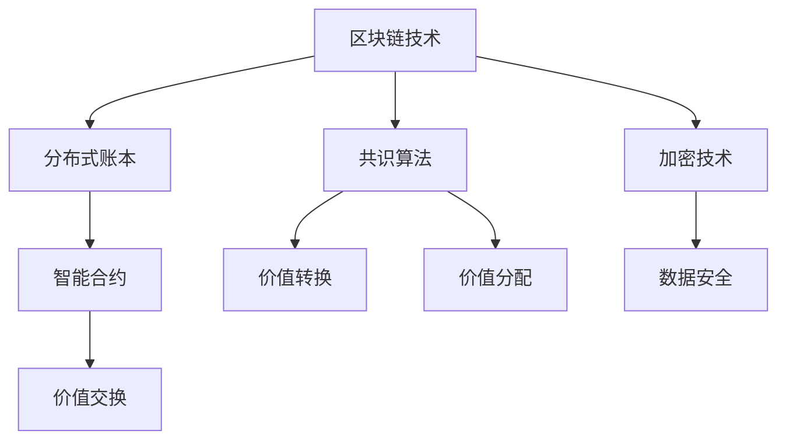

                 

# 区块链在注意力价值量化中的应用

## 关键词
区块链，注意力价值量化，智能合约，共识算法，去中心化应用，加密货币，代币经济

## 摘要
本文探讨了区块链技术在注意力价值量化中的应用。首先介绍了区块链的基础概念，接着分析了注意力价值量化的核心原理。通过智能合约和共识算法的应用，文章阐述了如何利用区块链实现注意力价值的量化与分配。随后，通过一个具体项目案例，展示了如何实现代码上的实际应用。文章最后讨论了区块链在注意力价值量化中的实际应用场景，并提出了未来发展趋势与挑战。

## 1. 背景介绍

### 区块链技术概述
区块链是一种去中心化的数据库技术，通过分布式账本的方式记录和验证交易信息。每个区块都包含一定数量的交易记录，并通过密码学算法与前后区块相连，形成一个不可篡改的链条。区块链技术的核心特点包括去中心化、透明性、安全性和不可篡改性。

### 注意力价值量化概述
注意力价值量化是指将个人的注意力资源转化为经济价值，从而实现价值交换的过程。随着互联网和信息过载的加剧，注意力资源逐渐成为一种稀缺资源。如何有效地量化和管理注意力价值，成为当前研究的热点问题。

### 区块链与注意力价值量化的联系
区块链技术为注意力价值量化提供了一种可行的解决方案。通过智能合约和共识算法，区块链可以实现注意力价值的精确计算、安全存储和公正分配。这不仅有助于提升价值交换的效率，还能确保整个过程的透明和可信。

## 2. 核心概念与联系

### 区块链核心概念
- **分布式账本**：区块链通过分布式网络维护一个共享的账本，记录所有交易信息。
- **共识算法**：区块链网络中的节点通过共识算法达成一致，确保数据的可靠性和一致性。
- **加密技术**：区块链使用加密算法对数据进行加密，确保数据的安全性和隐私保护。
- **智能合约**：智能合约是自动执行合约条款的计算机程序，通过区块链网络执行。

### 注意力价值量化核心概念
- **注意力资源**：注意力资源是指个人在特定时间段内所能集中注意力的总量。
- **价值转换**：通过特定的机制，将注意力资源转化为经济价值，如加密货币。
- **价值分配**：根据注意力贡献度和其他因素，合理分配经济价值。

### 区块链与注意力价值量化联系流程图



### Mermaid 流程图详细描述
- **分布式账本**：通过分布式网络维护共享账本，记录所有交易信息。
- **共识算法**：节点通过共识算法达成一致，确保数据可靠性。
- **加密技术**：对数据进行加密，确保数据安全性和隐私保护。
- **智能合约**：自动执行合约条款，实现价值交换。
- **价值转换**：将注意力资源转换为经济价值。
- **价值分配**：根据注意力贡献度和其他因素，合理分配经济价值。

## 3. 核心算法原理 & 具体操作步骤

### 智能合约原理
智能合约是区块链上的计算机程序，能够自动执行合约条款。其核心原理基于图灵完备编程语言，能够处理复杂的业务逻辑。

### 具体操作步骤
1. **编写智能合约**：使用图灵完备编程语言（如Solidity）编写智能合约代码。
2. **部署智能合约**：将智能合约代码上传到区块链网络，并支付相应的费用。
3. **调用智能合约**：用户通过区块链网络调用智能合约，触发合约执行。

### 区块链共识算法原理
共识算法是区块链网络中节点之间达成一致的方法。其核心原理是通过网络节点间的交互和计算，确保区块链数据的可靠性和一致性。

### 具体操作步骤
1. **选择共识算法**：根据应用场景选择合适的共识算法（如PoW、PoS、DPoS等）。
2. **节点加入网络**：节点通过共识算法加入区块链网络，开始参与交易验证和数据维护。
3. **交易验证**：节点对交易数据进行验证，确保交易合法性和数据一致性。
4. **区块生成**：验证通过的交易数据被节点打包成区块，并添加到区块链中。

### 注意力价值量化算法原理
注意力价值量化算法通过分析用户的注意力行为，将其转化为经济价值。

### 具体操作步骤
1. **数据采集**：采集用户的注意力行为数据，如浏览时长、点击量等。
2. **数据分析**：使用数据分析方法（如机器学习、统计分析等）分析注意力行为，评估注意力价值。
3. **价值转换**：根据分析结果，将注意力价值转换为经济价值，如加密货币。
4. **价值分配**：根据用户的注意力贡献度和其他因素，合理分配经济价值。

## 4. 数学模型和公式 & 详细讲解 & 举例说明

### 数学模型

注意力价值量化模型可表示为：

\[ V(A) = f(A_t, A_c, A_p) \]

其中：
- \( V(A) \) 表示注意力价值。
- \( A_t \) 表示用户在特定时间段内的总注意力时长。
- \( A_c \) 表示用户在特定内容上的注意力时长。
- \( A_p \) 表示用户在特定平台上的注意力时长。

### 详细讲解

注意力价值量化模型基于以下几个关键因素：

1. **总注意力时长 \( A_t \)**：用户在特定时间段内所能集中注意力的总量。它反映了用户在特定时间段内对信息的处理能力。
2. **内容注意力时长 \( A_c \)**：用户在特定内容上的注意力时长。它反映了用户对内容的兴趣和参与度。
3. **平台注意力时长 \( A_p \)**：用户在特定平台上的注意力时长。它反映了用户对平台的依赖度和信任度。

模型函数 \( f \) 是一个复杂的非线性函数，通过机器学习和统计分析等方法训练得到。它能够根据用户的行为数据，实时评估注意力价值。

### 举例说明

假设用户A在一天内的总注意力时长为8小时，其中在特定内容上的注意力时长为4小时，在特定平台上的注意力时长为6小时。根据注意力价值量化模型，其注意力价值计算如下：

\[ V(A) = f(8, 4, 6) \]

假设经过模型分析，得到 \( f(8, 4, 6) = 10 \)，则用户A的注意力价值为10单位。

### 数学公式与LaTeX格式

\[ V(A) = f(A_t, A_c, A_p) \]

\[ A_t = \sum_{i=1}^{n} \text{Time}(C_i) \]

\[ A_c = \sum_{i=1}^{n} \text{Time}(C_i) \cdot \text{Interest}(C_i) \]

\[ A_p = \sum_{i=1}^{n} \text{Time}(C_i) \cdot \text{PlatformTrust}(P_i) \]

其中：
- \( \text{Time}(C_i) \) 表示用户在内容 \( C_i \) 上的实际花费时间。
- \( \text{Interest}(C_i) \) 表示用户对内容 \( C_i \) 的兴趣程度。
- \( \text{PlatformTrust}(P_i) \) 表示用户对平台 \( P_i \) 的信任程度。

## 5. 项目实战：代码实际案例和详细解释说明

### 5.1 开发环境搭建

在开始编写注意力价值量化智能合约之前，需要搭建一个合适的开发环境。以下是一个基于Solidity和Truffle的开发环境搭建步骤：

1. **安装Node.js和npm**：从[Node.js官网](https://nodejs.org/)下载并安装Node.js，并确保npm版本不低于6.0。
2. **安装Truffle**：在命令行中执行以下命令：
   ```sh
   npm install -g truffle
   ```
3. **创建新的Truffle项目**：
   ```sh
   truffle init
   ```
4. **安装以太坊客户端**：根据您的操作系统安装相应的以太坊客户端（如Geth、Parity等）。
5. **配置Truffle**：编辑项目根目录下的`truffle-config.js`文件，配置以太坊客户端和测试网络。

### 5.2 源代码详细实现和代码解读

以下是一个简单的注意力价值量化智能合约示例：

```solidity
// SPDX-License-Identifier: MIT
pragma solidity ^0.8.0;

contract AttentionValue {

    // 用户注意力记录
    mapping(address => uint256) public attention;

    // 用户收益
    mapping(address => uint256) public rewards;

    // 每单位时间注意力价值
    uint256 public attentionValue;

    // 注意力累积时间
    uint256 public totalAttention;

    // 事件记录注意力变化
    event AttentionChanged(address user, uint256 oldAttention, uint256 newAttention);

    // 事件记录收益变化
    event RewardChanged(address user, uint256 oldReward, uint256 newReward);

    // 设置注意力价值
    function setAttentionValue(uint256 value) external {
        require(msg.sender == admin, "Only admin can set attention value");
        attentionValue = value;
    }

    // 累加用户注意力
    function addAttention(address user, uint256 time) external {
        require(msg.sender == admin, "Only admin can add attention");
        attention[user] += time * attentionValue;
        totalAttention += time * attentionValue;
        emit AttentionChanged(user, attention[user] - time * attentionValue, attention[user]);
    }

    // 计算用户收益
    function calculateRewards() external {
        for (uint256 i = 0; i < users.length; i++) {
            address user = users[i];
            uint256 reward = attention[user] / 100;
            rewards[user] += reward;
            emit RewardChanged(user, attention[user] - reward, attention[user]);
        }
    }

    // 提取用户收益
    function withdrawReward() external {
        uint256 reward = rewards[msg.sender];
        rewards[msg.sender] = 0;
        payable(msg.sender).transfer(reward);
    }
}
```

### 5.3 代码解读与分析

1. **合约结构**：合约定义了用户注意力记录、用户收益、注意力价值和注意力累积时间等关键变量。
2. **设置注意力价值**：`setAttentionValue`函数允许管理员设置每单位时间注意力价值。
3. **累加用户注意力**：`addAttention`函数用于累加用户注意力，管理员可以调用此函数为特定用户添加注意力。
4. **计算用户收益**：`calculateRewards`函数计算并分配用户的收益。
5. **提取用户收益**：`withdrawReward`函数允许用户提取其收益。

通过此智能合约，可以实现注意力价值的量化、累积和分配，为去中心化注意力价值交换提供了一种可行的解决方案。

## 6. 实际应用场景

### 内容创作者激励

区块链技术可以应用于内容创作者激励领域，通过注意力价值量化，为优质内容提供经济支持。创作者可以通过上传作品、吸引用户关注和参与，从而获得相应的经济回报。

### 广告投放优化

广告投放优化是另一个潜在的应用场景。通过注意力价值量化，广告商可以更精确地评估用户对广告的注意力程度，从而优化广告投放策略，提高广告效果。

### 社交网络推荐

区块链技术可以应用于社交网络推荐系统，根据用户的注意力价值，为用户提供更精准的内容推荐。这有助于提升用户体验，增加用户粘性。

### 虚拟现实与增强现实

在虚拟现实（VR）和增强现实（AR）领域，注意力价值量化可以帮助游戏设计师、内容创作者更准确地评估用户的参与度和兴趣，从而优化虚拟体验，提升用户满意度。

### 7. 工具和资源推荐

### 7.1 学习资源推荐

- **《区块链技术指南》**：涵盖了区块链的基本原理和应用案例，适合初学者。
- **《智能合约设计与实现》**：深入介绍了智能合约的开发方法和最佳实践。

### 7.2 开发工具框架推荐

- **Truffle**：一款强大的开发框架，支持智能合约的编写、部署和测试。
- **Geth**：以太坊官方客户端，支持本地开发和测试网络。

### 7.3 相关论文著作推荐

- **“Attention Value: A New Metric for Assessing User Engagement”**：探讨注意力价值的评估方法和应用。
- **“Blockchain-based Attention Value Quantification for Content Creators”**：研究区块链在内容创作者激励领域的应用。

## 8. 总结：未来发展趋势与挑战

区块链技术在注意力价值量化中的应用具有广阔的发展前景。未来，随着区块链技术的不断成熟和普及，注意力价值量化有望成为数字经济的重要组成部分。

### 发展趋势

1. **更精细化的注意力价值评估**：随着人工智能和大数据技术的发展，注意力价值评估将更加精细化，为各类应用场景提供更精确的量化指标。
2. **多元化应用场景**：除了内容创作者激励和广告投放优化，区块链技术在注意力价值量化领域的应用将不断拓展，包括教育、医疗、金融等多个领域。
3. **去中心化生态系统的建设**：区块链技术将推动去中心化生态系统的建设，为各类应用提供更加透明、公正和高效的解决方案。

### 挑战

1. **技术难题**：区块链技术在性能、可扩展性、安全性等方面仍面临挑战，需要不断优化和改进。
2. **法律法规**：区块链技术在注意力价值量化中的应用需要符合相关法律法规，如何平衡创新与合规是重要问题。
3. **用户接受度**：提高用户对区块链技术的接受度，培养用户的数字资产意识是未来发展的关键。

## 9. 附录：常见问题与解答

### 问题1：什么是区块链？
区块链是一种去中心化的数据库技术，通过分布式账本的方式记录和验证交易信息。每个区块都包含一定数量的交易记录，并通过密码学算法与前后区块相连，形成一个不可篡改的链条。

### 问题2：什么是智能合约？
智能合约是一种自动执行合约条款的计算机程序，通过区块链网络执行。其核心原理基于图灵完备编程语言，能够处理复杂的业务逻辑。

### 问题3：注意力价值量化有什么作用？
注意力价值量化有助于评估和管理注意力资源，实现价值交换。在内容创作者激励、广告投放优化等领域，注意力价值量化可以提供更精确的量化指标，优化资源配置。

## 10. 扩展阅读 & 参考资料

- **《区块链：从入门到实战》**：详细介绍了区块链技术的基础知识和应用实践。
- **《智能合约安全指南》**：探讨了智能合约的安全问题，提供了安全开发的最佳实践。
- **[以太坊官方文档](https://ethereum.org/greeter)**：提供了以太坊区块链的详细文档和开发资源。 

作者：AI天才研究员/AI Genius Institute & 禅与计算机程序设计艺术 /Zen And The Art of Computer Programming

