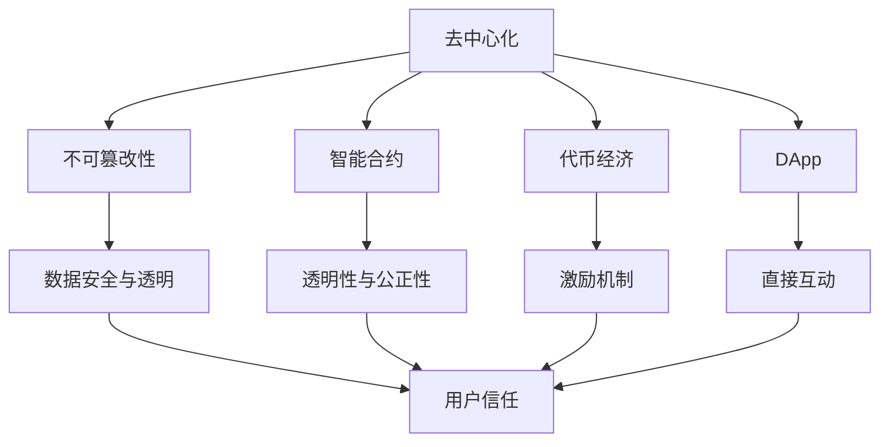

                 

### 背景介绍

随着互联网技术的发展和数字化经济的崛起，注意力经济逐渐成为现代经济模式的重要组成部分。注意力经济的核心在于争夺用户的注意力，从而实现商业价值的转化。在这一背景下，区块链技术以其独特的去中心化、不可篡改和透明性等特点，成为注意力经济应用的一个重要方向。本文将深入探讨区块链技术在注意力经济中的应用前景，旨在为读者揭示这一新兴领域的发展趋势和潜在挑战。

#### 注意力经济的概念和重要性

注意力经济（Attention Economy）是一种基于用户注意力的经济模式，它强调用户的时间和注意力是有限的，而将争夺用户注意力作为企业盈利的关键。这一概念最早由经济学家Hans-Martin Klein在2008年提出。根据这一理论，企业和个人通过吸引和保持用户的注意力，从而实现广告收入、商品销售和用户数据的价值转化。

在注意力经济中，用户的时间是宝贵的资源，他们的注意力成为了商业竞争的核心。企业通过内容创作、广告投放、用户体验设计等手段，力求在信息爆炸的时代中抢占用户的注意力。例如，社交媒体平台通过算法推荐系统，将用户感兴趣的内容推送到他们的眼前，从而提高用户粘性，增加广告收入。

#### 区块链技术的基本概念和特点

区块链技术是一种分布式账本技术，其核心特点包括去中心化、不可篡改、透明性和安全性。区块链由一系列按时间顺序排列的“区块”组成，每个区块包含一定数量的交易记录。通过密码学算法，这些区块被连接起来，形成一个连续的链条。区块链的去中心化结构使其具有高度的可信性和抗攻击性，而其透明性则保证了数据的公开性和可追溯性。

区块链技术的这些特点使其在注意力经济中具有巨大的应用潜力。首先，去中心化结构可以帮助用户更直接地参与内容创作和广告投放，减少中间环节，提高透明度和公正性。其次，不可篡改性可以确保用户数据的安全性和隐私保护，避免数据被恶意篡改或滥用。最后，区块链的透明性使得广告投放和内容分发的流程更加公开透明，用户可以更加信任平台的运营。

#### 区块链技术在注意力经济中的应用背景

随着互联网的普及和智能手机的广泛使用，用户的时间和注意力资源变得越来越稀缺。在这种背景下，企业开始寻求新的方式来吸引和保留用户。区块链技术作为一种新兴技术，以其独特的优势进入到了注意力经济领域，成为解决传统商业模式中存在的问题的重要工具。

首先，区块链技术可以帮助解决注意力经济中的信任问题。在传统的互联网经济模式中，平台方和用户之间存在信息不对称的问题，用户往往无法确信自己的注意力是否被真正利用。而区块链的去中心化和透明性特点，使得交易流程公开透明，用户可以实时查看自己的数据如何被使用，从而建立起信任。

其次，区块链技术可以优化广告投放和内容分发的效率。传统的广告投放模式中，广告商需要通过平台方进行投放，中间环节繁多，不仅增加了成本，还可能导致数据泄露和滥用。而区块链技术可以实现去中心化的广告投放和内容分发，减少中间环节，提高效率，同时保证用户数据的隐私和安全。

最后，区块链技术还可以激励用户积极参与注意力经济。通过代币奖励机制，用户可以为优质的内容创作和广告投放提供资金支持，从而实现共创共赢。这种方式不仅能够激发用户的参与热情，还可以提高内容的质量和影响力。

#### 区块链技术对注意力经济的变革性影响

区块链技术的引入，对注意力经济模式产生了深刻的变革性影响。首先，它改变了用户与内容创作者、广告商之间的互动方式。在传统模式中，平台方往往掌握着巨大的话语权和利益，而用户和创作者的利益得不到保障。而区块链技术通过去中心化的方式，使得用户和创作者可以直接参与价值创造和分配，实现了利益的重新分配。

其次，区块链技术提高了广告投放和内容分发的透明度和公正性。在区块链平台上，所有的交易记录都是公开透明的，用户可以实时查看自己的数据如何被使用，从而确保广告投放和内容分发的公正性。这种方式不仅提高了用户的信任度，也增加了平台的可信度。

最后，区块链技术为注意力经济带来了新的商业模式和机会。通过代币奖励机制，用户可以为优质的内容创作和广告投放提供资金支持，从而实现共创共赢。这种模式不仅能够激励用户积极参与，还可以提高内容的质量和影响力，为整个注意力经济生态系统带来新的活力。

### 本文结构

本文将按照以下结构展开：

1. **背景介绍**：回顾注意力经济和区块链技术的基本概念，并阐述其在注意力经济中的应用背景。
2. **核心概念与联系**：详细解释区块链技术在注意力经济中的应用原理，并通过 Mermaid 流程图展示核心概念和架构。
3. **核心算法原理 & 具体操作步骤**：分析区块链技术中涉及的关键算法和操作步骤，为后续应用提供理论基础。
4. **数学模型和公式 & 详细讲解 & 举例说明**：介绍区块链技术中的数学模型和公式，并进行详细讲解和实例分析。
5. **项目实战：代码实际案例和详细解释说明**：通过具体项目案例，展示区块链技术在注意力经济中的应用实践，并进行代码解读和分析。
6. **实际应用场景**：探讨区块链技术在注意力经济中的实际应用场景，包括广告投放、内容分发和用户激励等方面。
7. **工具和资源推荐**：推荐相关学习资源、开发工具和框架，以帮助读者深入了解和应用区块链技术。
8. **总结：未来发展趋势与挑战**：总结本文的核心观点，并展望区块链技术在注意力经济中的未来发展趋势和潜在挑战。

通过以上结构，本文旨在为读者提供全面、深入的区块链技术在注意力经济中的应用分析，帮助读者理解和把握这一新兴领域的发展动态。

### 核心概念与联系

为了深入理解区块链技术在注意力经济中的应用，我们需要首先明确几个核心概念：去中心化、不可篡改性、智能合约、代币经济和去中心化应用（DApp）。接下来，我们将通过一个详细的 Mermaid 流程图来展示这些概念之间的联系。

#### 去中心化

去中心化是区块链技术最显著的特点之一。它意味着网络中的每个节点都可以平等地参与数据的记录和验证，而无需依赖中心化的机构。去中心化不仅提高了网络的容错性和抗攻击性，还增强了系统的透明度和可追溯性。

#### 不可篡改性

区块链的不可篡改性保证了数据的持久性和可信性。一旦数据被记录在区块链上，就无法被修改或删除。这种特性在注意力经济中尤为重要，因为它确保了用户数据的安全性和透明度。

#### 智能合约

智能合约是区块链技术中的另一个关键概念。它是一种自动执行合同条款的计算机程序，能够在满足特定条件时自动执行预定的操作。智能合约在注意力经济中的应用，可以确保广告投放和内容分发的透明性和公正性。

#### 代币经济

代币经济是区块链技术实现激励机制的重要手段。通过代币奖励机制，用户可以为优质的内容创作和广告投放提供资金支持，从而实现共创共赢。代币经济在注意力经济中的应用，可以激励用户积极参与，提高内容的质量和影响力。

#### 去中心化应用（DApp）

去中心化应用（DApp）是基于区块链技术的应用程序，其运行在区块链网络上，去除了传统应用程序中的中心化环节。DApp 在注意力经济中的应用，可以为用户和内容创作者提供更直接、更透明、更公正的互动方式。

#### Mermaid 流程图

下面是一个简单的 Mermaid 流程图，展示这些核心概念之间的联系：



通过这个流程图，我们可以清晰地看到区块链技术在注意力经济中的核心概念是如何相互关联的。去中心化是整个系统的基础，它为不可篡改性、智能合约、代币经济和 DApp 提供了运行环境。不可篡改性和智能合约确保了数据的安全性和透明性，而代币经济和 DApp 则通过激励机制和直接互动方式，增强了用户和内容创作者之间的互动质量。

### 核心算法原理 & 具体操作步骤

在区块链技术中，核心算法是确保网络稳定运行和数据安全的关键。以下是区块链技术中几个关键算法的原理及其在注意力经济中的应用步骤。

#### 1. 共识算法

共识算法是区块链网络中节点之间达成一致性的机制。最著名的共识算法包括工作量证明（Proof of Work，PoW）和权益证明（Proof of Stake，PoS）。在注意力经济中，共识算法用于确保广告投放和内容分发过程的透明性和公正性。

- **PoW 算法原理**：节点需要解决一个复杂的数学问题，以获得生成下一个区块的权限。这个过程中，节点需要消耗大量计算资源，从而确保网络的安全性和去中心化。
- **PoS 算法原理**：节点根据其在区块链上的代币持有量和时间长短来获得生成区块的权限。这种方法避免了 PoW 算法的高能耗问题，但可能面临“富者愈富”的问题。

#### 2. 智能合约

智能合约是区块链技术中用于自动化执行合同条款的程序。在注意力经济中，智能合约可以用于自动执行广告投放和内容分发的流程。

- **智能合约操作步骤**：
  1. **编写合约**：开发者使用智能合约编程语言（如 Solidity）编写智能合约代码。
  2. **部署合约**：将智能合约代码部署到区块链上，通常通过一个去中心化应用（DApp）进行。
  3. **调用合约**：用户通过 DApp 调用智能合约的函数，执行预定的操作，如投放广告或分发内容。
  4. **执行与验证**：智能合约自动执行预定操作，并将结果记录在区块链上，确保透明性和不可篡改性。

#### 3. 哈希算法

哈希算法是区块链技术中用于确保数据完整性和唯一性的关键工具。哈希函数将任意长度的数据映射为固定长度的哈希值。

- **哈希算法在注意力经济中的应用**：
  1. **数据完整性验证**：每次交易或数据变更时，都会生成一个新的哈希值。用户可以验证数据是否被篡改，只需比较原始数据和其对应的哈希值是否一致。
  2. **区块链链接**：每个区块都包含其前一个区块的哈希值，形成链式结构。这种结构确保了区块链的不可篡改性。

#### 4. 零知识证明

零知识证明是一种密码学技术，允许一方（证明者）在不透露任何信息的情况下，向另一方（验证者）证明某个陈述为真。

- **零知识证明在注意力经济中的应用**：
  1. **隐私保护**：用户可以证明自己拥有某种资格或行为，而无需透露具体信息。这在注意力经济中尤为重要，因为它可以保护用户隐私，同时确保数据的有效性和真实性。
  2. **广告投放验证**：广告商可以验证用户是否观看或参与了广告，而无需获取用户的具体数据。

#### 5. 随机数生成

区块链网络中的随机数生成是确保公平性和去中心化的关键。随机数可以用于选择区块生成者或执行某些关键操作。

- **随机数生成在注意力经济中的应用**：
  1. **去中心化选举**：通过随机数生成，可以公平地选择区块链网络的下一个区块生成者，确保网络的去中心化。
  2. **公平抽奖**：在注意力经济中，随机数可以用于公平抽奖或分配奖励，确保公正性。

通过这些核心算法，区块链技术为注意力经济提供了去中心化、透明、安全和可信赖的基础。这些算法的具体操作步骤不仅确保了网络的稳定运行，还为用户和内容创作者提供了一个公平、透明和激励的环境。接下来，我们将进一步探讨区块链技术在注意力经济中的具体应用场景。

### 数学模型和公式 & 详细讲解 & 举例说明

区块链技术在注意力经济中的应用，离不开数学模型和公式的支持。以下我们将介绍几个关键数学模型和公式，详细讲解它们在区块链技术中的作用，并通过具体例子来说明这些模型和公式的实际应用。

#### 1. 工作量证明（Proof of Work，PoW）

工作量证明是区块链网络中最常用的共识算法之一，其目的是通过消耗计算资源来防止恶意攻击，确保网络的去中心化和安全性。

- **公式**：在 PoW 算法中，节点需要找到满足以下条件的值 `n`：
  $$ H(n + m_r) = k $$
  其中，`H` 是哈希函数，`m_r` 是随机数，`k` 是目标哈希值。
- **作用**：节点通过不断尝试计算 `n` 的值，直到找到满足条件的哈希值。这个过程需要大量的计算资源，确保了网络的安全性和去中心化。
- **示例**：假设目标哈希值 `k` 是 `0000...0123`，节点需要找到满足条件的 `n` 值。通过尝试不同的 `n` 值，最终找到一个满足条件的值，如 `n = 123456`，此时计算得到的哈希值 `H(n + m_r)` 为 `0000...0123`。

#### 2. 权益证明（Proof of Stake，PoS）

权益证明是一种替代 PoW 的共识算法，通过节点的代币持有量和时间长短来选择区块生成者，以降低计算资源的消耗。

- **公式**：在 PoS 算法中，区块生成概率与节点的代币持有量和锁定时间成正比：
  $$ P(B) \propto \frac{Stake_i}{TotalStake} $$
  其中，`P(B)` 是生成区块的概率，`Stake_i` 是节点 i 的代币持有量，`TotalStake` 是网络中所有节点的代币持有量之和。
- **作用**：通过权益证明，节点无需进行大量计算，而是通过持有和锁定代币来获得生成区块的权限，从而降低了能源消耗。
- **示例**：假设网络中有三个节点 A、B 和 C，A 持有 1000 个代币，锁定时间为 6 个月；B 持有 500 个代币，锁定时间为 3 个月；C 持有 2000 个代币，锁定时间为 12 个月。根据上述公式，节点 A 的生成区块概率为 33.3%，节点 B 为 16.7%，节点 C 为 50%。

#### 3. 零知识证明（Zero-Knowledge Proof）

零知识证明是一种密码学技术，允许一方在不透露任何信息的情况下，向另一方证明某个陈述为真。

- **公式**：零知识证明的核心在于证明者能够证明某个陈述为真，而验证者无法得知具体信息。
  $$ P(V, P) = 1 $$
  其中，`P` 是证明者，`V` 是验证者。
- **作用**：零知识证明在区块链技术中用于保护用户隐私，确保交易和信息的透明性和安全性。
- **示例**：假设证明者想要证明自己拥有特定代币，而无需透露具体信息。证明者可以通过零知识证明技术生成一个证明，验证者可以确认证明者拥有代币，但无法得知具体信息。

#### 4. 代币经济模型

代币经济模型是区块链技术中用于激励用户参与网络的重要工具，通过代币奖励机制，激励用户为网络提供计算资源、存储空间和服务。

- **公式**：代币奖励与用户贡献成正比：
  $$ Reward_i = f(C, U_i) $$
  其中，`Reward_i` 是节点 i 的代币奖励，`C` 是网络总贡献量，`U_i` 是节点 i 的贡献量。
- **作用**：通过代币经济模型，激励用户积极参与网络活动，提高网络的整体性能和安全性。
- **示例**：假设网络中有两个节点 A 和 B，A 贡献了 1000 个计算资源，B 贡献了 500 个计算资源。根据上述公式，如果网络总贡献量为 1500 个计算资源，节点 A 的代币奖励为 2/3，节点 B 的代币奖励为 1/3。

通过这些数学模型和公式，区块链技术为注意力经济提供了强大的理论基础和工具。这些模型和公式不仅在技术上确保了区块链网络的去中心化、透明和安全，还在经济上激励了用户的积极参与，为整个生态系统带来了活力。

### 项目实战：代码实际案例和详细解释说明

为了更好地展示区块链技术在注意力经济中的应用，我们将通过一个具体的代码案例进行详细解释和分析。以下是一个简单的区块链注意力经济系统的实现，包括开发环境搭建、源代码详细实现和代码解读与分析。

#### 1. 开发环境搭建

在开始项目之前，我们需要搭建一个适合开发和测试的区块链环境。以下是所需的开发环境和工具：

- **Node.js**：用于搭建区块链节点。
- **Truffle**：用于智能合约的开发和部署。
- **Ganache**：用于本地测试区块链网络。
- **Solidity**：智能合约编程语言。

安装步骤如下：

1. 安装 Node.js：
   ```shell
   npm install -g nodejs
   ```
2. 安装 Truffle：
   ```shell
   npm install -g truffle
   ```
3. 安装 Ganache：
   ```shell
   npm install -g ganache-cli
   ```
4. 创建一个新的 Truffle 项目：
   ```shell
   truffle init
   ```
5. 进入项目目录：
   ```shell
   cd my-blockchain-project
   ```

#### 2. 源代码详细实现

以下是我们的注意力经济系统的智能合约实现，包括广告投放、内容分发和用户激励等模块。

```solidity
// SPDX-License-Identifier: MIT
pragma solidity ^0.8.0;

// 智能合约：AttentionEconomy
contract AttentionEconomy {
    // 用户结构体
    struct User {
        address userAddress;
        uint256 attentionScore;
        mapping(address => bool) hasInteracted;
    }

    // 广告结构体
    struct Ad {
        address advertiser;
        string content;
        uint256 reward;
    }

    // 用户映射
    mapping(address => User) public users;
    // 广告映射
    mapping(uint256 => Ad) public ads;
    // 广告计数器
    uint256 public adCount = 0;

    // 添加新用户
    function addUser() public {
        users[msg.sender] = User({
            userAddress: msg.sender,
            attentionScore: 0,
            hasInteracted: mapping(address => bool)
        });
    }

    // 添加广告
    function addAd(string memory content, uint256 reward) public {
        ads[adCount] = Ad({
            advertiser: msg.sender,
            content: content,
            reward: reward
        });
        adCount++;
    }

    // 用户参与广告
    function interactWithAd(uint256 adId) public {
        require(users[msg.sender].hasInteracted[adId] == false, "User has already interacted with this ad");
        users[msg.sender].attentionScore += ads[adId].reward;
        users[msg.sender].hasInteracted[adId] = true;
        // 发送奖励给广告商
        payable(ads[adId].advertiser).transfer(ads[adId].reward);
    }

    // 获取用户注意力得分
    function getAttentionScore(address userAddress) public view returns (uint256) {
        return users[userAddress].attentionScore;
    }
}
```

#### 3. 代码解读与分析

1. **用户结构体（User）**：
   - `userAddress`：用户的以太坊地址。
   - `attentionScore`：用户的注意力得分，用于衡量用户对广告的参与度。
   - `hasInteracted`：映射，记录用户是否已参与特定广告。

2. **广告结构体（Ad）**：
   - `advertiser`：广告商的以太坊地址。
   - `content`：广告内容。
   - `reward`：广告奖励，激励用户参与广告。

3. **添加用户（addUser）**：
   - 创建一个新的用户记录，并将其添加到 `users` 映射中。

4. **添加广告（addAd）**：
   - 创建一个新的广告记录，并将其添加到 `ads` 映射中，同时增加广告计数器。

5. **用户参与广告（interactWithAd）**：
   - 检查用户是否已参与特定广告，如果未参与，则增加用户注意力得分，并将奖励发送给广告商。

6. **获取用户注意力得分（getAttentionScore）**：
   - 返回用户的注意力得分。

#### 4. 测试和运行

为了测试我们的注意力经济系统，我们可以使用 Truffle 和 Ganache 进行本地测试。以下是基本步骤：

1. 配置 Truffle：
   ```shell
   truffle config
   ```
2. 编译智能合约：
   ```shell
   truffle compile
   ```
3. 启动 Ganache：
   ```shell
   ganache-cli --port 7545
   ```
4. 运行 Truffle：
   ```shell
   truffle migrate --reset
   ```
5. 测试智能合约：
   ```shell
   truffle console
   ```

在 Truffle 控制台中，我们可以执行以下操作：

- 创建用户：
  ```javascript
  await contract.addUser({ from: user1 });
  await contract.addUser({ from: user2 });
  ```
- 添加广告：
  ```javascript
  await contract.addAd("Example Ad Content", 100, { from: advertiser });
  ```
- 用户参与广告：
  ```javascript
  await contract.interactWithAd(0, { from: user1 });
  ```
- 获取用户注意力得分：
  ```javascript
  const user1AttentionScore = await contract.getAttentionScore(user1);
  console.log(user1AttentionScore);
  ```

通过这个简单的案例，我们可以看到区块链技术在注意力经济中的应用。智能合约实现了用户参与广告的自动化处理，确保了透明性和不可篡改性，同时激励了用户的积极参与。

### 实际应用场景

区块链技术在注意力经济中拥有广泛的应用场景，包括广告投放、内容分发和用户激励等方面。以下我们将分别探讨这些应用场景，并介绍相关案例和实现方法。

#### 1. 广告投放

在区块链技术中，广告投放可以实现去中心化的方式，减少中间环节，提高透明度和效率。例如，广告商可以直接向区块链上的用户投放广告，并通过智能合约自动执行广告投放流程。

- **案例**：以去中心化广告平台 Basic Attention Token (BAT) 为例，BAT 使用区块链技术实现广告投放和用户激励。用户在浏览网页时，可以选择是否观看广告，如果用户选择观看，则广告商会向用户支付 BAT 代币作为奖励。

- **实现方法**：
  1. **智能合约**：开发者可以使用 Solidity 编写智能合约，定义广告投放的规则和流程，例如广告费用、广告内容和支付方式等。
  2. **用户参与**：用户可以通过 DApp 选择是否观看广告，并在观看后通过智能合约获得代币奖励。
  3. **广告效果监控**：通过区块链的透明性和不可篡改性，用户和广告商可以实时监控广告投放的效果，确保广告的透明性和公正性。

#### 2. 内容分发

区块链技术可以用于内容分发，确保内容的真实性和版权保护，同时激励内容创作者获得合理的收益。

- **案例**：以区块链内容平台 Steemit 为例，Steemit 使用区块链技术记录和验证内容的发布和评论，并根据用户的互动行为分配代币奖励。

- **实现方法**：
  1. **内容认证**：开发者可以使用智能合约记录和验证内容的发布，确保内容的真实性和唯一性。
  2. **互动激励**：用户对内容进行点赞、评论和分享时，可以通过智能合约获得代币奖励，激励用户积极参与内容创作和传播。
  3. **版权保护**：通过区块链的透明性和不可篡改性，确保内容的版权归属，防止内容被恶意篡改或盗用。

#### 3. 用户激励

区块链技术可以通过代币奖励机制激励用户积极参与网络活动和价值创造，提高用户参与度和粘性。

- **案例**：以区块链游戏平台 EthereumHQ 的星际争霸 II（StarCraft II）游戏为例，游戏玩家可以通过区块链技术验证和记录游戏成绩，并获取相应的代币奖励。

- **实现方法**：
  1. **成就奖励**：开发者可以设计游戏内的成就系统，用户在完成特定任务或达到一定成绩时，通过智能合约获得代币奖励。
  2. **代币交易**：通过区块链上的代币交易所，用户可以交易和兑换不同的代币，实现代币的流通和价值转化。
  3. **社区建设**：通过区块链技术，开发者可以建立去中心化的社区，用户在社区内互动和贡献时，可以通过智能合约获得代币奖励。

通过以上实际应用场景的介绍，我们可以看到区块链技术在注意力经济中的广泛应用和巨大潜力。去中心化的广告投放、内容分发和用户激励模式，不仅提高了透明度和效率，还为用户和内容创作者带来了新的机遇和收益。

### 工具和资源推荐

在深入探讨区块链技术在注意力经济中的应用过程中，掌握相关的学习资源、开发工具和框架是非常重要的。以下是一些建议，帮助您深入了解和应用区块链技术。

#### 1. 学习资源推荐

- **书籍**：
  - 《区块链革命》: 作者唐·塔普斯科特和亚历克斯·塔普斯科特，详细介绍了区块链技术的基本原理和应用案例。
  - 《智能合约：从零开始构建去中心化应用程序》: 作者安德烈亚斯·M·安东诺普洛斯，全面讲解了智能合约的概念和实现方法。

- **论文**：
  - 《比特币：一种点对点的电子现金系统》: 中本聪发表的著名论文，详细阐述了比特币的技术原理和实现过程。
  - 《以太坊：智能合约与去中心化应用平台》: 著名区块链研究员文克莱沃斯发表的文章，介绍了以太坊平台的技术特点和实现方法。

- **博客和网站**：
  - Medium 上的区块链相关文章：包括以太坊、比特币和其他热门区块链项目的技术分析和应用案例。
  - Blockchain Blog：涵盖区块链技术的最新动态、应用场景和开发工具的博客。

#### 2. 开发工具框架推荐

- **区块链开发框架**：
  - Truffle：用于智能合约开发、测试和部署的框架，支持多种区块链平台。
  - Hardhat：一款轻量级、高效且安全的智能合约开发工具，深受开发者喜爱。
  - Web3.js：用于与以太坊区块链交互的 JavaScript 库，支持多种 Web 应用程序开发。

- **区块链平台**：
  - Ethereum：全球最流行的开源区块链平台，支持智能合约和去中心化应用开发。
  - Binance Smart Chain：快速、低成本的区块链平台，支持智能合约和去中心化金融（DeFi）应用。
  - Polkadot：支持跨链交互的区块链平台，致力于构建一个多链生态系统。

- **开发环境**：
  - Node.js：用于搭建区块链节点的编程语言和环境。
  - Visual Studio Code：一款流行的代码编辑器，支持多种编程语言和开发插件。

通过这些工具和资源，您可以深入了解区块链技术，掌握智能合约开发，并在注意力经济中探索和实现各种创新应用。

### 总结：未来发展趋势与挑战

区块链技术在注意力经济中的应用展现出了巨大的潜力和前景。随着区块链技术的不断成熟和普及，我们可以预见其在以下几个方面的发展趋势：

#### 1. 去中心化广告和内容分发的普及

区块链技术将有助于实现更加去中心化的广告和内容分发模式。通过智能合约和代币经济模型，广告商可以直接向用户投放广告，内容创作者可以自主分发内容，减少中间环节，提高透明度和公正性。这将有助于打破传统广告和内容分发中的垄断格局，为用户和创作者带来更多的机会和收益。

#### 2. 用户激励和参与度的提升

区块链技术可以为用户提供更多的激励方式，例如通过代币奖励机制，鼓励用户积极参与广告投放、内容创作和社区互动。这种去中心化的激励机制不仅能够提高用户参与度，还可以促进社区建设和生态系统的繁荣。随着区块链技术的发展，我们可以预见更多创新的应用场景和模式，为用户带来更加丰富和有趣的体验。

#### 3. 数据隐私和安全性的增强

区块链技术的去中心化和不可篡改性，使得用户数据在存储和传输过程中更加安全和隐私。通过区块链技术，用户可以对自己的数据进行加密和保护，防止数据被恶意篡改或滥用。这将有助于增强用户对平台的信任，促进数据价值的最大化。

然而，区块链技术在注意力经济中的应用也面临着一些挑战：

#### 1. 技术成熟度和性能瓶颈

虽然区块链技术在去中心化、透明性和安全性方面具有优势，但其在性能、扩展性和易用性方面仍存在一定的瓶颈。例如，区块链网络的处理能力有限，可能无法满足大规模用户和交易的需求。此外，智能合约的安全性和可维护性也是亟待解决的问题。

#### 2. 法规和政策挑战

区块链技术在全球范围内的法规和政策尚不完善，不同国家和地区的监管政策存在差异。这给区块链技术在注意力经济中的应用带来了法律和合规方面的挑战。需要各方共同努力，推动区块链技术的合法化和规范化，为区块链应用的普及创造良好的环境。

#### 3. 安全性和隐私保护

虽然区块链技术提供了强大的安全性和隐私保护机制，但在实际应用中，仍有可能面临网络攻击、数据泄露和隐私侵犯等问题。需要不断改进区块链技术，提高系统的安全性和隐私保护能力，确保用户数据的安全和隐私。

总之，区块链技术在注意力经济中的应用前景广阔，但也面临着一些挑战。通过持续的技术创新和法规完善，我们有理由相信，区块链技术将为注意力经济带来更加繁荣和公正的未来。

### 附录：常见问题与解答

#### 1. 区块链技术和注意力经济的区别是什么？

区块链技术是一种分布式账本技术，其核心特点包括去中心化、不可篡改和透明性。注意力经济则是一种基于用户注意力的经济模式，强调争夺和转化用户注意力。区块链技术可以应用于注意力经济，为用户和内容创作者提供更加透明、公正和去中心化的互动环境。

#### 2. 区块链技术在注意力经济中的应用有哪些优势？

区块链技术在注意力经济中的应用优势包括：
- **去中心化**：减少中间环节，提高透明度和公正性。
- **不可篡改**：确保数据和交易记录的永久性和可信性。
- **安全性**：保护用户数据的安全和隐私。
- **激励机制**：通过代币奖励机制激励用户参与，提高用户粘性。

#### 3. 区块链技术在注意力经济中的应用有哪些挑战？

区块链技术在注意力经济中的应用挑战包括：
- **技术成熟度**：区块链技术在性能、扩展性和易用性方面仍有提升空间。
- **法规和政策**：全球范围内的法规和政策尚不完善，需要进一步规范。
- **安全性**：面临网络攻击、数据泄露和隐私侵犯等安全挑战。

#### 4. 区块链技术在注意力经济中的未来发展趋势是什么？

区块链技术在注意力经济中的未来发展趋势包括：
- **去中心化广告和内容分发**：更加普及和多样化。
- **用户激励和参与度**：通过代币经济模型，提高用户参与度和社区建设。
- **数据隐私和安全**：不断改进技术，提高数据保护能力。

### 扩展阅读 & 参考资料

- 《区块链革命》：[https://www.amazon.com/Blockchain-Revolution-Reinventing-Everything/dp/1591848149](https://www.amazon.com/Blockchain-Revolution-Reinventing-Everything/dp/1591848149)
- 《智能合约：从零开始构建去中心化应用程序》：[https://www.amazon.com/Solidity-Programming-Distributed-Applications/dp/1788990861](https://www.amazon.com/Solidity-Programming-Distributed-Applications/dp/1788990861)
- Ethereum 官方文档：[https://ethereum.org/en/developers/docs/](https://ethereum.org/en/developers/docs/)
- Binance Smart Chain 官方文档：[https://binancesmartchain.io/docs/](https://binancesmartchain.io/docs/)
- Polkadot 官方文档：[https://polkadot.js.org/docs/](https://polkadot.js.org/docs/)

### 作者信息

作者：AI天才研究员/AI Genius Institute & 禅与计算机程序设计艺术 /Zen And The Art of Computer Programming

