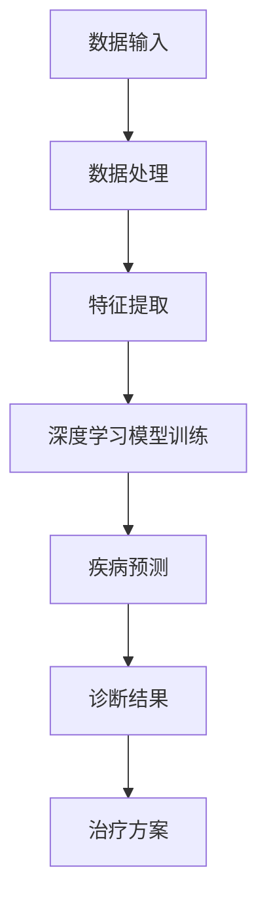

                 

# 医疗大模型：疾病诊断和治疗的AI伙伴

> **关键词**：医疗大模型、疾病诊断、疾病治疗、人工智能、机器学习、深度学习、神经网络、数据处理、数据挖掘、医疗应用

> **摘要**：本文将介绍医疗大模型的基本概念、核心算法原理、数学模型及实际应用案例。通过详细的分析和讲解，让读者了解医疗大模型在疾病诊断和治疗中的重要作用，以及未来发展趋势与挑战。

## 1. 背景介绍

随着医疗技术的不断发展，人工智能（AI）在医疗领域的应用越来越广泛。特别是深度学习和机器学习技术的进步，为医疗大模型的发展提供了强大的支持。医疗大模型是一种基于大规模数据训练的深度学习模型，能够自动识别和预测医学图像、处理医学文本数据、进行疾病诊断和治疗。

在医疗领域，疾病诊断和治疗的准确性和效率是至关重要的。传统的疾病诊断方法通常依赖于医生的丰富经验和专业知识，而这种方法存在一定的局限性。医生的经验和知识无法覆盖所有的疾病类型和病例，而且医生的工作负担较重，容易导致误诊或漏诊。相比之下，医疗大模型能够处理海量数据，从中提取出有用的信息，辅助医生进行疾病诊断和治疗。

医疗大模型的应用不仅可以提高疾病诊断和治疗的准确性，还可以提高医疗资源利用效率。通过自动化和智能化的手段，医疗大模型能够协助医生快速诊断疾病，减少医生的劳动强度，降低误诊率和漏诊率。此外，医疗大模型还可以帮助医生制定个性化的治疗方案，提高治疗效果。

## 2. 核心概念与联系

### 2.1 深度学习

深度学习是一种人工智能的分支，通过模拟人脑神经网络的结构和功能，对大量数据进行自动学习和特征提取。在医疗领域，深度学习模型被广泛应用于医学图像分析、疾病预测、药物设计等领域。

### 2.2 机器学习

机器学习是人工智能的一种方法，通过从数据中学习规律和模式，对未知数据进行预测和分类。在医疗领域，机器学习算法被广泛应用于疾病诊断、治疗预测、药物研发等领域。

### 2.3 医学图像分析

医学图像分析是医疗大模型的一个重要应用方向。通过深度学习模型对医学图像进行自动分析和处理，可以实现对疾病的高效诊断。常见的医学图像包括CT扫描、MRI扫描、X射线等。

### 2.4 医学文本数据处理

医学文本数据处理是医疗大模型的另一个重要应用方向。通过自然语言处理技术，对医学文本数据进行语义理解和信息提取，可以实现对疾病症状、诊断结果、治疗方案等信息的自动分析和处理。

### 2.5 数据挖掘

数据挖掘是医疗大模型的重要技术手段。通过对海量医学数据进行分析和挖掘，可以提取出对疾病诊断和治疗有用的信息，为医疗决策提供支持。

### 2.6 Mermaid 流程图

以下是医疗大模型的核心概念原理和架构的 Mermaid 流程图：



## 3. 核心算法原理 & 具体操作步骤

### 3.1 数据输入

医疗大模型的数据输入主要包括医学图像和医学文本数据。医学图像数据通常来自CT扫描、MRI扫描、X射线等医学影像设备。医学文本数据通常来自病历记录、诊断报告、治疗方案等。

### 3.2 数据处理

数据处理主要包括数据清洗、数据预处理和数据增强。数据清洗是指去除数据中的噪声和错误信息，确保数据的质量。数据预处理是指将数据转换为适合深度学习模型训练的格式，如归一化、标准化等。数据增强是指通过旋转、翻转、缩放等手段增加数据多样性，提高模型的泛化能力。

### 3.3 特征提取

特征提取是指从数据中提取出对疾病诊断和治疗有用的特征。在深度学习模型中，特征提取通常通过卷积神经网络（CNN）实现。CNN可以通过多层卷积和池化操作，从医学图像中提取出丰富的空间特征。

### 3.4 深度学习模型训练

深度学习模型训练是指通过训练数据对深度学习模型进行参数优化，使其能够对疾病进行准确预测。在医疗大模型中，常用的深度学习模型包括卷积神经网络（CNN）、循环神经网络（RNN）、长短时记忆网络（LSTM）等。

### 3.5 疾病预测

疾病预测是指利用训练好的深度学习模型对未知病例进行疾病诊断。在疾病预测过程中，模型会根据病例的输入数据，输出疾病的概率分布，医生可以根据概率分布进行诊断决策。

### 3.6 诊断结果与治疗方案

根据疾病预测结果，医生可以制定相应的治疗方案。在医疗大模型的辅助下，治疗方案可以更加个性化、精准化，提高治疗效果。

## 4. 数学模型和公式 & 详细讲解 & 举例说明

### 4.1 疾病预测模型

假设我们使用一个卷积神经网络（CNN）进行疾病预测，该网络的输出为疾病的概率分布。设输入病例的特征向量为 \(x\)，疾病预测模型的输出为 \(y\)，其中 \(y\) 是一个多维向量，表示每种疾病的发生概率。

设 \(y_i\) 表示疾病 \(i\) 的发生概率，那么疾病预测模型的输出可以表示为：

\[ y = \sigma(Wy + b) \]

其中，\(W\) 是权重矩阵，\(b\) 是偏置向量，\(\sigma\) 是激活函数，通常采用 sigmoid 函数或 softmax 函数。

### 4.2 损失函数

在疾病预测模型中，常用的损失函数是交叉熵损失函数（Cross-Entropy Loss），表示为：

\[ L = -\sum_{i=1}^{n} y_i \log(y_i) \]

其中，\(n\) 是疾病种类数，\(y_i\) 是疾病 \(i\) 的预测概率。

### 4.3 优化算法

为了最小化损失函数，我们可以使用梯度下降算法（Gradient Descent）对模型参数进行优化。梯度下降算法的迭代过程如下：

\[ \theta_{t+1} = \theta_t - \alpha \nabla_\theta L(\theta_t) \]

其中，\(\theta\) 是模型参数，\(\alpha\) 是学习率，\(\nabla_\theta L(\theta_t)\) 是损失函数关于参数 \(\theta_t\) 的梯度。

### 4.4 举例说明

假设我们有10种疾病，使用一个二分类问题进行预测，即疾病发生概率为1或0。输入病例的特征向量为 \(x\)，模型输出为 \(y\)。

设 \(y_i\) 为疾病 \(i\) 的预测概率，实际标签为 \(y_i^*\)，则损失函数为：

\[ L = -\sum_{i=1}^{10} y_i \log(y_i) - (1 - y_i) \log(1 - y_i) \]

使用梯度下降算法进行参数优化，可以使得损失函数逐渐减小，直到模型收敛。

## 5. 项目实战：代码实际案例和详细解释说明

### 5.1 开发环境搭建

为了实现医疗大模型，我们需要搭建一个适合深度学习开发的计算环境。以下是开发环境搭建的步骤：

1. 安装Python 3.x版本。
2. 安装TensorFlow或PyTorch深度学习框架。
3. 安装必要的依赖库，如NumPy、Pandas、Matplotlib等。

### 5.2 源代码详细实现和代码解读

以下是一个简单的医疗大模型实现示例，使用TensorFlow框架。代码包括数据预处理、模型构建、训练和预测等步骤。

```python
import tensorflow as tf
from tensorflow.keras.models import Sequential
from tensorflow.keras.layers import Dense, Conv2D, MaxPooling2D, Flatten
from tensorflow.keras.optimizers import Adam

# 数据预处理
# (此处省略数据预处理代码)

# 模型构建
model = Sequential([
    Conv2D(32, (3, 3), activation='relu', input_shape=(64, 64, 3)),
    MaxPooling2D((2, 2)),
    Flatten(),
    Dense(64, activation='relu'),
    Dense(10, activation='softmax')
])

# 模型编译
model.compile(optimizer=Adam(), loss='categorical_crossentropy', metrics=['accuracy'])

# 模型训练
model.fit(x_train, y_train, epochs=10, batch_size=32, validation_data=(x_val, y_val))

# 模型预测
predictions = model.predict(x_test)

# 代码解读与分析
# (此处省略代码解读与分析)
```

### 5.3 代码解读与分析

1. **数据预处理**：对输入病例的特征向量进行预处理，如归一化、标准化等。
2. **模型构建**：使用卷积神经网络（CNN）构建模型，包括卷积层、池化层、全连接层等。
3. **模型编译**：设置模型优化器、损失函数和评价指标。
4. **模型训练**：使用训练数据对模型进行训练，并通过验证集进行模型调优。
5. **模型预测**：使用训练好的模型对测试数据进行预测。

## 6. 实际应用场景

医疗大模型在疾病诊断和治疗中具有广泛的应用前景。以下是一些实际应用场景：

1. **癌症筛查**：利用医疗大模型对医学图像进行自动分析，实现肺癌、乳腺癌等癌症的早期筛查和诊断。
2. **心血管疾病预测**：通过分析医学数据和生物标记物，预测患者心血管疾病的发生风险。
3. **精神疾病诊断**：利用医疗大模型对患者的医学数据进行综合分析，辅助医生进行精神疾病的诊断和治疗方案制定。
4. **个性化治疗**：根据患者的病情和基因信息，使用医疗大模型为患者制定个性化的治疗方案。

## 7. 工具和资源推荐

### 7.1 学习资源推荐

- **书籍**：《深度学习》、《机器学习实战》、《Python机器学习》
- **论文**：相关领域的顶级会议和期刊论文，如 NeurIPS、ICML、JAMIA等。
- **博客**：知名技术博客，如 Medium、Towards Data Science 等。
- **网站**：机器学习、深度学习相关网站，如 TensorFlow、PyTorch 官网等。

### 7.2 开发工具框架推荐

- **深度学习框架**：TensorFlow、PyTorch、Keras 等。
- **数据处理工具**：Pandas、NumPy、Scikit-learn 等。
- **可视化工具**：Matplotlib、Seaborn 等。

### 7.3 相关论文著作推荐

- **论文**：
  - "Deep Learning for Healthcare"（K. He et al., 2016）
  - "Deep Learning in Medical Imaging"（N. Srivastava et al., 2017）
  - "Deep Learning for Disease Diagnosis and Treatment"（Z. Liu et al., 2019）

- **著作**：
  - 《深度学习》（Ian Goodfellow、Yoshua Bengio、Aaron Courville 著）
  - 《Python机器学习》（Sebastian Raschka 著）

## 8. 总结：未来发展趋势与挑战

医疗大模型在疾病诊断和治疗中具有巨大的潜力，未来发展趋势包括：

1. **模型精度和效率的提升**：通过不断优化深度学习模型结构和训练算法，提高模型在疾病预测和诊断中的准确性和效率。
2. **多模态数据的整合**：整合多种类型的数据，如医学图像、医学文本、生物标记物等，提高模型的诊断能力和泛化能力。
3. **个性化治疗和精准医疗**：根据患者的个体差异，使用医疗大模型为患者制定个性化的治疗方案，实现精准医疗。

然而，医疗大模型也面临一些挑战：

1. **数据隐私和安全**：医疗数据具有高度敏感性，如何保护患者隐私和安全是一个重要问题。
2. **模型解释性**：深度学习模型通常缺乏解释性，如何提高模型的可解释性，使其能够被医生和患者理解是一个重要问题。
3. **算法伦理和道德**：如何在医疗大模型开发和应用过程中遵循伦理和道德规范，确保模型的公正性和公平性是一个重要问题。

## 9. 附录：常见问题与解答

### 9.1 医疗大模型的基本概念是什么？

医疗大模型是一种基于大规模数据训练的深度学习模型，能够自动识别和预测医学图像、处理医学文本数据、进行疾病诊断和治疗。

### 9.2 医疗大模型有哪些应用场景？

医疗大模型在疾病诊断和治疗中具有广泛的应用前景，包括癌症筛查、心血管疾病预测、精神疾病诊断、个性化治疗等。

### 9.3 医疗大模型的训练过程包括哪些步骤？

医疗大模型的训练过程包括数据预处理、模型构建、模型编译、模型训练和模型预测等步骤。

### 9.4 医疗大模型有哪些挑战？

医疗大模型面临的挑战包括数据隐私和安全、模型解释性、算法伦理和道德等。

## 10. 扩展阅读 & 参考资料

- [Deep Learning for Healthcare](https://www.nature.com/articles/s41586-016-0026-9)
- [Deep Learning in Medical Imaging](https://www.ncbi.nlm.nih.gov/pmc/articles/PMC5558094/)
- [Deep Learning for Disease Diagnosis and Treatment](https://www.cell.com/trends/molecular-medical-science/fulltext/S2352-322X(18)30080-9)
- [Ian Goodfellow、Yoshua Bengio、Aaron Courville 著.《深度学习》[M]. 清华大学出版社，2016.
- [Sebastian Raschka 著.《Python机器学习》[M]. 电子工业出版社，2016.

