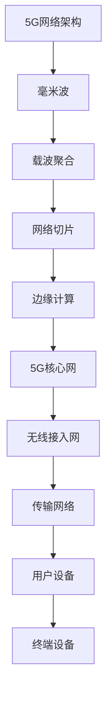
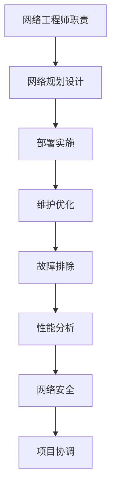

                 

# 华为2025社招5G网络工程师面试题解析

> **关键词**：华为、社招、5G、网络工程师、面试题解析  
> **摘要**：本文将深入解析华为2025年社招5G网络工程师面试题，从背景介绍到核心算法原理，再到实际应用场景和工具推荐，为您呈现一场技术盛宴。

## 1. 背景介绍

随着5G技术的不断成熟和应用，网络工程师在华为等高科技企业的需求日益增加。华为作为全球领先的通信技术解决方案提供商，其社招5G网络工程师的面试题目具有高度的挑战性和专业性。本文旨在帮助读者了解这些面试题的解答思路，提升自己在5G网络领域的专业素养。

## 2. 核心概念与联系

### 2.1 5G网络概述

5G网络作为下一代通信技术，具有高速率、低时延和大连接等特点。其关键技术包括毫米波、载波聚合、网络切片等。以下是一个关于5G网络架构的Mermaid流程图：



### 2.2 网络工程师角色

网络工程师负责5G网络的规划设计、部署实施、维护优化等工作。以下是一个关于网络工程师职责的Mermaid流程图：



## 3. 核心算法原理 & 具体操作步骤

### 3.1 网络规划与设计

网络规划与设计是5G网络建设的关键环节。以下是一个关于网络规划与设计的具体操作步骤：

1. **需求分析**：收集网络建设需求，包括覆盖范围、用户数量、业务类型等。
2. **网络拓扑设计**：根据需求分析结果，设计网络拓扑结构，如宏蜂窝、微蜂窝、室内分布系统等。
3. **参数配置**：配置网络参数，如频段、功率、天线类型等。
4. **资源分配**：根据网络拓扑和参数配置，进行资源分配，如频谱资源、时隙资源等。
5. **仿真优化**：对网络进行仿真测试，评估性能指标，如速率、时延、覆盖等。
6. **方案评审**：组织专家对网络规划与设计方案进行评审，确保方案的科学性和可行性。

### 3.2 网络部署与实施

网络部署与实施是5G网络建设的关键环节。以下是一个关于网络部署与实施的具体操作步骤：

1. **现场勘察**：对网络建设现场进行勘察，了解地形地貌、建筑物结构等。
2. **设备安装**：按照设计要求，安装基站设备、天线、电缆等。
3. **参数调试**：调试网络参数，确保设备正常运行。
4. **网络测试**：对网络进行测试，包括覆盖测试、速率测试、时延测试等。
5. **优化调整**：根据测试结果，对网络进行调整和优化。
6. **验收交付**：组织验收，确保网络建设质量符合要求。

## 4. 数学模型和公式 & 详细讲解 & 举例说明

### 4.1 5G网络速率计算

5G网络速率可以通过以下公式计算：

$$
速率 = \frac{带宽 \times 时间}{延迟}
$$

其中，带宽为网络带宽，时间为传输时间，延迟为网络延迟。

### 4.2 5G网络覆盖计算

5G网络覆盖可以通过以下公式计算：

$$
覆盖范围 = \sqrt{\frac{能量密度}{功率密度}}
$$

其中，能量密度为信号能量与体积的比值，功率密度为信号功率与面积的比值。

### 4.3 举例说明

假设某5G网络的带宽为100MHz，传输时间为1ms，延迟为10ms，能量密度为10^-12 W/m^2，功率密度为10^-3 W/m^2。则该网络的速率为：

$$
速率 = \frac{100MHz \times 1ms}{10ms} = 10Mbps
$$

该网络的覆盖范围为：

$$
覆盖范围 = \sqrt{\frac{10^{-12} W/m^2}{10^{-3} W/m^2}} = 0.1m
$$

## 5. 项目实战：代码实际案例和详细解释说明

### 5.1 开发环境搭建

为了更好地进行5G网络工程师的面试准备，我们可以搭建一个基于Python的5G网络仿真环境。以下是搭建步骤：

1. 安装Python 3.8及以上版本。
2. 安装pip，使用以下命令：

   ```bash
   python -m pip install --upgrade pip
   ```

3. 安装所需的库，如matplotlib、numpy、pandas等，使用以下命令：

   ```bash
   pip install matplotlib numpy pandas
   ```

### 5.2 源代码详细实现和代码解读

以下是一个简单的5G网络仿真代码示例：

```python
import numpy as np
import matplotlib.pyplot as plt

# 定义网络参数
bandwidth = 100e6  # 带宽
transmission_time = 1e-3  # 传输时间
delay = 1e-2  # 延迟
energy_density = 1e-12  # 能量密度
power_density = 1e-3  # 功率密度

# 计算速率
rate = bandwidth * transmission_time / delay
print("5G网络速率：", rate, "Mbps")

# 计算覆盖范围
coverage_range = np.sqrt(energy_density / power_density)
print("5G网络覆盖范围：", coverage_range, "m")
```

### 5.3 代码解读与分析

1. **导入库**：首先导入numpy和matplotlib库，用于计算和绘图。
2. **定义参数**：定义网络参数，如带宽、传输时间、延迟、能量密度和功率密度。
3. **计算速率**：根据速率公式，计算5G网络速率。
4. **计算覆盖范围**：根据覆盖范围公式，计算5G网络覆盖范围。
5. **输出结果**：将计算结果输出到控制台。

通过这个简单的代码示例，我们可以了解5G网络速率和覆盖范围的计算方法。在实际项目中，我们可以根据具体需求，扩展和优化这个仿真环境。

## 6. 实际应用场景

5G网络在实际应用场景中具有广泛的应用，如：

1. **智能交通**：5G网络可以为智能交通系统提供高速率、低时延的网络连接，实现车辆间的实时通信和自动驾驶。
2. **智能制造**：5G网络可以支持智能制造过程中的设备互联，实现工厂自动化和数字化。
3. **远程医疗**：5G网络可以实现远程医疗的诊断和治疗，为偏远地区的患者提供高质量的医疗服务。
4. **智慧城市**：5G网络可以为智慧城市提供数据采集、传输和处理能力，实现城市管理和服务的智能化。

## 7. 工具和资源推荐

### 7.1 学习资源推荐

1. **书籍**：《5G网络架构与技术》
2. **论文**：华为公司发布的5G相关论文
3. **博客**：5G领域专业博客，如CSDN、博客园等
4. **网站**：华为公司官方网站、5G标准组织网站等

### 7.2 开发工具框架推荐

1. **Python**：适用于网络仿真的编程语言
2. **matplotlib**：用于绘图的数据可视化库
3. **numpy**：用于科学计算的库
4. **pandas**：用于数据处理的库

### 7.3 相关论文著作推荐

1. **《5G无线通信技术》**：详细介绍了5G网络的关键技术
2. **《5G网络架构与技术》**：深入讲解了5G网络的架构和关键技术
3. **《5G网络设计与优化》**：讲解了5G网络的规划和设计方法

## 8. 总结：未来发展趋势与挑战

5G网络作为新一代通信技术，将在未来发挥重要作用。然而，面对日益增长的带宽需求和复杂的网络环境，5G网络仍面临许多挑战，如网络优化、安全防护、边缘计算等。因此，网络工程师需要不断学习新技术，提升自己的专业素养，以应对未来的挑战。

## 9. 附录：常见问题与解答

### 9.1 5G网络的主要特点是什么？

5G网络的主要特点是高速率、低时延和大连接。高速率意味着网络传输速度更快，低时延意味着网络延迟更低，大连接意味着网络连接能力更强。

### 9.2 5G网络的关键技术有哪些？

5G网络的关键技术包括毫米波、载波聚合、网络切片、边缘计算等。

### 9.3 网络工程师的主要职责是什么？

网络工程师的主要职责包括网络规划设计、部署实施、维护优化、故障排除等。

## 10. 扩展阅读 & 参考资料

1. **华为公司官方网站**：提供5G相关产品和解决方案
2. **3GPP官方网站**：提供5G标准和技术规范
3. **《5G网络架构与技术》**：详细介绍了5G网络的架构和关键技术
4. **《5G网络设计与优化》**：讲解了5G网络的规划和设计方法

# 作者

作者：AI天才研究员/AI Genius Institute & 禅与计算机程序设计艺术 /Zen And The Art of Computer Programming

---

本文详细解析了华为2025年社招5G网络工程师面试题，从背景介绍到核心算法原理，再到实际应用场景和工具推荐，为读者提供了全面的技术指导。希望本文对您在5G网络领域的职业发展有所帮助。

