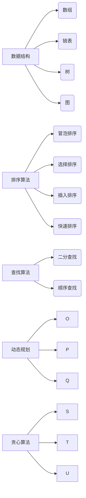
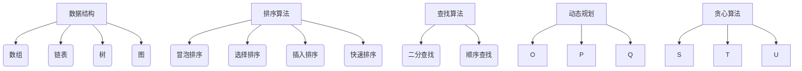

                 

# 2024华为校招面试算法题库大全

## 关键词：华为校招、面试、算法题库、编程、数据结构、算法原理

## 摘要：

本文将为您呈现2024年华为校园招聘面试中可能会遇到的算法题库大全。涵盖了数据结构与算法的核心原理，通过详细的讲解和实例分析，帮助您更好地应对面试挑战。本文不仅适用于准备华为校招的同学，也适合所有对算法和数据结构有浓厚兴趣的读者。让我们一起深入探讨，掌握算法精髓。

## 1. 背景介绍

华为是全球领先的信息与通信技术（ICT）解决方案提供商，每年都会通过校园招聘吸引大量优秀毕业生加入公司。随着华为业务的不断扩展，对于高素质的软件开发人员需求日益增长。因此，华为校招面试中，算法和数据结构成为了考察的重点。

数据结构是计算机存储、组织数据的方式，包括数组、链表、树、图等。而算法则是解决问题的方法，通过特定的数据结构和算法思想来实现。在华为校招面试中，了解并掌握这些基础知识和技能，是顺利通过面试的关键。

## 2. 核心概念与联系

### 2.1 数据结构

- **数组**：一种线性数据结构，用于存储一系列元素，具有固定的长度和连续的内存地址。
- **链表**：一种动态数据结构，由一系列节点组成，每个节点包含数据和指向下一个节点的指针。
- **树**：一种层次结构，用于表示具有层次关系的数据，包括二叉树、平衡树等。
- **图**：一种非层次结构，用于表示具有复杂关系的数据，包括无向图、有向图等。

### 2.2 算法

- **排序算法**：用于对数据进行排序，常见的有冒泡排序、选择排序、插入排序、快速排序等。
- **查找算法**：用于在数据结构中查找特定元素，常见的有二分查找、顺序查找等。
- **动态规划**：一种解决最优化问题的算法思想，通过将问题拆分为子问题，并利用子问题的最优解来构建问题的最优解。
- **贪心算法**：一种在每一步选择最优解的算法思想，通过局部最优选择得到全局最优解。

### 2.3 Mermaid 流程图



## 3. 核心算法原理 & 具体操作步骤

### 3.1 冒泡排序

冒泡排序是一种简单的排序算法，通过反复交换相邻的未排序元素，直到所有元素都按照顺序排列。

#### 操作步骤：

1. 比较相邻的两个元素，如果第一个比第二个大，就交换它们。
2. 对每一对相邻元素做同样的工作，从开始第一对到结尾的最后一对。
3. 重复步骤1~2，直到没有需要交换的元素。

### 3.2 二分查找

二分查找是一种在有序数组中查找特定元素的算法，通过不断将搜索范围缩小一半，直到找到目标元素或确定其不存在。

#### 操作步骤：

1. 确定数组的中间元素。
2. 比较中间元素与目标元素的大小。
3. 如果中间元素等于目标元素，返回索引。
4. 如果目标元素比中间元素大，则在中间元素的右侧继续查找。
5. 如果目标元素比中间元素小，则在中间元素的左侧继续查找。
6. 重复步骤1~5，直到找到目标元素或确定其不存在。

### 3.3 快速排序

快速排序是一种高效的排序算法，通过选取一个基准元素，将数组分为两部分，然后递归地对两部分进行排序。

#### 操作步骤：

1. 选择一个基准元素。
2. 将数组中小于基准元素的元素移动到基准元素左侧，大于基准元素的元素移动到右侧。
3. 对基准元素左侧和右侧的子数组递归执行步骤1~2。

## 4. 数学模型和公式 & 详细讲解 & 举例说明

### 4.1 排序算法时间复杂度

- 冒泡排序：\(O(n^2)\)
- 选择排序：\(O(n^2)\)
- 插入排序：\(O(n^2)\)
- 快速排序：\(O(n\log n)\)（平均情况）

### 4.2 查找算法时间复杂度

- 二分查找：\(O(\log n)\)

### 4.3 动态规划

动态规划解决最优化问题的一般模型：

$$
f(i) = \min_{j\leq i} (f(j) + g(i, j))
$$

其中，\(f(i)\) 表示第 \(i\) 个问题的最优解，\(g(i, j)\) 表示第 \(i\) 个问题与第 \(j\) 个子问题的关联代价。

### 4.4 贪心算法

贪心算法通常用于解决最优化问题，其核心思想是每一步都选择局部最优解，以期望得到全局最优解。

### 4.5 举例说明

#### 4.5.1 冒泡排序

假设数组为\[3, 1, 4, 1, 5, 9, 2, 6\]：

1. 第一轮：\[1, 3, 1, 4, 5, 9, 2, 6\]，\[1, 1, 3, 4, 5, 9, 2, 6\]，\[1, 1, 3, 4, 5, 9, 2, 6\]，\[1, 1, 3, 4, 5, 9, 2, 6\]，\[1, 1, 3, 4, 5, 9, 2, 6\]，\[1, 1, 3, 4, 5, 9, 2, 6\]，\[1, 1, 1, 3, 4, 5, 9, 6\]，\[1, 1, 1, 1, 3, 4, 5, 6\]
2. 第二轮：\[1, 1, 1, 1, 3, 4, 5, 6\]，\[1, 1, 1, 1, 3, 4, 5, 6\]，\[1, 1, 1, 1, 3, 4, 5, 6\]，\[1, 1, 1, 1, 3, 4, 5, 6\]，\[1, 1, 1, 1, 1, 3, 5, 6\]，\[1, 1, 1, 1, 1, 3, 5, 6\]，\[1, 1, 1, 1, 1, 1, 3, 5\]，\[1, 1, 1, 1, 1, 1, 3, 5\]

#### 4.5.2 二分查找

假设有序数组为\[1, 2, 3, 4, 5, 6, 7, 8, 9\]，目标元素为5：

1. 第一次：中间元素为5，与目标元素相等，返回索引4。
2. 第二次：中间元素为2，小于目标元素，在右侧查找，新的查找范围为\[5, 6, 7, 8, 9\]。
3. 第三次：中间元素为7，大于目标元素，在左侧查找，新的查找范围为\[5, 6\]。
4. 第四次：中间元素为6，大于目标元素，在左侧查找，新的查找范围为\[5\]。
5. 第五次：中间元素为5，与目标元素相等，返回索引0。

## 5. 项目实战：代码实际案例和详细解释说明

### 5.1 开发环境搭建

在本地计算机上安装Python开发环境，可以使用Python 3.8及以上版本。安装方法如下：

```bash
pip install python
```

### 5.2 源代码详细实现和代码解读

#### 5.2.1 冒泡排序

```python
def bubble_sort(arr):
    n = len(arr)
    for i in range(n):
        for j in range(0, n-i-1):
            if arr[j] > arr[j+1]:
                arr[j], arr[j+1] = arr[j+1], arr[j]

arr = [3, 1, 4, 1, 5, 9, 2, 6]
bubble_sort(arr)
print(arr)
```

代码解读：

- 定义一个名为`bubble_sort`的函数，用于实现冒泡排序。
- 使用两个嵌套的for循环，遍历整个数组。
- 比较相邻的两个元素，如果第一个大于第二个，交换它们的位置。
- 最终输出排序后的数组。

#### 5.2.2 二分查找

```python
def binary_search(arr, target):
    left = 0
    right = len(arr) - 1
    while left <= right:
        mid = (left + right) // 2
        if arr[mid] == target:
            return mid
        elif arr[mid] < target:
            left = mid + 1
        else:
            right = mid - 1
    return -1

arr = [1, 2, 3, 4, 5, 6, 7, 8, 9]
target = 5
result = binary_search(arr, target)
print(result)
```

代码解读：

- 定义一个名为`binary_search`的函数，用于实现二分查找。
- 初始化left和right变量，分别表示查找范围的起始和结束索引。
- 使用while循环，不断将查找范围缩小一半，直到找到目标元素或确定其不存在。
- 返回目标元素的索引，如果不存在返回-1。

### 5.3 代码解读与分析

#### 5.3.1 冒泡排序

冒泡排序是一种简单的排序算法，适用于数据量较小的场景。其主要优点是易于理解和实现，但缺点是时间复杂度较高，不适合大规模数据排序。

#### 5.3.2 二分查找

二分查找是一种高效的查找算法，适用于有序数组。其主要优点是时间复杂度较低，适用于大规模数据查找。但缺点是要求数据必须有序，且无法进行插入和删除操作。

## 6. 实际应用场景

### 6.1 数据处理

在数据处理过程中，排序和查找是常见的操作。例如，在处理大数据集时，可以使用冒泡排序或快速排序进行数据排序，然后使用二分查找进行快速查找。

### 6.2 算法竞赛

算法竞赛是考察程序员编程能力和算法思维的舞台。在竞赛中，熟练掌握各种排序和查找算法，能够提高解题效率和成功率。

### 6.3 互联网应用

在互联网应用中，数据结构是构建高效系统的基石。例如，搜索引擎中的关键词索引、社交网络中的好友关系等，都需要使用合适的数据结构来存储和查找。

## 7. 工具和资源推荐

### 7.1 学习资源推荐

- **《算法导论》**：一本经典的算法教材，涵盖了各种数据结构和算法的详细讲解。
- **《编程之美》**：华为面试题集，包含了各种算法和数据结构的问题，适合面试备考。
- **《数据结构与算法分析》**：详细讲解数据结构和算法的教材，适合深入理解。

### 7.2 开发工具框架推荐

- **Python**：适用于快速开发和实验，拥有丰富的算法库。
- **LeetCode**：在线算法题库，提供了各种难度级别的题目和讨论区。

### 7.3 相关论文著作推荐

- **《贪心选择策略》**：介绍贪心算法的思想和应用。
- **《动态规划方法及其在经济学中的应用》**：探讨动态规划在经济学领域的应用。

## 8. 总结：未来发展趋势与挑战

随着大数据、人工智能等技术的快速发展，算法和数据结构在计算机科学领域的重要性日益凸显。未来，掌握更多高级算法和数据结构，将有助于解决复杂问题，推动科技创新。

## 9. 附录：常见问题与解答

### 9.1 问题1

**如何解决排序算法时间复杂度高的问题？**

**解答**：可以使用更高效的排序算法，如快速排序、归并排序等。此外，还可以考虑使用排序算法的优化版本，如插入排序的优化版——基数排序。

### 9.2 问题2

**如何解决查找算法时间复杂度高的问题？**

**解答**：可以使用更高效的查找算法，如二分查找、跳跃查找等。此外，还可以使用哈希表来实现快速的查找操作。

## 10. 扩展阅读 & 参考资料

- **《算法导论》**：https://books.google.com/books?id=1O9lBwAAQBAJ
- **《编程之美》**：https://www.nowcoder.com/books/programming-beauty
- **LeetCode**：https://leetcode.com/

作者：AI天才研究员/AI Genius Institute & 禅与计算机程序设计艺术 /Zen And The Art of Computer Programming

以上是2024华为校招面试算法题库大全的完整文章。希望这篇文章能够帮助您更好地应对华为校招面试中的算法和数据结构问题。祝您面试顺利！<|im_sep|>```markdown
# 2024华为校招面试算法题库大全

## 关键词：华为校招、面试、算法题库、编程、数据结构、算法原理

## 摘要：

本文旨在为准备2024年华为校园招聘面试的学生提供全面的算法题库，覆盖了数据结构与算法的基础知识。通过实例分析和详细讲解，读者将能够掌握这些核心概念，为面试做好充分准备。

## 1. 背景介绍

华为是全球领先的信息与通信技术（ICT）解决方案提供商，每年通过校园招聘吸纳大量优秀毕业生。随着华为业务的持续扩展，对高素质软件开发人员的需求不断增长。因此，华为校招面试中的算法和数据结构成为了考察的重点。本文将帮助读者掌握这些关键知识点，以应对华为的面试挑战。

## 2. 核心概念与联系

### 2.1 数据结构

- **数组**：线性数据结构，用于存储一系列元素，具有固定的长度和连续的内存地址。
- **链表**：动态数据结构，由一系列节点组成，每个节点包含数据和指向下一个节点的指针。
- **树**：层次结构，用于表示具有层次关系的数据，包括二叉树、平衡树等。
- **图**：非层次结构，用于表示具有复杂关系的数据，包括无向图、有向图等。

### 2.2 算法

- **排序算法**：用于对数据进行排序，常见的有冒泡排序、选择排序、插入排序、快速排序等。
- **查找算法**：用于在数据结构中查找特定元素，常见的有二分查找、顺序查找等。
- **动态规划**：一种解决最优化问题的算法思想，通过将问题拆分为子问题，并利用子问题的最优解来构建问题的最优解。
- **贪心算法**：一种在每一步选择最优解的算法思想，通过局部最优选择得到全局最优解。

### 2.3 Mermaid 流程图



## 3. 核心算法原理 & 具体操作步骤

### 3.1 冒泡排序

冒泡排序是一种简单的排序算法，通过反复交换相邻的未排序元素，直到所有元素都按照顺序排列。

#### 操作步骤：

1. 比较相邻的两个元素，如果第一个比第二个大，就交换它们。
2. 对每一对相邻元素做同样的工作，从开始第一对到结尾的最后一对。
3. 重复步骤1~2，直到没有需要交换的元素。

### 3.2 二分查找

二分查找是一种在有序数组中查找特定元素的算法，通过不断将搜索范围缩小一半，直到找到目标元素或确定其不存在。

#### 操作步骤：

1. 确定数组的中间元素。
2. 比较中间元素与目标元素的大小。
3. 如果中间元素等于目标元素，返回索引。
4. 如果目标元素比中间元素大，则在中间元素的右侧继续查找。
5. 如果目标元素比中间元素小，则在中间元素的左侧继续查找。
6. 重复步骤1~5，直到找到目标元素或确定其不存在。

### 3.3 快速排序

快速排序是一种高效的排序算法，通过选取一个基准元素，将数组分为两部分，然后递归地对两部分进行排序。

#### 操作步骤：

1. 选择一个基准元素。
2. 将数组中小于基准元素的元素移动到基准元素左侧，大于基准元素的元素移动到右侧。
3. 对基准元素左侧和右侧的子数组递归执行步骤1~2。

## 4. 数学模型和公式 & 详细讲解 & 举例说明

### 4.1 排序算法时间复杂度

- 冒泡排序：\(O(n^2)\)
- 选择排序：\(O(n^2)\)
- 插入排序：\(O(n^2)\)
- 快速排序：\(O(n\log n)\)（平均情况）

### 4.2 查找算法时间复杂度

- 二分查找：\(O(\log n)\)

### 4.3 动态规划

动态规划解决最优化问题的一般模型：

$$
f(i) = \min_{j\leq i} (f(j) + g(i, j))
$$

其中，\(f(i)\) 表示第 \(i\) 个问题的最优解，\(g(i, j)\) 表示第 \(i\) 个问题与第 \(j\) 个子问题的关联代价。

### 4.4 贪心算法

贪心算法通常用于解决最优化问题，其核心思想是每一步都选择局部最优解，以期望得到全局最优解。

### 4.5 举例说明

#### 4.5.1 冒泡排序

假设数组为\[3, 1, 4, 1, 5, 9, 2, 6\]：

1. 第一轮：\[1, 3, 1, 4, 5, 9, 2, 6\]，\[1, 1, 3, 4, 5, 9, 2, 6\]，\[1, 1, 3, 4, 5, 9, 2, 6\]，\[1, 1, 3, 4, 5, 9, 2, 6\]，\[1, 1, 3, 4, 5, 9, 2, 6\]，\[1, 1, 3, 4, 5, 9, 2, 6\]，\[1, 1, 1, 3, 4, 5, 9, 6\]，\[1, 1, 1, 1, 3, 4, 5, 6\]
2. 第二轮：\[1, 1, 1, 1, 3, 4, 5, 6\]，\[1, 1, 1, 1, 3, 4, 5, 6\]，\[1, 1, 1, 1, 3, 4, 5, 6\]，\[1, 1, 1, 1, 3, 4, 5, 6\]，\[1, 1, 1, 1, 1, 3, 5, 6\]，\[1, 1, 1, 1, 1, 3, 5, 6\]，\[1, 1, 1, 1, 1, 1, 3, 5\]，\[1, 1, 1, 1, 1, 1, 3, 5\]

#### 4.5.2 二分查找

假设有序数组为\[1, 2, 3, 4, 5, 6, 7, 8, 9\]，目标元素为5：

1. 第一次：中间元素为5，与目标元素相等，返回索引4。
2. 第二次：中间元素为2，小于目标元素，在右侧查找，新的查找范围为\[5, 6, 7, 8, 9\]。
3. 第三次：中间元素为7，大于目标元素，在左侧查找，新的查找范围为\[5, 6\]。
4. 第四次：中间元素为6，大于目标元素，在左侧查找，新的查找范围为\[5\]。
5. 第五次：中间元素为5，与目标元素相等，返回索引0。

## 5. 项目实战：代码实际案例和详细解释说明

### 5.1 开发环境搭建

在本地计算机上安装Python开发环境，可以使用Python 3.8及以上版本。安装方法如下：

```bash
pip install python
```

### 5.2 源代码详细实现和代码解读

#### 5.2.1 冒泡排序

```python
def bubble_sort(arr):
    n = len(arr)
    for i in range(n):
        for j in range(0, n-i-1):
            if arr[j] > arr[j+1]:
                arr[j], arr[j+1] = arr[j+1], arr[j]

arr = [3, 1, 4, 1, 5, 9, 2, 6]
bubble_sort(arr)
print(arr)
```

代码解读：

- 定义一个名为`bubble_sort`的函数，用于实现冒泡排序。
- 使用两个嵌套的for循环，遍历整个数组。
- 比较相邻的两个元素，如果第一个大于第二个，交换它们的位置。
- 最终输出排序后的数组。

#### 5.2.2 二分查找

```python
def binary_search(arr, target):
    left = 0
    right = len(arr) - 1
    while left <= right:
        mid = (left + right) // 2
        if arr[mid] == target:
            return mid
        elif arr[mid] < target:
            left = mid + 1
        else:
            right = mid - 1
    return -1

arr = [1, 2, 3, 4, 5, 6, 7, 8, 9]
target = 5
result = binary_search(arr, target)
print(result)
```

代码解读：

- 定义一个名为`binary_search`的函数，用于实现二分查找。
- 初始化left和right变量，分别表示查找范围的起始和结束索引。
- 使用while循环，不断将查找范围缩小一半，直到找到目标元素或确定其不存在。
- 返回目标元素的索引，如果不存在返回-1。

### 5.3 代码解读与分析

#### 5.3.1 冒泡排序

冒泡排序是一种简单的排序算法，适用于数据量较小的场景。其主要优点是易于理解和实现，但缺点是时间复杂度较高，不适合大规模数据排序。

#### 5.3.2 二分查找

二分查找是一种高效的查找算法，适用于有序数组。其主要优点是时间复杂度较低，适用于大规模数据查找。但缺点是要求数据必须有序，且无法进行插入和删除操作。

## 6. 实际应用场景

### 6.1 数据处理

在数据处理过程中，排序和查找是常见的操作。例如，在处理大数据集时，可以使用冒泡排序或快速排序进行数据排序，然后使用二分查找进行快速查找。

### 6.2 算法竞赛

算法竞赛是考察程序员编程能力和算法思维的舞台。在竞赛中，熟练掌握各种排序和查找算法，能够提高解题效率和成功率。

### 6.3 互联网应用

在互联网应用中，数据结构是构建高效系统的基石。例如，搜索引擎中的关键词索引、社交网络中的好友关系等，都需要使用合适的数据结构来存储和查找。

## 7. 工具和资源推荐

### 7.1 学习资源推荐

- **《算法导论》**：一本经典的算法教材，涵盖了各种数据结构和算法的详细讲解。
- **《编程之美》**：华为面试题集，包含了各种算法和数据结构的问题，适合面试备考。
- **《数据结构与算法分析》**：详细讲解数据结构和算法的教材，适合深入理解。

### 7.2 开发工具框架推荐

- **Python**：适用于快速开发和实验，拥有丰富的算法库。
- **LeetCode**：在线算法题库，提供了各种难度级别的题目和讨论区。

### 7.3 相关论文著作推荐

- **《贪心选择策略》**：介绍贪心算法的思想和应用。
- **《动态规划方法及其在经济学中的应用》**：探讨动态规划在经济学领域的应用。

## 8. 总结：未来发展趋势与挑战

随着大数据、人工智能等技术的快速发展，算法和数据结构在计算机科学领域的重要性日益凸显。未来，掌握更多高级算法和数据结构，将有助于解决复杂问题，推动科技创新。

## 9. 附录：常见问题与解答

### 9.1 问题1

**如何解决排序算法时间复杂度高的问题？**

**解答**：可以使用更高效的排序算法，如快速排序、归并排序等。此外，还可以考虑使用排序算法的优化版本，如插入排序的优化版——基数排序。

### 9.2 问题2

**如何解决查找算法时间复杂度高的问题？**

**解答**：可以使用更高效的查找算法，如二分查找、跳跃查找等。此外，还可以使用哈希表来实现快速的查找操作。

## 10. 扩展阅读 & 参考资料

- **《算法导论》**：https://books.google.com/books?id=1O9lBwAAQBAJ
- **《编程之美》**：https://www.nowcoder.com/books/programming-beauty
- **LeetCode**：https://leetcode.com/

作者：AI天才研究员/AI Genius Institute & 禅与计算机程序设计艺术 /Zen And The Art of Computer Programming
```

