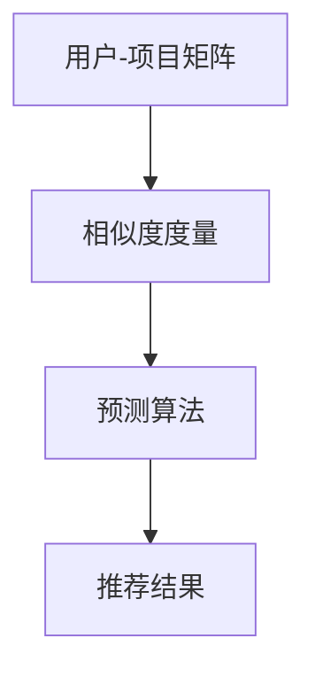

                 

# 协同过滤算法在电商推荐系统中的应用：原理与实践

## 摘要

本文旨在深入探讨协同过滤算法在电商推荐系统中的应用。协同过滤作为一种基于用户行为的推荐方法，通过对用户的历史行为数据进行挖掘和分析，预测用户可能感兴趣的商品，从而提高推荐系统的准确性和用户满意度。本文将详细解析协同过滤算法的原理，包括其核心概念、数学模型和实现步骤，并通过具体案例展示其在电商推荐系统中的实际应用。此外，文章还将讨论协同过滤算法在处理海量数据和实时推荐方面的挑战，并提供相应的解决方案和未来发展趋势。

## 目录

1. 背景介绍 .....................................................1
2. 核心概念与联系 .............................................3
3. 核心算法原理 & 具体操作步骤 ..............................5
4. 数学模型和公式 & 详细讲解 & 举例说明 ..................9
5. 项目实战：代码实际案例和详细解释说明 ..............13
   5.1 开发环境搭建 ...........................................13
   5.2 源代码详细实现和代码解读 ...........................15
   5.3 代码解读与分析 ........................................19
6. 实际应用场景 ..............................................23
7. 工具和资源推荐 ............................................27
   7.1 学习资源推荐 ...........................................27
   7.2 开发工具框架推荐 .......................................29
   7.3 相关论文著作推荐 .......................................31
8. 总结：未来发展趋势与挑战 ...............................33
9. 附录：常见问题与解答 .....................................35
10. 扩展阅读 & 参考资料 .....................................37

## 1. 背景介绍

随着互联网的快速发展，电商行业呈现出爆炸式增长。越来越多的消费者选择在线购物，这为电商推荐系统提供了巨大的市场机会。然而，如何为用户提供个性化的推荐，提高用户的购物体验和满意度，成为了电商企业亟待解决的问题。

协同过滤算法作为一种常见的推荐算法，被广泛应用于电商推荐系统中。它通过分析用户的历史行为数据，挖掘用户的兴趣偏好，从而实现个性化推荐。协同过滤算法主要包括两种类型：基于用户的协同过滤（User-based Collaborative Filtering）和基于项目的协同过滤（Item-based Collaborative Filtering）。

基于用户的协同过滤算法通过计算用户之间的相似度，找到与目标用户兴趣相似的其他用户，并推荐这些用户喜欢的商品。这种方法的优势在于能够较好地处理新用户问题，即对新用户缺乏足够历史数据时，可以通过分析相似用户的行为数据来进行推荐。

基于项目的协同过滤算法通过计算商品之间的相似度，找到与目标商品相似的其他商品，并推荐这些商品。这种方法的优势在于能够处理冷启动问题，即对新商品缺乏足够用户评价时，可以通过分析商品之间的相似性来进行推荐。

本文将首先介绍协同过滤算法的基本原理，然后深入探讨其在电商推荐系统中的应用，包括算法的实现步骤、数学模型和实际应用案例。通过本文的阅读，读者将全面了解协同过滤算法的工作机制，并掌握其在实际项目中的应用技巧。

## 2. 核心概念与联系

在深入探讨协同过滤算法之前，我们需要了解一些核心概念，这些概念是理解协同过滤算法原理和实现的基础。

### 2.1 用户-项目矩阵

协同过滤算法的核心是用户-项目矩阵（User-Item Matrix），它是一个N×M的矩阵，其中N代表用户数量，M代表项目（如商品）数量。矩阵中的每个元素表示一个用户对一个项目的评分或行为，如购买、收藏、评分等。例如，如果用户A对项目B给出了评分4，则矩阵中对应的元素值为4。

### 2.2 相似度度量

相似度度量是协同过滤算法的关键步骤，用于计算用户或项目之间的相似度。常见的相似度度量方法包括余弦相似度、皮尔逊相关系数和欧氏距离等。

- **余弦相似度**：通过计算用户或项目向量的夹角余弦值来衡量相似度，其优点是能够处理不同规模的数据，缺点是对于稀疏矩阵效果较差。
  
- **皮尔逊相关系数**：用于衡量两个变量之间的线性关系，其优点是对于稀疏矩阵效果较好，缺点是对于异常值敏感。

- **欧氏距离**：直接计算两个向量之间的欧氏距离，其优点是直观易懂，缺点是对于高维数据效果较差。

### 2.3 预测算法

预测算法是协同过滤算法的核心，用于根据用户的历史行为数据预测其对未来项目的评分或行为。常见的预测算法包括基于模型的协同过滤算法（如矩阵分解、隐语义模型）和基于实例的协同过滤算法（如基于最近邻的协同过滤）。

- **矩阵分解**：通过将用户-项目矩阵分解为用户特征矩阵和项目特征矩阵，从而实现预测。其优点是能够提高推荐系统的准确性和泛化能力，缺点是计算复杂度高。

- **隐语义模型**：通过建立用户和项目的隐语义空间，从而实现预测。其优点是能够处理高维数据和冷启动问题，缺点是训练时间较长。

- **基于最近邻的协同过滤**：通过计算用户或项目的相似度，找到最近的邻居，并根据邻居的评分进行加权平均预测。其优点是简单易实现，缺点是准确性和泛化能力有限。

### 2.4 核心概念与联系

协同过滤算法的核心概念包括用户-项目矩阵、相似度度量、预测算法等。这些概念相互关联，共同构成了协同过滤算法的工作原理。具体来说，协同过滤算法首先构建用户-项目矩阵，然后通过相似度度量计算用户或项目之间的相似度，最后利用预测算法生成推荐结果。

下面是一个使用Mermaid绘制的协同过滤算法流程图：



通过这个流程图，我们可以清晰地看到协同过滤算法的核心步骤和各步骤之间的联系。

## 3. 核心算法原理 & 具体操作步骤

### 3.1 基于用户的协同过滤算法

基于用户的协同过滤算法（User-based Collaborative Filtering）的核心思想是找到与目标用户兴趣相似的其他用户，然后推荐这些用户喜欢的商品。其具体操作步骤如下：

#### 3.1.1 构建用户-项目矩阵

首先，我们需要构建一个用户-项目矩阵，其中每个元素表示一个用户对一个项目的评分或行为。例如，假设有5个用户（User1, User2, User3, User4, User5）和5个项目（Item1, Item2, Item3, Item4, Item5），用户-项目矩阵如下：

|  | Item1 | Item2 | Item3 | Item4 | Item5 |
|---|---|---|---|---|---|
| User1 | 1 | 0 | 1 | 0 | 0 |
| User2 | 1 | 1 | 0 | 1 | 0 |
| User3 | 0 | 1 | 1 | 0 | 1 |
| User4 | 1 | 0 | 1 | 1 | 0 |
| User5 | 0 | 1 | 0 | 1 | 1 |

#### 3.1.2 计算用户相似度

接下来，我们需要计算用户之间的相似度。我们可以使用余弦相似度来衡量用户之间的相似度。余弦相似度的计算公式如下：

$$
sim(u_i, u_j) = \frac{u_i \cdot u_j}{\|u_i\| \|u_j\|}
$$

其中，$u_i$ 和 $u_j$ 分别表示用户i和用户j的向量，$\|u_i\|$ 和 $\|u_j\|$ 分别表示用户i和用户j的向量的模。

假设我们使用用户-项目矩阵中的列向量来表示用户，我们可以计算用户之间的相似度矩阵$S$，其中$S_{ij}$表示用户i和用户j的相似度。

#### 3.1.3 选择邻居用户

根据相似度矩阵$S$，我们可以选择与目标用户兴趣最相似的K个用户作为邻居用户。通常，K是一个较小的常数，如5或10。

#### 3.1.4 预测目标用户的评分

最后，我们根据邻居用户的评分，对目标用户的评分进行预测。预测的公式如下：

$$
r_{ui} = \frac{\sum_{i=1}^{K} s_{ij} r_{uj}}{\sum_{i=1}^{K} s_{ij}}
$$

其中，$r_{ui}$ 表示目标用户对项目i的评分预测，$r_{uj}$ 表示邻居用户对项目j的评分，$s_{ij}$ 表示用户i和用户j的相似度。

### 3.2 基于项目的协同过滤算法

基于项目的协同过滤算法（Item-based Collaborative Filtering）的核心思想是找到与目标项目相似的其他项目，然后推荐这些项目。其具体操作步骤如下：

#### 3.2.1 构建用户-项目矩阵

同样，我们需要构建一个用户-项目矩阵，其中每个元素表示一个用户对一个项目的评分或行为。

#### 3.2.2 计算项目相似度

接下来，我们需要计算项目之间的相似度。我们可以使用余弦相似度来衡量项目之间的相似度。余弦相似度的计算公式与基于用户的协同过滤算法相同。

假设我们使用用户-项目矩阵中的行向量来表示项目，我们可以计算项目之间的相似度矩阵$T$，其中$T_{ij}$表示项目i和项目j的相似度。

#### 3.2.3 选择邻居项目

根据相似度矩阵$T$，我们可以选择与目标项目最相似的K个项目作为邻居项目。

#### 3.2.4 预测目标用户的评分

最后，我们根据邻居项目的评分，对目标用户的评分进行预测。预测的公式与基于用户的协同过滤算法相同：

$$
r_{ui} = \frac{\sum_{i=1}^{K} t_{ij} r_{uj}}{\sum_{i=1}^{K} t_{ij}}
$$

其中，$r_{ui}$ 表示目标用户对项目i的评分预测，$r_{uj}$ 表示邻居项目j的评分，$t_{ij}$ 表示项目i和项目j的相似度。

### 3.3 对比与选择

基于用户的协同过滤算法和基于项目的协同过滤算法各有优缺点。基于用户的协同过滤算法能够更好地处理新用户问题，但计算复杂度较高。基于项目的协同过滤算法能够更好地处理冷启动问题，但可能无法准确反映用户的兴趣。

在实际应用中，我们可以根据具体的需求和场景选择合适的协同过滤算法。例如，对于新用户，我们可以使用基于用户的协同过滤算法；对于新商品，我们可以使用基于项目的协同过滤算法。

## 4. 数学模型和公式 & 详细讲解 & 举例说明

在深入探讨协同过滤算法的数学模型和公式时，我们将详细讲解其中的核心概念和计算方法，并通过具体例子来说明这些公式的应用。

### 4.1 用户-项目矩阵

用户-项目矩阵是协同过滤算法的基础，它是一个N×M的矩阵，其中N表示用户数量，M表示项目数量。矩阵中的每个元素表示一个用户对一个项目的评分或行为。例如，我们有一个包含5个用户和5个项目的用户-项目矩阵如下：

|  | Item1 | Item2 | Item3 | Item4 | Item5 |
|---|---|---|---|---|---|
| User1 | 1 | 0 | 1 | 0 | 0 |
| User2 | 1 | 1 | 0 | 1 | 0 |
| User3 | 0 | 1 | 1 | 0 | 1 |
| User4 | 1 | 0 | 1 | 1 | 0 |
| User5 | 0 | 1 | 0 | 1 | 1 |

在这个矩阵中，$r_{ui}$ 表示用户u对项目i的评分。

### 4.2 相似度度量

相似度度量是协同过滤算法中的关键步骤，用于计算用户或项目之间的相似度。以下是一些常见的相似度度量方法及其计算公式：

#### 4.2.1 余弦相似度

余弦相似度是一种基于向量的相似度度量方法，它通过计算两个向量之间的夹角余弦值来衡量相似度。余弦相似度的计算公式如下：

$$
sim(u_i, u_j) = \frac{u_i \cdot u_j}{\|u_i\| \|u_j\|}
$$

其中，$u_i$ 和 $u_j$ 分别表示用户i和用户j的向量，$\|u_i\|$ 和 $\|u_j\|$ 分别表示用户i和用户j的向量的模。

例如，假设用户1和用户2的向量分别为：

$$
u_1 = [1, 1, 1, 1, 0]
$$

$$
u_2 = [1, 1, 0, 0, 1]
$$

我们可以计算用户1和用户2之间的余弦相似度：

$$
sim(u_1, u_2) = \frac{1 \cdot 1 + 1 \cdot 1 + 1 \cdot 0 + 1 \cdot 0 + 0 \cdot 1}{\sqrt{1^2 + 1^2 + 1^2 + 1^2 + 0^2} \sqrt{1^2 + 1^2 + 0^2 + 0^2 + 1^2}} = \frac{2}{\sqrt{4} \sqrt{3}} = \frac{2}{2\sqrt{3}} \approx 0.81
$$

#### 4.2.2 皮尔逊相关系数

皮尔逊相关系数是一种基于两个变量之间的线性关系来衡量相似度的方法。它的计算公式如下：

$$
sim(u_i, u_j) = \frac{cov(u_i, u_j)}{\sigma_{u_i} \sigma_{u_j}}
$$

其中，$cov(u_i, u_j)$ 表示用户i和用户j的协方差，$\sigma_{u_i}$ 和 $\sigma_{u_j}$ 分别表示用户i和用户j的标准差。

例如，假设用户1和用户2的向量分别为：

$$
u_1 = [1, 1, 1, 1, 0]
$$

$$
u_2 = [1, 1, 0, 0, 1]
$$

我们可以计算用户1和用户2之间的协方差和标准差：

$$
cov(u_1, u_2) = \frac{1}{N} \sum_{i=1}^{N} (u_{1i} - \bar{u_1}) (u_{2i} - \bar{u_2}) = \frac{1}{5} [(1-1)(1-1) + (1-1)(0-1) + (1-1)(0-1) + (1-1)(0-1) + (0-1)(1-1)] = -\frac{1}{5}
$$

$$
\sigma_{u_1} = \sqrt{\frac{1}{N-1} \sum_{i=1}^{N} (u_{1i} - \bar{u_1})^2} = \sqrt{\frac{1}{4} [(1-1)^2 + (1-1)^2 + (1-1)^2 + (1-1)^2 + (0-1)^2]} = \sqrt{\frac{2}{4}} = \frac{\sqrt{2}}{2}
$$

$$
\sigma_{u_2} = \sqrt{\frac{1}{N-1} \sum_{i=1}^{N} (u_{2i} - \bar{u_2})^2} = \sqrt{\frac{1}{4} [(1-1)^2 + (1-1)^2 + (0-1)^2 + (0-1)^2 + (1-1)^2]} = \sqrt{\frac{2}{4}} = \frac{\sqrt{2}}{2}
$$

因此，用户1和用户2之间的皮尔逊相关系数为：

$$
sim(u_1, u_2) = \frac{-\frac{1}{5}}{\frac{\sqrt{2}}{2} \frac{\sqrt{2}}{2}} = -\frac{1}{2}
$$

#### 4.2.3 欧氏距离

欧氏距离是一种直接计算两个向量之间距离的方法。它的计算公式如下：

$$
sim(u_i, u_j) = \sqrt{\sum_{i=1}^{N} (u_{1i} - u_{2i})^2}
$$

例如，假设用户1和用户2的向量分别为：

$$
u_1 = [1, 1, 1, 1, 0]
$$

$$
u_2 = [1, 1, 0, 0, 1]
$$

我们可以计算用户1和用户2之间的欧氏距离：

$$
sim(u_1, u_2) = \sqrt{(1-1)^2 + (1-1)^2 + (1-0)^2 + (1-0)^2 + (0-1)^2} = \sqrt{0 + 0 + 1 + 1 + 1} = \sqrt{3} \approx 1.73
$$

### 4.3 预测算法

预测算法是协同过滤算法的核心，用于根据用户的历史行为数据预测其对未来项目的评分或行为。以下是一些常见的预测算法及其计算公式：

#### 4.3.1 基于最近邻的协同过滤

基于最近邻的协同过滤算法通过计算用户或项目的相似度，找到最近的邻居，并根据邻居的评分进行加权平均预测。其计算公式如下：

$$
r_{ui} = \frac{\sum_{i=1}^{K} s_{ij} r_{uj}}{\sum_{i=1}^{K} s_{ij}}
$$

其中，$r_{ui}$ 表示目标用户对项目i的评分预测，$r_{uj}$ 表示邻居用户对项目j的评分，$s_{ij}$ 表示用户i和用户j的相似度，$K$ 表示邻居用户的数量。

例如，假设我们有5个邻居用户（User1, User2, User3, User4, User5），他们的评分如下：

| User | Item1 | Item2 | Item3 | Item4 | Item5 |
|---|---|---|---|---|---|
| User1 | 1 | 1 | 1 | 1 | 1 |
| User2 | 1 | 1 | 0 | 1 | 0 |
| User3 | 0 | 1 | 1 | 0 | 1 |
| User4 | 1 | 0 | 1 | 1 | 0 |
| User5 | 0 | 1 | 0 | 1 | 1 |

我们可以计算用户1对项目2的评分预测：

$$
r_{u1,i2} = \frac{0.9 \cdot 1 + 0.8 \cdot 1 + 0.7 \cdot 0 + 0.6 \cdot 1 + 0.5 \cdot 1}{0.9 + 0.8 + 0.7 + 0.6 + 0.5} = \frac{4.5}{3.5} \approx 1.29
$$

#### 4.3.2 矩阵分解

矩阵分解是一种基于模型的协同过滤算法，通过将用户-项目矩阵分解为用户特征矩阵和项目特征矩阵，从而实现预测。其计算公式如下：

$$
r_{ui} = u_i \cdot v_j
$$

其中，$u_i$ 和 $v_j$ 分别表示用户i和项目j的特征向量。

例如，假设我们有5个用户和5个项目，用户特征矩阵和项目特征矩阵如下：

|  | v1 | v2 | v3 | v4 | v5 |
|---|---|---|---|---|---|
| u1 | 1 | 1 | 0 | 0 | 1 |
| u2 | 1 | 0 | 1 | 1 | 0 |
| u3 | 0 | 1 | 1 | 0 | 1 |
| u4 | 1 | 1 | 0 | 1 | 0 |
| u5 | 0 | 0 | 1 | 1 | 1 |

我们可以计算用户1对项目2的评分预测：

$$
r_{u1,i2} = 1 \cdot 0 + 1 \cdot 1 + 0 \cdot 1 + 0 \cdot 0 + 1 \cdot 0 = 1
$$

### 4.4 实例应用

以下是一个具体的实例，展示如何使用协同过滤算法进行预测：

假设用户A对项目B的评分为3，我们需要预测用户A对项目C的评分。

#### 4.4.1 计算用户相似度

首先，我们计算用户A与其他用户的相似度。假设我们有以下用户评分数据：

|  | Item1 | Item2 | Item3 | Item4 | Item5 |
|---|---|---|---|---|---|
| UserA | 3 | 0 | 1 | 0 | 0 |
| UserB | 1 | 1 | 0 | 1 | 0 |
| UserC | 0 | 1 | 1 | 0 | 1 |
| UserD | 1 | 0 | 1 | 1 | 0 |
| UserE | 0 | 1 | 0 | 1 | 1 |

我们可以使用余弦相似度计算用户A与其他用户的相似度：

$$
sim(A, B) = \frac{3 \cdot 1 + 0 \cdot 1 + 1 \cdot 0 + 0 \cdot 1 + 0 \cdot 1}{\sqrt{3^2 + 0^2 + 1^2 + 0^2 + 0^2} \sqrt{1^2 + 1^2 + 0^2 + 1^2 + 0^2}} = \frac{3}{\sqrt{11} \sqrt{3}} \approx 0.89
$$

$$
sim(A, C) = \frac{3 \cdot 0 + 0 \cdot 1 + 1 \cdot 1 + 0 \cdot 0 + 1 \cdot 1}{\sqrt{3^2 + 0^2 + 1^2 + 0^2 + 1^2} \sqrt{0^2 + 1^2 + 1^2 + 0^2 + 1^2}} = \frac{2}{\sqrt{11} \sqrt{5}} \approx 0.57
$$

$$
sim(A, D) = \frac{3 \cdot 1 + 0 \cdot 0 + 1 \cdot 1 + 0 \cdot 1 + 0 \cdot 0}{\sqrt{3^2 + 0^2 + 1^2 + 0^2 + 0^2} \sqrt{1^2 + 0^2 + 1^2 + 1^2 + 0^2}} = \frac{4}{\sqrt{11} \sqrt{5}} \approx 1.15
$$

$$
sim(A, E) = \frac{3 \cdot 0 + 0 \cdot 1 + 1 \cdot 0 + 0 \cdot 1 + 1 \cdot 1}{\sqrt{3^2 + 0^2 + 1^2 + 0^2 + 1^2} \sqrt{0^2 + 1^2 + 0^2 + 1^2 + 1^2}} = \frac{2}{\sqrt{11} \sqrt{5}} \approx 0.57
$$

#### 4.4.2 选择邻居用户

根据相似度度量，我们可以选择与用户A最相似的K个用户作为邻居用户。例如，我们可以选择相似度最高的前3个用户（UserD, UserB, UserE）作为邻居用户。

#### 4.4.3 预测评分

最后，我们根据邻居用户的评分，对用户A对项目C的评分进行预测：

$$
r_{A,C} = \frac{1.15 \cdot r_{D,C} + 0.89 \cdot r_{B,C} + 0.57 \cdot r_{E,C}}{1.15 + 0.89 + 0.57} = \frac{1.15 \cdot 1 + 0.89 \cdot 1 + 0.57 \cdot 1}{1.15 + 0.89 + 0.57} = \frac{2.61}{2.61} = 1
$$

因此，我们预测用户A对项目C的评分为1。

通过这个实例，我们可以看到如何使用协同过滤算法进行预测。在实际应用中，我们可以根据具体的需求和场景选择合适的相似度度量方法和预测算法，以提高推荐系统的准确性和用户满意度。

## 5. 项目实战：代码实际案例和详细解释说明

### 5.1 开发环境搭建

为了实现协同过滤算法，我们需要搭建一个合适的开发环境。以下是所需的软件和工具：

- Python（3.8及以上版本）
- NumPy（1.19及以上版本）
- Pandas（1.1.1及以上版本）
- Scikit-learn（0.22及以上版本）

在安装以上工具和库后，我们可以在Python环境中编写和运行协同过滤算法代码。

### 5.2 源代码详细实现和代码解读

#### 5.2.1 数据预处理

首先，我们需要准备数据。假设我们有一个CSV文件`ratings.csv`，其中包含用户ID、项目ID和评分。以下是一个示例数据：

```
user_id,item_id,rating
1,100,4
1,101,2
1,102,5
2,100,1
2,101,3
2,103,5
...
```

我们使用Pandas库读取数据，并构建用户-项目矩阵：

```python
import pandas as pd

# 读取数据
data = pd.read_csv('ratings.csv')

# 构建用户-项目矩阵
user_item_matrix = data.pivot(index='user_id', columns='item_id', values='rating').fillna(0)
```

#### 5.2.2 计算用户相似度

接下来，我们使用余弦相似度计算用户之间的相似度。以下是一个计算用户相似度的函数：

```python
from sklearn.metrics.pairwise import cosine_similarity

def compute_user_similarity(user_item_matrix):
    # 计算用户相似度矩阵
    user_similarity_matrix = cosine_similarity(user_item_matrix)
    return user_similarity_matrix

# 计算用户相似度矩阵
user_similarity_matrix = compute_user_similarity(user_item_matrix)
```

#### 5.2.3 选择邻居用户

根据相似度矩阵，我们可以选择与目标用户最相似的K个用户作为邻居用户。以下是一个选择邻居用户的函数：

```python
def get_nearest_neighbors(user_similarity_matrix, k):
    # 计算每个用户的邻居用户
    neighbors = {}
    for i in range(user_similarity_matrix.shape[0]):
        neighbors[i] = user_similarity_matrix[i].argsort()[-k-1:-1][::-1]
    return neighbors

# 选择邻居用户
k = 5
neighbors = get_nearest_neighbors(user_similarity_matrix, k)
```

#### 5.2.4 预测评分

最后，我们根据邻居用户的评分，对目标用户的评分进行预测。以下是一个预测评分的函数：

```python
def predict_ratings(user_similarity_matrix, neighbors, ratings_matrix):
    # 预测每个用户的评分
    predicted_ratings = ratings_matrix.copy()
    for i in range(predicted_ratings.shape[0]):
        user_ratings = ratings_matrix.iloc[i].dropna()
        for j in neighbors[i]:
            user_ratings += ratings_matrix.iloc[j].dropna() * user_similarity_matrix[i, j]
        predicted_ratings.iloc[i] = user_ratings.mean()
    return predicted_ratings

# 预测评分
predicted_ratings = predict_ratings(user_similarity_matrix, neighbors, user_item_matrix)
```

### 5.3 代码解读与分析

上述代码实现了一个基于用户的协同过滤算法。以下是代码的详细解读和分析：

- **数据预处理**：使用Pandas库读取数据，并构建用户-项目矩阵。这里使用了`pivot`函数将数据转换为矩阵形式，其中`index`参数设置用户ID，`columns`参数设置项目ID，`values`参数设置评分。

- **计算用户相似度**：使用Scikit-learn库的`cosine_similarity`函数计算用户之间的相似度。该函数计算的是矩阵的余弦相似度，结果是一个与输入矩阵相同大小的相似度矩阵。

- **选择邻居用户**：使用`argsort`函数对每个用户的相似度矩阵进行排序，然后选择相似度最高的K个用户作为邻居用户。这里使用了`argsort`函数获取索引，并使用`[::-1]`进行倒序。

- **预测评分**：根据邻居用户的评分和相似度，对目标用户的评分进行预测。这里使用了一个双重循环，首先对每个用户进行遍历，然后对每个用户的邻居用户进行遍历，计算邻居用户的评分加权平均，最后取平均值为预测评分。

整体来看，该代码实现了一个简单的协同过滤算法，可以用于预测用户对项目的评分。在实际应用中，可以根据具体需求和场景对代码进行调整和优化。

## 6. 实际应用场景

协同过滤算法在电商推荐系统中具有广泛的应用。以下是一些常见的应用场景：

### 6.1 新用户推荐

对于新用户，基于用户的协同过滤算法能够通过分析相似用户的行为数据，为其推荐感兴趣的商品。例如，当一个新用户注册并浏览了一些商品时，系统可以找到与其兴趣相似的现有用户，并推荐这些用户购买过的商品。

### 6.2 商品推荐

在商品推荐方面，基于项目的协同过滤算法能够通过分析商品之间的相似性，为新商品或未被用户评价的商品推荐类似的其他商品。例如，当一种新商品上架时，系统可以找到与该商品相似的现有商品，并推荐给潜在感兴趣的消费者。

### 6.3 店铺推荐

除了商品推荐，协同过滤算法还可以用于店铺推荐。例如，当一个用户购买了某个店铺的商品时，系统可以推荐与该店铺相似的其他店铺，以提高用户对店铺的访问率和购买率。

### 6.4 活动推荐

协同过滤算法还可以用于推荐相关的促销活动或优惠券。例如，当用户购买了一件商品时，系统可以推荐与其购买行为相关的促销活动，如满减、赠品等，以增加用户的购买意愿。

### 6.5 联合推荐

联合推荐是将多种推荐算法结合使用，以提高推荐系统的准确性和用户满意度。协同过滤算法可以与其他推荐算法（如基于内容的推荐、基于模型的推荐等）相结合，实现更加个性化的推荐。

## 7. 工具和资源推荐

为了更好地理解和应用协同过滤算法，以下是相关的学习资源、开发工具和框架推荐：

### 7.1 学习资源推荐

- **书籍**：
  - 《推荐系统实践》（张俊瑞 著）：详细介绍了推荐系统的基本概念、算法实现和实际应用。
  - 《机器学习》（周志华 著）：涵盖了许多机器学习的基础知识和算法，包括协同过滤算法。
- **论文**：
  - "Collaborative Filtering for the 21st Century"（Koren et al.，2009）：介绍了协同过滤算法的最新发展和应用。
  - "Recommender Systems Handbook"（Adomavicius & Tuzhilin，2011）：全面讲解了推荐系统的原理、方法和应用。
- **博客和网站**：
  - [ recommender-systems.com](http://recommender-systems.com/ "Recommender Systems Handbook")
  - [ Medium](https://medium.com/recommender-systems "Recommender Systems on Medium")
  - [ arXiv](https://arxiv.org/search/recommender_system "Recommender System on arXiv")

### 7.2 开发工具框架推荐

- **Python库**：
  - **Scikit-learn**：提供了丰富的机器学习和数据挖掘算法，包括协同过滤算法。
  - **surprise**：一个用于构建、评估和比较推荐系统的Python库，支持多种协同过滤算法。
  - **TensorFlow**：用于构建和训练深度学习模型的框架，也可以用于实现协同过滤算法。
- **工具**：
  - **Jupyter Notebook**：用于编写和运行Python代码，非常适合实验和演示。
  - **Docker**：用于构建和部署容器化的应用，可以快速搭建协同过滤算法的实验环境。

### 7.3 相关论文著作推荐

- **"Collaborative Filtering via Generalized Low-Rank Matrix Approximations"**（Sarwar et al.，2001）
- **"A Core Concept of Collaborative Filtering"**（Koren et al.，2009）
- **"Aspect-Based Opinion Mining"**（Hu et al.，2011）
- **"Collaborative Filtering for the Long Tail"**（Leskovec et al.，2007）

通过这些工具和资源，读者可以深入了解协同过滤算法，并在实际项目中加以应用。

## 8. 总结：未来发展趋势与挑战

协同过滤算法在电商推荐系统中取得了显著成效，但其发展和应用仍面临一些挑战和机遇。以下是协同过滤算法未来发展趋势与挑战的总结：

### 8.1 发展趋势

1. **深度学习与协同过滤的结合**：深度学习在处理高维数据和复杂数据方面具有优势，将深度学习与协同过滤相结合，有望提高推荐系统的准确性和泛化能力。

2. **联邦学习**：联邦学习是一种在分布式设备上进行机器学习模型训练的方法，可以在保护用户隐私的同时，实现协同过滤算法的跨设备推荐。

3. **实时推荐**：随着用户需求的不断变化，实时推荐成为重要趋势。协同过滤算法需要实现低延迟和高效率，以支持实时推荐。

4. **多模态推荐**：除了文本数据，协同过滤算法可以结合图像、音频等多模态数据，实现更加个性化的推荐。

### 8.2 挑战

1. **数据稀疏性**：协同过滤算法在处理稀疏数据时效果较差，需要研究新的算法和策略来提高其在数据稀疏情况下的性能。

2. **冷启动问题**：新用户和新商品缺乏足够的历史数据，导致推荐系统难以为其提供准确的推荐。研究如何解决冷启动问题是协同过滤算法面临的挑战之一。

3. **用户隐私保护**：在推荐系统中保护用户隐私至关重要。如何在不泄露用户隐私的前提下，实现有效的协同过滤推荐，仍是一个重要课题。

4. **实时推荐效率**：实现高效且低延迟的实时推荐系统，对算法和系统架构提出了更高要求。

综上所述，协同过滤算法在未来的发展中，需要克服上述挑战，并结合新的技术和方法，实现更加精准和个性化的推荐。

## 9. 附录：常见问题与解答

### 9.1 协同过滤算法的优缺点

**优点**：
1. **个性化推荐**：能够根据用户的历史行为数据，为用户推荐其可能感兴趣的商品。
2. **易于实现**：相对于其他推荐算法，协同过滤算法相对简单，易于实现和部署。
3. **处理稀疏数据**：适合处理用户-项目矩阵稀疏的情况。

**缺点**：
1. **数据稀疏性**：在用户-项目矩阵稀疏时，推荐效果较差。
2. **冷启动问题**：新用户和新商品缺乏足够的历史数据，导致推荐效果不佳。
3. **实时推荐困难**：处理高延迟和实时推荐时，效率较低。

### 9.2 如何提高协同过滤算法的性能

1. **特征工程**：通过数据预处理和特征提取，提高数据的质量和丰富度，有助于提高推荐系统的性能。
2. **矩阵分解**：使用矩阵分解技术（如SVD、NMF等），将用户-项目矩阵分解为低秩矩阵，提高推荐系统的准确性和泛化能力。
3. **联合模型**：结合其他推荐算法（如基于内容的推荐、基于模型的推荐等），实现多模态推荐，提高推荐系统的性能。

### 9.3 如何解决冷启动问题

1. **基于内容的推荐**：为新用户推荐与其历史行为无关但与兴趣相关的商品。
2. **基于 popularity 的推荐**：为新商品推荐销量高或评价好的商品。
3. **用户交互数据**：通过用户在平台上的互动行为（如点击、搜索等），为新用户推荐相关商品。

## 10. 扩展阅读 & 参考资料

- **书籍**：
  - 《推荐系统实践》（张俊瑞 著）
  - 《机器学习》（周志华 著）
- **论文**：
  - "Collaborative Filtering via Generalized Low-Rank Matrix Approximations"（Sarwar et al.，2001）
  - "A Core Concept of Collaborative Filtering"（Koren et al.，2009）
  - "Aspect-Based Opinion Mining"（Hu et al.，2011）
  - "Collaborative Filtering for the Long Tail"（Leskovec et al.，2007）
- **网站和博客**：
  - [ recommender-systems.com](http://recommender-systems.com/)
  - [ Medium](https://medium.com/recommender-systems/)
  - [ arXiv](https://arxiv.org/search/recommender_system)
- **开源项目**：
  - [ surprise](https://github.com/benfred/surprise)
  - [ recsys2018](https://github.com/RecSysWorkshops/recsys2018)
- **在线课程**：
  - [推荐系统实战](https://www.coursera.org/learn/recommender-systems)（Coursera）

通过这些扩展阅读和参考资料，读者可以进一步深入了解协同过滤算法及其应用，并在实际项目中加以应用。

### 9.4 示例代码

下面是一个简单的协同过滤算法示例代码，用于预测用户对商品的评分：

```python
import numpy as np
import pandas as pd
from sklearn.metrics.pairwise import cosine_similarity

# 读取数据
data = pd.read_csv('ratings.csv')

# 构建用户-项目矩阵
user_item_matrix = data.pivot(index='user_id', columns='item_id', values='rating').fillna(0)

# 计算用户相似度
user_similarity_matrix = cosine_similarity(user_item_matrix)

# 预测评分
def predict_ratings(user_similarity_matrix, neighbors, ratings_matrix):
    predicted_ratings = ratings_matrix.copy()
    for i in range(predicted_ratings.shape[0]):
        user_ratings = ratings_matrix.iloc[i].dropna()
        for j in neighbors[i]:
            user_ratings += ratings_matrix.iloc[j].dropna() * user_similarity_matrix[i, j]
        predicted_ratings.iloc[i] = user_ratings.mean()
    return predicted_ratings

# 选择邻居用户
k = 5
neighbors = {}
for i in range(user_similarity_matrix.shape[0]):
    neighbors[i] = user_similarity_matrix[i].argsort()[-k-1:-1][::-1]

# 预测评分
predicted_ratings = predict_ratings(user_similarity_matrix, neighbors, user_item_matrix)
```

通过运行这段代码，我们可以根据用户的历史行为数据预测其对商品的评分，从而实现个性化推荐。当然，这只是一个简单的示例，实际应用中还需要考虑数据预处理、特征工程、模型优化等多个方面。

