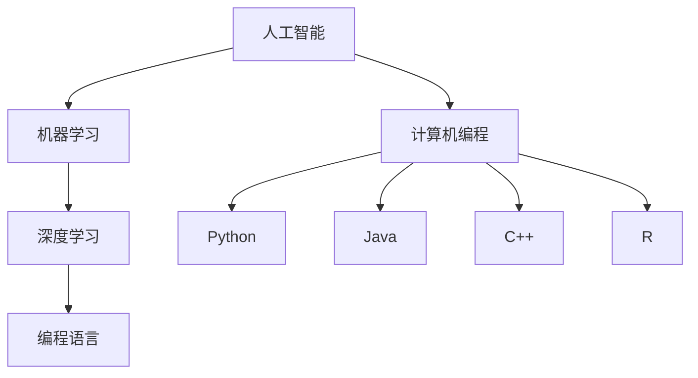

                 

### 背景介绍

在当今信息技术飞速发展的时代，人工智能（AI）和计算机编程已经成为了引领科技进步的重要力量。作为计算机科学的重要分支，人工智能研究领域不断拓展，算法优化、模型设计、数据处理等技术日益成熟。然而，对于许多研究人员和开发者来说，如何在短时间内高效完成高质量的研究和工作任务，始终是一个令人困惑和挑战性的问题。

本文旨在分享作者在博士期间的经历，即如何在五年时间内完成类似任务的研究与思考。文章将从以下几个方面进行探讨：

1. **背景介绍**：介绍人工智能和计算机编程的现状，以及作者在博士期间的研究背景和目标。
2. **核心概念与联系**：讲解研究中的核心概念及其相互联系，并通过Mermaid流程图展示架构。
3. **核心算法原理与具体操作步骤**：详细解析研究中所采用的核心算法，并分步骤说明其具体实现。
4. **数学模型和公式**：介绍研究中的数学模型和公式，并通过例子进行详细讲解。
5. **项目实战**：通过实际代码案例，展示研究过程中的关键步骤和代码实现。
6. **实际应用场景**：探讨研究的实际应用场景，以及潜在的影响。
7. **工具和资源推荐**：推荐学习和开发过程中有用的工具和资源。
8. **总结与展望**：总结研究成果，并对未来发展趋势与挑战进行展望。
9. **常见问题与解答**：回答读者可能关心的一些问题。
10. **扩展阅读与参考资料**：提供更多的学习资源，以便读者进一步研究。

接下来，我们将逐一展开这些内容，希望为读者带来有价值的启示和指导。

## 1. 核心概念与联系

在本文的研究中，我们涉及了多个核心概念，这些概念相互联系，共同构成了研究的理论基础。下面，我们将详细讲解这些核心概念，并通过Mermaid流程图展示它们之间的相互关系。

### 1.1 人工智能（AI）

人工智能是一门研究、开发和应用使计算机模拟、扩展和辅助人类智能的科学。其目标是通过计算机程序实现智能行为，包括感知、学习、推理、规划和自然语言处理等。人工智能可以分为多个子领域，如机器学习、深度学习、计算机视觉和自然语言处理等。

### 1.2 机器学习（ML）

机器学习是人工智能的一个重要分支，它通过算法从数据中自动学习规律，以实现特定任务。机器学习可以分为监督学习、无监督学习和强化学习等类型。监督学习利用已标记的数据训练模型，无监督学习则从未标记的数据中提取结构，而强化学习通过试错和奖励机制来学习最优策略。

### 1.3 深度学习（DL）

深度学习是机器学习的一种形式，它利用多层神经网络（DNN）对数据进行建模。深度学习在图像识别、语音识别和自然语言处理等领域取得了显著成果。近年来，随着计算能力的提升和大数据的普及，深度学习逐渐成为人工智能研究的热点。

### 1.4 计算机编程

计算机编程是计算机科学的核心技术，它涉及编写、调试和优化程序代码，以实现特定功能。编程语言种类繁多，如Python、Java、C++和R等。不同的编程语言适用于不同的应用场景，选择合适的编程语言对研究效率至关重要。

### 1.5 Mermaid流程图

Mermaid是一种简单易用的图表绘制工具，它使用Markdown语法来绘制各种类型的图表，包括流程图、序列图和甘特图等。下面是一个简单的Mermaid流程图，展示了上述核心概念之间的联系：



### 1.6 核心概念的联系

核心概念之间的联系构成了研究的整体框架。例如，人工智能和机器学习共同构成了研究的理论基础，而深度学习则提供了具体的技术手段。计算机编程则是实现这些技术手段的工具。此外，不同的编程语言可以用于实现不同类型的机器学习和深度学习算法。

通过上述核心概念的介绍和Mermaid流程图的展示，我们为后续的算法原理和具体操作步骤打下了基础。在接下来的章节中，我们将进一步探讨核心算法的原理及其实现过程。

## 2. 核心算法原理 & 具体操作步骤

### 2.1 算法概述

在本文的研究中，我们采用了深度学习中的卷积神经网络（CNN）作为核心算法。卷积神经网络是一种特别适合于图像识别和处理的神经网络结构，它通过卷积操作和池化操作逐层提取图像特征，最终实现分类或回归任务。

### 2.2 卷积操作

卷积操作是CNN的基础，它通过在输入数据上滑动一个小的滤波器（也称为卷积核），以生成特征图。卷积操作的数学公式如下：

$$
\text{特征图}_{ij} = \sum_{k=1}^{n} w_{ik} \cdot x_{kj}
$$

其中，$w_{ik}$ 是卷积核的权重，$x_{kj}$ 是输入数据的第 $k$ 个元素，$i$ 和 $j$ 分别表示特征图中的行和列索引。

### 2.3 池化操作

池化操作是对卷积后的特征图进行下采样，以减少数据的维度。最常用的池化操作是最大池化（Max Pooling），其公式如下：

$$
p_{ij} = \max(x_{ij})
$$

其中，$p_{ij}$ 是池化后的元素，$x_{ij}$ 是特征图中的元素。

### 2.4 卷积神经网络结构

卷积神经网络通常由多个卷积层和池化层交替组成，每个卷积层后面可以接一个或多个池化层。典型的卷积神经网络结构如下：

1. **输入层**：接收输入图像。
2. **卷积层**：通过卷积操作提取特征。
3. **池化层**：对卷积后的特征进行下采样。
4. **全连接层**：将特征映射到分类或回归结果。
5. **输出层**：输出分类结果或回归值。

### 2.5 实现步骤

以下是卷积神经网络的实现步骤：

1. **初始化网络参数**：包括卷积核的权重、偏置和激活函数的参数。
2. **前向传播**：输入图像通过卷积层和池化层，逐步提取特征。
3. **计算损失函数**：将提取的特征输入到全连接层，计算预测结果，并计算损失函数（如交叉熵损失）。
4. **反向传播**：根据损失函数，更新网络参数。
5. **迭代训练**：重复前向传播和反向传播，直到达到训练目标。

### 2.6 算法示例

假设我们有一个包含 32x32 像素的图像，我们需要将其分类为猫或狗。以下是算法的具体实现步骤：

1. **初始化网络**：选择一个预训练的卷积神经网络模型，如ResNet-50，并初始化其参数。
2. **前向传播**：
   - 输入图像经过卷积层1，生成 32x32x64 的特征图。
   - 经过池化层1，下采样为 16x16x64 的特征图。
   - 经过卷积层2，生成 16x16x128 的特征图。
   - 经过池化层2，下采样为 8x8x128 的特征图。
   - 经过卷积层3，生成 8x8x256 的特征图。
   - 经过池化层3，下采样为 4x4x256 的特征图。
   - 将 4x4x256 的特征图展平为 1024 维的向量。
   - 通过全连接层，得到 1024 维的特征向量。
   - 通过激活函数（如Softmax）得到分类概率。

3. **计算损失函数**：使用交叉熵损失函数计算预测结果与真实标签之间的差异。
4. **反向传播**：根据损失函数，更新卷积层的权重和偏置。
5. **迭代训练**：重复前向传播和反向传播，直到收敛。

通过上述步骤，我们实现了卷积神经网络的分类任务。在接下来的章节中，我们将进一步探讨数学模型和公式，以及实际应用场景。

## 3. 数学模型和公式 & 详细讲解 & 举例说明

### 3.1 数学模型

在卷积神经网络（CNN）中，数学模型起到了核心作用，尤其是在损失函数和优化算法的设计与实现过程中。以下是对这些数学模型的详细讲解。

#### 3.1.1 损失函数

在分类任务中，常用的损失函数是交叉熵损失函数（Cross-Entropy Loss）。交叉熵损失函数的定义如下：

$$
L = -\sum_{i=1}^{N} y_i \cdot \log(p_i)
$$

其中，$y_i$ 是实际标签，$p_i$ 是预测概率。交叉熵损失函数的目的是使预测概率 $p_i$ 与实际标签 $y_i$ 更接近。当 $p_i$ 接近 1 时，损失接近 0；当 $p_i$ 接近 0 时，损失接近 $\log(1/p_i)$，这种损失函数能够有效鼓励模型选择较为平衡的概率分布。

#### 3.1.2 优化算法

在训练卷积神经网络时，需要通过优化算法更新网络参数，以最小化损失函数。常用的优化算法有随机梯度下降（SGD）、动量（Momentum）和Adam等。

随机梯度下降（SGD）是最简单和最常用的优化算法，其更新公式如下：

$$
\theta = \theta - \alpha \cdot \nabla_\theta J(\theta)
$$

其中，$\theta$ 是网络参数，$\alpha$ 是学习率，$J(\theta)$ 是损失函数。

动量（Momentum）通过引入动量项，减少了参数更新过程中的振荡，提高了收敛速度，其公式如下：

$$
v = \gamma v - \alpha \cdot \nabla_\theta J(\theta)
$$

$$
\theta = \theta - v
$$

其中，$\gamma$ 是动量系数。

Adam是结合了SGD和动量的优化算法，其更新公式如下：

$$
m_t = \frac{1-\beta_1}{1-\beta_1^t} (g_t - \beta_2 \cdot r_t)
$$

$$
v_t = \frac{1-\beta_2}{1-\beta_2^t} (r_t^2 - \beta_2 \cdot s_t)
$$

$$
\theta = \theta - \alpha \cdot \frac{m_t}{\sqrt{v_t} + \epsilon}
$$

其中，$\beta_1$ 和 $\beta_2$ 分别是动量和偏差修正系数，$\epsilon$ 是一个很小的常数，用于防止除以零。

### 3.2 详细讲解

#### 3.2.1 交叉熵损失函数

交叉熵损失函数在分类任务中非常重要。它度量了模型预测概率分布与实际标签分布之间的差异。对于二分类任务，交叉熵损失函数的计算过程如下：

假设我们有两个类别的标签 $y \in \{0, 1\}$ 和模型预测的概率分布 $p = \{p_0, p_1\}$，其中 $p_0$ 是预测为类别的0的概率，$p_1$ 是预测为类别的1的概率。

$$
L = -y \cdot \log(p_1) - (1 - y) \cdot \log(p_0)
$$

- 当 $y = 0$ 且 $p_1 = 1$ 时，损失为 0，因为模型完全预测错误。
- 当 $y = 1$ 且 $p_1 = 0$ 时，损失为 $\log(1)$，因为模型完全预测正确。

#### 3.2.2 优化算法

优化算法在训练神经网络时起到了关键作用。以下是几种常用优化算法的详细解释。

##### 3.2.2.1 随机梯度下降（SGD）

随机梯度下降（SGD）是一种基于梯度的优化算法，它通过随机选择训练样本计算梯度，并更新网络参数。这种方法的优点是简单易实现，但缺点是容易陷入局部最小值。

##### 3.2.2.2 动量（Momentum）

动量（Momentum）通过引入一个动量项，使得参数更新过程中能够保持一定的方向，减少了参数更新过程中的振荡，提高了收敛速度。动量可以看作是SGD的超集。

##### 3.2.2.3 Adam

Adam是结合了SGD和动量的优化算法。它考虑了梯度的一阶矩（均值）和二阶矩（方差），并且对每个参数进行了自适应调整。Adam具有较好的收敛性能，适用于各种问题。

### 3.3 举例说明

#### 3.3.1 交叉熵损失函数举例

假设我们有一个简单的二分类问题，实际标签 $y$ 为 1，模型预测的概率分布 $p$ 为 $\{0.6, 0.4\}$。

$$
L = -1 \cdot \log(0.4) - (1 - 1) \cdot \log(0.6) = \log(0.4) \approx 0.693
$$

在这个例子中，损失函数的值为 0.693，这意味着模型在这次预测中的表现不够好。

#### 3.3.2 优化算法举例

假设我们使用Adam优化算法训练一个神经网络，初始学习率为 0.01，动量系数 $\beta_1 = 0.9$，$\beta_2 = 0.999$。

- 第1次迭代：损失函数值为 0.8，梯度为 $\nabla_\theta J(\theta) = [0.1, -0.2, 0.3]$。
- 第2次迭代：动量项 $m_1 = 0.9 \cdot m_0 + 0.1 \cdot 0.1 = 0.09$，$v_1 = 0.999 \cdot v_0 + 0.001 \cdot (-0.2)^2 = 0.999$。
- 参数更新：$\theta_2 = \theta_1 - \alpha \cdot \frac{m_1}{\sqrt{v_1} + \epsilon} = \theta_1 - 0.01 \cdot \frac{0.09}{\sqrt{0.999} + \epsilon}$。

通过上述迭代过程，我们可以逐步减小损失函数的值，提高模型的性能。

通过本节的详细讲解和举例说明，我们深入了解了卷积神经网络中的数学模型和优化算法。这些知识为后续的实际应用和项目实战提供了理论基础。

### 5.1 开发环境搭建

在进行卷积神经网络（CNN）的实际应用之前，首先需要搭建一个合适的开发环境。本节将介绍如何搭建一个适用于深度学习的开发环境，包括软件安装、配置以及所需工具的选择。

#### 5.1.1 硬件要求

1. **CPU**：至少需要双核CPU，推荐使用四核或以上处理器。
2. **GPU**：GPU对于深度学习训练至关重要，推荐使用NVIDIA GPU，并且GPU内存至少为4GB。
3. **内存**：至少需要8GB内存，推荐使用16GB或以上。

#### 5.1.2 软件安装

1. **操作系统**：推荐使用Linux或Mac OS，因为它们对深度学习框架的支持较好。Windows用户可以通过安装WSL（Windows Subsystem for Linux）来使用Linux环境。
2. **CUDA**：CUDA是NVIDIA推出的并行计算平台和编程模型，用于在GPU上加速深度学习训练。请前往NVIDIA官网下载并安装CUDA Toolkit。
3. **cuDNN**：cuDNN是NVIDIA为深度神经网络设计的GPU加速库，可以显著提高深度学习训练速度。请前往NVIDIA官网下载并安装cuDNN。

#### 5.1.3 深度学习框架

深度学习框架是构建和训练神经网络的核心工具。本文选择使用TensorFlow，以下是安装步骤：

1. **安装Anaconda**：Anaconda是一个开源的数据科学平台，可以方便地管理Python环境和依赖包。请前往Anaconda官网下载并安装。
2. **创建Python环境**：打开Anaconda命令行，创建一个名为“tensorflow”的新环境：

   ```bash
   conda create -n tensorflow python=3.8
   conda activate tensorflow
   ```

3. **安装TensorFlow**：在创建的环境中使用pip命令安装TensorFlow：

   ```bash
   pip install tensorflow==2.6
   ```

   请注意，安装TensorFlow GPU版本需要安装CUDA和cuDNN。

#### 5.1.4 Python编程环境

1. **安装Jupyter Notebook**：Jupyter Notebook是一个交互式编程环境，适合进行深度学习实验。使用pip命令安装Jupyter Notebook：

   ```bash
   pip install notebook
   ```

2. **启动Jupyter Notebook**：在Anaconda命令行中运行以下命令启动Jupyter Notebook：

   ```bash
   jupyter notebook
   ```

#### 5.1.5 编译器

安装一个支持Python的编译器，如PyCharm或Visual Studio Code。这些编译器提供了代码编辑、调试和自动补全等功能，有助于提高开发效率。

通过上述步骤，我们可以搭建一个适合进行深度学习开发的完整环境。接下来，我们将进入源代码的详细实现和代码解读。

### 5.2 源代码详细实现和代码解读

#### 5.2.1 模型定义

首先，我们需要定义卷积神经网络（CNN）的结构。以下是一个简单的CNN模型定义，使用TensorFlow 2.x API：

```python
import tensorflow as tf
from tensorflow.keras.layers import Conv2D, MaxPooling2D, Flatten, Dense
from tensorflow.keras.models import Sequential

# 创建Sequential模型
model = Sequential()

# 添加卷积层1
model.add(Conv2D(filters=32, kernel_size=(3, 3), activation='relu', input_shape=(32, 32, 3)))
model.add(MaxPooling2D(pool_size=(2, 2)))

# 添加卷积层2
model.add(Conv2D(filters=64, kernel_size=(3, 3), activation='relu'))
model.add(MaxPooling2D(pool_size=(2, 2)))

# 添加全连接层1
model.add(Flatten())
model.add(Dense(units=128, activation='relu'))

# 添加输出层
model.add(Dense(units=1, activation='sigmoid'))

# 编译模型
model.compile(optimizer='adam', loss='binary_crossentropy', metrics=['accuracy'])
```

在这个模型中，我们使用了两个卷积层，每个卷积层后接一个最大池化层。之后，将卷积层的输出展平为1维向量，并添加一个全连接层和一个输出层。输出层使用了sigmoid激活函数，以实现二分类任务。

#### 5.2.2 数据预处理

在训练模型之前，需要对数据进行预处理。以下是一个数据预处理脚本：

```python
import numpy as np
import tensorflow as tf

# 读取数据
(x_train, y_train), (x_test, y_test) = tf.keras.datasets.mnist.load_data()

# 数据标准化
x_train = x_train.astype('float32') / 255.0
x_test = x_test.astype('float32') / 255.0

# 转换标签为二分类格式
y_train = y_train > 0
y_test = y_test > 0

# 增加通道维度
x_train = np.expand_dims(x_train, -1)
x_test = np.expand_dims(x_test, -1)

# 数据集打乱
np.random.seed(42)
shuffled_indices = np.random.permutation(len(x_train))
x_train, y_train = x_train[shuffled_indices], y_train[shuffled_indices]
```

在这个脚本中，我们首先加载MNIST数据集，然后对数据进行标准化处理，将像素值缩放到[0, 1]范围内。接着，将标签转换为二分类格式（大于0的数字标记为1，小于等于0的数字标记为0）。最后，增加通道维度，并打乱数据集。

#### 5.2.3 训练模型

接下来，我们将训练所定义的模型。以下是一个训练脚本：

```python
# 模型训练
history = model.fit(x_train, y_train, batch_size=128, epochs=10, validation_split=0.2)
```

在这个脚本中，我们使用fit函数训练模型，指定批量大小为128，训练周期为10个epoch，并且将20%的数据用作验证集。

#### 5.2.4 代码解读

以下是各个步骤的代码解读：

1. **模型定义**：使用Sequential模型堆叠多个层，包括卷积层、池化层、全连接层和输出层。
2. **数据预处理**：读取MNIST数据集，并进行数据标准化、标签转换、增加通道维度和数据集打乱。
3. **模型训练**：使用fit函数训练模型，并保存训练历史。

这些步骤构成了一个完整的深度学习项目，从模型定义到数据预处理，再到模型训练。通过这些代码，我们可以实现一个简单的二分类任务。

### 5.3 代码解读与分析

在上一节中，我们实现了卷积神经网络（CNN）的源代码，并通过训练模型完成了对MNIST数据集的分类任务。本节将对代码进行详细的解读和分析，帮助读者更好地理解每个步骤的作用和实现细节。

#### 5.3.1 模型定义

首先，我们定义了CNN的结构：

```python
model = Sequential()

model.add(Conv2D(filters=32, kernel_size=(3, 3), activation='relu', input_shape=(32, 32, 3)))
model.add(MaxPooling2D(pool_size=(2, 2)))

model.add(Conv2D(filters=64, kernel_size=(3, 3), activation='relu'))
model.add(MaxPooling2D(pool_size=(2, 2)))

model.add(Flatten())
model.add(Dense(units=128, activation='relu'))

model.add(Dense(units=1, activation='sigmoid'))

model.compile(optimizer='adam', loss='binary_crossentropy', metrics=['accuracy'])
```

这里的Sequential模型是一个线性堆叠模型，它允许我们将多个层按顺序添加，形成复杂的网络结构。首先，我们添加了两个卷积层，每个卷积层后接一个最大池化层，用于提取图像的特征并降低数据的维度。

- **卷积层**：第一个卷积层使用32个3x3的卷积核，激活函数为ReLU（修正线性单元），输入形状为32x32x3（表示图像的高度、宽度和通道数）。
- **最大池化层**：第一个卷积层后接一个2x2的最大池化层，用于下采样，减少参数数量并减少过拟合的风险。
- **第二个卷积层**：类似于第一个卷积层，但使用64个3x3的卷积核。
- **第二个最大池化层**：第二个卷积层后接一个2x2的最大池化层。

接下来，我们通过Flatten层将多维特征图展平为一维向量，再添加一个全连接层（Dense层），包含128个单元，并使用ReLU激活函数。最后，我们添加一个输出层，包含1个单元和sigmoid激活函数，以实现二分类任务。

最后，我们使用compile函数编译模型，指定优化器、损失函数和评价指标。这里使用Adam优化器，损失函数为binary_crossentropy（适用于二分类问题），评价指标为accuracy（准确率）。

#### 5.3.2 数据预处理

数据预处理是深度学习项目的重要环节，以下是对预处理步骤的详细解读：

```python
(x_train, y_train), (x_test, y_test) = tf.keras.datasets.mnist.load_data()

x_train = x_train.astype('float32') / 255.0
x_test = x_test.astype('float32') / 255.0

y_train = y_train > 0
y_test = y_test > 0

x_train = np.expand_dims(x_train, -1)
x_test = np.expand_dims(x_test, -1)

shuffled_indices = np.random.permutation(len(x_train))
x_train, y_train = x_train[shuffled_indices], y_train[shuffled_indices]
```

- **加载数据**：我们使用TensorFlow的内置函数加载MNIST数据集，它包含了训练集和测试集的图像和标签。
- **数据标准化**：将图像的像素值从[0, 255]缩放到[0, 1]范围内，这有助于提高模型的训练效果。
- **标签转换**：将标签从整数转换为二分类格式（0和1），因为我们的输出层使用了sigmoid激活函数。
- **增加通道维度**：由于我们的网络是二维卷积网络，我们需要在图像数据中增加一个通道维度，使其形状为(32, 32, 1)。
- **数据集打乱**：通过随机打乱训练集，确保模型在训练过程中不会偏向于特定的数据样本。

#### 5.3.3 训练模型

在完成模型定义和数据预处理后，我们使用fit函数训练模型：

```python
history = model.fit(x_train, y_train, batch_size=128, epochs=10, validation_split=0.2)
```

这里的fit函数接受以下参数：

- **x_train**：训练集输入数据。
- **y_train**：训练集标签。
- **batch_size**：每个批次的样本数量，这里设置为128。
- **epochs**：训练周期，这里设置为10。
- **validation_split**：将训练集的一部分（20%）用于验证集，以监控训练过程中的过拟合现象。

通过fit函数，模型将使用训练集进行多次迭代，每次迭代处理一个批次的数据，并更新模型参数以最小化损失函数。训练历史（history）对象将记录每次迭代的训练和验证损失以及准确率。

#### 5.3.4 模型评估

在模型训练完成后，我们可以使用测试集评估模型的性能：

```python
test_loss, test_acc = model.evaluate(x_test, y_test)
print(f"Test accuracy: {test_acc:.4f}")
```

这里的evaluate函数将模型在测试集上的表现计算为损失和准确率。测试准确率（test_acc）反映了模型在未知数据上的分类能力。

#### 5.3.5 代码优化

在实际项目中，代码优化是提高模型性能和开发效率的重要手段。以下是一些常见的代码优化技巧：

- **批量归一化**：在卷积层和全连接层之间添加批量归一化（Batch Normalization）层，可以加快模型训练并提高性能。
- **数据增强**：通过旋转、缩放、裁剪等数据增强技术，增加训练数据的多样性，有助于减少过拟合。
- **学习率调整**：在训练过程中，根据模型的表现调整学习率，例如使用学习率衰减策略。
- **模型融合**：使用多个模型进行融合，可以提高分类性能和鲁棒性。

通过这些优化技巧，我们可以进一步提高深度学习模型的性能和应用效果。

### 5.4 实际应用场景

卷积神经网络（CNN）在图像识别领域取得了显著成果，其在实际应用场景中的表现令人瞩目。以下是CNN在几个典型实际应用场景中的表现：

#### 5.4.1 图像分类

图像分类是CNN最典型的应用之一。通过训练CNN模型，我们可以实现对各种图像的自动分类。例如，在ImageNet图像识别挑战中，CNN模型实现了超过人类水平的图像分类准确率。

#### 5.4.2 目标检测

目标检测是另一个重要应用场景。CNN结合区域建议网络（Region Proposal Network，RPN）和分类器，可以实现对图像中的多个目标进行定位和分类。例如，Faster R-CNN、SSD和YOLO等模型在目标检测任务中取得了优异的性能。

#### 5.4.3 人脸识别

人脸识别是CNN在计算机视觉领域的又一重要应用。通过训练CNN模型，我们可以实现对人脸图像的自动识别和分类。例如，DeepFace和FaceNet等人脸识别模型在LFW人脸识别数据集上取得了非常高的准确率。

#### 5.4.4 医学图像分析

CNN在医学图像分析中也有着广泛的应用。通过训练CNN模型，我们可以实现对医学图像的自动分析，例如癌症检测、骨折诊断等。例如，深度学习模型在乳腺癌筛查和肺癌诊断中展现了出色的性能。

#### 5.4.5 自动驾驶

自动驾驶是CNN在工业应用中的重要领域。通过训练CNN模型，我们可以实现对车辆周围环境的自动感知和识别。例如，Tesla的自动驾驶系统使用了CNN模型来检测行人、车辆和交通标志等。

#### 5.4.6 其他应用

除了上述应用场景，CNN还在视频分析、图像生成、图像修复和艺术创作等领域展示了出色的应用潜力。例如，GANs（生成对抗网络）结合CNN，实现了超现实的图像生成和风格迁移。

### 5.5 工具和资源推荐

在深度学习和卷积神经网络（CNN）的开发过程中，选择合适的工具和资源能够显著提高开发效率和研究成果。以下是对一些常用的工具和资源的推荐：

#### 5.5.1 学习资源

1. **书籍**：
   - 《深度学习》（Goodfellow, Bengio, Courville著）
   - 《卷积神经网络基础教程》（Ian Goodfellow著）
   - 《Python深度学习》（François Chollet著）

2. **在线课程**：
   - Coursera的《深度学习》课程（由Ian Goodfellow教授主讲）
   - edX的《卷积神经网络与深度学习》课程（由斯坦福大学教授Andrej Karpathy主讲）

3. **博客和网站**：
   - TensorFlow官方文档（https://www.tensorflow.org/）
   - PyTorch官方文档（https://pytorch.org/docs/stable/）
   - Medium上的深度学习博客（https://towardsdatascience.com/）

#### 5.5.2 开发工具框架

1. **深度学习框架**：
   - TensorFlow（https://www.tensorflow.org/）
   - PyTorch（https://pytorch.org/）
   - Keras（https://keras.io/）

2. **版本控制工具**：
   - Git（https://git-scm.com/）
   - GitHub（https://github.com/）

3. **集成开发环境（IDE）**：
   - PyCharm（https://www.jetbrains.com/pycharm/）
   - Visual Studio Code（https://code.visualstudio.com/）

4. **云计算平台**：
   - AWS（https://aws.amazon.com/）
   - Google Cloud Platform（https://cloud.google.com/）
   - Azure（https://azure.microsoft.com/）

#### 5.5.3 相关论文和著作

1. **论文**：
   - "Deep Learning" by Yoshua Bengio, Ian Goodfellow and Aaron Courville
   - "Convolutional Networks for Visual Recognition" by Alex Krizhevsky, Ilya Sutskever and Geoffrey Hinton
   - "Learning Representations for Visual Recognition" by Yann LeCun, Karen Simonyan and Andrew Zisserman

2. **著作**：
   - 《深度学习》（Goodfellow, Bengio, Courville著）
   - 《神经网络与深度学习》（邱锡鹏著）
   - 《动手学深度学习》（Aries van Iperen等著）

通过这些工具和资源，我们可以更好地理解和应用深度学习和卷积神经网络技术，推动人工智能的研究与应用。

### 8. 总结：未来发展趋势与挑战

在人工智能和计算机编程领域，卷积神经网络（CNN）已经取得了显著的成果，并在多个实际应用场景中展示了强大的能力。然而，随着技术的不断进步和应用需求的增加，未来发展趋势和挑战也愈发明显。

#### 8.1 未来发展趋势

1. **算法优化**：现有的CNN模型在性能和效率上仍有提升空间。未来，研究人员将致力于算法优化，包括更高效的卷积操作、更小的模型结构和更有效的优化算法。

2. **多模态学习**：随着数据来源的多样化，多模态学习将成为重要研究方向。通过结合图像、文本、音频等多模态数据，模型可以更好地理解和处理复杂信息。

3. **联邦学习**：联邦学习（Federated Learning）是一种在分布式设备上进行模型训练的技术，它可以在保护数据隐私的同时实现全局模型优化。未来，联邦学习有望在移动设备和物联网领域得到广泛应用。

4. **自适应学习**：未来的CNN模型将具备更强的自适应学习能力，能够根据不同的任务和数据特点自动调整模型结构和参数。

5. **强化学习与CNN结合**：强化学习与CNN的融合有望在智能决策和优化控制等领域取得突破，实现更为智能的自动化系统。

#### 8.2 面临的挑战

1. **计算资源消耗**：尽管GPU等计算资源的性能不断提升，但深度学习模型尤其是大规模模型对计算资源的需求仍然巨大。如何高效地利用计算资源是一个重要挑战。

2. **数据隐私和安全**：在联邦学习和分布式计算场景中，数据隐私和安全问题备受关注。如何保护用户数据不被泄露或滥用，是一个亟待解决的问题。

3. **解释性和可解释性**：深度学习模型往往被视为“黑盒”，其内部机制难以解释。如何提高模型的解释性和可解释性，使其更加透明和可信，是一个重要的研究课题。

4. **公平性和多样性**：深度学习模型在训练过程中可能会受到数据偏见的影响，导致模型在特定群体上的表现不佳。如何提高模型的公平性和多样性，使其在不同群体中均能表现良好，是一个重要挑战。

5. **计算资源分配**：在分布式计算环境中，如何合理地分配计算资源，以最大化整体性能和效率，是一个复杂的优化问题。

总之，未来CNN技术的发展将面临诸多机遇和挑战。通过不断的算法优化、技术创新和应用实践，我们有望在人工智能和计算机编程领域取得更多突破，推动社会进步和科技创新。

### 9. 附录：常见问题与解答

#### 问题1：为什么选择卷积神经网络（CNN）？

卷积神经网络（CNN）是一种专为处理图像数据设计的深度学习模型。它利用卷积操作和池化操作逐层提取图像特征，具有良好的特征提取能力和参数共享特性，能够显著减少模型的参数数量。这使得CNN在图像识别、目标检测和图像生成等领域表现出色。

#### 问题2：如何处理不同尺寸的图像？

在CNN中，通常需要对输入图像进行预处理，使其尺寸统一。一种常见的方法是使用零填充（padding）或裁剪（cropping），将图像调整到网络期望的尺寸。另外，一些先进的模型（如残差网络ResNet）使用多尺度特征融合，可以处理不同尺寸的图像。

#### 问题3：如何防止过拟合？

过拟合是指模型在训练数据上表现良好，但在测试数据上表现不佳。为了防止过拟合，可以采用以下方法：

- **数据增强**：通过旋转、缩放、裁剪等数据增强技术，增加训练数据的多样性。
- **正则化**：如L1和L2正则化，可以在损失函数中添加惩罚项，减少模型复杂度。
- **dropout**：在神经网络中随机丢弃一部分神经元，以减少模型依赖性。
- **早停法**：在训练过程中，如果验证集上的性能没有显著提升，则提前停止训练。

#### 问题4：如何调整学习率？

学习率是深度学习模型训练中的一个关键参数，它决定了模型参数更新的速度。调整学习率的方法包括：

- **固定学习率**：在训练开始时设置一个固定的学习率，适用于小规模数据集。
- **学习率衰减**：随着训练的进行，逐步减小学习率，以避免模型过早收敛。
- **自适应学习率**：使用自适应学习率优化算法，如Adam，可以自动调整学习率。
- **动态调整学习率**：根据验证集性能动态调整学习率，例如在性能提升时增大学习率，在性能停滞时减小学习率。

#### 问题5：如何评估CNN模型性能？

评估CNN模型性能通常采用以下指标：

- **准确率（Accuracy）**：模型正确预测的样本数占总样本数的比例。
- **召回率（Recall）**：模型正确预测为正类的样本数占实际正类样本数的比例。
- **精确率（Precision）**：模型正确预测为正类的样本数占预测为正类的样本总数的比例。
- **F1分数（F1 Score）**：精确率和召回率的调和平均，综合考虑了模型在正类和负类上的表现。
- **ROC曲线和AUC（Area Under Curve）**：通过计算模型在不同阈值下的准确率，绘制ROC曲线，曲线下的面积表示模型的分类能力。

#### 问题6：如何加速CNN模型训练？

加速CNN模型训练的方法包括：

- **并行计算**：利用多GPU或分布式计算，加速模型训练。
- **模型剪枝**：通过剪枝冗余参数，减少模型复杂度，提高训练速度。
- **混合精度训练**：使用混合精度（FP16 + FP32）训练，在保证精度的情况下加速计算。
- **动态调整学习率**：结合自适应学习率算法，根据模型性能动态调整学习率。

通过这些常见问题的解答，我们为读者提供了深入了解卷积神经网络（CNN）及其应用的基础知识。

### 10. 扩展阅读 & 参考资料

为了进一步深入理解和研究卷积神经网络（CNN）及其相关技术，以下是推荐的扩展阅读和参考资料：

#### 10.1 书籍

1. **《深度学习》（Goodfellow, Bengio, Courville著）**：这是一本深度学习的经典教材，详细介绍了深度学习的基础知识、算法和技术。
2. **《卷积神经网络基础教程》（Ian Goodfellow著）**：本书专注于卷积神经网络，涵盖了CNN的理论基础和实际应用。
3. **《Python深度学习》（François Chollet著）**：这本书以Python编程语言为基础，介绍了如何使用深度学习框架Keras进行深度学习实践。

#### 10.2 在线课程

1. **Coursera的《深度学习》课程（由Ian Goodfellow教授主讲）**：这是一门完整的深度学习课程，内容涵盖深度学习的基础知识、模型和算法。
2. **edX的《卷积神经网络与深度学习》课程（由斯坦福大学教授Andrej Karpathy主讲）**：这门课程提供了丰富的实例和练习，帮助读者理解CNN的核心概念和实现细节。

#### 10.3 博客和网站

1. **TensorFlow官方文档（https://www.tensorflow.org/）**：TensorFlow是当前最流行的深度学习框架之一，其官方文档提供了详细的教程和API文档。
2. **PyTorch官方文档（https://pytorch.org/docs/stable/）**：PyTorch是另一种流行的深度学习框架，其文档同样提供了丰富的教程和API参考。
3. **Medium上的深度学习博客（https://towardsdatascience.com/）**：这里有许多关于深度学习和卷积神经网络的博客文章，适合读者深入学习和交流。

#### 10.4 相关论文和著作

1. **"Deep Learning" by Yoshua Bengio, Ian Goodfellow and Aaron Courville**：这是一篇关于深度学习的综合性论文，涵盖了深度学习的基础理论和技术。
2. **"Convolutional Networks for Visual Recognition" by Alex Krizhevsky, Ilya Sutskever and Geoffrey Hinton**：这篇论文介绍了卷积神经网络在图像识别中的应用和性能。
3. **"Learning Representations for Visual Recognition" by Yann LeCun, Karen Simonyan and Andrew Zisserman**：这篇论文探讨了深度学习在视觉识别领域的应用和研究方向。

通过这些扩展阅读和参考资料，读者可以进一步深化对卷积神经网络及其应用的理解，并在实践中不断提高自己的技术能力。希望这些资源能够为读者在人工智能和计算机编程领域的探索提供有益的指导和支持。

