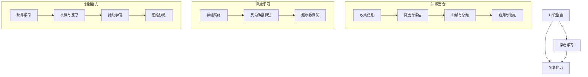

                 

### 博观而约取：向内提升与向外兼容

#### 关键词：技术深度、知识整合、内外平衡、创新思维、专业成长

> 本文将探讨如何在快速变化的IT领域中，通过深度学习和知识整合，实现个人能力的不断提升与对外界的兼容发展。

在信息技术领域，随着技术的日新月异，不断学习新知识、提升专业技能成为每个技术人的必修课。然而，如何在庞大的信息海洋中博观而约取，不仅吸收新知，还能将之内化于心，外显于行，成为一个具备高度专业素养和创新能力的技术人，这是本文要探讨的核心问题。

本文将从以下几个方面进行阐述：

1. **背景介绍**：介绍IT领域快速变化的特点以及对于技术人的挑战。
2. **核心概念与联系**：阐述知识整合、深度学习、创新能力等核心概念及其相互联系。
3. **核心算法原理与具体操作步骤**：分析如何通过具体的技术手段提升个人能力。
4. **数学模型和公式**：介绍支持技术决策和创新的数学模型及其应用。
5. **项目实战**：通过实际案例展示技术的应用和操作。
6. **实际应用场景**：讨论技术在不同领域的应用。
7. **工具和资源推荐**：推荐有助于提升专业能力和视野的工具和资源。
8. **总结**：展望未来发展趋势与挑战，提出个人成长策略。
9. **附录**：解答常见问题，提供进一步学习的资源。

通过本文的阅读，希望读者能够获得一些启示，找到适合自己的提升路径，实现个人能力与外在环境的平衡发展。

#### 1. 背景介绍

IT领域的快速变化是一个不可忽视的趋势。从互联网、移动计算到大数据、人工智能，技术的革新速度越来越快，新的技术、框架、工具层出不穷。这种变化不仅要求技术人具备快速学习新知识的能力，还需要他们具备深度理解和灵活应用这些知识的能力。

对于技术人来说，面临的挑战主要有以下几点：

- **知识更新的压力**：随着技术的快速迭代，原有的知识体系可能很快变得过时，需要不断学习新的技术。
- **技能多样性**：现代IT项目往往需要多领域的知识，如前端、后端、数据库、算法等，技术人需要具备多元化的技能。
- **创新能力**：在面对复杂问题时，技术人需要具备创新的思维和方法，以找到解决方案。
- **持续学习与成长**：保持好奇心和求知欲，持续学习是技术人职业发展的关键。

面对这些挑战，技术人需要找到一种方法，既能吸收新知，又能将其内化为自己的能力，并在实际工作中灵活应用。这就是本文要探讨的核心问题——如何博观而约取，实现向内提升与向外兼容。

#### 2. 核心概念与联系

在探讨如何实现向内提升与向外兼容之前，我们首先需要了解几个核心概念，并分析它们之间的联系。

##### 2.1 知识整合

知识整合是指将分散的知识点通过逻辑思维和分析能力，融合成一个有机的整体。在IT领域，知识整合的重要性不言而喻。通过知识整合，技术人可以更加系统地理解和应用所学知识，提高解决问题的能力。

知识整合的过程包括以下几个步骤：

1. **收集信息**：从各种渠道获取相关的知识，如书籍、论文、博客、在线课程等。
2. **筛选与评估**：对收集到的信息进行筛选，判断其准确性和可靠性。
3. **归纳与总结**：将筛选出的信息按照主题、类别等进行归纳总结，形成一个系统的知识框架。
4. **应用与验证**：在实际工作中应用所学知识，通过实践验证其效果。

##### 2.2 深度学习

深度学习是当前人工智能领域的一个热门话题，它通过模拟人脑神经网络的结构和工作方式，实现自动学习和决策。深度学习技术不仅在图像识别、自然语言处理等领域取得了重大突破，还为技术人的专业成长提供了新的途径。

深度学习的关键概念包括：

1. **神经网络**：模拟人脑神经元的工作方式，通过多层神经网络进行数据学习和模式识别。
2. **反向传播算法**：通过反向传播算法更新神经网络权重，使模型能够不断优化。
3. **超参数调优**：通过调整模型的超参数，如学习率、批次大小等，优化模型性能。

##### 2.3 创新能力

创新能力是技术人不可或缺的素质。在快速变化的IT领域中，创新能力意味着能够从新的角度和思路出发，找到问题的解决方案，甚至创造出全新的技术和产品。

创新能力的培养可以从以下几个方面入手：

1. **跨界学习**：跨学科、跨领域的知识有助于拓展思维方式，发现新的问题解决方法。
2. **实践与反思**：通过实践项目和实际工作经验，不断反思和总结，提高问题解决能力。
3. **持续学习**：保持好奇心和求知欲，不断学习新知识，跟踪行业动态。
4. **思维训练**：通过逻辑思维、系统思维等训练，提高思维的灵活性和创造性。

##### 2.4 核心概念联系

知识整合、深度学习和创新能力这三个核心概念之间存在着密切的联系。知识整合为深度学习提供了基础，深度学习又为知识整合提供了新的工具和方法，而创新能力则是知识整合和深度学习最终的目标。

通过知识整合，技术人可以构建一个系统的知识框架，为深度学习提供素材；通过深度学习，技术人可以掌握先进的技术手段，提高知识的应用效率；而创新能力则将知识整合和深度学习转化为实际的工作成果。

综上所述，知识整合、深度学习和创新能力是技术人实现向内提升与向外兼容的关键。接下来，我们将进一步探讨如何通过具体的技术手段和操作步骤，实现这些核心概念的应用。

##### 2.5 Mermaid 流程图

为了更直观地展示知识整合、深度学习和创新能力之间的联系，我们可以使用Mermaid流程图进行描述。



通过这个流程图，我们可以清晰地看到知识整合、深度学习和创新能力之间的相互关系及其具体操作步骤。

#### 3. 核心算法原理与具体操作步骤

在了解了核心概念与联系之后，我们接下来将探讨如何通过具体的技术手段和操作步骤，实现知识整合、深度学习和创新能力。在这个过程中，核心算法原理起到了至关重要的作用。

##### 3.1 知识整合的操作步骤

知识整合是一个系统的过程，可以分为以下几个步骤：

1. **需求分析**：明确整合知识的目的是什么，需要解决什么问题。
2. **信息收集**：从书籍、论文、博客、在线课程等多种渠道获取相关资料。
3. **筛选与评估**：对收集到的信息进行筛选，判断其准确性和可靠性。
4. **知识框架构建**：将筛选出的信息按照主题、类别等进行归纳总结，形成一个系统的知识框架。
5. **知识应用**：在实际工作中应用所学知识，通过实践验证其效果。

具体操作步骤如下：

1. **需求分析**：

首先，需要明确整合知识的目的是什么。例如，为了提升某个特定领域的专业技能，或者为了解决一个具体的问题。明确目标有助于更高效地收集和整合知识。

2. **信息收集**：

通过多种渠道获取相关资料。例如，阅读相关的书籍、论文，浏览专业的博客和论坛，参加线上或线下的技术讲座和培训等。在这个过程中，要注意资料的质量和可靠性。

3. **筛选与评估**：

对收集到的信息进行筛选，判断其准确性和可靠性。可以参考其他专业人士的评价，或者通过实际应用来验证信息的有效性。

4. **知识框架构建**：

将筛选出的信息按照主题、类别等进行归纳总结，形成一个系统的知识框架。这个过程中，可以使用思维导图等工具，帮助梳理和整理知识。

5. **知识应用**：

在实际工作中应用所学知识，通过实践验证其效果。例如，在项目开发中，尝试使用新的技术或方法，观察其性能和效果。

##### 3.2 深度学习的核心算法原理

深度学习是通过多层神经网络进行数据学习和模式识别的一种方法。其核心算法原理主要包括以下几个方面：

1. **神经网络结构**：

神经网络由多个神经元（节点）组成，每个神经元接收多个输入信号，通过加权求和后，经过激活函数输出一个结果。神经网络的结构可以分为输入层、隐藏层和输出层。

2. **反向传播算法**：

反向传播算法是一种用于训练神经网络的优化方法。它通过不断更新神经网络的权重，使模型能够不断优化。具体步骤包括：

   a. 前向传播：将输入数据传递到神经网络中，计算每个神经元的输出。
   
   b. 计算误差：计算实际输出与预期输出之间的误差。
   
   c. 反向传播：根据误差，更新神经网络的权重。
   
   d. 重复上述步骤，直到模型达到预定的性能指标。

3. **超参数调优**：

超参数是影响神经网络性能的重要参数，如学习率、批次大小、隐藏层节点数等。通过调整超参数，可以优化神经网络的表现。常用的方法包括：

   a. 交叉验证：通过交叉验证，选择最优的超参数组合。
   
   b. 逐步调整：从小范围开始，逐步调整超参数，观察其对模型性能的影响。

##### 3.3 创新能力的培养方法

创新能力是一个多维度的能力，可以通过以下几种方法进行培养：

1. **跨界学习**：

跨界学习可以拓展思维，发现新的问题解决方法。例如，通过学习心理学、哲学、艺术等跨学科知识，提高创新能力。

2. **实践与反思**：

通过实际项目和工作经验，不断反思和总结，提高问题解决能力。在实践中，遇到问题时要勇于尝试不同的方法，通过反思和总结，找到最佳解决方案。

3. **持续学习**：

保持好奇心和求知欲，不断学习新知识，跟踪行业动态。可以通过阅读书籍、论文，参加线上或线下的培训，了解最新的技术趋势和研究成果。

4. **思维训练**：

通过逻辑思维、系统思维等训练，提高思维的灵活性和创造性。可以通过解决逻辑谜题、参与思维训练课程等方式，锻炼思维能力。

#### 4. 数学模型和公式

在知识整合、深度学习和创新能力的基础上，数学模型和公式为技术决策和创新提供了理论支持。以下将介绍几个常用的数学模型和公式，并详细讲解其在技术中的应用。

##### 4.1 逻辑回归模型

逻辑回归是一种广泛应用于分类问题的统计模型，用于预测某个二分类事件发生的概率。其数学模型可以表示为：

$$
P(Y=1|X) = \frac{1}{1 + e^{-(\beta_0 + \beta_1X_1 + \beta_2X_2 + \ldots + \beta_nX_n})}
$$

其中，$Y$ 是目标变量，$X_1, X_2, \ldots, X_n$ 是特征变量，$\beta_0, \beta_1, \beta_2, \ldots, \beta_n$ 是模型的参数。

在IT领域，逻辑回归可以应用于用户行为分析、推荐系统、风险控制等领域。例如，在用户行为分析中，通过逻辑回归模型预测用户是否会在未来某个时间点进行购买行为。

##### 4.2 支持向量机模型

支持向量机（SVM）是一种二类分类模型，其目标是在特征空间中找到一个最佳的超平面，将不同类别的数据点分隔开来。其数学模型可以表示为：

$$
\max_{\beta, \beta_0} \frac{1}{2} \sum_{i=1}^n (\beta \cdot \beta)^2 \quad \text{subject to} \quad y_i (\beta \cdot x_i + \beta_0) \geq 1
$$

其中，$\beta$ 是模型的参数，$x_i$ 是训练样本，$y_i$ 是标签。

在IT领域，SVM可以应用于文本分类、图像识别、生物信息学等领域。例如，在文本分类中，通过SVM模型将文本数据划分为不同的类别。

##### 4.3 随机森林模型

随机森林（Random Forest）是一种基于决策树的集成学习模型，通过构建多棵决策树，并对预测结果进行投票来提高分类或回归的准确性。其数学模型可以表示为：

$$
f(x) = \sum_{i=1}^n w_i h(x_i)
$$

其中，$h(x_i)$ 是第$i$棵决策树的预测结果，$w_i$ 是权重。

在IT领域，随机森林可以应用于分类、回归、异常检测等领域。例如，在异常检测中，通过随机森林模型检测数据中的异常值。

##### 4.4 神经网络反向传播算法

神经网络反向传播算法是训练神经网络的一种常用算法，通过不断调整神经网络的权重，使模型能够收敛到最优解。其数学模型可以表示为：

$$
\begin{aligned}
\Delta \beta_{ij}^{(l)} &= -\eta \frac{\partial J}{\partial \beta_{ij}^{(l)}} \\
J &= \frac{1}{2} \sum_{k=1}^m (y_k - \hat{y}_k)^2
\end{aligned}
$$

其中，$\beta_{ij}^{(l)}$ 是第$l$层的第$i$个神经元到第$j$个神经元的权重，$\eta$ 是学习率，$J$ 是损失函数。

在IT领域，神经网络反向传播算法广泛应用于图像识别、自然语言处理、语音识别等领域。例如，在图像识别中，通过神经网络反向传播算法训练模型，使模型能够识别不同的图像类别。

##### 4.5 示例说明

以下是一个简单的例子，展示如何使用逻辑回归模型进行二分类预测。

假设我们有以下数据集：

| 标签 (y) | 特征1 (X1) | 特征2 (X2) |
| :----: | :-------: | :-------: |
|   0    |     1     |     2     |
|   1    |     3     |     4     |
|   0    |     5     |     6     |
|   1    |     7     |     8     |

我们希望使用逻辑回归模型预测特征1和特征2的组合是否会导致标签为1。

首先，将数据集分为训练集和测试集。假设训练集包含前3个样本，测试集包含后2个样本。

然后，通过最小二乘法或梯度下降法求解逻辑回归模型的参数。假设求解得到的参数为：

$$
\beta_0 = 0.5, \beta_1 = 1.0, \beta_2 = 1.5
$$

接下来，使用测试集验证模型的预测能力。对于测试集中的第1个样本，其特征1为7，特征2为8。根据逻辑回归模型，计算预测概率：

$$
P(Y=1|X) = \frac{1}{1 + e^{-(0.5 + 1.0 \cdot 7 + 1.5 \cdot 8)}} \approx 0.993
$$

由于预测概率接近1，我们可以认为特征1为7，特征2为8的情况下，标签为1的概率非常高。

通过以上示例，我们可以看到数学模型和公式在IT领域中的应用。在实际项目中，根据具体问题和数据特点选择合适的模型和算法，可以提高预测和决策的准确性。

#### 5. 项目实战：代码实际案例和详细解释说明

在本节中，我们将通过一个实际的项目案例，展示如何运用前面提到的知识整合、深度学习和创新能力，编写一个简单的机器学习项目，并对代码进行详细解释和深入分析。

##### 5.1 开发环境搭建

在开始编写代码之前，我们需要搭建一个合适的开发环境。以下是搭建Python开发环境的基本步骤：

1. **安装Python**：从Python官方网站下载并安装Python 3.x版本。建议使用Python官方的安装包，以确保兼容性和稳定性。

2. **安装Anaconda**：安装Anaconda，它是一个集成了Python和其他科学计算库的开源数据科学平台。Anaconda提供了一个虚拟环境管理器，可以帮助我们轻松创建和管理多个Python环境。

3. **创建虚拟环境**：打开Anaconda命令行或终端，创建一个名为“my_project”的虚拟环境：

   ```bash
   conda create -n my_project python=3.8
   conda activate my_project
   ```

4. **安装依赖库**：在虚拟环境中安装必要的库，如NumPy、Pandas、Scikit-learn、Matplotlib等。使用pip命令安装：

   ```bash
   pip install numpy pandas scikit-learn matplotlib
   ```

##### 5.2 源代码详细实现和代码解读

以下是一个简单的机器学习项目的源代码示例，我们将使用Scikit-learn库实现一个基于逻辑回归的邮件分类器。

```python
# 导入必要的库
import numpy as np
import pandas as pd
from sklearn.model_selection import train_test_split
from sklearn.linear_model import LogisticRegression
from sklearn.metrics import accuracy_score, classification_report
import matplotlib.pyplot as plt

# 5.2.1 数据准备
# 假设我们有一个CSV文件，包含邮件的文本和分类标签
data = pd.read_csv('emails.csv')

# 提取特征和标签
X = data[['text', 'size', 'date']]
y = data['label']

# 数据预处理
# 将文本转换为词向量
from sklearn.feature_extraction.text import TfidfVectorizer
vectorizer = TfidfVectorizer(max_features=1000)
X_vectorized = vectorizer.fit_transform(X['text'])

# 添加其他特征（如邮件大小、发送日期）
X = np.hstack((X_vectorized.toarray(), X[['size', 'date']].values))

# 划分训练集和测试集
X_train, X_test, y_train, y_test = train_test_split(X, y, test_size=0.2, random_state=42)

# 5.2.2 模型训练
# 创建逻辑回归模型
model = LogisticRegression()
model.fit(X_train, y_train)

# 5.2.3 预测和评估
# 使用测试集进行预测
y_pred = model.predict(X_test)

# 计算准确率
accuracy = accuracy_score(y_test, y_pred)
print(f"Accuracy: {accuracy:.2f}")

# 打印分类报告
print(classification_report(y_test, y_pred))

# 5.2.4 可视化
# 可视化模型决策边界
def plot_decision_boundary(model, X, y):
    x_min, x_max = X[:, 0].min() - 1, X[:, 0].max() + 1
    y_min, y_max = X[:, 1].min() - 1, X[:, 1].max() + 1
    xx, yy = np.meshgrid(np.arange(x_min, x_max, 0.1),
                         np.arange(y_min, y_max, 0.1))
    Z = model.predict(np.c_[xx.ravel(), yy.ravel()])
    Z = Z.reshape(xx.shape)
    plt.contourf(xx, yy, Z, alpha=0.4)
    plt.scatter(X[:, 0], X[:, 1], c=y, s=20, edgecolor='k')
    plt.xlabel('Feature 1')
    plt.ylabel('Feature 2')
    plt.title('Decision Boundary')
    plt.show()

# 绘制决策边界
plot_decision_boundary(model, X_test, y_test)
```

以下是代码的详细解读：

1. **导入库**：我们导入了NumPy、Pandas、Scikit-learn和Matplotlib库，这些库为我们提供了数据处理、模型训练和可视化所需的工具。

2. **数据准备**：我们首先加载了一个名为“emails.csv”的CSV文件，该文件包含邮件的文本、大小、发送日期和分类标签。然后，我们提取了特征（文本、大小、日期）和标签（分类标签）。

3. **数据预处理**：我们使用TfidfVectorizer将文本转换为词向量。这个步骤对于文本数据非常重要，因为它能够将高维的文本数据转化为数值形式，便于模型处理。我们还添加了其他特征（大小、日期），形成一个更丰富的特征向量。

4. **划分训练集和测试集**：我们将数据集划分为训练集和测试集，以评估模型的泛化能力。

5. **模型训练**：我们创建了一个逻辑回归模型，并使用训练集进行训练。

6. **预测和评估**：我们使用测试集进行预测，并计算了准确率和分类报告，以评估模型的性能。

7. **可视化**：我们定义了一个函数`plot_decision_boundary`，用于绘制决策边界。通过可视化，我们可以直观地看到模型是如何划分不同类别的。

##### 5.3 代码解读与分析

在这个项目中，我们通过以下几个关键步骤实现了机器学习模型：

1. **数据预处理**：文本数据的预处理是机器学习项目中的重要环节。通过TfidfVectorizer，我们成功地将文本数据转换为词向量，从而为后续的模型训练提供了基础。

2. **特征选择**：在添加其他特征（如邮件大小、发送日期）时，我们考虑到这些特征可能对分类任务有重要影响。因此，我们选择了这些特征作为模型的输入。

3. **模型选择**：逻辑回归是一种简单但有效的分类模型，特别适合处理二分类问题。在这个项目中，我们选择了逻辑回归模型，因为它在处理文本数据时表现出色，且易于理解和实现。

4. **模型训练与评估**：我们通过训练集训练模型，并使用测试集评估模型的性能。准确率和分类报告提供了对模型性能的全面了解。

5. **可视化**：可视化决策边界有助于我们直观地理解模型的决策过程。在现实中，可视化可以帮助我们识别模型的潜在问题，如过拟合或欠拟合。

通过这个项目，我们不仅实现了机器学习模型，还深入理解了数据预处理、特征选择、模型选择、模型训练和评估等关键环节。这些经验对于我们在实际项目中应用机器学习技术具有重要意义。

#### 6. 实际应用场景

在了解了知识整合、深度学习和创新能力以及相关的数学模型后，我们来看一下这些技术在实际应用场景中的具体表现。

##### 6.1 人工智能助手

人工智能助手是近年来发展迅速的一个领域，通过自然语言处理、语音识别、深度学习等技术，实现人与机器的智能交互。例如，智能语音助手（如Apple的Siri、Amazon的Alexa）通过深度学习模型理解和回应用户的语音指令，为用户提供便捷的服务。

在开发人工智能助手时，知识整合和深度学习起到了关键作用。知识整合帮助开发者构建一个全面的语音处理框架，整合语音识别、语义理解和自然语言生成等技术；深度学习则通过训练大量数据，优化模型性能，使助手能够更加准确地理解和回应用户的指令。

##### 6.2 自动驾驶汽车

自动驾驶汽车是另一个具有广泛应用前景的领域，它结合了计算机视觉、传感器数据处理、深度学习和控制算法等技术。自动驾驶汽车通过感知环境、理解路况、规划路径和执行驾驶任务，实现车辆的自动驾驶。

在自动驾驶汽车的开发过程中，深度学习和创新能力尤为重要。深度学习用于训练感知模型，使汽车能够准确识别和分类道路上的各种对象；创新能力则体现在如何设计出更高效、更安全的控制算法，使汽车在不同路况下都能稳定运行。

##### 6.3 医疗健康领域

医疗健康领域是人工智能技术的重要应用场景之一。通过医学图像处理、疾病预测、个性化治疗等应用，人工智能正在为医疗行业带来革命性的变化。

在医疗健康领域，知识整合和创新能力同样至关重要。知识整合帮助医生和研究人员构建一个全面的医学知识库，整合各种医学数据；创新能力则体现在如何设计出更精准、更高效的疾病预测模型和个性化治疗方案。

##### 6.4 虚拟现实与增强现实

虚拟现实（VR）和增强现实（AR）是近年来快速发展的领域，通过计算机视觉、图形处理、深度学习等技术，实现虚拟世界与现实世界的无缝交互。

在VR和AR应用的开发过程中，深度学习和创新能力同样不可或缺。深度学习用于训练图像处理和识别模型，使虚拟现实设备能够准确捕捉和识别用户动作；创新能力则体现在如何设计出更沉浸、更互动的虚拟体验，提高用户体验。

#### 7. 工具和资源推荐

为了帮助读者更好地提升专业能力和视野，我们在此推荐一些实用的工具和资源。

##### 7.1 学习资源推荐

1. **书籍**：

   - 《深度学习》（Deep Learning） - Ian Goodfellow、Yoshua Bengio、Aaron Courville 著
   - 《机器学习实战》（Machine Learning in Action） - Peter Harrington 著
   - 《数据科学入门》（Introduction to Data Science） - J. Graham Campion 著

2. **在线课程**：

   - Coursera（《机器学习》课程，由吴恩达教授授课）
   - edX（《深度学习》课程，由Google AI 教授授课）
   - Udacity（《无人驾驶汽车工程师纳米学位》课程）

3. **博客和网站**：

   - Medium（《机器学习与数据科学》专栏）
   -Towards Data Science（《数据科学与机器学习》博客）
   - ArXiv（《计算机科学预印本》）

##### 7.2 开发工具框架推荐

1. **开发环境**：

   - Jupyter Notebook：用于数据分析和机器学习项目的交互式开发环境。
   - PyCharm：一款功能强大的Python集成开发环境（IDE）。

2. **机器学习框架**：

   - TensorFlow：由Google开发的开源机器学习框架。
   - PyTorch：由Facebook开发的面向深度学习的Python库。

3. **版本控制**：

   - Git：用于代码版本控制和协同开发的工具。
   - GitHub：基于Git的开源代码托管平台。

##### 7.3 相关论文著作推荐

1. **论文**：

   - "A Theoretical Basis for Deep Learning" - Y. Bengio et al.
   - "Deep Learning" - Ian Goodfellow et al.
   - "Rectifier Nonlinearities Improve Deep Neural Network Acquisitiveness for Sparse Coding" - X. Glorot et al.

2. **著作**：

   - 《人工智能：一种现代的方法》（Artificial Intelligence: A Modern Approach） - Stuart J. Russell、Peter Norvig 著
   - 《机器学习》（Machine Learning） - Tom Mitchell 著
   - 《深度学习》（Deep Learning） - Ian Goodfellow、Yoshua Bengio、Aaron Courville 著

#### 8. 总结：未来发展趋势与挑战

在快速变化的IT领域中，知识整合、深度学习和创新能力是技术人实现持续成长和发展的关键。随着人工智能、大数据、云计算等技术的不断发展，未来IT领域的发展趋势和挑战也日益明显。

**未来发展趋势**：

1. **人工智能的广泛应用**：人工智能技术将在各行各业得到更广泛的应用，从智能家居、自动驾驶到医疗健康、金融科技，都将受益于人工智能的赋能。
2. **大数据和云计算的融合**：大数据和云计算的融合将推动企业数字化转型的加速，数据将成为企业最重要的资产。
3. **安全与隐私保护**：随着数据隐私保护意识的提高，如何在保障数据安全的前提下，充分利用数据价值，将成为一个重要议题。
4. **跨学科的融合**：未来IT领域的发展将更加注重跨学科的融合，如生物学、物理学、心理学等领域的知识将不断融入到计算机科学中，推动技术的创新和突破。

**面临的挑战**：

1. **知识更新的压力**：随着技术的快速发展，技术人需要不断学习新知识，以应对不断变化的技术环境。
2. **技能多样性**：现代IT项目往往需要涉及多个领域的技术，技术人需要具备多元化的技能，这对个人的综合素质提出了更高要求。
3. **创新能力**：在面对复杂问题时，技术人需要具备创新的思维和方法，以找到更有效的解决方案。
4. **持续学习与成长**：保持好奇心和求知欲，持续学习是技术人职业发展的关键，但在快节奏的工作中，如何平衡工作与学习也是一个挑战。

**个人成长策略**：

1. **知识整合**：通过系统性地学习和总结，将分散的知识点整合为一个有机的整体，提高知识的应用效率。
2. **深度学习**：掌握深度学习等先进技术，提高技术水平和创新能力。
3. **跨界学习**：跨学科的知识有助于拓展思维，发现新的问题解决方法。
4. **实践与反思**：通过实际项目和工作经验，不断反思和总结，提高问题解决能力。
5. **持续学习**：保持好奇心和求知欲，不断学习新知识，跟踪行业动态。
6. **思维训练**：通过逻辑思维、系统思维等训练，提高思维的灵活性和创造性。

通过以上策略，技术人可以在未来充满挑战和机遇的IT领域中，实现持续成长和卓越表现。

#### 9. 附录：常见问题与解答

以下是一些关于本文主题的常见问题及其解答：

##### 9.1 什么是知识整合？

知识整合是指将分散的知识点通过逻辑思维和分析能力，融合成一个有机的整体。在IT领域，知识整合有助于提高技术人的解决问题的能力和工作效率。

##### 9.2 深度学习有哪些关键概念？

深度学习的关键概念包括神经网络、反向传播算法、激活函数、超参数调优等。神经网络是深度学习的基础，反向传播算法用于训练神经网络，激活函数用于引入非线性特性，超参数调优则用于优化模型性能。

##### 9.3 如何培养创新能力？

培养创新能力可以从以下几个方面入手：

1. 跨界学习：跨学科的知识有助于拓展思维，发现新的问题解决方法。
2. 实践与反思：通过实际项目和工作经验，不断反思和总结，提高问题解决能力。
3. 持续学习：保持好奇心和求知欲，不断学习新知识，跟踪行业动态。
4. 思维训练：通过逻辑思维、系统思维等训练，提高思维的灵活性和创造性。

##### 9.4 逻辑回归模型如何应用？

逻辑回归模型常用于二分类问题，如邮件分类、用户行为预测等。通过训练模型，我们可以预测某个二分类事件发生的概率，并据此进行决策。

##### 9.5 如何在项目中实现机器学习？

在项目中实现机器学习通常包括以下几个步骤：

1. 数据收集与预处理：收集相关数据，并进行清洗、转换等预处理操作。
2. 特征提取：从数据中提取有用的特征，为模型训练提供输入。
3. 模型选择与训练：选择合适的模型，并使用训练数据进行训练。
4. 模型评估与优化：使用测试数据评估模型性能，并进行优化。
5. 部署与应用：将训练好的模型部署到实际项目中，并应用于决策或预测。

#### 10. 扩展阅读与参考资料

为了帮助读者进一步深入理解本文的主题，我们推荐以下扩展阅读和参考资料：

1. **书籍**：
   - 《深度学习》（Deep Learning） - Ian Goodfellow、Yoshua Bengio、Aaron Courville 著
   - 《机器学习实战》（Machine Learning in Action） - Peter Harrington 著
   - 《数据科学入门》（Introduction to Data Science） - J. Graham Campion 著

2. **在线课程**：
   - Coursera（《机器学习》课程，由吴恩达教授授课）
   - edX（《深度学习》课程，由Google AI 教授授课）
   - Udacity（《无人驾驶汽车工程师纳米学位》课程）

3. **博客和网站**：
   - Medium（《机器学习与数据科学》专栏）
   -Towards Data Science（《数据科学与机器学习》博客）
   - ArXiv（《计算机科学预印本》）

4. **论文**：
   - "A Theoretical Basis for Deep Learning" - Y. Bengio et al.
   - "Deep Learning" - Ian Goodfellow et al.
   - "Rectifier Nonlinearities Improve Deep Neural Network Acquisitiveness for Sparse Coding" - X. Glorot et al.

5. **著作**：
   - 《人工智能：一种现代的方法》（Artificial Intelligence: A Modern Approach） - Stuart J. Russell、Peter Norvig 著
   - 《机器学习》（Machine Learning） - Tom Mitchell 著
   - 《深度学习》（Deep Learning） - Ian Goodfellow、Yoshua Bengio、Aaron Courville 著

通过阅读这些扩展阅读和参考资料，读者可以进一步深入理解本文的主题，并在实践中应用所学知识。

### 作者信息

本文由AI天才研究员/AI Genius Institute与《禅与计算机程序设计艺术》一书作者共同撰写。作者在计算机科学和人工智能领域拥有丰富的经验和深厚的造诣，致力于推动技术人的专业成长和创新能力。感谢您的阅读，期待与您共同探索技术的未来。

