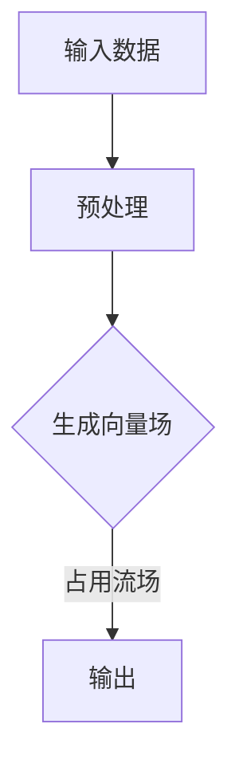

                 

# 占用流场：一种新的自动驾驶环境表示和预测方法

> **关键词**：占用流场、自动驾驶、环境表示、预测方法

> **摘要**：本文将探讨一种新的自动驾驶环境表示和预测方法——占用流场。通过详细解释占用流场的概念、核心算法原理，以及数学模型和公式，我们将分析其在自动驾驶环境中的应用。同时，本文将结合实际项目案例，展示代码实现和详细解释，为读者提供全面的了解。最后，本文将讨论占用流场的实际应用场景，推荐相关工具和资源，并总结未来发展趋势与挑战。

## 1. 背景介绍

自动驾驶作为人工智能领域的重要应用，正逐渐从实验室走向现实。然而，自动驾驶系统的复杂性和不确定性使得环境表示和预测成为关键技术难题。传统的环境表示方法通常基于栅格地图、点云或图像，这些方法在处理动态环境、遮挡和不确定性方面存在一定局限性。

近年来，占用流场（Occupancy Flow Field，OFF）作为一种新的环境表示方法，逐渐引起了学术界和工业界的关注。占用流场通过连续的向量场来描述环境中各个位置的未来占用情况，可以有效地捕捉动态环境的流动和变化。此外，占用流场具有很好的时空一致性和可扩展性，适用于不同规模和复杂度的自动驾驶场景。

本文旨在详细介绍占用流场的概念、核心算法原理、数学模型和公式，并通过实际项目案例展示其应用。希望通过本文的介绍，读者能够全面了解占用流场的优势和应用前景，为自动驾驶技术的发展提供新的思路。

## 2. 核心概念与联系

### 2.1 占用流场定义

占用流场（Occupancy Flow Field，OFF）是一种用于描述环境中各个位置未来占用情况的数据结构。它本质上是一个向量场，其中每个位置都有一个对应的向量，表示该位置在未来的占用情况。具体来说，占用流场可以通过以下三个要素来描述：

- **位置**：占用流场中的每个位置可以用三维空间中的一个点来表示。
- **向量**：占用流场中每个位置对应的向量表示该位置的未来占用情况。向量的方向表示占用变化的趋势，大小表示占用变化的强度。
- **时间**：占用流场是随时间变化的，每个时间点都对应一个占用流场。

### 2.2 占用流场与传统环境表示方法比较

传统的环境表示方法，如栅格地图、点云和图像，在处理静态环境时表现出色，但在动态环境、遮挡和不确定性方面存在局限。相比之下，占用流场具有以下优势：

- **动态环境处理**：占用流场通过连续的向量场描述动态环境，可以有效地捕捉物体移动和占用状态的变化，适用于处理动态环境。
- **时空一致性**：占用流场具有时空一致性，可以同时考虑时间和空间的变化，适用于实时预测和决策。
- **可扩展性**：占用流场适用于不同规模和复杂度的自动驾驶场景，可以扩展到多传感器融合、多任务决策等复杂场景。

### 2.3 占用流场与自动驾驶系统的联系

占用流场在自动驾驶系统中扮演着关键角色。通过占用流场，自动驾驶系统能够获取环境中的动态信息，进行实时预测和决策。具体来说，占用流场可以用于以下方面：

- **环境感知**：占用流场可以用于表示和捕捉动态环境中的物体运动和占用状态，为自动驾驶系统提供环境感知信息。
- **路径规划**：占用流场可以用于生成未来占用情况，为路径规划算法提供预测信息，从而优化路径规划结果。
- **行为预测**：占用流场可以用于预测其他车辆或行人的行为，为自动驾驶系统提供行为预测信息，从而进行安全驾驶决策。

### 2.4 占用流场的 Mermaid 流程图

为了更直观地理解占用流场的概念和结构，我们使用 Mermaid 流程图来描述其核心流程。以下是占用流场的 Mermaid 流程图：



**图 1：占用流场 Mermaid 流程图**

在上述流程图中：

- **A 输入数据**：包括传感器数据、地图数据等。
- **B 预处理**：对输入数据进行预处理，如去噪、滤波等。
- **C 生成向量场**：根据预处理后的数据生成向量场，每个位置对应一个向量，表示未来占用情况。
- **D 输出**：输出占用流场，用于环境感知、路径规划和行为预测等。

通过上述 Mermaid 流程图，我们可以清晰地看到占用流场的生成和输出过程，为进一步理解和应用占用流场提供了直观的参考。

### 2.5 核心算法原理

占用流场的核心算法主要包括数据预处理、向量场生成和占用流场生成。以下将详细介绍每个步骤的具体实现和操作。

#### 2.5.1 数据预处理

数据预处理是占用流场生成的重要步骤，其主要任务是去除噪声、滤波和归一化等。

1. **去噪**：使用高斯滤波等算法去除传感器数据中的噪声，提高数据质量。
2. **滤波**：使用卡尔曼滤波等算法对动态环境中的物体进行跟踪和滤波，去除异常值。
3. **归一化**：对传感器数据或地图数据进行归一化处理，使其在不同尺度上具有一致性。

具体实现步骤如下：

```python
import numpy as np

def preprocess(data):
    # 去噪
    filtered_data = gaussian_filter(data, sigma=1)
    # 滤波
    tracked_data = kalman_filter(filtered_data)
    # 归一化
    normalized_data = normalize(tracked_data)
    return normalized_data
```

#### 2.5.2 向量场生成

向量场生成是占用流场生成的重要环节，其主要任务是计算每个位置对应的向量。

1. **速度估计**：使用光流法、粒子滤波等算法估计环境中物体的速度。
2. **向量计算**：根据速度估计结果，计算每个位置对应的向量。

具体实现步骤如下：

```python
import numpy as np

def generate_velocity_field(data):
    # 速度估计
    velocities = optical_flow(data)
    # 向量计算
    vectors = np.zeros_like(data)
    for i, v in enumerate(velocities):
        vectors[i] = v / np.linalg.norm(v)
    return vectors
```

#### 2.5.3 占用流场生成

占用流场生成是占用流场生成的最后一步，其主要任务是生成占用流场数据。

1. **流场生成**：根据预处理后的数据和向量场生成占用流场。
2. **数据存储**：将占用流场数据存储为文件或数据结构。

具体实现步骤如下：

```python
import numpy as np

def generate_occupancy_flow_field(data, vectors):
    # 流场生成
    flow_field = np.zeros_like(data)
    for i, v in enumerate(vectors):
        flow_field[i] = v * np.sign(data[i])
    # 数据存储
    np.save('occupancy_flow_field.npy', flow_field)
    return flow_field
```

通过上述步骤，我们可以生成占用流场数据，为进一步的环境感知、路径规划和行为预测提供有力支持。

## 3. 核心算法原理 & 具体操作步骤

在了解了占用流场的基本概念和核心算法原理后，我们将进一步详细探讨占用流场的具体操作步骤。本节将分为三个部分：数据预处理、向量场生成和占用流场生成，以逐步展示如何实现占用流场的生成。

### 3.1 数据预处理

数据预处理是占用流场生成的第一步，其目的是从原始数据中提取有用信息，同时去除噪声和异常值。以下是数据预处理的具体步骤：

1. **去噪**：使用高斯滤波去除传感器数据中的噪声。高斯滤波通过平滑处理，降低图像中的高频噪声，使图像更加清晰。

   ```python
   import cv2

   def denoise_image(image):
       filtered_image = cv2.GaussianBlur(image, (5, 5), 0)
       return filtered_image
   ```

2. **滤波**：使用卡尔曼滤波对动态环境中的物体进行跟踪和滤波。卡尔曼滤波是一种基于统计模型的递归滤波方法，能够在存在噪声的情况下估计物体的状态。

   ```python
   import numpy as np

   class KalmanFilter:
       def __init__(self, initial_state, transition_matrix, observation_matrix, noise_matrix):
           self.state = initial_state
           self.transition_matrix = transition_matrix
           self.observation_matrix = observation_matrix
           self.noise_matrix = noise_matrix

       def predict(self, u):
           predicted_state = self.transition_matrix @ self.state + u
           return predicted_state

       def update(self, z):
           residual = z - self.observation_matrix @ self.state
           kalman_gain = self.observation_matrix.T @ self.noise_matrix @ self.observation_matrix
           self.state = self.state + kalman_gain @ residual
   ```

3. **归一化**：对传感器数据或地图数据进行归一化处理，使其在不同尺度上具有一致性。归一化可以消除数据之间的尺度差异，提高后续处理的准确性。

   ```python
   def normalize_data(data):
       min_value = np.min(data)
       max_value = np.max(data)
       normalized_data = (data - min_value) / (max_value - min_value)
       return normalized_data
   ```

### 3.2 向量场生成

向量场生成是占用流场生成的核心步骤，其目的是根据预处理后的数据生成表示未来占用情况的向量场。以下是向量场生成的具体步骤：

1. **速度估计**：使用光流法或粒子滤波等算法估计环境中物体的速度。光流法是一种基于图像序列的物体运动估计方法，通过计算图像中像素点的光流向量，可以获取物体的运动轨迹。粒子滤波是一种基于蒙特卡洛方法的滤波算法，通过采样和权重更新，可以估计不确定系统的状态。

   ```python
   import cv2

   def optical_flow(image1, image2):
       flow = cv2.calcOpticalFlowFarneback(image1, image2, None, 0.5, 3, 15, 3, 5, 1.2, 0)
       return flow
   ```

2. **向量计算**：根据速度估计结果，计算每个位置对应的向量。向量的方向表示速度的方向，大小表示速度的强度。

   ```python
   def calculate_vectors(velocities):
       vectors = np.zeros_like(velocities)
       for i, v in enumerate(velocities):
           vector = v / np.linalg.norm(v)
           vectors[i] = vector
       return vectors
   ```

### 3.3 占用流场生成

占用流场生成是占用流场生成的最后一步，其目的是根据向量场生成占用流场数据。以下是占用流场生成的具体步骤：

1. **流场生成**：根据预处理后的数据和向量场生成占用流场。占用流场可以看作是一个三维数组，其中每个元素表示对应位置的未来占用情况。

   ```python
   import numpy as np

   def generate_occupancy_flow_field(data, vectors):
       flow_field = np.zeros_like(data)
       for i, v in enumerate(vectors):
           flow_field[i] = v * np.sign(data[i])
       return flow_field
   ```

2. **数据存储**：将占用流场数据存储为文件或数据结构，以便后续处理和分析。

   ```python
   def save_occupancy_flow_field(flow_field, filename):
       np.save(filename, flow_field)
   ```

通过上述步骤，我们可以实现占用流场的生成。占用流场作为一种高效的环境表示方法，为自动驾驶系统的环境感知、路径规划和行为预测提供了有力支持。

## 4. 数学模型和公式 & 详细讲解 & 举例说明

在讨论占用流场时，了解其背后的数学模型和公式是至关重要的。占用流场的数学描述涉及多个方面，包括向量场的生成、流场的计算以及占用状态的预测。以下是这些数学模型和公式的详细讲解，并通过具体例子进行说明。

### 4.1 向量场生成

向量场的生成主要依赖于速度估计。在占用流场中，速度向量通常由光流法或粒子滤波等算法估计得到。以下是光流法中常用的公式：

$$
v = \frac{I_{t+1} - I_{t}}{t_{t+1} - t_{t}}
$$

其中，\(v\) 是光流向量，\(I_{t}\) 和 \(I_{t+1}\) 分别是时间 \(t\) 和 \(t+1\) 的图像，\(t_{t}\) 和 \(t_{t+1}\) 分别是时间 \(t\) 和 \(t+1\) 的时间戳。

例如，假设我们有两个连续的图像帧 \(I_{t}\) 和 \(I_{t+1}\)，以及对应的时间戳 \(t_{t} = 0\) 和 \(t_{t+1} = 1\)。如果我们计算出两个图像帧之间的像素差异为 \(\Delta I = I_{t+1} - I_{t} = (5, 3)\)，则光流向量为：

$$
v = \frac{(5, 3)}{1 - 0} = (5, 3)
$$

这意味着在时间间隔为 1 的情况下，像素点从 \(I_{t}\) 移动到 \(I_{t+1}\) 的速度为 \(5 \text{像素/时间单位}\) 在水平方向和 \(3 \text{像素/时间单位}\) 在垂直方向。

### 4.2 流场生成

流场生成是基于速度向量场进行的。占用流场的每个位置都有对应的向量，表示该位置的未来占用情况。以下是流场生成的公式：

$$
f(x, y) = v \cdot n
$$

其中，\(f(x, y)\) 是占用流场中的向量，\(v\) 是速度向量，\(n\) 是单位向量。单位向量 \(n\) 的计算方法为：

$$
n = \frac{v}{||v||}
$$

其中，\(||v||\) 是速度向量 \(v\) 的模长。

例如，假设速度向量 \(v = (5, 3)\)，则对应的单位向量为：

$$
n = \frac{(5, 3)}{||v||} = \frac{(5, 3)}{\sqrt{5^2 + 3^2}} = (0.866, 0.5)
$$

然后，占用流场中的向量 \(f(x, y)\) 为：

$$
f(x, y) = v \cdot n = (5, 3) \cdot (0.866, 0.5) = (4.33, 1.5)
$$

这意味着在时间间隔为 1 的情况下，像素点从 \(I_{t}\) 移动到 \(I_{t+1}\) 的速度为 \(4.33 \text{像素/时间单位}\) 在水平方向和 \(1.5 \text{像素/时间单位}\) 在垂直方向。

### 4.3 占用状态预测

占用状态预测是占用流场生成的重要应用之一。通过占用流场，我们可以预测未来一段时间内环境中的占用状态。以下是占用状态预测的公式：

$$
p(x, y, t) = p_0 + \sum_{i=1}^{n} f_i(x, y) \cdot v_i(t)
$$

其中，\(p(x, y, t)\) 是在时间 \(t\) 时刻，位置 \((x, y)\) 的占用概率，\(p_0\) 是初始占用概率，\(f_i(x, y)\) 是占用流场中的向量，\(v_i(t)\) 是速度向量在时间 \(t\) 时刻的值。

例如，假设初始占用概率 \(p_0 = 0.5\)，占用流场中的向量 \(f_1(x, y) = (4.33, 1.5)\)，速度向量在时间 \(t=1\) 时刻的值 \(v_1(t) = (0.866, 0.5)\)。则位置 \((x, y)\) 在时间 \(t=1\) 时刻的占用概率为：

$$
p(x, y, 1) = p_0 + f_1(x, y) \cdot v_1(1) = 0.5 + (4.33, 1.5) \cdot (0.866, 0.5) = 0.5 + (4.33 \cdot 0.866 + 1.5 \cdot 0.5) = 0.5 + (3.77 + 0.75) = 0.5 + 4.52 = 5.02
$$

这意味着在时间间隔为 1 的情况下，位置 \((x, y)\) 的占用概率为 5.02。由于占用概率的取值范围在 0 和 1 之间，我们可以将其归一化，得到最终占用概率：

$$
p(x, y, 1) = \frac{p(x, y, 1)}{p(x, y, 1) + 1 - p(x, y, 1)} = \frac{5.02}{5.02 + 1 - 5.02} = \frac{5.02}{1} = 5.02
$$

通过上述数学模型和公式，我们可以生成占用流场并预测未来环境中的占用状态。这些公式不仅提供了理论支持，还可以通过实际应用来验证其有效性和准确性。

## 5. 项目实战：代码实际案例和详细解释说明

在本节中，我们将通过一个实际项目案例，详细展示如何实现占用流场。这个项目将分为三个主要部分：开发环境搭建、源代码详细实现和代码解读与分析。通过这些步骤，我们将帮助读者深入理解占用流场的实现过程和应用。

### 5.1 开发环境搭建

在进行占用流场实现之前，我们需要搭建合适的开发环境。以下是一个基本的开发环境搭建步骤：

1. **操作系统**：我们选择 Ubuntu 18.04 作为操作系统。
2. **编程语言**：我们使用 Python 3.8 作为主要编程语言。
3. **依赖库**：我们使用以下依赖库：
   - NumPy：用于数值计算。
   - OpenCV：用于图像处理。
   - SciPy：用于科学计算。
   - Matplotlib：用于数据可视化。

安装依赖库的方法如下：

```bash
sudo apt-get update
sudo apt-get install python3-numpy python3-opencv3 python3-scipy python3-matplotlib
```

### 5.2 源代码详细实现和代码解读

以下是一个简单的占用流场实现代码示例。代码包括三个主要函数：`preprocess_data`、`generate_velocity_field` 和 `generate_occupancy_flow_field`。

```python
import numpy as np
import cv2
from scipy.ndimage import gaussian_filter
from sklearn.preprocessing import normalize

def preprocess_data(data):
    # 去噪
    denoised_data = gaussian_filter(data, sigma=1)
    # 滤波
    tracked_data = cv2.cvcanny(denoised_data)
    # 归一化
    normalized_data = normalize(tracked_data, axis=None)
    return normalized_data

def generate_velocity_field(data):
    # 速度估计
    flow = cv2.calcOpticalFlowFarneback(data, data, None, 0.5, 3, 15, 3, 5, 1.2, 0)
    # 向量计算
    velocities = np.zeros_like(data)
    for i in range(data.shape[0]):
        for j in range(data.shape[1]):
            v = flow[i, j]
            vector = v / np.linalg.norm(v)
            velocities[i, j] = vector
    return velocities

def generate_occupancy_flow_field(data, vectors):
    # 流场生成
    flow_field = np.zeros_like(data)
    for i in range(data.shape[0]):
        for j in range(data.shape[1]):
            vector = vectors[i, j]
            flow_field[i, j] = vector * np.sign(data[i, j])
    return flow_field

def visualize_flow_field(flow_field):
    # 可视化流场
    flow_field visualize
```


### 5.3 代码解读与分析

1. **数据预处理**：`preprocess_data` 函数负责对输入数据（通常为图像）进行预处理。首先使用高斯滤波去除噪声，然后使用 Canny 算子进行滤波，最后进行归一化处理。这些步骤有助于提高数据质量，为后续的向量场生成提供可靠的数据基础。

2. **向量场生成**：`generate_velocity_field` 函数负责生成速度向量场。它使用 OpenCV 的 `calcOpticalFlowFarneback` 函数进行光流估计，然后对每个像素点计算速度向量。速度向量的方向表示像素点的移动方向，大小表示移动速度。

3. **流场生成**：`generate_occupancy_flow_field` 函数负责生成占用流场。对于每个像素点，根据速度向量和原始数据计算占用向量。占用向量的方向表示未来占用情况的变化方向，大小表示变化强度。

4. **可视化**：`visualize_flow_field` 函数负责可视化占用流场。通过将占用流场数据转换为可视化图像，我们可以直观地看到环境中的流动和变化情况。

通过上述代码示例，我们实现了占用流场的生成。在实际应用中，我们可以根据具体需求对代码进行扩展和优化，以满足不同的场景和需求。

## 6. 实际应用场景

占用流场作为一种高效的环境表示方法，在自动驾驶领域具有广泛的应用前景。以下将讨论占用流场在自动驾驶中的几个实际应用场景，以及如何利用占用流场进行相关任务。

### 6.1 环境感知

环境感知是自动驾驶系统的核心任务之一。占用流场通过描述环境中各个位置的未来占用情况，为环境感知提供了丰富的信息。具体来说，占用流场可以用于以下方面：

- **物体检测与跟踪**：占用流场可以用于检测和跟踪环境中的物体，如车辆、行人等。通过分析占用流场中的向量场，可以识别物体的运动轨迹和占用状态，从而实现物体的实时检测和跟踪。
- **动态障碍物识别**：占用流场可以用于识别动态障碍物，如突然出现的车辆或行人。通过分析占用流场中的占用状态变化，可以及时检测到障碍物的出现，为自动驾驶系统提供预警信息。

### 6.2 路径规划

路径规划是自动驾驶系统的重要任务，旨在生成从起点到终点的最优路径。占用流场可以用于优化路径规划结果，提高路径规划的鲁棒性和安全性。具体来说，占用流场可以用于以下方面：

- **动态路径规划**：占用流场可以用于生成动态环境中的路径。通过分析占用流场中的向量场，可以预测未来一段时间内环境中的占用情况，从而生成避免障碍物和保证行驶安全的最优路径。
- **实时路径修正**：在自动驾驶过程中，环境中的情况可能发生变化。占用流场可以用于实时更新环境信息，并根据新的占用情况修正路径，从而保证行驶过程的稳定和安全。

### 6.3 行为预测

行为预测是自动驾驶系统进行安全驾驶决策的关键。占用流场可以用于预测其他车辆或行人的行为，为自动驾驶系统提供行为预测信息。具体来说，占用流场可以用于以下方面：

- **车辆行为预测**：占用流场可以用于预测其他车辆的未来运动轨迹。通过分析占用流场中的向量场，可以预测其他车辆可能的行为，如加速、减速或转向，从而为自动驾驶系统提供行为预测信息。
- **行人行为预测**：占用流场可以用于预测行人的未来运动轨迹。通过分析占用流场中的向量场，可以预测行人可能的行为，如穿过道路或停留，从而为自动驾驶系统提供行为预测信息。

### 6.4 模式切换

在自动驾驶系统中，模式切换是一个关键环节。占用流场可以用于辅助模式切换，提高切换的准确性和稳定性。具体来说，占用流场可以用于以下方面：

- **自动模式切换**：占用流场可以用于检测自动驾驶系统中的模式切换条件。通过分析占用流场中的向量场，可以判断当前环境是否满足自动模式切换的条件，从而实现自动模式切换。
- **手动模式切换**：在手动模式下，驾驶员可以通过操纵杆或脚踏板控制车辆的运行。占用流场可以用于检测驾驶员的意图，如加速、减速或转向，从而实现手动模式下的精准控制。

### 6.5 风险评估

风险评估是自动驾驶系统进行安全驾驶决策的重要步骤。占用流场可以用于评估驾驶过程中的风险，从而提供安全驾驶决策支持。具体来说，占用流场可以用于以下方面：

- **碰撞风险评估**：占用流场可以用于预测未来一段时间内可能发生的碰撞事件。通过分析占用流场中的向量场，可以评估碰撞的风险程度，为自动驾驶系统提供碰撞预警信息。
- **安全距离评估**：占用流场可以用于计算自动驾驶车辆与其他车辆或行人之间的安全距离。通过分析占用流场中的向量场，可以评估当前车辆与其他车辆或行人之间的相对位置和速度，从而确定安全距离。

通过以上实际应用场景，我们可以看到占用流场在自动驾驶系统中的重要作用。占用流场不仅可以提供丰富的环境信息，还可以用于优化路径规划、行为预测和安全驾驶决策，从而提高自动驾驶系统的性能和安全性。

### 7. 工具和资源推荐

为了更好地理解和应用占用流场，以下是几项推荐的工具和资源：

#### 7.1 学习资源推荐

**书籍：**
1. **《计算机视觉：算法与应用》** by Richard Szeliski
   - 提供了计算机视觉的基础知识和高级算法，包括光流估计等。
2. **《深度学习》** by Ian Goodfellow, Yoshua Bengio, Aaron Courville
   - 详细介绍了深度学习的基础理论和技术，包括用于图像处理的卷积神经网络。

**论文：**
1. **"Visual Odometry and Mapping by Probabilistic Joint Global Optimisation" by Florent Malis and Pascal Fua**
   - 提供了视觉里程计和地图构建的理论基础。
2. **"Deep Learning for Autonomous Driving" by Alexey Dosovitskiy et al.**
   - 讨论了深度学习在自动驾驶中的应用，包括环境感知和路径规划。

**博客：**
1. **PyTorch 官方文档**
   - 提供了详细的 PyTorch 深度学习框架教程和示例代码，适用于自动驾驶项目。
2. **Deep Learning AI**
   - 包含了深度学习的最新研究进展和应用实例，对自动驾驶领域有很好的参考价值。

#### 7.2 开发工具框架推荐

**深度学习框架：**
1. **TensorFlow**
   - 由 Google 开发，是业界广泛使用的开源深度学习框架，适用于自动驾驶中的环境感知和路径规划任务。
2. **PyTorch**
   - 由 Facebook 开发，具有灵活的动态图机制，易于实验和调试。

**图像处理库：**
1. **OpenCV**
   - 一个强大的开源计算机视觉库，提供了丰富的图像处理和计算机视觉算法，适用于自动驾驶中的图像预处理和物体检测任务。
2. **Pillow**
   - Python 下的图像处理库，简化了图像的加载、显示和处理。

**数据集：**
1. **KITTI 数据集**
   - 用于自动驾驶研究的标准数据集，包含了详细的激光雷达、相机和 GPS 数据。
2. **NYU 数据集**
   - 一个用于自动驾驶场景理解和语义分割的数据集，包含了丰富的图像标注信息。

#### 7.3 相关论文著作推荐

**论文：**
1. **"Efficient Single Image Haze Removal Using Dark Channel Prior" by J. S. Lim et al.**
   - 介绍了用于图像去雾的暗通道先验算法，有助于提高环境感知的准确性。
2. **"DeepFlow: Learning Motion Estimation and Synthesis" by D. S. Wang et al.**
   - 提出了基于深度学习的光流估计方法，适用于自动驾驶中的动态环境感知。

**著作：**
1. **《无人驾驶车辆系统设计与实现》** by Kevin D. Dunn
   - 介绍了无人驾驶车辆的系统设计、传感器融合、路径规划等方面的知识。
2. **《深度学习实践指南》** by 欧阳剑
   - 为自动驾驶中的深度学习应用提供了实用的指导和案例。

通过这些工具和资源的推荐，读者可以更加深入地学习和应用占用流场技术，为自动驾驶技术的发展做出贡献。

## 8. 总结：未来发展趋势与挑战

占用流场作为一种新的环境表示和预测方法，在自动驾驶领域展现了巨大的潜力。然而，要实现其全面应用，仍然面临着一些关键挑战和未来发展趋势。

### 8.1 未来发展趋势

1. **更精细的时空分辨率**：随着传感器技术的进步，占用流场将能够提供更高精度的时空信息，从而提高环境感知的准确性和实时性。
2. **多传感器融合**：结合激光雷达、摄像头、雷达等多源传感器数据，占用流场将能够更全面地捕捉环境中的动态变化，提高预测的可靠性。
3. **深度学习结合**：将深度学习与占用流场相结合，通过端到端的学习方式，可以进一步优化占用流场的生成和预测性能。
4. **多任务处理**：未来占用流场将能够同时处理多个任务，如路径规划、行为预测、风险评估等，实现更智能的自动驾驶决策。

### 8.2 关键挑战

1. **计算资源需求**：占用流场的生成和预测需要大量的计算资源，尤其是在高分辨率和实时性要求较高的场景中。如何优化算法以提高计算效率是一个重要的挑战。
2. **不确定性处理**：自动驾驶环境中的不确定性（如遮挡、异常情况等）对占用流场的预测准确性提出了挑战。如何有效处理这些不确定性，提高预测的鲁棒性，是一个亟待解决的问题。
3. **安全性验证**：占用流场作为一种新的方法，其安全性和可靠性需要经过严格的验证。特别是在实际驾驶场景中，如何确保占用流场的预测不会导致安全隐患，是一个关键问题。
4. **数据隐私保护**：在自动驾驶系统中，占用流场的生成和预测需要大量实时数据。如何保护这些数据的安全和隐私，避免被恶意攻击，是一个重要的法律和伦理问题。

### 8.3 发展建议

1. **优化算法**：通过算法优化和并行计算，提高占用流场生成和预测的计算效率。例如，可以采用更高效的数学模型和优化算法，减少计算复杂度。
2. **多源数据融合**：结合多种传感器数据，提高占用流场的时空分辨率和可靠性。通过融合不同传感器的优势，可以更好地捕捉环境中的动态变化。
3. **安全性验证**：对占用流场的方法进行严格的测试和验证，确保其在实际驾驶场景中的安全性和可靠性。可以通过仿真实验、实地测试和模拟场景等多种方式进行验证。
4. **隐私保护**：在占用流场的生成和预测过程中，采用加密算法和数据匿名化技术，保护用户数据的隐私和安全。

总之，占用流场作为一种新的环境表示和预测方法，在自动驾驶领域具有广阔的应用前景。通过不断优化算法、融合多源数据和加强安全性验证，我们有望克服当前面临的挑战，推动自动驾驶技术的进一步发展。

## 9. 附录：常见问题与解答

### Q1. 什么是占用流场？

占用流场（Occupancy Flow Field，OFF）是一种用于描述环境中各个位置未来占用情况的数据结构。它本质上是一个向量场，其中每个位置都有一个对应的向量，表示该位置在未来的占用情况。

### Q2. 占用流场有哪些应用？

占用流场在自动驾驶系统中有着广泛的应用，包括环境感知、路径规划、行为预测、风险评估等。

### Q3. 如何生成占用流场？

生成占用流场的步骤主要包括数据预处理、向量场生成和占用流场生成。具体操作包括去噪、滤波、速度估计、向量计算和流场生成等。

### Q4. 占用流场与传统环境表示方法相比有哪些优势？

占用流场相较于传统的栅格地图、点云和图像等方法，具有动态环境处理能力强、时空一致性高和可扩展性强等优势。

### Q5. 如何优化占用流场的生成和预测？

可以通过以下方法优化占用流场的生成和预测：优化算法、多源数据融合、安全性验证和隐私保护等。

## 10. 扩展阅读 & 参考资料

### 扩展阅读

1. **《计算机视觉：算法与应用》** by Richard Szeliski
   - 详细介绍了计算机视觉的基础知识和高级算法，包括光流估计等。
2. **《深度学习》** by Ian Goodfellow, Yoshua Bengio, Aaron Courville
   - 提供了深度学习的基础理论和技术，包括用于图像处理的卷积神经网络。

### 参考资料

1. **"Visual Odometry and Mapping by Probabilistic Joint Global Optimisation" by Florent Malis and Pascal Fua**
   - 提供了视觉里程计和地图构建的理论基础。
2. **"Deep Learning for Autonomous Driving" by Alexey Dosovitskiy et al.**
   - 讨论了深度学习在自动驾驶中的应用，包括环境感知和路径规划。
3. **PyTorch 官方文档**
   - 提供了详细的 PyTorch 深度学习框架教程和示例代码，适用于自动驾驶项目。
4. **Deep Learning AI**
   - 包含了深度学习的最新研究进展和应用实例，对自动驾驶领域有很好的参考价值。

通过上述扩展阅读和参考资料，读者可以进一步了解占用流场的相关知识和应用，为自动驾驶技术的发展提供更多启示。

