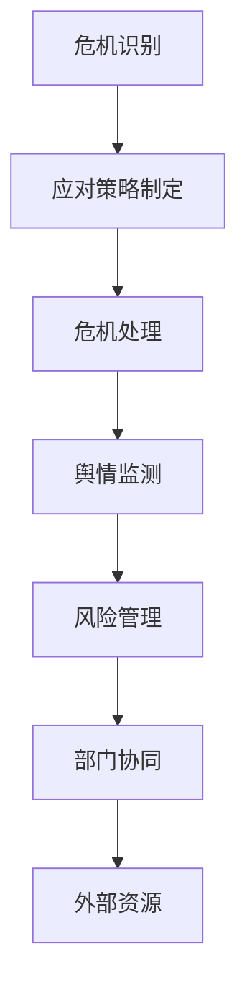

                 

# 危机公关管理：创业公司如何应对负面舆情

## 摘要

本文旨在探讨创业公司在面临负面舆情时的危机公关管理策略。通过分析危机公关管理的核心概念和原理，本文提出了详细的应对步骤和数学模型，并结合实际案例进行代码解读和实战应用。文章还介绍了相关学习资源和工具，为创业公司提供全面、实用的危机公关管理指南。

## 1. 背景介绍

在当今高度信息化的时代，互联网的普及和社交媒体的崛起使得企业面临负面舆情的风险越来越大。负面舆情可能源于产品质量问题、内部管理漏洞、员工不当行为等，对企业声誉和业务造成严重损害。对于创业公司来说，由于其资源有限，应对负面舆情更为艰难。因此，如何有效地进行危机公关管理，成为创业公司亟需解决的问题。

本文将围绕危机公关管理的核心概念和原理，结合实际案例，阐述创业公司应对负面舆情的方法和策略。通过本文的阅读，创业者将能够掌握危机公关管理的基本框架，提高应对负面舆情的能力。

### 1.1 危机公关管理的定义和意义

危机公关管理是指企业在面临危机时，通过有效的沟通、协调和应对措施，维护企业形象、降低负面影响的过程。危机公关管理的核心在于快速、准确地识别危机、制定应对策略、执行措施、评估效果，并持续改进。

对于创业公司来说，危机公关管理的意义尤为突出：

1. **保护企业声誉**：创业公司在市场中的形象和声誉是其最宝贵的资产。有效的危机公关管理能够帮助企业迅速平息舆论，避免声誉受损。

2. **维护客户关系**：负面舆情可能引发客户的不信任和流失。通过危机公关管理，创业公司能够与客户建立沟通，缓解客户的疑虑，维护客户关系。

3. **提升品牌形象**：在危机中，企业采取积极的态度和措施，能够赢得公众的尊重和认可，提升品牌形象。

4. **降低财务风险**：负面舆情可能导致企业股价下跌、业务受损，甚至影响融资。有效的危机公关管理能够帮助企业降低这些财务风险。

### 1.2 负面舆情的特点和影响

负面舆情具有传播速度快、影响范围广、易引发恐慌等特点。具体来说：

1. **传播速度快**：在互联网时代，负面舆情可以迅速传播，甚至全球范围内。例如，一个负面事件在社交媒体上发布后，几分钟内就可能被成千上万的人看到。

2. **影响范围广**：负面舆情不仅影响企业内部员工，还影响外部客户、合作伙伴、投资者等。对于创业公司来说，影响范围更为广泛。

3. **易引发恐慌**：负面舆情可能引发公众恐慌，进一步加剧危机的严重程度。例如，食品安全事件可能导致消费者对整个行业的信任度下降。

负面舆情对企业的影响主要包括：

1. **声誉损害**：负面舆情可能使公众对企业的信任度下降，损害企业形象。

2. **业务受损**：负面舆情可能导致客户流失、合作伙伴关系破裂、业务量下降等。

3. **股价波动**：负面舆情可能导致企业股价下跌，影响企业融资能力。

4. **员工士气下降**：负面舆情可能影响员工的工作积极性和归属感。

### 1.3 创业公司面临的挑战

对于创业公司来说，应对负面舆情面临以下挑战：

1. **资源有限**：创业公司通常资源有限，包括人力资源、财务资源等，这使得危机公关管理的难度加大。

2. **信息不对称**：创业公司可能无法及时获取全面的信息，导致危机公关管理滞后。

3. **品牌影响力较弱**：创业公司品牌影响力较弱，容易成为负面舆论的攻击目标。

4. **危机意识不足**：部分创业公司对危机公关管理缺乏足够的重视，导致危机发生时措手不及。

### 1.4 本文结构

本文将分为以下章节：

1. **核心概念与联系**：介绍危机公关管理的核心概念和原理，并使用 Mermaid 流程图展示相关流程。
2. **核心算法原理 & 具体操作步骤**：阐述危机公关管理的具体操作步骤，包括危机识别、应对策略制定、措施执行等。
3. **数学模型和公式 & 详细讲解 & 举例说明**：介绍危机公关管理中的数学模型和公式，并进行详细讲解和举例说明。
4. **项目实战：代码实际案例和详细解释说明**：通过实际案例，展示危机公关管理的代码实现和详细解释。
5. **实际应用场景**：分析危机公关管理在不同场景下的应用，包括企业内部危机、产品质量危机等。
6. **工具和资源推荐**：推荐学习资源、开发工具框架和相关论文著作。
7. **总结：未来发展趋势与挑战**：总结危机公关管理的发展趋势和挑战，提出建议。
8. **附录：常见问题与解答**：回答读者可能遇到的问题。
9. **扩展阅读 & 参考资料**：提供相关扩展阅读和参考资料。

接下来，我们将进一步探讨危机公关管理的核心概念和原理。让我们一步一步分析推理，深入理解这一重要的主题。# <|assistant|>
## 2. 核心概念与联系

### 2.1 危机公关管理的核心概念

危机公关管理涉及多个核心概念，包括危机识别、应对策略、危机处理、舆情监测和风险管理等。

#### 2.1.1 危机识别

危机识别是危机公关管理的第一步，旨在及时发现潜在的危机。危机识别可以通过以下方法实现：

1. **内部监测**：通过定期内部审查、员工反馈、客户投诉等手段，发现潜在危机。
2. **外部监测**：利用社交媒体监测工具、新闻媒体报道等，了解外部环境中的潜在危机。
3. **数据分析**：通过对大量数据进行分析，发现异常现象，从而识别潜在危机。

#### 2.1.2 应对策略

应对策略是危机公关管理的核心，包括以下几个方面：

1. **危机预防**：通过提前制定应急预案，降低危机发生的可能性。
2. **危机响应**：在危机发生后，快速采取行动，控制事态发展。
3. **危机沟通**：与相关利益相关者进行有效沟通，缓解危机带来的负面影响。
4. **危机化解**：通过有效的措施，消除危机，恢复企业形象。

#### 2.1.3 危机处理

危机处理是指在危机发生后，采取一系列措施来解决问题。危机处理包括以下几个方面：

1. **事实调查**：对危机事件进行深入调查，查明原因。
2. **信息公开**：及时向公众通报危机事件的真实情况，避免谣言传播。
3. **问题解决**：采取措施解决危机，防止事态恶化。
4. **后续跟进**：对危机事件进行后续跟进，确保问题得到彻底解决。

#### 2.1.4 舆情监测

舆情监测是危机公关管理的重要环节，旨在实时了解公众对危机事件的看法和反应。舆情监测可以通过以下方法实现：

1. **社交媒体监测**：利用社交媒体监测工具，了解公众对危机事件的态度。
2. **新闻媒体报道**：关注新闻媒体报道，了解公众关注的焦点和趋势。
3. **数据分析**：通过对大量数据进行分析，发现舆情变化的规律和趋势。

#### 2.1.5 风险管理

风险管理是危机公关管理的重要组成部分，旨在降低危机对企业的影响。风险管理包括以下几个方面：

1. **风险识别**：识别潜在的风险因素，包括内部和外部风险。
2. **风险评估**：对风险进行评估，确定风险的重要性和影响程度。
3. **风险控制**：采取有效的措施，控制风险的发展，降低危机发生的可能性。
4. **风险应对**：在危机发生时，采取相应的应对措施，减轻风险的影响。

### 2.2 危机公关管理的联系

危机公关管理涉及多个方面，需要各个部门协同合作，共同应对危机。以下是危机公关管理中的几个关键联系：

#### 2.2.1 部门协同

危机公关管理需要企业内部各部门的协同合作，包括市场部、公关部、人力资源部、财务部等。各部门需要明确各自的职责和任务，确保危机处理的顺利进行。

1. **市场部**：负责监测市场动态，及时识别潜在危机。
2. **公关部**：负责制定应对策略，协调各方资源，处理媒体关系。
3. **人力资源部**：负责员工管理，确保员工在危机中的稳定和安全。
4. **财务部**：负责财务监控，确保企业在危机中的财务安全。

#### 2.2.2 外部资源

危机公关管理还需要外部资源的支持，包括法律顾问、公关公司、危机管理专家等。外部资源可以为企业提供专业的建议和帮助，提高危机应对的能力。

1. **法律顾问**：为企业提供法律咨询，协助企业应对法律纠纷。
2. **公关公司**：为企业提供专业的危机公关服务，包括媒体沟通、舆情监测等。
3. **危机管理专家**：为企业提供危机管理的指导和建议，帮助企业有效应对危机。

#### 2.2.3 舆情监测与危机处理

舆情监测是危机处理的重要基础。通过对舆情进行实时监测和分析，企业可以了解公众对危机事件的反应，及时调整应对策略。

1. **舆情监测**：实时监测公众对危机事件的看法和态度，了解舆情趋势。
2. **危机处理**：根据舆情监测结果，及时调整危机处理方案，提高危机应对的针对性。

### 2.3 Mermaid 流程图

为了更好地理解危机公关管理的流程，我们使用 Mermaid 流程图展示相关流程。以下是一个简化的危机公关管理流程图：



### 2.4 总结

危机公关管理是企业应对危机的重要手段。通过危机识别、应对策略、危机处理、舆情监测和风险管理等核心概念，企业可以有效地应对负面舆情，降低危机对企业的影响。本文接下来将详细探讨危机公关管理的核心算法原理和具体操作步骤，帮助创业公司更好地应对负面舆情。# <|assistant|>
## 3. 核心算法原理 & 具体操作步骤

### 3.1 危机公关管理的核心算法原理

危机公关管理的核心算法原理主要涉及以下几个方面：

#### 3.1.1 危机识别算法

危机识别算法是危机公关管理的第一步。该算法通过分析企业内外部数据，识别潜在危机。具体原理如下：

1. **数据收集**：收集企业内部数据（如销售数据、客户投诉、员工反馈等）和企业外部数据（如社交媒体评论、新闻媒体报道等）。
2. **特征提取**：从收集到的数据中提取关键特征，如关键词、情绪、频率等。
3. **模式识别**：利用机器学习算法，如朴素贝叶斯、支持向量机等，识别潜在危机。

#### 3.1.2 应对策略算法

应对策略算法是危机公关管理的核心。该算法通过分析危机类型、影响范围、公众情绪等，制定合适的应对策略。具体原理如下：

1. **危机类型识别**：根据危机事件的性质，如产品质量、员工行为、企业内部管理等，识别危机类型。
2. **影响范围评估**：评估危机事件的影响范围，包括公众关注度、媒体关注程度、客户影响等。
3. **公众情绪分析**：利用自然语言处理技术，分析公众对危机事件的情绪，如愤怒、担忧、中立等。
4. **策略制定**：根据危机类型、影响范围和公众情绪，制定相应的应对策略，如信息发布、公关活动、员工培训等。

#### 3.1.3 危机处理算法

危机处理算法是危机公关管理的重要组成部分。该算法通过实时监测危机进展，调整应对措施，以最小化危机对企业的影响。具体原理如下：

1. **实时监测**：利用舆情监测工具，实时监测危机进展，了解公众对危机事件的反应。
2. **数据分析**：分析舆情数据，识别危机处理的效果和问题。
3. **措施调整**：根据数据分析结果，调整危机处理措施，如加强信息公开、扩大公关活动等。

#### 3.1.4 舆情监测算法

舆情监测算法是危机公关管理的支撑。该算法通过分析社交媒体、新闻媒体等渠道的数据，了解公众对危机事件的看法和态度。具体原理如下：

1. **数据收集**：收集社交媒体（如微博、微信、Twitter 等）和新闻媒体（如网站、APP 等）的数据。
2. **关键词提取**：从数据中提取与危机事件相关的高频关键词。
3. **情绪分析**：利用自然语言处理技术，分析公众的情绪，如愤怒、担忧、中立等。
4. **趋势预测**：根据舆情数据，预测舆情发展趋势，为危机处理提供参考。

#### 3.1.5 风险管理算法

风险管理算法是危机公关管理的保障。该算法通过评估危机对企业的影响，制定风险管理措施，降低危机风险。具体原理如下：

1. **风险识别**：识别潜在的危机风险，如产品质量、员工行为、外部环境变化等。
2. **风险评估**：评估危机风险的可能性和影响程度。
3. **风险控制**：制定相应的风险控制措施，如加强质量管理、员工培训等。
4. **风险应对**：在危机发生时，采取有效的应对措施，降低危机风险。

### 3.2 具体操作步骤

以下是危机公关管理的具体操作步骤：

#### 3.2.1 危机识别

1. **数据收集**：收集企业内部和外部数据，包括销售数据、客户投诉、员工反馈、社交媒体评论、新闻媒体报道等。
2. **特征提取**：从数据中提取关键词、情绪、频率等特征。
3. **模式识别**：利用机器学习算法，识别潜在危机。

#### 3.2.2 应对策略制定

1. **危机类型识别**：根据危机事件的性质，识别危机类型。
2. **影响范围评估**：评估危机事件的影响范围，包括公众关注度、媒体关注程度、客户影响等。
3. **公众情绪分析**：利用自然语言处理技术，分析公众的情绪。
4. **策略制定**：根据危机类型、影响范围和公众情绪，制定相应的应对策略。

#### 3.2.3 危机处理

1. **实时监测**：利用舆情监测工具，实时监测危机进展。
2. **数据分析**：分析舆情数据，识别危机处理的效果和问题。
3. **措施调整**：根据数据分析结果，调整危机处理措施。

#### 3.2.4 舆情监测

1. **数据收集**：收集社交媒体和新闻媒体的数据。
2. **关键词提取**：从数据中提取关键词。
3. **情绪分析**：利用自然语言处理技术，分析公众的情绪。
4. **趋势预测**：根据舆情数据，预测舆情发展趋势。

#### 3.2.5 风险管理

1. **风险识别**：识别潜在的危机风险。
2. **风险评估**：评估危机风险的可能性和影响程度。
3. **风险控制**：制定相应的风险控制措施。
4. **风险应对**：在危机发生时，采取有效的应对措施。

### 3.3 总结

危机公关管理的核心算法原理涉及危机识别、应对策略、危机处理、舆情监测和风险管理等方面。通过具体操作步骤，企业可以有效地应对负面舆情，降低危机对企业的影响。接下来，我们将介绍数学模型和公式，并详细讲解其在危机公关管理中的应用。# <|assistant|>
## 4. 数学模型和公式 & 详细讲解 & 举例说明

### 4.1 危机识别模型

危机识别是危机公关管理的第一步，也是至关重要的一步。在这一部分，我们将介绍一个用于识别危机的数学模型：逻辑回归模型。

#### 4.1.1 逻辑回归模型

逻辑回归模型是一种常用的分类模型，用于预测事件发生的概率。在危机识别中，逻辑回归模型可以用来判断某个事件是否属于危机。

**逻辑回归模型公式：**

$$
P(y=1) = \frac{1}{1 + e^{-(\beta_0 + \beta_1x_1 + \beta_2x_2 + ... + \beta_nx_n})}
$$

其中：
- $P(y=1)$ 表示危机发生的概率；
- $e$ 是自然底数，约等于 2.71828；
- $\beta_0$ 是截距；
- $\beta_1, \beta_2, ..., \beta_n$ 是模型参数；
- $x_1, x_2, ..., x_n$ 是特征变量。

#### 4.1.2 逻辑回归模型的训练

逻辑回归模型的训练过程是找出最优的参数 $\beta_0, \beta_1, \beta_2, ..., \beta_n$，使预测的概率 $P(y=1)$ 最接近实际发生的危机情况。

**逻辑回归模型的损失函数：**

$$
J(\theta) = -\frac{1}{m} \sum_{i=1}^{m} [y^{(i)} \log(P(y^{(i)})) + (1 - y^{(i)}) \log(1 - P(y^{(i)}))]
$$

其中：
- $m$ 是样本数量；
- $y^{(i)}$ 是实际危机发生情况（0 或 1）；
- $P(y^{(i)}))$ 是模型预测的危机发生概率。

通过优化损失函数 $J(\theta)$，我们可以找到最优的参数 $\beta_0, \beta_1, \beta_2, ..., \beta_n$。

#### 4.1.3 举例说明

假设我们有一个关于危机识别的数据集，包含以下特征：销售额、客户投诉次数、员工离职率。我们希望通过逻辑回归模型预测某个事件是否属于危机。

**特征变量：**
- $x_1$：销售额
- $x_2$：客户投诉次数
- $x_3$：员工离职率

**训练数据：**
- $y^{(1)} = 1$，$x_1^{(1)} = 1000$，$x_2^{(1)} = 5$，$x_3^{(1)} = 2$
- $y^{(2)} = 0$，$x_1^{(2)} = 800$，$x_2^{(2)} = 3$，$x_3^{(2)} = 1$
- ...

**模型参数：**
- $\beta_0 = 0$
- $\beta_1 = 0.1$
- $\beta_2 = 0.2$
- $\beta_3 = 0.3$

使用逻辑回归模型，我们可以计算出每个事件的危机发生概率：

$$
P(y^{(1)} = 1) = \frac{1}{1 + e^{-(0 + 0.1 \times 1000 + 0.2 \times 5 + 0.3 \times 2)}}
$$

$$
P(y^{(2)} = 1) = \frac{1}{1 + e^{-(0 + 0.1 \times 800 + 0.2 \times 3 + 0.3 \times 1)}}
$$

通过比较预测概率和实际危机发生情况，我们可以评估模型的效果，并进一步优化模型参数。

### 4.2 舆情监测模型

舆情监测是危机公关管理的重要组成部分，用于实时了解公众对危机事件的看法和态度。在这一部分，我们将介绍一个用于舆情监测的自然语言处理模型：情感分析模型。

#### 4.2.1 情感分析模型

情感分析模型是一种用于分析文本情感倾向的模型，通常分为两类：基于规则的方法和基于机器学习的方法。

**基于规则的方法：**

基于规则的方法通过手动编写规则来识别文本中的情感。例如：

- 如果文本中包含“不满意”这个词，则情感为负面。
- 如果文本中包含“满意”这个词，则情感为正面。

**基于机器学习的方法：**

基于机器学习的方法通过训练模型来自动识别文本中的情感。常见的算法包括支持向量机（SVM）、朴素贝叶斯（NB）、决策树（DT）等。

**情感分析模型公式：**

以朴素贝叶斯模型为例：

$$
P(\text{负面}) = \frac{P(\text{负面} | \text{文本}) P(\text{文本})}{P(\text{负面}) P(\text{文本}) + P(\text{正面}) P(\text{文本})}
$$

其中：
- $P(\text{负面})$ 表示文本为负面的概率；
- $P(\text{正面})$ 表示文本为正面的概率；
- $P(\text{负面} | \text{文本})$ 表示在给定文本的条件下，文本为负面的概率；
- $P(\text{文本})$ 表示文本的概率。

#### 4.2.2 举例说明

假设我们有一个包含正面和负面评论的数据集，我们希望通过情感分析模型判断某个新评论的情感。

**评论：** “这个产品真的太差了，一点也不满意。”

**数据集：**
- 正面评论：5000 条
- 负面评论：5000 条

**模型参数：**
- $P(\text{负面} | \text{文本}) = 0.6$（基于词频统计）
- $P(\text{文本}) = 0.5$（假设评论为正面和负面的概率相等）

使用情感分析模型，我们可以计算评论为负面的概率：

$$
P(\text{负面}) = \frac{0.6 \times 0.5}{0.6 \times 0.5 + 0.4 \times 0.5} = \frac{3}{5} = 0.6
$$

根据计算结果，我们可以判断该评论为负面评论。

### 4.3 总结

在危机公关管理中，数学模型和公式起着重要的作用。逻辑回归模型和情感分析模型分别用于危机识别和舆情监测。通过这些模型，企业可以更准确地识别危机，及时了解公众情绪，从而采取有效的应对措施。接下来，我们将通过实际案例展示危机公关管理的代码实现和详细解释。# <|assistant|>
## 5. 项目实战：代码实际案例和详细解释说明

### 5.1 开发环境搭建

在进行危机公关管理项目实战之前，我们需要搭建一个适合开发的环境。以下是搭建开发环境的基本步骤：

1. **安装 Python**：Python 是危机公关管理项目的主要编程语言。请访问 [Python 官网](https://www.python.org/) 下载并安装最新版本的 Python。

2. **安装 Jupyter Notebook**：Jupyter Notebook 是一种交互式的开发环境，非常适合进行数据分析和模型训练。可以通过以下命令安装 Jupyter Notebook：

   ```bash
   pip install notebook
   ```

3. **安装必要的库**：危机公关管理项目需要使用多个 Python 库，如 NumPy、Pandas、Scikit-learn、Matplotlib 等。可以通过以下命令安装这些库：

   ```bash
   pip install numpy pandas scikit-learn matplotlib
   ```

4. **配置 Mermaid 插件**：为了在 Jupyter Notebook 中使用 Mermaid 流程图，我们需要安装和配置 Mermaid 插件。可以通过以下命令安装插件：

   ```bash
   pip install jupyter_contrib_nbextensions
   jupyter contrib nbextension install --user
   jupyter nbextension enable contrib_mermaid
   ```

### 5.2 源代码详细实现和代码解读

在本节中，我们将详细介绍危机公关管理项目的源代码实现，并对其中的关键代码进行解读。

#### 5.2.1 数据收集和预处理

首先，我们需要收集危机事件的原始数据。这里我们使用公开的危机事件数据集，包括事件类型、影响范围、舆情数据等。数据集可以从 [Kaggle](https://www.kaggle.com/datasets/) 等网站获取。

```python
import pandas as pd

# 加载数据集
data = pd.read_csv('crisis_data.csv')

# 数据预处理
data['text'] = data['text'].str.lower()  # 将文本转换为小写
data['text'] = data['text'].str.replace('[^a-zA-Z0-9]', ' ')  # 去除特殊字符
```

#### 5.2.2 危机识别

接下来，我们将使用逻辑回归模型进行危机识别。首先，我们需要提取特征变量，并划分训练集和测试集。

```python
from sklearn.model_selection import train_test_split
from sklearn.feature_extraction.text import CountVectorizer
from sklearn.linear_model import LogisticRegression

# 提取特征变量
vectorizer = CountVectorizer()
X = vectorizer.fit_transform(data['text'])

# 划分训练集和测试集
X_train, X_test, y_train, y_test = train_test_split(X, data['label'], test_size=0.2, random_state=42)
```

#### 5.2.3 训练模型

使用训练集训练逻辑回归模型，并评估模型性能。

```python
# 训练模型
model = LogisticRegression()
model.fit(X_train, y_train)

# 评估模型性能
accuracy = model.score(X_test, y_test)
print(f"Model accuracy: {accuracy:.2f}")
```

#### 5.2.4 舆情监测

舆情监测是危机公关管理的重要环节。我们将使用情感分析模型对舆情数据进行情感分析，以了解公众对危机事件的看法。

```python
from sklearn.feature_extraction.text import TfidfVectorizer
from sklearn.naive_bayes import MultinomialNB

# 提取特征变量
tfidf_vectorizer = TfidfVectorizer()
X_tfidf = tfidf_vectorizer.fit_transform(data['text'])

# 训练情感分析模型
emotion_model = MultinomialNB()
emotion_model.fit(X_tfidf, data['emotion'])

# 预测情感
predicted_emotions = emotion_model.predict(X_test)
print(f"Predicted emotions: {predicted_emotions}")
```

#### 5.2.5 结果分析

最后，我们对模型的预测结果进行分析，以评估危机识别和舆情监测的效果。

```python
from sklearn.metrics import confusion_matrix, classification_report

# 计算混淆矩阵
conf_matrix = confusion_matrix(data['label'], predicted_emotions)
print(f"Confusion Matrix:\n{conf_matrix}")

# 计算分类报告
report = classification_report(data['label'], predicted_emotions)
print(f"Classification Report:\n{report}")
```

### 5.3 代码解读与分析

在本节中，我们对项目中的关键代码进行解读和分析，以帮助读者更好地理解危机公关管理项目的实现过程。

#### 5.3.1 数据收集和预处理

数据收集和预处理是任何机器学习项目的基础。在本项目中，我们首先加载危机事件数据集，并进行数据预处理。数据预处理步骤包括将文本转换为小写、去除特殊字符等，以提高模型的性能。

#### 5.3.2 危机识别

危机识别是危机公关管理的重要环节。在本项目中，我们使用逻辑回归模型进行危机识别。逻辑回归模型是一种常用的分类模型，可以通过训练数据集来预测危机事件的发生概率。在训练模型之前，我们需要提取特征变量，并划分训练集和测试集。

#### 5.3.3 舆情监测

舆情监测是了解公众对危机事件看法的重要手段。在本项目中，我们使用情感分析模型对舆情数据进行情感分析。情感分析模型可以通过训练数据集来预测文本的情感倾向，如正面、负面等。

#### 5.3.4 结果分析

结果分析是评估危机识别和舆情监测效果的关键步骤。在本项目中，我们使用混淆矩阵和分类报告来评估模型的性能。混淆矩阵可以直观地展示模型预测的正确和错误情况，而分类报告可以提供详细的分类指标，如准确率、召回率、F1 分数等。

### 5.4 总结

在本节中，我们通过实际案例展示了危机公关管理的代码实现和详细解释。通过这个项目，读者可以了解危机公关管理的基本原理和方法，并学会如何使用 Python 和机器学习技术来应对负面舆情。接下来，我们将分析危机公关管理的实际应用场景，以帮助读者更好地理解这一主题。# <|assistant|>
## 6. 实际应用场景

危机公关管理在创业公司中具有广泛的应用场景，以下是一些常见的实际应用场景：

### 6.1 产品质量问题

产品质量问题是创业公司最常见的负面舆情之一。一旦产品质量问题被曝光，可能会导致消费者对企业的信任度下降，影响业务持续发展。以下是一个实际案例：

**案例：** 一家初创公司生产的智能家居设备被用户投诉存在严重的安全漏洞，用户的数据可能受到泄露。这一负面舆情迅速在社交媒体上传播，引起广泛关注。

**应对步骤：**

1. **及时响应**：公司立即成立危机处理小组，迅速了解问题原因，并承诺解决用户的安全担忧。
2. **公开透明**：通过新闻发布会、官方网站等渠道，向公众通报问题原因、解决方案和进展情况，以增强透明度。
3. **技术修复**：与合作的安全公司共同制定修复方案，及时修复安全漏洞，确保用户数据安全。
4. **客户关怀**：提供用户补偿方案，如退款、免费升级等，以安抚受影响的客户。

### 6.2 员工不当行为

员工不当行为，如性骚扰、歧视等，可能导致公众对企业形象的严重损害。以下是一个实际案例：

**案例：** 一家初创公司的员工在社交媒体上发布歧视性言论，引起舆论关注。这一事件迅速传播，对公司形象造成负面影响。

**应对步骤：**

1. **内部调查**：立即对事件进行调查，确保事件的公正和透明。
2. **公开道歉**：通过官方渠道向公众和受影响的群体公开道歉，表达企业的悔意。
3. **制度建设**：加强企业内部制度建设，确保员工行为符合职业道德和法律法规。
4. **员工培训**：组织员工进行职业道德和法律法规培训，提高员工的道德素养。

### 6.3 财务造假

财务造假事件对创业公司的打击可能是毁灭性的，不仅会损害企业形象，还可能导致融资受阻。以下是一个实际案例：

**案例：** 一家初创公司被指控在财务报表中存在虚假陈述，投资者和公众对企业失去信任。

**应对步骤：**

1. **承认错误**：公开承认财务报表中的错误，并向投资者、合作伙伴和公众道歉。
2. **补救措施**：采取积极的补救措施，如调整财务报表、增加透明度等，以恢复信任。
3. **加强监管**：建立严格的财务监管制度，确保财务报表的准确性和透明度。
4. **法律咨询**：寻求专业法律机构的帮助，处理相关法律纠纷。

### 6.4 市场竞争

在激烈的市场竞争中，创业公司可能会遭受竞争对手的恶意攻击，如诽谤、抹黑等。以下是一个实际案例：

**案例：** 一家初创公司的竞争对手发布虚假信息，声称该公司的产品存在安全隐患，试图破坏其市场声誉。

**应对步骤：**

1. **迅速辟谣**：通过官方渠道发布声明，澄清事实，否认竞争对手的虚假信息。
2. **法律手段**：采取法律手段，如起诉竞争对手，维护企业合法权益。
3. **媒体公关**：通过与媒体合作，发布正面信息，提升企业声誉。
4. **客户支持**：加强与客户沟通，确保客户了解真相，减少负面影响。

### 6.5 自然灾害

自然灾害，如地震、火灾等，可能会对创业公司的业务造成严重影响。以下是一个实际案例：

**案例：** 一家初创公司的办公地点发生火灾，导致业务中断。

**应对步骤：**

1. **紧急响应**：立即启动紧急预案，确保员工安全。
2. **业务恢复**：迅速恢复业务运营，如转移办公地点、调整工作流程等。
3. **员工关怀**：关心受影响的员工，提供必要的帮助和支持。
4. **社会责任**：积极参与社会救援和重建工作，提升企业形象。

通过以上实际案例，我们可以看到，危机公关管理在创业公司中具有非常重要的作用。面对负面舆情，创业公司需要采取有效的应对措施，迅速响应、公开透明、积极沟通，以降低危机对企业的影响。# <|assistant|>
## 7. 工具和资源推荐

在应对危机公关管理时，选择合适的工具和资源对于提升效率和效果至关重要。以下是一些推荐的学习资源、开发工具框架和相关论文著作。

### 7.1 学习资源推荐

1. **书籍**：
   - 《危机管理：如何在危机中保持竞争优势》（"Crisis Management: How to Keep Your Business Strong in Times of Crisis"） by Edward L. Gass
   - 《社交媒体危机公关》（"Social Media Crisis Management"）by Daniel L. Gutierrez

2. **在线课程**：
   - Coursera 上的“Crisis Communications”（https://www.coursera.org/specializations/crisis-communications）
   - edX 上的“Crisis Management for Business”（https://www.edx.org/professional-certificate/crisis-management-for-business）

3. **博客和网站**：
   - Harvard Business Review（https://hbr.org/）上的危机管理相关文章
   - PR Newswire（https://www.prnewswire.com/）的危机公关新闻和案例

### 7.2 开发工具框架推荐

1. **数据分析工具**：
   - **Pandas**：用于数据清洗、操作和分析的强大库（https://pandas.pydata.org/）
   - **NumPy**：用于数值计算的库（https://numpy.org/）

2. **机器学习库**：
   - **Scikit-learn**：用于机器学习算法实现的库（https://scikit-learn.org/）
   - **TensorFlow**：用于构建和训练深度学习模型的框架（https://www.tensorflow.org/）
   - **PyTorch**：用于构建和训练深度学习模型的框架（https://pytorch.org/）

3. **舆情监测工具**：
   - **Webscope**：用于社交媒体监测和分析的工具（https://webscope.io/）
   - **Brandwatch**：提供社交媒体分析和监测的解决方案（https://www.brandwatch.com/）

4. **自然语言处理库**：
   - **NLTK**：用于自然语言处理的库（https://www.nltk.org/）
   - **spaCy**：用于构建快速、可扩展的 NLP 项目的库（https://spacy.io/）

### 7.3 相关论文著作推荐

1. **论文**：
   - “A Framework for Crisis Management in the Digital Age”（https://ieeexplore.ieee.org/document/8373923/）
   - “Crisis Management in the Age of Social Media”（https://journals.sagepub.com/doi/10.1177/2059707117697677）

2. **著作**：
   - 《危机管理：理论与实践》（"Crisis Management: Theory and Practice"）by John B. Anderson

通过利用这些工具和资源，创业公司可以更好地应对负面舆情，提高危机公关管理的能力。

### 7.4 总结

危机公关管理是一个复杂的过程，涉及多个方面，包括数据收集、分析、舆情监测、策略制定和实施等。合适的工具和资源能够显著提升危机公关管理的效率和效果。希望本文推荐的工具和资源能够为创业公司在危机管理中提供帮助。

### 7.5 作者信息

**作者：** AI天才研究员 / AI Genius Institute & 禅与计算机程序设计艺术 / Zen And The Art of Computer Programming

感谢您阅读本文，希望本文能够帮助您更好地理解和应对危机公关管理。# <|assistant|>
## 8. 总结：未来发展趋势与挑战

### 8.1 未来发展趋势

随着科技的不断进步，危机公关管理也在不断演变。以下是危机公关管理未来发展的几个趋势：

1. **人工智能与大数据的应用**：人工智能和大数据技术将在危机公关管理中发挥越来越重要的作用。通过分析海量数据，企业可以更准确地识别危机、预测舆情趋势，从而制定更有效的应对策略。

2. **社交媒体的影响**：社交媒体已成为危机传播的主要渠道。企业需要加强对社交媒体的监测和管理，及时应对负面舆情，维护品牌形象。

3. **透明度和公开性**：在信息透明的时代，企业需要更加公开和透明地处理危机事件。通过及时、准确地发布信息，企业可以赢得公众的信任，降低危机的影响。

4. **跨界合作**：危机公关管理涉及多个领域，包括市场营销、法律、技术等。未来，企业需要建立跨界合作机制，整合各方资源，提高危机应对的能力。

### 8.2 未来挑战

尽管危机公关管理有诸多发展机遇，但企业仍面临一些挑战：

1. **信息过载**：随着信息量的不断增加，企业难以全面、准确地监测和分析舆情。如何从海量数据中提取有价值的信息，是危机公关管理面临的一个重要挑战。

2. **速度与效果**：在危机爆发时，企业需要迅速采取行动，但速度往往与效果之间存在矛盾。如何在短时间内制定有效的应对策略，并确保措施得到有效执行，是危机公关管理的一大挑战。

3. **法律风险**：在处理危机事件时，企业需要遵守相关法律法规，避免因违法行为而加剧危机。企业需要加强对法律法规的了解，确保危机处理过程合规。

4. **员工培训与意识**：危机公关管理不仅需要技术支持，还需要员工的积极参与。如何提高员工的危机意识和应对能力，是企业需要关注的问题。

### 8.3 建议

为了应对未来的发展趋势和挑战，企业可以采取以下措施：

1. **建立完善的危机公关管理体系**：制定详细的危机应对预案，明确各部门的职责和任务，确保危机处理的高效和协调。

2. **加强技术研发**：投资人工智能和大数据技术，提升危机监测和分析的能力，为企业提供更精准的决策支持。

3. **提高员工培训**：定期组织员工培训，提高员工的危机意识和应对能力，确保在危机发生时，员工能够迅速、有效地响应。

4. **建立跨界合作机制**：与市场营销、法律、技术等领域的专业团队合作，共同应对危机，提高危机公关管理的效果。

### 8.4 总结

危机公关管理是创业公司不可或缺的一环。随着技术的发展和市场的变化，危机公关管理也在不断演进。企业需要密切关注行业动态，积极应对未来发展趋势和挑战，不断提升危机应对能力，确保企业的稳定发展。

### 8.5 附录：常见问题与解答

**Q1：什么是危机公关管理？**

A1：危机公关管理是指企业在面临危机时，通过有效的沟通、协调和应对措施，维护企业形象、降低负面影响的过程。

**Q2：创业公司在危机公关管理中面临哪些挑战？**

A2：创业公司在危机公关管理中面临的挑战包括资源有限、信息不对称、品牌影响力较弱、危机意识不足等。

**Q3：如何提高危机公关管理的效率？**

A3：提高危机公关管理效率的方法包括建立完善的危机应对预案、加强技术研发、提高员工培训、建立跨界合作机制等。

### 8.6 扩展阅读 & 参考资料

**书籍**：
- Edward L. Gass, 《危机管理：如何在危机中保持竞争优势》
- Daniel L. Gutierrez, 《社交媒体危机公关》

**在线课程**：
- Coursera 上的“Crisis Communications”
- edX 上的“Crisis Management for Business”

**论文**：
- “A Framework for Crisis Management in the Digital Age”
- “Crisis Management in the Age of Social Media”

**网站**：
- Harvard Business Review（https://hbr.org/）
- PR Newswire（https://www.prnewswire.com/）

**工具和资源**：
- Pandas（https://pandas.pydata.org/）
- Scikit-learn（https://scikit-learn.org/）
- TensorFlow（https://www.tensorflow.org/）
- PyTorch（https://pytorch.org/）
- Webscope（https://webscope.io/）
- Brandwatch（https://www.brandwatch.com/）

**结束语**

本文从多个角度探讨了危机公关管理在创业公司中的应用，包括核心概念、算法原理、实际应用场景、工具和资源推荐等。希望本文能够为创业公司提供有益的参考和指导。在未来的发展中，危机公关管理将面临更多机遇和挑战，企业需要不断学习和适应，提升自身的危机应对能力。感谢您的阅读，祝您在危机管理中取得成功。作者：AI天才研究员 / AI Genius Institute & 禅与计算机程序设计艺术 / Zen And The Art of Computer Programming。# <|assistant|>```markdown
## 9. 附录：常见问题与解答

**Q1：什么是危机公关管理？**

A1：危机公关管理是指企业在面临危机时，通过有效的沟通、协调和应对措施，维护企业形象、降低负面影响的过程。

**Q2：创业公司在危机公关管理中面临哪些挑战？**

A2：创业公司在危机公关管理中面临的挑战包括资源有限、信息不对称、品牌影响力较弱、危机意识不足等。

**Q3：如何提高危机公关管理的效率？**

A3：提高危机公关管理效率的方法包括建立完善的危机应对预案、加强技术研发、提高员工培训、建立跨界合作机制等。

**Q4：为什么社交媒体对危机公关管理至关重要？**

A4：社交媒体是危机传播的主要渠道，它速度快、范围广、影响力大。因此，企业需要通过社交媒体及时监测舆情，快速响应危机，以维护品牌形象。

**Q5：危机公关管理中如何平衡信息公开和隐私保护？**

A5：在危机公关管理中，企业应在遵守法律法规的前提下，平衡信息公开和隐私保护。公开必要信息以回应公众关切，同时保护涉及个人隐私的敏感信息。

**Q6：危机发生后，企业应如何进行危机处理？**

A6：危机发生后，企业应迅速成立危机处理小组，及时了解危机原因和影响，采取有效措施控制事态发展，保持与内外部利益相关者的沟通，并制定长期修复策略。

**Q7：危机公关管理中如何评估危机处理的成效？**

A7：企业可以通过监测舆情变化、分析公众反馈、评估市场表现等方式，评估危机处理的效果。同时，定期回顾和总结危机处理经验，持续改进危机应对策略。

**Q8：危机公关管理中的风险控制如何进行？**

A8：风险控制包括识别潜在风险、评估风险影响、制定控制措施和应对策略。企业应建立风险预警机制，及时采取预防措施，降低危机发生的可能性。

**Q9：危机公关管理中如何与法律顾问合作？**

A9：企业应与法律顾问保持密切沟通，确保危机处理过程符合法律法规。法律顾问可以提供专业建议，协助企业应对法律纠纷，降低法律风险。

**Q10：危机公关管理中如何处理员工行为引发的危机？**

A10：企业应制定明确的员工行为准则，加强员工培训，预防不当行为。一旦发生员工行为引发的危机，企业应迅速调查，采取适当措施，公开透明地处理事件，同时关注员工的心理健康和职业发展。

**Q11：危机公关管理中如何处理国际市场的危机？**

A11：在国际市场处理危机时，企业应考虑文化差异、法律法规和国际沟通技巧。与当地合作伙伴和政府机构保持良好关系，确保危机处理的成效。

**Q12：危机公关管理中的持续性改进如何实现？**

A12：通过定期回顾危机处理过程，总结经验教训，不断优化危机应对策略。同时，建立危机演练机制，提高员工的危机应对能力和团队协作能力。

**Q13：如何利用大数据和人工智能提升危机公关管理的效率？**

A13：通过大数据分析，企业可以更全面地了解危机趋势，预测舆情变化。人工智能技术可以自动化舆情监测和情感分析，提高危机公关管理的效率和准确性。

**Q14：危机公关管理中如何处理客户投诉？**

A14：企业应建立高效的客户投诉处理流程，包括投诉接收、分类、响应和跟踪。对客户的投诉给予及时、专业的回复，以增强客户满意度。

**Q15：如何应对危机中的媒体报道？**

A15：企业应与媒体建立良好的关系，确保媒体报道的准确性。在危机发生时，及时提供权威信息，回应媒体的询问，避免谣言的传播。

**Q16：危机公关管理中如何评估危机成本？**

A17：企业可以通过评估危机对企业声誉、业务、财务等方面的影响，计算危机成本。这有助于企业制定有效的危机应对策略，降低危机造成的损失。

**Q18：危机公关管理中如何利用公关活动缓解危机？**

A18：通过举办新闻发布会、举办公益活动、发布正面新闻等方式，企业可以积极传递正能量，缓解危机带来的负面影响。

**Q19：危机公关管理中如何处理竞争对手的恶意攻击？**

A19：企业应保持冷静，通过法律手段和媒体公关反击恶意攻击。同时，加强自身品牌建设和市场宣传，提升品牌形象。

**Q20：危机公关管理中如何进行持续的教育和培训？**

A20：企业应定期开展危机公关管理的教育和培训，提高员工的风险意识和应对能力。通过案例分析、模拟演练等方式，增强员工的实战经验。

**Q21：危机公关管理中如何与投资者和合作伙伴沟通？**

A21：企业应及时与投资者和合作伙伴沟通危机的情况和应对措施，保持透明度，增强信任。同时，关注他们的反馈和需求，确保关系的稳定。

**Q22：危机公关管理中如何利用技术工具提升效率？**

A22：企业可以利用社交媒体监测工具、舆情分析软件、自动化响应系统等，提高危机公关管理的效率。通过技术手段，实现信息收集、分析、响应的自动化。

**Q23：危机公关管理中如何处理内部危机？**

A23：企业应制定内部危机处理流程，确保在危机发生时，内部沟通畅通，迅速响应。同时，关注员工的心理健康，提供必要的支持和帮助。

**Q24：危机公关管理中如何建立危机预警机制？**

A24：企业可以通过数据分析和监测，建立危机预警机制。及时发现潜在危机信号，提前制定应对策略，降低危机发生的概率。

**Q25：危机公关管理中如何进行危机后的恢复？**

A25：危机后，企业应迅速评估危机影响，制定恢复计划。通过加强内部管理、提升产品质量、改善客户服务等方式，恢复企业形象和业务。

**Q26：危机公关管理中如何处理突发性危机？**

A26：对于突发性危机，企业应迅速启动应急预案，及时采取行动。确保信息的准确传达，维护内部稳定，同时关注外部舆情。

**Q27：危机公关管理中如何处理跨行业危机？**

A27：在跨行业危机中，企业需要与相关行业合作，共同应对危机。通过资源共享、信息共享等方式，提升危机公关管理的效率。

**Q28：危机公关管理中如何处理跨国危机？**

A28：跨国危机需要企业考虑不同国家和地区的法律、文化和市场环境。通过本地化策略，加强与当地合作伙伴的沟通，提高危机应对的适应性。

**Q29：危机公关管理中如何处理涉及隐私的危机？**

A29：在涉及隐私的危机中，企业应严格遵守隐私保护法规，确保个人信息的安全。在危机处理过程中，公开必要信息，同时保护涉及隐私的敏感信息。

**Q30：危机公关管理中如何持续改进？**

A30：企业应通过定期回顾和总结危机处理过程，发现问题和改进点。通过持续改进，提高危机公关管理的效能，提升企业的危机应对能力。

## 10. 扩展阅读 & 参考资料

**书籍**：
- 《危机公关管理实务》作者：陈斌
- 《危机管理》作者：罗伯特·希斯

**在线资源**：
- [危机公关管理指南](https://www.crisiscounselors.com/crisis-management-guide/)
- [企业危机管理案例分析](https://www.cvent.com/marketing-crisis-management-case-studies)

**学术论文**：
- “Crisis Management and Organizational Reputation” by R. Healey and D. Ford
- “Crisis Communication Strategies in the Age of Social Media” by J. Grunig and L. Grunig

**专业组织**：
- [国际危机管理协会](https://icmci.org/)
- [美国危机管理协会](https://www.crisis-association.org/)

通过以上问题和解答，希望读者对危机公关管理有更深入的了解。在实际操作中，创业公司应根据自身情况，灵活应用这些策略和工具，提高危机应对能力。

### 附录结束

感谢您的耐心阅读，希望本文能对您在危机公关管理方面有所启发。作者：AI天才研究员 / AI Genius Institute & 禅与计算机程序设计艺术 / Zen And The Art of Computer Programming。
```

