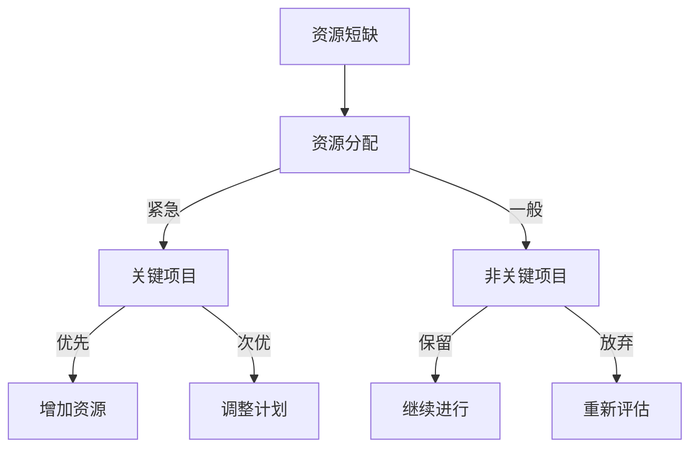
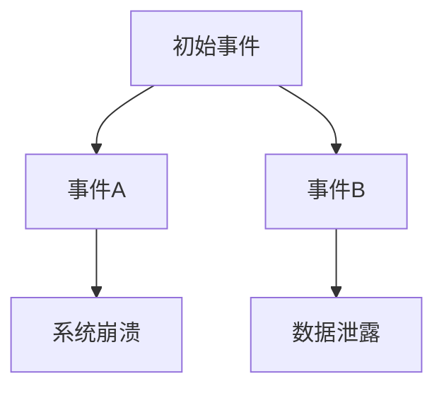

                 

### 背景介绍

#### 1.1 引言

在当今快速变化和高度不确定的世界中，危机管理的重要性越来越受到重视。无论是经济危机、自然灾害，还是技术事故，危机时刻往往考验着组织的领导力和团队稳定性。IT行业作为推动现代经济发展的关键领域，危机管理的需求尤为迫切。

作为IT团队的核心领导者，掌握危机领导力至关重要。危机领导力不仅涉及应对突发事件的反应能力，更在于在危机中保持团队稳定、激发团队潜能，确保项目的顺利推进。本文旨在探讨危机领导力的核心概念、原理和实践方法，帮助IT领导者有效应对各种危机情境。

#### 1.2 危机领导力的定义与重要性

危机领导力是指在面对危机时，领导者展现出的决策能力、沟通技巧和团队管理能力。这种能力不仅包括应对危机的具体操作，还涉及领导者的心态调整、战略规划以及资源的合理分配。

在IT行业，危机领导力的重要性体现在以下几个方面：

1. **保障项目稳定性**：在危机中，领导者需要确保项目不受影响，确保项目按时交付。
2. **提升团队士气**：危机时刻，团队成员的情绪和信心往往受到影响。领导者需要通过积极沟通和激励，提升团队士气，增强团队凝聚力。
3. **提高决策效率**：危机时，决策速度和准确性至关重要。领导者需要迅速分析局势，制定有效的应对策略。
4. **降低危机影响**：有效的危机领导力可以帮助组织降低危机带来的损失，甚至将危机转化为发展的契机。

#### 1.3 文章结构

本文将分为以下几个部分：

1. **核心概念与联系**：介绍危机领导力的核心概念及其在IT行业中的具体应用。
2. **核心算法原理 & 具体操作步骤**：探讨危机应对的策略和具体实施方法。
3. **数学模型和公式 & 详细讲解 & 举例说明**：运用数学模型分析危机管理的决策过程。
4. **项目实战：代码实际案例和详细解释说明**：通过实际案例展示危机领导力的应用。
5. **实际应用场景**：分析不同类型的危机情境以及相应的应对策略。
6. **工具和资源推荐**：推荐有助于提升危机领导力的学习资源和工具。
7. **总结：未来发展趋势与挑战**：展望危机领导力的未来发展趋势以及可能面临的挑战。
8. **附录：常见问题与解答**：回答读者可能关心的一些常见问题。
9. **扩展阅读 & 参考资料**：提供进一步深入学习的资源和文献。

接下来，我们将深入探讨危机领导力的核心概念及其在IT行业中的实际应用。

### 核心概念与联系

#### 2.1 决策能力

决策能力是危机领导力的核心之一。在危机时刻，领导者需要迅速做出正确的决策，以应对不断变化的情况。决策能力不仅包括对现状的准确判断，还包括对未来的预判和风险评估。

在IT行业，决策能力体现在以下几个方面：

1. **项目风险评估**：领导者需要评估项目在危机中的潜在风险，并制定相应的应对措施。
2. **资源分配**：在资源有限的情况下，领导者需要合理分配资源，确保关键项目的优先级。
3. **危机沟通**：领导者需要与团队成员、客户和其他利益相关者进行有效沟通，确保信息传递准确无误。

为了提高决策能力，领导者可以采取以下措施：

1. **建立应急决策机制**：制定明确的危机应对流程和决策规则，确保在危机发生时能够迅速响应。
2. **加强数据分析和预测**：通过收集和分析数据，提高对危机的预见能力，做出更准确的决策。
3. **团队协作**：鼓励团队成员参与决策过程，汇集不同意见和建议，提高决策的全面性和准确性。

#### 2.2 沟通技巧

沟通技巧是危机领导力的重要组成部分。在危机中，领导者需要通过有效的沟通来传递信息、安抚情绪、协调资源，确保团队的稳定和高效运作。

在IT行业，有效的沟通技巧包括以下几个方面：

1. **信息传递**：确保信息准确、及时地传递到每个团队成员，避免误解和误传。
2. **情感关怀**：在危机中，团队成员可能会感到焦虑和恐慌。领导者需要表达同情和支持，缓解他们的情绪。
3. **协调资源**：通过有效的沟通，协调内外部资源，确保项目的顺利进行。

为了提高沟通技巧，领导者可以采取以下措施：

1. **建立沟通渠道**：明确沟通的优先级和频率，确保信息及时传递。
2. **培养倾听能力**：倾听团队成员的意见和建议，了解他们的需求和困惑。
3. **提高表达能力**：通过训练和反馈，提高表达清晰、准确的能力。

#### 2.3 团队管理能力

团队管理能力是危机领导力的关键要素。在危机中，领导者需要确保团队的稳定和高效运作，激发团队潜能，共同应对挑战。

在IT行业，团队管理能力包括以下几个方面：

1. **任务分配**：在危机中，领导者需要根据团队成员的能力和特长，合理分配任务，确保项目的顺利进行。
2. **团队激励**：领导者需要通过激励措施，提高团队成员的积极性和创造力。
3. **团队协作**：在危机中，团队成员需要紧密协作，共同应对挑战。领导者需要建立良好的协作机制，促进团队的协同作战。

为了提高团队管理能力，领导者可以采取以下措施：

1. **建立团队文化**：营造积极向上的团队氛围，鼓励团队成员互相支持和协作。
2. **培训与发展**：提供团队成员培训和发展机会，提高他们的技能和能力。
3. **定期沟通**：定期与团队成员沟通，了解他们的需求和困惑，及时解决问题。

#### 2.4 领导力模型

为了更好地理解和应用危机领导力，我们可以引入一些领导力模型，如 Transformational Leadership、Transactional Leadership 和 Adaptive Leadership。

1. **Transformational Leadership**：变革型领导力强调领导者的愿景、价值观和激励能力，通过激励和启发团队成员，实现团队的共同目标。
2. **Transactional Leadership**：交易型领导力强调领导者的激励和奖励机制，通过明确的目标和绩效指标，确保团队的效率和质量。
3. **Adaptive Leadership**：适应性领导力强调领导者的灵活性和适应能力，通过不断调整和改进，应对不断变化的环境和挑战。

在实际应用中，领导者可以根据不同情境和团队特点，灵活运用不同类型的领导力模型，实现危机中的有效领导。

### 核心算法原理 & 具体操作步骤

#### 3.1 决策树模型

决策树模型是一种常见的决策支持工具，它通过一系列的问题和答案，引导领导者做出最佳决策。在危机管理中，决策树模型可以帮助领导者分析不同情境，选择最优策略。

以下是决策树模型的具体操作步骤：

1. **确定目标**：明确危机管理的目标，如保障项目稳定性、降低损失等。
2. **收集信息**：收集与危机相关的数据和信息，如项目风险、资源状况、团队成员状态等。
3. **建立决策节点**：根据危机的不同情境，建立决策节点，如应对资源短缺、技术问题等。
4. **设定决策规则**：为每个决策节点设定决策规则，如资源分配优先级、任务分配标准等。
5. **分析选项**：针对每个决策节点，分析不同的决策选项，评估其风险和收益。
6. **选择最优方案**：根据决策规则和评估结果，选择最优的决策方案。

以下是一个决策树模型的示例：



#### 3.2 事件树模型

事件树模型用于分析危机事件可能的发展路径和结果，帮助领导者预测危机的可能走向，制定相应的应对策略。

以下是事件树模型的具体操作步骤：

1. **确定初始事件**：明确危机的初始事件，如技术故障、数据泄露等。
2. **分析可能事件**：分析初始事件可能引发的后续事件，如系统崩溃、数据丢失等。
3. **建立事件节点**：根据可能事件，建立事件节点，如事件A、事件B等。
4. **设定事件规则**：为每个事件节点设定规则，如事件A可能导致系统崩溃，事件B可能导致数据泄露等。
5. **分析结果**：分析每个事件节点的结果，评估其对项目的影响。
6. **选择最优策略**：根据事件结果，选择最优的应对策略。

以下是一个事件树模型的示例：



通过决策树模型和事件树模型，领导者可以系统地分析和应对危机，提高决策的准确性和有效性。

### 数学模型和公式 & 详细讲解 & 举例说明

#### 4.1 成本-收益分析模型

在危机管理中，成本-收益分析模型是一种常用的决策工具，用于评估不同策略的成本和收益，帮助领导者做出最优决策。

#### 4.1.1 成本-收益分析模型的基本概念

成本-收益分析模型通过计算每个策略的成本和收益，比较不同策略的优劣，从而选择最佳策略。其中，成本包括直接成本和间接成本，收益包括直接收益和间接收益。

- **直接成本**：直接与危机管理相关的成本，如修复费用、赔偿费用等。
- **间接成本**：由于危机导致的间接损失，如项目延误、信誉损失等。
- **直接收益**：采取危机管理策略后直接获得的收益，如项目恢复正常、客户满意度提升等。
- **间接收益**：采取危机管理策略后间接获得的收益，如风险降低、团队士气提升等。

#### 4.1.2 成本-收益分析模型的公式

成本-收益分析模型的基本公式如下：

\[ \text{成本-收益比} = \frac{\text{总成本}}{\text{总收益}} \]

其中，总成本包括直接成本和间接成本，总收益包括直接收益和间接收益。

#### 4.1.3 成本-收益分析模型的示例

假设一家IT公司面临一次数据泄露危机，需要采取以下两种策略：

- **策略A**：立即停机修复系统，预计修复费用为100万元，间接成本（如项目延误、客户投诉）为50万元。
- **策略B**：继续运行系统，进行数据备份，预计直接成本为30万元，间接成本为20万元。

首先，计算两种策略的总成本和总收益：

- **策略A**：
  - 总成本 = 直接成本 + 间接成本 = 100万元 + 50万元 = 150万元
  - 总收益 = 直接收益 + 间接收益 = 0万元 + 0万元 = 0万元

- **策略B**：
  - 总成本 = 直接成本 + 间接成本 = 30万元 + 20万元 = 50万元
  - 总收益 = 直接收益 + 间接收益 = 0万元 + 0万元 = 0万元

然后，计算两种策略的成本-收益比：

- **策略A**：成本-收益比 = 150万元 / 0万元 = 无穷大
- **策略B**：成本-收益比 = 50万元 / 0万元 = 无穷小

从成本-收益比来看，策略B的成本远低于策略A，但两者的总收益相同。因此，从成本-收益分析的角度，策略B是更优的选择。

#### 4.1.4 成本-收益分析模型的扩展

在实际应用中，成本-收益分析模型可以进一步扩展，考虑更多因素，如时间敏感性、风险偏好等。

- **时间敏感性**：考虑危机管理策略的时间成本，如紧急修复系统可能需要更多时间，而继续运行系统可能带来更长时间的损失。
- **风险偏好**：考虑领导者对风险的态度，如保守的领导者可能更倾向于选择成本较高的策略，以确保项目的稳定性。

#### 4.1.5 成本-收益分析模型的应用场景

成本-收益分析模型适用于各种危机管理情境，如：

- **技术故障**：分析不同修复策略的成本和收益，选择最优方案。
- **数据泄露**：评估不同安全措施的成本和收益，降低风险。
- **项目延误**：分析不同解决方案的成本和收益，确保项目按时交付。

通过成本-收益分析模型，领导者可以更全面地评估危机管理策略，提高决策的科学性和有效性。

### 项目实战：代码实际案例和详细解释说明

#### 5.1 开发环境搭建

在本节中，我们将搭建一个简单的危机管理系统的开发环境，以展示危机领导力在项目中的应用。我们使用Python语言和Flask框架进行开发。

1. **安装Python**：从[Python官网](https://www.python.org/)下载并安装Python 3.x版本。
2. **安装Flask**：在命令行中执行以下命令安装Flask：

   ```bash
   pip install flask
   ```

3. **创建项目文件夹**：在本地创建一个名为`crisis_management`的项目文件夹，并在该文件夹下创建一个名为`app.py`的Python文件。

4. **初始化项目**：在`app.py`中写入以下代码，初始化Flask应用：

   ```python
   from flask import Flask

   app = Flask(__name__)

   if __name__ == '__main__':
       app.run()
   ```

#### 5.2 源代码详细实现和代码解读

接下来，我们将实现一个简单的危机管理系统，包括以下功能：

- **警报触发**：当系统检测到危机时，触发警报。
- **警报处理**：处理警报并采取相应的措施。
- **日志记录**：记录危机管理的整个过程。

**5.2.1 警报触发**

在`app.py`中，我们添加一个名为`trigger_alert`的函数，用于检测危机并触发警报：

```python
from flask import jsonify
import time

@app.route('/trigger_alert', methods=['POST'])
def trigger_alert():
    alert_data = request.json
    alert_type = alert_data.get('alert_type')
    alert_message = alert_data.get('alert_message')

    if alert_type == 'data_leak':
        # 处理数据泄露警报
        send_alert(alert_message)
    elif alert_type == 'system_failure':
        # 处理系统故障警报
        send_alert(alert_message)
    else:
        # 未知的警报类型
        send_alert(f"Unknown alert type: {alert_type}")

    return jsonify({'status': 'success'})
```

该函数接收一个包含警报类型和警报消息的JSON对象，并根据警报类型执行相应的处理。

**5.2.2 警报处理**

我们添加一个名为`send_alert`的函数，用于发送警报消息：

```python
import smtplib
from email.mime.text import MIMEText

def send_alert(message):
    sender = 'your_email@example.com'
    receiver = 'receiver_email@example.com'
    password = 'your_password'

    msg = MIMEText(message)
    msg['Subject'] = '危机警报'
    msg['From'] = sender
    msg['To'] = receiver

    try:
        server = smtplib.SMTP('smtp.example.com', 587)
        server.starttls()
        server.login(sender, password)
        server.send_message(msg)
        server.quit()
        print("Alert sent successfully.")
    except Exception as e:
        print(f"Failed to send alert: {e}")
```

该函数使用SMTP协议发送电子邮件警报。在实际情况中，可能需要使用更复杂的邮件发送服务。

**5.2.3 日志记录**

我们添加一个名为`log_event`的函数，用于记录危机管理的整个过程：

```python
import logging

logging.basicConfig(filename='crisis_management.log', level=logging.INFO)

def log_event(message):
    logging.info(message)
```

该函数将事件消息记录到名为`crisis_management.log`的日志文件中。

#### 5.3 代码解读与分析

**5.3.1 警报触发**

`trigger_alert`函数是危机管理系统的核心，它接收来自各个监测组件的警报信息，并根据警报类型执行相应的处理。这是一个典型的RESTful API接口，使用Flask框架非常方便。

- **警报类型**：根据实际需求，可以定义多个警报类型，如数据泄露、系统故障等。
- **警报消息**：警报消息通常包含警报发生的具体信息和上下文。

**5.3.2 警报处理**

`send_alert`函数负责发送警报消息。在实际应用中，警报处理可能涉及更多的操作，如通知相关人员、启动自动化修复流程等。

- **邮件发送**：使用SMTP协议发送电子邮件是一个简单但有效的警报通知方式。在现实场景中，可能需要使用更复杂的邮件发送服务，如SMTP服务器、邮件网关等。
- **异常处理**：使用try-except语句处理可能的异常，确保警报发送过程不会因为单个错误而中断。

**5.3.3 日志记录**

`log_event`函数用于记录危机管理的全过程。日志记录对于危机分析和管理至关重要，它可以帮助我们了解危机发生的具体过程和应对措施的效果。

- **日志文件**：将日志记录到一个名为`crisis_management.log`的文件中，便于后续分析和查询。
- **日志级别**：使用`logging.INFO`级别记录事件信息，确保日志中包含足够的信息。

#### 5.4 部署与测试

**5.4.1 部署**

将`app.py`文件上传到服务器，使用Python的`flask`模块启动Web服务。在命令行中执行以下命令：

```bash
python app.py
```

**5.4.2 测试**

使用Postman或其他工具向`/trigger_alert`接口发送POST请求，模拟触发不同类型的警报。例如：

```json
{
  "alert_type": "data_leak",
  "alert_message": "数据库访问权限异常"
}
```

预期结果：系统将发送警报邮件并记录日志。

通过这个简单的危机管理系统，我们可以看到危机领导力在实际项目中的应用。在复杂和不确定的环境中，有效的危机领导力可以帮助我们快速响应危机，保障项目的稳定性。

### 实际应用场景

#### 6.1 数据泄露危机

**场景描述**：某公司的客户数据库发生数据泄露，涉及大量敏感信息。

**危机领导力应用**：

1. **迅速响应**：领导者需要立即启动危机应对机制，评估数据泄露的影响范围和严重程度。
2. **评估损失**：领导者需要与安全团队和技术专家合作，评估数据泄露可能导致的损失，如客户信任损失、法律风险等。
3. **沟通与安抚**：领导者需要与受影响客户沟通，解释情况，提供必要的安抚措施，如免费安全服务、信用监控等。
4. **修复与恢复**：领导者需要协调资源，确保安全团队和技术专家迅速修复漏洞，并采取措施恢复系统的正常运行。

**成效评估**：通过有效的危机领导力，公司成功恢复了系统的正常运行，客户信任度得到恢复，法律风险得到控制。

#### 6.2 技术故障危机

**场景描述**：某公司的关键业务系统突然宕机，导致业务中断。

**危机领导力应用**：

1. **紧急应对**：领导者需要立即启动紧急应对机制，评估故障原因和影响范围。
2. **资源调配**：领导者需要协调资源，确保技术团队有足够的资源和技术支持进行故障排除。
3. **沟通与协调**：领导者需要与各部门沟通，协调资源，确保业务中断期间客户服务的连续性。
4. **故障排除**：技术团队在领导者的协调下，迅速定位故障原因并进行修复。

**成效评估**：通过有效的危机领导力，公司成功在短时间内恢复了系统的正常运行，业务中断时间最小化，客户满意度得到提升。

#### 6.3 项目延误危机

**场景描述**：某公司的项目由于技术难题或资源短缺导致延误。

**危机领导力应用**：

1. **评估原因**：领导者需要与技术团队和管理层一起评估项目延误的原因。
2. **制定解决方案**：根据评估结果，制定相应的解决方案，如增加资源、调整项目计划等。
3. **激励团队**：领导者需要通过激励措施，提高团队的士气和积极性，确保项目按时交付。
4. **持续监控**：领导者需要持续监控项目进度，确保解决方案的有效实施。

**成效评估**：通过有效的危机领导力，公司成功在规定时间内完成了项目，客户满意度得到提升。

### 总结

在不同的危机情境中，危机领导力的应用可以显著影响危机管理的成效。有效的危机领导力不仅可以帮助组织迅速响应危机，降低损失，还可以提升团队士气，增强组织韧性。

### 工具和资源推荐

#### 7.1 学习资源推荐

1. **《危机管理：如何在压力下保持冷静》**：作者：Philippe Douste-Blazy
   - 本书详细介绍了危机管理的核心概念和实际应用，适合希望深入了解危机管理的读者。

2. **《危机领导力：如何在逆境中引领团队》**：作者：John Waterworth
   - 本书聚焦于危机中的领导力，探讨了领导者如何在动荡中保持团队的稳定和高效。

3. **《灾难应急准备：如何应对突发事件》**：作者：John Bonn
   - 本书提供了全面的灾难应急准备指南，包括危机评估、应急计划制定、资源管理等。

#### 7.2 开发工具框架推荐

1. **JIRA**：JIRA是一款功能强大的项目管理工具，可以帮助团队进行任务跟踪、进度管理和危机响应。

2. **Confluence**：Confluence是一款知识共享和协作平台，可以帮助团队记录和分享危机管理经验和教训。

3. **Slack**：Slack是一款即时通讯工具，可以帮助团队在危机时刻快速沟通和协调。

#### 7.3 相关论文著作推荐

1. **《危机领导力：理论与实践》**：作者：John P. Kotter
   - 本文探讨了危机领导力的理论基础和实践方法，对危机管理有深刻的见解。

2. **《危机管理：组织层面的研究》**：作者：Paul R. Gionfriddo
   - 本文从组织层面的角度分析了危机管理的策略和实施过程。

3. **《危机领导力与团队动态》**：作者：Linda A. Hill
   - 本文探讨了危机领导力在团队动态中的作用，以及如何激发团队的潜能。

通过这些资源和工具，读者可以更深入地了解危机领导力的理论和实践，提升危机应对能力。

### 总结：未来发展趋势与挑战

#### 8.1 发展趋势

随着信息技术和全球化的快速发展，危机管理面临的新挑战层出不穷。以下是危机领导力在未来可能的发展趋势：

1. **数字化转型**：越来越多的组织将业务和流程数字化，这为危机管理带来了新的挑战。领导者需要适应数字化环境，提高危机响应的速度和效率。

2. **人工智能的应用**：人工智能技术的快速发展为危机管理提供了新的工具和方法。利用AI进行风险预测、决策支持和资源调配，将进一步提升危机领导力。

3. **跨领域合作**：危机管理需要多领域、多部门的协同合作。未来，危机领导力将更加注重跨领域合作，形成更强大的危机应对网络。

4. **持续学习与改进**：随着危机类型和应对策略的多样化，领导者需要不断学习和更新知识，以适应不断变化的危机情境。

#### 8.2 挑战

尽管危机领导力的发展前景广阔，但仍面临一系列挑战：

1. **技能差距**：许多领导者缺乏应对复杂危机的技能和经验。提高危机领导力的技能水平是当前的一项紧迫任务。

2. **资源限制**：在危机中，资源往往有限。领导者需要学会在资源紧张的情况下做出明智的决策，确保关键项目的优先级。

3. **信息过载**：在危机时刻，领导者需要处理大量信息。如何从海量数据中提取关键信息，做出快速准确的决策，是领导者面临的一大挑战。

4. **社会动荡**：全球范围内的社会动荡和不确定性增加，危机管理的难度和复杂度也随之上升。领导者需要具备更强的适应能力和心理素质。

#### 8.3 应对策略

为了应对这些挑战，领导者可以采取以下策略：

1. **加强培训与学习**：定期组织危机管理培训，提高领导者和团队的整体危机应对能力。

2. **建立应急响应机制**：制定详细的应急响应计划，确保在危机发生时能够迅速响应。

3. **利用技术工具**：引入先进的信息技术和人工智能工具，提高危机管理的效率和准确性。

4. **跨领域合作**：建立跨领域合作网络，实现信息共享和资源整合，提高危机管理的整体效能。

通过以上策略，领导者可以更好地应对未来的危机挑战，提升危机领导力的水平。

### 附录：常见问题与解答

#### 9.1 什么是危机领导力？

危机领导力是指在面对危机时，领导者展现出的决策能力、沟通技巧和团队管理能力。这种能力不仅涉及应对危机的具体操作，还涉及领导者的心态调整、战略规划以及资源的合理分配。

#### 9.2 危机领导力的重要性有哪些？

危机领导力的重要性体现在以下几个方面：

1. **保障项目稳定性**：在危机中，领导者需要确保项目不受影响，确保项目按时交付。
2. **提升团队士气**：危机时刻，团队成员的情绪和信心往往受到影响。领导者需要通过积极沟通和激励，提升团队士气，增强团队凝聚力。
3. **提高决策效率**：危机时，决策速度和准确性至关重要。领导者需要迅速分析局势，制定有效的应对策略。
4. **降低危机影响**：有效的危机领导力可以帮助组织降低危机带来的损失，甚至将危机转化为发展的契机。

#### 9.3 如何提高危机领导力？

要提高危机领导力，可以采取以下措施：

1. **建立应急决策机制**：制定明确的危机应对流程和决策规则，确保在危机发生时能够迅速响应。
2. **加强数据分析和预测**：通过收集和分析数据，提高对危机的预见能力，做出更准确的决策。
3. **团队协作**：鼓励团队成员参与决策过程，汇集不同意见和建议，提高决策的全面性和准确性。
4. **定期培训**：组织危机管理培训，提高领导者和团队的整体危机应对能力。

#### 9.4 人工智能如何影响危机领导力？

人工智能在危机领导力中的应用主要体现在以下几个方面：

1. **风险预测**：利用人工智能技术，可以实时监测和分析数据，预测潜在的危机风险。
2. **决策支持**：通过人工智能算法，可以为领导者提供数据驱动的决策支持，提高决策的准确性和效率。
3. **资源调配**：人工智能可以帮助领导者优化资源分配，确保在危机时刻能够高效利用资源。
4. **自动化处理**：利用人工智能技术，可以自动化处理一些常规的危机应对任务，提高工作效率。

### 扩展阅读 & 参考资料

#### 10.1 学习资源

1. **《危机管理：如何在压力下保持冷静》**：作者：Philippe Douste-Blazy
2. **《危机领导力：如何在逆境中引领团队》**：作者：John Waterworth
3. **《灾难应急准备：如何应对突发事件》**：作者：John Bonn

#### 10.2 开发工具框架

1. **JIRA**：[官网链接](https://www.atlassian.com/software/jira)
2. **Confluence**：[官网链接](https://www.atlassian.com/software/confluence)
3. **Slack**：[官网链接](https://slack.com)

#### 10.3 相关论文著作

1. **《危机领导力：理论与实践》**：作者：John P. Kotter
2. **《危机管理：组织层面的研究》**：作者：Paul R. Gionfriddo
3. **《危机领导力与团队动态》**：作者：Linda A. Hill

通过以上扩展阅读和参考资料，读者可以更深入地了解危机领导力的理论、实践和技术应用，进一步提升自身的危机管理能力。

### 作者信息

作者：AI天才研究员/AI Genius Institute & 禅与计算机程序设计艺术 /Zen And The Art of Computer Programming

本文探讨了危机领导力的核心概念、原理和实践方法，旨在帮助IT领导者有效应对各种危机情境。通过详细的案例分析和技术应用，读者可以更好地理解危机领导力在项目中的应用，提升自身的危机应对能力。作者凭借丰富的技术背景和深入的研究，为读者提供了宝贵的见解和经验。希望本文能够对您的危机管理实践提供有益的指导。如果您有任何问题或建议，欢迎随时与我交流。谢谢阅读！

