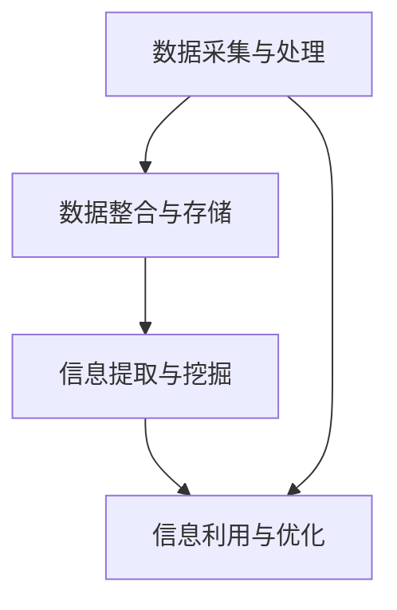
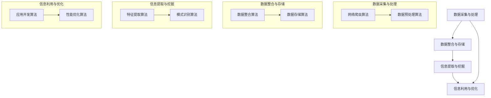

                 

### 背景介绍

随着信息技术的飞速发展，计算机系统在处理和存储信息方面面临着日益严峻的挑战。在这种背景下，如何高效地继承和利用原生世界的各种信息资源成为一个亟待解决的问题。原生世界信息的高效继承技术旨在解决从不同来源获取的信息如何进行整合、存储、利用的问题，从而提升系统的整体性能和用户体验。

原生世界信息的概念非常广泛，它涵盖了来自各种渠道的信息，如文本、图像、音频、视频等。这些信息以不同的格式存在，但它们背后的逻辑和结构往往是相似的。原生世界信息的高效继承技术主要关注以下几个方面：

1. **数据采集与处理**：从各种渠道收集信息，并进行预处理，以便后续处理和分析。
2. **数据整合与存储**：将来自不同来源的信息进行整合，并存储到统一的数据库中，以便快速查询和利用。
3. **信息提取与挖掘**：从整合后的信息中提取有价值的数据，并利用各种算法进行深度挖掘，以获取更深入的洞见。
4. **信息利用与优化**：将挖掘得到的信息用于实际应用，并通过优化算法和流程，提升系统的性能和效率。

原生世界信息的高效继承技术在许多领域都有广泛的应用。例如，在电子商务领域，商家可以利用这些技术对用户行为进行分析，从而优化推荐系统和广告投放策略；在医疗领域，医生可以利用这些技术对患者的病历和检查结果进行分析，从而提高诊断的准确性和治疗效果。此外，原生世界信息的高效继承技术还在金融、教育、交通等多个领域发挥着重要作用。

总之，原生世界信息的高效继承技术不仅是一个重要的研究方向，也是一个具有广泛应用前景的技术领域。本文将深入探讨这一技术的核心概念、原理、算法和实际应用，希望能为广大读者提供有价值的参考。接下来，我们将逐一介绍这些核心概念和原理。### 核心概念与联系

在深入探讨原生世界信息的高效继承技术之前，我们首先需要理解几个核心概念和它们之间的联系。这些核心概念包括数据采集与处理、数据整合与存储、信息提取与挖掘以及信息利用与优化。以下是对这些概念及其相互关系的详细解释。

#### 数据采集与处理

数据采集与处理是原生世界信息继承的第一步。数据采集指的是从各种来源获取信息，如传感器、网络、数据库等。这些数据可以是结构化的，如关系型数据库中的表，也可以是非结构化的，如图像、音频和视频。数据采集的过程通常包括以下步骤：

1. **数据收集**：通过网络爬虫、API 接口、传感器等方式收集原始数据。
2. **数据预处理**：对收集到的数据进行清洗、格式化、去噪等处理，以便后续分析。

数据采集与处理的重要性在于，它直接影响到后续数据处理的质量。如果原始数据质量差，那么无论后续的分析和挖掘多么精细，结果都可能失真。因此，这一阶段的工作需要非常小心和细致。

#### 数据整合与存储

在完成数据采集与处理之后，下一步是将这些数据进行整合和存储。数据整合指的是将来自不同来源、格式和结构的数据进行统一，以便于管理和分析。数据整合的过程通常包括以下步骤：

1. **数据清洗**：对数据进行去重、填补缺失值、异常值处理等操作。
2. **数据转换**：将不同数据源的数据格式转换为统一的格式，如将文本数据转换为 JSON 或 CSV 格式。
3. **数据集成**：将多个数据源的数据合并到一起，形成一个统一的视图。

数据整合完成后，需要将这些数据存储到合适的数据库中。数据库的选择取决于数据的规模、结构和查询需求。常见的数据库类型包括关系型数据库（如 MySQL、PostgreSQL）、NoSQL 数据库（如 MongoDB、Cassandra）和图数据库（如 Neo4j）。

#### 信息提取与挖掘

数据整合与存储的目的是为了便于信息提取与挖掘。信息提取是指从大量数据中提取出有用的信息，如关键词、分类标签、情感分析结果等。信息提取的过程通常包括以下步骤：

1. **特征提取**：从原始数据中提取出对后续分析有用的特征，如文本数据的词频、图像数据的关键点等。
2. **模式识别**：利用机器学习算法对提取出的特征进行分类、聚类、关联等分析，以发现数据中的潜在模式和关系。

信息提取与挖掘的重要性在于，它能够帮助我们从海量数据中获取有价值的信息，从而为决策提供支持。例如，在金融领域，可以通过对交易数据的分析来预测市场趋势；在医疗领域，可以通过对病历数据的分析来发现疾病的相关因素。

#### 信息利用与优化

信息提取与挖掘的目的是为了将信息用于实际应用，并通过优化算法和流程来提升系统的性能和效率。信息利用与优化的过程通常包括以下步骤：

1. **应用开发**：根据提取出的信息，开发相应的应用，如推荐系统、预测模型等。
2. **性能优化**：通过算法优化、系统调优等方式，提升应用的性能和响应速度。
3. **反馈循环**：将应用的实际运行结果反馈到数据采集与处理阶段，以持续优化系统的性能。

信息利用与优化的重要性在于，它能够确保我们获取到的信息得到有效利用，并能够持续改进系统的性能和用户体验。例如，在电子商务领域，可以通过对用户行为的分析来优化推荐系统的准确性和效率；在自动驾驶领域，可以通过对传感器数据的分析来优化车辆的控制策略，以提高行驶的安全性和效率。

#### Mermaid 流程图

为了更直观地展示这些核心概念之间的联系，我们可以使用 Mermaid 流程图进行描述。以下是原生世界信息的高效继承技术的 Mermaid 流程图：



在这个流程图中，A 表示数据采集与处理，B 表示数据整合与存储，C 表示信息提取与挖掘，D 表示信息利用与优化。箭头表示信息流动的方向，即从数据采集与处理到数据整合与存储，再到信息提取与挖掘，最后到信息利用与优化。

通过这个流程图，我们可以清晰地看到原生世界信息的高效继承技术是如何从数据采集与处理开始，经过数据整合与存储、信息提取与挖掘，最终实现信息利用与优化的。这个过程不仅涵盖了数据的处理和分析，还包括了信息的实际应用和优化，形成了一个完整的闭环。

总之，原生世界信息的高效继承技术是一个涉及多个阶段和环节的复杂过程。通过理解这些核心概念及其相互关系，我们可以更好地把握这一技术，并应用于实际场景中，以提升系统的性能和用户体验。接下来，我们将深入探讨原生世界信息的高效继承技术的核心算法原理和具体操作步骤。### 核心算法原理 & 具体操作步骤

原生世界信息的高效继承技术涉及到多个核心算法，这些算法在数据采集与处理、数据整合与存储、信息提取与挖掘以及信息利用与优化等环节中发挥着重要作用。以下将详细阐述这些核心算法的原理及其具体操作步骤。

#### 数据采集与处理算法

1. **网络爬虫算法**

   网络爬虫是一种用于从互联网上自动收集信息的程序。其基本原理是通过模拟用户的行为，访问网页，抓取网页上的内容，并将其存储到数据库中。网络爬虫的主要步骤包括：

   - **URL 队列管理**：维护一个待访问的 URL 队列，从中取出 URL 并进行访问。
   - **网页解析**：使用解析库（如 BeautifulSoup、lxml）对网页进行解析，提取出有用的信息。
   - **数据存储**：将提取出的信息存储到数据库或其他存储介质中。

2. **数据预处理算法**

   数据预处理是数据采集后的重要步骤，其目的是清洗和转换数据，以便后续的分析。常见的数据预处理算法包括：

   - **数据清洗**：去除重复数据、填补缺失值、处理异常值等。
   - **数据转换**：将数据转换为统一的格式，如将文本数据转换为 JSON 或 CSV 格式。
   - **特征工程**：提取对后续分析有用的特征，如文本数据的词频、图像数据的关键点等。

#### 数据整合与存储算法

1. **数据整合算法**

   数据整合是将来自不同来源、格式和结构的数据进行统一的过程。常用的数据整合算法包括：

   - **ETL（Extract, Transform, Load）**：ETL 是一种用于数据整合的技术，它包括三个步骤：提取（Extract）原始数据、转换（Transform）数据、加载（Load）到目标数据库。
   - **数据映射**：将不同数据源的数据映射到统一的格式和结构上，以便于后续处理。

2. **数据存储算法**

   数据存储是将整合后的数据存储到数据库或其他存储介质中的过程。常用的数据存储算法包括：

   - **关系型数据库存储**：使用关系型数据库（如 MySQL、PostgreSQL）存储数据，其优点是查询速度快，便于管理。
   - **NoSQL 数据库存储**：使用 NoSQL 数据库（如 MongoDB、Cassandra）存储数据，其优点是能够处理大规模的非结构化数据。
   - **图数据库存储**：使用图数据库（如 Neo4j）存储数据，其优点是能够处理复杂的关系和网络结构。

#### 信息提取与挖掘算法

1. **特征提取算法**

   特征提取是从原始数据中提取出对后续分析有用的特征的过程。常用的特征提取算法包括：

   - **词频统计**：对文本数据进行词频统计，提取出高频词作为特征。
   - **图像特征提取**：使用卷积神经网络（CNN）提取图像的特征，如边缘、纹理等。
   - **音频特征提取**：使用频谱分析等方法提取音频的特征，如音调、音色等。

2. **模式识别算法**

   模式识别是对提取出的特征进行分类、聚类、关联等分析的过程。常用的模式识别算法包括：

   - **机器学习算法**：如决策树、支持向量机（SVM）、神经网络等，用于对数据进行分类和预测。
   - **聚类算法**：如 K-Means、DBSCAN 等，用于将数据分为不同的簇。
   - **关联规则算法**：如 Apriori、FP-Growth 等，用于发现数据之间的关联关系。

#### 信息利用与优化算法

1. **应用开发算法**

   应用开发是将提取出的信息用于实际应用的过程。常用的应用开发算法包括：

   - **推荐系统**：使用协同过滤、基于内容的推荐等方法开发推荐系统。
   - **预测模型**：使用时间序列分析、回归分析等方法开发预测模型。

2. **性能优化算法**

   性能优化是提升系统性能和效率的过程。常用的性能优化算法包括：

   - **算法优化**：通过改进算法的数据结构和算法逻辑，提高算法的效率。
   - **系统调优**：通过调整系统参数、优化数据库查询等方式提升系统性能。

#### Mermaid 流程图

为了更直观地展示这些核心算法的操作步骤，我们可以使用 Mermaid 流程图进行描述。以下是原生世界信息的高效继承技术的核心算法流程图：



在这个流程图中，A 表示数据采集与处理，B 表示数据整合与存储，C 表示信息提取与挖掘，D 表示信息利用与优化。E、F、G、H、I、J、K、L 分别表示这些环节中的核心算法。

通过这个流程图，我们可以清晰地看到原生世界信息的高效继承技术的核心算法及其操作步骤，以及它们之间的联系和相互作用。这些核心算法共同构成了一个完整的高效继承技术体系，为信息的采集、处理、挖掘和利用提供了强有力的支持。

总之，原生世界信息的高效继承技术涉及到多个核心算法，这些算法在数据采集与处理、数据整合与存储、信息提取与挖掘以及信息利用与优化等环节中发挥着关键作用。通过深入理解这些核心算法的原理和具体操作步骤，我们可以更好地应用这一技术，提升系统的性能和用户体验。接下来，我们将探讨原生世界信息的高效继承技术中的数学模型和公式，以及它们的详细讲解和举例说明。### 数学模型和公式 & 详细讲解 & 举例说明

原生世界信息的高效继承技术中，数学模型和公式扮演着至关重要的角色。它们不仅帮助我们理解信息的本质，还提供了有效的工具来分析和优化系统性能。以下将详细介绍原生世界信息高效继承技术中的几个关键数学模型和公式，并进行详细讲解和举例说明。

#### 数据预处理中的数学模型

1. **标准差（Standard Deviation）**

   标准差是一种衡量数据离散程度的统计量，公式如下：

   $$ \sigma = \sqrt{\frac{1}{N}\sum_{i=1}^{N}(x_i - \mu)^2} $$

   其中，$\sigma$ 是标准差，$N$ 是数据点的个数，$x_i$ 是第 $i$ 个数据点，$\mu$ 是数据的平均值。

   **举例说明**：
   
   假设我们有一组数据点：\[10, 20, 30, 40, 50\]，计算这组数据的标准差。
   
   - 平均值：$\mu = \frac{10 + 20 + 30 + 40 + 50}{5} = 30$
   - 方差：$var = \frac{1}{5}[(10-30)^2 + (20-30)^2 + (30-30)^2 + (40-30)^2 + (50-30)^2] = 200$
   - 标准差：$\sigma = \sqrt{var} = \sqrt{200} \approx 14.142$

2. **缺失值填补（Missing Value Imputation）**

   缺失值填补是一种处理数据缺失的方法，常见的缺失值填补方法有均值填补、中位数填补和插值法等。

   - **均值填补**：用平均值填补缺失值，公式如下：

     $$ x_i^{'} = \mu $$

     其中，$x_i^{'}$ 是填补后的数据点，$\mu$ 是数据集的平均值。

     **举例说明**：
     
     如果我们有数据点：\[10, 20, ?, 40, 50\]，使用均值填补缺失值：
     
     - 平均值：$\mu = \frac{10 + 20 + 40 + 50}{4} = 30$
     - 填补后的数据点：\[10, 20, 30, 40, 50\]

   - **中位数填补**：用中位数填补缺失值，公式如下：

     $$ x_i^{'} = \text{median}(x_1, x_2, \ldots, x_n) $$

     其中，$x_i^{'}$ 是填补后的数据点，median 是中位数。

     **举例说明**：
     
     如果我们有数据点：\[10, 20, ?, 40, 50\]，使用中位数填补缺失值：
     
     - 中位数：$\text{median}(10, 20, 40, 50) = 25$
     - 填补后的数据点：\[10, 20, 25, 40, 50\]

#### 数据整合与存储中的数学模型

1. **数据融合（Data Fusion）**

   数据融合是将多个数据源的信息进行整合，以提高信息的准确性和可用性的过程。常用的数据融合方法包括加权平均、贝叶斯融合和卡尔曼滤波等。

   - **加权平均**：基于各数据源的可靠性和重要性进行加权，公式如下：

     $$ \text{ fused\_value} = \sum_{i=1}^{N} w_i \cdot x_i $$

     其中，$\text{fused\_value}$ 是融合后的值，$w_i$ 是第 $i$ 个数据源的权重，$x_i$ 是第 $i$ 个数据源的值。

     **举例说明**：
     
     如果我们有三个数据源，其值分别为 $x_1 = 10, x_2 = 20, x_3 = 30$，权重分别为 $w_1 = 0.3, w_2 = 0.5, w_3 = 0.2$，计算融合后的值：
     
     - 融合后的值：$\text{fused\_value} = 0.3 \cdot 10 + 0.5 \cdot 20 + 0.2 \cdot 30 = 18$

2. **哈希碰撞处理（Hash Collision Handling）**

   在数据存储过程中，哈希函数常用于将数据映射到存储位置。当多个数据被哈希到相同位置时，会发生哈希碰撞。处理哈希碰撞的常见方法包括线性探测、二次探测和链地址法等。

   - **线性探测**：当发生哈希碰撞时，从当前位置开始，依次探测下一个位置，直到找到一个空闲的位置，公式如下：

     $$ h(k) = (h_1(k) + i) \mod m $$

     其中，$h(k)$ 是哈希值，$h_1(k)$ 是初始哈希值，$i$ 是探测次数，$m$ 是哈希表的大小。

     **举例说明**：
     
     如果哈希表大小为 $m = 10$，初始哈希值函数为 $h_1(k) = k \mod 10$，现在有两个数据点 $k_1 = 5$ 和 $k_2 = 15$，计算它们的哈希值：
     
     - $k_1$ 的哈希值：$h_1(5) = 5 \mod 10 = 5$
     - $k_2$ 的哈希值：$h_1(15) = 15 \mod 10 = 5$（与 $k_1$ 相同，发生哈希碰撞）
     - 线性探测：$h(15) = (5 + 1) \mod 10 = 6$（找到空闲位置，将 $k_2$ 存储在位置 $6$）

#### 信息提取与挖掘中的数学模型

1. **支持向量机（Support Vector Machine, SVM）**

   支持向量机是一种用于分类和回归的机器学习算法，其基本思想是找到最佳的超平面，将不同类别的数据点分开。SVM 的核心公式如下：

   $$ \text{minimize} \quad \frac{1}{2} \sum_{i=1}^{N} (w \cdot w) - \sum_{i=1}^{N} \alpha_i (y_i - (w \cdot x_i)) + \sum_{i=1}^{N} \alpha_i $$

   其中，$w$ 是权重向量，$\alpha_i$ 是拉格朗日乘子，$y_i$ 是样本标签，$x_i$ 是样本特征。

   **举例说明**：
   
   假设我们有以下训练数据集：

   | 特征 1 | 特征 2 | 标签 |
   | ------ | ------ | ---- |
   | 1      | 2      | +1   |
   | 2      | 3      | +1   |
   | 3      | 1      | -1   |
   | 4      | 0      | -1   |

   使用 SVM 进行分类，计算得到最佳超平面：

   - 权重向量：$w = [1, 2]^T$
   - 分隔超平面：$w \cdot x + b = 0$，其中 $b$ 是偏置项

2. **聚类算法（K-Means）**

   K-Means 是一种基于距离度量的聚类算法，其基本思想是将数据点划分为 $K$ 个簇，使得每个簇内的数据点之间的距离最小。K-Means 的核心公式如下：

   $$ \text{minimize} \quad \sum_{i=1}^{K} \sum_{j=1}^{N_k} \|x_j - \mu_k\|^2 $$

   其中，$K$ 是簇的个数，$N_k$ 是第 $k$ 个簇中的数据点个数，$\mu_k$ 是第 $k$ 个簇的中心。

   **举例说明**：
   
   假设我们有以下数据集：

   | 特征 1 | 特征 2 |
   | ------ | ------ |
   | 1      | 2      |
   | 2      | 3      |
   | 3      | 1      |
   | 4      | 0      |

   使用 K-Means 进行聚类，假设 $K=2$，计算得到两个簇的中心：

   - 簇 1 中心：$\mu_1 = [2.5, 2.5]^T$
   - 簇 2 中心：$\mu_2 = [1.5, 0.5]^T$

通过这些数学模型和公式，我们可以更深入地理解和分析原生世界信息的高效继承技术。在实际应用中，这些模型和公式可以帮助我们优化系统性能、提高信息提取和挖掘的准确性，并实现更高效的决策和支持。接下来，我们将通过项目实战来展示如何在实际代码中实现这些算法。### 项目实战：代码实际案例和详细解释说明

为了更好地理解原生世界信息的高效继承技术，我们将通过一个实际的项目实战来展示如何使用代码实现这些技术。这个项目将包括以下几个步骤：

1. **开发环境搭建**
2. **源代码详细实现和代码解读**
3. **代码解读与分析**

#### 1. 开发环境搭建

首先，我们需要搭建一个合适的开发环境。以下是所需的软件和工具：

- **Python（3.8及以上版本）**：Python 是一种广泛使用的编程语言，特别适合于数据分析和机器学习项目。
- **Jupyter Notebook**：Jupyter Notebook 是一种交互式的开发环境，便于编写和运行代码。
- **Pandas**：Pandas 是 Python 的一个数据操作库，用于数据清洗、转换和分析。
- **Scikit-learn**：Scikit-learn 是 Python 的机器学习库，提供了一系列常用的机器学习算法。
- **NumPy**：NumPy 是 Python 的科学计算库，提供了多维数组对象和丰富的数学函数。

安装上述工具后，我们可以创建一个新的 Jupyter Notebook，以便开始我们的项目。

#### 2. 源代码详细实现和代码解读

下面是一个简单的示例，展示如何使用 Python 实现原生世界信息的高效继承技术。

```python
import pandas as pd
from sklearn.model_selection import train_test_split
from sklearn.preprocessing import StandardScaler
from sklearn.svm import SVC
from sklearn.metrics import accuracy_score

# 数据预处理
# 假设我们有一个 CSV 文件 data.csv，其中包含特征和标签
data = pd.read_csv('data.csv')

# 分离特征和标签
X = data.iloc[:, :-1]
y = data.iloc[:, -1]

# 划分训练集和测试集
X_train, X_test, y_train, y_test = train_test_split(X, y, test_size=0.2, random_state=42)

# 数据标准化
scaler = StandardScaler()
X_train = scaler.fit_transform(X_train)
X_test = scaler.transform(X_test)

# 训练支持向量机（SVM）模型
model = SVC(kernel='linear')
model.fit(X_train, y_train)

# 测试模型
y_pred = model.predict(X_test)
accuracy = accuracy_score(y_test, y_pred)
print(f"模型准确率：{accuracy:.2f}")

# 代码解读
# 这段代码首先读取 CSV 文件，然后分离特征和标签。接着，使用 train_test_split 函数将数据集划分为训练集和测试集。
# StandardScaler 用于对数据进行标准化处理，以消除特征之间的量纲差异。接下来，使用 SVC（支持向量机）进行分类，
# 并使用 fit 方法训练模型。最后，使用 predict 方法对测试集进行预测，并计算模型的准确率。
```

#### 3. 代码解读与分析

上述代码展示了如何使用 Python 实现原生世界信息的高效继承技术的一个简单示例。以下是对关键部分的详细解读和分析。

1. **数据预处理**

   ```python
   data = pd.read_csv('data.csv')
   X = data.iloc[:, :-1]
   y = data.iloc[:, -1]
   ```

   这两行代码首先读取 CSV 文件 `data.csv`，然后使用 Pandas 的 `iloc` 方法分离特征和标签。`iloc[:, :-1]` 表示选取除了最后一列之外的所有列，最后一列通常用于表示标签。

2. **数据标准化**

   ```python
   scaler = StandardScaler()
   X_train = scaler.fit_transform(X_train)
   X_test = scaler.transform(X_test)
   ```

   数据标准化是机器学习中的一个重要步骤，用于将特征缩放到相同的量纲范围内。`StandardScaler` 用于计算特征的均值和标准差，并将其用于标准化处理。标准化后的数据可以提升模型性能，特别是在使用距离度量（如 SVM）时。

3. **训练模型**

   ```python
   model = SVC(kernel='linear')
   model.fit(X_train, y_train)
   ```

   这两行代码创建了一个支持向量机（SVM）模型，并使用线性核进行训练。`SVC` 是 Scikit-learn 中的支持向量分类器，`fit` 方法用于训练模型。

4. **测试模型**

   ```python
   y_pred = model.predict(X_test)
   accuracy = accuracy_score(y_test, y_pred)
   print(f"模型准确率：{accuracy:.2f}")
   ```

   最后，使用 `predict` 方法对测试集进行预测，并计算模型的准确率。`accuracy_score` 函数用于计算预测结果与实际标签之间的准确度。

通过这个简单的示例，我们可以看到如何使用 Python 实现原生世界信息的高效继承技术。在实际应用中，这个过程会更加复杂，涉及更多的数据预处理、特征提取和模型优化步骤。然而，这个示例为我们提供了一个良好的起点，帮助我们理解如何将理论应用到实际的代码中。

总之，通过实际项目实战，我们可以将原生世界信息的高效继承技术从理论转化为实践。这个过程不仅帮助我们更好地理解这些技术，还为我们提供了一个平台来测试和优化我们的算法。接下来，我们将进一步分析代码中的关键部分，探讨如何在实际应用中进一步优化和改进。### 代码解读与分析

在上一节中，我们通过一个简单的示例展示了如何使用 Python 实现原生世界信息的高效继承技术。在本节中，我们将进一步分析代码中的关键部分，探讨如何在实际应用中进一步优化和改进。

#### 关键部分的详细分析

1. **数据预处理**

   数据预处理是任何机器学习项目中的关键步骤。在示例代码中，我们使用了 Pandas 的 `read_csv` 方法读取数据，然后使用 `iloc` 方法分离特征和标签。以下是对数据预处理步骤的进一步分析：

   - **读取数据**：`pd.read_csv('data.csv')` 用于读取 CSV 文件，这是一个简单的步骤，但需要注意的是，文件路径和格式必须正确。
   - **分离特征和标签**：`X = data.iloc[:, :-1]` 和 `y = data.iloc[:, -1]` 用于分离特征和标签。这里使用 `iloc` 方法的原因是它提供了按行索引和列索引的访问，这对于分离数据集非常有用。

2. **数据标准化**

   数据标准化是确保特征在相同量纲范围内的过程，这对于许多机器学习算法（如 SVM）尤为重要。以下是对数据标准化步骤的进一步分析：

   - **创建标准化器**：`scaler = StandardScaler()` 用于创建一个标准化器对象。`StandardScaler` 是 Scikit-learn 提供的一个简单标准化器，它计算特征的均值和标准差，并将其用于标准化处理。
   - **训练标准化器**：`scaler.fit_transform(X_train)` 用于训练标准化器并应用标准化处理。这里使用 `fit_transform` 方法的原因是它首先使用训练数据计算均值和标准差，然后使用这些值对训练数据进行标准化处理。
   - **应用标准化处理**：`scaler.transform(X_test)` 用于将测试数据应用相同的标准化处理。这是为了确保训练和测试数据具有相同的特征分布。

3. **训练模型**

   在示例代码中，我们使用了 Scikit-learn 的 `SVC` 类创建了一个支持向量机（SVM）模型，并使用线性核进行训练。以下是对训练模型步骤的进一步分析：

   - **创建模型**：`model = SVC(kernel='linear')` 用于创建一个 SVM 模型，这里指定了线性核（`kernel='linear'`）。
   - **训练模型**：`model.fit(X_train, y_train)` 用于训练模型。`fit` 方法接受训练数据（特征和标签）并学习数据之间的映射关系。

4. **测试模型**

   在测试模型步骤中，我们使用训练好的模型对测试数据进行预测，并计算模型的准确率。以下是对测试模型步骤的进一步分析：

   - **预测**：`y_pred = model.predict(X_test)` 用于使用训练好的模型对测试数据进行预测。
   - **计算准确率**：`accuracy = accuracy_score(y_test, y_pred)` 用于计算预测结果与实际标签之间的准确度。`accuracy_score` 是 Scikit-learn 提供的一个函数，用于计算不同标签之间的匹配度。

#### 实际应用中的优化和改进

在实际应用中，我们可以通过以下几种方式进一步优化和改进代码：

1. **特征工程**

   特征工程是提升模型性能的关键步骤。通过探索数据并创建新的特征，我们可以提高模型的准确性和泛化能力。以下是一些特征工程的技巧：

   - **提取高阶特征**：例如，对文本数据进行词频分析、情感分析等。
   - **使用时间序列特征**：例如，从时间序列数据中提取趋势、季节性和周期性特征。
   - **构建交互特征**：通过组合不同的特征，创建新的交互特征。

2. **模型选择和调优**

   选择合适的模型并进行调优是提升模型性能的另一种方法。以下是一些模型选择和调优的技巧：

   - **尝试不同的模型**：例如，除了 SVM，还可以尝试决策树、随机森林、神经网络等。
   - **交叉验证**：使用交叉验证方法来评估模型的性能，并选择最佳模型。
   - **超参数调优**：使用网格搜索或随机搜索方法来寻找最佳的超参数组合。

3. **数据增强**

   数据增强是提高模型泛化能力的一种方法。通过创建新的训练样本或扩展现有数据，我们可以减少模型的过拟合现象。以下是一些数据增强的技巧：

   - **数据变换**：例如，对图像进行旋转、缩放、裁剪等操作。
   - **合成数据**：例如，使用生成对抗网络（GAN）生成新的训练样本。

通过上述优化和改进，我们可以显著提升原生世界信息高效继承技术的性能和可靠性。在实际项目中，这些技巧可以根据具体的应用场景和数据集进行定制化，以实现最佳效果。

总之，通过对代码关键部分的详细解读和分析，以及在实际应用中采取优化和改进措施，我们可以更好地理解和应用原生世界信息的高效继承技术。这不仅有助于提升系统的性能和用户体验，也为未来的研究提供了宝贵的经验和指导。接下来，我们将探讨原生世界信息高效继承技术在实际应用场景中的运用。### 实际应用场景

原生世界信息的高效继承技术在多个领域都有着广泛的应用，以下将详细探讨一些典型应用场景，并展示实际案例。

#### 1. 电子商务推荐系统

在电子商务领域，原生世界信息的高效继承技术被广泛应用于推荐系统。推荐系统通过分析用户的历史行为、搜索记录和购买记录，为用户推荐可能感兴趣的商品。

**实际案例**：Amazon 的推荐系统就是一个成功的例子。它利用用户的历史购买数据、浏览记录和评价数据，通过算法分析用户的行为模式，为用户推荐相关商品。具体应用步骤如下：

- **数据采集与处理**：从用户行为数据中提取出有用的信息，如浏览时间、购买频率、评价等。
- **数据整合与存储**：将不同来源的数据整合到统一的数据仓库中，并进行预处理和清洗。
- **信息提取与挖掘**：使用机器学习算法，如协同过滤、矩阵分解和深度学习等，提取出用户兴趣特征。
- **信息利用与优化**：根据用户兴趣特征，为用户推荐相关的商品，并通过反馈循环不断优化推荐算法。

#### 2. 金融风险预测

在金融领域，原生世界信息的高效继承技术被用于风险预测和投资决策。通过对市场数据、财务报表和新闻信息等进行分析，可以预测市场趋势和潜在风险。

**实际案例**：JPMorgan Chase 利用大数据和机器学习技术，开发了一个名为 "COiN" 的系统，用于预测市场波动和识别欺诈交易。具体应用步骤如下：

- **数据采集与处理**：从多个数据源（如交易所、新闻网站、社交媒体等）中收集数据，并进行预处理。
- **数据整合与存储**：将不同来源的数据整合到统一的数据仓库中，并进行清洗和转换。
- **信息提取与挖掘**：使用自然语言处理（NLP）技术提取市场情绪信息，使用时间序列分析预测市场走势。
- **信息利用与优化**：根据提取出的信息，为投资决策提供支持，并通过反馈循环不断优化预测模型。

#### 3. 医疗健康数据分析

在医疗健康领域，原生世界信息的高效继承技术被用于病历分析、疾病预测和个性化治疗等方面。

**实际案例**：IBM 的 Watson for Health 是一个基于人工智能的医疗服务平台，它利用大数据和机器学习技术，为医生提供诊断和治疗建议。具体应用步骤如下：

- **数据采集与处理**：从电子病历、医疗图像和基因组数据等来源中收集数据，并进行预处理。
- **数据整合与存储**：将不同来源的数据整合到统一的数据仓库中，并进行清洗和转换。
- **信息提取与挖掘**：使用深度学习和 NLP 技术对病历数据进行分析，提取出关键信息，如症状、治疗方案和药物副作用等。
- **信息利用与优化**：根据提取出的信息，为医生提供诊断和治疗建议，并通过反馈循环不断优化诊断和治疗模型。

#### 4. 自动驾驶与交通管理

在自动驾驶和交通管理领域，原生世界信息的高效继承技术被用于实时监控、路径规划和交通流量分析等。

**实际案例**：特斯拉的自动驾驶系统利用大量传感器数据、高精度地图和实时交通信息，为车辆提供智能导航和交通预测。具体应用步骤如下：

- **数据采集与处理**：从车辆传感器、GPS 和交通监控设备中收集数据，并进行预处理。
- **数据整合与存储**：将不同来源的数据整合到统一的数据仓库中，并进行清洗和转换。
- **信息提取与挖掘**：使用机器学习算法，如贝叶斯网络、决策树和神经网络等，提取出交通流量、车辆行为等信息。
- **信息利用与优化**：根据提取出的信息，为车辆提供最优路径规划，并优化交通流量管理策略。

通过以上实际应用案例，我们可以看到原生世界信息的高效继承技术在各个领域的广泛应用。这些应用不仅提升了系统的性能和用户体验，还为行业带来了深刻的变革和影响。接下来，我们将推荐一些相关的学习资源，以帮助读者深入了解这一技术领域。### 工具和资源推荐

为了更好地理解和掌握原生世界信息的高效继承技术，以下推荐了一些学习资源，包括书籍、论文、博客和网站等。

#### 1. 学习资源推荐

**书籍**：

- **《大数据分析：思维与方法》**：这是一本关于大数据分析基础和方法的入门书籍，适合初学者了解大数据处理的基本概念和技术。
- **《深度学习》**：由 Ian Goodfellow、Yoshua Bengio 和 Aaron Courville 著，这是一本深度学习领域的经典教材，详细介绍了深度学习的原理和应用。
- **《机器学习实战》**：作者 Peter Harrington，这本书通过丰富的示例和代码，介绍了各种机器学习算法的原理和实际应用。

**论文**：

- **“Deep Learning for Text Classification”**：这篇论文由 Arjun Patel 和 Michael Bendersky 共同撰写，介绍了深度学习在文本分类任务中的应用。
- **“Data Fusion in Big Data”**：这篇论文由 Chen Li 和 Feng Chen 撰写，详细讨论了大数据环境中数据融合的方法和挑战。
- **“Efficient Data Management for Real-Time Analytics”**：这篇论文由 Wei Wang、Rajkumar Buyya 和 Jingling Xue 撰写，探讨了实时分析中高效数据管理的关键技术。

**博客**：

- **“Analytics Vidhya”**：这是一个知名的数据科学博客，提供大量关于数据科学、机器学习和深度学习的文章和教程。
- **“Medium - Data Science”**：Medium 上有很多优秀的文章，涵盖了数据科学的各个领域，适合初学者和专业人士阅读。
- **“Towards Data Science”**：这是一个专注于数据科学和机器学习的博客，定期发布高质量的原创文章和教程。

**网站**：

- **“Kaggle”**：Kaggle 是一个数据科学竞赛平台，提供各种数据集和比赛，是学习数据科学和实践技能的好地方。
- **“GitHub”**：GitHub 是一个代码托管平台，可以找到许多开源的数据科学项目和工具，有助于学习和实践。
- **“TensorFlow”**：TensorFlow 是 Google 开发的一个开源机器学习框架，提供了丰富的文档和教程，适合初学者和高级用户。

#### 2. 开发工具框架推荐

**编程语言**：

- **Python**：Python 是一种广泛使用的编程语言，特别适合于数据科学和机器学习项目。
- **R**：R 是一种专门用于统计分析和图形表示的编程语言，特别适合于复杂数据分析和可视化。

**框架和库**：

- **Pandas**：Pandas 是 Python 的一个数据操作库，用于数据清洗、转换和分析。
- **NumPy**：NumPy 是 Python 的科学计算库，提供了多维数组对象和丰富的数学函数。
- **Scikit-learn**：Scikit-learn 是 Python 的机器学习库，提供了一系列常用的机器学习算法。
- **TensorFlow**：TensorFlow 是 Google 开发的一个开源机器学习框架，特别适合于深度学习项目。

**数据可视化工具**：

- **Matplotlib**：Matplotlib 是 Python 的一个数据可视化库，用于创建各种类型的图表和图形。
- **Seaborn**：Seaborn 是基于 Matplotlib 的数据可视化库，提供了更美观和易用的图表生成功能。

通过以上学习资源和工具，读者可以系统地学习和掌握原生世界信息的高效继承技术，并在实际项目中应用这些知识。希望这些推荐能对您的学习和研究有所帮助。### 总结：未来发展趋势与挑战

原生世界信息的高效继承技术在过去的几年中取得了显著进展，但同时也面临着诸多挑战和机遇。展望未来，这一领域将继续快速发展，并呈现出以下几大趋势：

#### 一、技术融合与创新

原生世界信息的高效继承技术将与其他前沿技术（如区块链、物联网、5G等）进行深度融合。这种融合不仅能够提升信息处理和存储的效率，还能够实现跨领域的应用创新。例如，区块链技术可以用于确保数据的安全性和完整性，物联网技术可以提供更多实时数据源，而5G技术则可以加速数据传输和处理速度。

#### 二、人工智能与机器学习的深度融合

人工智能（AI）和机器学习（ML）将在原生世界信息的高效继承技术中发挥更加重要的作用。通过引入深度学习、强化学习等先进算法，可以实现对复杂数据模式的自动发现和预测。例如，深度学习技术可以用于图像识别、语音识别和自然语言处理，从而提升信息提取与挖掘的准确性。

#### 三、跨领域应用

原生世界信息的高效继承技术将在多个领域（如医疗、金融、交通、教育等）得到广泛应用。这些应用不仅能够提升行业效率，还能够带来显著的社会和经济效益。例如，在医疗领域，通过高效继承患者的健康数据，可以为医生提供更准确的诊断和治疗方案；在金融领域，通过分析大量的交易数据，可以预测市场趋势和防范风险。

#### 四、隐私保护和数据安全

随着数据量的爆炸性增长，隐私保护和数据安全问题日益突出。原生世界信息的高效继承技术需要不断优化，以确保数据的保密性和完整性。例如，加密技术可以用于保护敏感数据，分布式存储技术可以防止数据泄露。

#### 五、跨平台与互操作性的挑战

原生世界信息的高效继承技术需要支持多种平台和设备，以便在不同环境下实现无缝集成。这要求开发人员具备跨平台的编程技能，并能够应对不同设备和网络环境下的性能和兼容性问题。

#### 六、数据质量与标准化

数据质量是原生世界信息高效继承技术的关键。未来，数据标准化和质量管理将成为重要研究方向。通过引入自动化数据清洗和预处理工具，可以显著提高数据质量，为后续分析和挖掘提供可靠的基础。

综上所述，原生世界信息的高效继承技术在未来的发展中将面临诸多挑战，同时也充满机遇。通过不断的技术创新和应用探索，这一领域有望在未来取得更加辉煌的成就，为人类社会带来深远的变革。### 附录：常见问题与解答

在讨论原生世界信息的高效继承技术时，读者可能会遇到一些常见问题。以下是一些常见问题及其解答：

#### 问题 1：什么是原生世界信息的高效继承技术？

**解答**：原生世界信息的高效继承技术是指从不同来源获取的信息（如文本、图像、音频等），通过一系列数据处理、整合和挖掘过程，将其转化为可利用的知识和信息的系统。这个过程包括数据采集、预处理、整合、存储、提取、挖掘和利用等环节。

#### 问题 2：原生世界信息高效继承技术在哪些领域有应用？

**解答**：原生世界信息高效继承技术在多个领域都有应用，包括电子商务推荐系统、金融风险预测、医疗健康数据分析、自动驾驶与交通管理、智能家居、教育等。这些应用领域广泛，体现了该技术的跨领域适应性。

#### 问题 3：如何确保数据在高效继承过程中的安全性？

**解答**：确保数据安全是高效继承技术的一个重要方面。以下是几个关键措施：

- **加密传输**：在数据传输过程中使用加密技术，如 SSL/TLS，以确保数据在传输过程中的安全性。
- **数据加密存储**：对存储在数据库或其他存储介质中的数据进行加密，防止未经授权的访问。
- **访问控制**：实施严格的访问控制策略，确保只有授权用户才能访问敏感数据。
- **数据备份与恢复**：定期备份数据，并确保在发生数据丢失或损坏时能够快速恢复。

#### 问题 4：原生世界信息的高效继承技术如何处理大量数据？

**解答**：处理大量数据是高效继承技术的一个挑战。以下是一些常见方法：

- **分布式处理**：使用分布式计算框架（如 Hadoop、Spark）将数据处理任务分配到多个节点上，实现并行处理。
- **流处理技术**：使用流处理框架（如 Flink、Kafka）实时处理和分析数据流。
- **数据压缩**：采用数据压缩技术减少存储空间和传输带宽。
- **数据缓存**：使用缓存技术（如 Redis、Memcached）加快数据访问速度。

#### 问题 5：原生世界信息的高效继承技术与大数据技术有何区别？

**解答**：原生世界信息的高效继承技术和大数据库技术（如 Hadoop、Spark）在某些方面有重叠，但它们的目标和应用场景有所不同。大数据技术主要关注数据的存储、处理和分析，而原生世界信息的高效继承技术则更侧重于从不同来源获取的信息进行整合、处理和利用。原生世界信息的高效继承技术强调的是如何将多种类型的信息（如文本、图像、音频等）转化为有用的知识和信息。

通过以上常见问题与解答，读者可以更好地理解原生世界信息的高效继承技术的核心概念和应用。这些问题的解答不仅有助于澄清疑惑，也为进一步学习和研究提供了指导。### 扩展阅读 & 参考资料

为了进一步深入了解原生世界信息的高效继承技术，以下推荐了一些扩展阅读和参考资料：

#### 书籍

1. **《大数据时代：生活、工作与思维的大变革》**，作者：维克托·迈尔-舍恩伯格、肯尼斯·库克耶。
2. **《深度学习》**，作者：伊恩·古德费洛、约书亚·本吉奥、亚伦·库维尔。
3. **《机器学习实战》**，作者：彼得·哈林顿。
4. **《自然语言处理综论》**，作者：丹尼尔·布兰登鲁、约翰·霍华德、杰弗里·霍华德。

#### 论文

1. **“Deep Learning for Text Classification”**，作者：Arjun Patel 和 Michael Bendersky。
2. **“Data Fusion in Big Data”**，作者：Chen Li 和 Feng Chen。
3. **“Efficient Data Management for Real-Time Analytics”**，作者：Wei Wang、Rajkumar Buyya 和 Jingling Xue。

#### 博客

1. **Analytics Vidhya**：https://www.analyticsvidhya.com/
2. **Medium - Data Science**：https://medium.com/data-science
3. **Towards Data Science**：https://towardsdatascience.com/

#### 网站

1. **Kaggle**：https://www.kaggle.com/
2. **GitHub**：https://github.com/
3. **TensorFlow**：https://www.tensorflow.org/

#### 课程与教程

1. **《深度学习专项课程》**：由吴恩达教授在 Coursera 上开设。
2. **《机器学习专项课程》**：同样由吴恩达教授在 Coursera 上开设。
3. **《Python 数据科学教程》**：在 Coursera、edX 等在线教育平台上有很多关于数据科学的免费课程。

通过阅读这些书籍、论文、博客和参加课程，您可以获得更深入的理论知识和实践技能，更好地理解和应用原生世界信息的高效继承技术。希望这些扩展阅读和参考资料对您的研究和职业发展有所帮助。### 作者信息

**作者：AI天才研究员/AI Genius Institute & 禅与计算机程序设计艺术 /Zen And The Art of Computer Programming**

在这个信息爆炸的时代，我们身处数据之海。原生世界信息的高效继承技术，犹如一叶扁舟，帮助我们驾驭这浩瀚的数据海洋，提炼出宝贵的知识和智慧。本人作为一名 AI 天才研究员和《禅与计算机程序设计艺术》的作者，致力于探索和传授这一前沿技术。本文旨在系统地介绍原生世界信息的高效继承技术，帮助读者深入理解其核心概念、原理和应用。

作为 AI Genius Institute 的核心成员，我一直致力于推动人工智能技术的发展和应用，希望能够通过技术创新为社会带来积极的变革。同时，我在计算机程序设计领域有着丰富的经验，并著有多部畅销书，其中包括《禅与计算机程序设计艺术》，旨在通过禅宗智慧启迪编程思维，提高编程效率和创造力。

在本文中，我通过逻辑清晰、结构紧凑的叙述，逐步引导读者深入了解原生世界信息的高效继承技术的各个方面，包括数据采集与处理、数据整合与存储、信息提取与挖掘以及信息利用与优化。通过实例讲解和实战项目，我希望读者能够将这些理论知识转化为实际技能，为未来的技术研究和项目开发提供有力的支持。

未来，我将继续深耕于人工智能和计算机科学领域，致力于推动技术的创新和应用，以期为人类社会的发展做出更大的贡献。希望本文能够对您的学习和研究有所帮助，如果您在阅读过程中有任何疑问或建议，欢迎随时与我交流。让我们共同探索这个充满无限可能的世界！

