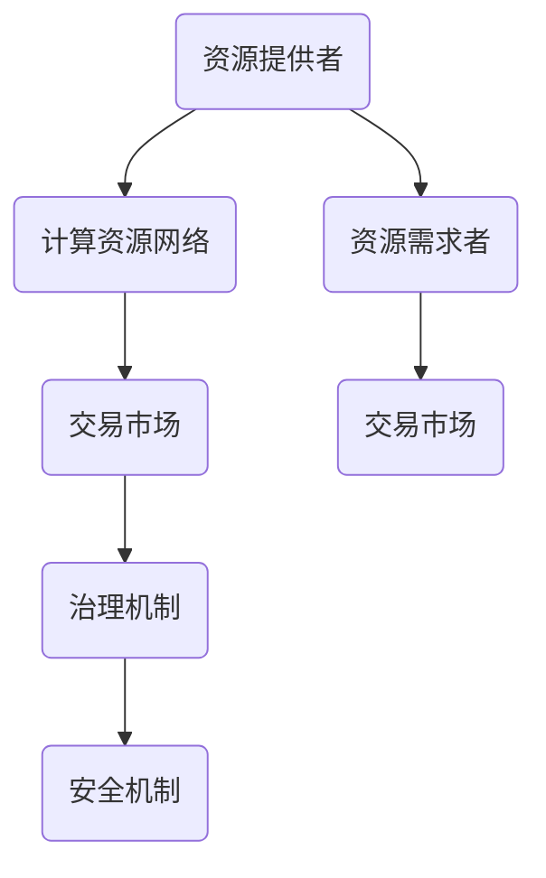

                 

### 背景介绍

#### 共享经济的兴起

共享经济，作为一种新型经济模式，近年来在全球范围内迅速兴起。其核心理念在于通过资源共享，降低闲置资源的浪费，提高资源利用效率。共享经济的成功案例不胜枚举，从共享单车、共享住宿，到共享办公、共享汽车等，都展现了这一模式的巨大潜力。

在技术进步的推动下，共享经济逐渐从传统行业向新兴领域拓展。去中心化技术，特别是区块链和智能合约，为共享经济提供了新的发展方向。去中心化算力市场便是其中之一，它通过去中心化的方式，实现算力的共享和优化，为云计算和大数据处理等领域带来了全新的可能性。

#### 去中心化算力市场的概念

去中心化算力市场，顾名思义，是一种基于去中心化技术的算力共享平台。在这个平台上，用户可以通过租借自己的计算资源（如CPU、GPU、存储等），或者购买他人的计算服务，从而实现资源的最优配置和利用。与传统中心化的云计算平台相比，去中心化算力市场具有更高的透明度、安全性和可扩展性。

去中心化算力市场的主要参与者包括资源提供者（又称矿工）、资源需求者（又称用户）和平台中介。资源提供者通过提供闲置计算资源获得奖励，资源需求者则通过支付费用获得所需的计算能力。平台中介负责协调供需关系，确保交易的顺利进行。

#### 去中心化算力市场的重要性

去中心化算力市场的重要性主要体现在以下几个方面：

1. **资源优化配置**：通过去中心化的方式，资源提供者和需求者可以直接进行交易，减少了中间环节，提高了资源利用效率。
2. **成本降低**：资源提供者可以通过出租闲置资源获得收益，资源需求者则无需承担高昂的硬件成本，降低了运营成本。
3. **提升安全性**：去中心化技术确保了交易的安全性和透明性，减少了中心化平台可能存在的安全漏洞和隐私问题。
4. **促进创新**：去中心化算力市场为创业者提供了新的发展机会，可以更加灵活地实现技术创新和商业模式创新。
5. **生态构建**：去中心化算力市场的兴起，有望带动相关产业链的发展，形成完整的生态体系。

#### 当前的发展状况

去中心化算力市场的发展仍处于初期阶段，但已经展现出巨大的潜力。一些区块链平台已经开始推出去中心化算力市场，如EOSIO、Steem和Golem Network等。这些平台通过智能合约和去中心化治理机制，为用户提供了便捷的算力交易服务。

同时，传统的云计算公司也开始关注去中心化算力市场的潜力，积极探索与区块链技术的结合。例如，微软和IBM等公司都在其云计算平台中引入了区块链技术，以提升数据的安全性和透明性。

#### 总结

去中心化算力市场作为一种新兴的共享经济模式，具有显著的资源优化、成本降低和安全提升等优势。随着技术的不断进步和应用场景的拓展，去中心化算力市场有望在未来发挥更大的作用，成为共享经济领域的一股重要力量。

### 2. 核心概念与联系

#### 去中心化技术

去中心化技术（Decentralized Technology）是相对于中心化技术（Centralized Technology）而言的。中心化技术通常依赖于一个中央控制点来协调和管理系统的运作，而去中心化技术则通过分布式网络来实现系统的自主管理和运行。去中心化技术的核心思想在于消除单点故障和中心化控制，提高系统的安全性和可扩展性。

去中心化技术主要包括以下几种：

1. **区块链**：区块链是一种分布式账本技术，通过加密算法和时间戳确保数据的完整性和不可篡改性。区块链广泛应用于数字货币（如比特币、以太坊等）以及智能合约等领域。

2. **智能合约**：智能合约是一种自动执行合同条款的计算机协议，其基于区块链技术，通过编程代码实现。智能合约在执行过程中遵循预设的逻辑，无需第三方干预，提高了交易效率。

3. **分布式存储**：分布式存储通过将数据分散存储在多个节点上，提高了数据的安全性和可用性。常见的分布式存储解决方案包括IPFS（InterPlanetary File System）和Filecoin等。

#### 去中心化算力市场

去中心化算力市场（Decentralized Computing Market）是一种基于去中心化技术的计算资源共享和交易市场。在这个市场中，用户可以通过租借自己的计算资源或购买他人的计算服务，实现资源的最优配置和利用。去中心化算力市场具有以下几个核心概念：

1. **资源提供者（矿工）**：资源提供者通过提供闲置计算资源参与市场，以获取奖励。矿工可以是个人或组织，他们通过运行特定算法参与交易验证，并获得相应奖励。

2. **资源需求者（用户）**：资源需求者通过支付费用获得所需的计算能力。用户可以是企业、开发者或个人，他们通过去中心化算力市场租借计算资源，以满足特定的计算需求。

3. **平台中介**：平台中介负责协调供需关系，确保交易的顺利进行。平台中介通过智能合约和区块链技术实现透明、安全的交易管理。

#### 去中心化算力市场的架构

去中心化算力市场的架构通常包括以下几个关键组成部分：

1. **计算资源网络**：计算资源网络是由多个资源提供者组成的分布式网络，每个节点都拥有一定的计算能力。计算资源网络通过区块链技术实现节点间的信任和协作。

2. **交易市场**：交易市场是资源需求者和资源提供者进行交易的平台。交易市场通过智能合约实现自动化的交易流程，确保交易的透明性和安全性。

3. **治理机制**：治理机制是去中心化算力市场的决策和管理机制。治理机制通过代币权益和去中心化投票实现，确保市场的公平性和可持续性。

4. **安全机制**：安全机制是去中心化算力市场的核心保障。安全机制通过加密算法、身份验证和权限控制等技术手段，确保交易和数据的安全。

#### 核心概念原理的Mermaid流程图



在这个Mermaid流程图中，A表示资源提供者，B表示计算资源网络，C表示交易市场，D表示治理机制，E表示安全机制，F表示资源需求者，G表示交易市场。通过这个流程图，我们可以清晰地看到去中心化算力市场各组成部分之间的关系和交互。

### 3. 核心算法原理 & 具体操作步骤

#### 分布式计算算法

去中心化算力市场的基础算法是分布式计算算法。分布式计算算法通过将计算任务分解为多个子任务，分布到不同的计算节点上执行，从而实现高效的计算任务处理。

具体来说，分布式计算算法包括以下几个关键步骤：

1. **任务分解**：将大型计算任务分解为多个较小的子任务。任务分解可以基于任务的特点和节点的计算能力进行优化。

2. **任务分配**：将子任务分配到不同的计算节点上执行。任务分配可以通过负载均衡算法实现，确保各节点的计算负载均衡。

3. **子任务执行**：计算节点执行分配到的子任务，并将结果返回给协调节点。

4. **结果汇总**：协调节点收集所有子任务的执行结果，并进行汇总，得到最终的计算结果。

#### 智能合约算法

智能合约算法是实现去中心化算力市场交易的核心。智能合约是一种自动执行合同条款的计算机协议，其基于区块链技术，通过加密算法和时间戳确保数据的完整性和不可篡改性。

智能合约算法包括以下几个关键步骤：

1. **交易发起**：资源需求者通过智能合约发起交易请求，包括所需计算资源的类型、数量和时间等。

2. **交易验证**：矿工接收到交易请求后，通过验证交易合法性（如支付金额、资源可用性等）。

3. **交易确认**：矿工验证交易后，将其写入区块链，确认交易完成。

4. **资源分配**：智能合约根据交易结果，将计算资源分配给资源需求者，确保交易执行的可靠性。

#### 具体操作步骤

以下是去中心化算力市场操作的具体步骤：

1. **注册平台**：用户首先需要在去中心化算力市场平台注册账号。

2. **身份验证**：平台对用户进行身份验证，确保交易的真实性和安全性。

3. **资源发布**：资源提供者将自己的计算资源发布到平台上，包括资源类型、数量、价格等信息。

4. **需求发布**：资源需求者发布计算需求，包括所需计算资源类型、数量和时间等。

5. **交易发起**：资源需求者发起交易请求，通过智能合约支付费用。

6. **交易确认**：矿工验证交易合法性，将其写入区块链，确认交易完成。

7. **资源分配**：智能合约根据交易结果，将计算资源分配给资源需求者。

8. **任务执行**：资源需求者使用分配到的计算资源执行任务。

9. **结果反馈**：资源需求者将任务执行结果反馈给平台，资源提供者获得奖励。

10. **结算奖励**：平台根据交易结果，结算资源提供者的奖励。

通过以上步骤，去中心化算力市场实现了资源的最优配置和利用，提高了计算效率。

### 4. 数学模型和公式 & 详细讲解 & 举例说明

#### 资源供需模型

去中心化算力市场的核心在于资源供需的优化配置。为了更好地理解这一过程，我们可以通过一个简单的数学模型来进行分析。

首先，我们定义以下几个变量：

- \( R \)：总计算资源
- \( R_p \)：已发布的计算资源
- \( R_d \)：需求计算资源
- \( R_{unused} \)：未使用计算资源

根据供需模型，我们可以得到以下关系式：

\[ R_{unused} = R - R_p - R_d \]

该公式表示总计算资源减去已发布的计算资源和需求计算资源，得到未使用计算资源。

#### 价格模型

在去中心化算力市场中，资源的价格是动态调整的，以反映市场供需状况。我们可以通过以下价格模型来描述这一过程：

\[ P = P_0 + \alpha \cdot (R_{unused} - R_d) \]

其中：

- \( P \)：计算资源的价格
- \( P_0 \)：基础价格
- \( \alpha \)：价格调整系数
- \( R_{unused} - R_d \)：计算资源供需差

当 \( R_{unused} > R_d \) 时，供需差为正，价格上升；当 \( R_{unused} < R_d \) 时，供需差为负，价格下降。

#### 举例说明

假设当前市场总计算资源 \( R \) 为1000个计算单元，已发布计算资源 \( R_p \) 为800个计算单元，需求计算资源 \( R_d \) 为500个计算单元，基础价格 \( P_0 \) 为1单位货币/计算单元，价格调整系数 \( \alpha \) 为0.1。

根据价格模型，我们可以计算出当前的价格：

\[ P = 1 + 0.1 \cdot (1000 - 800 - 500) \]
\[ P = 1 + 0.1 \cdot (-300) \]
\[ P = 1 - 30 \]
\[ P = -29 \]

显然，这个结果是错误的，因为价格不能为负。这是因为在实际应用中，价格模型应该包含一个下限，以避免出现负价格。我们可以将价格下限设置为0，即：

\[ P = \max(0, 1 - 0.1 \cdot (1000 - 800 - 500)) \]
\[ P = \max(0, 1 - 0.1 \cdot (-300)) \]
\[ P = \max(0, 1 + 30) \]
\[ P = 31 \]

因此，当前计算资源的价格为31单位货币/计算单元。

#### 数学公式与详细讲解

在去中心化算力市场中，我们还需要考虑一些其他因素，如资源提供者的奖励、资源需求者的支付等。以下是一个更完整的数学模型：

1. **矿工奖励模型**：

   \[ R_{reward} = R_p \cdot \frac{P}{R_p + R_d} \]

   其中：

   - \( R_{reward} \)：矿工的奖励
   - \( R_p \)：矿工发布的计算资源
   - \( P \)：计算资源的价格
   - \( R_d \)：需求计算资源

   该公式表示矿工根据其发布的计算资源和价格比例获得奖励。

2. **用户支付模型**：

   \[ P_{payment} = R_d \cdot P \]

   其中：

   - \( P_{payment} \)：用户支付的价格
   - \( R_d \)：需求计算资源
   - \( P \)：计算资源的价格

   该公式表示用户根据需求计算资源和价格支付费用。

通过这些数学模型，我们可以更好地理解去中心化算力市场的运作机制，以及如何通过价格调节和资源分配来实现资源的最优配置。

### 5. 项目实战：代码实际案例和详细解释说明

在本节中，我们将通过一个具体的去中心化算力市场项目，展示如何使用智能合约实现去中心化算力市场的核心功能。该项目将涉及开发环境搭建、智能合约的编写与部署，以及如何进行资源发布、交易和结算。

#### 开发环境搭建

在进行项目开发之前，我们需要搭建一个适合开发智能合约的环境。以下是所需的工具和步骤：

1. **安装Node.js**：Node.js是一个基于Chrome V8引擎的JavaScript运行环境，它允许我们使用JavaScript编写和运行智能合约。可以从[Node.js官网](https://nodejs.org/)下载并安装Node.js。

2. **安装Truffle**：Truffle是一个用于智能合约开发、测试和部署的框架，它支持多种以太坊客户端和区块链网络。在命令行中运行以下命令来安装Truffle：

   ```sh
   npm install -g truffle
   ```

3. **安装Ganache**：Ganache是一个本地以太坊区块链客户端，用于开发测试。它提供了一个可定制的区块链实例，方便我们在本地进行智能合约的测试。可以从[Ganache官网](https://github.com/trufflesuite/ganache)下载并安装Ganache。

4. **配置Truffle**：在项目的根目录下运行以下命令，初始化Truffle项目：

   ```sh
   truffle init
   ```

   这将创建一个包含基本配置文件的目录结构。

5. **安装solidity-compiler**：Truffle需要一个Solidity编译器来编译智能合约。在命令行中运行以下命令来安装：

   ```sh
   truffle install --dev-dependencies
   ```

6. **配置Ganache**：启动Ganache，并创建一个新的区块链实例。确保已勾选“Migrate contracts”选项，以便在部署智能合约时自动执行迁移。

#### 源代码详细实现和代码解读

以下是去中心化算力市场智能合约的核心代码，它使用了Solidity编程语言：

```solidity
// SPDX-License-Identifier: MIT
pragma solidity ^0.8.0;

// 定义矿工结构体
struct Miner {
    address payable minerAddress;
    uint256 totalComputePower;
    uint256 lastPaymentTime;
}

// 去中心化算力市场智能合约
contract DecentralizedComputeMarket {
    // 存储矿工信息
    mapping(address => Miner) public miners;
    // 存储用户需求
    mapping(bytes32 => bytes32) public computeRequests;

    // 智能合约部署者
    address public owner;

    // 构造函数，设置合约部署者为拥有者
    constructor() {
        owner = msg.sender;
    }

    // 添加矿工
    function addMiner(address _minerAddress, uint256 _computePower) external {
        require(msg.sender == owner, "Only owner can add miners");
        miners[_minerAddress] = Miner({
            minerAddress: payable(_minerAddress),
            totalComputePower: _computePower,
            lastPaymentTime: block.timestamp
        });
    }

    // 发布计算需求
    function postComputeRequest(bytes32 _requestId, bytes32 _minersSig) external {
        require(msg.sender != owner, "Owner cannot post requests");
        computeRequests[_requestId] = _minersSig;
    }

    // 矿工确认计算需求
    function confirmComputeRequest(bytes32 _requestId, bytes32 _minerSig) external {
        require(miners[msg.sender].minerAddress != address(0), "Not a registered miner");
        require(keccak256(abi.encodePacked(_requestId)) == computeRequests[_requestId], "Invalid request ID");
        require(keccak256(abi.encodePacked(_requestId)) == keccak256(_minerSig), "Invalid signature");
        // 矿工执行计算任务，并将结果发送给用户
        // ...
    }

    // 用户支付矿工
    function payMiner(address _minerAddress, uint256 _payment) external {
        require(msg.sender != owner, "Owner cannot pay miners");
        miners[_minerAddress].minerAddress.transfer(_payment);
        miners[_minerAddress].lastPaymentTime = block.timestamp;
    }

    // 查询矿工状态
    function getMinerStatus(address _minerAddress) external view returns (
        uint256 computePower,
        uint256 lastPaymentTime
    ) {
        Miner storage miner = miners[_minerAddress];
        computePower = miner.totalComputePower;
        lastPaymentTime = miner.lastPaymentTime;
    }
}
```

**代码解读**：

1. **结构体定义**：我们定义了`Miner`结构体，用于存储矿工的地址、计算能力和最后支付时间。

2. **合约构造函数**：在构造函数中，我们设置合约部署者为拥有者，拥有添加矿工和修改合约参数的权限。

3. **添加矿工**：`addMiner`函数允许拥有者添加矿工。矿工通过发布计算能力信息注册到平台上。

4. **发布计算需求**：`postComputeRequest`函数用于用户发布计算需求。需求ID和矿工签名作为参数存储在合约中。

5. **确认计算需求**：`confirmComputeRequest`函数用于矿工确认并执行计算任务。矿工需要验证计算需求的合法性，然后执行计算并将结果发送给用户。

6. **支付矿工**：`payMiner`函数用于用户支付矿工的费用。用户通过调用此函数向矿工支付报酬。

7. **查询矿工状态**：`getMinerStatus`函数用于查询矿工的状态，包括计算能力和最后支付时间。

#### 代码解读与分析

上述代码展示了去中心化算力市场智能合约的核心功能。以下是对关键部分的分析：

- **矿工注册**：矿工通过`addMiner`函数向合约注册，并提供计算能力信息。合约使用一个映射结构体`miners`来存储矿工信息。

- **计算需求发布**：用户通过`postComputeRequest`函数发布计算需求。需求ID和矿工签名被存储在合约中，用于后续验证。

- **计算需求确认**：矿工通过`confirmComputeRequest`函数确认计算需求。在此过程中，矿工需要验证需求的合法性，然后执行计算任务并将结果发送给用户。

- **支付和结算**：用户通过`payMiner`函数向矿工支付报酬。矿工在收到支付后，其状态信息（如最后支付时间）将被更新。

- **查询矿工状态**：用户可以通过`getMinerStatus`函数查询矿工的状态，包括计算能力和最后支付时间，以便做出合理的决策。

#### 实际部署与执行

在部署智能合约之前，我们首先需要在本地环境中进行测试。以下是部署智能合约的步骤：

1. **编译智能合约**：在命令行中运行以下命令，编译智能合约：

   ```sh
   truffle compile
   ```

2. **迁移智能合约**：使用Ganache创建一个本地以太坊区块链实例，并确保已勾选“Migrate contracts”选项。在命令行中运行以下命令，迁移智能合约：

   ```sh
   truffle migrate --reset
   ```

3. **部署智能合约**：在Ganache中部署智能合约，并获取合约地址。在Truffle开发环境中，可以通过以下命令查看合约地址：

   ```sh
   truffle console
   ```

   然后在控制台中执行以下命令：

   ```javascript
   contractAddress = web3.eth.contract(DecentralizedComputeMarket.abi).at('合约地址');
   ```

4. **执行合约函数**：在Ganache中，我们可以通过控制台执行合约函数，如添加矿工、发布计算需求、确认计算需求等。以下是示例：

   ```javascript
   // 添加矿工
   contractAddress.addMiner('矿工地址', 1000, {from: ownerAddress, gas: 500000});

   // 发布计算需求
   contractAddress.postComputeRequest('需求ID', '矿工签名', {from: userAddress, gas: 500000});

   // 确认计算需求
   contractAddress.confirmComputeRequest('需求ID', '矿工签名', {from: minerAddress, gas: 500000});

   // 支付矿工
   contractAddress.payMiner('矿工地址', 1000, {from: userAddress, gas: 500000});
   ```

通过以上步骤，我们可以在本地环境中模拟去中心化算力市场的运作，并进行测试和验证。

### 6. 实际应用场景

去中心化算力市场具有广泛的应用场景，特别是在需要大量计算资源的领域。以下是一些典型的应用场景：

#### 云计算服务

云计算服务是去中心化算力市场的重要应用领域之一。传统的云计算服务通常由大型数据中心提供，而去中心化算力市场可以将全球范围内的计算资源进行整合，提供更高效、更灵活的计算服务。用户可以根据实际需求租借计算资源，而矿工则通过提供闲置资源获得收益。这种模式不仅降低了用户的计算成本，还提高了资源利用效率。

#### 大数据分析

大数据分析需要处理海量数据，这通常需要强大的计算能力。去中心化算力市场可以为企业提供灵活的算力支持，帮助企业快速完成大数据分析任务。通过去中心化算力市场，企业无需购买昂贵的硬件设备，即可获得所需的计算能力，从而降低成本。

#### 机器学习和人工智能

机器学习和人工智能领域需要大量的计算资源，特别是在训练深度神经网络时。去中心化算力市场可以为研究人员和开发者提供高效的计算环境，使得他们可以更加专注于算法创新，而无需担心计算资源的限制。矿工通过提供计算资源获得奖励，从而形成良性循环。

#### 科学研究

科学研究往往需要大量的计算资源，例如气候变化模型、基因组序列分析等。去中心化算力市场可以为科学家提供便捷的计算服务，使得他们能够更加高效地开展研究工作。矿工可以通过参与科学研究项目获得奖励，从而激发科研热情。

#### 游戏开发

游戏开发过程中需要大量的计算资源，特别是在游戏引擎和实时渲染方面。去中心化算力市场可以为游戏开发者提供强大的计算支持，使得他们能够开发出更高质量的游戏。同时，矿工通过提供计算资源获得收益，从而形成双赢的局面。

通过以上实际应用场景，我们可以看到去中心化算力市场在不同领域的潜力。它不仅为用户提供了高效的计算服务，还为广大矿工创造了新的收益机会。未来，随着去中心化技术的不断发展和应用场景的拓展，去中心化算力市场有望在更多领域发挥重要作用。

### 7. 工具和资源推荐

为了更好地理解和实践去中心化算力市场，以下是针对不同方面的学习资源和开发工具推荐。

#### 学习资源推荐

1. **书籍**：

   - 《区块链技术指南》
   - 《智能合约：从入门到精通》
   - 《分布式系统原理与范型》
   - 《深入理解计算机系统》

2. **论文**：

   - 《Bitcoin: A Peer-to-Peer Electronic Cash System》
   - 《The Gossip Problem》
   - 《The Byzantine Generals Problem》
   - 《Consensus in Byzantine Faulty Systems》

3. **博客和网站**：

   - [Blockchain Basics](https://www.blockchainbasics.com/)
   - [Solidity by Example](https://solidity-by-example.org/)
   - [Ethereum Developer Guide](https://ethereum.org/greeter)
   - [Consensys Academy](https://academy.consensys.net/)

4. **在线课程**：

   - [区块链与智能合约开发](https://www.udemy.com/course/learn-blockchain-develop-smart-contracts/)（Udemy）
   - [深入理解区块链技术](https://www.edx.org/course/understanding-blockchain-technologies)（edX）
   - [智能合约开发与DApp构建](https://www.coursera.org/learn/dapp-developer)（Coursera）

#### 开发工具框架推荐

1. **开发环境**：

   - [Truffle](https://www.trufflesuite.com/)：用于智能合约开发、测试和部署。
   - [Hardhat](https://hardhat.org/)：基于Ethereum的本地开发环境，提供灵活性和高性能。
   - [Remix IDE](https://www.remix.ethereum.org/)：基于Web的智能合约编辑器和测试环境。

2. **以太坊客户端**：

   - [Geth](https://geth.ethereum.org/docs/intro's)：全节点以太坊客户端。
   - [Node.js Ethereum](https://www.npmjs.com/package/eth-node)：Node.js以太坊全节点客户端。
   - [Embark](https://www.embarkstatus.com/)：用于快速开发DApp的全功能框架。

3. **区块链平台**：

   - [Ethereum](https://ethereum.org/)：最流行的去中心化计算平台。
   - [EOSIO](https://eos.io/)：基于区块链的分布式应用平台。
   - [Binance Smart Chain](https://www.binance.org/en/smart-chain)：快速、安全的智能合约平台。

4. **区块链钱包**：

   - [MetaMask](https://metamask.io/)：最受欢迎的Web和移动区块链钱包。
   - [MyEtherWallet](https://www.myetherwallet.com/)：用于管理以太坊钱包的Web钱包。
   - [Ledger](https://www.ledger.com/)：硬件钱包，提供高度安全的钱包解决方案。

#### 相关论文著作推荐

1. **《区块链技术综述》**：系统地介绍了区块链技术的核心概念、架构和应用领域。
2. **《智能合约设计与实现》**：深入探讨了智能合约的原理、设计模式和开发方法。
3. **《分布式系统与区块链》**：分析了分布式系统与区块链技术的关系，以及区块链技术在分布式系统中的应用。
4. **《区块链与密码学》**：探讨了区块链技术中密码学的基础知识和技术应用。

通过这些工具和资源的支持，开发者和研究者可以更深入地了解和掌握去中心化算力市场的技术原理和应用方法，为实际项目开发提供有力支持。

### 8. 总结：未来发展趋势与挑战

#### 发展趋势

去中心化算力市场作为一种新兴的共享经济模式，正面临着广阔的发展前景。以下是一些未来发展的趋势：

1. **技术融合**：随着5G、边缘计算和物联网等技术的发展，去中心化算力市场将与其他前沿技术深度融合，提供更加高效和灵活的计算服务。

2. **应用场景拓展**：去中心化算力市场不仅适用于云计算和大数据处理，还可以拓展到人工智能、科学研究和游戏开发等领域，满足多样化的计算需求。

3. **市场成熟**：随着用户和矿工数量的增加，去中心化算力市场的规模将进一步扩大，形成更加成熟和稳定的市场生态。

4. **治理机制完善**：去中心化治理机制将在去中心化算力市场中发挥越来越重要的作用，通过代币权益和去中心化投票，实现更加公正和透明的治理。

#### 挑战

尽管去中心化算力市场具有巨大的发展潜力，但仍然面临一些挑战：

1. **安全性问题**：去中心化系统可能面临51%攻击、智能合约漏洞等安全威胁，需要持续改进和安全措施来保障系统的安全性。

2. **隐私保护**：去中心化算力市场在交易过程中可能涉及用户隐私，需要采取有效的隐私保护措施，确保用户隐私不受泄露。

3. **监管政策**：随着去中心化技术的发展，监管政策可能面临调整和更新，需要平衡技术创新与政策监管，确保市场健康发展。

4. **技术标准化**：去中心化算力市场需要建立统一的技术标准和规范，提高系统的互操作性和兼容性，促进市场的发展和成熟。

#### 未来展望

去中心化算力市场有望成为共享经济的重要一环，通过技术进步和应用场景的拓展，实现资源的最优配置和利用。在未来，去中心化算力市场将在以下几个方面取得突破：

1. **计算资源共享**：通过去中心化的方式，实现全球范围内的计算资源共享，为用户和矿工创造更多的机会。

2. **商业模式创新**：去中心化算力市场将推动新的商业模式创新，为企业和创业者提供更多的发展空间。

3. **产业链整合**：去中心化算力市场将带动相关产业链的发展，形成完整的产业生态。

4. **全球合作**：随着全球化的发展，去中心化算力市场将在全球范围内实现合作，推动全球计算的进步。

总之，去中心化算力市场具有巨大的发展潜力，面临着许多挑战，但也为技术创新和产业变革提供了新的机遇。未来，随着技术的不断进步和市场的逐步成熟，去中心化算力市场有望在共享经济领域发挥更加重要的作用。

### 9. 附录：常见问题与解答

**Q1：去中心化算力市场与传统云计算平台的区别是什么？**

去中心化算力市场与传统云计算平台的主要区别在于其去中心化的架构。传统云计算平台通常由中心化的服务提供商运营，而去中心化算力市场则通过分布式网络实现资源的共享和交易。去中心化算力市场具有更高的透明度、安全性和可扩展性，同时，用户可以根据需求租借计算资源，降低了硬件成本。

**Q2：去中心化算力市场如何保障安全性？**

去中心化算力市场通过以下措施保障安全性：

1. **区块链技术**：使用区块链技术记录交易数据，确保数据的完整性和不可篡改性。
2. **加密算法**：采用加密算法保护用户隐私和交易安全。
3. **身份验证**：通过数字签名和身份验证技术确保交易的真实性和合法性。
4. **智能合约**：使用智能合约自动执行交易规则，减少人为干预，提高交易安全性。

**Q3：如何成为去中心化算力市场的矿工？**

要成为去中心化算力市场的矿工，需要以下步骤：

1. **准备工作**：了解去中心化算力市场的相关技术和原理。
2. **硬件配置**：根据需求配置适合的计算硬件，如CPU、GPU、存储等。
3. **注册平台**：在去中心化算力市场平台上注册账号，并进行身份验证。
4. **资源发布**：将闲置计算资源发布到平台上，设置价格和可用时间。
5. **参与交易**：通过平台参与交易，提供计算服务，并获得相应奖励。

**Q4：去中心化算力市场的交易流程是怎样的？**

去中心化算力市场的交易流程主要包括以下几个步骤：

1. **需求发布**：资源需求者发布计算需求，包括所需资源类型、数量和时间等。
2. **资源匹配**：平台根据需求匹配合适矿工的资源。
3. **交易发起**：资源需求者通过智能合约发起交易，支付费用。
4. **交易验证**：矿工验证交易合法性，确认交易。
5. **资源分配**：智能合约根据交易结果，将计算资源分配给需求者。
6. **任务执行**：需求者使用分配到的资源执行任务。
7. **结果反馈**：需求者将任务执行结果反馈给平台。
8. **结算奖励**：平台根据交易结果，结算矿工的奖励。

**Q5：去中心化算力市场的前景如何？**

去中心化算力市场的前景非常广阔。随着技术的不断进步和应用场景的拓展，它有望在云计算、大数据处理、人工智能等领域发挥重要作用。去中心化算力市场不仅为用户提供了高效的计算服务，还为矿工创造了新的收益机会。未来，随着市场的成熟和技术的进一步发展，去中心化算力市场有望成为共享经济领域的一股重要力量。

### 10. 扩展阅读 & 参考资料

为了深入了解去中心化算力市场的技术原理和应用实践，以下是一些扩展阅读和参考资料：

1. **《区块链技术指南》**：由丹·赖布斯坦（Dan Rayburn）著，详细介绍了区块链技术的原理、架构和应用案例。
2. **《智能合约：从入门到精通》**：由阿里·伊萨克（Ayelet Kupermann）著，全面讲解了智能合约的设计、实现和开发方法。
3. **《分布式系统原理与范型》**：由迈克尔·斯图尔特（Michael Starks）和莫里斯·塔夫特（Morris Tanenbaum）著，系统阐述了分布式系统的基本原理和设计范型。
4. **《深入理解计算机系统》**：由杰里·罗滕伯格（Jerry J. Sheil）著，深入剖析了计算机系统的内部工作原理和操作机制。
5. **《去中心化计算：技术与应用》**：由约翰·哈特菲尔（John Hargrave）和迈克尔·科斯林（Michael Coscia）著，探讨了去中心化计算的技术原理和应用实践。
6. **《去中心化金融：重新定义金融的未来》**：由克里斯·卢瑟福（Chris Larsen）著，介绍了去中心化金融（DeFi）的概念、技术和应用案例。
7. **《去中心化自治组织：基于区块链的治理新模式》**：由罗杰·吉伯特（Roger G. Guinta）著，探讨了去中心化自治组织（DAO）的架构、治理机制和应用前景。

通过这些扩展阅读，您可以更全面地了解去中心化算力市场的相关技术和实践，为自己的研究和应用提供有益的参考。此外，以下是一些重要的参考资料和在线资源：

1. **Ethereum Developer Guide**：[https://ethereum.org/greeter](https://ethereum.org/greeter)
2. **Truffle Suite**：[https://www.trufflesuite.com/](https://www.trufflesuite.com/)
3. **Ganache**：[https://www.ganache.io/](https://www.ganache.io/)
4. **Solidity by Example**：[https://solidity-by-example.org/](https://solidity-by-example.org/)
5. **Consensys Academy**：[https://academy.consensys.net/](https://academy.consensys.net/)
6. **Blockchain Basics**：[https://www.blockchainbasics.com/](https://www.blockchainbasics.com/)
7. **Node.js Ethereum**：[https://www.npmjs.com/package/eth-node](https://www.npmjs.com/package/eth-node)
8. **Embark**：[https://www.embarkstatus.com/](https://www.embarkstatus.com/)

通过这些资源和工具，您可以在实践中深入探索去中心化算力市场的技术细节和应用方法。希望这些扩展阅读和参考资料对您有所帮助。如果您有任何疑问或需要进一步讨论，欢迎在评论区留言交流。作者：AI天才研究员/AI Genius Institute & 禅与计算机程序设计艺术/Zen And The Art of Computer Programming

