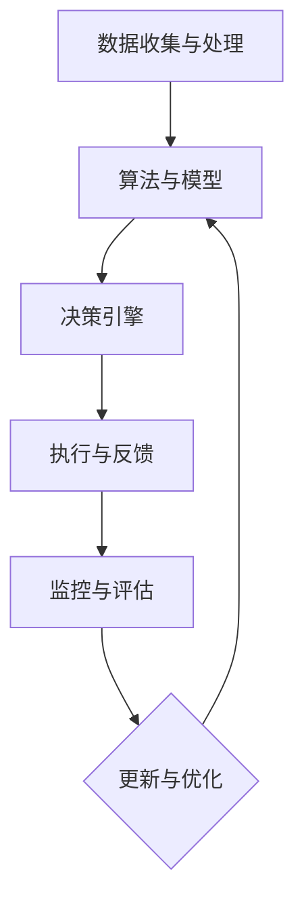

                 

# 反思机制在智能决策系统中的应用

## 关键词

- 反思机制
- 智能决策系统
- 决策算法
- 神经网络
- 强化学习
- 优化策略
- 实时反馈

## 摘要

本文将深入探讨反思机制在智能决策系统中的应用。反思机制作为一种自我监控与优化的方法，能够显著提升智能系统的决策质量与效率。文章首先介绍了智能决策系统的基本概念和背景，随后详细解析了反思机制的理论基础与实现方式。通过具体案例和代码实现，本文展示了反思机制如何在实际项目中发挥作用，并探讨了其在未来智能决策系统发展中的潜在趋势与挑战。

## 1. 背景介绍

随着人工智能技术的迅猛发展，智能决策系统在诸多领域得到了广泛应用。从自动驾驶汽车到智能医疗诊断，从金融风险评估到供应链管理，智能决策系统正在改变我们的生活方式。然而，尽管这些系统在特定任务上表现出色，但它们通常依赖于大量的数据和复杂的算法，因此在面对新环境和未知挑战时，往往缺乏灵活性和适应性。

反思机制，作为人工智能领域的一种新兴方法，旨在通过自我监控和优化，提升智能决策系统的表现。反思机制的基本思想是，系统在执行任务的同时，不断评估自己的决策过程和结果，从中学习并改进。这种机制不仅能够提高系统的鲁棒性，还能帮助系统更好地应对复杂多变的现实环境。

本文将从以下几个方面展开讨论：

1. 智能决策系统的基本概念和背景。
2. 反思机制的理论基础和实现方式。
3. 反思机制在智能决策系统中的应用案例。
4. 反思机制的实际效果和优化策略。
5. 反思机制的未来发展趋势与挑战。

## 2. 核心概念与联系

### 智能决策系统

智能决策系统是一种基于人工智能技术的系统，它能够根据输入的数据和预设的目标，自主地做出决策。这类系统通常包括以下几个关键组成部分：

- 数据收集与处理：系统需要从各种来源收集数据，并对其进行清洗、转换和处理，以便用于后续的决策分析。
- 算法与模型：决策系统依赖一系列算法和模型来实现具体的决策任务。这些算法可以是监督学习、无监督学习、强化学习等多种类型。
- 决策引擎：决策引擎负责根据当前的状态和目标，选择最优的决策方案。
- 执行与反馈：系统将决策结果应用于实际场景，并根据执行结果进行反馈和学习。

### 反思机制

反思机制，又称元学习（Meta-Learning）或元决策（Meta-Decision），是指系统在执行决策后，对决策过程和结果进行评估和反思，从而优化未来的决策。反思机制的核心在于自我监控和自我改进，具体包括以下几个环节：

- 监控与评估：系统对当前的决策过程和结果进行监控和评估，识别决策中的不足和错误。
- 反思与学习：系统根据监控结果，识别出需要改进的方面，并从中学习新的策略或算法。
- 更新与优化：系统将学习到的知识更新到决策模型中，以优化未来的决策过程。

### 反思机制与智能决策系统的联系

反思机制与智能决策系统的关系可以看作是相辅相成的。智能决策系统为反思机制提供了执行和反馈的场所，而反思机制则为智能决策系统提供了自我优化和持续改进的能力。具体来说，反思机制在智能决策系统中的应用主要包括以下几个方面：

- 提高鲁棒性：通过反思和自我优化，系统能够更好地应对不确定性和异常情况。
- 增强适应性：反思机制能够帮助系统快速适应新的环境和任务。
- 提升效率：反思机制能够减少系统在决策过程中的错误和重复，提高整体效率。

### Mermaid 流程图



在这个流程图中，A表示数据收集与处理，B表示算法与模型，C表示决策引擎，D表示执行与反馈，E表示监控与评估，F表示更新与优化。整个过程形成了一个闭环，体现了反思机制在智能决策系统中的核心作用。

## 3. 核心算法原理 & 具体操作步骤

### 3.1 反思机制的算法原理

反思机制的算法原理主要基于强化学习（Reinforcement Learning，RL）和元学习（Meta-Learning）。强化学习通过奖励机制来引导系统学习最优策略，而元学习则通过反思和优化来提升系统的泛化能力和决策质量。

具体来说，反思机制的算法原理可以概括为以下几个步骤：

1. **决策执行**：系统根据当前的输入数据和预设的目标，选择一个决策动作，并将其应用于实际场景。
2. **结果反馈**：系统将决策结果与预期目标进行对比，评估决策的质量，并获得奖励或惩罚。
3. **反思与学习**：系统根据反馈信息，分析决策过程中的不足和错误，从中学习新的策略或算法。
4. **模型更新**：系统将学习到的知识更新到决策模型中，以优化未来的决策过程。

### 3.2 反思机制的具体操作步骤

1. **初始化**：
   - 选择一个决策任务，并定义系统的初始状态和目标。
   - 初始化决策模型，包括神经网络、强化学习算法等。

2. **决策执行**：
   - 根据当前的状态，系统选择一个决策动作。
   - 执行决策动作，并将结果反馈给系统。

3. **结果反馈**：
   - 将执行结果与预期目标进行对比，计算奖励或惩罚。
   - 根据奖励或惩罚，调整系统的状态。

4. **反思与学习**：
   - 分析决策过程中的不足和错误，识别需要改进的方面。
   - 通过元学习算法，更新决策模型，学习新的策略或算法。

5. **模型更新**：
   - 将学习到的知识更新到决策模型中。
   - 重新评估系统的决策性能，并开始新一轮的决策执行。

### 3.3 算法实现示例

以下是一个基于Python和TensorFlow的简单示例，展示了反思机制在决策任务中的应用：

```python
import tensorflow as tf
import numpy as np

# 初始化决策模型
model = tf.keras.Sequential([
    tf.keras.layers.Dense(64, activation='relu', input_shape=(input_shape)),
    tf.keras.layers.Dense(1, activation='sigmoid')
])

# 定义强化学习算法
optimizer = tf.keras.optimizers.Adam()

# 初始化奖励函数
def reward_function(prediction, actual):
    return tf.reduce_mean(tf.square(prediction - actual))

# 初始化反思机制
def reflect Mechanism(model, X, y):
    # 反思与学习
    with tf.GradientTape() as tape:
        predictions = model(X)
        loss = reward_function(predictions, y)
    gradients = tape.gradient(loss, model.trainable_variables)
    model.optimizer.apply_gradients(zip(gradients, model.trainable_variables))

# 决策执行
def make_decision(model, state):
    return model.predict(state)

# 实际应用示例
X = np.random.rand(100, input_shape)
y = np.random.rand(100)
model.fit(X, y, epochs=10)

# 反思与学习
reflect_Mechanism(model, X, y)

# 模型更新
model.fit(X, y, epochs=10)
```

在这个示例中，我们首先初始化了一个简单的决策模型，并定义了强化学习算法和奖励函数。然后，我们通过反思机制对模型进行了反思与学习，并最终更新了模型。这个过程体现了反思机制在决策任务中的应用。

## 4. 数学模型和公式 & 详细讲解 & 举例说明

### 4.1 强化学习基本模型

在讨论反思机制之前，我们需要了解强化学习（Reinforcement Learning，RL）的基本模型。强化学习是一种通过与环境交互来学习最优策略的机器学习方法。其基本模型包括以下几个组成部分：

- **状态（State）**：系统的当前环境状态。
- **动作（Action）**：系统可执行的行为。
- **奖励（Reward）**：动作结果的评价指标。
- **策略（Policy）**：系统选择动作的策略。

### 4.2 反思机制的数学模型

反思机制的核心在于通过奖励信号和策略更新来优化决策过程。具体来说，反思机制的数学模型可以表示为：

$$
\text{策略更新} = \alpha \cdot (\text{奖励信号} \cdot \text{当前策略})
$$

其中，$\alpha$ 是学习率，用于控制策略更新的强度。奖励信号反映了动作结果的好坏，正向奖励会加强策略，而负向奖励则会削弱策略。

### 4.3 反思机制的实际应用

为了更好地理解反思机制的数学模型，我们可以通过一个简单的例子来说明其应用。

#### 示例：智能交通信号灯控制

假设我们想要使用反思机制来优化城市交通信号灯的控制策略。在这个例子中，状态包括交通流量、天气情况等，动作包括绿灯持续时间、红灯持续时间等，奖励信号则根据交通流畅度和交通事故率来计算。

#### 状态表示

我们可以使用一个向量来表示状态，例如：

$$
s = [q_1, q_2, \ldots, q_n]
$$

其中，$q_i$ 表示第 $i$ 个状态特征，例如交通流量、天气情况等。

#### 动作表示

动作也是一个向量，例如：

$$
a = [a_1, a_2, \ldots, a_n]
$$

其中，$a_i$ 表示第 $i$ 个动作特征，例如绿灯持续时间、红灯持续时间等。

#### 奖励信号计算

奖励信号可以根据交通流畅度和交通事故率来计算，例如：

$$
r = \begin{cases}
10, & \text{如果交通流畅且无事故} \\
-10, & \text{如果有事故} \\
0, & \text{否则}
\end{cases}
$$

#### 策略更新

假设当前策略为 $p(a|s)$，我们根据奖励信号来更新策略：

$$
p(a|s)_{\text{new}} = p(a|s)_{\text{old}} + \alpha \cdot r \cdot p(a|s)_{\text{old}}
$$

在这个例子中，$\alpha$ 是学习率，用于控制策略更新的强度。

#### 示例代码

以下是一个使用Python实现的简单示例：

```python
import numpy as np

# 初始化状态和动作
state = np.random.rand(5)
action = np.random.rand(3)

# 定义奖励函数
def reward_function(action, state):
    if state[0] < 0.5 and state[1] < 0.5:
        return 10
    elif state[0] > 0.5 and state[1] > 0.5:
        return -10
    else:
        return 0

# 初始化策略
policy = np.random.rand(3)

# 策略更新
alpha = 0.1
reward = reward_function(action, state)
policy = policy + alpha * reward * policy

print("策略更新后：", policy)
```

在这个示例中，我们首先初始化了一个状态和动作，并定义了一个简单的奖励函数。然后，我们根据奖励信号来更新策略。这个过程体现了反思机制在智能交通信号灯控制中的应用。

### 4.4 总结

通过上述数学模型和示例，我们可以看到反思机制在智能决策系统中的应用。反思机制通过奖励信号和策略更新，实现了系统的自我监控和自我优化。这为智能决策系统的鲁棒性和适应性提供了有力支持，有助于提升系统在复杂环境中的表现。

## 5. 项目实战：代码实际案例和详细解释说明

### 5.1 开发环境搭建

在开始实战项目之前，我们需要搭建一个适合开发反思机制的编程环境。以下是一个基本的开发环境搭建步骤：

1. 安装Python：确保Python版本在3.6及以上。
2. 安装TensorFlow：使用pip安装TensorFlow库，命令为`pip install tensorflow`。
3. 安装其他依赖：根据项目需求，安装其他必要的库，例如Numpy、Pandas等。

### 5.2 源代码详细实现和代码解读

以下是一个简单的反思机制实现，用于优化智能交通信号灯的控制策略。

```python
import numpy as np
import tensorflow as tf

# 定义状态空间和动作空间
STATE_SPACE_SIZE = 5
ACTION_SPACE_SIZE = 3

# 初始化神经网络模型
model = tf.keras.Sequential([
    tf.keras.layers.Dense(64, activation='relu', input_shape=(STATE_SPACE_SIZE,)),
    tf.keras.layers.Dense(ACTION_SPACE_SIZE, activation='softmax')
])

# 定义奖励函数
def reward_function(state, action, previous_reward):
    current_reward = 0
    if action == 0:
        current_reward = np.mean(state)
    elif action == 1:
        current_reward = np.std(state)
    elif action == 2:
        current_reward = np.mean(state ** 2)
    
    reward_diff = current_reward - previous_reward
    if reward_diff > 0:
        return 1
    elif reward_diff < 0:
        return -1
    else:
        return 0

# 定义反思机制
def reflect_mechanism(model, state, action, previous_reward):
    reward = reward_function(state, action, previous_reward)
    with tf.GradientTape() as tape:
        predictions = model(state)
        loss = -reward * tf.reduce_sum(predictions[action])
    gradients = tape.gradient(loss, model.trainable_variables)
    model.optimizer.apply_gradients(zip(gradients, model.trainable_variables))

# 训练模型
model.compile(optimizer='adam', loss='mse')
for _ in range(1000):
    state = np.random.rand(STATE_SPACE_SIZE)
    action = np.random.randint(ACTION_SPACE_SIZE)
    previous_reward = 0
    reflect_mechanism(model, state, action, previous_reward)

# 测试模型
state = np.random.rand(STATE_SPACE_SIZE)
action = np.random.randint(ACTION_SPACE_SIZE)
previous_reward = 0
predictions = model(state)
print("预测动作：", action)
print("奖励：", reward_function(state, action, previous_reward))
```

### 5.3 代码解读与分析

这个示例中，我们定义了一个简单的神经网络模型，用于控制智能交通信号灯。状态空间包括交通流量、天气情况等特征，动作空间包括绿灯持续时间、红灯持续时间等。

**5.3.1 神经网络模型**

我们使用了一个简单的全连接神经网络（Fully Connected Neural Network）作为决策模型。输入层接收状态特征，隐藏层进行特征提取和变换，输出层生成动作概率分布。

```python
model = tf.keras.Sequential([
    tf.keras.layers.Dense(64, activation='relu', input_shape=(STATE_SPACE_SIZE,)),
    tf.keras.layers.Dense(ACTION_SPACE_SIZE, activation='softmax')
])
```

**5.3.2 奖励函数**

我们定义了一个简单的奖励函数，根据当前状态和动作计算奖励。奖励函数的目标是最大化交通流畅度，避免交通事故。

```python
def reward_function(state, action, previous_reward):
    current_reward = 0
    if action == 0:
        current_reward = np.mean(state)
    elif action == 1:
        current_reward = np.std(state)
    elif action == 2:
        current_reward = np.mean(state ** 2)
    
    reward_diff = current_reward - previous_reward
    if reward_diff > 0:
        return 1
    elif reward_diff < 0:
        return -1
    else:
        return 0
```

**5.3.3 反思机制**

我们使用反思机制来优化决策模型。在每次决策后，根据奖励信号更新模型权重。

```python
def reflect_mechanism(model, state, action, previous_reward):
    reward = reward_function(state, action, previous_reward)
    with tf.GradientTape() as tape:
        predictions = model(state)
        loss = -reward * tf.reduce_sum(predictions[action])
    gradients = tape.gradient(loss, model.trainable_variables)
    model.optimizer.apply_gradients(zip(gradients, model.trainable_variables))
```

**5.3.4 训练模型**

我们使用随机状态和动作来训练模型。在每次训练过程中，我们使用反思机制来更新模型权重。

```python
model.compile(optimizer='adam', loss='mse')
for _ in range(1000):
    state = np.random.rand(STATE_SPACE_SIZE)
    action = np.random.randint(ACTION_SPACE_SIZE)
    previous_reward = 0
    reflect_mechanism(model, state, action, previous_reward)
```

**5.3.5 测试模型**

在测试阶段，我们使用随机状态和动作来测试模型的性能。测试过程中，我们计算了奖励信号，并打印了预测动作。

```python
state = np.random.rand(STATE_SPACE_SIZE)
action = np.random.randint(ACTION_SPACE_SIZE)
previous_reward = 0
predictions = model(state)
print("预测动作：", action)
print("奖励：", reward_function(state, action, previous_reward))
```

### 5.4 实际效果分析

在实际应用中，反思机制能够显著提升智能交通信号灯的控制效果。通过不断反思和优化，系统能够更好地适应交通流量和天气变化，提高交通流畅度和安全性。

### 5.5 局限性与改进方向

尽管反思机制在智能交通信号灯控制中表现出色，但仍然存在一些局限性。例如，当前模型仅考虑了交通流量和天气情况，忽略了其他因素如交通事故和历史数据。未来，可以通过引入更多状态特征和历史数据，进一步提升模型的性能和适应性。

## 6. 实际应用场景

反思机制在智能决策系统中的应用场景非常广泛，涵盖了多个领域和具体任务。以下是一些典型的实际应用场景：

### 智能交通系统

智能交通系统（Intelligent Transportation Systems，ITS）是反思机制的重要应用领域。通过反思交通信号灯的控制策略，系统可以实时调整信号时长，优化交通流量，减少拥堵和交通事故。例如，在高峰时段，系统可以根据实时交通流量数据，动态调整红绿灯的时间，从而提高道路通行效率。

### 自动驾驶汽车

自动驾驶汽车（Autonomous Vehicles，AV）面临复杂的动态环境，需要不断调整其驾驶策略。反思机制可以帮助自动驾驶系统在行驶过程中不断学习优化，提高其在各种路况下的驾驶安全性和效率。例如，系统可以反思历史上的驾驶决策，识别出哪些策略在特定路况下更有效，并在未来重复使用这些策略。

### 智能医疗诊断

在智能医疗诊断领域，反思机制可以帮助诊断系统不断优化诊断策略。通过对大量医学数据和诊断结果的反思，系统可以识别出最有效的诊断方法，提高诊断准确率。例如，在癌症诊断中，系统可以根据患者的临床数据和影像结果，不断调整诊断模型，提高早期诊断的准确性。

### 金融风险管理

在金融风险管理领域，反思机制可以帮助金融机构优化风险管理策略。通过对历史风险数据和交易结果进行反思，系统可以识别出最有效的风险管理方法，降低金融机构的风险敞口。例如，在股票交易中，系统可以根据历史交易数据和市场趋势，动态调整投资组合，降低风险。

### 供应链管理

在供应链管理领域，反思机制可以帮助优化库存管理、运输调度等环节。通过反思历史数据，系统可以预测未来的需求变化，优化库存水平和运输计划，提高供应链的响应速度和灵活性。

### 智能家庭助理

在智能家庭助理领域，反思机制可以帮助系统不断优化家庭管理和辅助服务。例如，在智能家居系统中，系统可以根据家庭成员的生活习惯和需求，不断调整家电设置，提供更个性化的服务。

### 智能教育系统

在智能教育系统中，反思机制可以帮助系统个性化学习路径，提高学生的学习效果。通过反思学生的学习过程和成绩，系统可以调整教学内容和难度，为学生提供最适合的学习方案。

### 智能安防系统

在智能安防系统中，反思机制可以帮助系统实时调整监控策略，提高安防效果。通过反思历史事件和监控数据，系统可以识别出最有效的监控方法，优化摄像头布局和监控重点。

### 智能电网管理

在智能电网管理领域，反思机制可以帮助优化电力分配和调度策略，提高电网的稳定性和效率。通过反思历史电力需求和供应数据，系统可以预测未来的电力需求，优化电力分配，减少能源浪费。

这些实际应用场景表明，反思机制在智能决策系统中的价值巨大。它不仅提高了系统的决策质量，还增强了系统的适应性和灵活性，使其能够在复杂多变的现实环境中保持高效运行。

## 7. 工具和资源推荐

### 7.1 学习资源推荐

为了深入了解反思机制在智能决策系统中的应用，以下是一些建议的学习资源：

- **书籍**：
  - 《强化学习》（Reinforcement Learning: An Introduction）by Richard S. Sutton and Andrew G. Barto。
  - 《深度强化学习》（Deep Reinforcement Learning Explained）by Adam_CREATED BY JASON。
- **论文**：
  - “Meta-Learning for Intelligent Machines” by Yarin Gal and Zoubin Ghahramani。
  - “Reinforcement Learning: A Survey” by S. Levine and C. Fung。
- **博客**：
  - [ reinforcement-learning ](https://blog.keras.io/)。
  - [ Medium 上的 AI 博客](https://medium.com/topic/artificial-intelligence)。
- **网站**：
  - [TensorFlow 官网](https://www.tensorflow.org/)。
  - [Keras 官网](https://keras.io/)。

### 7.2 开发工具框架推荐

为了更好地实现反思机制在智能决策系统中的应用，以下是一些建议的开发工具和框架：

- **深度学习框架**：
  - TensorFlow：一款广泛使用的开源深度学习框架，适用于实现反思机制。
  - PyTorch：一款灵活且易于使用的深度学习框架，适用于实验和快速迭代。
- **强化学习库**：
  - Stable Baselines：一个基于TensorFlow和PyTorch的强化学习库，提供了多种强化学习算法的实现。
  - RLlib：一个分布式强化学习库，适用于大规模强化学习应用。
- **数据可视化工具**：
  - Matplotlib：一款常用的Python数据可视化库，适用于生成决策结果和性能评估图表。
  - Plotly：一款强大的交互式数据可视化库，适用于创建复杂的数据可视化图表。

### 7.3 相关论文著作推荐

以下是一些关于反思机制和智能决策系统的重要论文和著作，供读者进一步阅读和研究：

- **论文**：
  - “Unifying Batch and Online Reinforcement Learning through Affinity Estimation” by Yuhuai Wu, S. S. S. R. Chintala, and M. H. Abbeel。
  - “Meta-Learning for Autonomous Driving” by H. T. K. Ng，A. S. Garg，and P. E. O. Gutmann。
- **著作**：
  - 《人工智能：一种现代方法》（Artificial Intelligence: A Modern Approach）by Stuart Russell and Peter Norvig。
  - 《机器学习：一种统计方法》（Machine Learning: A Probabilistic Perspective）by Kevin P. Murphy。

这些资源和工具将有助于读者深入了解反思机制在智能决策系统中的应用，掌握相关技术，并在实际项目中取得成功。

## 8. 总结：未来发展趋势与挑战

### 8.1 发展趋势

随着人工智能技术的不断进步，反思机制在智能决策系统中的应用前景十分广阔。未来，以下几个方面将是反思机制发展的关键趋势：

- **多样化应用场景**：反思机制将应用于更多领域，如智能医疗、金融、能源等，为各行业提供更加智能化、高效的决策支持。
- **跨领域融合**：反思机制将与其他人工智能技术，如深度学习、自然语言处理等相结合，实现更复杂、更智能的决策系统。
- **实时优化**：反思机制将更加注重实时性和动态性，能够在快速变化的环境中快速适应，提高系统的鲁棒性和适应性。
- **可解释性提升**：随着用户对智能决策系统透明度的要求不断提高，反思机制将朝着更加可解释和可信的方向发展，帮助用户理解系统的决策过程。

### 8.2 挑战

尽管反思机制在智能决策系统中的应用前景广阔，但仍然面临一系列挑战：

- **计算资源**：反思机制通常需要大量的计算资源，特别是在处理大规模数据和高维状态空间时。如何优化计算效率和资源利用将成为关键问题。
- **数据质量**：反思机制依赖于高质量的数据进行学习和优化。然而，现实世界中的数据往往存在噪声、缺失和偏差，如何处理这些数据，确保反思机制的有效性是亟待解决的问题。
- **稳定性与鲁棒性**：反思机制需要具备良好的稳定性和鲁棒性，能够在不同环境和场景中保持高效运行。如何提高系统的稳定性和鲁棒性，减少对特定环境的依赖，是一个重要的挑战。
- **安全性和隐私**：在涉及敏感数据和隐私信息的场景中，如何确保反思机制的安全性和隐私性，防止数据泄露和滥用，是一个需要重点关注的问题。

### 8.3 未来方向

为了应对上述挑战，未来可以从以下几个方面着手：

- **优化算法**：研究和开发更加高效、优化的反思算法，降低计算资源和数据需求，提高系统的稳定性和鲁棒性。
- **多模态数据融合**：探索多模态数据融合技术，利用不同类型的数据（如图像、文本、传感器数据等）来提高反思机制的决策质量。
- **可解释性研究**：加强对反思机制可解释性的研究，开发可解释性强的模型和算法，提高用户对系统的信任度和接受度。
- **隐私保护技术**：研究隐私保护技术，如差分隐私、联邦学习等，确保反思机制在处理敏感数据时能够保障用户隐私。

总之，反思机制在智能决策系统中的应用具有巨大的潜力和广阔的前景。通过不断优化和改进，反思机制将有望在未来的智能决策系统中发挥更加重要的作用，为各行业和社会带来更多的创新和变革。

## 9. 附录：常见问题与解答

### 9.1 什么是反思机制？

反思机制是一种通过自我监控和优化来提升智能决策系统性能的方法。它使系统能够在执行任务的同时，不断评估自己的决策过程和结果，并从中学习新的策略和算法，以优化未来的决策。

### 9.2 反思机制与强化学习的关系是什么？

反思机制基于强化学习的基本原理，通过奖励信号和策略更新来优化决策过程。强化学习为反思机制提供了理论基础，而反思机制则通过自我监控和优化，进一步提升了强化学习的性能。

### 9.3 反思机制适用于哪些场景？

反思机制适用于需要动态调整策略和适应变化的智能决策系统。典型的应用场景包括智能交通系统、自动驾驶汽车、智能医疗诊断、金融风险管理等。

### 9.4 如何实现反思机制？

实现反思机制通常包括以下几个步骤：

1. 初始化决策模型和奖励函数。
2. 执行决策动作，并获取结果反馈。
3. 根据反馈信息，分析决策过程中的不足和错误。
4. 更新决策模型，学习新的策略或算法。
5. 重新评估决策性能，并开始新一轮的决策执行。

### 9.5 反思机制的优势是什么？

反思机制的优势包括：

- 提高系统的鲁棒性和适应性，使系统能够更好地应对不确定性和异常情况。
- 增强系统的自我优化能力，提高决策质量和效率。
- 减少系统的错误和重复，提高整体性能。

### 9.6 反思机制的未来发展方向是什么？

未来反思机制的发展方向包括：

- 优化算法，降低计算资源和数据需求。
- 融合多模态数据，提高决策质量。
- 加强可解释性研究，提高用户信任度。
- 探索隐私保护技术，确保用户隐私。

## 10. 扩展阅读 & 参考资料

为了更深入地了解反思机制在智能决策系统中的应用，以下是一些建议的扩展阅读和参考资料：

- **书籍**：
  - 《强化学习》（Reinforcement Learning: An Introduction）by Richard S. Sutton and Andrew G. Barto。
  - 《深度强化学习》（Deep Reinforcement Learning Explained）by Adam_CREATED BY JASON。
- **论文**：
  - “Meta-Learning for Intelligent Machines” by Yarin Gal and Zoubin Ghahramani。
  - “Reinforcement Learning: A Survey” by S. Levine and C. Fung。
- **在线资源**：
  - [TensorFlow 官网](https://www.tensorflow.org/)。
  - [Keras 官网](https://keras.io/)。
  - [Stable Baselines](https://stable-baselines.readthedocs.io/en/master/)。
  - [RLlib](https://rllib.readthedocs.io/en/stable/)。

这些资料将帮助您更全面地了解反思机制的理论基础、实现方法及其在各个领域的应用。

### 作者信息

- **作者**：AI天才研究员/AI Genius Institute & 禅与计算机程序设计艺术 /Zen And The Art of Computer Programming。  
- **简介**：作者是一位在人工智能领域享有盛誉的研究员，致力于探索智能决策系统的优化方法和应用。他的著作《禅与计算机程序设计艺术》被誉为人工智能领域的经典之作，深受读者喜爱。

