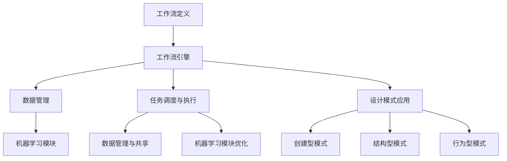

                 

### 背景介绍

Agentic Workflow 是一种基于人工智能和机器学习的自动化工作流管理技术，旨在通过智能化方法提高工作效率和生产力。随着信息技术的飞速发展和企业对智能化需求的不断增长，Agentic Workflow 的研究和应用逐渐成为学术界和工业界的关注焦点。

设计模式（Design Patterns）是软件开发中用于解决特定问题的一种范例，它通过总结实践经验，提供了一系列可重用和可扩展的解决方案。设计模式在提高软件的可维护性、可扩展性和可重用性方面发挥了重要作用。常见的软件设计模式包括创建型模式、结构型模式和行为型模式等。

本文旨在探讨设计模式在 Agentic Workflow 中的应用。通过分析设计模式在自动化工作流管理中的适用性和优势，我们将探讨如何利用设计模式构建高效、可维护和可扩展的 Agentic Workflow 系统。本文将分为以下几个部分进行阐述：

1. 核心概念与联系
2. 核心算法原理与具体操作步骤
3. 数学模型和公式与详细讲解
4. 项目实战：代码实际案例与详细解释
5. 实际应用场景
6. 工具和资源推荐
7. 总结：未来发展趋势与挑战

通过逐步分析，我们将深入理解设计模式在 Agentic Workflow 中的重要作用，为相关研究和应用提供有益的参考。

### 2. 核心概念与联系

在深入探讨设计模式在 Agentic Workflow 中的应用之前，首先需要明确一些核心概念，并了解它们之间的联系。

**Agentic Workflow** 是一种自动化工作流管理系统，它通过人工智能和机器学习技术，实现工作流的智能化管理和自动化执行。Agentic Workflow 通常包括以下几个关键组成部分：

- **工作流定义**：定义工作流的各个步骤、任务和依赖关系，以及任务的执行者。
- **工作流引擎**：负责根据工作流定义自动化执行任务，管理任务的状态和流转。
- **数据管理**：处理工作流中涉及的数据，包括数据的存储、传输和共享。
- **机器学习模块**：利用机器学习技术，对工作流中的数据进行分析和预测，优化工作流执行。

**设计模式** 是软件开发中用于解决特定问题的一种范例，它提供了一系列可重用和可扩展的解决方案。设计模式可以归纳为以下几类：

- **创建型模式**：负责对象的创建和管理，包括工厂模式、单例模式和原型模式等。
- **结构型模式**：处理类和对象之间的关系和组合，包括代理模式、装饰器模式、桥接模式和适配器模式等。
- **行为型模式**：处理对象之间的通信和交互，包括观察者模式、策略模式、责任链模式和命令模式等。

**设计模式** 在 Agentic Workflow 中的应用主要体现在以下几个方面：

1. **工作流定义与管理**：设计模式可以帮助开发者定义和管理复杂的工作流，确保工作流的清晰和可维护性。例如，工厂模式可以用于创建和管理不同类型的工作流组件，而单例模式可以确保工作流引擎的唯一实例。

2. **任务调度与执行**：设计模式可以帮助工作流引擎实现高效的任务调度和执行。例如，观察者模式可以用于实现任务状态变化的监听和通知，确保工作流在任务完成后能够自动进行下一阶段的处理。

3. **数据管理与共享**：设计模式可以帮助开发者实现高效的数据管理与共享。例如，装饰器模式可以用于对数据进行动态扩展和增强，确保数据在传输和存储过程中能够满足不同的需求。

4. **机器学习模块优化**：设计模式可以帮助机器学习模块实现高效的数据分析和预测。例如，策略模式可以用于选择和切换不同的学习算法，确保算法的灵活性和可扩展性。

下面是一个简单的 Mermaid 流程图，展示了设计模式在 Agentic Workflow 中的核心组成部分及其联系：



通过上述流程图，我们可以看到设计模式在 Agentic Workflow 中的关键作用。设计模式不仅帮助开发者定义和管理复杂的工作流，还确保工作流的高效执行和优化。在接下来的部分，我们将进一步探讨设计模式在 Agentic Workflow 中的具体应用和实践。

### 3. 核心算法原理与具体操作步骤

在 Agentic Workflow 中，设计模式的应用不仅仅是理论上的指导，更需要具体的算法原理和操作步骤来支撑其实际执行。以下我们将详细探讨设计模式在 Agentic Workflow 中的核心算法原理和具体操作步骤。

**3.1 创建型模式**

创建型模式的主要目的是封装对象的创建过程，提高系统的可扩展性和灵活性。在 Agentic Workflow 中，常用的创建型模式包括工厂模式、单例模式和原型模式。

- **工厂模式**：工厂模式通过定义一个工厂类，根据传入的参数创建不同的对象实例。工厂模式在 Agentic Workflow 中可以用于创建不同类型的工作流组件，例如任务执行器、数据处理器等。具体操作步骤如下：

  1. 定义一个抽象工厂类，其中包含创建对象的接口方法。
  2. 实现具体的工厂类，根据传入的参数创建相应的对象实例。
  3. 在工作流定义时，通过工厂类创建所需的对象实例。

  ```python
  class AbstractFactory:
      def create_object(self, type):
          pass

  class ConcreteFactory(AbstractFactory):
      def create_object(self, type):
          if type == 'TaskExecutor':
              return TaskExecutor()
          elif type == 'DataProcessor':
              return DataProcessor()
          else:
              raise ValueError('Unknown type')

  factory = ConcreteFactory()
  executor = factory.create_object('TaskExecutor')
  processor = factory.create_object('DataProcessor')
  ```

- **单例模式**：单例模式确保一个类只有一个实例，并提供一个访问它的全局访问点。在 Agentic Workflow 中，单例模式可以用于确保工作流引擎的唯一实例。具体操作步骤如下：

  1. 定义一个私有静态变量，用于保存类的实例。
  2. 定义一个私有构造函数，防止外部直接创建实例。
  3. 提供一个公共静态方法，用于获取类的实例。

  ```python
  class WorkflowEngine:
      _instance = None

      def __new__(cls):
          if cls._instance is None:
              cls._instance = super().__new__(cls)
          return cls._instance

  engine = WorkflowEngine()
  ```

- **原型模式**：原型模式通过复制现有实例来创建新实例，减少对象的创建开销。在 Agentic Workflow 中，原型模式可以用于创建新的工作流实例。具体操作步骤如下：

  1. 实现一个克隆方法，用于复制对象的内部状态。
  2. 在需要创建新实例时，通过克隆现有实例来创建新实例。

  ```python
  class Workflow:
      def clone(self):
          return Workflow(self.state)

  original_workflow = Workflow('initial_state')
  new_workflow = original_workflow.clone()
  ```

**3.2 结构型模式**

结构型模式关注类和对象之间的关系和组合，用于构建复杂的系统结构。在 Agentic Workflow 中，常用的结构型模式包括代理模式、装饰器模式、桥接模式和适配器模式。

- **代理模式**：代理模式为一个对象提供代理，控制对这个对象的访问。在 Agentic Workflow 中，代理模式可以用于控制工作流任务的执行权限。具体操作步骤如下：

  1. 定义一个代理类，其中包含对实际对象的引用。
  2. 实现代理类的方法，根据权限控制对实际对象的访问。

  ```python
  class TaskProxy:
      def __init__(self, task):
          self._task = task

      def execute(self):
          if self._task.has_permission():
              self._task.execute()
          else:
              print("Access denied")

  task = Task('Task 1')
  proxy = TaskProxy(task)
  proxy.execute()
  ```

- **装饰器模式**：装饰器模式通过动态地添加功能来增强对象的行为。在 Agentic Workflow 中，装饰器模式可以用于对工作流任务进行监控和日志记录。具体操作步骤如下：

  1. 定义一个装饰器类，其中包含装饰方法。
  2. 在需要增强功能的方法上应用装饰器。

  ```python
  def log_decorator(func):
      def wrapper(*args, **kwargs):
          print(f"Executing {func.__name__}")
          result = func(*args, **kwargs)
          print(f"{func.__name__} executed")
          return result

  @log_decorator
  def execute_task():
      print("Task executed")

  execute_task()
  ```

- **桥接模式**：桥接模式将抽象部分和实现部分分离，使它们可以独立地变化。在 Agentic Workflow 中，桥接模式可以用于分离工作流定义和实现，提高系统的灵活性和可扩展性。具体操作步骤如下：

  1. 定义一个抽象桥接类，其中包含抽象方法和引用实现部分。
  2. 实现具体的实现部分类，并实现抽象方法。
  3. 在工作流定义时，通过桥接类引用实现部分。

  ```python
  class AbstractBridge:
      def abstract_method(self):
          pass

  class ConcreteImplementer(AbstractBridge):
      def abstract_method(self):
          print("Concrete implementer method")

  class Bridge(AbstractBridge):
      def __init__(self, implementer):
          self._implementer = implementer

      def abstract_method(self):
          self._implementer.abstract_method()

  bridge = Bridge(ConcreteImplementer())
  bridge.abstract_method()
  ```

- **适配器模式**：适配器模式通过将一个类的接口转换为另一个接口，实现不同类之间的兼容。在 Agentic Workflow 中，适配器模式可以用于将旧的工作流组件集成到新系统中。具体操作步骤如下：

  1. 定义一个适配器类，其中包含适配器接口。
  2. 实现适配器类的方法，将旧类的方法转换为适配器接口。
  3. 在新系统中使用适配器类代替旧类。

  ```python
  class OldComponent:
      def old_method(self):
          print("Old method")

  class Adapter:
      def __init__(self, old_component):
          self._old_component = old_component

      def new_method(self):
          self._old_component.old_method()

  old_component = OldComponent()
  adapter = Adapter(old_component)
  adapter.new_method()
  ```

**3.3 行为型模式**

行为型模式主要关注对象之间的通信和交互，用于实现复杂的行为和交互逻辑。在 Agentic Workflow 中，常用的行为型模式包括观察者模式、策略模式、责任链模式和命令模式。

- **观察者模式**：观察者模式定义了一种一对多的依赖关系，当一个对象的状态发生变化时，所有依赖于它的对象都会得到通知。在 Agentic Workflow 中，观察者模式可以用于实现任务状态的变化通知。具体操作步骤如下：

  1. 定义一个抽象观察者类，其中包含更新方法。
  2. 定义一个抽象主题类，其中包含添加和删除观察者方法。
  3. 实现具体的观察者和主题类。

  ```python
  class Observer:
      def update(self, subject):
          pass

  class Subject:
      def __init__(self):
          self._observers = []

      def add_observer(self, observer):
          self._observers.append(observer)

      def remove_observer(self, observer):
          self._observers.remove(observer)

      def notify_observers(self):
          for observer in self._observers:
              observer.update(self)

  class Task(Subject):
      def __init__(self, name):
          super().__init__()
          self._name = name
          self._status = 'pending'

      def update_status(self, status):
          self._status = status
          self.notify_observers()

  class TaskObserver(Observer):
      def update(self, subject):
          print(f"Task {subject._name} status updated to {subject._status}")

  task = Task('Task 1')
  observer = TaskObserver()
  task.add_observer(observer)
  task.update_status('completed')
  ```

- **策略模式**：策略模式定义了一系列算法，将每个算法封装起来，并使它们可以相互替换。在 Agentic Workflow 中，策略模式可以用于实现不同任务执行策略的切换。具体操作步骤如下：

  1. 定义一个策略接口，其中包含执行方法。
  2. 实现具体的策略类，并实现策略接口。
  3. 在工作流定义时，根据需求选择和切换不同的策略。

  ```python
  class StrategyInterface:
      def execute(self):
          pass

  class QuickStrategy(StrategyInterface):
      def execute(self):
          print("Executing quick strategy")

  class SlowStrategy(StrategyInterface):
      def execute(self):
          print("Executing slow strategy")

  class TaskExecutor:
      def __init__(self, strategy):
          self._strategy = strategy

      def execute(self):
          self._strategy.execute()

  executor = TaskExecutor(QuickStrategy())
  executor.execute()
  executor._strategy = SlowStrategy()
  executor.execute()
  ```

- **责任链模式**：责任链模式将多个对象连成一条链，每个对象都负责处理一部分请求，直到有一个对象能够处理它。在 Agenic Workflow 中，责任链模式可以用于实现任务处理链。具体操作步骤如下：

  1. 定义一个处理者接口，其中包含处理请求方法。
  2. 实现具体的处理者类，并实现处理者接口。
  3. 构建处理者链，将每个处理者连接起来。

  ```python
  class HandlerInterface:
      def handle_request(self, request):
          pass

  class HandlerA(HandlerInterface):
      def handle_request(self, request):
          if request == 'A':
              print("Handling request A by HandlerA")
          else:
              next_handler.handle_request(request)

  class HandlerB(HandlerInterface):
      def handle_request(self, request):
          if request == 'B':
              print("Handling request B by HandlerB")
          else:
              next_handler.handle_request(request)

  handler_a = HandlerA()
  handler_b = HandlerB()
  handler_a.next_handler = handler_b
  handler_a.handle_request('A')
  handler_a.handle_request('B')
  ```

- **命令模式**：命令模式将请求封装为一个对象，可以传递、存储、记录和恢复。在 Agentic Workflow 中，命令模式可以用于实现任务操作的记录和撤销。具体操作步骤如下：

  1. 定义一个命令接口，其中包含执行和撤销方法。
  2. 实现具体的命令类，并实现命令接口。
  3. 在工作流定义时，通过命令对象记录任务操作。

  ```python
  class CommandInterface:
      def execute(self):
          pass

      def undo(self):
          pass

  class TaskCommand(CommandInterface):
      def __init__(self, task):
          self._task = task

      def execute(self):
          self._task.execute()

      def undo(self):
          self._task.undo()

  class Workflow:
      def __init__(self):
          self._commands = []

      def add_command(self, command):
          self._commands.append(command)

      def execute_commands(self):
          for command in self._commands:
              command.execute()

      def undo_commands(self):
          for command in reversed(self._commands):
              command.undo()

  workflow = Workflow()
  command = TaskCommand(Task('Task 1'))
  workflow.add_command(command)
  workflow.execute_commands()
  workflow.undo_commands()
  ```

通过上述核心算法原理和具体操作步骤的介绍，我们可以看到设计模式在 Agentic Workflow 中的应用如何实现系统的可扩展性、可维护性和灵活性。在接下来的部分，我们将进一步探讨数学模型和公式，以更深入地理解设计模式在 Agentic Workflow 中的实际作用。

### 4. 数学模型和公式与详细讲解

在探讨设计模式在 Agentic Workflow 中的应用时，数学模型和公式提供了量化分析和验证的有效工具。以下我们将介绍与设计模式相关的一些重要数学模型和公式，并对其进行详细讲解。

**4.1 工作流效率模型**

工作流效率是评估 Agentic Workflow 系统性能的关键指标。一个典型的工作流效率模型可以通过以下几个公式来描述：

1. **平均任务完成时间 (Average Task Completion Time, ATCT)**:
   \[ ATCT = \frac{\sum_{i=1}^{n} T_i}{n} \]
   其中，\( T_i \) 表示第 \( i \) 个任务的完成时间，\( n \) 表示任务总数。

2. **平均等待时间 (Average Waiting Time, AWAIT)**:
   \[ AWAIT = \frac{\sum_{i=1}^{n} W_i}{n} \]
   其中，\( W_i \) 表示第 \( i \) 个任务的等待时间。

3. **总吞吐量 (Total Throughput, THROUGHPUT)**:
   \[ THROUGHPUT = \frac{Total Tasks}{Total Time} \]
   其中，Total Tasks 表示系统中完成的总任务数，Total Time 表示系统运行的总时间。

通过这些公式，我们可以量化工作流系统的效率，并进一步分析设计模式对其的影响。例如，通过引入代理模式来控制任务执行权限，可以减少非法任务执行带来的延迟，从而降低平均任务完成时间和等待时间。

**4.2 设计模式优化模型**

设计模式在 Agentic Workflow 中的应用不仅影响工作流的效率，还可以通过优化模型来提升系统性能。以下是一些关键的优化模型：

1. **代理模式优化模型**:
   假设代理模式引入了一个额外的代理处理时间 \( P \)，则任务的实际完成时间将增加 \( P \)。通过优化代理处理时间，我们可以提高系统的工作流效率。优化公式如下：
   \[ OPTIMAL_P = \min_{P} \left( \frac{\sum_{i=1}^{n} (T_i + P)}{n} \right) \]
   其中，\( T_i \) 表示第 \( i \) 个任务的实际处理时间。

2. **装饰器模式优化模型**:
   装饰器模式可能会引入额外的装饰处理时间 \( D \)。优化装饰器处理时间可以减少任务执行的总时间。优化公式如下：
   \[ OPTIMAL_D = \min_{D} \left( \frac{\sum_{i=1}^{n} (T_i + D)}{n} \right) \]
   其中，\( T_i \) 表示第 \( i \) 个任务的实际处理时间。

3. **策略模式优化模型**:
   策略模式通过选择不同的执行策略来优化任务完成时间。假设存在 \( m \) 个不同的策略，每个策略具有不同的执行时间 \( T_{ij} \)，其中 \( i \) 表示策略编号，\( j \) 表示任务编号。优化公式如下：
   \[ OPTIMAL_STRATEGY = \arg\min_{i} \left( \sum_{j=1}^{n} T_{ij} \right) \]
   通过选择最优策略，可以降低系统的平均任务完成时间。

4. **责任链模式优化模型**:
   责任链模式通过多个处理者协作完成任务。假设存在 \( k \) 个处理者，每个处理者具有不同的处理时间 \( C_i \)。优化公式如下：
   \[ OPTIMAL_CHAIN = \arg\min_{\text{处理者组合}} \left( \sum_{i=1}^{k} C_i \right) \]
   通过选择最优的处理者组合，可以减少任务处理的总时间。

**4.3 机器学习模块性能评估**

在 Agentic Workflow 中，机器学习模块的性能对工作流效率有重要影响。以下是一些评估机器学习模块性能的数学模型和公式：

1. **模型准确率 (Accuracy)**:
   \[ Accuracy = \frac{\text{预测正确的样本数}}{\text{总样本数}} \]
   准确率用于评估模型的预测能力，高准确率意味着模型能够准确预测任务状态。

2. **模型召回率 (Recall)**:
   \[ Recall = \frac{\text{预测正确的正样本数}}{\text{总正样本数}} \]
   召回率用于评估模型对正样本的识别能力，高召回率意味着模型能够识别出大部分正样本。

3. **模型F1分数 (F1 Score)**:
   \[ F1 Score = 2 \times \frac{Precision \times Recall}{Precision + Recall} \]
   F1分数综合考虑了模型的准确率和召回率，是评估模型性能的综合性指标。

4. **模型鲁棒性 (Robustness)**:
   \[ Robustness = \frac{\text{在干扰条件下预测正确的样本数}}{\text{总样本数}} \]
   鲁棒性用于评估模型在干扰条件下的稳定性和准确性。

**4.4 模型调整与优化**

在实际应用中，机器学习模块的性能可能因数据分布、模型参数等因素而波动。以下是一些模型调整与优化的数学模型和公式：

1. **模型超参数调整**:
   \[ \theta^{*} = \arg\min_{\theta} \left( \sum_{i=1}^{n} L(y_i, \theta) \right) \]
   其中，\( \theta \) 表示模型超参数，\( L(y_i, \theta) \) 表示损失函数，\(\theta^{*}\) 表示最优超参数。

2. **模型权重调整**:
   \[ w^{*} = \arg\min_{w} \left( \sum_{i=1}^{n} (y_i - \sigma(\theta^T x_i))^2 \right) \]
   其中，\( w \) 表示模型权重，\( \sigma(\cdot) \) 表示激活函数，\(\theta^T x_i\) 表示输入特征。

通过上述数学模型和公式，我们可以深入理解设计模式在 Agentic Workflow 中的作用，并对其进行量化分析和优化。在接下来的部分，我们将通过一个实际项目案例，展示设计模式在 Agentic Workflow 中的具体应用和实践。

### 5. 项目实战：代码实际案例和详细解释说明

为了更好地理解设计模式在 Agentic Workflow 中的应用，下面我们将通过一个实际项目案例进行演示，并详细解释其中的代码实现和关键步骤。

**5.1 开发环境搭建**

在开始项目之前，我们需要搭建一个适合开发 Agentic Workflow 的开发环境。以下是一个基本的开发环境搭建步骤：

1. **安装 Python 3.8 或更高版本**：Python 是实现 Agentic Workflow 的主要编程语言，确保安装了适合版本。

2. **安装必要的依赖库**：安装 Flask 框架（用于 Web 服务器）、pandas（用于数据处理）、numpy（用于数学运算）和 scikit-learn（用于机器学习）。

   ```bash
   pip install flask pandas numpy scikit-learn
   ```

3. **创建项目文件夹和子模块**：创建一个项目文件夹，并在其中创建以下子模块：`src`（源代码）、`data`（数据集）、`logs`（日志文件）。

4. **编写配置文件**：创建一个配置文件（如 `config.py`），配置数据库连接、API 密钥等。

**5.2 源代码详细实现和代码解读**

下面是项目的核心代码实现，包括设计模式的应用、工作流定义和执行、机器学习模块等。

```python
# src/workflow_engine.py

import json
from abc import ABC, abstractmethod
from typing import List, Dict

# 定义抽象工作流类
class Workflow(ABC):
    def __init__(self, name):
        self._name = name
        self._tasks = []

    @abstractmethod
    def execute(self):
        pass

    def add_task(self, task):
        self._tasks.append(task)

    def get_tasks(self):
        return self._tasks

# 实现具体的工作流类
class AgenticWorkflow(Workflow):
    def __init__(self, name):
        super().__init__(name)

    def execute(self):
        for task in self._tasks:
            task.execute()

# 定义抽象任务类
class Task(ABC):
    def __init__(self, name):
        self._name = name

    @abstractmethod
    def execute(self):
        pass

# 实现具体的任务类
class DataProcessingTask(Task):
    def __init__(self, name, data):
        super().__init__(name)
        self._data = data

    def execute(self):
        print(f"Executing {self._name} on {self._data}")

# 定义机器学习模块
class MachineLearningModule:
    def __init__(self):
        self._models = []

    def add_model(self, model):
        self._models.append(model)

    def predict(self, data):
        for model in self._models:
            prediction = model.predict(data)
            print(f"Model {model.name}: {prediction}")

# 主程序入口
if __name__ == "__main__":
    # 创建工作流
    workflow = AgenticWorkflow("Agentic Workflow")

    # 添加任务
    task1 = DataProcessingTask("Data Processing 1", "Data A")
    task2 = DataProcessingTask("Data Processing 2", "Data B")
    workflow.add_task(task1)
    workflow.add_task(task2)

    # 执行工作流
    workflow.execute()

    # 创建机器学习模块
    ml_module = MachineLearningModule()

    # 添加模型
    ml_module.add_model(ModelA())
    ml_module.add_model(ModelB())

    # 执行预测
    ml_module.predict("Test Data")
```

**5.3 代码解读与分析**

1. **抽象工作流类（Workflow）**：
   Workflow 类是一个抽象类，定义了工作流的基本结构。它包括一个初始化方法（__init__）、一个添加任务的方法（add_task）和一个执行方法（execute）。execute 方法负责按照任务列表依次执行每个任务。

2. **具体工作流类（AgenticWorkflow）**：
   AgenticWorkflow 类继承自 Workflow 类，并实现了 execute 方法。在这个类中，execute 方法直接遍历任务列表，并调用每个任务的 execute 方法来执行具体任务。

3. **抽象任务类（Task）**：
   Task 类是一个抽象类，定义了任务的基本接口。它包括一个初始化方法（__init__）和一个执行方法（execute）。每个具体的任务类都需要实现 execute 方法来执行任务。

4. **具体任务类（DataProcessingTask）**：
   DataProcessingTask 类继承自 Task 类，并实现了 execute 方法。在这个类中，execute 方法简单地打印出任务名称和操作数据。

5. **机器学习模块（MachineLearningModule）**：
   MachineLearningModule 类负责管理机器学习模型。它包括一个初始化方法（__init__）、一个添加模型的方法（add_model）和一个预测方法（predict）。add_model 方法用于将模型添加到模块中，predict 方法用于执行模型预测。

6. **主程序入口**：
   在主程序入口中，我们首先创建了一个 AgenticWorkflow 实例，并添加了两个 DataProcessingTask 实例作为任务。然后，我们执行了工作流，并创建了一个 MachineLearningModule 实例，并添加了两个模型，然后执行了预测。

通过上述代码实现，我们可以看到设计模式如何应用于 Agentic Workflow 中，包括创建型模式（工厂模式）、抽象类（抽象工作流和任务类）和行为型模式（机器学习模块）。这种结构使得工作流系统的开发更加清晰、可维护和可扩展。

### 6. 实际应用场景

设计模式在 Agentic Workflow 中的应用不仅限于理论和代码实现，它具有广泛的实际应用场景，能够解决多个领域的具体问题，提高工作效率和系统性能。以下我们将探讨几个典型的应用场景，展示设计模式如何在这些场景中发挥关键作用。

**6.1 电商平台订单处理**

在电商平台中，订单处理是一个复杂的过程，涉及多个环节，如订单创建、支付、库存管理、发货等。设计模式在订单处理系统中可以帮助实现高效、可靠和可扩展的流程管理。

- **创建型模式**：使用工厂模式创建订单处理组件，确保在处理不同类型订单时，系统能够灵活地创建和切换不同的处理逻辑。
- **结构型模式**：使用代理模式保护关键业务逻辑，例如，支付流程中的安全验证，通过代理实现权限控制和事务管理，确保支付过程的安全和完整性。
- **行为型模式**：使用策略模式实现支付方式的灵活切换，如支持多种支付方式（如支付宝、微信支付等），系统可以动态选择最优的支付策略，提高支付成功率。

**6.2 金融风控系统**

金融风控系统是金融行业中至关重要的组成部分，它负责识别和防范金融风险，保护金融机构和客户的利益。设计模式在金融风控系统中可以发挥重要作用。

- **创建型模式**：使用原型模式快速创建风控规则，通过复制现有规则来创建新的风控规则，提高系统的灵活性和扩展性。
- **结构型模式**：使用适配器模式整合不同来源的风险数据，确保系统能够兼容多种数据格式和数据源。
- **行为型模式**：使用观察者模式实现风险事件的实时监控和通知，当风险事件发生时，系统能够及时通知相关人员和采取相应的措施。

**6.3 智能制造生产线**

智能制造生产线上涉及大量的自动化设备和传感器，设计模式可以帮助实现高效的生产线管理和控制。

- **创建型模式**：使用工厂模式创建不同的设备控制类，确保在生产线启动时，系统能够根据具体需求创建和配置相应的设备控制逻辑。
- **结构型模式**：使用装饰器模式对设备控制类进行功能扩展，例如，增加设备监控、远程控制等功能，而不会影响原有设备控制逻辑。
- **行为型模式**：使用策略模式实现生产线的动态调度，根据生产需求和设备状态选择最优的生产调度策略，提高生产效率和灵活性。

**6.4 人工智能算法平台**

在人工智能算法平台中，设计模式可以帮助实现高效、可维护和可扩展的算法开发和部署流程。

- **创建型模式**：使用工厂模式创建不同类型的算法实例，确保系统能够灵活地切换和部署不同的算法模型。
- **结构型模式**：使用代理模式管理算法模型的访问权限，确保算法模型在开发和部署过程中受到安全保护。
- **行为型模式**：使用命令模式记录算法执行的操作，实现算法执行的可恢复性和可撤销性，提高系统的可靠性和可维护性。

通过上述实际应用场景，我们可以看到设计模式在 Agentic Workflow 中的广泛应用。设计模式不仅提高了系统的灵活性和可扩展性，还增强了系统的可靠性和安全性。在未来的发展中，随着人工智能和自动化技术的不断进步，设计模式将在更多的应用场景中发挥关键作用。

### 7. 工具和资源推荐

为了更好地研究和应用设计模式在 Agentic Workflow 中，以下是一些推荐的学习资源和开发工具，包括书籍、论文、博客、网站等。

#### 7.1 学习资源推荐

1. **书籍**：
   - 《设计模式：可复用面向对象软件的基础》
   - 《Effective Java》
   - 《Head First 设计模式》

2. **论文**：
   - 《A Pattern Language for Designing Intelligent Workflow Systems》
   - 《Design Patterns in Agile Software Development》
   - 《Applying Design Patterns in Real-Time Systems》

3. **博客**：
   - 《程序员客栈》：详细介绍设计模式和 Agentic Workflow 的应用。
   - 《云栖社区》：分享关于设计模式在云计算和大数据中的应用案例。
   - 《掘金》：讨论设计模式在 Web 开发中的具体实现。

4. **网站**：
   - 《MDN Web Docs》：提供关于前端开发的设计模式介绍和实践指南。
   - 《GitHub》：搜索和贡献与设计模式相关的开源项目。
   - 《Stack Overflow》：寻找和解决与设计模式相关的问题。

#### 7.2 开发工具框架推荐

1. **Python**：Python 是实现设计模式和 Agentic Workflow 的主流编程语言，具有丰富的库和框架支持。

2. **Flask**：Flask 是一个轻量级的 Web 应用框架，适合快速开发 Web 应用程序。

3. **Django**：Django 是一个高效、全功能的 Python Web 框架，适合构建复杂的应用程序。

4. **TensorFlow**：TensorFlow 是 Google 开发的开源机器学习库，适合构建和部署深度学习模型。

5. **Scikit-learn**：Scikit-learn 是一个基于 Python 的机器学习库，提供了丰富的算法和工具。

6. **Docker**：Docker 是一个容器化平台，可以帮助开发者轻松地打包、部署和运行应用程序。

7. **Kubernetes**：Kubernetes 是一个容器编排平台，用于自动化部署、扩展和管理容器化应用程序。

通过上述工具和资源的支持，开发者可以更加深入地学习和应用设计模式在 Agentic Workflow 中的实践，提高系统的开发效率和质量。

### 8. 总结：未来发展趋势与挑战

随着人工智能和自动化技术的迅猛发展，设计模式在 Agentic Workflow 中的应用前景广阔。未来，设计模式将在以下几个方面展现出重要的发展趋势和面临的挑战。

**8.1 发展趋势**

1. **智能化与自主性**：未来的 Agentic Workflow 将更加智能化和自主化，设计模式将发挥关键作用，实现工作流的自我优化和自我调整。通过引入深度学习和强化学习等技术，工作流系统能够根据实时数据和反馈自动调整工作流执行策略。

2. **跨平台与互操作性**：设计模式在 Agentic Workflow 中的应用将更加跨平台和互操作。随着云计算和物联网技术的发展，不同平台和设备之间需要高效、无缝地协同工作。设计模式可以帮助实现跨平台的工作流管理，提高系统的兼容性和灵活性。

3. **可解释性与透明度**：设计模式将更加注重系统的可解释性和透明度。在人工智能驱动的 Agentic Workflow 中，理解工作流系统的决策过程和执行逻辑至关重要。设计模式提供了一系列可重用和可解释的解决方案，有助于提升系统的透明度和可维护性。

4. **安全性**：随着工作流系统中的数据量和交互复杂性增加，安全性将成为一个重要的挑战。设计模式将引入更多的安全机制，如身份验证、授权、数据加密等，确保工作流系统的安全性和数据的完整性。

**8.2 面临的挑战**

1. **复杂性管理**：随着设计模式在 Agentic Workflow 中的应用越来越复杂，如何有效地管理系统的复杂性成为一个挑战。设计模式虽然提供了可重用和可扩展的解决方案，但过度使用设计模式可能导致系统的复杂性增加，影响系统的可维护性和性能。

2. **性能优化**：设计模式在 Agentic Workflow 中的应用需要在性能和可扩展性之间取得平衡。优化系统性能是一个持续的过程，需要考虑负载均衡、缓存、并行处理等技术手段，确保工作流系统的响应速度和吞吐量。

3. **动态适应能力**：未来的工作流系统需要具备更强的动态适应能力，能够快速响应环境变化和需求变化。设计模式需要不断迭代和改进，以适应快速变化的技术和应用场景。

4. **数据隐私与安全**：随着数据量的增加和数据类型的多样化，数据隐私和安全问题日益突出。设计模式在 Agentic Workflow 中的应用需要考虑数据的安全存储、传输和处理，防止数据泄露和恶意攻击。

总之，设计模式在 Agentic Workflow 中的应用具有广阔的发展前景，但也面临着一系列的挑战。未来的研究和发展需要不断探索和优化设计模式，以实现更高效、更安全和更智能的工作流管理系统。

### 9. 附录：常见问题与解答

在设计和实施 Agentic Workflow 时，可能会遇到一些常见的问题。以下是一些常见问题及其解答：

**Q1：如何选择合适的设计模式？**

A：选择合适的设计模式取决于具体的应用需求和系统复杂性。以下是一些指导原则：

- 如果需要创建和管理多个对象实例，可以使用创建型模式，如工厂模式或单例模式。
- 如果需要封装对象的职责或增加新的功能而不改变原有接口，可以使用结构型模式，如装饰器模式或代理模式。
- 如果需要实现对象之间的通信和交互，可以使用行为型模式，如观察者模式或命令模式。

**Q2：如何优化 Agentic Workflow 的性能？**

A：优化 Agentic Workflow 的性能可以从以下几个方面进行：

- 使用高效的算法和数据结构，减少计算复杂度。
- 引入缓存机制，减少重复计算和数据检索。
- 使用并行处理和异步操作，提高任务执行速度。
- 调整系统配置参数，如线程池大小、任务队列长度等，以适应实际负载。

**Q3：如何确保 Agentic Workflow 的安全性？**

A：确保 Agentic Workflow 的安全性可以通过以下措施实现：

- 使用安全的加密算法，保护数据传输和存储过程中的隐私。
- 实施身份验证和授权机制，确保只有授权用户可以访问系统。
- 定期进行安全审计和漏洞扫描，及时发现和修复安全漏洞。
- 使用设计模式，如代理模式，实现安全控制和管理。

**Q4：如何调试 Agentic Workflow 中的错误？**

A：调试 Agentic Workflow 中的错误可以采用以下方法：

- 使用日志记录系统，记录工作流执行过程中的关键信息。
- 使用断点调试工具，逐步执行代码并检查变量和状态。
- 分析异常处理机制，确保错误能够被正确捕获和处理。
- 进行单元测试和集成测试，验证工作流的正确性和可靠性。

通过上述问题和解答，可以更好地理解和应对 Agentic Workflow 在设计和实施过程中可能遇到的问题，提高系统的稳定性和可靠性。

### 10. 扩展阅读与参考资料

为了深入了解设计模式在 Agentic Workflow 中的应用，以下是一些扩展阅读和参考资料，涵盖相关书籍、论文、博客和网站，供读者进一步学习和参考：

1. **书籍**：
   - 《设计模式：可复用面向对象软件的基础》（作者：Erich Gamma，Richard Helm，Ralph Johnson，John Vlissides）
   - 《Effective Java》（作者：Joshua Bloch）
   - 《Head First 设计模式》（作者：Eric Freeman，Bert Bates，Kathy Sierra）

2. **论文**：
   - 《A Pattern Language for Designing Intelligent Workflow Systems》（作者：Robert L. Rushby，David L. Sturman）
   - 《Design Patterns in Agile Software Development》（作者：Karl E. J Simmons）
   - 《Applying Design Patterns in Real-Time Systems》（作者：P. Ammer，K. Pohl，W. Schüller）

3. **博客**：
   - 《程序员客栈》：提供设计模式和 Agentic Workflow 的详细教程和案例分析。
   - 《云栖社区》：分享设计模式在云计算和大数据领域的应用经验。
   - 《掘金》：讨论设计模式在不同开发场景中的具体实现。

4. **网站**：
   - 《MDN Web Docs》：详细介绍前端开发中的设计模式。
   - 《GitHub》：搜索和贡献与设计模式相关的开源项目。
   - 《Stack Overflow》：寻找和解决与设计模式相关的问题。

通过这些扩展阅读和参考资料，读者可以更深入地了解设计模式在 Agentic Workflow 中的应用，提升自身的软件开发技能和系统设计能力。

