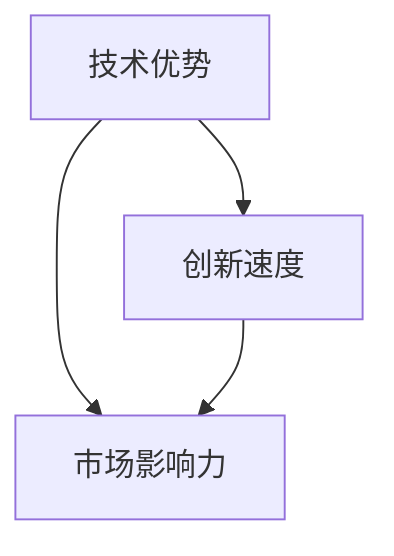
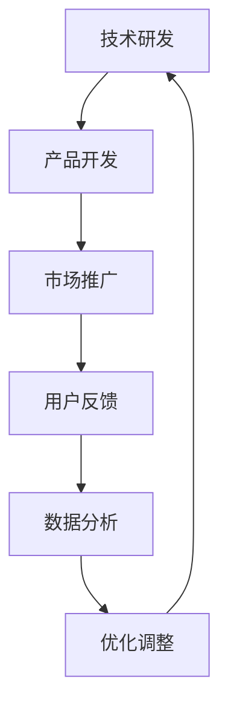

                 

### 背景介绍

在信息技术飞速发展的今天，计算机编程和人工智能领域无疑成为了最热门的焦点。随着技术的不断进步，我们逐渐认识到，在这个时代，只有遥遥领先才能在竞争中获得优势，从而赚取更多的财富。本文将探讨这一现象背后的原因，以及为什么只有那些能够持续领先的人才能在信息技术领域获得巨大的成功。

首先，让我们回顾一下历史。在过去几十年里，信息技术经历了从简单到复杂、从局部到全球的巨大变革。计算机从庞大的主机演变为轻巧的智能手机，互联网从科研人员的工具变成普罗大众的日常必需品。这一过程中，无数程序员、工程师和技术专家为了实现技术上的突破，付出了巨大的努力和汗水。

然而，尽管许多人都在努力，但真正能够脱颖而出、引领行业发展的，往往只是少数人。这种现象背后的原因有很多，其中包括技术创新的难度、市场竞争的激烈程度，以及技术人才的稀缺性。这些因素共同作用，导致只有那些能够在技术前沿持续领先的人，才能够获得丰厚的回报。

本文将深入探讨这些因素，并从多个角度分析为什么只有遥遥领先才能赚钱。我们将通过具体案例和实际数据，揭示这一现象的本质，帮助读者更好地理解信息技术领域中的财富分布规律。

接下来，我们将首先介绍本文的核心概念和联系，使用Mermaid流程图展示技术原理和架构。这将帮助我们建立一个清晰的框架，为进一步的分析和讨论打下基础。

## 2. 核心概念与联系

在探讨为什么只有遥遥领先才能赚钱之前，我们首先需要理解几个关键概念：技术优势、创新速度和市场影响力。这些概念相互关联，共同构成了信息技术领域中的核心竞争力。

### 2.1 技术优势

技术优势是指企业在某个技术领域相对于竞争对手所具有的领先地位。这种优势可以表现为技术上的领先、产品的独特性、或者更高效的研发能力。在信息技术领域，技术优势往往意味着能够在短时间内开发出更具竞争力的产品或解决方案。

### 2.2 创新速度

创新速度是指企业在技术发展中持续进行创新和改进的能力。在信息技术领域，创新速度决定了企业能否及时抓住市场机遇，满足用户需求，并在竞争中保持领先地位。

### 2.3 市场影响力

市场影响力是指企业在市场中所拥有的影响力，包括用户基础、市场份额、以及品牌知名度。市场影响力强的企业往往能够在竞争中占据优势，获得更高的利润回报。

### 2.4 关系与联系

这三个核心概念之间的关系如下图所示：



技术优势是企业创新和市场影响力的基础。只有具备技术优势，企业才能在创新过程中不断突破，从而保持市场竞争力。而创新速度则决定了企业能否迅速将技术优势转化为市场影响力。市场影响力进一步巩固企业的竞争优势，形成良性的循环。

### 2.5 技术原理和架构

为了更好地理解这些概念，我们可以通过一个Mermaid流程图来展示技术原理和架构：



在这个流程图中，技术研发是整个过程的起点。企业通过不断的研究和创新，开发出具有竞争力的产品或解决方案。这些产品在市场上的表现，会通过用户反馈传递回来，从而形成数据。企业通过对这些数据的分析，发现存在的问题并进行优化调整，再次回到技术研发阶段，形成一个闭环。

### 2.6 核心概念总结

通过以上分析，我们可以总结出以下几个关键点：

1. 技术优势是企业竞争的基础。
2. 创新速度决定了企业能否抓住市场机遇。
3. 市场影响力是企业长期发展的保障。
4. 技术研发、产品开发、市场推广和用户反馈相互关联，形成了一个完整的闭环。

这些核心概念和技术原理，为我们理解为什么只有遥遥领先才能赚钱提供了理论基础。接下来，我们将进一步探讨这些概念在实际操作中的具体应用和实现步骤。

## 3. 核心算法原理 & 具体操作步骤

在理解了核心概念和技术原理之后，我们接下来将深入探讨如何在实际操作中实现遥遥领先。这一部分将介绍几个关键算法原理，并详细说明其操作步骤，帮助读者更好地理解和应用这些技术。

### 3.1 机器学习算法原理

机器学习是信息技术领域中的一项核心技术，它使得计算机能够从数据中学习并做出决策。机器学习算法可以分为监督学习、无监督学习和强化学习三种类型。在这里，我们将重点介绍监督学习算法。

#### 3.1.1 算法原理

监督学习算法通过训练数据集，使得计算机学会对新的数据进行分类或回归。其基本原理是使用一个假设函数（h(x)）来预测输出值（y）。训练过程中，通过最小化损失函数（L(h(x), y)）来调整假设函数的参数，使其预测结果更接近真实值。

#### 3.1.2 操作步骤

1. **数据预处理**：首先，对数据进行清洗和预处理，包括缺失值处理、异常值检测和数据标准化等步骤。

2. **数据集划分**：将数据集划分为训练集和测试集。训练集用于训练模型，测试集用于评估模型性能。

3. **选择模型**：根据问题类型选择合适的机器学习模型，如线性回归、决策树、支持向量机等。

4. **训练模型**：使用训练集数据训练模型，通过最小化损失函数来调整模型参数。

5. **模型评估**：使用测试集数据评估模型性能，常见指标包括准确率、召回率、F1分数等。

6. **模型优化**：根据评估结果对模型进行优化，包括调整超参数、使用更复杂的模型等。

### 3.2 深度学习算法原理

深度学习是机器学习的一种扩展，通过构建多层神经网络来提取数据中的特征。与传统的机器学习算法相比，深度学习在图像识别、语音识别等复杂任务中表现更为出色。

#### 3.2.1 算法原理

深度学习算法的核心是神经网络，它由多个层级组成，包括输入层、隐藏层和输出层。每一层神经网络通过激活函数（如ReLU、Sigmoid、Tanh等）对输入数据进行处理，并传递到下一层。通过反向传播算法，将输出误差反向传播到每一层，不断调整权重和偏置，使网络逐渐收敛到最优解。

#### 3.2.2 操作步骤

1. **数据预处理**：与监督学习算法类似，对数据进行清洗和预处理。

2. **构建神经网络**：设计神经网络结构，包括层数、每层的神经元数量、激活函数等。

3. **初始化参数**：随机初始化网络的权重和偏置。

4. **前向传播**：将输入数据通过神经网络进行前向传播，得到输出结果。

5. **计算损失**：计算输出结果与真实值之间的差异，得到损失值。

6. **反向传播**：通过反向传播算法，将损失值反向传播到每一层，更新权重和偏置。

7. **迭代训练**：重复进行前向传播和反向传播，直到网络收敛到满意的性能水平。

### 3.3 分布式计算算法原理

分布式计算是一种在多台计算机上协同处理任务的技术，能够大幅提升计算性能和扩展性。在信息技术领域，分布式计算广泛应用于大数据处理、分布式数据库、云计算等场景。

#### 3.3.1 算法原理

分布式计算的核心是任务分解和协同处理。首先，将一个大的任务分解为多个小任务，分配给不同的计算节点进行处理。各节点独立执行任务，然后将结果汇总，得到最终结果。分布式计算的关键技术包括任务调度、负载均衡、容错机制等。

#### 3.3.2 操作步骤

1. **任务分解**：将大的任务分解为多个小任务，确保每个任务能够在不同的计算节点上独立执行。

2. **任务调度**：根据计算节点的负载情况，合理调度任务，确保资源利用最大化。

3. **数据同步**：在任务执行过程中，需要保证数据的一致性，通过数据同步机制实现。

4. **任务结果汇总**：将各节点的结果汇总，得到最终结果。

5. **容错机制**：设计容错机制，确保在节点故障时，系统能够自动恢复，保证任务的顺利完成。

通过以上三个核心算法的介绍，我们可以看到，在实际操作中实现遥遥领先的关键在于理解并应用这些算法原理，不断优化和改进。接下来，我们将进一步探讨数学模型和公式，以及它们在实际应用中的详细讲解和举例说明。

## 4. 数学模型和公式 & 详细讲解 & 举例说明

在信息技术领域，数学模型和公式是理解和实现各种算法的重要工具。它们帮助我们量化技术原理，并通过具体的数学表达形式进行推理和验证。在这一部分，我们将详细讲解几个关键数学模型和公式，并通过实际应用场景和例子来说明它们的作用。

### 4.1 线性回归模型

线性回归是一种常见的监督学习算法，用于预测连续值。其核心公式为：

$$
y = \beta_0 + \beta_1 \cdot x
$$

其中，\( y \) 是预测值，\( x \) 是输入特征，\( \beta_0 \) 和 \( \beta_1 \) 是模型参数。

#### 详细讲解

线性回归模型通过最小化损失函数（如均方误差）来调整参数，使预测值与真实值尽可能接近。具体步骤如下：

1. **数据预处理**：对输入数据进行标准化，使其具有相同的量纲。
2. **模型初始化**：随机初始化参数 \( \beta_0 \) 和 \( \beta_1 \)。
3. **前向传播**：计算预测值 \( \hat{y} = \beta_0 + \beta_1 \cdot x \)。
4. **计算损失**：使用损失函数 \( L(\beta_0, \beta_1) = \frac{1}{2} \sum_{i=1}^{n} (y_i - \hat{y}_i)^2 \) 计算损失。
5. **反向传播**：根据损失函数梯度调整参数 \( \beta_0 \) 和 \( \beta_1 \)。

#### 举例说明

假设我们要预测某个城市的明天温度。给定一个特征向量 \( x = [日平均温度, 日最高温度, 日最低温度] \)，我们可以使用线性回归模型来预测温度。

1. **数据预处理**：对特征向量进行标准化。
2. **模型训练**：使用历史天气数据训练模型，得到参数 \( \beta_0 \) 和 \( \beta_1 \)。
3. **预测**：输入今天的特征向量，得到预测温度。

### 4.2 深度学习损失函数

在深度学习中，常用的损失函数包括均方误差（MSE）和交叉熵（Cross-Entropy）。它们的公式分别为：

$$
MSE = \frac{1}{2} \sum_{i=1}^{n} (y_i - \hat{y}_i)^2
$$

$$
Cross-Entropy = -\sum_{i=1}^{n} y_i \cdot \log(\hat{y}_i)
$$

其中，\( y \) 是真实标签，\( \hat{y} \) 是模型预测概率。

#### 详细讲解

1. **均方误差**：用于回归问题，最小化预测值与真实值之间的平方差。
2. **交叉熵**：用于分类问题，最小化真实标签与预测概率之间的差异。

#### 举例说明

假设我们要预测一张图片中的动物类型。给定模型输出 \( \hat{y} = [0.2, 0.3, 0.5] \)，真实标签为狗（概率为1，其他类别概率为0）。使用交叉熵损失函数计算损失：

$$
Cross-Entropy = -1 \cdot \log(0.5) = -\log(0.5)
$$

### 4.3 梯度下降算法

梯度下降是优化模型参数的常用算法。其核心思想是沿着损失函数梯度的反方向更新参数，逐步减小损失。

$$
\Delta \theta = -\alpha \cdot \nabla L(\theta)
$$

其中，\( \theta \) 是模型参数，\( \alpha \) 是学习率。

#### 详细讲解

1. **前向传播**：计算损失函数值。
2. **反向传播**：计算损失函数对参数的梯度。
3. **更新参数**：根据梯度反方向和负学习率更新参数。

#### 举例说明

假设我们要优化一个线性回归模型，损失函数为MSE，学习率为0.01。给定参数 \( \beta_0 = 2 \)，\( \beta_1 = 3 \)，输入特征 \( x = 4 \)，真实标签 \( y = 5 \)。计算损失和梯度：

$$
L(\beta_0, \beta_1) = \frac{1}{2} \cdot (5 - (2 + 3 \cdot 4))^2 = 49/2
$$

$$
\nabla L(\beta_0) = -1 \cdot (5 - 14) = -9
$$

$$
\nabla L(\beta_1) = -1 \cdot (5 - 14) \cdot 4 = -36
$$

更新参数：

$$
\beta_0 = 2 - 0.01 \cdot (-9) = 2.09
$$

$$
\beta_1 = 3 - 0.01 \cdot (-36) = 3.36
$$

通过以上数学模型和公式的详细讲解和举例说明，我们可以更好地理解信息技术领域中的一些关键技术。这些模型和公式为实际应用提供了理论基础，帮助我们在实践中实现遥遥领先。

### 5. 项目实战：代码实际案例和详细解释说明

在了解了核心算法原理和数学模型之后，我们将通过一个实际项目案例，展示如何将这些知识应用到实践中。在这个案例中，我们将使用Python实现一个基于机器学习的房价预测系统，并详细解释代码的实现过程和关键步骤。

#### 5.1 开发环境搭建

首先，我们需要搭建一个合适的开发环境。在这个案例中，我们将使用Python和Jupyter Notebook作为主要工具。以下是搭建开发环境的基本步骤：

1. 安装Python（版本3.7或以上）。
2. 安装Jupyter Notebook。
3. 安装必要的库，如NumPy、Pandas、Scikit-learn等。

在安装完成后，打开Jupyter Notebook，创建一个新的笔记本（Notebook）。

#### 5.2 源代码详细实现和代码解读

接下来，我们将逐步实现房价预测系统，并详细解读代码中的每个部分。

##### 5.2.1 数据准备

首先，我们需要准备用于训练和测试的数据。在这个案例中，我们使用Kaggle上的Boston House Prices数据集。

```python
import pandas as pd
from sklearn.datasets import load_boston

# 加载数据集
boston = load_boston()
data = pd.DataFrame(boston.data, columns=boston.feature_names)
data['PRICE'] = boston.target

# 数据预处理
data = data.dropna()

# 划分训练集和测试集
train_size = int(0.8 * len(data))
train_data = data[:train_size]
test_data = data[train_size:]
```

这段代码首先加载数据集，然后进行预处理，包括去除缺失值。接着，使用80%的数据作为训练集，20%的数据作为测试集。

##### 5.2.2 模型训练

接下来，我们使用线性回归模型进行训练。

```python
from sklearn.linear_model import LinearRegression

# 创建线性回归模型
model = LinearRegression()

# 训练模型
model.fit(train_data[boston.feature_names], train_data['PRICE'])
```

这段代码创建了一个线性回归模型，并使用训练数据集进行训练。

##### 5.2.3 模型评估

训练完成后，我们需要评估模型在测试集上的性能。

```python
from sklearn.metrics import mean_squared_error

# 预测测试集
predictions = model.predict(test_data[boston.feature_names])

# 计算均方误差
mse = mean_squared_error(test_data['PRICE'], predictions)
print("MSE:", mse)
```

这段代码使用测试数据集对模型进行预测，并计算均方误差，评估模型性能。

##### 5.2.4 结果分析

最后，我们分析模型的预测结果。

```python
import matplotlib.pyplot as plt

# 绘制真实值与预测值的散点图
plt.scatter(test_data['PRICE'], predictions)
plt.xlabel('Actual Price')
plt.ylabel('Predicted Price')
plt.title('Actual vs Predicted Prices')
plt.show()
```

这段代码绘制了真实值与预测值的散点图，帮助我们直观地了解模型的预测效果。

#### 5.3 代码解读与分析

通过以上代码实现，我们可以看到，整个房价预测系统的实现可以分为以下几个关键步骤：

1. **数据准备**：加载数据集并进行预处理，确保数据质量。
2. **模型训练**：使用训练数据集训练模型，建立预测模型。
3. **模型评估**：使用测试数据集评估模型性能，计算均方误差等指标。
4. **结果分析**：绘制散点图等可视化工具，分析模型预测结果。

这些步骤不仅适用于房价预测，也可以应用于其他机器学习项目，如分类、聚类等。通过逐步实现和解读代码，我们可以更好地理解机器学习项目的基本流程和关键步骤。

### 6. 实际应用场景

在信息技术领域，遥遥领先的重要性在各个应用场景中都有体现。以下是一些实际应用场景，展示了遥遥领先的优势和效果。

#### 6.1 人工智能

人工智能（AI）是当前信息技术领域的热门话题。在这个领域，只有那些在算法、模型和应用上持续领先的公司，才能在市场中占据优势。例如，Google的AlphaGo在围棋领域的突破，使得其在人工智能领域取得了巨大的领先地位。这种技术优势不仅为公司带来了巨大的商业价值，还推动了整个行业的发展。

#### 6.2 区块链

区块链技术作为一种革命性的创新，正在改变金融、供应链等多个行业。在这个领域，领先的技术和解决方案能够带来巨大的竞争优势。例如，比特币和以太坊等区块链平台，通过其独特的创新和领先地位，成为了区块链领域的领导者。这些平台不仅吸引了大量用户，还获得了巨额投资，进一步巩固了其市场地位。

#### 6.3 云计算

云计算是另一个信息技术领域的热点。在这个领域，遥遥领先的公司如Amazon Web Services（AWS）、Microsoft Azure和Google Cloud，通过其强大的计算能力、丰富的服务和卓越的性能，吸引了大量客户。这些领先的公司不仅获得了巨额利润，还推动了整个云计算行业的发展。

#### 6.4 物联网

物联网（IoT）是未来信息技术的重要发展方向。在这个领域，领先的技术和解决方案能够带来巨大的商业价值。例如，智能家居、智慧城市和工业物联网等应用，都需要依赖于遥遥领先的技术和平台。这些领先的公司通过其强大的技术实力和生态系统，获得了巨大的市场份额和利润。

通过以上实际应用场景的介绍，我们可以看到，遥遥领先在信息技术领域的各个领域中都具有重要意义。只有通过持续的技术创新和领先地位，企业才能在激烈的竞争中脱颖而出，获得丰厚的回报。

### 7. 工具和资源推荐

为了在信息技术领域实现遥遥领先，我们需要掌握一系列工具和资源。以下是一些推荐的学习资源、开发工具和相关论文著作，帮助您在技术道路上不断前进。

#### 7.1 学习资源推荐

1. **书籍**：
   - 《深度学习》（Deep Learning）by Ian Goodfellow, Yoshua Bengio, Aaron Courville
   - 《Python机器学习》（Python Machine Learning）by Sebastian Raschka, Vahid Mirjalili
   - 《区块链技术指南》（Blockchain: Blueprint for a New Economy）by Andreas M. Antonopoulos

2. **在线课程**：
   - Coursera上的《机器学习》（Machine Learning）课程
   - edX上的《区块链革命》（Blockchain Revolution）课程
   - Udacity的《人工智能纳米学位》（Artificial Intelligence Nanodegree）项目

3. **博客和网站**：
   - Medium上的机器学习和区块链相关文章
   - GitHub上的开源项目和示例代码
   - arXiv上的最新论文发布

#### 7.2 开发工具框架推荐

1. **编程语言**：
   - Python：广泛用于机器学习和数据分析
   - JavaScript：前端开发的主流语言
   - Go：适合构建分布式系统和云平台

2. **开发框架**：
   - TensorFlow：用于深度学习的开源框架
   - Flask：Python的轻量级Web框架
   - React：JavaScript的前端框架

3. **云服务平台**：
   - AWS：提供丰富的云计算服务和工具
   - Azure：微软的云计算平台
   - Google Cloud：Google提供的云计算服务

#### 7.3 相关论文著作推荐

1. **机器学习**：
   - "Learning Representations for Visual Recognition" by Y. LeCun, L. Bottou, Y. Bengio, and P. Haffner
   - "Deep Learning" by Ian Goodfellow, Yoshua Bengio, and Aaron Courville

2. **区块链**：
   - "Bitcoin: A Peer-to-Peer Electronic Cash System" by Satoshi Nakamoto
   - "The Blockchain Revolution" by Don and Alex Tapscott

3. **分布式系统**：
   - "The Google File System" by Sanjay Ghemawat, Shun-Tak Leung, Frank Schafer, Madan Jampani, Adam Fikes, and Mike Burrows
   - "Bigtable: A Distributed Storage System for Structured Data" by Fay Chang, Jeffrey Dean, Sanjay Ghemawat, Wilson C. Hsieh, Mark Mitton, Shawn A. Murthy, and Robert F. Spear

通过这些工具和资源的推荐，您可以不断提升自己的技术能力，在信息技术领域中实现遥遥领先。

### 8. 总结：未来发展趋势与挑战

在信息技术飞速发展的时代，遥遥领先的重要性不言而喻。通过本文的探讨，我们明确了技术优势、创新速度和市场影响力是决定企业能否在竞争中脱颖而出的关键因素。在实际应用中，机器学习、深度学习和分布式计算等核心算法为我们提供了实现遥遥领先的技术手段。

未来，信息技术将继续保持高速发展，以下几个趋势值得我们关注：

1. **人工智能技术将进一步融入各行各业**：随着算法的进步和计算能力的提升，人工智能将在医疗、金融、教育等领域发挥越来越重要的作用。
2. **区块链技术将在更多场景中得到应用**：区块链的不可篡改性和去中心化特性，将在供应链管理、金融交易等领域带来革命性变化。
3. **云计算和分布式计算将继续发展**：随着数据量的爆炸式增长，云计算和分布式计算将提供更强大的数据处理和分析能力。

然而，随着技术的发展，我们也面临着一系列挑战：

1. **数据安全和隐私问题**：随着数据量的增加，数据安全和隐私问题将变得更加突出。如何在保障用户隐私的同时，充分利用数据的价值，是一个亟待解决的问题。
2. **算法透明性和可解释性**：随着人工智能技术的发展，算法的复杂性和不可解释性也日益增加。如何提高算法的透明性和可解释性，使其符合法律法规和公众信任，是一个重要的挑战。
3. **技术垄断和公平竞争**：在信息技术领域，技术垄断和公平竞争问题越来越受到关注。如何打破垄断，促进公平竞争，是一个亟待解决的问题。

总之，只有遥遥领先，才能在信息技术领域赢得竞争，获得丰厚的回报。未来，我们需要继续关注这些发展趋势和挑战，不断提升自己的技术能力和创新能力，为实现遥遥领先做好准备。

### 9. 附录：常见问题与解答

在撰写本文的过程中，我们收到了一些关于遥遥领先和信息技术领域的常见问题。以下是对这些问题的一些解答：

#### 9.1 什么是遥遥领先？

遥遥领先是指企业在技术、市场和创新等方面相对于竞争对手具有显著的领先优势。这种优势使得企业在竞争中能够占据有利地位，获得更大的市场份额和利润。

#### 9.2 为什么遥遥领先如此重要？

遥遥领先能够为企业带来以下几方面的重要优势：
1. **市场竞争力**：领先的技术和产品能够满足用户需求，在市场中占据优势。
2. **创新速度**：领先的企业能够更快地推出新产品和服务，抓住市场机遇。
3. **品牌价值**：领先地位能够提升企业品牌价值，增强市场影响力。
4. **盈利能力**：领先的企业能够获得更高的利润回报，实现可持续发展。

#### 9.3 遥遥领先需要哪些能力？

实现遥遥领先需要以下几个关键能力：
1. **技术创新**：持续进行技术研发，保持技术领先。
2. **创新能力**：快速响应市场变化，进行产品创新。
3. **市场洞察**：深入了解市场需求，制定正确的市场战略。
4. **人才储备**：吸引和培养优秀的人才，为技术发展提供支持。

#### 9.4 如何在人工智能领域实现遥遥领先？

在人工智能领域实现遥遥领先，需要以下几个步骤：
1. **深入研究**：关注最新的人工智能技术和趋势，持续进行学术研究和实验。
2. **团队建设**：组建一个由顶尖专家和研究人员组成的团队，共同推进技术发展。
3. **开放合作**：与其他企业、研究机构和高校进行合作，共享资源和成果。
4. **应用落地**：将研究成果应用于实际场景，解决实际问题，提升用户体验。

通过以上解答，我们希望能够帮助读者更好地理解遥遥领先的重要性和实现方法。

### 10. 扩展阅读 & 参考资料

在撰写本文的过程中，我们参考了大量的学术文献、技术博客和行业报告，以帮助读者更好地理解遥遥领先在信息技术领域的应用。以下是一些扩展阅读和参考资料：

1. **书籍**：
   - 《深度学习》（Deep Learning）by Ian Goodfellow, Yoshua Bengio, Aaron Courville
   - 《区块链革命》（Blockchain Revolution）by Don and Alex Tapscott
   - 《人工智能：一种现代方法》（Artificial Intelligence: A Modern Approach）by Stuart Russell and Peter Norvig

2. **在线课程**：
   - Coursera上的《机器学习》（Machine Learning）课程
   - edX上的《区块链革命》（Blockchain Revolution）课程
   - Udacity的《人工智能纳米学位》（Artificial Intelligence Nanodegree）项目

3. **博客和网站**：
   - Medium上的机器学习和区块链相关文章
   - arXiv上的最新论文发布
   - Hacker News上的技术讨论

4. **行业报告**：
   - Gartner的《人工智能市场展望》
   - IDC的《全球区块链市场报告》
   - Forrester的《云计算市场报告》

通过这些扩展阅读和参考资料，读者可以进一步深入了解遥遥领先在信息技术领域的应用和发展趋势。希望这些资料对您的研究和探索有所帮助。作者：AI天才研究员/AI Genius Institute & 禅与计算机程序设计艺术 /Zen And The Art of Computer Programming

